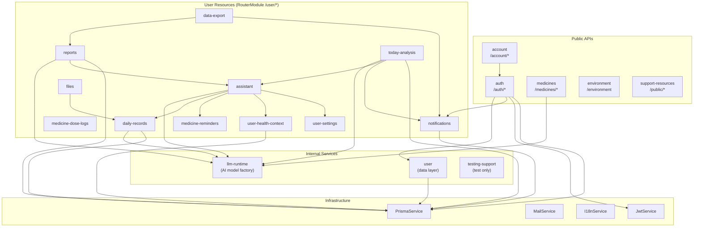
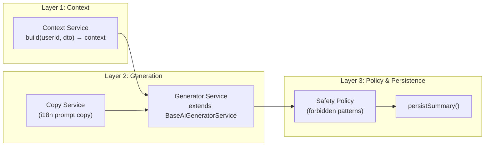

# Lucent Architecture

## Module Dependency Graph



## AI Pipeline Architecture

All AI analysis modules follow a three-layer pattern:



### Implementations

| Module                | Context                              | Generator                             | Model Role |
| --------------------- | ------------------------------------ | ------------------------------------- | ---------- |
| ReportsAiSummary      | ReportsAiSummaryContextService       | ReportsAiSummaryGeneratorService      | `analysis` |
| TodayAnalysis         | TodayAnalysisContextService          | TodayAnalysisGeneratorService         | `analysis` |
| DailyRecordCandidates | (inline in service)                  | DailyRecordCandidatesGeneratorService | `language` |
| Assistant             | (chat-based, different architecture) | —                                     | `chat`     |

## Directory Structure Convention

See `AGENTS.md` → Module Subdirectory Whitelist for the complete governance rules.

```
src/modules/{module}/
├── dto/               # Data Transfer Objects (must have index.ts)
│   └── index.ts       # Barrel export
├── services/          # All business-logic services
│   ├── {module}.service.ts
│   ├── {module}-mapper.service.ts  # Mapper convention
│   └── ownership.service.ts        # Ownership verification convention
├── guards/            # NestJS Guards (only .guard.ts, CanActivate)
├── config/            # Module-level configuration (extended)
├── types/             # Module-level TypeScript types (extended)
├── {module}.controller.ts
└── {module}.module.ts
```

## API Route Architecture

Routes are configured via `RouterModule` in `AppModule`. Controllers declare bare resource paths; the prefix is centralized.

| Prefix         | Modules                                                                                                                                                | Via                                               |
| -------------- | ------------------------------------------------------------------------------------------------------------------------------------------------------ | ------------------------------------------------- |
| `/auth/*`      | auth                                                                                                                                                   | Controller `@Controller('auth')`                  |
| `/account/*`   | account                                                                                                                                                | Controller `@Controller('account')`               |
| `/medicines/*` | medicines                                                                                                                                              | Controller `@Controller('medicines')`             |
| `/environment` | environment                                                                                                                                            | Controller `@Controller('environment')`           |
| `/public/*`    | support-resources                                                                                                                                      | Controller `@Controller('public')`                |
| `/testing/*`   | testing-support                                                                                                                                        | Controller `@Controller('testing/fullstack-e2e')` |
| `/user/*`      | assistant, daily-records, data-export, files, health-context, medicine-dose-logs, medicine-reminders, notifications, reports, settings, today-analysis | `RouterModule.register()`                         |

## Error Handling

All error responses use `api-errors.ts` helpers (`notFound`, `badRequest`, `unauthorized`, `forbidden`, `conflict`) with i18n keys. The global envelope is `{ code: ResultCode, message: string, data?: T }`.

## Database

- **ORM**: Prisma 7 (client provider: `prisma-client`)
- **Schema**: `prisma/schema.prisma`
- **Generated client**: `src/generated/prisma/`
- **Key conventions**: `@map()` for snake_case columns, `@db.Timestamptz(3)` for timestamps, soft-delete via `deletedAt`
