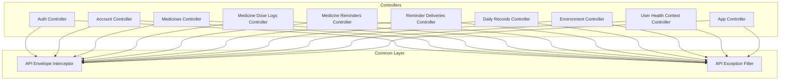
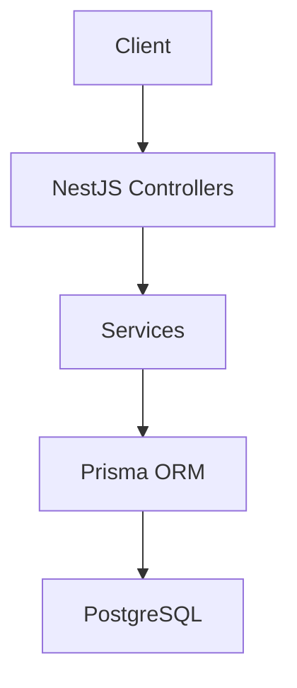
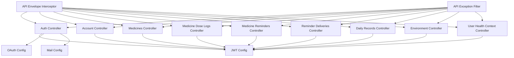

# API Documentation

<cite>
**Referenced Files in This Document**
- [openapi.json](file://Lucent/docs/openapi.json)
- [auth.controller.ts](file://Lucent/src/modules/auth/auth.controller.ts)
- [account.controller.ts](file://Lucent/src/modules/account/account.controller.ts)
- [medicines.controller.ts](file://Lucent/src/modules/medicines/medicines.controller.ts)
- [medicine-dose-logs.controller.ts](file://Lucent/src/modules/medicine-dose-logs/medicine-dose-logs.controller.ts)
- [medicine-reminders.controller.ts](file://Lucent/src/modules/medicine-reminders/medicine-reminders.controller.ts)
- [reminder-deliveries.controller.ts](file://Lucent/src/modules/medicine-reminders/reminder-deliveries.controller.ts)
- [daily-records.controller.ts](file://Lucent/src/modules/daily-records/daily-records.controller.ts)
- [environment.controller.ts](file://Lucent/src/modules/environment/environment.controller.ts)
- [user-health-context.controller.ts](file://Lucent/src/modules/user-health-context/user-health-context.controller.ts)
- [app.controller.ts](file://Lucent/src/app.controller.ts)
- [api-envelope.interceptor.ts](file://Lucent/src/common/interceptors/api-envelope.interceptor.ts)
- [api-exception.filter.ts](file://Lucent/src/common/filters/api-exception.filter.ts)
- [jwt.config.ts](file://Lucent/src/config/jwt.config.ts)
- [oauth.config.ts](file://Lucent/src/config/oauth.config.ts)
- [mail.config.ts](file://Lucent/src/config/mail.config.ts)
- [export-openapi.js](file://Lucent/scripts/export-openapi.js)
- [opencollection.yml](file://Lucent/lucent-bruno/opencollection.yml)
- [dev.yml](file://Lucent/lucent-bruno/environments/dev.yml)
- [prod.yml](file://Lucent/lucent-bruno/environments/prod.yml)
- [schema.prisma](file://Lucent/prisma/schema.prisma)
</cite>

## Table of Contents
1. [Introduction](#introduction)
2. [Project Structure](#project-structure)
3. [Core Components](#core-components)
4. [Architecture Overview](#architecture-overview)
5. [Detailed Component Analysis](#detailed-component-analysis)
6. [Dependency Analysis](#dependency-analysis)
7. [Performance Considerations](#performance-considerations)
8. [Troubleshooting Guide](#troubleshooting-guide)
9. [Conclusion](#conclusion)
10. [Appendices](#appendices)

## Introduction
This document provides comprehensive API documentation for the Lumos REST API. It covers HTTP methods, URL patterns, request/response schemas, authentication requirements, and operational policies for public endpoints. The documentation is derived from the OpenAPI specification and the NestJS backend implementation, ensuring accuracy and completeness.

Key topics include:
- Authentication APIs (login, registration, token refresh, logout, verification)
- Medication management APIs (medicines catalog, dose logs, reminders)
- Health data APIs (daily records, environment data, user health context)
- User management APIs (account updates, profile retrieval)
- Administrative functions and operational controls
- OpenAPI specification compliance, endpoint categorization, and rate limiting policies
- Practical examples, integration guidelines, versioning, backward compatibility, deprecation policies, and client implementation guidance

## Project Structure
The API surface is organized around feature modules under the NestJS application. Controllers expose REST endpoints grouped by domain:
- Authentication module
- Account management module
- Medicines module
- Medicine dose logs module
- Medicine reminders module (including reminder deliveries)
- Daily records module
- Environment module
- User health context module
- Application-wide envelope interceptor and exception filter

**Diagram sources**
- [auth.controller.ts](file://Lucent/src/modules/auth/auth.controller.ts)
- [account.controller.ts](file://Lucent/src/modules/account/account.controller.ts)
- [medicines.controller.ts](file://Lucent/src/modules/medicines/medicines.controller.ts)
- [medicine-dose-logs.controller.ts](file://Lucent/src/modules/medicine-dose-logs/medicine-dose-logs.controller.ts)
- [medicine-reminders.controller.ts](file://Lucent/src/modules/medicine-reminders/medicine-reminders.controller.ts)
- [reminder-deliveries.controller.ts](file://Lucent/src/modules/medicine-reminders/reminder-deliveries.controller.ts)
- [daily-records.controller.ts](file://Lucent/src/modules/daily-records/daily-records.controller.ts)
- [environment.controller.ts](file://Lucent/src/modules/environment/environment.controller.ts)
- [user-health-context.controller.ts](file://Lucent/src/modules/user-health-context/user-health-context.controller.ts)
- [app.controller.ts](file://Lucent/src/app.controller.ts)
- [api-envelope.interceptor.ts](file://Lucent/src/common/interceptors/api-envelope.interceptor.ts)
- [api-exception.filter.ts](file://Lucent/src/common/filters/api-exception.filter.ts)

**Section sources**
- [auth.controller.ts](file://Lucent/src/modules/auth/auth.controller.ts)
- [account.controller.ts](file://Lucent/src/modules/account/account.controller.ts)
- [medicines.controller.ts](file://Lucent/src/modules/medicines/medicines.controller.ts)
- [medicine-dose-logs.controller.ts](file://Lucent/src/modules/medicine-dose-logs/medicine-dose-logs.controller.ts)
- [medicine-reminders.controller.ts](file://Lucent/src/modules/medicine-reminders/medicine-reminders.controller.ts)
- [reminder-deliveries.controller.ts](file://Lucent/src/modules/medicine-reminders/reminder-deliveries.controller.ts)
- [daily-records.controller.ts](file://Lucent/src/modules/daily-records/daily-records.controller.ts)
- [environment.controller.ts](file://Lucent/src/modules/environment/environment.controller.ts)
- [user-health-context.controller.ts](file://Lucent/src/modules/user-health-context/user-health-context.controller.ts)
- [app.controller.ts](file://Lucent/src/app.controller.ts)
- [api-envelope.interceptor.ts](file://Lucent/src/common/interceptors/api-envelope.interceptor.ts)
- [api-exception.filter.ts](file://Lucent/src/common/filters/api-exception.filter.ts)

## Core Components
This section outlines the foundational elements that govern API behavior across all endpoints.

- API Envelope Interceptor: Wraps all successful responses in a standardized envelope structure, ensuring consistent response shape regardless of the underlying controller logic.
- API Exception Filter: Centralizes error handling, translating exceptions into structured error responses with appropriate HTTP status codes.
- JWT Configuration: Defines token signing, expiration, and audience claims used by authentication flows.
- OAuth Configuration: Provides provider-specific settings for third-party authentication integrations.
- Mail Configuration: Controls transactional email delivery for verification and notifications.

These components collectively enforce response consistency, robust error handling, secure authentication, and reliable communication channels.

**Section sources**
- [api-envelope.interceptor.ts](file://Lucent/src/common/interceptors/api-envelope.interceptor.ts)
- [api-exception.filter.ts](file://Lucent/src/common/filters/api-exception.filter.ts)
- [jwt.config.ts](file://Lucent/src/config/jwt.config.ts)
- [oauth.config.ts](file://Lucent/src/config/oauth.config.ts)
- [mail.config.ts](file://Lucent/src/config/mail.config.ts)

## Architecture Overview
The API follows a layered architecture:
- Presentation: Controllers define HTTP endpoints and route requests.
- Application: Services encapsulate business logic and orchestrate operations.
- Persistence: Prisma ORM manages database interactions.
- Cross-cutting: Interceptors and filters apply cross-cutting concerns uniformly.

**Diagram sources**
- [auth.controller.ts](file://Lucent/src/modules/auth/auth.controller.ts)
- [account.controller.ts](file://Lucent/src/modules/account/account.controller.ts)
- [medicines.controller.ts](file://Lucent/src/modules/medicines/medicines.controller.ts)
- [medicine-dose-logs.controller.ts](file://Lucent/src/modules/medicine-dose-logs/medicine-dose-logs.controller.ts)
- [medicine-reminders.controller.ts](file://Lucent/src/modules/medicine-reminders/medicine-reminders.controller.ts)
- [reminder-deliveries.controller.ts](file://Lucent/src/modules/medicine-reminders/reminder-deliveries.controller.ts)
- [daily-records.controller.ts](file://Lucent/src/modules/daily-records/daily-records.controller.ts)
- [environment.controller.ts](file://Lucent/src/modules/environment/environment.controller.ts)
- [user-health-context.controller.ts](file://Lucent/src/modules/user-health-context/user-health-context.controller.ts)
- [schema.prisma](file://Lucent/prisma/schema.prisma)

## Detailed Component Analysis

### Authentication APIs
Endpoints for user authentication and session management.

- POST /auth/register
  - Purpose: Register a new user account.
  - Authentication: Not required.
  - Request body: Registration DTO (fields defined in OpenAPI).
  - Responses:
    - 201 Created: Registration successful.
    - 400 Bad Request: Validation errors.
    - 409 Conflict: Duplicate identifier.
    - 500 Internal Server Error: Unexpected failure.
  - Notes: Typically requires email verification before login.

- POST /auth/login
  - Purpose: Authenticate user and issue tokens.
  - Authentication: Not required.
  - Request body: Login DTO (credentials).
  - Responses:
    - 200 OK: Login successful with tokens.
    - 401 Unauthorized: Invalid credentials.
    - 429 Too Many Requests: Rate limit exceeded.
    - 500 Internal Server Error: Unexpected failure.

- POST /auth/logout
  - Purpose: Invalidate current session.
  - Authentication: Required (Bearer).
  - Request body: Logout DTO.
  - Responses:
    - 200 OK: Logout successful.
    - 401 Unauthorized: Invalid or missing token.
    - 500 Internal Server Error: Unexpected failure.

- POST /auth/refresh
  - Purpose: Issue a new access token using a refresh token.
  - Authentication: Not required.
  - Request body: Refresh DTO.
  - Responses:
    - 200 OK: New tokens issued.
    - 401 Unauthorized: Invalid or expired refresh token.
    - 429 Too Many Requests: Rate limit exceeded.
    - 500 Internal Server Error: Unexpected failure.

- POST /auth/forgot-password
  - Purpose: Initiate password reset process.
  - Authentication: Not required.
  - Request body: Forgot Password DTO.
  - Responses:
    - 200 OK: Reset initiated.
    - 404 Not Found: User not found.
    - 429 Too Many Requests: Rate limit exceeded.
    - 500 Internal Server Error: Unexpected failure.

- POST /auth/reset-password
  - Purpose: Complete password reset.
  - Authentication: Not required.
  - Request body: Reset Password DTO.
  - Responses:
    - 200 OK: Password updated.
    - 400 Bad Request: Invalid or expired reset token.
    - 500 Internal Server Error: Unexpected failure.

- GET /auth/me
  - Purpose: Retrieve currently authenticated user profile.
  - Authentication: Required (Bearer).
  - Responses:
    - 200 OK: User profile data.
    - 401 Unauthorized: Invalid or missing token.
    - 404 Not Found: User not found.
    - 500 Internal Server Error: Unexpected failure.

- PATCH /auth/me
  - Purpose: Update current user profile.
  - Authentication: Required (Bearer).
  - Request body: Update Account DTO.
  - Responses:
    - 200 OK: Profile updated.
    - 400 Bad Request: Validation errors.
    - 401 Unauthorized: Invalid or missing token.
    - 409 Conflict: Duplicate identifier.
    - 500 Internal Server Error: Unexpected failure.

- POST /auth/change-password
  - Purpose: Change current password.
  - Authentication: Required (Bearer).
  - Request body: Change Password DTO.
  - Responses:
    - 200 OK: Password changed.
    - 400 Bad Request: Invalid current password.
    - 401 Unauthorized: Invalid or missing token.
    - 500 Internal Server Error: Unexpected failure.

- POST /auth/send-verification-code
  - Purpose: Send a verification code for email/mobile.
  - Authentication: Required (Bearer).
  - Request body: Send Verification Code DTO.
  - Responses:
    - 200 OK: Code sent.
    - 400 Bad Request: Invalid target or channel.
    - 429 Too Many Requests: Rate limit exceeded.
    - 500 Internal Server Error: Unexpected failure.

- POST /auth/verify-email
  - Purpose: Verify email address using code.
  - Authentication: Required (Bearer).
  - Request body: Verify Email DTO.
  - Responses:
    - 200 OK: Email verified.
    - 400 Bad Request: Invalid or expired code.
    - 401 Unauthorized: Invalid or missing token.
    - 500 Internal Server Error: Unexpected failure.

- POST /auth/oauth/authorize
  - Purpose: Redirect user to OAuth provider.
  - Authentication: Not required.
  - Request body: OAuth Authorize DTO.
  - Responses:
    - 302 Found: Redirect to provider.
    - 400 Bad Request: Invalid provider or state.
    - 500 Internal Server Error: Provider configuration error.

- GET /auth/oauth/callback
  - Purpose: Handle OAuth callback and log in user.
  - Authentication: Not required.
  - Query parameters: OAuth callback DTO.
  - Responses:
    - 302 Found: Redirect to frontend with tokens.
    - 400 Bad Request: Invalid code/state.
    - 500 Internal Server Error: Provider error.

**Section sources**
- [auth.controller.ts](file://Lucent/src/modules/auth/auth.controller.ts)
- [openapi.json](file://Lucent/docs/openapi.json)

### Medication Management APIs

#### Medicines Catalog
- GET /medicines
  - Purpose: Search and list medicines.
  - Authentication: Required (Bearer).
  - Query parameters: Search DTO (filters, pagination).
  - Responses:
    - 200 OK: Paginated results.
    - 400 Bad Request: Invalid filters.
    - 401 Unauthorized: Invalid or missing token.
    - 500 Internal Server Error: Unexpected failure.

- GET /medicines/{id}
  - Purpose: Retrieve detailed medicine information.
  - Authentication: Required (Bearer).
  - Path parameters: Medicine ID.
  - Responses:
    - 200 OK: Medicine detail.
    - 404 Not Found: Medicine not found.
    - 401 Unauthorized: Invalid or missing token.
    - 500 Internal Server Error: Unexpected failure.

#### Medicine Dose Logs
- GET /medicine-dose-logs
  - Purpose: List user's medication dose logs.
  - Authentication: Required (Bearer).
  - Query parameters: Pagination and filters.
  - Responses:
    - 200 OK: Dose log list.
    - 400 Bad Request: Invalid filters.
    - 401 Unauthorized: Invalid or missing token.
    - 500 Internal Server Error: Unexpected failure.

- POST /medicine-dose-logs
  - Purpose: Record a new dose log.
  - Authentication: Required (Bearer).
  - Request body: Create Dose Log DTO.
  - Responses:
    - 201 Created: Dose log created.
    - 400 Bad Request: Validation errors.
    - 401 Unauthorized: Invalid or missing token.
    - 500 Internal Server Error: Unexpected failure.

- GET /medicine-dose-logs/{id}
  - Purpose: Retrieve a specific dose log.
  - Authentication: Required (Bearer).
  - Path parameters: Dose log ID.
  - Responses:
    - 200 OK: Dose log data.
    - 404 Not Found: Dose log not found.
    - 401 Unauthorized: Invalid or missing token.
    - 500 Internal Server Error: Unexpected failure.

- PUT /medicine-dose-logs/{id}
  - Purpose: Update a dose log.
  - Authentication: Required (Bearer).
  - Path parameters: Dose log ID.
  - Request body: Update Dose Log DTO.
  - Responses:
    - 200 OK: Updated successfully.
    - 400 Bad Request: Validation errors.
    - 401 Unauthorized: Invalid or missing token.
    - 404 Not Found: Dose log not found.
    - 500 Internal Server Error: Unexpected failure.

- DELETE /medicine-dose-logs/{id}
  - Purpose: Remove a dose log.
  - Authentication: Required (Bearer).
  - Path parameters: Dose log ID.
  - Responses:
    - 200 OK: Deleted successfully.
    - 401 Unauthorized: Invalid or missing token.
    - 404 Not Found: Dose log not found.
    - 500 Internal Server Error: Unexpected failure.

#### Medicine Reminders
- GET /medicine-reminders
  - Purpose: List user's medication reminders.
  - Authentication: Required (Bearer).
  - Query parameters: Filters and pagination.
  - Responses:
    - 200 OK: Reminder list.
    - 400 Bad Request: Invalid filters.
    - 401 Unauthorized: Invalid or missing token.
    - 500 Internal Server Error: Unexpected failure.

- POST /medicine-reminders
  - Purpose: Create a new reminder.
  - Authentication: Required (Bearer).
  - Request body: Create Medicine Reminder DTO.
  - Responses:
    - 201 Created: Reminder created.
    - 400 Bad Request: Validation errors.
    - 401 Unauthorized: Invalid or missing token.
    - 500 Internal Server Error: Unexpected failure.

- GET /medicine-reminders/{id}
  - Purpose: Retrieve a specific reminder.
  - Authentication: Required (Bearer).
  - Path parameters: Reminder ID.
  - Responses:
    - 200 OK: Reminder data.
    - 404 Not Found: Reminder not found.
    - 401 Unauthorized: Invalid or missing token.
    - 500 Internal Server Error: Unexpected failure.

- PUT /medicine-reminders/{id}
  - Purpose: Update a reminder.
  - Authentication: Required (Bearer).
  - Path parameters: Reminder ID.
  - Request body: Update Medicine Reminder DTO.
  - Responses:
    - 200 OK: Updated successfully.
    - 400 Bad Request: Validation errors.
    - 401 Unauthorized: Invalid or missing token.
    - 404 Not Found: Reminder not found.
    - 500 Internal Server Error: Unexpected failure.

- DELETE /medicine-reminders/{id}
  - Purpose: Remove a reminder.
  - Authentication: Required (Bearer).
  - Path parameters: Reminder ID.
  - Responses:
    - 200 OK: Deleted successfully.
    - 401 Unauthorized: Invalid or missing token.
    - 404 Not Found: Reminder not found.
    - 500 Internal Server Error: Unexpected failure.

#### Reminder Deliveries
- GET /reminder-deliveries
  - Purpose: List upcoming reminder delivery events.
  - Authentication: Required (Bearer).
  - Query parameters: Date range and filters.
  - Responses:
    - 200 OK: Delivery list.
    - 400 Bad Request: Invalid date range.
    - 401 Unauthorized: Invalid or missing token.
    - 500 Internal Server Error: Unexpected failure.

**Section sources**
- [medicines.controller.ts](file://Lucent/src/modules/medicines/medicines.controller.ts)
- [medicine-dose-logs.controller.ts](file://Lucent/src/modules/medicine-dose-logs/medicine-dose-logs.controller.ts)
- [medicine-reminders.controller.ts](file://Lucent/src/modules/medicine-reminders/medicine-reminders.controller.ts)
- [reminder-deliveries.controller.ts](file://Lucent/src/modules/medicine-reminders/reminder-deliveries.controller.ts)
- [openapi.json](file://Lucent/docs/openapi.json)

### Health Data APIs

#### Daily Records
- GET /daily-records
  - Purpose: List user's daily records.
  - Authentication: Required (Bearer).
  - Query parameters: Filters and pagination.
  - Responses:
    - 200 OK: Record list.
    - 400 Bad Request: Invalid filters.
    - 401 Unauthorized: Invalid or missing token.
    - 500 Internal Server Error: Unexpected failure.

- POST /daily-records
  - Purpose: Create a new daily record.
  - Authentication: Required (Bearer).
  - Request body: Create Daily Record DTO.
  - Responses:
    - 201 Created: Record created.
    - 400 Bad Request: Validation errors.
    - 401 Unauthorized: Invalid or missing token.
    - 500 Internal Server Error: Unexpected failure.

- GET /daily-records/{id}
  - Purpose: Retrieve a specific daily record.
  - Authentication: Required (Bearer).
  - Path parameters: Record ID.
  - Responses:
    - 200 OK: Record data.
    - 404 Not Found: Record not found.
    - 401 Unauthorized: Invalid or missing token.
    - 500 Internal Server Error: Unexpected failure.

- PUT /daily-records/{id}
  - Purpose: Update a daily record.
  - Authentication: Required (Bearer).
  - Path parameters: Record ID.
  - Request body: Update Daily Record DTO.
  - Responses:
    - 200 OK: Updated successfully.
    - 400 Bad Request: Validation errors.
    - 401 Unauthorized: Invalid or missing token.
    - 404 Not Found: Record not found.
    - 500 Internal Server Error: Unexpected failure.

- DELETE /daily-records/{id}
  - Purpose: Remove a daily record.
  - Authentication: Required (Bearer).
  - Path parameters: Record ID.
  - Responses:
    - 200 OK: Deleted successfully.
    - 401 Unauthorized: Invalid or missing token.
    - 404 Not Found: Record not found.
    - 500 Internal Server Error: Unexpected failure.

- POST /daily-records/{id}/attachments
  - Purpose: Upload an attachment for a daily record.
  - Authentication: Required (Bearer).
  - Path parameters: Record ID.
  - Request body: Daily Record Attachment Input DTO.
  - Responses:
    - 200 OK: Attachment uploaded.
    - 400 Bad Request: Invalid file type or size.
    - 401 Unauthorized: Invalid or missing token.
    - 404 Not Found: Record not found.
    - 500 Internal Server Error: Unexpected failure.

- GET /daily-records/summary
  - Purpose: Get summary statistics for daily records.
  - Authentication: Required (Bearer).
  - Query parameters: Date range and filters.
  - Responses:
    - 200 OK: Summary data.
    - 400 Bad Request: Invalid date range.
    - 401 Unauthorized: Invalid or missing token.
    - 500 Internal Server Error: Unexpected failure.

#### Environment Data
- GET /environment/snapshot
  - Purpose: Retrieve current environment conditions.
  - Authentication: Required (Bearer).
  - Query parameters: Location coordinates and filters.
  - Responses:
    - 200 OK: Environment snapshot.
    - 400 Bad Request: Invalid coordinates.
    - 401 Unauthorized: Invalid or missing token.
    - 500 Internal Server Error: Unexpected failure.

- GET /environment/references
  - Purpose: Retrieve environment quality references.
  - Authentication: Required (Bearer).
  - Responses:
    - 200 OK: Reference data.
    - 401 Unauthorized: Invalid or missing token.
    - 500 Internal Server Error: Unexpected failure.

#### User Health Context
- GET /user-health-context
  - Purpose: Retrieve user's health context (allergies, conditions).
  - Authentication: Required (Bearer).
  - Responses:
    - 200 OK: Health context data.
    - 401 Unauthorized: Invalid or missing token.
    - 500 Internal Server Error: Unexpected failure.

- POST /user-health-context/allergies
  - Purpose: Add a new allergy entry.
  - Authentication: Required (Bearer).
  - Request body: Create Health Context Allergy DTO.
  - Responses:
    - 201 Created: Allergy added.
    - 400 Bad Request: Validation errors.
    - 401 Unauthorized: Invalid or missing token.
    - 500 Internal Server Error: Unexpected failure.

- PUT /user-health-context/allergies/{id}
  - Purpose: Update an allergy entry.
  - Authentication: Required (Bearer).
  - Path parameters: Allergy ID.
  - Request body: Update Health Context Allergy DTO.
  - Responses:
    - 200 OK: Updated successfully.
    - 400 Bad Request: Validation errors.
    - 401 Unauthorized: Invalid or missing token.
    - 404 Not Found: Allergy not found.
    - 500 Internal Server Error: Unexpected failure.

- DELETE /user-health-context/allergies/{id}
  - Purpose: Remove an allergy entry.
  - Authentication: Required (Bearer).
  - Path parameters: Allergy ID.
  - Responses:
    - 200 OK: Deleted successfully.
    - 401 Unauthorized: Invalid or missing token.
    - 404 Not Found: Allergy not found.
    - 500 Internal Server Error: Unexpected failure.

- POST /user-health-context/conditions
  - Purpose: Add a new condition entry.
  - Authentication: Required (Bearer).
  - Request body: Create Health Context Condition DTO.
  - Responses:
    - 201 Created: Condition added.
    - 400 Bad Request: Validation errors.
    - 401 Unauthorized: Invalid or missing token.
    - 500 Internal Server Error: Unexpected failure.

- PUT /user-health-context/conditions/{id}
  - Purpose: Update a condition entry.
  - Authentication: Required (Bearer).
  - Path parameters: Condition ID.
  - Request body: Update Health Context Condition DTO.
  - Responses:
    - 200 OK: Updated successfully.
    - 400 Bad Request: Validation errors.
    - 401 Unauthorized: Invalid or missing token.
    - 404 Not Found: Condition not found.
    - 500 Internal Server Error: Unexpected failure.

- DELETE /user-health-context/conditions/{id}
  - Purpose: Remove a condition entry.
  - Authentication: Required (Bearer).
  - Path parameters: Condition ID.
  - Responses:
    - 200 OK: Deleted successfully.
    - 401 Unauthorized: Invalid or missing token.
    - 404 Not Found: Condition not found.
    - 500 Internal Server Error: Unexpected failure.

- PUT /user-health-context/profile
  - Purpose: Update user health profile.
  - Authentication: Required (Bearer).
  - Request body: Update Health Context Profile DTO.
  - Responses:
    - 200 OK: Profile updated.
    - 400 Bad Request: Validation errors.
    - 401 Unauthorized: Invalid or missing token.
    - 500 Internal Server Error: Unexpected failure.

**Section sources**
- [daily-records.controller.ts](file://Lucent/src/modules/daily-records/daily-records.controller.ts)
- [environment.controller.ts](file://Lucent/src/modules/environment/environment.controller.ts)
- [user-health-context.controller.ts](file://Lucent/src/modules/user-health-context/user-health-context.controller.ts)
- [openapi.json](file://Lucent/docs/openapi.json)

### User Management APIs
- PATCH /account
  - Purpose: Update account settings and preferences.
  - Authentication: Required (Bearer).
  - Request body: Update Account DTO.
  - Responses:
    - 200 OK: Account updated.
    - 400 Bad Request: Validation errors.
    - 401 Unauthorized: Invalid or missing token.
    - 409 Conflict: Duplicate identifier.
    - 500 Internal Server Error: Unexpected failure.

- GET /account
  - Purpose: Retrieve account information.
  - Authentication: Required (Bearer).
  - Responses:
    - 200 OK: Account data.
    - 401 Unauthorized: Invalid or missing token.
    - 404 Not Found: Account not found.
    - 500 Internal Server Error: Unexpected failure.

- DELETE /account
  - Purpose: Deactivate account.
  - Authentication: Required (Bearer).
  - Request body: Delete Account DTO.
  - Responses:
    - 200 OK: Account deactivated.
    - 400 Bad Request: Validation errors.
    - 401 Unauthorized: Invalid or missing token.
    - 500 Internal Server Error: Unexpected failure.

**Section sources**
- [account.controller.ts](file://Lucent/src/modules/account/account.controller.ts)
- [openapi.json](file://Lucent/docs/openapi.json)

### Administrative Functions
- GET /
  - Purpose: Basic health check endpoint.
  - Authentication: Not required.
  - Responses:
    - 200 OK: Service reachable.
    - 500 Internal Server Error: Service unhealthy.

Administrative endpoints may also be exposed via the admin interface; consult the admin setup for additional routes.

**Section sources**
- [app.controller.ts](file://Lucent/src/app.controller.ts)

## Dependency Analysis
The API depends on shared configuration and infrastructure components that standardize behavior across all endpoints.

**Diagram sources**
- [auth.controller.ts](file://Lucent/src/modules/auth/auth.controller.ts)
- [account.controller.ts](file://Lucent/src/modules/account/account.controller.ts)
- [medicines.controller.ts](file://Lucent/src/modules/medicines/medicines.controller.ts)
- [medicine-dose-logs.controller.ts](file://Lucent/src/modules/medicine-dose-logs/medicine-dose-logs.controller.ts)
- [medicine-reminders.controller.ts](file://Lucent/src/modules/medicine-reminders/medicine-reminders.controller.ts)
- [reminder-deliveries.controller.ts](file://Lucent/src/modules/medicine-reminders/reminder-deliveries.controller.ts)
- [daily-records.controller.ts](file://Lucent/src/modules/daily-records/daily-records.controller.ts)
- [environment.controller.ts](file://Lucent/src/modules/environment/environment.controller.ts)
- [user-health-context.controller.ts](file://Lucent/src/modules/user-health-context/user-health-context.controller.ts)
- [jwt.config.ts](file://Lucent/src/config/jwt.config.ts)
- [oauth.config.ts](file://Lucent/src/config/oauth.config.ts)
- [mail.config.ts](file://Lucent/src/config/mail.config.ts)
- [api-envelope.interceptor.ts](file://Lucent/src/common/interceptors/api-envelope.interceptor.ts)
- [api-exception.filter.ts](file://Lucent/src/common/filters/api-exception.filter.ts)

**Section sources**
- [jwt.config.ts](file://Lucent/src/config/jwt.config.ts)
- [oauth.config.ts](file://Lucent/src/config/oauth.config.ts)
- [mail.config.ts](file://Lucent/src/config/mail.config.ts)
- [api-envelope.interceptor.ts](file://Lucent/src/common/interceptors/api-envelope.interceptor.ts)
- [api-exception.filter.ts](file://Lucent/src/common/filters/api-exception.filter.ts)

## Performance Considerations
- Response Envelope: All successful responses are wrapped in a consistent envelope, reducing client-side parsing overhead and enabling uniform error handling.
- Exception Filtering: Centralized error handling ensures predictable error responses and minimizes redundant error-checking logic in controllers.
- Pagination: Many list endpoints support pagination to prevent large payloads and improve responsiveness.
- Caching: Consider caching frequently accessed static data (e.g., environment references) to reduce database load.
- Rate Limiting: Implement rate limiting at the gateway or controller level to protect against abuse and ensure fair usage.

[No sources needed since this section provides general guidance]

## Troubleshooting Guide
- 400 Bad Request: Indicates invalid input or malformed request. Review request body and query parameters against the OpenAPI schema.
- 401 Unauthorized: Token missing, invalid, or expired. Re-authenticate or refresh the access token.
- 403 Forbidden: Insufficient permissions for the requested operation.
- 404 Not Found: Resource does not exist or user not found.
- 409 Conflict: Data conflict (e.g., duplicate identifiers).
- 429 Too Many Requests: Rate limit exceeded; retry after the specified window.
- 500 Internal Server Error: Unexpected server error; check server logs and retry.

Operational tips:
- Use the envelope structure to distinguish between data and metadata.
- Leverage OpenAPI-generated clients for type-safe interactions.
- Monitor audit logs for failed attempts and anomalies.

**Section sources**
- [api-exception.filter.ts](file://Lucent/src/common/filters/api-exception.filter.ts)
- [openapi.json](file://Lucent/docs/openapi.json)

## Conclusion
This documentation consolidates the Lumos REST API surface, authentication flows, and operational policies. By adhering to the OpenAPI specification and leveraging the shared interceptor and filter layers, clients can integrate reliably and efficiently. For production deployments, ensure proper rate limiting, monitoring, and secure token handling.

[No sources needed since this section summarizes without analyzing specific files]

## Appendices

### OpenAPI Specification Compliance
- The API conforms to OpenAPI 3.0.3.
- All endpoints, schemas, and examples are defined in the OpenAPI document.
- Use the OpenAPI document to generate clients and validate implementations.

**Section sources**
- [openapi.json](file://Lucent/docs/openapi.json)

### Endpoint Categorization
- Authentication: Registration, login, logout, token refresh, password reset, verification, OAuth.
- Medications: Medicines catalog, dose logs, reminders, reminder deliveries.
- Health Data: Daily records, attachments, summaries, environment snapshots, health context.
- User Management: Account updates, profile retrieval, account deletion.
- Administrative: Health check endpoint.

**Section sources**
- [auth.controller.ts](file://Lucent/src/modules/auth/auth.controller.ts)
- [medicines.controller.ts](file://Lucent/src/modules/medicines/medicines.controller.ts)
- [medicine-dose-logs.controller.ts](file://Lucent/src/modules/medicine-dose-logs/medicine-dose-logs.controller.ts)
- [medicine-reminders.controller.ts](file://Lucent/src/modules/medicine-reminders/medicine-reminders.controller.ts)
- [reminder-deliveries.controller.ts](file://Lucent/src/modules/medicine-reminders/reminder-deliveries.controller.ts)
- [daily-records.controller.ts](file://Lucent/src/modules/daily-records/daily-records.controller.ts)
- [environment.controller.ts](file://Lucent/src/modules/environment/environment.controller.ts)
- [user-health-context.controller.ts](file://Lucent/src/modules/user-health-context/user-health-context.controller.ts)
- [account.controller.ts](file://Lucent/src/modules/account/account.controller.ts)
- [app.controller.ts](file://Lucent/src/app.controller.ts)

### Rate Limiting Policies
- Apply per-endpoint or global limits based on deployment needs.
- Return standard 429 responses with Retry-After header when limits are exceeded.
- Consider burst protection and sliding window strategies.

[No sources needed since this section provides general guidance]

### API Versioning and Compatibility
- Version endpoints via base path (e.g., /v1) or Accept-Version header.
- Maintain backward compatibility during transitions; mark deprecated endpoints with appropriate status codes and timelines.
- Communicate breaking changes with release notes and migration guides.

[No sources needed since this section provides general guidance]

### Deprecation Policies
- Clearly mark deprecated endpoints with a deprecation notice and sunset date.
- Provide migration paths and alternative endpoints.
- Support both old and new versions for a defined grace period.

[No sources needed since this section provides general guidance]

### Practical Examples and Integration Guidelines
- Use the OpenAPI collection for interactive testing and environment configuration.
- Configure development and production environments with dedicated URLs and credentials.
- Generate SDKs from the OpenAPI document for type-safe integrations.

**Section sources**
- [opencollection.yml](file://Lucent/lucent-bruno/opencollection.yml)
- [dev.yml](file://Lucent/lucent-bruno/environments/dev.yml)
- [prod.yml](file://Lucent/lucent-bruno/environments/prod.yml)
- [export-openapi.js](file://Lucent/scripts/export-openapi.js)

### Client Implementation Examples and SDK Usage
- Generate clients from the OpenAPI document using official generator tools.
- Implement token storage securely (e.g., secure HTTP-only cookies or encrypted local storage).
- Handle token refresh automatically before expiration.
- Use environment-aware configurations for seamless switching between dev and prod.

**Section sources**
- [openapi.json](file://Lucent/docs/openapi.json)
- [export-openapi.js](file://Lucent/scripts/export-openapi.js)