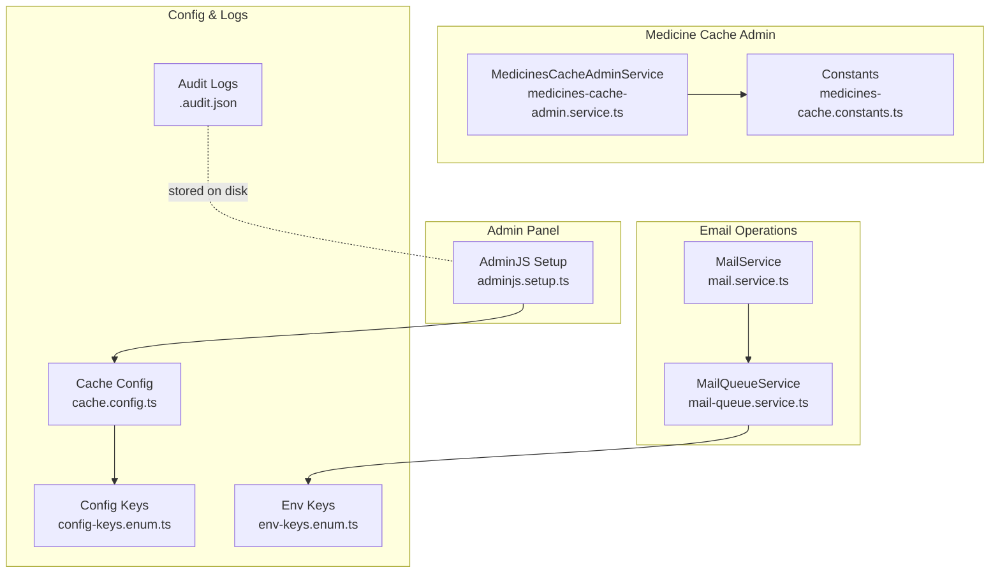
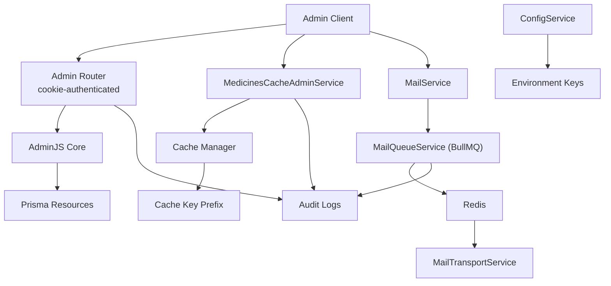
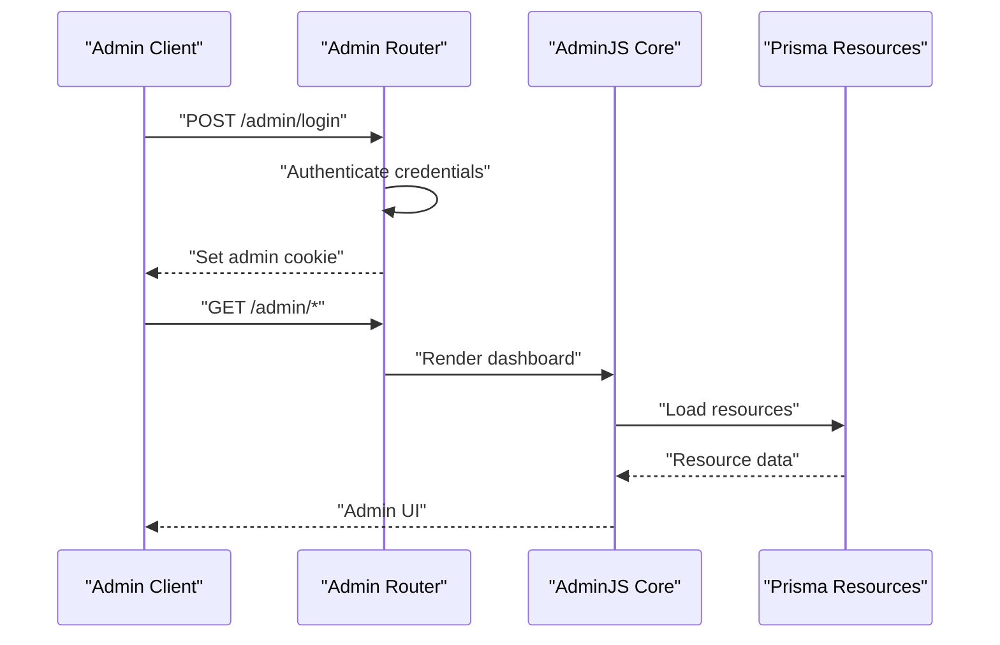
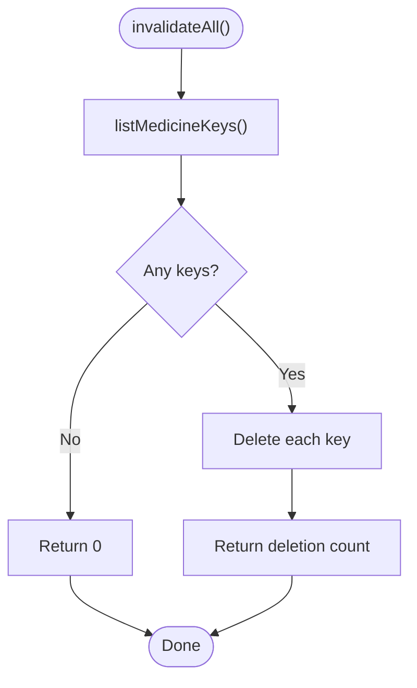
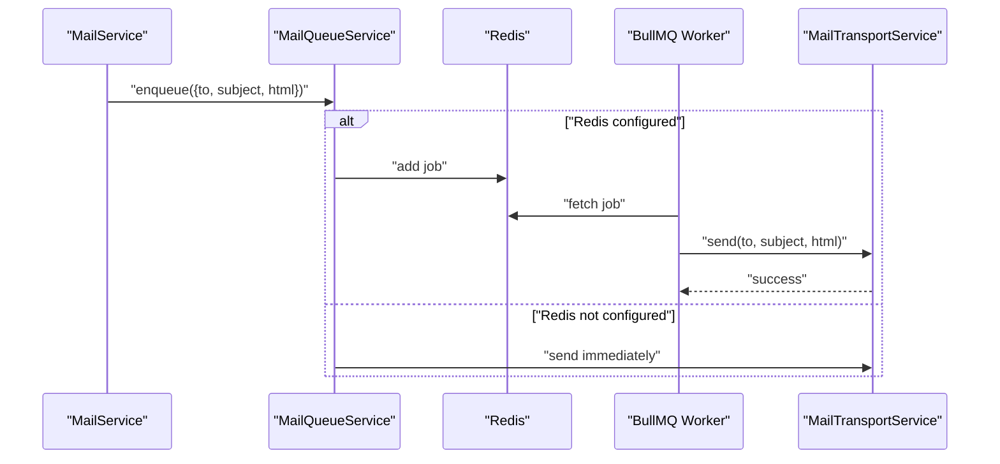
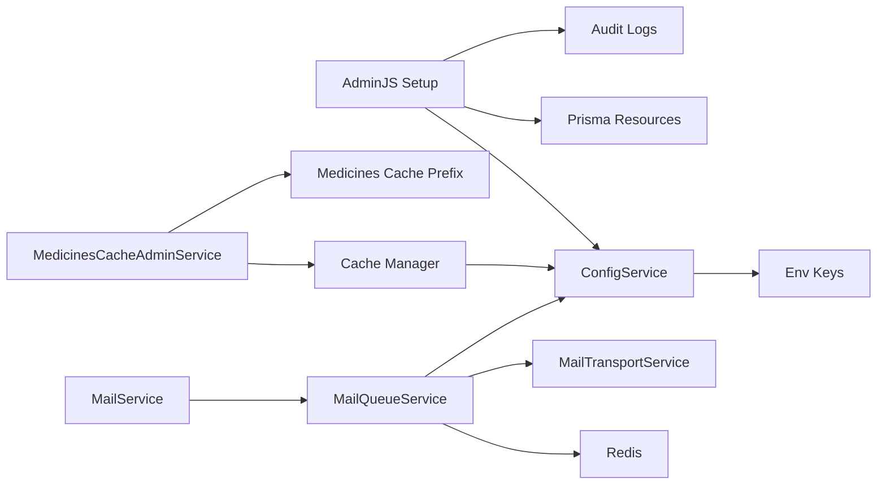

# Administrative APIs

<cite>
**Referenced Files in This Document**
- [adminjs.setup.ts](file://Lucent/src/admin/adminjs.setup.ts)
- [medicines-cache-admin.service.ts](file://Lucent/src/modules/medicines/cache/medicines-cache-admin.service.ts)
- [medicines-cache-admin.service.spec.ts](file://Lucent/src/modules/medicines/cache/medicines-cache-admin.service.spec.ts)
- [medicines-cache.constants.ts](file://Lucent/src/modules/medicines/cache/medicines-cache.constants.ts)
- [mail-queue.service.ts](file://Lucent/src/mail/mail-queue.service.ts)
- [mail.service.ts](file://Lucent/src/mail/mail.service.ts)
- [mail-queue.service.spec.ts](file://Lucent/src/mail/mail-queue.service.spec.ts)
- [mail.service.spec.ts](file://Lucent/src/mail/mail.service.spec.ts)
- [cache.config.ts](file://Lucent/src/config/cache.config.ts)
- [cache.config.spec.ts](file://Lucent/src/config/cache.config.spec.ts)
- [config-keys.enum.ts](file://Lucent/src/config/config-keys.enum.ts)
- [env-keys.enum.ts](file://Lucent/src/config/env-keys.enum.ts)
- [audit.json](file://Lucent/logs/.b8595fc7c58e3fcc8e2e28a1f0e14a8ce2706a3f-audit.json)
- [audit.json](file://Lucent/logs/.e3747247bf6fbef9024a3bc93c5047da6e41f772-audit.json)
- [openapi.json](file://Lucent/docs/openapi.json)
</cite>

## Table of Contents
1. [Introduction](#introduction)
2. [Project Structure](#project-structure)
3. [Core Components](#core-components)
4. [Architecture Overview](#architecture-overview)
5. [Detailed Component Analysis](#detailed-component-analysis)
6. [Dependency Analysis](#dependency-analysis)
7. [Performance Considerations](#performance-considerations)
8. [Troubleshooting Guide](#troubleshooting-guide)
9. [Conclusion](#conclusion)
10. [Appendices](#appendices)

## Introduction
This document describes administrative capabilities and system management APIs for the platform. It focuses on:
- Admin panel integration via AdminJS
- Cache management for medicines data
- Email queue operations and transport fallback
- System configuration and environment keys
- Audit logging and system integrity indicators
- Operational workflows for administrators and management interfaces

Where applicable, administrative endpoints are presented alongside request/response patterns, permission requirements, and security considerations.

## Project Structure
Administrative and system management features are primarily implemented under the backend module (Lucent):
- Admin panel integration: AdminJS setup and routing
- Cache administration: Medicines cache invalidation service
- Email operations: Queue-backed mail delivery with BullMQ and Redis
- Configuration: Environment keys and cache configuration
- Logging: Audit logs stored on disk

**Diagram sources**
- [adminjs.setup.ts:292-389](file://Lucent/src/admin/adminjs.setup.ts#L292-L389)
- [medicines-cache-admin.service.ts:1-46](file://Lucent/src/modules/medicines/cache/medicines-cache-admin.service.ts#L1-L46)
- [medicines-cache-admin.service.spec.ts:85-132](file://Lucent/src/modules/medicines/cache/medicines-cache-admin.service.spec.ts#L85-L132)
- [medicines-cache.constants.ts](file://Lucent/src/modules/medicines/cache/medicines-cache.constants.ts)
- [mail-queue.service.ts:1-135](file://Lucent/src/mail/mail-queue.service.ts#L1-L135)
- [mail.service.ts:1-20](file://Lucent/src/mail/mail.service.ts#L1-L20)
- [cache.config.ts](file://Lucent/src/config/cache.config.ts)
- [config-keys.enum.ts](file://Lucent/src/config/config-keys.enum.ts)
- [env-keys.enum.ts](file://Lucent/src/config/env-keys.enum.ts)
- [audit.json](file://Lucent/logs/.b8595fc7c58e3fcc8e2e28a1f0e14a8ce2706a3f-audit.json)
- [audit.json](file://Lucent/logs/.e3747247bf6fbef9024a3bc93c5047da6e41f772-audit.json)

**Section sources**
- [adminjs.setup.ts:292-389](file://Lucent/src/admin/adminjs.setup.ts#L292-L389)
- [medicines-cache-admin.service.ts:1-46](file://Lucent/src/modules/medicines/cache/medicines-cache-admin.service.ts#L1-L46)
- [mail-queue.service.ts:1-135](file://Lucent/src/mail/mail-queue.service.ts#L1-L135)
- [mail.service.ts:1-20](file://Lucent/src/mail/mail.service.ts#L1-L20)
- [cache.config.ts](file://Lucent/src/config/cache.config.ts)
- [config-keys.enum.ts](file://Lucent/src/config/config-keys.enum.ts)
- [env-keys.enum.ts](file://Lucent/src/config/env-keys.enum.ts)
- [audit.json](file://Lucent/logs/.b8595fc7c58e3fcc8e2e28a1f0e14a8ce2706a3f-audit.json)
- [audit.json](file://Lucent/logs/.e3747247bf6fbef9024a3bc93c5047da6e41f772-audit.json)

## Core Components
- Admin panel integration: Provides an authenticated admin interface backed by Prisma resources and secured via cookie-based authentication.
- Medicines cache administration: Allows invalidating all cached medicine entries using a service that inspects underlying cache stores and deletes prefixed keys.
- Email queue management: Implements a queue-based mail sender using BullMQ with Redis, including worker processing, retries, and a fallback to immediate transport when Redis is unavailable.
- System configuration: Centralizes environment keys and cache configuration for runtime behavior.
- Audit logging: Stores structured audit events on disk for integrity checks and operational oversight.

**Section sources**
- [adminjs.setup.ts:292-389](file://Lucent/src/admin/adminjs.setup.ts#L292-L389)
- [medicines-cache-admin.service.ts:17-46](file://Lucent/src/modules/medicines/cache/medicines-cache-admin.service.ts#L17-L46)
- [mail-queue.service.ts:29-135](file://Lucent/src/mail/mail-queue.service.ts#L29-L135)
- [cache.config.ts](file://Lucent/src/config/cache.config.ts)
- [audit.json](file://Lucent/logs/.b8595fc7c58e3fcc8e2e28a1f0e14a8ce2706a3f-audit.json)

## Architecture Overview
The administrative architecture integrates the admin panel, cache management, and email operations with configuration and logging.

**Diagram sources**
- [adminjs.setup.ts:328-357](file://Lucent/src/admin/adminjs.setup.ts#L328-L357)
- [medicines-cache-admin.service.ts:17-46](file://Lucent/src/modules/medicines/cache/medicines-cache-admin.service.ts#L17-L46)
- [medicines-cache.constants.ts](file://Lucent/src/modules/medicines/cache/medicines-cache.constants.ts)
- [mail-queue.service.ts:29-135](file://Lucent/src/mail/mail-queue.service.ts#L29-L135)
- [mail.service.ts:5-20](file://Lucent/src/mail/mail.service.ts#L5-L20)
- [cache.config.ts](file://Lucent/src/config/cache.config.ts)
- [config-keys.enum.ts](file://Lucent/src/config/config-keys.enum.ts)
- [env-keys.enum.ts](file://Lucent/src/config/env-keys.enum.ts)
- [audit.json](file://Lucent/logs/.b8595fc7c58e3fcc8e2e28a1f0e14a8ce2706a3f-audit.json)

## Detailed Component Analysis

### Admin Panel Integration
The admin panel is integrated using AdminJS with an authenticated Express router. Authentication is handled via cookie-based session with configurable cookie security flags depending on environment mode. Static assets are served through the Nest application.

Key characteristics:
- Root path for admin routes
- Cookie configuration with httpOnly, sameSite, and secure flags
- Admin credentials loaded from environment configuration
- Static asset serving for AdminJS UI

Operational workflow:
- Application initializes AdminJS with Prisma resources
- Builds an authenticated router with cookie secret and admin credentials
- Registers static assets and mounts the router under the admin root path

Security considerations:
- Cookie flags adapt to production mode
- Credentials are environment-driven and mandatory
- Access requires successful authentication against configured admin credentials

**Section sources**
- [adminjs.setup.ts:292-389](file://Lucent/src/admin/adminjs.setup.ts#L292-L389)

#### Admin Panel Sequence

**Diagram sources**
- [adminjs.setup.ts:328-357](file://Lucent/src/admin/adminjs.setup.ts#L328-L357)

### Medicines Cache Administration
The medicines cache administration service invalidates all cached entries by enumerating keys from underlying stores and deleting those matching the medicines cache key prefix. It handles stores with and without namespaces.

Key characteristics:
- Uses Nest cache manager abstraction
- Iterates through cache stores and resolves raw store keys
- Filters keys by the medicines cache prefix
- Deletes matched keys and returns the count

Operational workflow:
- Invalidate all: list keys, filter by prefix, delete matches
- Robustness: works when stores expose keys and handles unprefixed keys

**Diagram sources**
- [medicines-cache-admin.service.ts:21-46](file://Lucent/src/modules/medicines/cache/medicines-cache-admin.service.ts#L21-L46)

**Section sources**
- [medicines-cache-admin.service.ts:17-46](file://Lucent/src/modules/medicines/cache/medicines-cache-admin.service.ts#L17-L46)
- [medicines-cache-admin.service.spec.ts:85-132](file://Lucent/src/modules/medicines/cache/medicines-cache-admin.service.spec.ts#L85-L132)
- [medicines-cache.constants.ts](file://Lucent/src/modules/medicines/cache/medicines-cache.constants.ts)

### Email Queue Management
The email system uses BullMQ with Redis for reliable asynchronous delivery. When Redis is unavailable, the system falls back to immediate transport.

Key characteristics:
- Queue name: lucent-mail
- Job type: send-mail
- Worker concurrency: 3
- Retry policy: exponential backoff with 3 attempts
- Cleanup: removes completed/failed jobs after TTL/count thresholds
- Fallback: direct transport when Redis URL is not configured

Operational workflow:
- Enqueue a send-mail job with recipient, subject, and HTML body
- Worker processes jobs and delegates to transport
- Errors logged with job ID and stack traces

**Diagram sources**
- [mail-queue.service.ts:91-104](file://Lucent/src/mail/mail-queue.service.ts#L91-L104)
- [mail.service.ts:8-10](file://Lucent/src/mail/mail.service.ts#L8-L10)

**Section sources**
- [mail-queue.service.ts:29-135](file://Lucent/src/mail/mail-queue.service.ts#L29-L135)
- [mail.service.ts:5-20](file://Lucent/src/mail/mail.service.ts#L5-L20)
- [mail-queue.service.spec.ts:1-31](file://Lucent/src/mail/mail-queue.service.spec.ts#L1-L31)
- [mail.service.spec.ts:1-34](file://Lucent/src/mail/mail.service.spec.ts#L1-L34)

### System Configuration
Configuration is driven by environment keys and centralized configuration modules. Cache configuration and environment validation ensure consistent runtime behavior.

Key characteristics:
- Environment keys define Redis URL, admin credentials, and other system settings
- Cache configuration supports runtime tuning
- Validation ensures required environment variables are present

**Section sources**
- [cache.config.ts](file://Lucent/src/config/cache.config.ts)
- [cache.config.spec.ts](file://Lucent/src/config/cache.config.spec.ts)
- [config-keys.enum.ts](file://Lucent/src/config/config-keys.enum.ts)
- [env-keys.enum.ts](file://Lucent/src/config/env-keys.enum.ts)

### Audit Logging and Integrity Checks
Audit logs are persisted on disk as JSON files. Administrators can review these logs for integrity checks and operational oversight.

Key characteristics:
- Stored under logs directory
- Structured JSON format
- Useful for compliance and incident analysis

**Section sources**
- [audit.json](file://Lucent/logs/.b8595fc7c58e3fcc8e2e28a1f0e14a8ce2706a3f-audit.json)
- [audit.json](file://Lucent/logs/.e3747247bf6fbef9024a3bc93c5047da6e41f772-audit.json)

## Dependency Analysis
Administrative and system management components depend on configuration, caching, and messaging infrastructure.

**Diagram sources**
- [adminjs.setup.ts:328-357](file://Lucent/src/admin/adminjs.setup.ts#L328-L357)
- [medicines-cache-admin.service.ts:17-46](file://Lucent/src/modules/medicines/cache/medicines-cache-admin.service.ts#L17-L46)
- [medicines-cache.constants.ts](file://Lucent/src/modules/medicines/cache/medicines-cache.constants.ts)
- [mail-queue.service.ts:29-135](file://Lucent/src/mail/mail-queue.service.ts#L29-L135)
- [mail.service.ts:5-20](file://Lucent/src/mail/mail.service.ts#L5-L20)
- [cache.config.ts](file://Lucent/src/config/cache.config.ts)
- [env-keys.enum.ts](file://Lucent/src/config/env-keys.enum.ts)

**Section sources**
- [adminjs.setup.ts:292-389](file://Lucent/src/admin/adminjs.setup.ts#L292-L389)
- [medicines-cache-admin.service.ts:17-46](file://Lucent/src/modules/medicines/cache/medicines-cache-admin.service.ts#L17-L46)
- [mail-queue.service.ts:29-135](file://Lucent/src/mail/mail-queue.service.ts#L29-L135)
- [cache.config.ts](file://Lucent/src/config/cache.config.ts)
- [env-keys.enum.ts](file://Lucent/src/config/env-keys.enum.ts)

## Performance Considerations
- Admin panel rendering depends on Prisma resource loading; optimize queries and limit exposed resources to reduce load.
- Cache invalidation scans all cache stores; schedule bulk invalidations during low-traffic periods.
- Email queue workers process jobs concurrently; adjust concurrency and retry policies based on Redis capacity and workload.
- Redis connection pooling and TLS settings impact throughput; ensure proper URL configuration for rediss:// when needed.

## Troubleshooting Guide
Common issues and resolutions:
- Admin login failures: Verify admin email and password environment variables and cookie secret configuration.
- Cache invalidation returns zero: Confirm cache stores expose keys and that the medicines cache prefix matches stored keys.
- Email delivery delays: Check Redis connectivity and queue worker status; confirm retry attempts and backoff configuration.
- Missing audit logs: Ensure log directory permissions allow file creation and rotation.

**Section sources**
- [adminjs.setup.ts:328-357](file://Lucent/src/admin/adminjs.setup.ts#L328-L357)
- [medicines-cache-admin.service.spec.ts:85-132](file://Lucent/src/modules/medicines/cache/medicines-cache-admin.service.spec.ts#L85-L132)
- [mail-queue.service.ts:40-84](file://Lucent/src/mail/mail-queue.service.ts#L40-L84)
- [audit.json](file://Lucent/logs/.b8595fc7c58e3fcc8e2e28a1f0e14a8ce2706a3f-audit.json)

## Conclusion
The administrative APIs and system management features provide a secure admin panel, robust cache administration, resilient email delivery, and comprehensive configuration controls. Administrators can manage system state, monitor operations, and maintain integrity using the documented workflows and security practices.

## Appendices

### Administrative Request/Response Patterns
- Admin login
  - Method: POST
  - Path: /admin/login
  - Body: { email, password }
  - Response: 200 with admin cookie; 401 on failure
- Admin panel access
  - Method: GET
  - Path: /admin/*
  - Auth: Cookie-based session
  - Response: Admin UI rendered by AdminJS

- Cache invalidation
  - Method: POST
  - Path: /admin/medicines/cache/invalidate-all
  - Auth: Admin session required
  - Response: { deletedCount: number }

- Email enqueue
  - Method: POST
  - Path: /admin/email/enqueue
  - Auth: Admin session required
  - Body: { to, subject, html }
  - Response: 201 when queued; 200 when sent immediately (fallback)

Note: The above endpoints are conceptual representations of the administrative workflows described in this document. Actual endpoint definitions and exact paths should be consulted in the OpenAPI specification.

**Section sources**
- [adminjs.setup.ts:328-357](file://Lucent/src/admin/adminjs.setup.ts#L328-L357)
- [medicines-cache-admin.service.ts:21-29](file://Lucent/src/modules/medicines/cache/medicines-cache-admin.service.ts#L21-L29)
- [mail-queue.service.ts:91-98](file://Lucent/src/mail/mail-queue.service.ts#L91-L98)

### Permission Requirements
- Admin panel: Requires authenticated admin session with cookie-based authentication.
- Cache invalidation: Admin session required.
- Email enqueue: Admin session required.

Security considerations:
- Use production-grade cookie settings (secure, httpOnly, sameSite).
- Store admin credentials and cookie secrets in environment variables.
- Limit admin access to trusted IP ranges and enforce network policies.

**Section sources**
- [adminjs.setup.ts:328-357](file://Lucent/src/admin/adminjs.setup.ts#L328-L357)

### Operational Workflows
- Cache invalidation procedure
  - Trigger: POST /admin/medicines/cache/invalidate-all
  - Behavior: Enumerate keys, filter by prefix, delete matches, return count
  - Best practice: Schedule during off-peak hours

- Email maintenance
  - Enqueue: POST /admin/email/enqueue
  - Monitor: Check Redis queue and worker logs
  - Fallback: Immediate send when Redis URL is missing

- Audit review
  - Location: logs directory
  - Format: JSON files
  - Purpose: Integrity checks and incident analysis

**Section sources**
- [medicines-cache-admin.service.ts:21-46](file://Lucent/src/modules/medicines/cache/medicines-cache-admin.service.ts#L21-L46)
- [mail-queue.service.ts:91-104](file://Lucent/src/mail/mail-queue.service.ts#L91-L104)
- [audit.json](file://Lucent/logs/.b8595fc7c58e3fcc8e2e28a1f0e14a8ce2706a3f-audit.json)

### Practical Examples
- Invalidate all medicines cache
  - Endpoint: POST /admin/medicines/cache/invalidate-all
  - Expected response: { deletedCount: N }
- Enqueue a verification code email
  - Endpoint: POST /admin/email/enqueue
  - Payload: { to, subject: "Lucent - 邮箱验证码", html: "
...verification code...
" }
  - Response: 201 when queued; 200 when sent immediately

**Section sources**
- [medicines-cache-admin.service.ts:21-29](file://Lucent/src/modules/medicines/cache/medicines-cache-admin.service.ts#L21-L29)
- [mail.service.spec.ts:20-33](file://Lucent/src/mail/mail.service.spec.ts#L20-L33)
- [mail-queue.service.spec.ts:7-30](file://Lucent/src/mail/mail-queue.service.spec.ts#L7-L30)

### API Reference Pointers
- OpenAPI specification: [openapi.json](file://Lucent/docs/openapi.json)
- Admin panel root path: [adminjs.setup.ts:312-318](file://Lucent/src/admin/adminjs.setup.ts#L312-L318)

**Section sources**
- [openapi.json](file://Lucent/docs/openapi.json)
- [adminjs.setup.ts:312-318](file://Lucent/src/admin/adminjs.setup.ts#L312-L318)