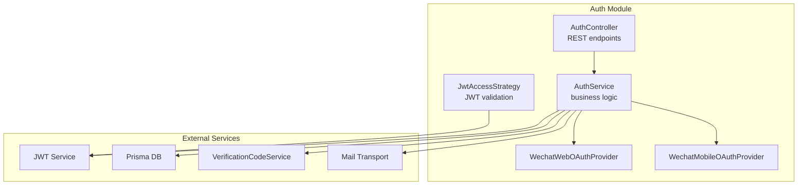
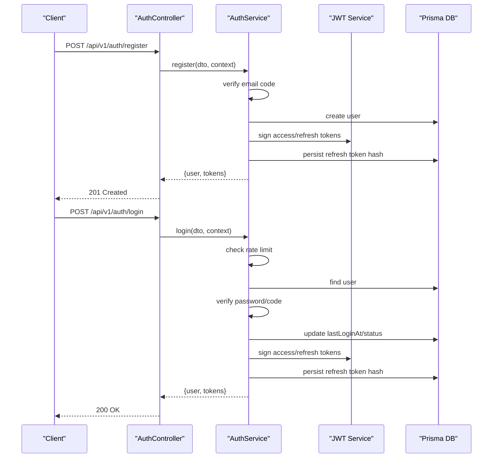
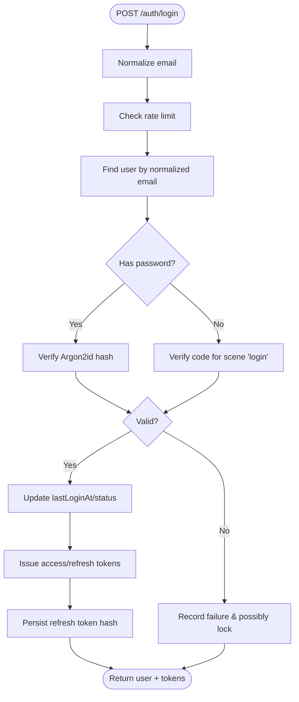
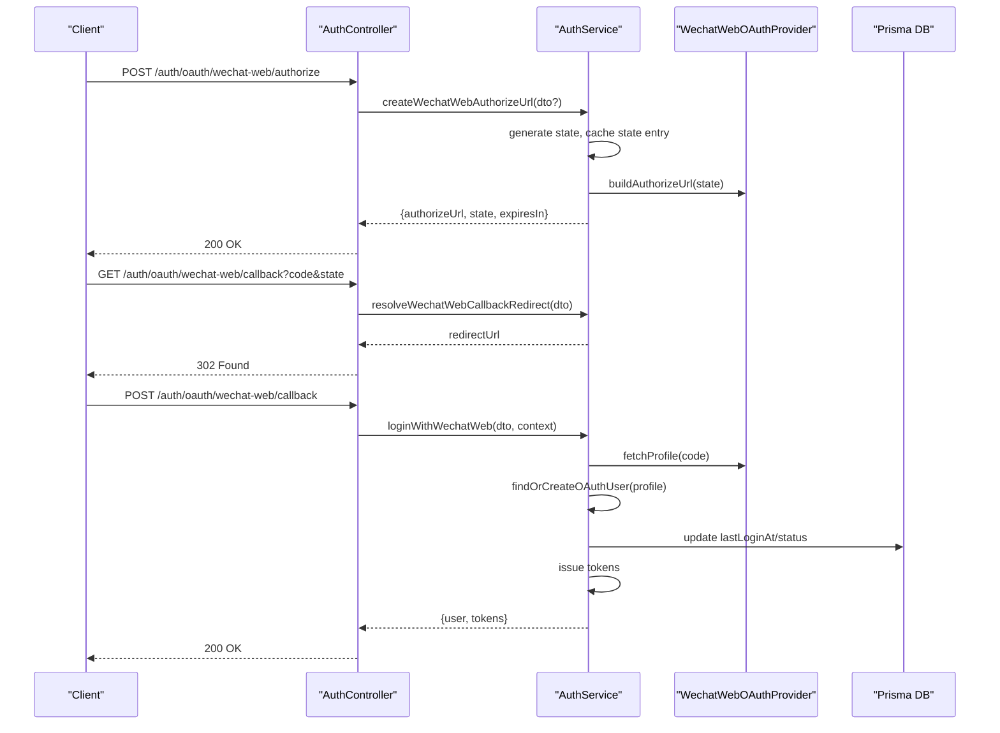
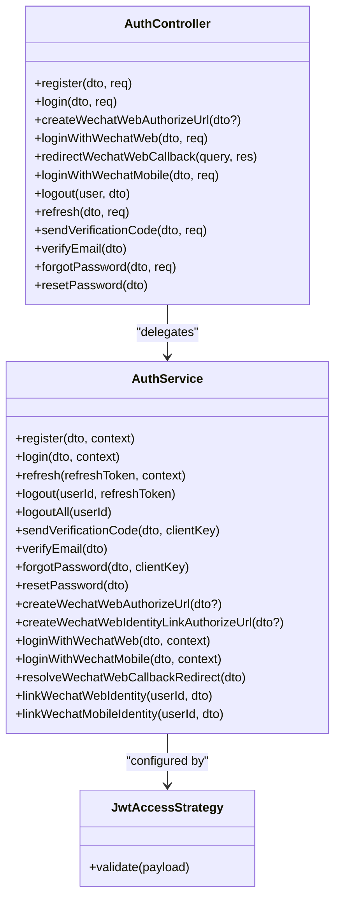

# Authentication Endpoints

<cite>
**Referenced Files in This Document**
- [auth.controller.ts](file://Lucent/src/modules/auth/auth.controller.ts)
- [auth.service.ts](file://Lucent/src/modules/auth/auth.service.ts)
- [auth.module.ts](file://Lucent/src/modules/auth/auth.module.ts)
- [jwt-access.strategy.ts](file://Lucent/src/modules/auth/strategies/jwt-access.strategy.ts)
- [current-user.decorator.ts](file://Lucent/src/modules/auth/decorators/current-user.decorator.ts)
- [register.dto.ts](file://Lucent/src/modules/auth/dto/register.dto.ts)
- [login.dto.ts](file://Lucent/src/modules/auth/dto/login.dto.ts)
- [logout.dto.ts](file://Lucent/src/modules/auth/dto/logout.dto.ts)
- [refresh.dto.ts](file://Lucent/src/modules/auth/dto/refresh.dto.ts)
- [send-verification-code.dto.ts](file://Lucent/src/modules/auth/dto/send-verification-code.dto.ts)
- [verify-email.dto.ts](file://Lucent/src/modules/auth/dto/verify-email.dto.ts)
- [forgot-password.dto.ts](file://Lucent/src/modules/auth/dto/forgot-password.dto.ts)
- [reset-password.dto.ts](file://Lucent/src/modules/auth/dto/reset-password.dto.ts)
- [oauth.dto.ts](file://Lucent/src/modules/auth/dto/oauth.dto.ts)
- [auth-responses.dto.ts](file://Lucent/src/modules/auth/dto/responses/auth-responses.dto.ts)
- [account.controller.ts](file://Lucent/src/modules/account/account.controller.ts)
- [wechat-web-oauth.provider.ts](file://Lucent/src/modules/auth/wechat-web-oauth.provider.ts)
- [wechat-mobile-oauth.provider.ts](file://Lucent/src/modules/auth/wechat-mobile-oauth.provider.ts)
- [auth.json](file://Lucent/src/i18n/en/auth.json)
- [auth.e2e-spec.ts](file://Lucent/test/auth.e2e-spec.ts)
</cite>

## Table of Contents
1. [Introduction](#introduction)
2. [Project Structure](#project-structure)
3. [Core Components](#core-components)
4. [Architecture Overview](#architecture-overview)
5. [Detailed Component Analysis](#detailed-component-analysis)
6. [Dependency Analysis](#dependency-analysis)
7. [Performance Considerations](#performance-considerations)
8. [Troubleshooting Guide](#troubleshooting-guide)
9. [Conclusion](#conclusion)
10. [Appendices](#appendices)

## Introduction
This document provides comprehensive API documentation for authentication endpoints, covering registration, login, logout, password reset, email verification, and OAuth integration (WeChat). It explains request/response schemas, authentication flows, JWT token management, refresh token handling, session lifecycle, rate limiting, and security considerations. Practical examples and client integration guidance are included to help developers implement secure authentication flows.

## Project Structure
Authentication is implemented as a NestJS module with a controller exposing REST endpoints, a service orchestrating business logic, strategies for JWT validation, and providers for OAuth integrations. DTOs define request/response schemas, and Swagger decorators annotate endpoints for documentation generation.

**Diagram sources**
- [auth.controller.ts:1-200](file://Lucent/src/modules/auth/auth.controller.ts#L1-L200)
- [auth.service.ts:1-200](file://Lucent/src/modules/auth/auth.service.ts#L1-L200)
- [jwt-access.strategy.ts:1-80](file://Lucent/src/modules/auth/strategies/jwt-access.strategy.ts#L1-L80)
- [wechat-web-oauth.provider.ts:1-120](file://Lucent/src/modules/auth/wechat-web-oauth.provider.ts#L1-L120)
- [wechat-mobile-oauth.provider.ts:1-120](file://Lucent/src/modules/auth/wechat-mobile-oauth.provider.ts#L1-L120)

**Section sources**
- [auth.controller.ts:1-200](file://Lucent/src/modules/auth/auth.controller.ts#L1-L200)
- [auth.service.ts:1-200](file://Lucent/src/modules/auth/auth.service.ts#L1-L200)
- [auth.module.ts:1-40](file://Lucent/src/modules/auth/auth.module.ts#L1-L40)

## Core Components
- AuthController: Exposes REST endpoints for authentication operations and delegates to AuthService.
- AuthService: Implements registration, login, token refresh, logout, email verification, password reset, and OAuth flows. Manages rate limits, token pairs, and session persistence.
- JwtAccessStrategy: Validates access tokens extracted from Authorization headers.
- DTOs: Define request/response schemas for all endpoints.
- OAuth Providers: Encapsulate WeChat Web and Mobile OAuth flows.

**Section sources**
- [auth.controller.ts:1-200](file://Lucent/src/modules/auth/auth.controller.ts#L1-L200)
- [auth.service.ts:1-200](file://Lucent/src/modules/auth/auth.service.ts#L1-L200)
- [jwt-access.strategy.ts:1-80](file://Lucent/src/modules/auth/strategies/jwt-access.strategy.ts#L1-L80)
- [auth.module.ts:1-40](file://Lucent/src/modules/auth/auth.module.ts#L1-L40)

## Architecture Overview
The authentication flow integrates JWT-based access tokens, refresh tokens persisted server-side, and optional OAuth identity linking. Controllers handle HTTP requests, DTOs validate inputs, and the service manages stateful operations including rate limiting, verification codes, and session storage.

**Diagram sources**
- [auth.controller.ts:60-140](file://Lucent/src/modules/auth/auth.controller.ts#L60-L140)
- [auth.service.ts:120-220](file://Lucent/src/modules/auth/auth.service.ts#L120-L220)

## Detailed Component Analysis

### Registration
- Endpoint: POST /api/v1/auth/register
- Purpose: Create a new user account after verifying an email code.
- Request DTO: RegisterDto
- Response DTO: RegisterResponseDto
- Validation rules:
  - Email uniqueness enforced.
  - Verification code validated against scene "register".
- Security:
  - Password hashed with Argon2id.
  - Email normalization to lowercase/trim.
- Response includes user profile and initial token pair.

**Section sources**
- [auth.controller.ts:60-90](file://Lucent/src/modules/auth/auth.controller.ts#L60-L90)
- [auth.service.ts:120-170](file://Lucent/src/modules/auth/auth.service.ts#L120-L170)
- [register.dto.ts:1-120](file://Lucent/src/modules/auth/dto/register.dto.ts#L1-L120)
- [auth-responses.dto.ts:1-120](file://Lucent/src/modules/auth/dto/responses/auth-responses.dto.ts#L1-L120)

### Login
- Endpoint: POST /api/v1/auth/login
- Purpose: Authenticate via password or code-based login.
- Request DTO: LoginDto
- Response DTO: LoginResponseDto
- Validation rules:
  - Rate limiting: max 10 failures per 15 minutes; lockout for 1 hour after threshold.
  - Exactly one of password or code must be provided.
  - Code-based login verifies scene "login".
- Security:
  - Argon2id password verification.
  - On success, updates lastLoginAt and status to active.
  - Emits access/refresh tokens and persists refresh token hash.
- Response includes user profile and token pair.

**Diagram sources**
- [auth.service.ts:170-240](file://Lucent/src/modules/auth/auth.service.ts#L170-L240)

**Section sources**
- [auth.controller.ts:90-140](file://Lucent/src/modules/auth/auth.controller.ts#L90-L140)
- [auth.service.ts:170-240](file://Lucent/src/modules/auth/auth.service.ts#L170-L240)
- [login.dto.ts:1-120](file://Lucent/src/modules/auth/dto/login.dto.ts#L1-L120)
- [auth-responses.dto.ts:1-120](file://Lucent/src/modules/auth/dto/responses/auth-responses.dto.ts#L1-L120)

### Logout
- Endpoint: POST /api/v1/auth/logout
- Purpose: Invalidate a specific refresh token for the authenticated user.
- Request DTO: LogoutDto (contains refreshToken)
- Behavior:
  - Deletes the refresh token record by hashed value.
- Notes:
  - LogoutAll is supported internally but not exposed as a public endpoint.

**Section sources**
- [auth.controller.ts:180-210](file://Lucent/src/modules/auth/auth.controller.ts#L180-L210)
- [auth.service.ts:240-280](file://Lucent/src/modules/auth/auth.service.ts#L240-L280)
- [logout.dto.ts:1-120](file://Lucent/src/modules/auth/dto/logout.dto.ts#L1-L120)

### Token Refresh
- Endpoint: POST /api/v1/auth/refresh
- Purpose: Rotate tokens using a valid refresh token.
- Request DTO: RefreshDto
- Behavior:
  - Hashes the incoming refresh token and looks up a non-expired, unrevoked session.
  - Deletes the old refresh token (rotation) and issues a new token pair.
- Response DTO: RefreshResponseDto

**Section sources**
- [auth.controller.ts:210-240](file://Lucent/src/modules/auth/auth.controller.ts#L210-L240)
- [auth.service.ts:200-240](file://Lucent/src/modules/auth/auth.service.ts#L200-L240)
- [refresh.dto.ts:1-120](file://Lucent/src/modules/auth/dto/refresh.dto.ts#L1-L120)
- [auth-responses.dto.ts:1-120](file://Lucent/src/modules/auth/dto/responses/auth-responses.dto.ts#L1-L120)

### Email Verification
- Endpoint: POST /api/v1/auth/send-verification-code
- Purpose: Send a time-sensitive verification code to the provided email.
- Request DTO: SendVerificationCodeDto
- Response DTO: SendVerificationCodeResponseDto
- Rate limiting:
  - Client-level rate limit enforced by VerificationCodeService.
- Notes:
  - Returns a fixed cooldown window for UI guidance.

**Section sources**
- [auth.controller.ts:240-280](file://Lucent/src/modules/auth/auth.controller.ts#L240-L280)
- [auth.service.ts:300-340](file://Lucent/src/modules/auth/auth.service.ts#L300-L340)
- [send-verification-code.dto.ts:1-120](file://Lucent/src/modules/auth/dto/send-verification-code.dto.ts#L1-L120)
- [auth-responses.dto.ts:1-120](file://Lucent/src/modules/auth/dto/responses/auth-responses.dto.ts#L1-L120)

### Verify Email
- Endpoint: POST /api/v1/auth/verify-email
- Purpose: Mark an email address as verified using a code.
- Request DTO: VerifyEmailDto
- Behavior:
  - Verifies code for scene "register".
  - Updates user.emailVerifiedAt.

**Section sources**
- [auth.controller.ts:280-310](file://Lucent/src/modules/auth/auth.controller.ts#L280-L310)
- [auth.service.ts:340-380](file://Lucent/src/modules/auth/auth.service.ts#L340-L380)
- [verify-email.dto.ts:1-120](file://Lucent/src/modules/auth/dto/verify-email.dto.ts#L1-L120)

### Forgot Password
- Endpoint: POST /api/v1/auth/forgot-password
- Purpose: Initiate password reset by sending a code.
- Request DTO: ForgotPasswordDto
- Response DTO: ForgotPasswordResponseDto
- Behavior:
  - Enforces client-level rate limit.
  - Sends code for scene "reset-password" if user exists (timing attack mitigation).

**Section sources**
- [auth.controller.ts:310-350](file://Lucent/src/modules/auth/auth.controller.ts#L310-L350)
- [auth.service.ts:380-420](file://Lucent/src/modules/auth/auth.service.ts#L380-L420)
- [forgot-password.dto.ts:1-120](file://Lucent/src/modules/auth/dto/forgot-password.dto.ts#L1-L120)
- [auth-responses.dto.ts:1-120](file://Lucent/src/modules/auth/dto/responses/auth-responses.dto.ts#L1-L120)

### Reset Password
- Endpoint: POST /api/v1/auth/reset-password
- Purpose: Replace user’s password using a verified code.
- Request DTO: ResetPasswordDto
- Behavior:
  - Verifies code for scene "reset-password".
  - Hashes new password with Argon2id.
  - Invalidates all sessions for the user.

**Section sources**
- [auth.controller.ts:350-380](file://Lucent/src/modules/auth/auth.controller.ts#L350-L380)
- [auth.service.ts:420-470](file://Lucent/src/modules/auth/auth.service.ts#L420-L470)
- [reset-password.dto.ts:1-120](file://Lucent/src/modules/auth/dto/reset-password.dto.ts#L1-L120)

### OAuth Integration (WeChat)
- Web Authorization:
  - POST /api/v1/auth/oauth/wechat-web/authorize: Creates authorize URL and state.
  - POST /api/v1/auth/oauth/wechat-web/callback: Completes login via WeChat web OAuth.
  - GET /api/v1/auth/oauth/wechat-web/callback: Redirects browser-based callback with code/state.
- Mobile Authorization:
  - POST /api/v1/auth/oauth/wechat-mobile/callback: Completes login via WeChat mobile OAuth.
- Identity Linking:
  - POST /api/v1/account/identities/wechat-web/authorize: Create authorize URL for linking.
  - POST /api/v1/account/identities/wechat-web/callback: Links WeChat identity to authenticated account.
  - POST /api/v1/account/identities/wechat-mobile/callback: Links WeChat mobile identity to authenticated account.

**Diagram sources**
- [auth.controller.ts:140-210](file://Lucent/src/modules/auth/auth.controller.ts#L140-L210)
- [auth.service.ts:470-620](file://Lucent/src/modules/auth/auth.service.ts#L470-L620)
- [wechat-web-oauth.provider.ts:1-120](file://Lucent/src/modules/auth/wechat-web-oauth.provider.ts#L1-L120)

**Section sources**
- [auth.controller.ts:140-210](file://Lucent/src/modules/auth/auth.controller.ts#L140-L210)
- [auth.service.ts:470-620](file://Lucent/src/modules/auth/auth.service.ts#L470-L620)
- [oauth.dto.ts:1-200](file://Lucent/src/modules/auth/dto/oauth.dto.ts#L1-L200)
- [account.controller.ts:1-200](file://Lucent/src/modules/account/account.controller.ts#L1-L200)
- [wechat-web-oauth.provider.ts:1-120](file://Lucent/src/modules/auth/wechat-web-oauth.provider.ts#L1-L120)
- [wechat-mobile-oauth.provider.ts:1-120](file://Lucent/src/modules/auth/wechat-mobile-oauth.provider.ts#L1-L120)

## Dependency Analysis
- AuthController depends on AuthService for all business logic.
- AuthService depends on:
  - JwtService for signing tokens.
  - PrismaService for user/session persistence.
  - VerificationCodeService for code issuance/verification.
  - WeChat OAuth providers for external identity flows.
  - ConfigService for JWT configuration and CORS origins.
- JwtAccessStrategy validates access tokens and attaches user payload to requests.

**Diagram sources**
- [auth.controller.ts:1-200](file://Lucent/src/modules/auth/auth.controller.ts#L1-L200)
- [auth.service.ts:1-200](file://Lucent/src/modules/auth/auth.service.ts#L1-L200)
- [jwt-access.strategy.ts:1-80](file://Lucent/src/modules/auth/strategies/jwt-access.strategy.ts#L1-L80)

**Section sources**
- [auth.controller.ts:1-200](file://Lucent/src/modules/auth/auth.controller.ts#L1-L200)
- [auth.service.ts:1-200](file://Lucent/src/modules/auth/auth.service.ts#L1-L200)
- [auth.module.ts:1-40](file://Lucent/src/modules/auth/auth.module.ts#L1-L40)

## Performance Considerations
- Token signing uses HS512 with unique JWT IDs for access tokens and SHA-256-hashed refresh tokens persisted in the database.
- Session rotation: refresh tokens are deleted upon use to prevent reuse.
- Rate limiting: login attempts are throttled per email to mitigate brute force attacks.
- Verification code operations enforce client-level rate limits to reduce spam.

[No sources needed since this section provides general guidance]

## Troubleshooting Guide
Common error codes and causes:
- UNAUTHORIZED: Invalid credentials, missing/invalid access token, or unauthorized OAuth state.
- REFRESH_TOKEN_INVALID: Expired or revoked refresh token.
- LOGIN_RATE_LIMITED: Too many failed login attempts within the rate window.
- CONFLICT: Email already registered or OAuth identity already linked.
- BAD_REQUEST: Invalid OAuth callback URI or missing required parameters.
- NOT_FOUND: User not found during password reset.

Operational tips:
- Ensure Authorization header contains a valid access token for protected endpoints.
- Use the refresh endpoint before access tokens expire.
- Verify email codes for the correct scene ("register", "login", "reset-password").
- For OAuth, confirm state caching and callback origin validation.

**Section sources**
- [auth.service.ts:170-240](file://Lucent/src/modules/auth/auth.service.ts#L170-L240)
- [auth-responses.dto.ts:1-120](file://Lucent/src/modules/auth/dto/responses/auth-responses.dto.ts#L1-L120)
- [auth.json:1-200](file://Lucent/src/i18n/en/auth.json#L1-L200)

## Conclusion
The authentication system provides robust, standards-compliant JWT-based authentication with refresh token rotation, comprehensive rate limiting, and secure OAuth integration for WeChat. The documented endpoints, schemas, and flows enable clients to implement secure sign-up, login, logout, password reset, email verification, and identity linking workflows.

[No sources needed since this section summarizes without analyzing specific files]

## Appendices

### Request/Response Schemas

- Register
  - Request: RegisterDto
  - Response: RegisterResponseDto

- Login
  - Request: LoginDto
  - Response: LoginResponseDto

- Logout
  - Request: LogoutDto
  - Response: SuccessResponseDto

- Refresh
  - Request: RefreshDto
  - Response: RefreshResponseDto

- Send Verification Code
  - Request: SendVerificationCodeDto
  - Response: SendVerificationCodeResponseDto

- Verify Email
  - Request: VerifyEmailDto
  - Response: VerifyEmailResponseDto

- Forgot Password
  - Request: ForgotPasswordDto
  - Response: ForgotPasswordResponseDto

- Reset Password
  - Request: ResetPasswordDto
  - Response: SuccessResponseDto

- OAuth Authorize (WeChat Web)
  - Request: OAuthAuthorizeDto
  - Response: OAuthAuthorizeResponseDto

- OAuth Callback (WeChat Web)
  - Request: OAuthCallbackDto
  - Response: LoginResponseDto

- OAuth Callback (WeChat Mobile)
  - Request: OAuthCodeCallbackDto
  - Response: LoginResponseDto

**Section sources**
- [auth-responses.dto.ts:1-200](file://Lucent/src/modules/auth/dto/responses/auth-responses.dto.ts#L1-L200)
- [register.dto.ts:1-120](file://Lucent/src/modules/auth/dto/register.dto.ts#L1-L120)
- [login.dto.ts:1-120](file://Lucent/src/modules/auth/dto/login.dto.ts#L1-L120)
- [logout.dto.ts:1-120](file://Lucent/src/modules/auth/dto/logout.dto.ts#L1-L120)
- [refresh.dto.ts:1-120](file://Lucent/src/modules/auth/dto/refresh.dto.ts#L1-L120)
- [send-verification-code.dto.ts:1-120](file://Lucent/src/modules/auth/dto/send-verification-code.dto.ts#L1-L120)
- [verify-email.dto.ts:1-120](file://Lucent/src/modules/auth/dto/verify-email.dto.ts#L1-L120)
- [forgot-password.dto.ts:1-120](file://Lucent/src/modules/auth/dto/forgot-password.dto.ts#L1-L120)
- [reset-password.dto.ts:1-120](file://Lucent/src/modules/auth/dto/reset-password.dto.ts#L1-L120)
- [oauth.dto.ts:1-200](file://Lucent/src/modules/auth/dto/oauth.dto.ts#L1-L200)

### Security Best Practices
- Always transmit tokens over HTTPS.
- Store refresh tokens securely (e.g., httpOnly cookies) and avoid logging them.
- Validate OAuth callback URIs and enforce trusted origins.
- Use rate limiting and consider IP-based controls for suspicious activity.
- Rotate refresh tokens on each use and invalidate on sensitive actions (e.g., password change).

[No sources needed since this section provides general guidance]

### Client Implementation Examples
- Login flow:
  - Submit credentials to POST /api/v1/auth/login.
  - Store access token in memory and refresh token persistently.
  - On 401, call POST /api/v1/auth/refresh with saved refresh token.
- Password reset:
  - Call POST /api/v1/auth/send-verification-code with email.
  - Prompt user for code and submit to POST /api/v1/auth/reset-password.
- OAuth login:
  - Call POST /api/v1/auth/oauth/wechat-web/authorize to obtain authorizeUrl and state.
  - Redirect user to authorizeUrl; handle GET /api/v1/auth/oauth/wechat-web/callback to capture code/state.
  - Submit code/state to POST /api/v1/auth/oauth/wechat-web/callback to receive tokens.

**Section sources**
- [auth.controller.ts:140-210](file://Lucent/src/modules/auth/auth.controller.ts#L140-L210)
- [auth.service.ts:470-620](file://Lucent/src/modules/auth/auth.service.ts#L470-L620)

### Two-Factor Authentication and Account Verification
- Current state:
  - Code-based login is supported; 2FA challenges are planned but not yet implemented.
  - Email verification supports both registration and change-email flows.
- Recommendations:
  - Introduce TOTP or SMS-based 2FA with challenge completion prior to issuing tokens.
  - Add backup codes and recovery mechanisms.

**Section sources**
- [auth.service.ts:170-240](file://Lucent/src/modules/auth/auth.service.ts#L170-L240)
- [auth.service.ts:300-380](file://Lucent/src/modules/auth/auth.service.ts#L300-L380)

### Session Management
- Access tokens are short-lived JWTs with unique IDs.
- Refresh tokens are long-lived but server-side hashed and rotated.
- Logout invalidates a specific refresh token; logoutAll revokes all sessions.
- Device/session listing and granular revocation are planned enhancements.

**Section sources**
- [auth.service.ts:200-280](file://Lucent/src/modules/auth/auth.service.ts#L200-L280)
- [jwt-access.strategy.ts:1-80](file://Lucent/src/modules/auth/strategies/jwt-access.strategy.ts#L1-L80)

### Rate Limiting Policies
- Login:
  - Max 10 failures per 15 minutes; lockout for 1 hour after threshold.
- Verification code endpoints:
  - Client-level rate limits enforced by VerificationCodeService.

**Section sources**
- [auth.service.ts:620-740](file://Lucent/src/modules/auth/auth.service.ts#L620-L740)
- [auth.controller.ts:240-350](file://Lucent/src/modules/auth/auth.controller.ts#L240-L350)