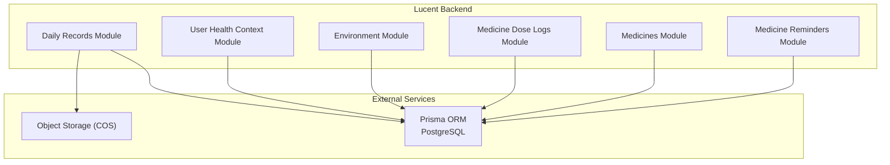
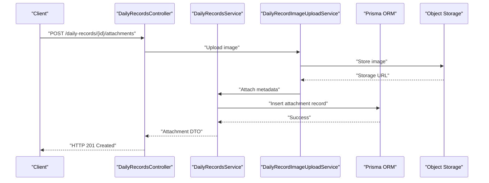
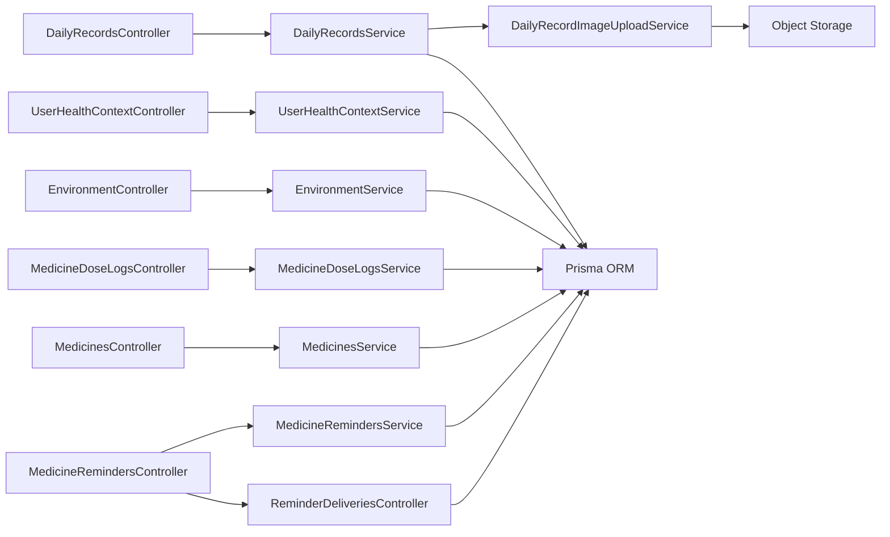

# Health Data APIs

<cite>
**Referenced Files in This Document**
- [daily-records.controller.ts](file://Lucent/src/modules/daily-records/daily-records.controller.ts)
- [daily-records.service.ts](file://Lucent/src/modules/daily-records/daily-records.service.ts)
- [daily-record-image-upload.service.ts](file://Lucent/src/modules/daily-records/daily-record-image-upload.service.ts)
- [user-health-context.controller.ts](file://Lucent/src/modules/user-health-context/user-health-context.controller.ts)
- [user-health-context.service.ts](file://Lucent/src/modules/user-health-context/user-health-context.service.ts)
- [environment.controller.ts](file://Lucent/src/modules/environment/environment.controller.ts)
- [environment.service.ts](file://Lucent/src/modules/environment/environment.service.ts)
- [medicine-dose-logs.controller.ts](file://Lucent/src/modules/medicine-dose-logs/medicine-dose-logs.controller.ts)
- [medicine-dose-logs.service.ts](file://Lucent/src/modules/medicine-dose-logs/medicine-dose-logs.service.ts)
- [medicines.controller.ts](file://Lucent/src/modules/medicines/medicines.controller.ts)
- [medicines.service.ts](file://Lucent/src/modules/medicines/medicines.service.ts)
- [medicine-reminders.controller.ts](file://Lucent/src/modules/medicine-reminders/medicine-reminders.controller.ts)
- [medicine-reminders.service.ts](file://Lucent/src/modules/medicine-reminders/medicine-reminders.service.ts)
- [reminder-deliveries.controller.ts](file://Lucent/src/modules/medicine-reminders/reminder-deliveries.controller.ts)
- [prisma.schema](file://Lucent/prisma/schema.prisma)
- [openapi.json](file://Lucent/docs/openapi.json)
- [daily-records.e2e-spec.ts](file://Lucent/test/daily-records.e2e-spec.ts)
- [user-health-context.e2e-spec.ts](file://Lucent/test/user-health-context.e2e-spec.ts)
- [medicine-dose-logs.e2e-spec.ts](file://Lucent/test/medicine-dose-logs.e2e-spec.ts)
- [medicine-reminders.e2e-spec.ts](file://Lucent/test/medicine-reminders.e2e-spec.ts)
- [medicines.e2e-spec.ts](file://Lucent/test/medicines.e2e-spec.ts)
</cite>

## Table of Contents
1. [Introduction](#introduction)
2. [Project Structure](#project-structure)
3. [Core Components](#core-components)
4. [Architecture Overview](#architecture-overview)
5. [Detailed Component Analysis](#detailed-component-analysis)
6. [Dependency Analysis](#dependency-analysis)
7. [Performance Considerations](#performance-considerations)
8. [Troubleshooting Guide](#troubleshooting-guide)
9. [Conclusion](#conclusion)
10. [Appendices](#appendices)

## Introduction
This document provides comprehensive API documentation for health data management endpoints in the Lumos platform. It covers daily record creation, image attachment, health context management, and environmental monitoring. The APIs support health metric recording, allergy management, condition tracking, current medication logging, and demographic profile updates. Request/response schemas, image upload handling, environmental data retrieval, and health analytics are documented alongside practical workflows, validation rules, privacy considerations, and lifecycle management guidance.

## Project Structure
The health data APIs are implemented as NestJS modules under the Lucent backend service. Key modules include:
- Daily Records: CRUD for daily health records and image attachments
- User Health Context: Allergies, conditions, and demographic profiles
- Environment: Environmental snapshot retrieval
- Medicine Dose Logs: Logging of medication intake
- Medicines: Medicine search and detail retrieval
- Medicine Reminders: Reminder creation and delivery tracking

**Diagram sources**
- [daily-records.controller.ts](file://Lucent/src/modules/daily-records/daily-records.controller.ts)
- [user-health-context.controller.ts](file://Lucent/src/modules/user-health-context/user-health-context.controller.ts)
- [environment.controller.ts](file://Lucent/src/modules/environment/environment.controller.ts)
- [medicine-dose-logs.controller.ts](file://Lucent/src/modules/medicine-dose-logs/medicine-dose-logs.controller.ts)
- [medicines.controller.ts](file://Lucent/src/modules/medicines/medicines.controller.ts)
- [medicine-reminders.controller.ts](file://Lucent/src/modules/medicine-reminders/medicine-reminders.controller.ts)

**Section sources**
- [daily-records.controller.ts](file://Lucent/src/modules/daily-records/daily-records.controller.ts)
- [user-health-context.controller.ts](file://Lucent/src/modules/user-health-context/user-health-context.controller.ts)
- [environment.controller.ts](file://Lucent/src/modules/environment/environment.controller.ts)
- [medicine-dose-logs.controller.ts](file://Lucent/src/modules/medicine-dose-logs/medicine-dose-logs.controller.ts)
- [medicines.controller.ts](file://Lucent/src/modules/medicines/medicines.controller.ts)
- [medicine-reminders.controller.ts](file://Lucent/src/modules/medicine-reminders/medicine-reminders.controller.ts)

## Core Components
This section outlines the primary health data APIs and their responsibilities:

- Daily Records API
  - Create/update/delete daily health records
  - Attach images to records with upload and metadata handling
- User Health Context API
  - Manage allergies (add/remove/update)
  - Track medical conditions (add/remove/update)
  - Update demographic profile (age, sex at birth, etc.)
- Environment API
  - Retrieve environment snapshots (air quality, UV, pollen, humidity)
- Medicine Dose Logs API
  - Log medication doses taken/not taken
  - List historical logs with pagination
- Medicines API
  - Search and retrieve medicine details
- Medicine Reminders API
  - Create/update/delete reminders
  - List upcoming deliveries

**Section sources**
- [daily-records.controller.ts](file://Lucent/src/modules/daily-records/daily-records.controller.ts)
- [user-health-context.controller.ts](file://Lucent/src/modules/user-health-context/user-health-context.controller.ts)
- [environment.controller.ts](file://Lucent/src/modules/environment/environment.controller.ts)
- [medicine-dose-logs.controller.ts](file://Lucent/src/modules/medicine-dose-logs/medicine-dose-logs.controller.ts)
- [medicines.controller.ts](file://Lucent/src/modules/medicines/medicines.controller.ts)
- [medicine-reminders.controller.ts](file://Lucent/src/modules/medicine-reminders/medicine-reminders.controller.ts)

## Architecture Overview
The health data APIs follow a layered architecture:
- Controllers handle HTTP requests and responses
- Services encapsulate business logic and orchestrate data operations
- Prisma ORM manages database interactions
- External integrations (object storage) handle media uploads

**Diagram sources**
- [daily-records.controller.ts](file://Lucent/src/modules/daily-records/daily-records.controller.ts)
- [daily-records.service.ts](file://Lucent/src/modules/daily-records/daily-records.service.ts)
- [daily-record-image-upload.service.ts](file://Lucent/src/modules/daily-records/daily-record-image-upload.service.ts)

## Detailed Component Analysis

### Daily Records API
Endpoints enable creation, update, deletion, and listing of daily health records, along with image attachment.

- Record Creation
  - Method: POST /daily-records
  - Purpose: Create a new daily record for the authenticated user
  - Request body: CreateDailyRecordDto (fields include kind, content, timestamp, optional attachments)
  - Response: DailyRecordResponseDto
- Record Update
  - Method: PUT /daily-records/{id}
  - Purpose: Update an existing daily record
  - Path params: id (record identifier)
  - Request body: UpdateDailyRecordDto
  - Response: DailyRecordResponseDto
- Record Deletion
  - Method: DELETE /daily-records/{id}
  - Purpose: Remove a daily record
  - Path params: id
  - Response: Success response
- Record Listing
  - Method: GET /daily-records
  - Purpose: List daily records with optional filters (date range, kind)
  - Query params: pagination, dateFrom, dateTo, kinds[]
  - Response: DailyRecordListResponseDto
- Image Attachment
  - Method: POST /daily-records/{id}/attachments
  - Purpose: Upload and attach an image to a record
  - Path params: id
  - Request body: CreateDailyRecordImageUploadDto
  - Response: DailyRecordImageUploadResponseDto
  - Implementation: Uses DailyRecordImageUploadService to store in object storage and link via Prisma

Validation and constraints:
- Timestamps must be valid ISO dates
- Kind must be one of predefined record types
- Attachments require supported MIME types and size limits
- Ownership enforced via user context

Privacy and lifecycle:
- Records and attachments are scoped to the authenticated user
- Soft-deleted records may be retained per policy; hard deletion requires admin privileges

**Section sources**
- [daily-records.controller.ts](file://Lucent/src/modules/daily-records/daily-records.controller.ts)
- [daily-records.service.ts](file://Lucent/src/modules/daily-records/daily-records.service.ts)
- [daily-record-image-upload.service.ts](file://Lucent/src/modules/daily-records/daily-record-image-upload.service.ts)

### User Health Context API
Endpoints manage allergies, conditions, and demographic profile updates.

- Allergies
  - Create allergy: POST /health-context/allergies
  - Update allergy: PUT /health-context/allergies/{id}
  - Delete allergy: DELETE /health-context/allergies/{id}
  - Request body: CreateHealthContextAllergyDto / UpdateHealthContextAllergyDto
  - Response: UserAllergyItemDto
- Conditions
  - Create condition: POST /health-context/conditions
  - Update condition: PUT /health-context/conditions/{id}
  - Delete condition: DELETE /health-context/conditions/{id}
  - Request body: CreateHealthContextConditionDto / UpdateHealthContextConditionDto
  - Response: UserConditionItemDto
- Demographic Profile
  - Update profile: PUT /health-context/profile
  - Request body: UpdateHealthContextProfileDto
  - Response: UserHealthProfileDto

Constraints:
- Severity levels and allergy kinds are validated enums
- Condition status values are constrained
- Profile updates enforce required fields where applicable

**Section sources**
- [user-health-context.controller.ts](file://Lucent/src/modules/user-health-context/user-health-context.controller.ts)
- [user-health-context.service.ts](file://Lucent/src/modules/user-health-context/user-health-context.service.ts)

### Environment API
Retrieves environment snapshots for health-awareness and alerts.

- Get Snapshot
  - Method: GET /environment/snapshots
  - Purpose: Fetch latest environment conditions
  - Query params: lat, lon (optional), sources[] (filter providers)
  - Response: EnvironmentSnapshotResponseDto
  - Data includes: AirQuality, UV, Pollen, Humidity indicators and levels

Alert system:
- Threshold-based alerts can be derived from returned indicators
- Clients should poll or subscribe to updates based on configured intervals

**Section sources**
- [environment.controller.ts](file://Lucent/src/modules/environment/environment.controller.ts)
- [environment.service.ts](file://Lucent/src/modules/environment/environment.service.ts)

### Medicine Dose Logs API
Logs medication intake and retrieves history.

- Create Dose Log
  - Method: POST /medicine-dose-logs
  - Purpose: Mark a dose as taken or not taken
  - Request body: CreateDoseLogDto
  - Response: DoseLogResponseDto
- Update Dose Log
  - Method: PUT /medicine-dose-logs/{id}
  - Purpose: Modify status or details
  - Path params: id
  - Request body: UpdateDoseLogDto
  - Response: DoseLogResponseDto
- List Dose Logs
  - Method: GET /medicine-dose-logs
  - Purpose: Paginated list with filters
  - Query params: pagination, dateFrom, dateTo, statuses[]
  - Response: DoseLogListResponseDto

Lifecycle:
- Logs can be marked as completed, missed, or rescheduled
- Historical retention governed by compliance policies

**Section sources**
- [medicine-dose-logs.controller.ts](file://Lucent/src/modules/medicine-dose-logs/medicine-dose-logs.controller.ts)
- [medicine-dose-logs.service.ts](file://Lucent/src/modules/medicine-dose-logs/medicine-dose-logs.service.ts)

### Medicines API
Provides medicine search and detail retrieval.

- Search Medicines
  - Method: GET /medicines/search
  - Purpose: Find medicines by name or properties
  - Query params: q (search term), sources[], pagination
  - Response: MedicineSearchResponseDto
- Get Medicine Details
  - Method: GET /medicines/{id}
  - Purpose: Retrieve detailed information
  - Path params: id
  - Response: MedicineDetailResponseDto

Integration:
- Supports multiple sources (e.g., CN, DrugBank)
- Results cached for performance

**Section sources**
- [medicines.controller.ts](file://Lucent/src/modules/medicines/medicines.controller.ts)
- [medicines.service.ts](file://Lucent/src/modules/medicines/medicines.service.ts)

### Medicine Reminders API
Manages medication reminders and delivery notifications.

- Create Reminder
  - Method: POST /medicine-reminders
  - Purpose: Schedule a reminder
  - Request body: CreateMedicineReminderDto
  - Response: MedicineReminderResponseDto
- Update Reminder
  - Method: PUT /medicine-reminders/{id}
  - Purpose: Modify schedule or details
  - Path params: id
  - Request body: UpdateMedicineReminderDto
  - Response: MedicineReminderResponseDto
- Delete Reminder
  - Method: DELETE /medicine-reminders/{id}
  - Purpose: Cancel a reminder
  - Path params: id
  - Response: Success response
- List Reminders
  - Method: GET /medicine-reminders
  - Purpose: Active reminders with pagination
  - Query params: pagination
  - Response: MedicineReminderListResponseDto
- Reminder Deliveries
  - Method: GET /reminder-deliveries
  - Purpose: Upcoming delivery events
  - Query params: pagination, dateFrom, dateTo
  - Response: ReminderDeliveryListResponseDto

**Section sources**
- [medicine-reminders.controller.ts](file://Lucent/src/modules/medicine-reminders/medicine-reminders.controller.ts)
- [medicine-reminders.service.ts](file://Lucent/src/modules/medicine-reminders/medicine-reminders.service.ts)
- [reminder-deliveries.controller.ts](file://Lucent/src/modules/medicine-reminders/reminder-deliveries.controller.ts)

## Dependency Analysis
The modules interact with shared infrastructure and each other as follows:

**Diagram sources**
- [daily-records.controller.ts](file://Lucent/src/modules/daily-records/daily-records.controller.ts)
- [daily-records.service.ts](file://Lucent/src/modules/daily-records/daily-records.service.ts)
- [daily-record-image-upload.service.ts](file://Lucent/src/modules/daily-records/daily-record-image-upload.service.ts)
- [user-health-context.controller.ts](file://Lucent/src/modules/user-health-context/user-health-context.controller.ts)
- [user-health-context.service.ts](file://Lucent/src/modules/user-health-context/user-health-context.service.ts)
- [environment.controller.ts](file://Lucent/src/modules/environment/environment.controller.ts)
- [environment.service.ts](file://Lucent/src/modules/environment/environment.service.ts)
- [medicine-dose-logs.controller.ts](file://Lucent/src/modules/medicine-dose-logs/medicine-dose-logs.controller.ts)
- [medicine-dose-logs.service.ts](file://Lucent/src/modules/medicine-dose-logs/medicine-dose-logs.service.ts)
- [medicines.controller.ts](file://Lucent/src/modules/medicines/medicines.controller.ts)
- [medicines.service.ts](file://Lucent/src/modules/medicines/medicines.service.ts)
- [medicine-reminders.controller.ts](file://Lucent/src/modules/medicine-reminders/medicine-reminders.controller.ts)
- [medicine-reminders.service.ts](file://Lucent/src/modules/medicine-reminders/medicine-reminders.service.ts)
- [reminder-deliveries.controller.ts](file://Lucent/src/modules/medicine-reminders/reminder-deliveries.controller.ts)

**Section sources**
- [prisma.schema](file://Lucent/prisma/schema.prisma)

## Performance Considerations
- Pagination: Use pagination parameters on list endpoints to avoid large payloads
- Filtering: Apply date ranges and enums on list queries to reduce load
- Caching: Medicine search results are cached; leverage this to minimize repeated lookups
- Batch operations: Prefer bulk actions where available to reduce round trips
- Image optimization: Compress images before upload and use appropriate resolutions

## Troubleshooting Guide
Common issues and resolutions:
- Authentication failures: Ensure bearer tokens are included and valid
- Validation errors: Review DTO constraints (enums, date formats, sizes)
- Permission denied: Confirm ownership of records and context items
- Upload failures: Verify MIME type and size limits; check storage credentials
- Rate limiting: Implement exponential backoff for retries

Test coverage references:
- Daily Records: [daily-records.e2e-spec.ts](file://Lucent/test/daily-records.e2e-spec.ts)
- User Health Context: [user-health-context.e2e-spec.ts](file://Lucent/test/user-health-context.e2e-spec.ts)
- Medicine Dose Logs: [medicine-dose-logs.e2e-spec.ts](file://Lucent/test/medicine-dose-logs.e2e-spec.ts)
- Medicine Reminders: [medicine-reminders.e2e-spec.ts](file://Lucent/test/medicine-reminders.e2e-spec.ts)
- Medicines: [medicines.e2e-spec.ts](file://Lucent/test/medicines.e2e-spec.ts)

**Section sources**
- [daily-records.e2e-spec.ts](file://Lucent/test/daily-records.e2e-spec.ts)
- [user-health-context.e2e-spec.ts](file://Lucent/test/user-health-context.e2e-spec.ts)
- [medicine-dose-logs.e2e-spec.ts](file://Lucent/test/medicine-dose-logs.e2e-spec.ts)
- [medicine-reminders.e2e-spec.ts](file://Lucent/test/medicine-reminders.e2e-spec.ts)
- [medicines.e2e-spec.ts](file://Lucent/test/medicines.e2e-spec.ts)

## Conclusion
The health data APIs provide a robust foundation for managing daily health records, health context, environment data, and medication workflows. They emphasize strong typing via DTOs, clear validation, and secure user-scoped operations. Integrators can build comprehensive health monitoring applications and visualizations by leveraging these endpoints and their documented schemas.

## Appendices

### Request/Response Schemas Overview
- Daily Records
  - Create: CreateDailyRecordDto → DailyRecordResponseDto
  - Update: UpdateDailyRecordDto → DailyRecordResponseDto
  - List: DailyRecordListResponseDto
  - Attachment: CreateDailyRecordImageUploadDto → DailyRecordImageUploadResponseDto
- User Health Context
  - Allergy: Create/UpdateHealthContextAllergyDto → UserAllergyItemDto
  - Condition: Create/UpdateHealthContextConditionDto → UserConditionItemDto
  - Profile: UpdateHealthContextProfileDto → UserHealthProfileDto
- Environment
  - Snapshot: EnvironmentSnapshotResponseDto
- Medicine Dose Logs
  - Create/Update: Create/UpdateDoseLogDto → DoseLogResponseDto
  - List: DoseLogListResponseDto
- Medicines
  - Search: MedicineSearchResponseDto
  - Detail: MedicineDetailResponseDto
- Medicine Reminders
  - Create/Update/Delete: Create/UpdateMedicineReminderDto → MedicineReminderResponseDto
  - List: MedicineReminderListResponseDto
  - Deliveries: ReminderDeliveryListResponseDto

### Example Workflows

- Health Data Collection Workflow
  1. Authenticate user
  2. Create daily record with initial metrics
  3. Optionally attach images for documentation
  4. Update record as needed
  5. Monitor environment conditions and adjust activities

- Image Attachment Process
  1. Prepare image with supported MIME type and size
  2. Call attachment endpoint with record ID
  3. Store returned URL for later retrieval
  4. Reference URLs in record content or analytics dashboards

- Environmental Alert System
  1. Poll environment snapshot endpoint
  2. Compare indicators against thresholds
  3. Trigger notifications for high pollen, UV, or poor air quality
  4. Persist alerts and provide remediation suggestions

### Privacy and Security Notes
- All endpoints require authenticated access
- Data is scoped to the authenticated user
- Images are stored separately and linked via secure URLs
- Consider GDPR/privacy-compliant deletion and retention policies

### Data Validation Rules
- Enum constraints for kinds, statuses, severity, and levels
- Date/time formats must be valid ISO strings
- Numeric ranges for vitals where applicable
- Size and type checks for attachments