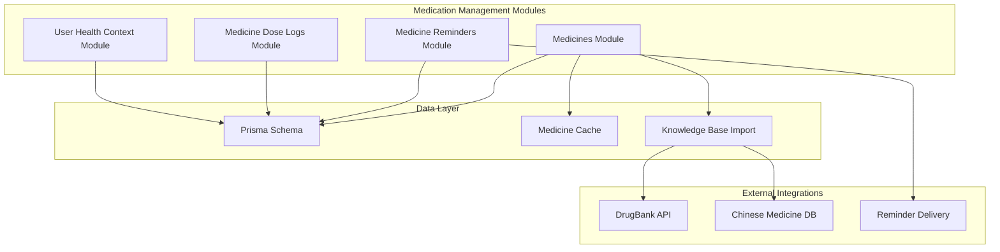
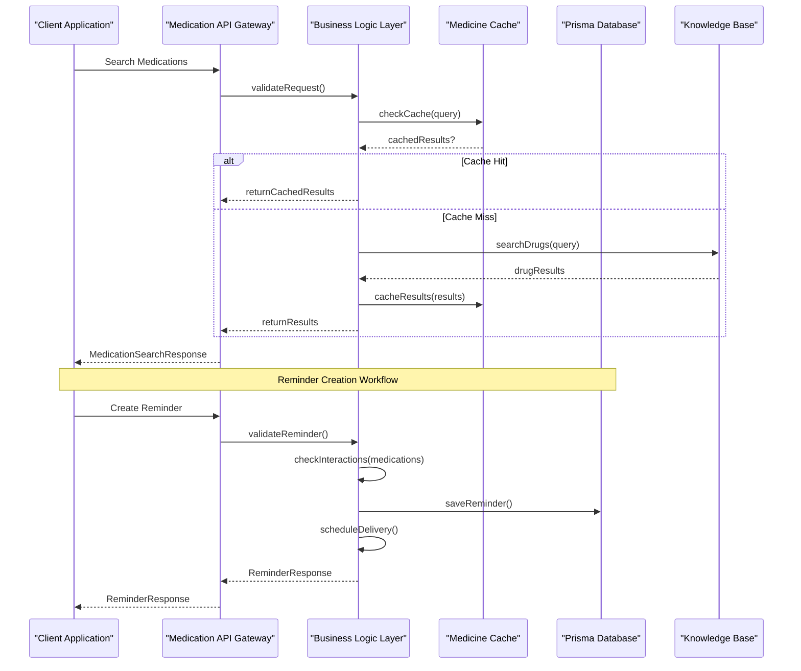
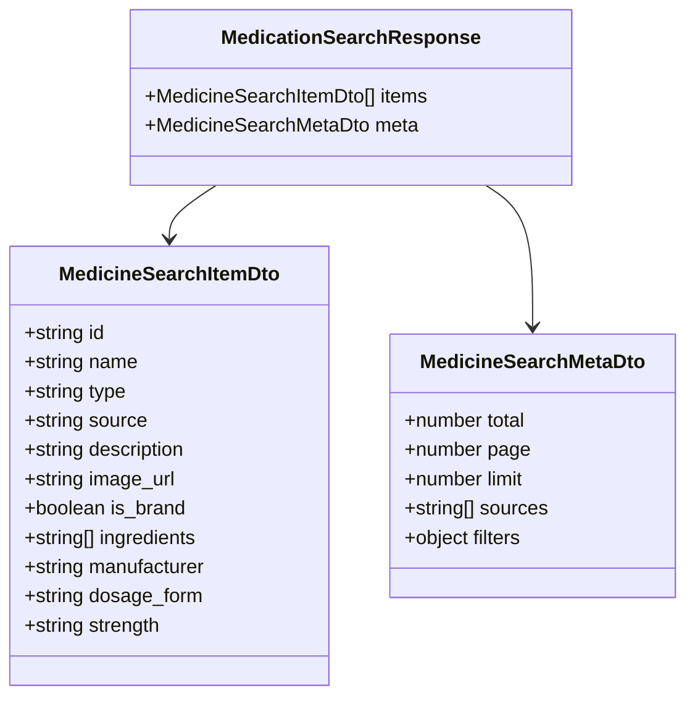
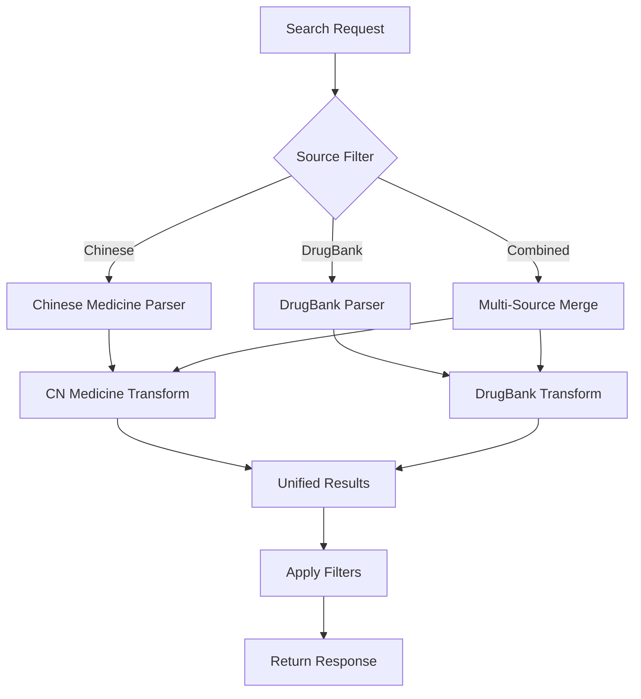
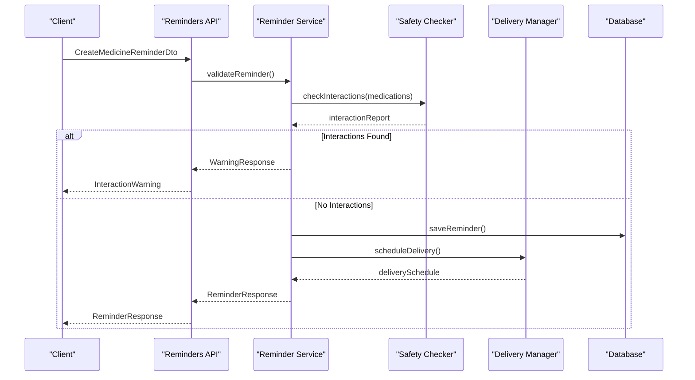
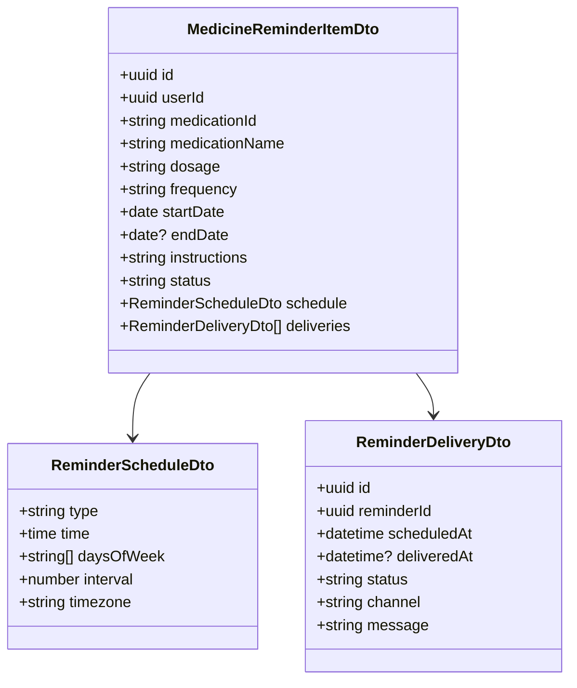
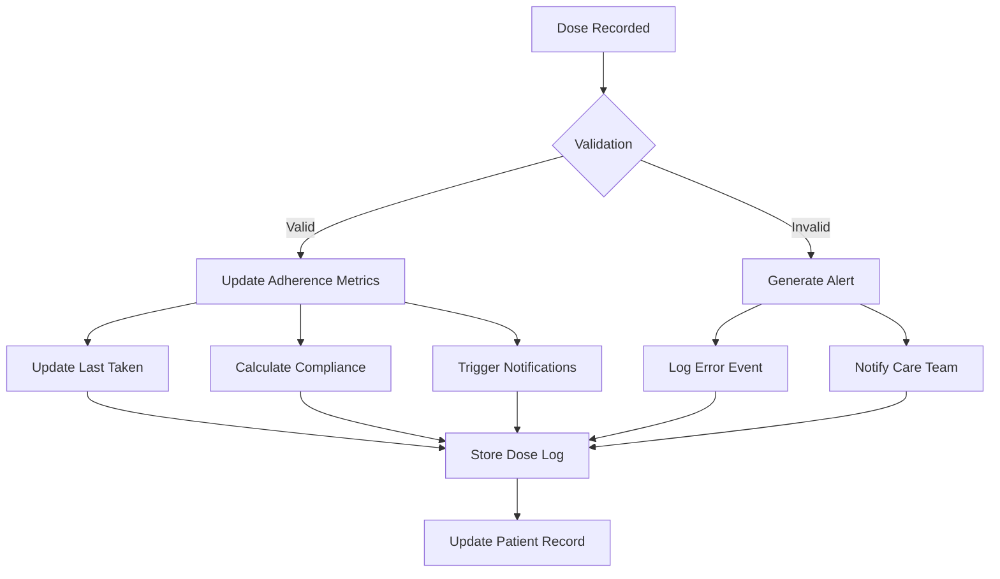
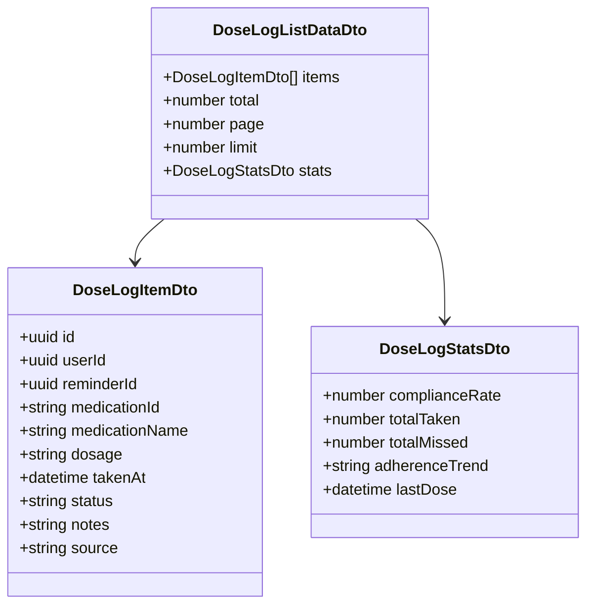
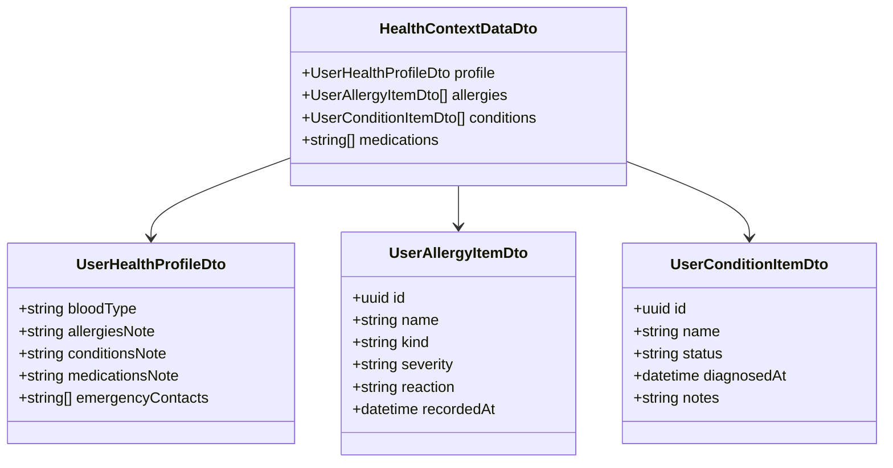
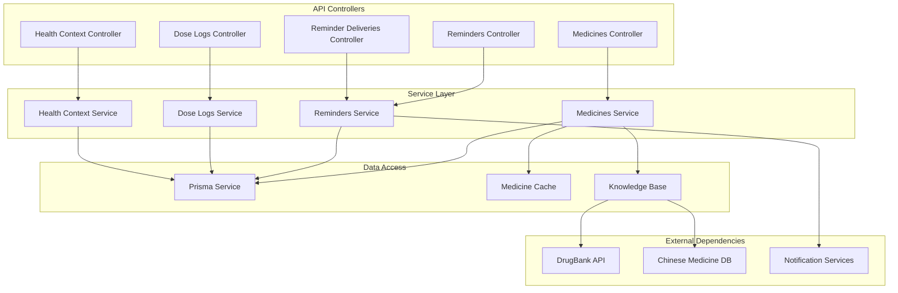

# Medication Management APIs

<cite>
**Referenced Files in This Document**
- [medicines.controller.ts](file://Lucent/src/modules/medicines/medicines.controller.ts)
- [medicines.service.ts](file://Lucent/src/modules/medicines/medicines.service.ts)
- [medicines.utils.ts](file://Lucent/src/modules/medicines/medicines.utils.ts)
- [medicines.dto.ts](file://Lucent/src/modules/medicines/dto/medicines.dto.ts)
- [medicines.cache.ts](file://Lucent/src/modules/medicines/cache/medicines.cache.ts)
- [medicines.sources.ts](file://Lucent/src/modules/medicines/sources/medicines.sources.ts)
- [medicine-reminders.controller.ts](file://Lucent/src/modules/medicine-reminders/medicine-reminders.controller.ts)
- [medicine-reminders.service.ts](file://Lucent/src/modules/medicine-reminders/medicine-reminders.service.ts)
- [reminder-deliveries.controller.ts](file://Lucent/src/modules/medicine-reminders/reminder-deliveries.controller.ts)
- [medicine-reminders.dto.ts](file://Lucent/src/modules/medicine-reminders/dto/medicine-reminders.dto.ts)
- [medicine-dose-logs.controller.ts](file://Lucent/src/modules/medicine-dose-logs/medicine-dose-logs.controller.ts)
- [medicine-dose-logs.service.ts](file://Lucent/src/modules/medicine-dose-logs/medicine-dose-logs.service.ts)
- [medicine-dose-logs.dto.ts](file://Lucent/src/modules/medicine-dose-logs/dto/medicine-dose-logs.dto.ts)
- [user-health-context.controller.ts](file://Lucent/src/modules/user-health-context/user-health-context.controller.ts)
- [user-health-context.service.ts](file://Lucent/src/modules/user-health-context/user-health-context.service.ts)
- [user-health-context.dto.ts](file://Lucent/src/modules/user-health-context/dto/user-health-context.dto.ts)
- [schema.prisma](file://Lucent/prisma/schema.prisma)
- [import-medicine-knowledge.js](file://Lucent/scripts/medicine/import-medicine-knowledge.js)
- [drugbank_drugs.py](file://Lucent/scripts/medicine/parsers/drugbank_drugs.py)
- [cn_products.py](file://Lucent/scripts/medicine/parsers/cn_products.py)
- [common.py](file://Lucent/scripts/medicine/parsers/common.py)
- [openapi.json](file://Lucent/docs/openapi.json)
- [MedicinesApi.md](file://packages/lucent_openapi/doc/MedicinesApi.md)
- [MedicineRemindersApi.md](file://packages/lucent_openapi/doc/MedicineRemindersApi.md)
- [ReminderDeliveriesApi.md](file://packages/lucent_openapi/doc/ReminderDeliveriesApi.md)
- [MedicineDoseLogsApi.md](file://packages/lucent_openapi/doc/MedicineDoseLogsApi.md)
</cite>

## Table of Contents
1. [Introduction](#introduction)
2. [Project Structure](#project-structure)
3. [Core Components](#core-components)
4. [Architecture Overview](#architecture-overview)
5. [Detailed Component Analysis](#detailed-component-analysis)
6. [Dependency Analysis](#dependency-analysis)
7. [Performance Considerations](#performance-considerations)
8. [Troubleshooting Guide](#troubleshooting-guide)
9. [Conclusion](#conclusion)

## Introduction
This document provides comprehensive API documentation for medication management endpoints within the Lumos healthcare platform. It covers drug search, medication tracking, reminder scheduling, and dose logging capabilities. The system integrates multiple drug databases including Chinese medicines and DrugBank, performs medication interaction checking, and manages reminder delivery. The documentation includes request/response schemas, integration patterns, and practical usage examples tailored for healthcare applications.

## Project Structure
The medication management functionality is organized into dedicated NestJS modules with clear separation of concerns:

**Diagram sources**
- [medicines.controller.ts](file://Lucent/src/modules/medicines/medicines.controller.ts)
- [medicine-reminders.controller.ts](file://Lucent/src/modules/medicine-reminders/medicine-reminders.controller.ts)
- [medicine-dose-logs.controller.ts](file://Lucent/src/modules/medicine-dose-logs/medicine-dose-logs.controller.ts)
- [user-health-context.controller.ts](file://Lucent/src/modules/user-health-context/user-health-context.controller.ts)

**Section sources**
- [medicines.controller.ts](file://Lucent/src/modules/medicines/medicines.controller.ts)
- [medicine-reminders.controller.ts](file://Lucent/src/modules/medicine-reminders/medicine-reminders.controller.ts)
- [medicine-dose-logs.controller.ts](file://Lucent/src/modules/medicine-dose-logs/medicine-dose-logs.controller.ts)
- [user-health-context.controller.ts](file://Lucent/src/modules/user-health-context/user-health-context.controller.ts)

## Core Components
The medication management system consists of four primary modules that handle different aspects of medication care:

### Medicines Module
Handles drug search, multi-source database integration, and medication information retrieval. Supports both Chinese medicines and DrugBank datasets with unified response schemas.

### Medicine Reminders Module  
Manages medication schedule reminders including creation, updates, cancellation, and delivery tracking. Features intelligent scheduling with conflict detection and interaction warnings.

### Medicine Dose Logs Module
Provides comprehensive dose logging capabilities with adherence tracking, missed dose detection, and historical dose analysis for clinical insights.

### User Health Context Module
Maintains patient-specific health information including allergies, conditions, and contraindications that inform medication safety checks and personalized recommendations.

**Section sources**
- [medicines.controller.ts](file://Lucent/src/modules/medicines/medicines.controller.ts)
- [medicine-reminders.controller.ts](file://Lucent/src/modules/medicine-reminders/medicine-reminders.controller.ts)
- [medicine-dose-logs.controller.ts](file://Lucent/src/modules/medicine-dose-logs/medicine-dose-logs.controller.ts)
- [user-health-context.controller.ts](file://Lucent/src/modules/user-health-context/user-health-context.controller.ts)

## Architecture Overview
The medication management system follows a layered architecture with clear separation between presentation, business logic, and data persistence:

**Diagram sources**
- [medicines.controller.ts](file://Lucent/src/modules/medicines/medicines.controller.ts)
- [medicines.service.ts](file://Lucent/src/modules/medicines/medicines.service.ts)
- [medicines.cache.ts](file://Lucent/src/modules/medicines/cache/medicines.cache.ts)
- [medicine-reminders.service.ts](file://Lucent/src/modules/medicine-reminders/medicine-reminders.service.ts)

## Detailed Component Analysis

### Medicines Search API
The medicines search endpoint provides unified access to multiple drug databases with intelligent caching and filtering capabilities.

#### Request Schema
The search endpoint accepts flexible query parameters for comprehensive medication discovery:

| Parameter | Type | Required | Description |
|-----------|------|----------|-------------|
| q | string | Yes | Search query (brand name, generic name, active ingredient) |
| source | enum | No | Data source filter (chinese, drugbank, combined) |
| limit | number | No | Maximum results (default: 20, max: 100) |
| offset | number | No | Pagination offset |
| filters | object | No | Advanced filtering criteria |

#### Response Schema
Search results are normalized into a unified format regardless of data source origin:

**Diagram sources**
- [medicines.dto.ts](file://Lucent/src/modules/medicines/dto/medicines.dto.ts)

#### Multi-Source Integration
The system seamlessly integrates Chinese medicines and DrugBank data through standardized transformation layers:

**Diagram sources**
- [medicines.sources.ts](file://Lucent/src/modules/medicines/sources/medicines.sources.ts)
- [cn_products.py](file://Lucent/scripts/medicine/parsers/cn_products.py)
- [drugbank_drugs.py](file://Lucent/scripts/medicine/parsers/drugbank_drugs.py)

**Section sources**
- [medicines.controller.ts](file://Lucent/src/modules/medicines/medicines.controller.ts)
- [medicines.dto.ts](file://Lucent/src/modules/medicines/dto/medicines.dto.ts)
- [medicines.sources.ts](file://Lucent/src/modules/medicines/sources/medicines.sources.ts)

### Medicine Reminders API
The reminder system provides comprehensive medication scheduling with safety checks and delivery management.

#### Reminder Creation Workflow

**Diagram sources**
- [medicine-reminders.controller.ts](file://Lucent/src/modules/medicine-reminders/medicine-reminders.controller.ts)
- [medicine-reminders.service.ts](file://Lucent/src/modules/medicine-reminders/medicine-reminders.service.ts)

#### Reminder Data Model

**Diagram sources**
- [medicine-reminders.dto.ts](file://Lucent/src/modules/medicine-reminders/dto/medicine-reminders.dto.ts)

**Section sources**
- [medicine-reminders.controller.ts](file://Lucent/src/modules/medicine-reminders/medicine-reminders.controller.ts)
- [medicine-reminders.dto.ts](file://Lucent/src/modules/medicine-reminders/dto/medicine-reminders.dto.ts)

### Medicine Dose Logs API
The dose logging system tracks medication adherence with comprehensive audit trails and analytics.

#### Dose Logging Workflow

**Diagram sources**
- [medicine-dose-logs.controller.ts](file://Lucent/src/modules/medicine-dose-logs/medicine-dose-logs.controller.ts)
- [medicine-dose-logs.service.ts](file://Lucent/src/modules/medicine-dose-logs/medicine-dose-logs.service.ts)

#### Dose Log Data Model

**Diagram sources**
- [medicine-dose-logs.dto.ts](file://Lucent/src/modules/medicine-dose-logs/dto/medicine-dose-logs.dto.ts)

**Section sources**
- [medicine-dose-logs.controller.ts](file://Lucent/src/modules/medicine-dose-logs/medicine-dose-logs.controller.ts)
- [medicine-dose-logs.dto.ts](file://Lucent/src/modules/medicine-dose-logs/dto/medicine-dose-logs.dto.ts)

### User Health Context API
The health context module maintains patient-specific medical information crucial for safe medication management.

#### Health Context Data Model

**Diagram sources**
- [user-health-context.dto.ts](file://Lucent/src/modules/user-health-context/dto/user-health-context.dto.ts)

**Section sources**
- [user-health-context.controller.ts](file://Lucent/src/modules/user-health-context/user-health-context.controller.ts)
- [user-health-context.dto.ts](file://Lucent/src/modules/user-health-context/dto/user-health-context.dto.ts)

## Dependency Analysis
The medication management system exhibits strong modularity with clear dependency boundaries:

**Diagram sources**
- [medicines.controller.ts](file://Lucent/src/modules/medicines/medicines.controller.ts)
- [medicine-reminders.controller.ts](file://Lucent/src/modules/medicine-reminders/medicine-reminders.controller.ts)
- [medicine-dose-logs.controller.ts](file://Lucent/src/modules/medicine-dose-logs/medicine-dose-logs.controller.ts)
- [user-health-context.controller.ts](file://Lucent/src/modules/user-health-context/user-health-context.controller.ts)

**Section sources**
- [medicines.controller.ts](file://Lucent/src/modules/medicines/medicines.controller.ts)
- [medicine-reminders.controller.ts](file://Lucent/src/modules/medicine-reminders/medicine-reminders.controller.ts)
- [medicine-dose-logs.controller.ts](file://Lucent/src/modules/medicine-dose-logs/medicine-dose-logs.controller.ts)
- [user-health-context.controller.ts](file://Lucent/src/modules/user-health-context/user-health-context.controller.ts)

## Performance Considerations
The medication management system implements several performance optimization strategies:

### Caching Strategy
- **Medicine Search Cache**: Implements Redis-based caching for frequently accessed drug information
- **Result Pagination**: Limits search results to prevent memory overhead
- **Lazy Loading**: Loads related data only when requested

### Database Optimization
- **Indexing Strategy**: Optimized indexes on medication names, identifiers, and user associations
- **Connection Pooling**: Efficient database connection management
- **Query Optimization**: Batch operations for bulk data processing

### Scalability Features
- **Horizontal Scaling**: Stateless API design supports load balancing
- **Asynchronous Processing**: Background jobs for heavy computations
- **CDN Integration**: Static asset optimization for images and documents

## Troubleshooting Guide
Common issues and their resolutions:

### Medication Search Issues
- **Empty Results**: Verify search query syntax and consider broadening filters
- **Slow Responses**: Check cache health and database connection status
- **Duplicate Results**: Review multi-source integration settings

### Reminder System Problems
- **Missing Reminders**: Verify timezone settings and device notification permissions
- **Incorrect Scheduling**: Validate medication frequency and timing configurations
- **Delivery Failures**: Check notification service status and retry policies

### Data Synchronization
- **Outdated Information**: Monitor knowledge base import schedules
- **Cache Inconsistencies**: Clear caches and verify data source connectivity
- **Integration Errors**: Review external API credentials and rate limits

**Section sources**
- [medicines.cache.ts](file://Lucent/src/modules/medicines/cache/medicines.cache.ts)
- [import-medicine-knowledge.js](file://Lucent/scripts/medicine/import-medicine-knowledge.js)

## Conclusion
The Lumos medication management system provides a comprehensive, scalable solution for healthcare applications requiring medication tracking, reminder management, and safety monitoring. Its modular architecture, multi-source drug integration, and robust safety checking capabilities make it suitable for diverse healthcare environments. The system's emphasis on performance optimization and extensibility ensures reliable operation in production healthcare settings while maintaining flexibility for future enhancements.