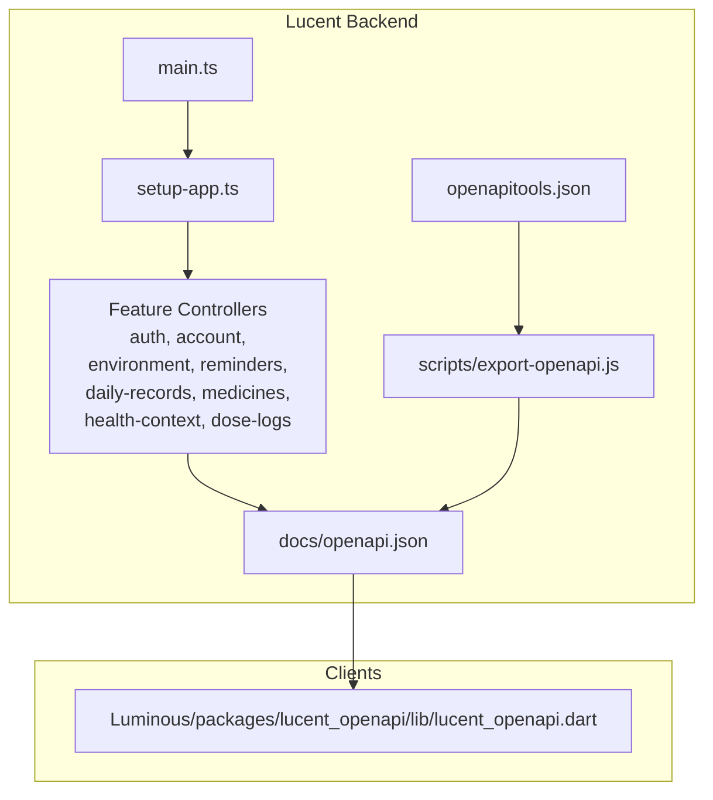
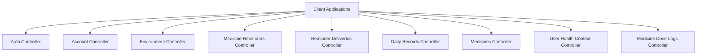
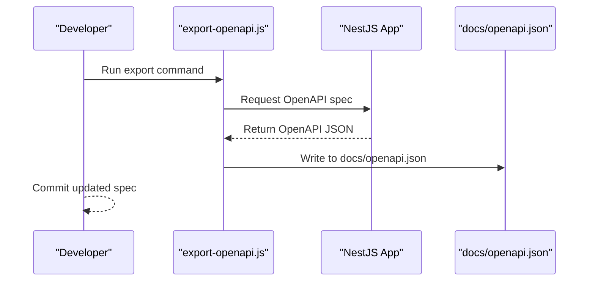
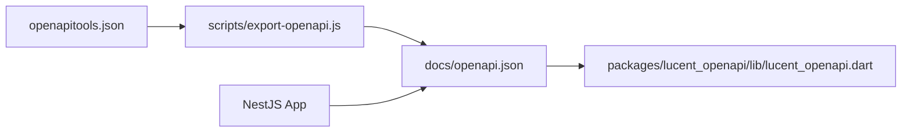

# OpenAPI Specification

<cite>
**Referenced Files in This Document**
- [openapi.json](file://Lucent/docs/openapi.json)
- [export-openapi.js](file://Lucent/scripts/export-openapi.js)
- [openapitools.json](file://Lucent/openapitools.json)
- [app.controller.ts](file://Lucent/src/app.controller.ts)
- [setup-app.ts](file://Lucent/src/setup-app.ts)
- [main.ts](file://Lucent/src/main.ts)
- [environment.controller.ts](file://Lucent/src/modules/environment/environment.controller.ts)
- [medicine-reminders.controller.ts](file://Lucent/src/modules/medicine-reminders/medicine-reminders.controller.ts)
- [reminder-deliveries.controller.ts](file://Lucent/src/modules/medicine-reminders/reminder-deliveries.controller.ts)
- [daily-records.controller.ts](file://Lucent/src/modules/daily-records/daily-records.controller.ts)
- [medicines.controller.ts](file://Lucent/src/modules/medicines/medicines.controller.ts)
- [account.controller.ts](file://Lucent/src/modules/account/account.controller.ts)
- [auth.controller.ts](file://Lucent/src/modules/auth/auth.controller.ts)
- [user-health-context.controller.ts](file://Lucent/src/modules/user-health-context/user-health-context.controller.ts)
- [medicine-dose-logs.controller.ts](file://Lucent/src/modules/medicine-dose-logs/medicine-dose-logs.controller.ts)
- [environment.md](file://Lucent/docs/environment.md)
- [data-sources.md](file://Lucent/docs/public/data-sources.md)
- [environment-contract.md](file://Lucent/docs/public/environment-contract.md)
- [reminder-contract.md](file://Lucent/docs/public/reminder-contract.md)
- [lucent_openapi.dart](file://Luminous/packages/lucent_openapi/lib/lucent_openapi.dart)
</cite>

## Table of Contents
1. [Introduction](#introduction)
2. [Project Structure](#project-structure)
3. [Core Components](#core-components)
4. [Architecture Overview](#architecture-overview)
5. [Detailed Component Analysis](#detailed-component-analysis)
6. [Dependency Analysis](#dependency-analysis)
7. [Performance Considerations](#performance-considerations)
8. [Troubleshooting Guide](#troubleshooting-guide)
9. [Conclusion](#conclusion)
10. [Appendices](#appendices)

## Introduction
This document provides comprehensive OpenAPI 3.0 specification documentation for the Lumos API, derived from the backend service (Lucent). It covers the complete API contract, endpoint definitions, request/response schemas, data models, validation rules, and environment/reminder system specifications. It also documents the OpenAPI export process, schema definitions, data type mappings, API versioning strategy, backward compatibility guarantees, deprecation timelines, and integration guidelines for client generation.

## Project Structure
The Lumos API is implemented as a NestJS application. The OpenAPI specification is exported from the running server and stored as a static JSON file. The OpenAPI tooling configuration defines how the specification is generated and validated. The API surface is organized into feature-focused modules, each exposing controllers that define endpoints and DTOs.

**Diagram sources**
- [main.ts](file://Lucent/src/main.ts)
- [setup-app.ts](file://Lucent/src/setup-app.ts)
- [app.controller.ts](file://Lucent/src/app.controller.ts)
- [openapi.json](file://Lucent/docs/openapi.json)
- [export-openapi.js](file://Lucent/scripts/export-openapi.js)
- [openapitools.json](file://Lucent/openapitools.json)
- [lucent_openapi.dart](file://Luminous/packages/lucent_openapi/lib/lucent_openapi.dart)

**Section sources**
- [main.ts](file://Lucent/src/main.ts)
- [setup-app.ts](file://Lucent/src/setup-app.ts)
- [openapi.json](file://Lucent/docs/openapi.json)
- [export-openapi.js](file://Lucent/scripts/export-openapi.js)
- [openapitools.json](file://Lucent/openapitools.json)

## Core Components
- OpenAPI specification: The authoritative API contract is represented by the OpenAPI 3.0 JSON file located at docs/openapi.json. This file enumerates all paths, schemas, parameters, responses, and security schemes.
- OpenAPI export pipeline: The export script generates the OpenAPI document from the running NestJS application and writes it to docs/openapi.json. Tooling configuration in openapitools.json governs the generator behavior.
- Feature controllers: Each module controller exposes endpoints for its domain (authentication, account, environment, medicine reminders, daily records, medicines, user health context, and medicine dose logs).
- Client generation: The Flutter/Dart client library (packages/lucent_openapi) consumes the OpenAPI specification to generate strongly-typed APIs and models.

Key runtime entry points:
- Application bootstrap initializes the NestJS server and registers OpenAPI metadata.
- The setup module configures Swagger/OpenAPI documentation and routes.
- Feature controllers define endpoints and DTOs that are reflected in the OpenAPI document.

**Section sources**
- [openapi.json](file://Lucent/docs/openapi.json)
- [export-openapi.js](file://Lucent/scripts/export-openapi.js)
- [openapitools.json](file://Lucent/openapitools.json)
- [app.controller.ts](file://Lucent/src/app.controller.ts)
- [setup-app.ts](file://Lucent/src/setup-app.ts)
- [main.ts](file://Lucent/src/main.ts)

## Architecture Overview
The API follows a modular NestJS architecture. Each module encapsulates a bounded context and exposes a set of endpoints. The OpenAPI document aggregates all controllers and their schemas into a single contract.

**Diagram sources**
- [auth.controller.ts](file://Lucent/src/modules/auth/auth.controller.ts)
- [account.controller.ts](file://Lucent/src/modules/account/account.controller.ts)
- [environment.controller.ts](file://Lucent/src/modules/environment/environment.controller.ts)
- [medicine-reminders.controller.ts](file://Lucent/src/modules/medicine-reminders/medicine-reminders.controller.ts)
- [reminder-deliveries.controller.ts](file://Lucent/src/modules/medicine-reminders/reminder-deliveries.controller.ts)
- [daily-records.controller.ts](file://Lucent/src/modules/daily-records/daily-records.controller.ts)
- [medicines.controller.ts](file://Lucent/src/modules/medicines/medicines.controller.ts)
- [user-health-context.controller.ts](file://Lucent/src/modules/user-health-context/user-health-context.controller.ts)
- [medicine-dose-logs.controller.ts](file://Lucent/src/modules/medicine-dose-logs/medicine-dose-logs.controller.ts)

## Detailed Component Analysis

### Authentication and Account Management
Endpoints under this category manage user registration, login, session refresh, password changes, email updates, and account deletion. The OpenAPI document defines request/response schemas, validation rules, and error responses for each operation.

Representative paths:
- POST /auth/register
- POST /auth/login
- POST /auth/refresh
- POST /auth/logout
- POST /auth/forgot-password
- POST /auth/reset-password
- POST /auth/send-verification-code
- GET /account/me
- PUT /account
- DELETE /account
- PUT /account/change-password
- PUT /account/change-email

Validation rules:
- Email format and presence constraints
- Password strength requirements
- Verification code length and format
- Token refresh window policies

Security:
- JWT bearer tokens for protected endpoints
- Rate limiting and cooldown messages for sensitive operations

**Section sources**
- [auth.controller.ts](file://Lucent/src/modules/auth/auth.controller.ts)
- [account.controller.ts](file://Lucent/src/modules/account/account.controller.ts)
- [openapi.json](file://Lucent/docs/openapi.json)

### Environment Monitoring
The environment module collects and exposes environmental quality metrics and data source references. The OpenAPI document defines snapshot schemas, indicator models, and pagination for environment data.

Representative paths:
- GET /environment/snapshot
- GET /environment/data-sources

Contracts:
- Snapshot response includes air quality, pollen, UV, and humidity indicators
- Data source enumeration defines supported providers
- Pagination and filtering parameters for historical snapshots

**Section sources**
- [environment.controller.ts](file://Lucent/src/modules/environment/environment.controller.ts)
- [openapi.json](file://Lucent/docs/openapi.json)
- [environment.md](file://Lucent/docs/environment.md)
- [data-sources.md](file://Lucent/docs/public/data-sources.md)
- [environment-contract.md](file://Lucent/docs/public/environment-contract.md)

### Medicine Reminders and Delivery Notifications
The reminders module manages scheduled medication notifications and delivery logs. The OpenAPI document defines reminder creation/update schemas, delivery item models, and list pagination.

Representative paths:
- GET /medicine-reminders
- POST /medicine-reminders
- GET /medicine-reminders/{id}
- PUT /medicine-reminders/{id}
- DELETE /medicine-reminders/{id}
- GET /reminder-deliveries
- GET /reminder-deliveries/{id}

Contracts:
- Reminder item DTOs include scheduling, dosage, and status fields
- Delivery item DTOs capture notification attempts and outcomes
- List responses support pagination and filtering

**Section sources**
- [medicine-reminders.controller.ts](file://Lucent/src/modules/medicine-reminders/medicine-reminders.controller.ts)
- [reminder-deliveries.controller.ts](file://Lucent/src/modules/medicine-reminders/reminder-deliveries.controller.ts)
- [openapi.json](file://Lucent/docs/openapi.json)
- [reminder-contract.md](file://Lucent/docs/public/reminder-contract.md)

### Daily Records
The daily records module handles user-generated health entries, including attachments and summaries. The OpenAPI document defines record creation, update, list, and summary schemas.

Representative paths:
- GET /daily-records
- POST /daily-records
- GET /daily-records/{id}
- PUT /daily-records/{id}
- DELETE /daily-records/{id}
- GET /daily-records/summary

Contracts:
- Record item DTOs include kind, attachments, and metadata
- Attachment DTOs define upload kinds and storage references
- Summary DTOs aggregate daily metrics

**Section sources**
- [daily-records.controller.ts](file://Lucent/src/modules/daily-records/daily-records.controller.ts)
- [openapi.json](file://Lucent/docs/openapi.json)

### Medicines and Medicine Knowledge
The medicines module provides search and detail endpoints backed by curated knowledge sources. The OpenAPI document defines search response schemas, pagination DTOs, and detail models.

Representative paths:
- GET /medicines/search
- GET /medicines/{id}
- GET /medicines/{id}/detail

Contracts:
- Search response includes items, pagination meta, and source attribution
- Detail models include CN and DrugBank variants with cross-references

**Section sources**
- [medicines.controller.ts](file://Lucent/src/modules/medicines/medicines.controller.ts)
- [openapi.json](file://Lucent/docs/openapi.json)

### User Health Context
The user health context module manages allergies, conditions, and profile data. The OpenAPI document defines health context DTOs, item schemas, and update operations.

Representative paths:
- GET /user-health-context/allergies
- POST /user-health-context/allergies
- PUT /user-health-context/allergies/{id}
- DELETE /user-health-context/allergies/{id}
- GET /user-health-context/conditions
- POST /user-health-context/conditions
- PUT /user-health-context/conditions/{id}
- DELETE /user-health-context/conditions/{id}
- GET /user-health-context/profile
- PUT /user-health-context/profile

Contracts:
- Item DTOs include severity, status, and timestamps
- Profile DTOs capture demographic and lifestyle attributes

**Section sources**
- [user-health-context.controller.ts](file://Lucent/src/modules/user-health-context/user-health-context.controller.ts)
- [openapi.json](file://Lucent/docs/openapi.json)

### Medicine Dose Logs
The dose logs module tracks medication intake history with status and pagination.

Representative paths:
- GET /medicine-dose-logs
- POST /medicine-dose-logs
- GET /medicine-dose-logs/{id}
- PUT /medicine-dose-logs/{id}
- DELETE /medicine-dose-logs/{id}

Contracts:
- Log item DTOs include status, timestamp, and reminder linkage
- List responses support pagination and filtering

**Section sources**
- [medicine-dose-logs.controller.ts](file://Lucent/src/modules/medicine-dose-logs/medicine-dose-logs.controller.ts)
- [openapi.json](file://Lucent/docs/openapi.json)

### OpenAPI Export and Validation
The OpenAPI specification is generated from the running NestJS application and written to docs/openapi.json. The export script integrates with the OpenAPI Generator tooling via openapitools.json.

**Diagram sources**
- [export-openapi.js](file://Lucent/scripts/export-openapi.js)
- [openapi.json](file://Lucent/docs/openapi.json)

**Section sources**
- [export-openapi.js](file://Lucent/scripts/export-openapi.js)
- [openapitools.json](file://Lucent/openapitools.json)
- [openapi.json](file://Lucent/docs/openapi.json)

## Dependency Analysis
The API depends on the NestJS framework and OpenAPI tooling to produce a machine-readable contract. Clients consume the OpenAPI document to generate typed SDKs.

**Diagram sources**
- [openapi.json](file://Lucent/docs/openapi.json)
- [export-openapi.js](file://Lucent/scripts/export-openapi.js)
- [openapitools.json](file://Lucent/openapitools.json)
- [lucent_openapi.dart](file://Luminous/packages/lucent_openapi/lib/lucent_openapi.dart)

**Section sources**
- [openapi.json](file://Lucent/docs/openapi.json)
- [export-openapi.js](file://Lucent/scripts/export-openapi.js)
- [openapitools.json](file://Lucent/openapitools.json)
- [lucent_openapi.dart](file://Luminous/packages/lucent_openapi/lib/lucent_openapi.dart)

## Performance Considerations
- Pagination: List endpoints return paginated results to limit payload sizes and improve responsiveness.
- Filtering and sorting: Query parameters enable efficient client-side filtering and reduce server load.
- Caching: DTOs and enums minimize repeated schema definitions and improve client generation performance.
- Compression: Enable gzip/brotli on the server to reduce transfer sizes for the OpenAPI document.

## Troubleshooting Guide
Common issues and resolutions:
- Out-of-sync OpenAPI document: Regenerate the spec using the export script and ensure the latest server metadata is included.
- Client generation failures: Validate the OpenAPI document against the generator configuration and resolve schema conflicts.
- Endpoint mismatches: Confirm controller route decorators match the documented paths and parameters.

Operational references:
- OpenAPI export script and tooling configuration
- OpenAPI specification file for schema validation

**Section sources**
- [export-openapi.js](file://Lucent/scripts/export-openapi.js)
- [openapitools.json](file://Lucent/openapitools.json)
- [openapi.json](file://Lucent/docs/openapi.json)

## Conclusion
The Lumos API adheres to OpenAPI 3.0 standards and provides a comprehensive contract covering authentication, environment monitoring, medicine reminders, daily records, medicines, user health context, and dose logs. The specification is generated from the backend and consumed by clients to ensure type-safe integrations. Backward compatibility is maintained through careful schema evolution and deprecation practices.

## Appendices

### API Versioning Strategy
- Versioning approach: The current OpenAPI document does not specify explicit API version segments in paths. Versioning is managed by evolving the schema while maintaining backward compatibility where possible.
- Evolution policy: New endpoints and optional fields are introduced without breaking existing clients. Deprecated fields are marked accordingly in the schema.

**Section sources**
- [openapi.json](file://Lucent/docs/openapi.json)

### Backward Compatibility and Deprecation
- Backward compatibility: Existing request/response shapes remain unchanged when adding new optional fields or endpoints.
- Deprecation timeline: Deprecated fields and endpoints are retained for a defined period with clear notices in the schema and release notes.

**Section sources**
- [openapi.json](file://Lucent/docs/openapi.json)

### Client Generation Guidelines
- Dart/Flutter: Use the OpenAPI Generator with the provided tooling configuration to generate the Dart client library from the OpenAPI document.
- Other languages: Apply the same generator approach with language-specific configurations to produce typed clients.

**Section sources**
- [openapitools.json](file://Lucent/openapitools.json)
- [openapi.json](file://Lucent/docs/openapi.json)
- [lucent_openapi.dart](file://Luminous/packages/lucent_openapi/lib/lucent_openapi.dart)