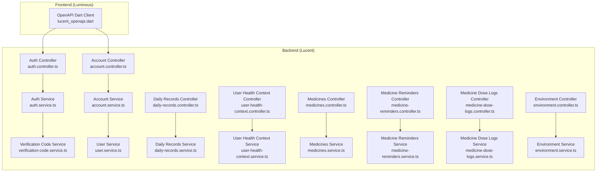
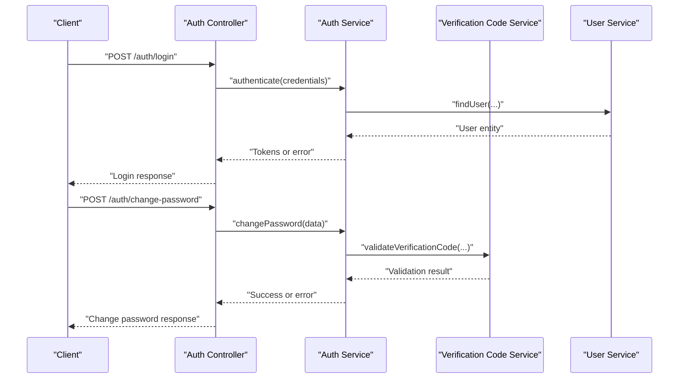
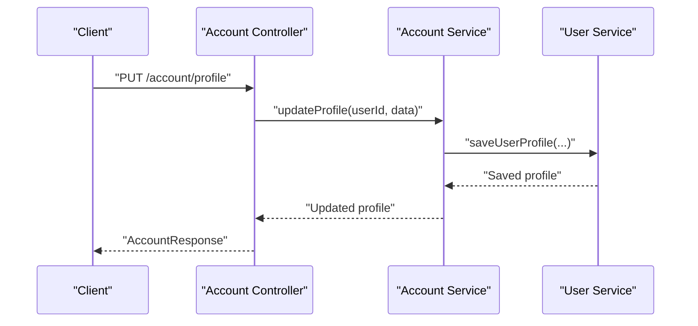
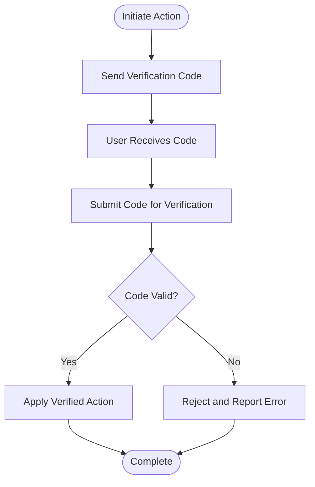
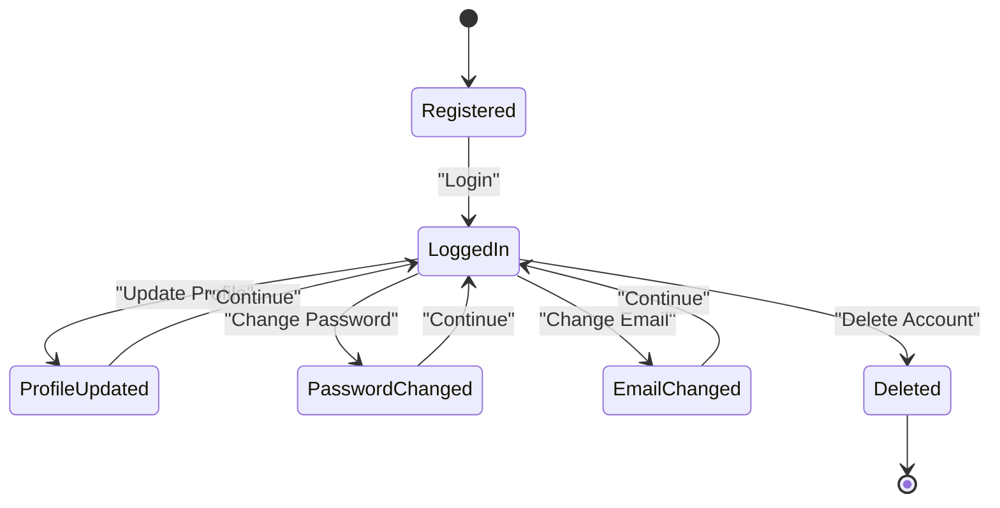
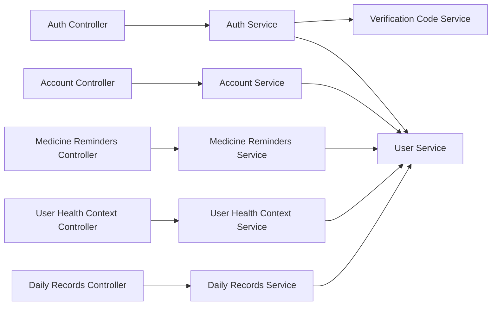

# User Management APIs

<cite>
**Referenced Files in This Document**
- [account.controller.ts](file://Lucent/src/modules/account/account.controller.ts)
- [account.service.ts](file://Lucent/src/modules/account/account.service.ts)
- [account-response.dto.ts](file://Lucent/src/modules/account/dto/account-response.dto.ts)
- [update-account.dto.ts](file://Lucent/src/modules/account/dto/update-account.dto.ts)
- [change-email.dto.ts](file://Lucent/src/modules/auth/dto/change-email.dto.ts)
- [change-password.dto.ts](file://Lucent/src/modules/auth/dto/change-password.dto.ts)
- [delete-account.dto.ts](file://Lucent/src/modules/auth/dto/delete-account.dto.ts)
- [forgot-password.dto.ts](file://Lucent/src/modules/auth/dto/forgot-password.dto.ts)
- [reset-password.dto.ts](file://Lucent/src/modules/auth/dto/reset-password.dto.ts)
- [verify-email.dto.ts](file://Lucent/src/modules/auth/dto/verify-email.dto.ts)
- [send-verification-code.dto.ts](file://Lucent/src/modules/auth/dto/send-verification-code.dto.ts)
- [auth-responses.dto.ts](file://Lucent/src/modules/auth/dto/responses/auth-responses.dto.ts)
- [common.dto.ts](file://Lucent/src/modules/auth/dto/responses/common.dto.ts)
- [auth.controller.ts](file://Lucent/src/modules/auth/auth.controller.ts)
- [auth.service.ts](file://Lucent/src/modules/auth/auth.service.ts)
- [verification-code.service.ts](file://Lucent/src/modules/auth/verification-code.service.ts)
- [wechat-mobile-oauth.provider.ts](file://Lucent/src/modules/auth/wechat-mobile-oauth.provider.ts)
- [wechat-web-oauth.provider.ts](file://Lucent/src/modules/auth/wechat-web-oauth.provider.ts)
- [user.service.ts](file://Lucent/src/modules/user/user.service.ts)
- [daily-records.controller.ts](file://Lucent/src/modules/daily-records/daily-records.controller.ts)
- [daily-records.service.ts](file://Lucent/src/modules/daily-records/daily-records.service.ts)
- [user-health-context.controller.ts](file://Lucent/src/modules/user-health-context/user-health-context.controller.ts)
- [user-health-context.service.ts](file://Lucent/src/modules/user-health-context/user-health-context.service.ts)
- [medicines.controller.ts](file://Lucent/src/modules/medicines/medicines.controller.ts)
- [medicines.service.ts](file://Lucent/src/modules/medicines/medicines.service.ts)
- [medicine-reminders.controller.ts](file://Lucent/src/modules/medicine-reminders/medicine-reminders.controller.ts)
- [medicine-reminders.service.ts](file://Lucent/src/modules/medicine-reminders/medicine-reminders.service.ts)
- [medicine-dose-logs.controller.ts](file://Lucent/src/modules/medicine-dose-logs/medicine-dose-logs.controller.ts)
- [medicine-dose-logs.service.ts](file://Lucent/src/modules/medicine-dose-logs/medicine-dose-logs.service.ts)
- [environment.controller.ts](file://Lucent/src/modules/environment/environment.controller.ts)
- [environment.service.ts](file://Lucent/src/modules/environment/environment.service.ts)
- [openapi.json](file://Lucent/docs/openapi.json)
- [lucent_openapi.dart](file://Luminous/packages/lucent_openapi/lib/lucent_openapi.dart)
</cite>

## Table of Contents
1. [Introduction](#introduction)
2. [Project Structure](#project-structure)
3. [Core Components](#core-components)
4. [Architecture Overview](#architecture-overview)
5. [Detailed Component Analysis](#detailed-component-analysis)
6. [Dependency Analysis](#dependency-analysis)
7. [Performance Considerations](#performance-considerations)
8. [Troubleshooting Guide](#troubleshooting-guide)
9. [Conclusion](#conclusion)
10. [Appendices](#appendices)

## Introduction
This document provides comprehensive API documentation for user management endpoints in the system. It covers account profile management, password changes, email updates, account deletion, and user preference settings. It also documents user identity management, profile customization, notification preferences, and account security controls. Request and response schemas are described for account operations, profile updates, security settings, and related workflows. Practical examples illustrate user profile workflows, security operations, and account lifecycle management. Privacy and compliance considerations are addressed alongside implementation guidance for administrative interfaces and account management systems.

## Project Structure
The user management APIs are primarily implemented in the backend service module under Lucent, with supporting DTOs, services, and controllers. The frontend client library is generated from OpenAPI specifications and exposes strongly typed APIs for consuming user management features.

**Diagram sources**
- [account.controller.ts](file://Lucent/src/modules/account/account.controller.ts)
- [account.service.ts](file://Lucent/src/modules/account/account.service.ts)
- [auth.controller.ts](file://Lucent/src/modules/auth/auth.controller.ts)
- [auth.service.ts](file://Lucent/src/modules/auth/auth.service.ts)
- [verification-code.service.ts](file://Lucent/src/modules/auth/verification-code.service.ts)
- [user.service.ts](file://Lucent/src/modules/user/user.service.ts)
- [daily-records.controller.ts](file://Lucent/src/modules/daily-records/daily-records.controller.ts)
- [daily-records.service.ts](file://Lucent/src/modules/daily-records/daily-records.service.ts)
- [user-health-context.controller.ts](file://Lucent/src/modules/user-health-context/user-health-context.controller.ts)
- [user-health-context.service.ts](file://Lucent/src/modules/user-health-context/user-health-context.service.ts)
- [medicines.controller.ts](file://Lucent/src/modules/medicines/medicines.controller.ts)
- [medicines.service.ts](file://Lucent/src/modules/medicines/medicines.service.ts)
- [medicine-reminders.controller.ts](file://Lucent/src/modules/medicine-reminders/medicine-reminders.controller.ts)
- [medicine-reminders.service.ts](file://Lucent/src/modules/medicine-reminders/medicine-reminders.service.ts)
- [medicine-dose-logs.controller.ts](file://Lucent/src/modules/medicine-dose-logs/medicine-dose-logs.controller.ts)
- [medicine-dose-logs.service.ts](file://Lucent/src/modules/medicine-dose-logs/medicine-dose-logs.service.ts)
- [environment.controller.ts](file://Lucent/src/modules/environment/environment.controller.ts)
- [environment.service.ts](file://Lucent/src/modules/environment/environment.service.ts)
- [lucent_openapi.dart](file://Luminous/packages/lucent_openapi/lib/lucent_openapi.dart)

**Section sources**
- [account.controller.ts](file://Lucent/src/modules/account/account.controller.ts)
- [auth.controller.ts](file://Lucent/src/modules/auth/auth.controller.ts)
- [openapi.json](file://Lucent/docs/openapi.json)

## Core Components
- Account Management Module: Provides endpoints for retrieving and updating user account profiles, managing identities, and handling account lifecycle operations.
- Authentication Module: Handles login, logout, password management, email verification, and OAuth-based identity providers.
- User Service: Centralized service for user-related operations and data access.
- Supporting Services: Daily records, user health context, medicines, reminders, dose logs, and environment modules integrate with user management for comprehensive care workflows.

Key responsibilities:
- Profile management: Retrieve and update user profile attributes.
- Security operations: Change passwords, update emails, manage verification codes, and handle account deletion.
- Identity management: Link and manage external identities via OAuth providers.
- Preferences and notifications: Manage user preferences and related settings integrated across modules.

**Section sources**
- [account.service.ts](file://Lucent/src/modules/account/account.service.ts)
- [auth.service.ts](file://Lucent/src/modules/auth/auth.service.ts)
- [user.service.ts](file://Lucent/src/modules/user/user.service.ts)

## Architecture Overview
The user management APIs follow a layered architecture:
- Controllers expose HTTP endpoints for account and authentication operations.
- Services encapsulate business logic and coordinate data access.
- DTOs define strict request and response schemas.
- The frontend client is generated from OpenAPI specifications for type-safe consumption.

**Diagram sources**
- [auth.controller.ts](file://Lucent/src/modules/auth/auth.controller.ts)
- [auth.service.ts](file://Lucent/src/modules/auth/auth.service.ts)
- [verification-code.service.ts](file://Lucent/src/modules/auth/verification-code.service.ts)
- [user.service.ts](file://Lucent/src/modules/user/user.service.ts)

## Detailed Component Analysis

### Account Management Endpoints
Endpoints for account profile retrieval and updates, including identity management and lifecycle operations.

- GET /account/profile
  - Description: Retrieve current user account profile.
  - Authentication: Required.
  - Responses:
    - 200 OK: Returns account profile data.
    - 401 Unauthorized: Invalid or missing authentication.
    - 404 Not Found: User not found.
  - Schema reference: [AccountResponse DTO](file://Lucent/src/modules/account/dto/account-response.dto.ts)

- PUT /account/profile
  - Description: Update user profile attributes.
  - Authentication: Required.
  - Request body: [UpdateAccount DTO](file://Lucent/src/modules/account/dto/update-account.dto.ts)
  - Responses:
    - 200 OK: Updated profile data.
    - 400 Bad Request: Validation errors.
    - 401 Unauthorized: Invalid or missing authentication.
    - 404 Not Found: User not found.
  - Schema reference: [AccountResponse DTO](file://Lucent/src/modules/account/dto/account-response.dto.ts)

- DELETE /account
  - Description: Deactivate or delete user account per policy.
  - Authentication: Required.
  - Request body: [DeleteAccount DTO](file://Lucent/src/modules/auth/dto/delete-account.dto.ts)
  - Responses:
    - 200 OK: Deletion acknowledged.
    - 400 Bad Request: Validation errors.
    - 401 Unauthorized: Invalid or missing authentication.
    - 404 Not Found: User not found.

- GET /account/identities
  - Description: List linked identities (e.g., OAuth providers).
  - Authentication: Required.
  - Responses:
    - 200 OK: Array of identities.
    - 401 Unauthorized: Invalid or missing authentication.

- DELETE /account/identities/{provider}/{externalId}
  - Description: Unlink an external identity.
  - Authentication: Required.
  - Path parameters:
    - provider: Identity provider identifier.
    - externalId: External user identifier.
  - Responses:
    - 200 OK: Unlinked successfully.
    - 400 Bad Request: Invalid provider or externalId.
    - 401 Unauthorized: Invalid or missing authentication.

Example workflow: Profile update

**Diagram sources**
- [account.controller.ts](file://Lucent/src/modules/account/account.controller.ts)
- [account.service.ts](file://Lucent/src/modules/account/account.service.ts)
- [user.service.ts](file://Lucent/src/modules/user/user.service.ts)
- [account-response.dto.ts](file://Lucent/src/modules/account/dto/account-response.dto.ts)
- [update-account.dto.ts](file://Lucent/src/modules/account/dto/update-account.dto.ts)

**Section sources**
- [account.controller.ts](file://Lucent/src/modules/account/account.controller.ts)
- [account.service.ts](file://Lucent/src/modules/account/account.service.ts)
- [account-response.dto.ts](file://Lucent/src/modules/account/dto/account-response.dto.ts)
- [update-account.dto.ts](file://Lucent/src/modules/account/dto/update-account.dto.ts)
- [delete-account.dto.ts](file://Lucent/src/modules/auth/dto/delete-account.dto.ts)

### Authentication and Security Endpoints
Endpoints for login, logout, password management, email verification, and OAuth identity providers.

- POST /auth/login
  - Description: Authenticate user with credentials.
  - Request body: [Login DTO](file://Lucent/src/modules/auth/dto/login.dto.ts)
  - Responses:
    - 200 OK: Authentication tokens and user info.
    - 400 Bad Request: Validation errors.
    - 401 Unauthorized: Invalid credentials.

- POST /auth/logout
  - Description: Invalidate current session.
  - Authentication: Required.
  - Request body: [Logout DTO](file://Lucent/src/modules/auth/dto/logout.dto.ts)
  - Responses:
    - 200 OK: Logout successful.

- POST /auth/change-password
  - Description: Change current password after verification.
  - Authentication: Required.
  - Request body: [ChangePassword DTO](file://Lucent/src/modules/auth/dto/change-password.dto.ts)
  - Responses:
    - 200 OK: Password changed.
    - 400 Bad Request: Validation or policy errors.
    - 401 Unauthorized: Invalid or missing authentication.

- POST /auth/change-email
  - Description: Initiate email address change with verification.
  - Authentication: Required.
  - Request body: [ChangeEmail DTO](file://Lucent/src/modules/auth/dto/change-email.dto.ts)
  - Responses:
    - 200 OK: Verification code sent.
    - 400 Bad Request: Validation errors.
    - 401 Unauthorized: Invalid or missing authentication.

- POST /auth/verify-email
  - Description: Confirm new email address using verification code.
  - Authentication: Required.
  - Request body: [VerifyEmail DTO](file://Lucent/src/modules/auth/dto/verify-email.dto.ts)
  - Responses:
    - 200 OK: Email verified.
    - 400 Bad Request: Invalid or expired code.
    - 401 Unauthorized: Invalid or missing authentication.

- POST /auth/forgot-password
  - Description: Initiate password reset process.
  - Request body: [ForgotPassword DTO](file://Lucent/src/modules/auth/dto/forgot-password.dto.ts)
  - Responses:
    - 200 OK: Reset initiated.
    - 400 Bad Request: Validation errors.

- POST /auth/reset-password
  - Description: Complete password reset with token.
  - Request body: [ResetPassword DTO](file://Lucent/src/modules/auth/dto/reset-password.dto.ts)
  - Responses:
    - 200 OK: Password reset.
    - 400 Bad Request: Invalid or expired token.

- POST /auth/send-verification-code
  - Description: Send a new verification code for email or account actions.
  - Authentication: Required.
  - Request body: [SendVerificationCode DTO](file://Lucent/src/modules/auth/dto/send-verification-code.dto.ts)
  - Responses:
    - 200 OK: Code sent.
    - 400 Bad Request: Validation errors.

- POST /auth/oauth/authorize
  - Description: Authorize OAuth provider for linking or login.
  - Request body: [OAuth DTO](file://Lucent/src/modules/auth/dto/oauth.dto.ts)
  - Responses:
    - 200 OK: Authorization URL or callback data.
    - 400 Bad Request: Validation errors.

- POST /auth/oauth/callback
  - Description: Handle OAuth provider callback to finalize linking or login.
  - Request body: [OAuth DTO](file://Lucent/src/modules/auth/dto/oauth.dto.ts)
  - Responses:
    - 200 OK: Tokens or profile data.
    - 400 Bad Request: Validation errors.

Verification code flow

**Diagram sources**
- [verification-code.service.ts](file://Lucent/src/modules/auth/verification-code.service.ts)
- [send-verification-code.dto.ts](file://Lucent/src/modules/auth/dto/send-verification-code.dto.ts)
- [verify-email.dto.ts](file://Lucent/src/modules/auth/dto/verify-email.dto.ts)

**Section sources**
- [auth.controller.ts](file://Lucent/src/modules/auth/auth.controller.ts)
- [auth.service.ts](file://Lucent/src/modules/auth/auth.service.ts)
- [verification-code.service.ts](file://Lucent/src/modules/auth/verification-code.service.ts)
- [login.dto.ts](file://Lucent/src/modules/auth/dto/login.dto.ts)
- [logout.dto.ts](file://Lucent/src/modules/auth/dto/logout.dto.ts)
- [change-password.dto.ts](file://Lucent/src/modules/auth/dto/change-password.dto.ts)
- [change-email.dto.ts](file://Lucent/src/modules/auth/dto/change-email.dto.ts)
- [verify-email.dto.ts](file://Lucent/src/modules/auth/dto/verify-email.dto.ts)
- [forgot-password.dto.ts](file://Lucent/src/modules/auth/dto/forgot-password.dto.ts)
- [reset-password.dto.ts](file://Lucent/src/modules/auth/dto/reset-password.dto.ts)
- [send-verification-code.dto.ts](file://Lucent/src/modules/auth/dto/send-verification-code.dto.ts)
- [oauth.dto.ts](file://Lucent/src/modules/auth/dto/oauth.dto.ts)
- [wechat-mobile-oauth.provider.ts](file://Lucent/src/modules/auth/wechat-mobile-oauth.provider.ts)
- [wechat-web-oauth.provider.ts](file://Lucent/src/modules/auth/wechat-web-oauth.provider.ts)

### User Preferences and Notification Settings
Preferences and notification settings are integrated across modules. While dedicated endpoints may vary, typical operations include:
- Retrieving user preferences from profile data.
- Updating notification preferences via profile update endpoint.
- Managing reminder preferences through medicine reminders endpoints.

Integration points:
- Profile updates: [UpdateAccount DTO](file://Lucent/src/modules/account/dto/update-account.dto.ts)
- Reminder preferences: [MedicineReminders Controller](file://Lucent/src/modules/medicine-reminders/medicine-reminders.controller.ts)
- Health context preferences: [UserHealthContext Controller](file://Lucent/src/modules/user-health-context/user-health-context.controller.ts)

**Section sources**
- [update-account.dto.ts](file://Lucent/src/modules/account/dto/update-account.dto.ts)
- [medicine-reminders.controller.ts](file://Lucent/src/modules/medicine-reminders/medicine-reminders.controller.ts)
- [user-health-context.controller.ts](file://Lucent/src/modules/user-health-context/user-health-context.controller.ts)

### Data Export Requests
Data export capabilities are typically exposed via dedicated endpoints. The backend supports exporting user-related data (e.g., daily records, medication logs) which can be aggregated into a comprehensive export request.

Typical export operations:
- Export daily records for a period.
- Export medicine dose logs.
- Export user health context data.

Controllers and services involved:
- Daily records export: [DailyRecords Controller](file://Lucent/src/modules/daily-records/daily-records.controller.ts)
- Medicine dose logs export: [MedicineDoseLogs Controller](file://Lucent/src/modules/medicine-dose-logs/medicine-dose-logs.controller.ts)
- Health context export: [UserHealthContext Controller](file://Lucent/src/modules/user-health-context/user-health-context.controller.ts)

**Section sources**
- [daily-records.controller.ts](file://Lucent/src/modules/daily-records/daily-records.controller.ts)
- [medicine-dose-logs.controller.ts](file://Lucent/src/modules/medicine-dose-logs/medicine-dose-logs.controller.ts)
- [user-health-context.controller.ts](file://Lucent/src/modules/user-health-context/user-health-context.controller.ts)

### Account Lifecycle Management
End-to-end lifecycle from registration to deletion:
- Registration: Use auth registration endpoint (schema reference: [Register DTO](file://Lucent/src/modules/auth/dto/register.dto.ts)).
- Login: Use auth login endpoint (schema reference: [Login DTO](file://Lucent/src/modules/auth/dto/login.dto.ts)).
- Profile updates: Use account profile update endpoint (schema reference: [UpdateAccount DTO](file://Lucent/src/modules/account/dto/update-account.dto.ts)).
- Password/email changes: Use change-password and change-email endpoints (schemas: [ChangePassword DTO](file://Lucent/src/modules/auth/dto/change-password.dto.ts), [ChangeEmail DTO](file://Lucent/src/modules/auth/dto/change-email.dto.ts)).
- Deletion: Use account deletion endpoint (schema: [DeleteAccount DTO](file://Lucent/src/modules/auth/dto/delete-account.dto.ts)).

**Diagram sources**
- [auth.controller.ts](file://Lucent/src/modules/auth/auth.controller.ts)
- [account.controller.ts](file://Lucent/src/modules/account/account.controller.ts)
- [auth.service.ts](file://Lucent/src/modules/auth/auth.service.ts)
- [account.service.ts](file://Lucent/src/modules/account/account.service.ts)

## Dependency Analysis
The user management APIs depend on:
- Authentication services for secure access.
- Verification code service for sensitive operations requiring confirmation.
- User service for profile and identity data.
- Supporting modules for integrated features (health context, reminders, etc.).

**Diagram sources**
- [auth.controller.ts](file://Lucent/src/modules/auth/auth.controller.ts)
- [auth.service.ts](file://Lucent/src/modules/auth/auth.service.ts)
- [verification-code.service.ts](file://Lucent/src/modules/auth/verification-code.service.ts)
- [user.service.ts](file://Lucent/src/modules/user/user.service.ts)
- [account.controller.ts](file://Lucent/src/modules/account/account.controller.ts)
- [account.service.ts](file://Lucent/src/modules/account/account.service.ts)
- [medicine-reminders.controller.ts](file://Lucent/src/modules/medicine-reminders/medicine-reminders.controller.ts)
- [medicine-reminders.service.ts](file://Lucent/src/modules/medicine-reminders/medicine-reminders.service.ts)
- [user-health-context.controller.ts](file://Lucent/src/modules/user-health-context/user-health-context.controller.ts)
- [user-health-context.service.ts](file://Lucent/src/modules/user-health-context/user-health-context.service.ts)
- [daily-records.controller.ts](file://Lucent/src/modules/daily-records/daily-records.controller.ts)
- [daily-records.service.ts](file://Lucent/src/modules/daily-records/daily-records.service.ts)

**Section sources**
- [auth.controller.ts](file://Lucent/src/modules/auth/auth.controller.ts)
- [auth.service.ts](file://Lucent/src/modules/auth/auth.service.ts)
- [verification-code.service.ts](file://Lucent/src/modules/auth/verification-code.service.ts)
- [user.service.ts](file://Lucent/src/modules/user/user.service.ts)
- [account.controller.ts](file://Lucent/src/modules/account/account.controller.ts)
- [account.service.ts](file://Lucent/src/modules/account/account.service.ts)
- [medicine-reminders.controller.ts](file://Lucent/src/modules/medicine-reminders/medicine-reminders.controller.ts)
- [medicine-reminders.service.ts](file://Lucent/src/modules/medicine-reminders/medicine-reminders.service.ts)
- [user-health-context.controller.ts](file://Lucent/src/modules/user-health-context/user-health-context.controller.ts)
- [user-health-context.service.ts](file://Lucent/src/modules/user-health-context/user-health-context.service.ts)
- [daily-records.controller.ts](file://Lucent/src/modules/daily-records/daily-records.controller.ts)
- [daily-records.service.ts](file://Lucent/src/modules/daily-records/daily-records.service.ts)

## Performance Considerations
- Minimize payload sizes for profile updates and reduce unnecessary writes.
- Batch verification code operations where appropriate.
- Use pagination for lists of identities and related items.
- Cache frequently accessed user metadata with appropriate invalidation.
- Optimize database queries for user lookups and profile retrievals.

## Troubleshooting Guide
Common issues and resolutions:
- Authentication failures:
  - Verify credentials and token validity.
  - Check session expiration and refresh tokens.
- Validation errors:
  - Ensure request bodies conform to DTO schemas.
  - Review field constraints and required properties.
- Verification code errors:
  - Confirm code delivery and expiration policies.
  - Validate code submission timing and format.
- Identity linking/unlinking:
  - Verify provider identifiers and external IDs.
  - Ensure user has permission to modify identities.

**Section sources**
- [auth-responses.dto.ts](file://Lucent/src/modules/auth/dto/responses/auth-responses.dto.ts)
- [common.dto.ts](file://Lucent/src/modules/auth/dto/responses/common.dto.ts)
- [verification-code.service.ts](file://Lucent/src/modules/auth/verification-code.service.ts)

## Conclusion
The user management APIs provide a robust foundation for profile management, security operations, identity integration, and preference settings. By leveraging the documented endpoints, DTOs, and integration points, developers can implement secure and compliant user administration interfaces and account management systems.

## Appendices

### API Definitions and Schemas
- Account profile retrieval and update:
  - [GET /account/profile](file://Lucent/src/modules/account/account.controller.ts)
  - [PUT /account/profile](file://Lucent/src/modules/account/account.controller.ts)
  - [AccountResponse DTO](file://Lucent/src/modules/account/dto/account-response.dto.ts)
  - [UpdateAccount DTO](file://Lucent/src/modules/account/dto/update-account.dto.ts)

- Account deletion:
  - [DELETE /account](file://Lucent/src/modules/account/account.controller.ts)
  - [DeleteAccount DTO](file://Lucent/src/modules/auth/dto/delete-account.dto.ts)

- Authentication and security:
  - [POST /auth/login](file://Lucent/src/modules/auth/auth.controller.ts)
  - [POST /auth/logout](file://Lucent/src/modules/auth/auth.controller.ts)
  - [POST /auth/change-password](file://Lucent/src/modules/auth/auth.controller.ts)
  - [POST /auth/change-email](file://Lucent/src/modules/auth/auth.controller.ts)
  - [POST /auth/verify-email](file://Lucent/src/modules/auth/auth.controller.ts)
  - [POST /auth/forgot-password](file://Lucent/src/modules/auth/auth.controller.ts)
  - [POST /auth/reset-password](file://Lucent/src/modules/auth/auth.controller.ts)
  - [POST /auth/send-verification-code](file://Lucent/src/modules/auth/auth.controller.ts)
  - [Login DTO](file://Lucent/src/modules/auth/dto/login.dto.ts)
  - [Logout DTO](file://Lucent/src/modules/auth/dto/logout.dto.ts)
  - [ChangePassword DTO](file://Lucent/src/modules/auth/dto/change-password.dto.ts)
  - [ChangeEmail DTO](file://Lucent/src/modules/auth/dto/change-email.dto.ts)
  - [VerifyEmail DTO](file://Lucent/src/modules/auth/dto/verify-email.dto.ts)
  - [ForgotPassword DTO](file://Lucent/src/modules/auth/dto/forgot-password.dto.ts)
  - [ResetPassword DTO](file://Lucent/src/modules/auth/dto/reset-password.dto.ts)
  - [SendVerificationCode DTO](file://Lucent/src/modules/auth/dto/send-verification-code.dto.ts)

- Identity management:
  - [GET /account/identities](file://Lucent/src/modules/account/account.controller.ts)
  - [DELETE /account/identities/{provider}/{externalId}](file://Lucent/src/modules/account/account.controller.ts)
  - [OAuth DTO](file://Lucent/src/modules/auth/dto/oauth.dto.ts)
  - [WeChat Mobile OAuth Provider](file://Lucent/src/modules/auth/wechat-mobile-oauth.provider.ts)
  - [WeChat Web OAuth Provider](file://Lucent/src/modules/auth/wechat-web-oauth.provider.ts)

- Integrated features:
  - [Medicine Reminders Controller](file://Lucent/src/modules/medicine-reminders/medicine-reminders.controller.ts)
  - [User Health Context Controller](file://Lucent/src/modules/user-health-context/user-health-context.controller.ts)
  - [Daily Records Controller](file://Lucent/src/modules/daily-records/daily-records.controller.ts)
  - [Medicine Dose Logs Controller](file://Lucent/src/modules/medicine-dose-logs/medicine-dose-logs.controller.ts)

- OpenAPI client generation:
  - [OpenAPI JSON](file://Lucent/docs/openapi.json)
  - [Dart Client Library](file://Luminous/packages/lucent_openapi/lib/lucent_openapi.dart)

**Section sources**
- [account.controller.ts](file://Lucent/src/modules/account/account.controller.ts)
- [account.service.ts](file://Lucent/src/modules/account/account.service.ts)
- [auth.controller.ts](file://Lucent/src/modules/auth/auth.controller.ts)
- [auth.service.ts](file://Lucent/src/modules/auth/auth.service.ts)
- [verification-code.service.ts](file://Lucent/src/modules/auth/verification-code.service.ts)
- [user.service.ts](file://Lucent/src/modules/user/user.service.ts)
- [medicine-reminders.controller.ts](file://Lucent/src/modules/medicine-reminders/medicine-reminders.controller.ts)
- [user-health-context.controller.ts](file://Lucent/src/modules/user-health-context/user-health-context.controller.ts)
- [daily-records.controller.ts](file://Lucent/src/modules/daily-records/daily-records.controller.ts)
- [medicine-dose-logs.controller.ts](file://Lucent/src/modules/medicine-dose-logs/medicine-dose-logs.controller.ts)
- [openapi.json](file://Lucent/docs/openapi.json)
- [lucent_openapi.dart](file://Luminous/packages/lucent_openapi/lib/lucent_openapi.dart)