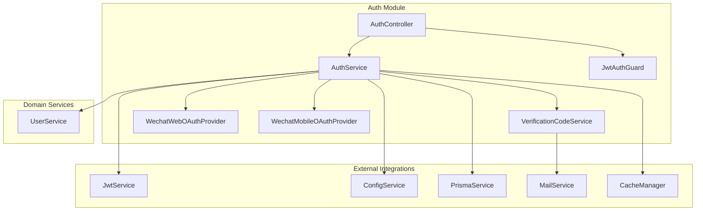
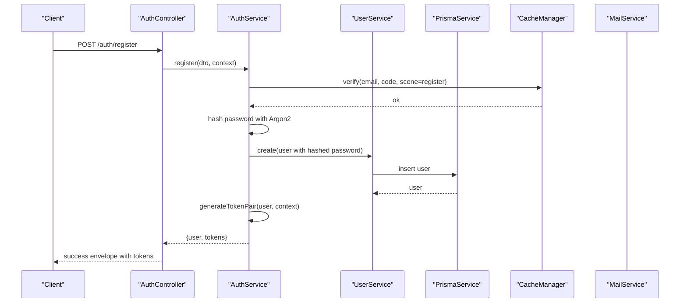
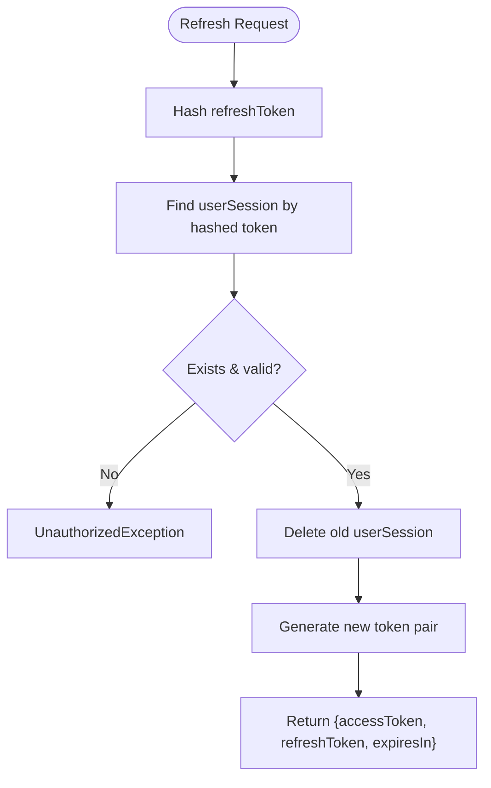
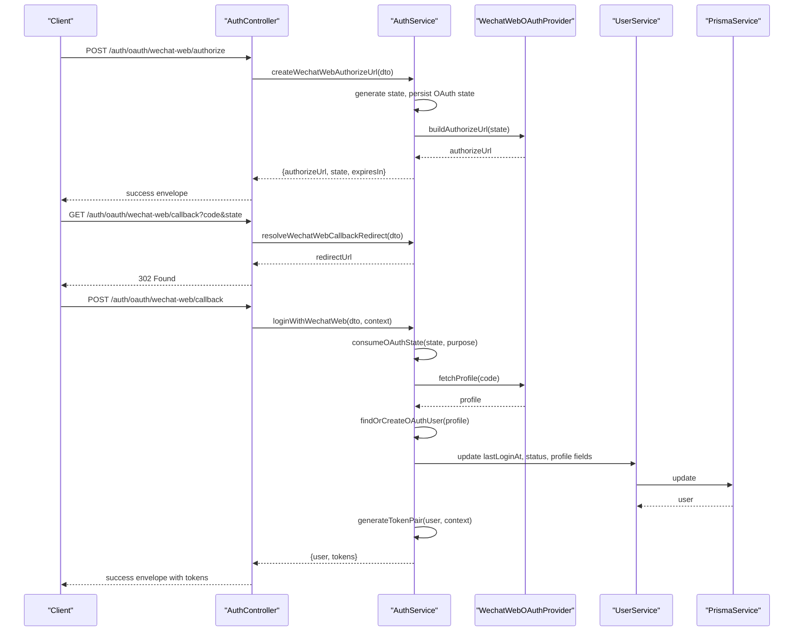
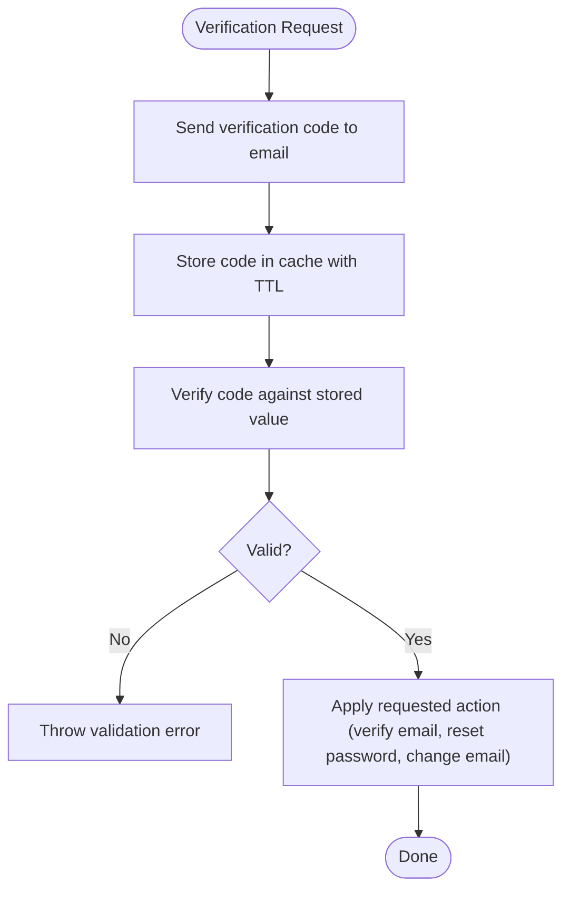
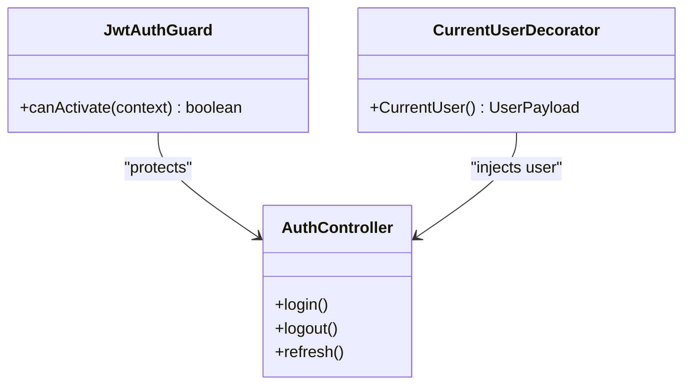
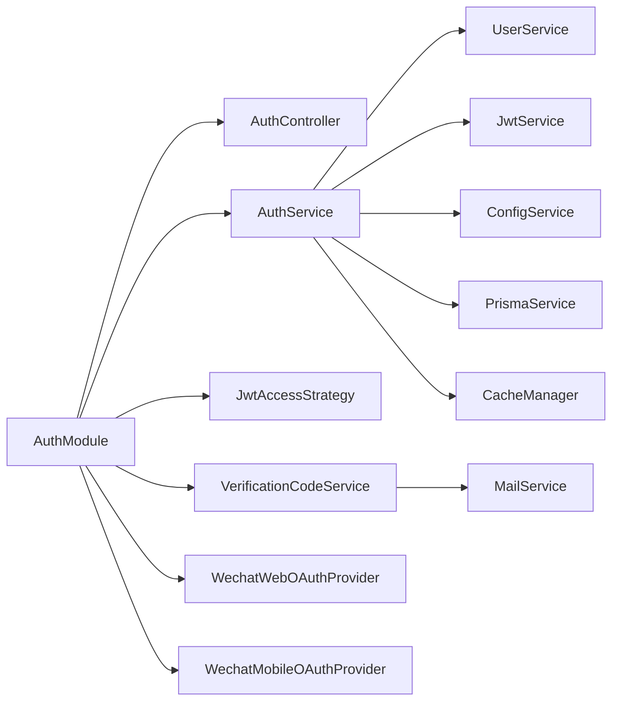

# Authentication & Authorization

<cite>
**Referenced Files in This Document**
- [auth.controller.ts](file://Lucent/src/modules/auth/auth.controller.ts)
- [auth.service.ts](file://Lucent/src/modules/auth/auth.service.ts)
- [auth.module.ts](file://Lucent/src/modules/auth/auth.module.ts)
- [jwt.config.ts](file://Lucent/src/config/jwt.config.ts)
- [oauth.config.ts](file://Lucent/src/config/oauth.config.ts)
- [verification-code.service.ts](file://Lucent/src/modules/auth/verification-code.service.ts)
- [wechat-web-oauth.provider.ts](file://Lucent/src/modules/auth/wechat-web-oauth.provider.ts)
- [wechat-mobile-oauth.provider.ts](file://Lucent/src/modules/auth/wechat-mobile-oauth.provider.ts)
- [jwt-access.guard.ts](file://Lucent/src/modules/auth/guards/jwt-auth.guard.ts)
- [login.dto.ts](file://Lucent/src/modules/auth/dto/login.dto.ts)
- [register.dto.ts](file://Lucent/src/modules/auth/dto/register.dto.ts)
- [refresh.dto.ts](file://Lucent/src/modules/auth/dto/refresh.dto.ts)
- [logout.dto.ts](file://Lucent/src/modules/auth/dto/logout.dto.ts)
- [send-verification-code.dto.ts](file://Lucent/src/modules/auth/dto/send-verification-code.dto.ts)
- [verify-email.dto.ts](file://Lucent/src/modules/auth/dto/verify-email.dto.ts)
- [forgot-password.dto.ts](file://Lucent/src/modules/auth/dto/forgot-password.dto.ts)
- [reset-password.dto.ts](file://Lucent/src/modules/auth/dto/reset-password.dto.ts)
- [oauth.dto.ts](file://Lucent/src/modules/auth/dto/oauth.dto.ts)
- [responses.ts](file://Lucent/src/modules/auth/dto/responses.ts)
- [user.service.ts](file://Lucent/src/modules/user/user.service.ts)
- [prisma.service.ts](file://Lucent/src/prisma/prisma.service.ts)
- [api-envelope.ts](file://Lucent/src/common/api-envelope.ts)
- [api-exception.filter.ts](file://Lucent/src/common/filters/api-exception.filter.ts)
- [logger.config.ts](file://Lucent/src/common/logger/logger.config.ts)
- [mail.service.ts](file://Lucent/src/mail/mail.service.ts)
- [auth.e2e-spec.ts](file://Lucent/test/auth.e2e-spec.ts)
</cite>

## Table of Contents
1. [Introduction](#introduction)
2. [Project Structure](#project-structure)
3. [Core Components](#core-components)
4. [Architecture Overview](#architecture-overview)
5. [Detailed Component Analysis](#detailed-component-analysis)
6. [Dependency Analysis](#dependency-analysis)
7. [Performance Considerations](#performance-considerations)
8. [Security Considerations](#security-considerations)
9. [Troubleshooting Guide](#troubleshooting-guide)
10. [Conclusion](#conclusion)

## Introduction
This document provides a comprehensive guide to the authentication and authorization system in the project. It covers JWT token lifecycle, OAuth integration with WeChat providers, user identity verification, password hashing with Argon2, session management, guard-based access control, role-based access control patterns, and permission checking mechanisms. It also documents the relationship between email/password authentication and OAuth providers, along with security considerations such as token expiration, refresh token rotation, and CSRF protection. Concrete examples of authentication controllers, DTO validation, and error handling are included via file references.

## Project Structure
The authentication subsystem is organized under the auth module with clear separation of concerns:
- Controllers handle HTTP endpoints and request/response envelopes
- Services encapsulate business logic for registration, login, token generation, OAuth flows, and verification code workflows
- Guards enforce access control using JWT
- Providers integrate with external OAuth services (WeChat)
- DTOs define validated request/response shapes
- Configuration files manage JWT and OAuth secrets/ttls
- Interceptors and filters standardize API responses and error handling

**Diagram sources**
- [auth.controller.ts](file://Lucent/src/modules/auth/auth.controller.ts)
- [auth.service.ts](file://Lucent/src/modules/auth/auth.service.ts)
- [auth.module.ts](file://Lucent/src/modules/auth/auth.module.ts)
- [jwt-access.guard.ts](file://Lucent/src/modules/auth/guards/jwt-auth.guard.ts)
- [verification-code.service.ts](file://Lucent/src/modules/auth/verification-code.service.ts)
- [wechat-web-oauth.provider.ts](file://Lucent/src/modules/auth/wechat-web-oauth.provider.ts)
- [wechat-mobile-oauth.provider.ts](file://Lucent/src/modules/auth/wechat-mobile-oauth.provider.ts)

**Section sources**
- [auth.controller.ts](file://Lucent/src/modules/auth/auth.controller.ts)
- [auth.service.ts](file://Lucent/src/modules/auth/auth.service.ts)
- [auth.module.ts](file://Lucent/src/modules/auth/auth.module.ts)

## Core Components
- AuthController: Exposes endpoints for registration, login, logout, token refresh, OAuth authorization and callbacks, verification code sending, email verification, password reset, and forgot-password flows. It validates DTOs, constructs success envelopes, and delegates business logic to AuthService.
- AuthService: Implements core authentication flows, JWT token pair generation, refresh token rotation, logout and logout-all, password hashing with Argon2, verification code verification, OAuth provider integration, and login rate limiting.
- JwtAuthGuard: Protects routes by verifying JWT access tokens.
- VerificationCodeService: Manages verification code generation, storage, rate limiting, and delivery via MailService.
- OAuth Providers: WeChat Web and Mobile providers encapsulate OAuth authorization URL building, state handling, and profile fetching.
- DTOs: Strongly typed request/response models for all endpoints.
- Responses: Standardized response DTOs for API envelopes.
- Configuration: JWT and OAuth configurations define secrets, TTLs, and provider settings.

**Section sources**
- [auth.controller.ts](file://Lucent/src/modules/auth/auth.controller.ts)
- [auth.service.ts](file://Lucent/src/modules/auth/auth.service.ts)
- [jwt-access.guard.ts](file://Lucent/src/modules/auth/guards/jwt-auth.guard.ts)
- [verification-code.service.ts](file://Lucent/src/modules/auth/verification-code.service.ts)
- [wechat-web-oauth.provider.ts](file://Lucent/src/modules/auth/wechat-web-oauth.provider.ts)
- [wechat-mobile-oauth.provider.ts](file://Lucent/src/modules/auth/wechat-mobile-oauth.provider.ts)
- [login.dto.ts](file://Lucent/src/modules/auth/dto/login.dto.ts)
- [register.dto.ts](file://Lucent/src/modules/auth/dto/register.dto.ts)
- [refresh.dto.ts](file://Lucent/src/modules/auth/dto/refresh.dto.ts)
- [logout.dto.ts](file://Lucent/src/modules/auth/dto/logout.dto.ts)
- [send-verification-code.dto.ts](file://Lucent/src/modules/auth/dto/send-verification-code.dto.ts)
- [verify-email.dto.ts](file://Lucent/src/modules/auth/dto/verify-email.dto.ts)
- [forgot-password.dto.ts](file://Lucent/src/modules/auth/dto/forgot-password.dto.ts)
- [reset-password.dto.ts](file://Lucent/src/modules/auth/dto/reset-password.dto.ts)
- [oauth.dto.ts](file://Lucent/src/modules/auth/dto/oauth.dto.ts)
- [responses.ts](file://Lucent/src/modules/auth/dto/responses.ts)

## Architecture Overview
The system follows a layered architecture:
- Presentation Layer: AuthController handles HTTP requests and responses
- Application Layer: AuthService orchestrates domain operations
- Domain Services: UserService manages user persistence and identity linking
- Infrastructure: PrismaService for database operations, CacheManager for rate limiting and OAuth state, MailService for verification emails, JwtService for token signing
- Security: Guards enforce JWT-based access control; OAuth providers encapsulate third-party integrations

**Diagram sources**
- [auth.controller.ts](file://Lucent/src/modules/auth/auth.controller.ts)
- [auth.service.ts](file://Lucent/src/modules/auth/auth.service.ts)
- [user.service.ts](file://Lucent/src/modules/user/user.service.ts)
- [prisma.service.ts](file://Lucent/src/prisma/prisma.service.ts)
- [verification-code.service.ts](file://Lucent/src/modules/auth/verification-code.service.ts)

## Detailed Component Analysis

### JWT Token Management
- Token Pair Generation: AuthService generates access and refresh tokens, stores only a hashed refresh token in the database, and records session metadata (IP, UA).
- Access Token Payload: Contains subject (user ID) and email; includes a unique JWT ID for auditability.
- TTL Configuration: JWT TTLs are loaded from configuration; access tokens are short-lived; refresh tokens are long-lived but rotated on use.
- Token Rotation: On refresh, the previous refresh token is invalidated and a new pair is issued.
- Logout: Supports revocation of a specific refresh token and logout from all devices.

**Diagram sources**
- [auth.service.ts](file://Lucent/src/modules/auth/auth.service.ts)

**Section sources**
- [auth.service.ts](file://Lucent/src/modules/auth/auth.service.ts)
- [jwt.config.ts](file://Lucent/src/config/jwt.config.ts)

### OAuth Integration with WeChat Providers
- WeChat Web OAuth:
  - Authorization URL creation with state and optional callback URI normalization
  - Browser redirect handling to pass code/state to native/desktop callback
  - Profile fetching and user linking or creation
- WeChat Mobile OAuth:
  - Direct code exchange for profile and token issuance
- Identity Linking:
  - Supports linking OAuth identities to existing users with conflict checks
  - Union ID and email-based deduplication strategies

**Diagram sources**
- [auth.controller.ts](file://Lucent/src/modules/auth/auth.controller.ts)
- [auth.service.ts](file://Lucent/src/modules/auth/auth.service.ts)
- [wechat-web-oauth.provider.ts](file://Lucent/src/modules/auth/wechat-web-oauth.provider.ts)

**Section sources**
- [auth.controller.ts](file://Lucent/src/modules/auth/auth.controller.ts)
- [auth.service.ts](file://Lucent/src/modules/auth/auth.service.ts)
- [wechat-web-oauth.provider.ts](file://Lucent/src/modules/auth/wechat-web-oauth.provider.ts)
- [wechat-mobile-oauth.provider.ts](file://Lucent/src/modules/auth/wechat-mobile-oauth.provider.ts)

### User Identity Verification Processes
- Email Confirmation: Sends verification code and verifies it before marking email as verified.
- Password Reset: Sends verification code and resets password after verification; invalidates all sessions afterward.
- Change Email: Verifies new email ownership via code before updating user record.
- Forgot Password: Sends reset code regardless of whether the email exists (defensive timing).

**Diagram sources**
- [verification-code.service.ts](file://Lucent/src/modules/auth/verification-code.service.ts)
- [auth.service.ts](file://Lucent/src/modules/auth/auth.service.ts)

**Section sources**
- [auth.service.ts](file://Lucent/src/modules/auth/auth.service.ts)
- [verification-code.service.ts](file://Lucent/src/modules/auth/verification-code.service.ts)
- [send-verification-code.dto.ts](file://Lucent/src/modules/auth/dto/send-verification-code.dto.ts)
- [verify-email.dto.ts](file://Lucent/src/modules/auth/dto/verify-email.dto.ts)
- [forgot-password.dto.ts](file://Lucent/src/modules/auth/dto/forgot-password.dto.ts)
- [reset-password.dto.ts](file://Lucent/src/modules/auth/dto/reset-password.dto.ts)

### Guard System and Access Control
- JwtAuthGuard: Enforces JWT-based authentication for protected routes by extracting and validating the access token.
- Decorators: CurrentUser decorator provides the authenticated user payload to controllers.
- RBAC Pattern: While role-based access control is not explicitly implemented in the referenced files, the JWT payload carries user identity (subject) and email, enabling downstream services to enforce permissions based on roles/claims.

**Diagram sources**
- [jwt-access.guard.ts](file://Lucent/src/modules/auth/guards/jwt-auth.guard.ts)
- [auth.controller.ts](file://Lucent/src/modules/auth/auth.controller.ts)

**Section sources**
- [jwt-access.guard.ts](file://Lucent/src/modules/auth/guards/jwt-auth.guard.ts)
- [auth.controller.ts](file://Lucent/src/modules/auth/auth.controller.ts)

### Password Hashing with Argon2
- Argon2id Options: Memory cost, time cost, and parallelism are configured according to recommended practices.
- Registration/Login: Passwords are hashed during registration and verified during login.
- Change/Delete Account: Password verification is required before allowing sensitive operations.

**Section sources**
- [auth.service.ts](file://Lucent/src/modules/auth/auth.service.ts)

### Session Management
- Refresh Token Storage: Only hashed refresh tokens are persisted; plaintext tokens are returned once.
- Session Metadata: IP address and user agent are recorded per session for auditability.
- Logout and LogoutAll: Support revocation of specific or all sessions.

**Section sources**
- [auth.service.ts](file://Lucent/src/modules/auth/auth.service.ts)
- [prisma.service.ts](file://Lucent/src/prisma/prisma.service.ts)

### DTO Validation and Error Handling
- DTOs: Strongly typed request models for all endpoints (login, register, refresh, logout, verification, OAuth).
- Responses: Standardized success envelope and error responses.
- Exception Filters: Centralized exception handling with localized messages.

**Section sources**
- [login.dto.ts](file://Lucent/src/modules/auth/dto/login.dto.ts)
- [register.dto.ts](file://Lucent/src/modules/auth/dto/register.dto.ts)
- [refresh.dto.ts](file://Lucent/src/modules/auth/dto/refresh.dto.ts)
- [logout.dto.ts](file://Lucent/src/modules/auth/dto/logout.dto.ts)
- [send-verification-code.dto.ts](file://Lucent/src/modules/auth/dto/send-verification-code.dto.ts)
- [verify-email.dto.ts](file://Lucent/src/modules/auth/dto/verify-email.dto.ts)
- [forgot-password.dto.ts](file://Lucent/src/modules/auth/dto/forgot-password.dto.ts)
- [reset-password.dto.ts](file://Lucent/src/modules/auth/dto/reset-password.dto.ts)
- [oauth.dto.ts](file://Lucent/src/modules/auth/dto/oauth.dto.ts)
- [responses.ts](file://Lucent/src/modules/auth/dto/responses.ts)
- [api-envelope.ts](file://Lucent/src/common/api-envelope.ts)
- [api-exception.filter.ts](file://Lucent/src/common/filters/api-exception.filter.ts)

## Dependency Analysis
The AuthModule aggregates all authentication-related providers and exposes AuthService. It imports PassportModule with JWT as the default strategy and JwtModule for token signing. External dependencies include PrismaService for persistence, CacheManager for rate limiting and OAuth state, MailService for verification emails, and ConfigService for JWT/OAuth configuration.

**Diagram sources**
- [auth.module.ts](file://Lucent/src/modules/auth/auth.module.ts)
- [auth.service.ts](file://Lucent/src/modules/auth/auth.service.ts)

**Section sources**
- [auth.module.ts](file://Lucent/src/modules/auth/auth.module.ts)
- [auth.service.ts](file://Lucent/src/modules/auth/auth.service.ts)

## Performance Considerations
- Argon2 Configuration: Balanced memory/time costs optimize security without excessive CPU overhead.
- Cache Usage: OAuth state and login failure buckets are cached to reduce database load.
- Token Rotation: Efficient refresh flow minimizes database writes by rotating tokens on use.
- Rate Limiting: Login attempts are rate-limited per email to prevent brute force attacks.

[No sources needed since this section provides general guidance]

## Security Considerations
- Token Expiration: Access tokens are short-lived; refresh tokens are long-lived but rotated on use.
- Refresh Token Rotation: Old refresh tokens are invalidated upon successful refresh.
- CSRF Protection: Not explicitly implemented in the referenced files; consider adding CSRF tokens or SameSite cookies for browser clients.
- OAuth Callback URI Validation: Strict validation ensures only trusted origins and loopback URIs are accepted for desktop/native flows.
- Login Rate Limiting: Prevents brute force attacks by temporarily locking out repeated failures.
- Verification Codes: Rate limits and TTLs protect against abuse; defensive timing hides whether an email exists during forgot-password.
- Password Handling: Argon2id with tuned parameters; passwords are never stored in plaintext.

**Section sources**
- [auth.service.ts](file://Lucent/src/modules/auth/auth.service.ts)
- [verification-code.service.ts](file://Lucent/src/modules/auth/verification-code.service.ts)

## Troubleshooting Guide
Common issues and resolutions:
- Unauthorized Access: Ensure the Authorization header contains a valid access token; verify JwtAuthGuard is applied to protected routes.
- Invalid Refresh Token: Confirm the refresh token is valid, unexpired, and not revoked; trigger token rotation again.
- OAuth State Mismatch: Verify state parameter matches cached state and purpose; ensure callback URI normalization is correct.
- Verification Code Errors: Check rate limit violations and TTL; confirm email delivery and code correctness.
- Login Failures: Review login rate limiting lockout; clear cached failure buckets if needed.

**Section sources**
- [auth.service.ts](file://Lucent/src/modules/auth/auth.service.ts)
- [api-exception.filter.ts](file://Lucent/src/common/filters/api-exception.filter.ts)
- [logger.config.ts](file://Lucent/src/common/logger/logger.config.ts)

## Conclusion
The authentication and authorization system integrates robust JWT token management, secure OAuth flows with WeChat providers, comprehensive user identity verification, and strong password handling with Argon2. The modular design, DTO validation, standardized responses, and centralized error handling provide a solid foundation for secure and maintainable authentication. Additional enhancements such as CSRF protection and explicit RBAC enforcement would further strengthen the system.