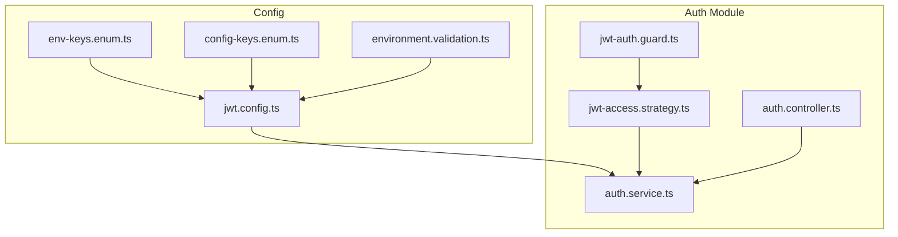
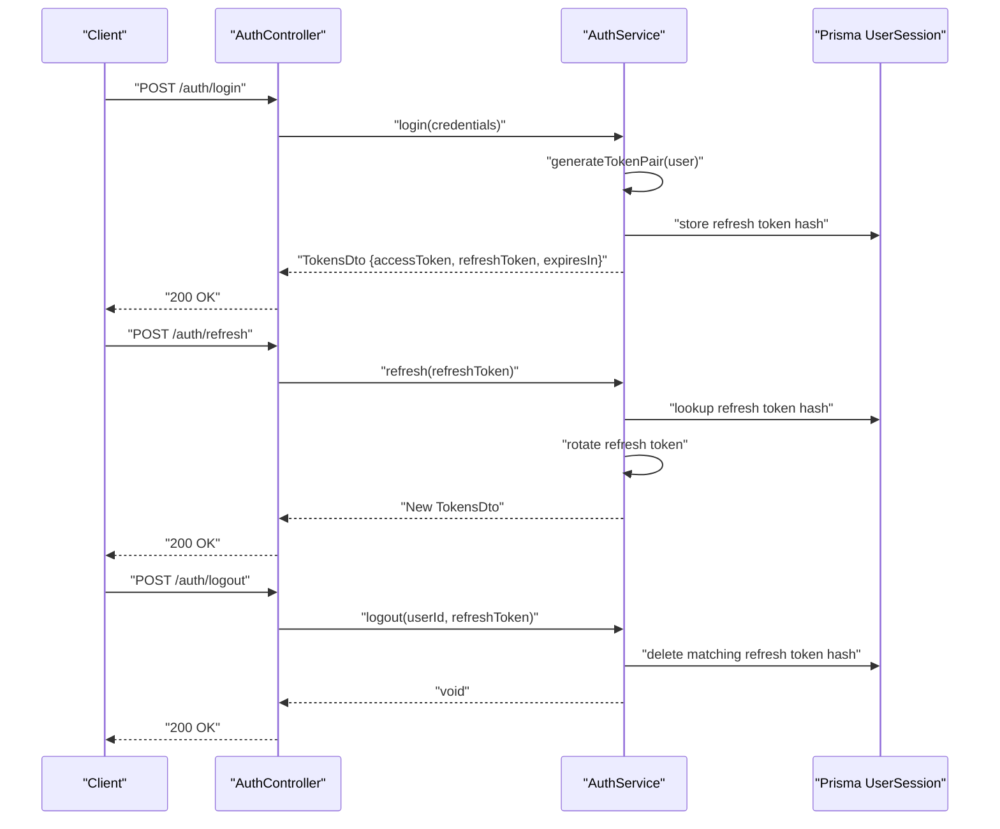
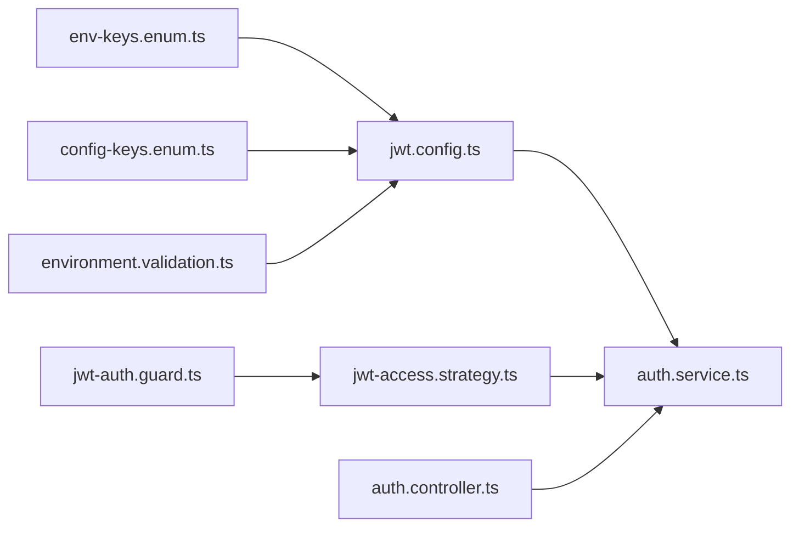

# JWT Token Management

<cite>
**Referenced Files in This Document**
- [jwt.config.ts](file://Lucent/src/config/jwt.config.ts)
- [env-keys.enum.ts](file://Lucent/src/config/env-keys.enum.ts)
- [config-keys.enum.ts](file://Lucent/src/config/config-keys.enum.ts)
- [environment.validation.ts](file://Lucent/src/config/environment.validation.ts)
- [jwt-access.strategy.ts](file://Lucent/src/modules/auth/strategies/jwt-access.strategy.ts)
- [jwt-auth.guard.ts](file://Lucent/src/modules/auth/guards/jwt-auth.guard.ts)
- [auth.service.ts](file://Lucent/src/modules/auth/auth.service.ts)
- [auth.controller.ts](file://Lucent/src/modules/auth/auth.controller.ts)
- [auth.e2e-spec.ts](file://Lucent/test/auth.e2e-spec.ts)
- [user-health-context.e2e-spec.ts](file://Lucent/test/user-health-context.e2e-spec.ts)
</cite>

## Table of Contents
1. [Introduction](#introduction)
2. [Project Structure](#project-structure)
3. [Core Components](#core-components)
4. [Architecture Overview](#architecture-overview)
5. [Detailed Component Analysis](#detailed-component-analysis)
6. [Dependency Analysis](#dependency-analysis)
7. [Performance Considerations](#performance-considerations)
8. [Troubleshooting Guide](#troubleshooting-guide)
9. [Conclusion](#conclusion)

## Introduction
This document explains the JWT token management system in the backend service. It covers configuration, token generation and validation, access/refresh token handling, guard implementation, and security practices. It also documents the relationship between access and refresh tokens, signing algorithms, and header configuration, with practical examples drawn from the controller and service layers.

## Project Structure
The JWT subsystem is organized around configuration, strategies, guards, and the authentication service. Controllers issue tokens; guards enforce protected routes; strategies extract and verify tokens; the service generates pairs and manages refresh rotations and logout.

**Diagram sources**
- [jwt.config.ts:1-40](file://Lucent/src/config/jwt.config.ts#L1-L40)
- [env-keys.enum.ts:7-10](file://Lucent/src/config/env-keys.enum.ts#L7-L10)
- [config-keys.enum.ts:9-10](file://Lucent/src/config/config-keys.enum.ts#L9-L10)
- [environment.validation.ts:16-80](file://Lucent/src/config/environment.validation.ts#L16-L80)
- [jwt-auth.guard.ts](file://Lucent/src/modules/auth/guards/jwt-auth.guard.ts)
- [jwt-access.strategy.ts](file://Lucent/src/modules/auth/strategies/jwt-access.strategy.ts)
- [auth.service.ts](file://Lucent/src/modules/auth/auth.service.ts)
- [auth.controller.ts](file://Lucent/src/modules/auth/auth.controller.ts)

**Section sources**
- [jwt.config.ts:1-40](file://Lucent/src/config/jwt.config.ts#L1-L40)
- [env-keys.enum.ts:7-10](file://Lucent/src/config/env-keys.enum.ts#L7-L10)
- [config-keys.enum.ts:9-10](file://Lucent/src/config/config-keys.enum.ts#L9-L10)
- [environment.validation.ts:16-80](file://Lucent/src/config/environment.validation.ts#L16-L80)
- [jwt-auth.guard.ts](file://Lucent/src/modules/auth/guards/jwt-auth.guard.ts)
- [jwt-access.strategy.ts](file://Lucent/src/modules/auth/strategies/jwt-access.strategy.ts)
- [auth.service.ts](file://Lucent/src/modules/auth/auth.service.ts)
- [auth.controller.ts](file://Lucent/src/modules/auth/auth.controller.ts)

## Core Components
- JWT configuration: secrets and TTLs are loaded from environment variables and normalized into seconds.
- Access strategy: extracts and verifies access tokens from incoming requests.
- Authentication guard: integrates the access strategy to protect routes.
- Authentication service: generates access/refresh token pairs, rotates refresh tokens, and handles logout.
- Controllers: expose endpoints for login, refresh, and logout, returning token pairs.

Key responsibilities:
- Configuration parsing supports human-friendly TTL strings and defaults.
- Access tokens are signed with a dedicated secret and algorithm.
- Refresh tokens are hashed and stored, enabling rotation and selective logout.

**Section sources**
- [jwt.config.ts:1-40](file://Lucent/src/config/jwt.config.ts#L1-L40)
- [jwt-access.strategy.ts](file://Lucent/src/modules/auth/strategies/jwt-access.strategy.ts)
- [jwt-auth.guard.ts](file://Lucent/src/modules/auth/guards/jwt-auth.guard.ts)
- [auth.service.ts](file://Lucent/src/modules/auth/auth.service.ts)
- [auth.controller.ts](file://Lucent/src/modules/auth/auth.controller.ts)

## Architecture Overview
The system uses bearer tokens with separate access and refresh lifecycles. Access tokens are short-lived and validated per-request via a guard and strategy. Refresh tokens are long-lived, hashed, and rotated upon successful refresh to mitigate replay risk.

**Diagram sources**
- [auth.controller.ts](file://Lucent/src/modules/auth/auth.controller.ts)
- [auth.service.ts](file://Lucent/src/modules/auth/auth.service.ts)
- [auth.e2e-spec.ts:451-485](file://Lucent/test/auth.e2e-spec.ts#L451-L485)

## Detailed Component Analysis

### JWT Configuration
- Secrets: Separate access and refresh secrets are loaded from environment variables with safe defaults.
- TTL parsing: Human-friendly durations (e.g., "15m", "2h", "14d") are parsed into seconds; numeric fallback supported.
- Defaults: Access token TTL defaults to 2 hours; refresh token TTL defaults to 30 days.

Operational notes:
- Environment keys are validated to ensure optional presence of secrets and TTLs.
- The configuration is registered under a dedicated key for DI injection.

**Section sources**
- [jwt.config.ts:1-40](file://Lucent/src/config/jwt.config.ts#L1-L40)
- [env-keys.enum.ts:7-10](file://Lucent/src/config/env-keys.enum.ts#L7-L10)
- [config-keys.enum.ts:9-10](file://Lucent/src/config/config-keys.enum.ts#L9-L10)
- [environment.validation.ts:16-80](file://Lucent/src/config/environment.validation.ts#L16-L80)

### Access Strategy Implementation
- Extracts Authorization header and validates scheme.
- Uses the configured access secret and algorithm to verify the access token signature.
- Returns decoded payload for downstream guards and controllers.

Security considerations:
- Rejects malformed or unsupported schemes.
- Relies on the configured access secret and algorithm for verification.

**Section sources**
- [jwt-access.strategy.ts](file://Lucent/src/modules/auth/strategies/jwt-access.strategy.ts)

### Authentication Guard
- Integrates the access strategy to protect routes.
- On successful verification, attaches the user identity from the token payload to the request context.

Usage pattern:
- Decorate route handlers with the guard to enforce authentication.

**Section sources**
- [jwt-auth.guard.ts](file://Lucent/src/modules/auth/guards/jwt-auth.guard.ts)

### Token Generation and Validation
- Access tokens are signed with a dedicated algorithm and secret, with a short TTL.
- Payload verification ensures integrity and freshness.

Evidence from tests:
- Access tokens are signed with a specific algorithm and TTL during generation.

**Section sources**
- [user-health-context.e2e-spec.ts:129-141](file://Lucent/test/user-health-context.e2e-spec.ts#L129-L141)

### Access/Refresh Token Pair Handling
- Login returns both access and refresh tokens with an expiration duration.
- Refresh endpoint accepts a refresh token, validates it, rotates it (deletes old, issues new), and returns a new pair.
- Logout invalidates a specific refresh token by hash.

Behavioral guarantees:
- Old refresh tokens become invalid after rotation.
- Rotating one session does not affect others.

**Section sources**
- [auth.controller.ts](file://Lucent/src/modules/auth/auth.controller.ts)
- [auth.service.ts](file://Lucent/src/modules/auth/auth.service.ts)
- [auth.e2e-spec.ts:451-485](file://Lucent/test/auth.e2e-spec.ts#L451-L485)

### Token Expiration Handling
- Access tokens expire after their configured TTL.
- Refresh tokens expire after their configured TTL but are not revoked by TTL alone; they require explicit logout or rotation.

**Section sources**
- [jwt.config.ts:38-39](file://Lucent/src/config/jwt.config.ts#L38-L39)

### Refresh Token Rotation
- On successful refresh, the old refresh token is deleted (hashed lookup), preventing reuse.
- A new refresh token is issued and stored.

**Section sources**
- [auth.service.ts:231-243](file://Lucent/src/modules/auth/auth.service.ts#L231-L243)

### Logout and Session Termination
- Single-session logout deletes the hashed refresh token for the given user session.
- Logout-all deletes all refresh tokens for the user.

**Section sources**
- [auth.service.ts:247-261](file://Lucent/src/modules/auth/auth.service.ts#L247-L261)

### Header Configuration and Extraction
- Access tokens are expected in the Authorization header with the bearer scheme.
- The strategy validates the header format and extracts the token.

**Section sources**
- [jwt-access.strategy.ts](file://Lucent/src/modules/auth/strategies/jwt-access.strategy.ts)

### Security Considerations
- Separate secrets for access and refresh tokens reduce blast radius.
- Refresh tokens are stored as hashes to prevent plaintext reuse.
- Rotation invalidates previous refresh tokens.
- Prefer HTTPS to protect tokens in transit.
- Keep secrets secret and rotate them periodically.
- Use short access token TTLs and long refresh token TTLs with rotation.

[No sources needed since this section provides general guidance]

## Dependency Analysis
The JWT subsystem depends on configuration for secrets and TTLs, and on the authentication service for token lifecycle operations. Guards and strategies depend on the access strategy for verification.

**Diagram sources**
- [jwt.config.ts:1-40](file://Lucent/src/config/jwt.config.ts#L1-L40)
- [env-keys.enum.ts:7-10](file://Lucent/src/config/env-keys.enum.ts#L7-L10)
- [config-keys.enum.ts:9-10](file://Lucent/src/config/config-keys.enum.ts#L9-L10)
- [environment.validation.ts:16-80](file://Lucent/src/config/environment.validation.ts#L16-L80)
- [jwt-auth.guard.ts](file://Lucent/src/modules/auth/guards/jwt-auth.guard.ts)
- [jwt-access.strategy.ts](file://Lucent/src/modules/auth/strategies/jwt-access.strategy.ts)
- [auth.service.ts](file://Lucent/src/modules/auth/auth.service.ts)
- [auth.controller.ts](file://Lucent/src/modules/auth/auth.controller.ts)

**Section sources**
- [jwt.config.ts:1-40](file://Lucent/src/config/jwt.config.ts#L1-L40)
- [jwt-auth.guard.ts](file://Lucent/src/modules/auth/guards/jwt-auth.guard.ts)
- [jwt-access.strategy.ts](file://Lucent/src/modules/auth/strategies/jwt-access.strategy.ts)
- [auth.service.ts](file://Lucent/src/modules/auth/auth.service.ts)
- [auth.controller.ts](file://Lucent/src/modules/auth/auth.controller.ts)

## Performance Considerations
- Short access token TTL reduces exposure window; rely on refresh rotation for seamless UX.
- Hashed refresh tokens enable efficient deletion and lookup.
- Avoid excessive logging of token payloads; log only identifiers where necessary.

[No sources needed since this section provides general guidance]

## Troubleshooting Guide
Common issues and resolutions:
- Invalid refresh token: Returned when the hashed refresh token is not found or expired; triggers unauthorized response.
  - Evidence: Unauthorized exception thrown and tests assert invalid refresh token handling.
- Rotated refresh token invalidation: After rotation, the old refresh token becomes invalid immediately.
  - Evidence: Tests verify that the old refresh token yields an unauthorized response after rotation.
- Partial session termination: Rotating one refresh token does not affect other sessions for the same user.
  - Evidence: Tests demonstrate that rotating one session does not impact another concurrent session.

**Section sources**
- [auth.service.ts:231-235](file://Lucent/src/modules/auth/auth.service.ts#L231-L235)
- [auth.e2e-spec.ts:451-485](file://Lucent/test/auth.e2e-spec.ts#L451-L485)

## Conclusion
The JWT subsystem provides a secure, configurable foundation for authentication. Access tokens protect endpoints with short TTLs, while refresh tokens enable seamless renewal with rotation and selective logout. Configuration supports flexible TTLs and environment-driven secrets, and guards integrate cleanly with route handlers. Adhering to the outlined security practices and leveraging the provided service and guard abstractions ensures robust token lifecycle management.