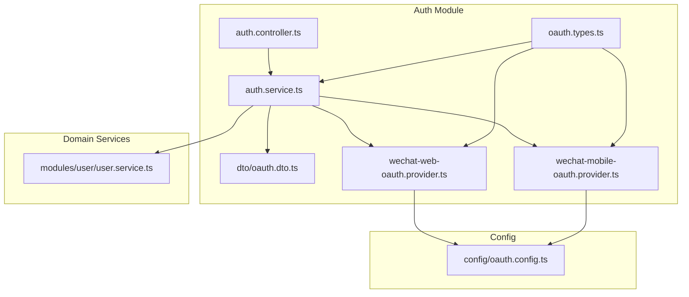
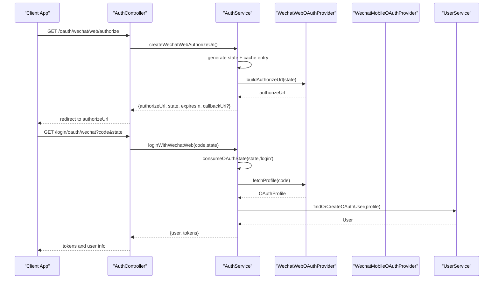
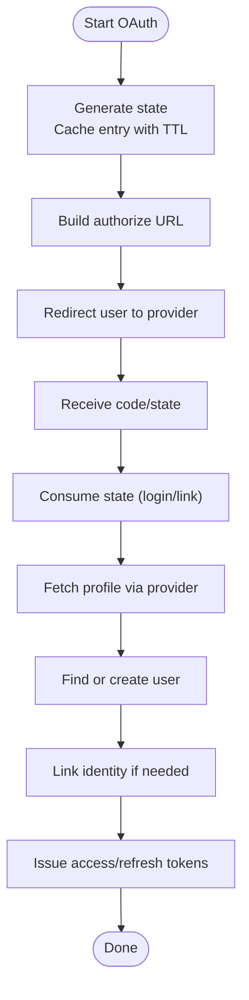
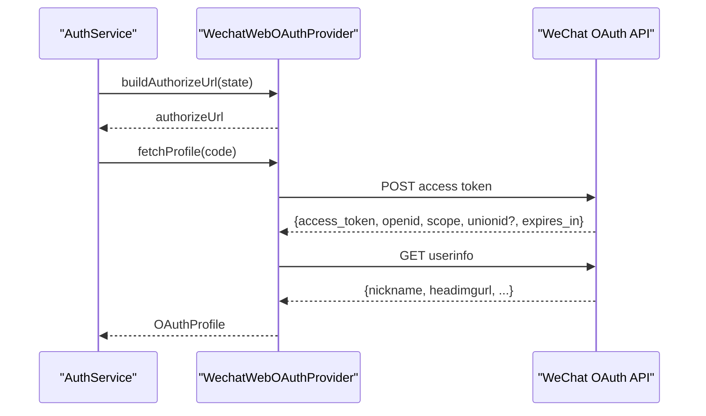
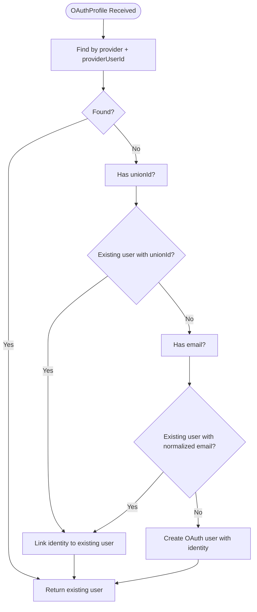
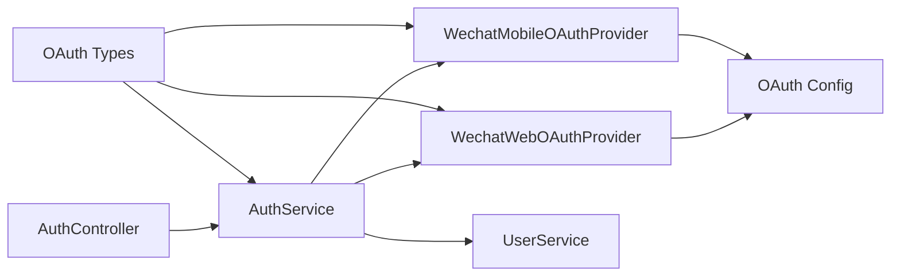

# OAuth Providers

<cite>
**Referenced Files in This Document**
- [oauth.types.ts](file://Lucent/src/modules/auth/oauth.types.ts)
- [auth.service.ts](file://Lucent/src/modules/auth/auth.service.ts)
- [wechat-web-oauth.provider.ts](file://Lucent/src/modules/auth/wechat-web-oauth.provider.ts)
- [wechat-mobile-oauth.provider.ts](file://Lucent/src/modules/auth/wechat-mobile-oauth.provider.ts)
- [auth.controller.ts](file://Lucent/src/modules/auth/auth.controller.ts)
- [oauth.dto.ts](file://Lucent/src/modules/auth/dto/oauth.dto.ts)
- [oauth.config.ts](file://Lucent/src/config/oauth.config.ts)
- [user.service.ts](file://Lucent/src/modules/user/user.service.ts)
</cite>

## Table of Contents
1. [Introduction](#introduction)
2. [Project Structure](#project-structure)
3. [Core Components](#core-components)
4. [Architecture Overview](#architecture-overview)
5. [Detailed Component Analysis](#detailed-component-analysis)
6. [Dependency Analysis](#dependency-analysis)
7. [Performance Considerations](#performance-considerations)
8. [Security Considerations](#security-considerations)
9. [Troubleshooting Guide](#troubleshooting-guide)
10. [Conclusion](#conclusion)

## Introduction
This document explains the OAuth provider integration with a focus on WeChat OAuth across mobile and web platforms. It covers the authorization code flow, token exchange, user profile retrieval, provider configuration, authentication state management, and unified user identity mapping. It also documents the OAuth types and interfaces, controller endpoints, provider service implementations, error handling strategies, and security considerations such as state verification, PKCE readiness, and redirect URI validation.

## Project Structure
The OAuth implementation resides in the backend NestJS module under Lucent/src/modules/auth. Key files include:
- Types and interfaces for OAuth providers and profiles
- Authentication service orchestrating OAuth flows
- Provider-specific services for WeChat web and mobile
- DTOs for OAuth requests and callbacks
- Configuration for OAuth providers
- User service supporting identity linking and creation



**Diagram sources**
- [oauth.types.ts](file://Lucent/src/modules/auth/oauth.types.ts)
- [auth.service.ts](file://Lucent/src/modules/auth/auth.service.ts)
- [auth.controller.ts](file://Lucent/src/modules/auth/auth.controller.ts)
- [oauth.dto.ts](file://Lucent/src/modules/auth/dto/oauth.dto.ts)
- [wechat-web-oauth.provider.ts](file://Lucent/src/modules/auth/wechat-web-oauth.provider.ts)
- [wechat-mobile-oauth.provider.ts](file://Lucent/src/modules/auth/wechat-mobile-oauth.provider.ts)
- [oauth.config.ts](file://Lucent/src/config/oauth.config.ts)
- [user.service.ts](file://Lucent/src/modules/user/user.service.ts)

**Section sources**
- [oauth.types.ts](file://Lucent/src/modules/auth/oauth.types.ts)
- [auth.service.ts](file://Lucent/src/modules/auth/auth.service.ts)
- [auth.controller.ts](file://Lucent/src/modules/auth/auth.controller.ts)
- [oauth.dto.ts](file://Lucent/src/modules/auth/dto/oauth.dto.ts)
- [wechat-web-oauth.provider.ts](file://Lucent/src/modules/auth/wechat-web-oauth.provider.ts)
- [wechat-mobile-oauth.provider.ts](file://Lucent/src/modules/auth/wechat-mobile-oauth.provider.ts)
- [oauth.config.ts](file://Lucent/src/config/oauth.config.ts)
- [user.service.ts](file://Lucent/src/modules/user/user.service.ts)

## Core Components
- OAuth types and interfaces define provider identifiers, authorization result shape, and profile structure.
- Authentication service manages OAuth state, builds authorize URLs, validates callbacks, exchanges codes for tokens, retrieves profiles, and links identities.
- Provider services encapsulate WeChat-specific flows for web and mobile.
- DTOs describe request/response shapes for OAuth endpoints.
- Configuration supplies provider credentials.
- User service supports identity linking and creation of OAuth users.

**Section sources**
- [oauth.types.ts](file://Lucent/src/modules/auth/oauth.types.ts)
- [auth.service.ts](file://Lucent/src/modules/auth/auth.service.ts)
- [wechat-web-oauth.provider.ts](file://Lucent/src/modules/auth/wechat-web-oauth.provider.ts)
- [wechat-mobile-oauth.provider.ts](file://Lucent/src/modules/auth/wechat-mobile-oauth.provider.ts)
- [oauth.dto.ts](file://Lucent/src/modules/auth/dto/oauth.dto.ts)
- [oauth.config.ts](file://Lucent/src/config/oauth.config.ts)
- [user.service.ts](file://Lucent/src/modules/user/user.service.ts)

## Architecture Overview
The OAuth flow integrates the following layers:
- Controller exposes endpoints for initiating OAuth and receiving callbacks.
- Service orchestrates state management, provider selection, and identity mapping.
- Provider services handle HTTP calls to WeChat endpoints and parse responses.
- User service persists identities and updates user attributes.



**Diagram sources**
- [auth.controller.ts](file://Lucent/src/modules/auth/auth.controller.ts)
- [auth.service.ts](file://Lucent/src/modules/auth/auth.service.ts)
- [wechat-web-oauth.provider.ts](file://Lucent/src/modules/auth/wechat-web-oauth.provider.ts)
- [user.service.ts](file://Lucent/src/modules/user/user.service.ts)

## Detailed Component Analysis

### OAuth Types and Interfaces
Defines provider constants, OAuthAuthorizeResult, and OAuthProfile shapes used across the system.

```mermaid
classDiagram
class OAuthAuthorizeResult {
+string authorizeUrl
+string state
+number expiresIn
+string callbackUri?
}
class OAuthProfile {
+OAuthProvider provider
+string providerUserId
+string unionId?
+string email?
+Date emailVerifiedAt?
+string nickname?
+string avatar?
+InputJsonValue rawProfile?
}
class OAuthProvider {
<<enumeration>>
"wechat_web"
"wechat_mobile"
}
OAuthProfile --> OAuthProvider : "uses"
```

**Diagram sources**
- [oauth.types.ts](file://Lucent/src/modules/auth/oauth.types.ts)

**Section sources**
- [oauth.types.ts](file://Lucent/src/modules/auth/oauth.types.ts)

### Authentication Service
Responsibilities:
- Build authorize URLs and manage OAuth state with TTL and hashed keys.
- Validate and consume state entries for login/link purposes.
- Normalize and validate callback URIs for web OAuth.
- Exchange authorization codes for user profiles via provider services.
- Link OAuth identities to existing users or create new OAuth users.
- Issue JWT tokens upon successful authentication.

Key flows:
- Web authorize URL generation and state caching
- Web callback resolution and state consumption
- Mobile code-based login
- Identity linking and user creation



**Diagram sources**
- [auth.service.ts](file://Lucent/src/modules/auth/auth.service.ts)
- [wechat-web-oauth.provider.ts](file://Lucent/src/modules/auth/wechat-web-oauth.provider.ts)
- [wechat-mobile-oauth.provider.ts](file://Lucent/src/modules/auth/wechat-mobile-oauth.provider.ts)
- [user.service.ts](file://Lucent/src/modules/user/user.service.ts)

**Section sources**
- [auth.service.ts](file://Lucent/src/modules/auth/auth.service.ts)

### WeChat Web OAuth Provider
Responsibilities:
- Construct authorize URL with state.
- Exchange authorization code for access token and user info.
- Validate provider responses and surface errors.
- Return normalized OAuthProfile including unionId when available.

Implementation highlights:
- Uses provider configuration to construct URLs and parameters.
- Performs fetch calls and checks for WeChat error responses.
- Builds rawProfile with token and userInfo payloads.



**Diagram sources**
- [wechat-web-oauth.provider.ts](file://Lucent/src/modules/auth/wechat-web-oauth.provider.ts)

**Section sources**
- [wechat-web-oauth.provider.ts](file://Lucent/src/modules/auth/wechat-web-oauth.provider.ts)

### WeChat Mobile OAuth Provider
Responsibilities:
- Exchange authorization code for access token and user info.
- Return normalized OAuthProfile suitable for mobile flows.

Implementation highlights:
- Similar token and userinfo exchange as web provider.
- Does not rely on state caching for login; state is managed by the service for web flows.

**Section sources**
- [wechat-mobile-oauth.provider.ts](file://Lucent/src/modules/auth/wechat-mobile-oauth.provider.ts)

### OAuth DTOs
Defines request/response structures for OAuth authorize and callback operations.

- OAuthAuthorizeDto: optional callbackUri for web OAuth
- OAuthCallbackDto: received code and state on web callback
- OAuthCodeCallbackDto: received code on mobile callback

These DTOs are consumed by controller endpoints and passed to the authentication service.

**Section sources**
- [oauth.dto.ts](file://Lucent/src/modules/auth/dto/oauth.dto.ts)

### Controller Endpoints
Typical endpoints exposed by the AuthController for OAuth:
- GET /oauth/wechat/web/authorize: initiate WeChat web OAuth
- GET /login/oauth/wechat: receive WeChat web callback
- POST /oauth/wechat/mobile/login: exchange mobile authorization code for tokens
- POST /account/oauth/wechat/link: link WeChat identity to an existing user

Notes:
- Web authorize endpoint caches state and returns authorizeUrl, state, and optional callbackUri.
- Web callback endpoint resolves the redirect URL for native apps or validates and consumes state for browser flows.
- Mobile endpoints bypass state caching and directly fetch profiles.

**Section sources**
- [auth.controller.ts](file://Lucent/src/modules/auth/auth.controller.ts)
- [auth.service.ts](file://Lucent/src/modules/auth/auth.service.ts)

### Provider Configuration
OAuth provider configuration is centralized and includes WeChat credentials for web/desktop flows. The provider services read configuration to build authorize URLs and exchange tokens.

- Configuration keys include appId and appSecret for WeChat web.
- Missing credentials trigger warnings or service unavailability exceptions during provider initialization.

**Section sources**
- [oauth.config.ts](file://Lucent/src/config/oauth.config.ts)
- [wechat-web-oauth.provider.ts](file://Lucent/src/modules/auth/wechat-web-oauth.provider.ts)

### Unified User Identity Management
The authentication service coordinates identity mapping:
- Attempt to find an existing user by providerUserId.
- If unionId is present, attempt to link to an existing user with the same unionId.
- If email is present, attempt to link to an existing user with the same normalized email.
- Otherwise, create a new OAuth user with identity attached.
- Link identity to an existing user when requested (account linking).



**Diagram sources**
- [auth.service.ts](file://Lucent/src/modules/auth/auth.service.ts)
- [user.service.ts](file://Lucent/src/modules/user/user.service.ts)

**Section sources**
- [auth.service.ts](file://Lucent/src/modules/auth/auth.service.ts)
- [user.service.ts](file://Lucent/src/modules/user/user.service.ts)

## Dependency Analysis
- AuthController depends on AuthService for OAuth orchestration.
- AuthService depends on provider services for WeChat web and mobile.
- Provider services depend on configuration and external HTTP calls to WeChat APIs.
- AuthService depends on UserService for identity lookup and creation.
- OAuth types are shared across services and providers.



**Diagram sources**
- [auth.controller.ts](file://Lucent/src/modules/auth/auth.controller.ts)
- [auth.service.ts](file://Lucent/src/modules/auth/auth.service.ts)
- [wechat-web-oauth.provider.ts](file://Lucent/src/modules/auth/wechat-web-oauth.provider.ts)
- [wechat-mobile-oauth.provider.ts](file://Lucent/src/modules/auth/wechat-mobile-oauth.provider.ts)
- [oauth.types.ts](file://Lucent/src/modules/auth/oauth.types.ts)
- [oauth.config.ts](file://Lucent/src/config/oauth.config.ts)
- [user.service.ts](file://Lucent/src/modules/user/user.service.ts)

**Section sources**
- [auth.controller.ts](file://Lucent/src/modules/auth/auth.controller.ts)
- [auth.service.ts](file://Lucent/src/modules/auth/auth.service.ts)
- [wechat-web-oauth.provider.ts](file://Lucent/src/modules/auth/wechat-web-oauth.provider.ts)
- [wechat-mobile-oauth.provider.ts](file://Lucent/src/modules/auth/wechat-mobile-oauth.provider.ts)
- [oauth.types.ts](file://Lucent/src/modules/auth/oauth.types.ts)
- [oauth.config.ts](file://Lucent/src/config/oauth.config.ts)
- [user.service.ts](file://Lucent/src/modules/user/user.service.ts)

## Performance Considerations
- State caching: OAuth state entries are cached with a short TTL to prevent reuse and reduce latency for callback resolution.
- Token exchange: Provider services perform minimal parsing and avoid unnecessary retries; failures are surfaced promptly.
- Identity mapping: Lookup by providerUserId, unionId, and email minimizes database queries and leverages existing indices.
- Token issuance: Access and refresh tokens are generated efficiently with hashed refresh tokens persisted for rotation.

[No sources needed since this section provides general guidance]

## Security Considerations
- State verification: OAuth state is hashed and stored with TTL; the service validates purpose (login/link) and consumes the state atomically to prevent replay.
- Redirect URI validation (web OAuth): The service normalizes and validates callback URIs, ensuring HTTPS origins and trusted CORS origins for browser flows, and restricting loopback URIs to http with port and no credentials.
- PKCE readiness: While PKCE is not currently implemented, the design allows adding code_verifier/code_challenge to the authorize URL and validating them during token exchange.
- Error handling: Provider services detect provider-side errors and raise unauthorized exceptions; network errors raise service unavailable exceptions.
- Identity linking: Conflicts are detected when an identity or unionId is already linked to another user; the service raises conflicts to prevent hijacking.

**Section sources**
- [auth.service.ts](file://Lucent/src/modules/auth/auth.service.ts)
- [wechat-web-oauth.provider.ts](file://Lucent/src/modules/auth/wechat-web-oauth.provider.ts)
- [wechat-mobile-oauth.provider.ts](file://Lucent/src/modules/auth/wechat-mobile-oauth.provider.ts)

## Troubleshooting Guide
Common issues and resolutions:
- Missing callbackUri for web OAuth: The service throws a bad request error when callbackUri is absent for web callback resolution.
- Invalid or expired state: Consuming state validates purpose and TTL; invalid entries raise unauthorized errors.
- Unavailable provider: Network or provider errors during token/userinfo exchange raise service unavailable errors.
- OAuth provider not configured: Missing appId/appSecret triggers warnings or unavailability exceptions.
- Identity conflict during linking: If an identity or unionId is already linked to another user, the service raises a conflict error.

Operational checks:
- Verify OAuth provider credentials in configuration.
- Confirm callback URI normalization and CORS origin settings for web OAuth.
- Ensure state caching is reachable and TTL is sufficient for user journey completion.

**Section sources**
- [auth.service.ts](file://Lucent/src/modules/auth/auth.service.ts)
- [wechat-web-oauth.provider.ts](file://Lucent/src/modules/auth/wechat-web-oauth.provider.ts)
- [oauth.config.ts](file://Lucent/src/config/oauth.config.ts)

## Conclusion
The OAuth integration provides a robust, extensible foundation for WeChat authentication across web and mobile contexts. It emphasizes secure state management, strict callback validation, and unified identity mapping. The modular design enables straightforward addition of other providers and future enhancements such as PKCE support.