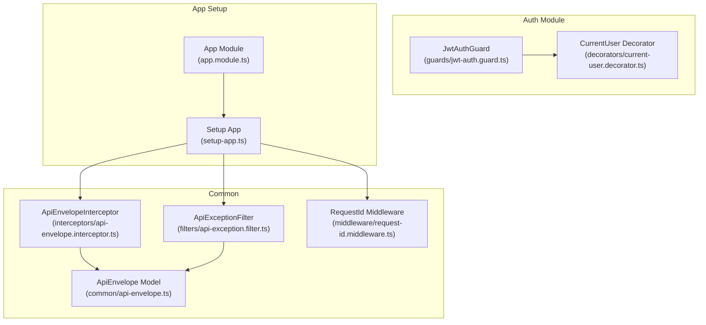
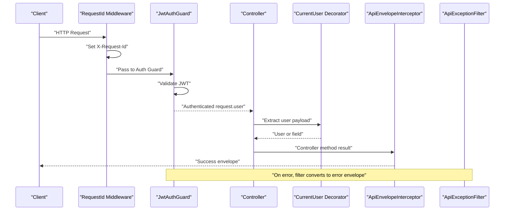
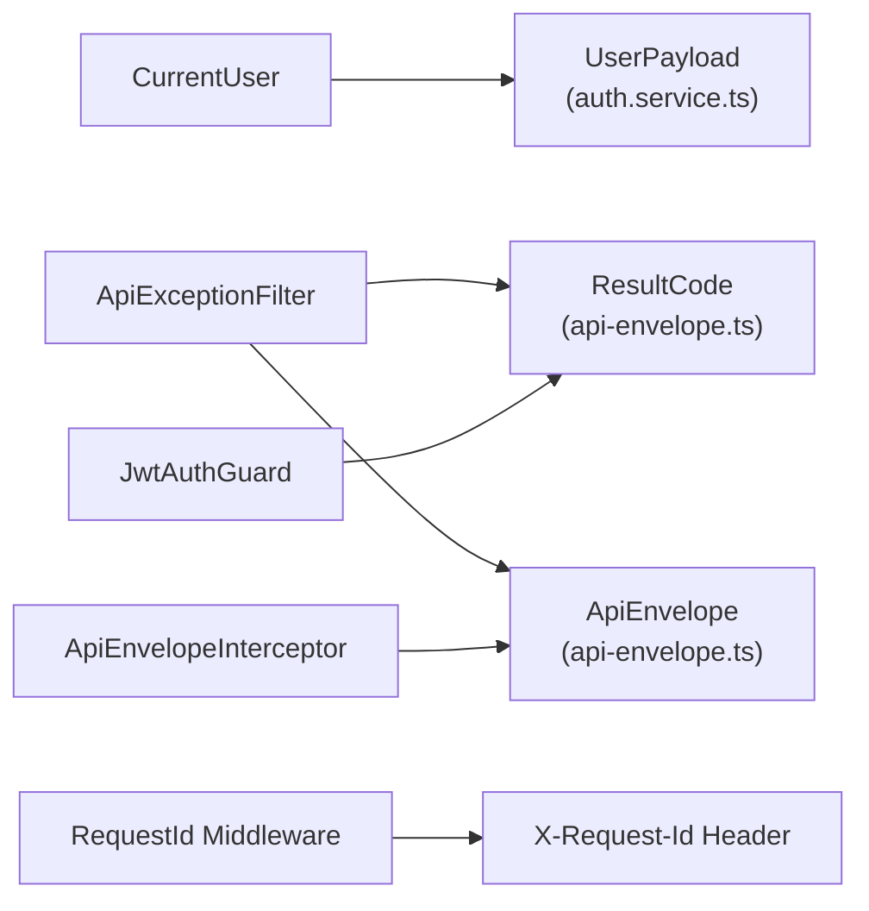

# Security Guards & Interceptors

<cite>
**Referenced Files in This Document**
- [jwt-auth.guard.ts](file://Lucent/src/modules/auth/guards/jwt-auth.guard.ts)
- [current-user.decorator.ts](file://Lucent/src/modules/auth/decorators/current-user.decorator.ts)
- [api-envelope.interceptor.ts](file://Lucent/src/common/interceptors/api-envelope.interceptor.ts)
- [api-exception.filter.ts](file://Lucent/src/common/filters/api-exception.filter.ts)
- [request-id.middleware.ts](file://Lucent/src/common/middleware/request-id.middleware.ts)
- [api-envelope.ts](file://Lucent/src/common/api-envelope.ts)
- [auth.controller.ts](file://Lucent/src/modules/auth/auth.controller.ts)
- [app.module.ts](file://Lucent/src/app.module.ts)
- [setup-app.ts](file://Lucent/src/setup-app.ts)
</cite>

## Table of Contents
1. [Introduction](#introduction)
2. [Project Structure](#project-structure)
3. [Core Components](#core-components)
4. [Architecture Overview](#architecture-overview)
5. [Detailed Component Analysis](#detailed-component-analysis)
6. [Dependency Analysis](#dependency-analysis)
7. [Performance Considerations](#performance-considerations)
8. [Troubleshooting Guide](#troubleshooting-guide)
9. [Conclusion](#conclusion)

## Introduction
This document explains the security guards and interceptors system used to protect routes, enforce authentication, and standardize responses. It covers:
- JWT authentication guard behavior and error handling
- Request interception patterns and response envelope formatting
- Global exception filtering and request/response transformation
- Custom decorators for extracting user context
- Middleware integration for request correlation
- Security middleware pipeline, request flow processing, and error response standardization
- Practical examples of guard usage in controllers and decorator implementation
- Performance considerations and logging integration for security auditing

## Project Structure
The security system spans several modules:
- Authentication guard and user extraction decorator under the auth module
- Global response envelope interceptor and exception filter under common
- Request correlation middleware under common middleware
- Shared envelope model and result codes under common

**Diagram sources**
- [jwt-auth.guard.ts:1-44](file://Lucent/src/modules/auth/guards/jwt-auth.guard.ts#L1-L44)
- [current-user.decorator.ts:1-30](file://Lucent/src/modules/auth/decorators/current-user.decorator.ts#L1-L30)
- [api-envelope.interceptor.ts:1-39](file://Lucent/src/common/interceptors/api-envelope.interceptor.ts#L1-L39)
- [api-exception.filter.ts:1-90](file://Lucent/src/common/filters/api-exception.filter.ts#L1-L90)
- [request-id.middleware.ts:1-25](file://Lucent/src/common/middleware/request-id.middleware.ts#L1-L25)
- [api-envelope.ts:1-200](file://Lucent/src/common/api-envelope.ts#L1-L200)
- [app.module.ts:1-200](file://Lucent/src/app.module.ts#L1-L200)
- [setup-app.ts:1-200](file://Lucent/src/setup-app.ts#L1-L200)

**Section sources**
- [jwt-auth.guard.ts:1-44](file://Lucent/src/modules/auth/guards/jwt-auth.guard.ts#L1-L44)
- [current-user.decorator.ts:1-30](file://Lucent/src/modules/auth/decorators/current-user.decorator.ts#L1-L30)
- [api-envelope.interceptor.ts:1-39](file://Lucent/src/common/interceptors/api-envelope.interceptor.ts#L1-L39)
- [api-exception.filter.ts:1-90](file://Lucent/src/common/filters/api-exception.filter.ts#L1-L90)
- [request-id.middleware.ts:1-25](file://Lucent/src/common/middleware/request-id.middleware.ts#L1-L25)
- [api-envelope.ts:1-200](file://Lucent/src/common/api-envelope.ts#L1-L200)
- [app.module.ts:1-200](file://Lucent/src/app.module.ts#L1-L200)
- [setup-app.ts:1-200](file://Lucent/src/setup-app.ts#L1-L200)

## Core Components
- JwtAuthGuard: Extends NestJS Passport AuthGuard('jwt') to validate access tokens and translate token errors into standardized unauthorized responses with localized messages.
- CurrentUser decorator: Extracts the authenticated user payload from the request, optionally selecting a specific field.
- ApiEnvelopeInterceptor: Wraps all successful responses into a uniform envelope, while leaving pre-wrapped envelopes untouched.
- ApiExceptionFilter: Standardizes error responses across the application, mapping HTTP exceptions and defaults to a consistent envelope with result codes.
- RequestId middleware: Generates or propagates a request correlation ID header for tracing and auditability.

**Section sources**
- [jwt-auth.guard.ts:16-44](file://Lucent/src/modules/auth/guards/jwt-auth.guard.ts#L16-L44)
- [current-user.decorator.ts:23-30](file://Lucent/src/modules/auth/decorators/current-user.decorator.ts#L23-L30)
- [api-envelope.interceptor.ts:23-39](file://Lucent/src/common/interceptors/api-envelope.interceptor.ts#L23-L39)
- [api-exception.filter.ts:17-90](file://Lucent/src/common/filters/api-exception.filter.ts#L17-L90)
- [request-id.middleware.ts:10-25](file://Lucent/src/common/middleware/request-id.middleware.ts#L10-L25)

## Architecture Overview
The security middleware pipeline integrates guards, interceptors, and filters to process requests and responses consistently. The flow ensures:
- Authentication via JwtAuthGuard before controller execution
- Optional user extraction via CurrentUser decorator
- Response formatting via ApiEnvelopeInterceptor
- Global error normalization via ApiExceptionFilter
- Request correlation via RequestId middleware

**Diagram sources**
- [request-id.middleware.ts:10-25](file://Lucent/src/common/middleware/request-id.middleware.ts#L10-L25)
- [jwt-auth.guard.ts:16-44](file://Lucent/src/modules/auth/guards/jwt-auth.guard.ts#L16-L44)
- [current-user.decorator.ts:23-30](file://Lucent/src/modules/auth/decorators/current-user.decorator.ts#L23-L30)
- [api-envelope.interceptor.ts:23-39](file://Lucent/src/common/interceptors/api-envelope.interceptor.ts#L23-L39)
- [api-exception.filter.ts:17-90](file://Lucent/src/common/filters/api-exception.filter.ts#L17-L90)

## Detailed Component Analysis

### JwtAuthGuard
Responsibilities:
- Extend AuthGuard('jwt') to leverage Passport’s JWT strategy
- Override handleRequest to convert token errors into UnauthorizedException with standardized ResultCode and localized messages
- Ensure request.user is populated for successful authentication

Key behaviors:
- Detects expired token errors and throws with TOKEN_EXPIRED code
- Throws UNAUTHORIZED for missing or invalid tokens
- Returns the authenticated user on success

Usage pattern:
- Apply @UseGuards(JwtAuthGuard) at controller or method level
- Access user payload via CurrentUser decorator

**Section sources**
- [jwt-auth.guard.ts:16-44](file://Lucent/src/modules/auth/guards/jwt-auth.guard.ts#L16-L44)

### CurrentUser Decorator
Responsibilities:
- Create a NestJS param decorator to extract user payload from request.user
- Optionally select a single field from the user payload

Usage pattern:
- Inject @CurrentUser() to receive the entire user payload
- Inject @CurrentUser('field') to receive a specific property

Integration:
- Works seamlessly after JwtAuthGuard populates request.user

**Section sources**
- [current-user.decorator.ts:23-30](file://Lucent/src/modules/auth/decorators/current-user.decorator.ts#L23-L30)

### ApiEnvelopeInterceptor
Responsibilities:
- Wrap successful responses into a uniform envelope
- Preserve existing envelopes to avoid double-wrapping
- Support nullish data by placing null inside the envelope

Processing logic:
- Inspect response data to detect pre-existing envelope
- If not an envelope, construct success envelope with provided data
- Return unchanged envelope when present

**Section sources**
- [api-envelope.interceptor.ts:10-39](file://Lucent/src/common/interceptors/api-envelope.interceptor.ts#L10-L39)
- [api-envelope.ts:1-200](file://Lucent/src/common/api-envelope.ts#L1-200)

### ApiExceptionFilter
Responsibilities:
- Catch all unhandled exceptions and transform them into standardized error envelopes
- Map HttpException responses to appropriate ResultCode values
- Normalize message arrays into a single string

Behavior:
- For HttpException with structured response, extract code and message/error
- For generic errors, default to INTERNAL_ERROR with a fixed message
- Always respond with errorEnvelope(code, message)

**Section sources**
- [api-exception.filter.ts:17-90](file://Lucent/src/common/filters/api-exception.filter.ts#L17-L90)
- [api-envelope.ts:1-200](file://Lucent/src/common/api-envelope.ts#L1-200)

### RequestId Middleware
Responsibilities:
- Generate a unique X-Request-Id header if missing
- Propagate the header back to clients for correlation
- Attach requestId to the request object for downstream use

Integration:
- Applied globally during app setup to ensure all requests are traced

**Section sources**
- [request-id.middleware.ts:10-25](file://Lucent/src/common/middleware/request-id.middleware.ts#L10-L25)

### Example: Guard Usage in Controllers
Typical usage involves applying JwtAuthGuard at controller or method level and extracting the user via CurrentUser.

Example reference paths:
- Controller-level guard usage: [auth.controller.ts](file://Lucent/src/modules/auth/auth.controller.ts)
- Method-level guard usage: [auth.controller.ts](file://Lucent/src/modules/auth/auth.controller.ts)
- CurrentUser decorator usage: [current-user.decorator.ts:23-30](file://Lucent/src/modules/auth/decorators/current-user.decorator.ts#L23-L30)

**Section sources**
- [auth.controller.ts:1-200](file://Lucent/src/modules/auth/auth.controller.ts#L1-L200)
- [current-user.decorator.ts:23-30](file://Lucent/src/modules/auth/decorators/current-user.decorator.ts#L23-L30)

### Example: Interceptor Configuration
Global interceptor registration ensures all successful responses are wrapped automatically.

Reference paths:
- Global interceptor registration: [setup-app.ts](file://Lucent/src/setup-app.ts)
- Interceptor implementation: [api-envelope.interceptor.ts:23-39](file://Lucent/src/common/interceptors/api-envelope.interceptor.ts#L23-L39)

**Section sources**
- [setup-app.ts:1-200](file://Lucent/src/setup-app.ts#L1-L200)
- [api-envelope.interceptor.ts:23-39](file://Lucent/src/common/interceptors/api-envelope.interceptor.ts#L23-L39)

### Example: Decorator Implementation
The decorator reads request.user and returns either the whole payload or a selected field.

Reference paths:
- Decorator definition: [current-user.decorator.ts:23-30](file://Lucent/src/modules/auth/decorators/current-user.decorator.ts#L23-L30)

**Section sources**
- [current-user.decorator.ts:23-30](file://Lucent/src/modules/auth/decorators/current-user.decorator.ts#L23-L30)

## Dependency Analysis
The security system components depend on shared models and NestJS primitives. The guard depends on the envelope ResultCode for consistent error reporting. The interceptor and filter both rely on the ApiEnvelope model.

**Diagram sources**
- [jwt-auth.guard.ts:4-44](file://Lucent/src/modules/auth/guards/jwt-auth.guard.ts#L4-L44)
- [current-user.decorator.ts:4](file://Lucent/src/modules/auth/decorators/current-user.decorator.ts#L4)
- [api-envelope.interceptor.ts:8](file://Lucent/src/common/interceptors/api-envelope.interceptor.ts#L8)
- [api-exception.filter.ts:9](file://Lucent/src/common/filters/api-exception.filter.ts#L9)
- [api-envelope.ts:1-200](file://Lucent/src/common/api-envelope.ts#L1-L200)
- [request-id.middleware.ts:4](file://Lucent/src/common/middleware/request-id.middleware.ts#L4)

**Section sources**
- [jwt-auth.guard.ts:4-44](file://Lucent/src/modules/auth/guards/jwt-auth.guard.ts#L4-L44)
- [current-user.decorator.ts:4](file://Lucent/src/modules/auth/decorators/current-user.decorator.ts#L4)
- [api-envelope.interceptor.ts:8](file://Lucent/src/common/interceptors/api-envelope.interceptor.ts#L8)
- [api-exception.filter.ts:9](file://Lucent/src/common/filters/api-exception.filter.ts#L9)
- [api-envelope.ts:1-200](file://Lucent/src/common/api-envelope.ts#L1-L200)
- [request-id.middleware.ts:4](file://Lucent/src/common/middleware/request-id.middleware.ts#L4)

## Performance Considerations
- Guard overhead: JwtAuthGuard leverages Passport; keep token validation logic minimal and avoid heavy synchronous work in handleRequest.
- Interceptor cost: ApiEnvelopeInterceptor performs shallow checks to detect envelopes; ensure controller actions return lightweight payloads.
- Filter impact: ApiExceptionFilter runs for all exceptions; avoid expensive computations in exception handlers.
- Middleware efficiency: RequestId middleware adds negligible overhead by setting headers and attaching a small property to the request object.
- Logging and tracing: Use the X-Request-Id header for correlating logs across services and for security audit trails.

[No sources needed since this section provides general guidance]

## Troubleshooting Guide
Common scenarios and resolutions:
- Expired token errors: JwtAuthGuard translates token expiration into UnauthorizedException with TOKEN_EXPIRED code; clients should refresh tokens.
- Missing or invalid tokens: UnauthorizedException with UNAUTHORIZED code; verify Authorization header and token issuance.
- Unexpected error responses: ApiExceptionFilter maps exceptions to error envelopes; check thrown error types and their response shapes.
- Double-wrapping responses: ApiEnvelopeInterceptor avoids rewrapping existing envelopes; ensure custom services do not manually wrap envelopes.
- Request tracing: Confirm X-Request-Id header is set by RequestId middleware; use it to correlate backend logs.

**Section sources**
- [jwt-auth.guard.ts:25-42](file://Lucent/src/modules/auth/guards/jwt-auth.guard.ts#L25-L42)
- [api-exception.filter.ts:35-66](file://Lucent/src/common/filters/api-exception.filter.ts#L35-L66)
- [api-envelope.interceptor.ts:10-21](file://Lucent/src/common/interceptors/api-envelope.interceptor.ts#L10-L21)
- [request-id.middleware.ts:15-24](file://Lucent/src/common/middleware/request-id.middleware.ts#L15-L24)

## Conclusion
The security guards and interceptors system provides a robust, consistent foundation for authentication, authorization, response formatting, and error handling. By combining JwtAuthGuard, CurrentUser, ApiEnvelopeInterceptor, ApiExceptionFilter, and RequestId middleware, the platform achieves:
- Clear, localized authentication failures
- Uniform response envelopes for all successful outcomes
- Standardized error envelopes across the board
- Request correlation for auditing and troubleshooting
- Predictable middleware pipeline behavior suitable for production-grade security and observability

[No sources needed since this section summarizes without analyzing specific files]