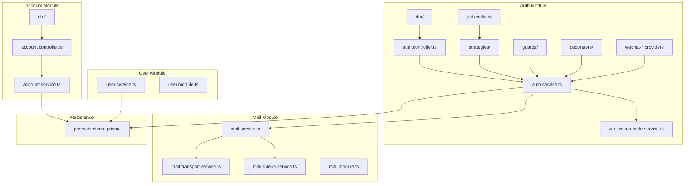
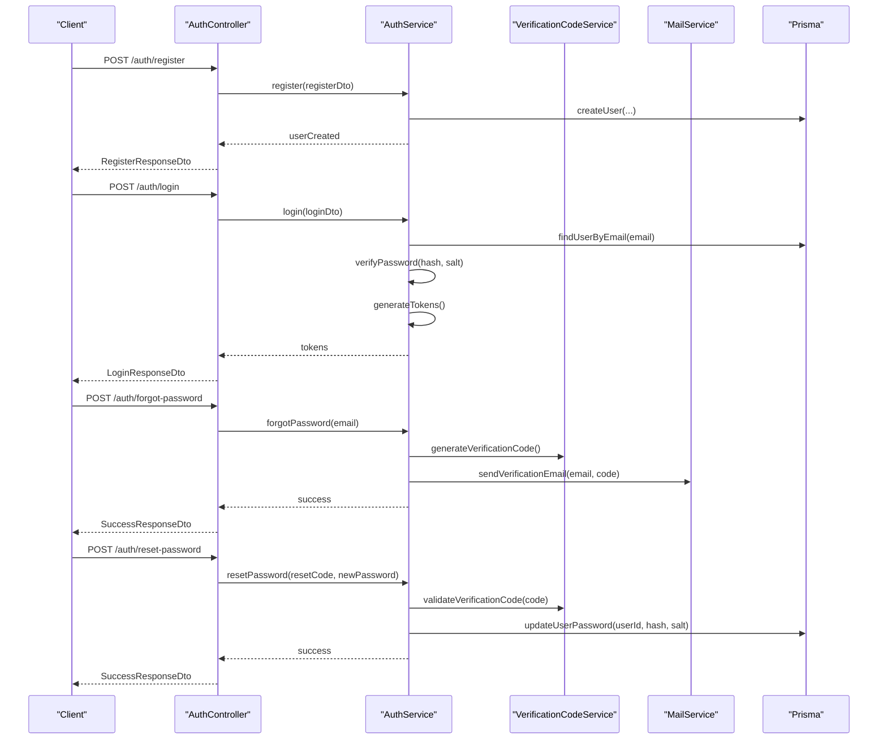
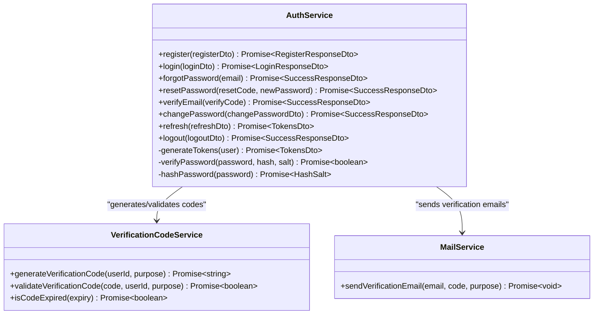
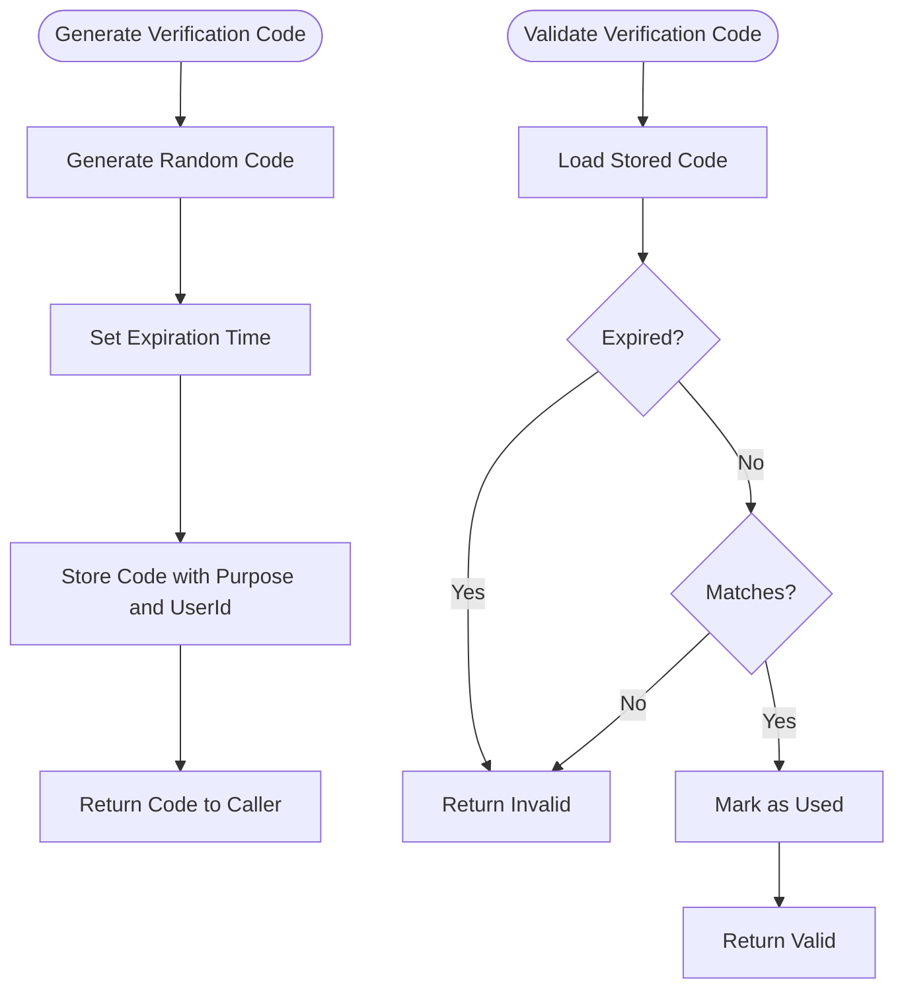
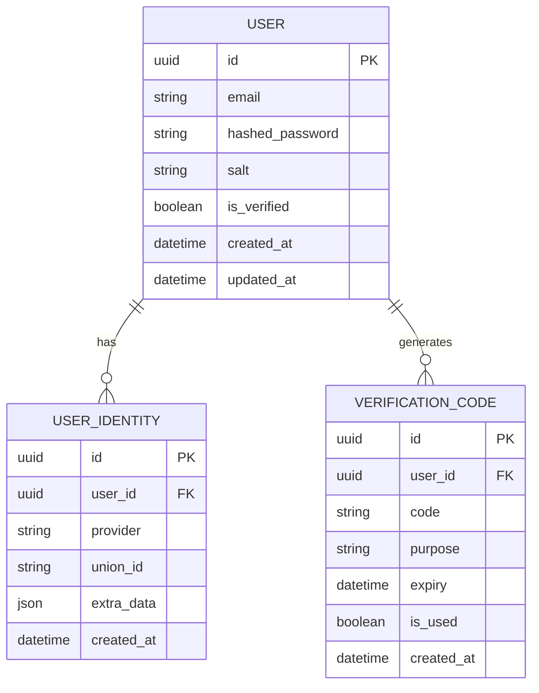
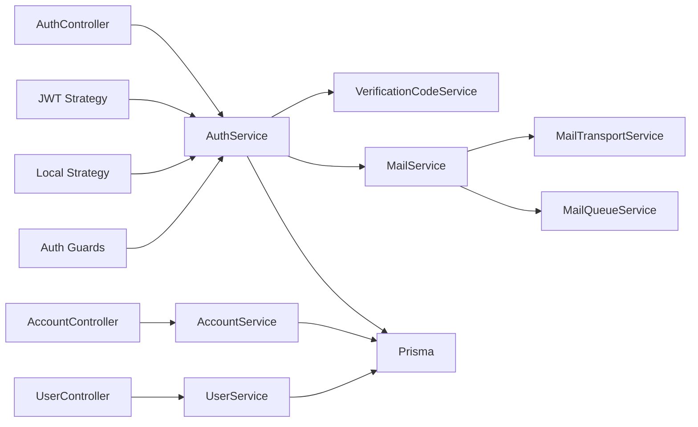

# User Identity Management

<cite>
**Referenced Files in This Document**
- [auth.service.ts](file://Lucent/src/modules/auth/auth.service.ts)
- [verification-code.service.ts](file://Lucent/src/modules/auth/verification-code.service.ts)
- [account.service.ts](file://Lucent/src/modules/account/account.service.ts)
- [user.service.ts](file://Lucent/src/modules/user/user.service.ts)
- [login.dto.ts](file://Lucent/src/modules/auth/dto/login.dto.ts)
- [register.dto.ts](file://Lucent/src/modules/auth/dto/register.dto.ts)
- [forgot-password.dto.ts](file://Lucent/src/modules/auth/dto/forgot-password.dto.ts)
- [reset-password.dto.ts](file://Lucent/src/modules/auth/dto/reset-password.dto.ts)
- [send-verification-code.dto.ts](file://Lucent/src/modules/auth/dto/send-verification-code.dto.ts)
- [verify-email.dto.ts](file://Lucent/src/modules/auth/dto/verify-email.dto.ts)
- [change-password.dto.ts](file://Lucent/src/modules/auth/dto/change-password.dto.ts)
- [update-account.dto.ts](file://Lucent/src/modules/account/dto/update-account.dto.ts)
- [auth-responses.dto.ts](file://Lucent/src/modules/auth/dto/responses/auth-responses.dto.ts)
- [oauth.dto.ts](file://Lucent/src/modules/auth/dto/oauth.dto.ts)
- [wechat-mobile-oauth.provider.ts](file://Lucent/src/modules/auth/wechat-mobile-oauth.provider.ts)
- [wechat-web-oauth.provider.ts](file://Lucent/src/modules/auth/wechat-web-oauth.provider.ts)
- [oauth.types.ts](file://Lucent/src/modules/auth/oauth.types.ts)
- [prisma.schema](file://Lucent/prisma/schema.prisma)
- [auth.controller.ts](file://Lucent/src/modules/auth/auth.controller.ts)
- [account.controller.ts](file://Lucent/src/modules/account/account.controller.ts)
- [user.module.ts](file://Lucent/src/modules/user/user.module.ts)
- [auth.module.ts](file://Lucent/src/modules/auth/auth.module.ts)
- [account.module.ts](file://Lucent/src/modules/account/account.module.ts)
- [jwt.config.ts](file://Lucent/src/config/jwt.config.ts)
- [mail.service.ts](file://Lucent/src/mail/mail.service.ts)
- [mail-transport.service.ts](file://Lucent/src/mail/mail-transport.service.ts)
- [mail-queue.service.ts](file://Lucent/src/mail/mail-queue.service.ts)
- [mail.module.ts](file://Lucent/src/mail/mail.module.ts)
- [logger.config.ts](file://Lucent/src/common/logger/logger.config.ts)
- [logger.module.ts](file://Lucent/src/common/logger/logger.module.ts)
- [client-ip.ts](file://Lucent/src/common/request/client-ip.ts)
- [api-envelope.interceptor.ts](file://Lucent/src/common/interceptors/api-envelope.interceptor.ts)
- [api-envelope.ts](file://Lucent/src/common/api-envelope.ts)
- [filters/api-exception.filter.ts](file://Lucent/src/common/filters/api-exception.filter.ts)
- [guards/jwt-auth.guard.ts](file://Lucent/src/modules/auth/guards/jwt-auth.guard.ts)
- [guards/local-auth.guard.ts](file://Lucent/src/modules/auth/guards/local-auth.guard.ts)
- [decorators/get-user.decorator.ts](file://Lucent/src/modules/auth/decorators/get-user.decorator.ts)
- [decorators/roles.decorator.ts](file://Lucent/src/modules/auth/decorators/roles.decorator.ts)
- [strategies/jwt.strategy.ts](file://Lucent/src/modules/auth/strategies/jwt.strategy.ts)
- [strategies/local.strategy.ts](file://Lucent/src/modules/auth/strategies/local.strategy.ts)
- [app.module.ts](file://Lucent/src/app.module.ts)
- [main.ts](file://Lucent/src/main.ts)
</cite>

## Table of Contents
1. [Introduction](#introduction)
2. [Project Structure](#project-structure)
3. [Core Components](#core-components)
4. [Architecture Overview](#architecture-overview)
5. [Detailed Component Analysis](#detailed-component-analysis)
6. [Dependency Analysis](#dependency-analysis)
7. [Performance Considerations](#performance-considerations)
8. [Security Measures](#security-measures)
9. [Troubleshooting Guide](#troubleshooting-guide)
10. [Conclusion](#conclusion)

## Introduction
This document provides comprehensive documentation for the user identity management system in the Lumos project. It explains user registration and login processes, password handling, user profile management, and the verification code service for email confirmation and password reset workflows. It also covers user identity DTOs, validation rules, data transformation patterns, OAuth integration, identity consolidation, and security measures including password policies, account lockout mechanisms, and suspicious activity detection.

## Project Structure
The user identity system is primarily implemented in the backend NestJS application under the Lucent module. Key areas include:
- Authentication module: handles login, registration, password reset, verification codes, and OAuth providers
- Account module: manages user profile updates and account-related operations
- User module: provides user data access and retrieval
- Mail module: handles email delivery for verification and notifications
- Prisma schema: defines the database model for user identities and related entities

**Diagram sources**
- [auth.service.ts](file://Lucent/src/modules/auth/auth.service.ts)
- [verification-code.service.ts](file://Lucent/src/modules/auth/verification-code.service.ts)
- [auth.controller.ts](file://Lucent/src/modules/auth/auth.controller.ts)
- [account.service.ts](file://Lucent/src/modules/account/account.service.ts)
- [account.controller.ts](file://Lucent/src/modules/account/account.controller.ts)
- [user.service.ts](file://Lucent/src/modules/user/user.service.ts)
- [mail.service.ts](file://Lucent/src/mail/mail.service.ts)
- [mail-transport.service.ts](file://Lucent/src/mail/mail-transport.service.ts)
- [mail-queue.service.ts](file://Lucent/src/mail/mail-queue.service.ts)
- [jwt.config.ts](file://Lucent/src/config/jwt.config.ts)
- [prisma.schema](file://Lucent/prisma/schema.prisma)

**Section sources**
- [auth.module.ts](file://Lucent/src/modules/auth/auth.module.ts)
- [account.module.ts](file://Lucent/src/modules/account/account.module.ts)
- [user.module.ts](file://Lucent/src/modules/user/user.module.ts)
- [mail.module.ts](file://Lucent/src/mail/mail.module.ts)

## Core Components
- Authentication Service: Central orchestrator for authentication flows, password handling, verification code generation and validation, and integration with external OAuth providers.
- Verification Code Service: Generates and validates time-bound verification codes for email confirmation and password reset.
- Account Service: Manages user profile updates, email changes, password changes, and account deletion.
- User Service: Provides user data retrieval and auxiliary user operations.
- Mail Service: Handles sending verification emails and other notifications via configured transport.
- DTOs: Strongly-typed request/response models for all identity operations with validation rules.
- Guards and Strategies: JWT and local authentication guards with strategies for session and token-based authentication.
- OAuth Providers: Integrations for mobile and web WeChat OAuth flows.

**Section sources**
- [auth.service.ts](file://Lucent/src/modules/auth/auth.service.ts)
- [verification-code.service.ts](file://Lucent/src/modules/auth/verification-code.service.ts)
- [account.service.ts](file://Lucent/src/modules/account/account.service.ts)
- [user.service.ts](file://Lucent/src/modules/user/user.service.ts)
- [mail.service.ts](file://Lucent/src/mail/mail.service.ts)

## Architecture Overview
The identity system follows a layered architecture:
- Controllers handle HTTP requests and delegate to services
- Services encapsulate business logic and coordinate persistence and external systems
- DTOs enforce validation and data transformation
- Guards and strategies manage authentication and authorization
- Mail service handles asynchronous email delivery
- Prisma provides type-safe database access

**Diagram sources**
- [auth.controller.ts](file://Lucent/src/modules/auth/auth.controller.ts)
- [auth.service.ts](file://Lucent/src/modules/auth/auth.service.ts)
- [verification-code.service.ts](file://Lucent/src/modules/auth/verification-code.service.ts)
- [mail.service.ts](file://Lucent/src/mail/mail.service.ts)
- [prisma.schema](file://Lucent/prisma/schema.prisma)

## Detailed Component Analysis

### Authentication Service
The authentication service coordinates user registration, login, password reset, and verification workflows. It integrates with the verification code service for OTP generation and validation, and with the mail service for sending verification emails. It performs password hashing and verification using secure algorithms and manages JWT token generation and refresh.

Key responsibilities:
- User registration with validation and initial profile setup
- Local login with credential verification and token issuance
- Password reset via verification code workflow
- Email verification during registration and email change
- Integration with OAuth providers for social login
- Token refresh and logout handling

**Diagram sources**
- [auth.service.ts](file://Lucent/src/modules/auth/auth.service.ts)
- [verification-code.service.ts](file://Lucent/src/modules/auth/verification-code.service.ts)
- [mail.service.ts](file://Lucent/src/mail/mail.service.ts)

**Section sources**
- [auth.service.ts](file://Lucent/src/modules/auth/auth.service.ts)

### Verification Code Service
The verification code service generates cryptographically secure random codes bound to user IDs and purposes (registration, password reset, email change). Codes have expiration times and are validated against stored records. It ensures single-use per transaction and prevents replay attacks.

**Diagram sources**
- [verification-code.service.ts](file://Lucent/src/modules/auth/verification-code.service.ts)

**Section sources**
- [verification-code.service.ts](file://Lucent/src/modules/auth/verification-code.service.ts)

### Account Service
The account service manages user profile updates, including email changes, password updates, and account deletion. It enforces validation rules, triggers verification workflows when changing sensitive attributes, and maintains audit trails.

Key operations:
- Update user profile information
- Change email with verification code workflow
- Change password with current password verification
- Delete account with confirmation

**Section sources**
- [account.service.ts](file://Lucent/src/modules/account/account.service.ts)
- [update-account.dto.ts](file://Lucent/src/modules/account/dto/update-account.dto.ts)

### User Service
The user service provides read-only operations for user data, profile retrieval, and auxiliary queries. It collaborates with the database layer to fetch user information securely and efficiently.

**Section sources**
- [user.service.ts](file://Lucent/src/modules/user/user.service.ts)

### DTOs and Validation Rules
The system uses DTOs extensively to define request/response shapes and apply validation rules. Examples include:

- Registration DTO: Validates email format, password strength, and optional profile fields
- Login DTO: Validates email and password presence
- Forgot Password DTO: Validates email existence
- Reset Password DTO: Validates new password strength and confirmation
- Send Verification Code DTO: Validates recipient and purpose
- Verify Email DTO: Validates verification code format
- Change Password DTO: Validates current and new passwords
- Update Account DTO: Validates profile field updates

Validation patterns:
- Decorators for field-level validation
- Custom validation classes for cross-field rules
- Transformations for sanitization and normalization
- Internationalization support for error messages

**Section sources**
- [register.dto.ts](file://Lucent/src/modules/auth/dto/register.dto.ts)
- [login.dto.ts](file://Lucent/src/modules/auth/dto/login.dto.ts)
- [forgot-password.dto.ts](file://Lucent/src/modules/auth/dto/forgot-password.dto.ts)
- [reset-password.dto.ts](file://Lucent/src/modules/auth/dto/reset-password.dto.ts)
- [send-verification-code.dto.ts](file://Lucent/src/modules/auth/dto/send-verification-code.dto.ts)
- [verify-email.dto.ts](file://Lucent/src/modules/auth/dto/verify-email.dto.ts)
- [change-password.dto.ts](file://Lucent/src/modules/auth/dto/change-password.dto.ts)
- [update-account.dto.ts](file://Lucent/src/modules/account/dto/update-account.dto.ts)

### OAuth Integration and Identity Consolidation
The system supports OAuth login via WeChat providers for both mobile and web platforms. OAuth DTOs define authorization flows and callback handling. Identity consolidation allows linking multiple OAuth identities to a single local account, enabling seamless transitions between authentication methods.

OAuth providers:
- WeChat Mobile OAuth Provider
- WeChat Web OAuth Provider

Identity management:
- Linking OAuth identities to local accounts
- Consolidating multiple identities under one user
- Handling unlinking and merging scenarios

**Section sources**
- [oauth.dto.ts](file://Lucent/src/modules/auth/dto/oauth.dto.ts)
- [wechat-mobile-oauth.provider.ts](file://Lucent/src/modules/auth/wechat-mobile-oauth.provider.ts)
- [wechat-web-oauth.provider.ts](file://Lucent/src/modules/auth/wechat-web-oauth.provider.ts)
- [oauth.types.ts](file://Lucent/src/modules/auth/oauth.types.ts)

### Data Model and Relationships
The Prisma schema defines the user identity model with separate entities for local accounts and OAuth identities. Users can have multiple identities linked to a single account, supporting consolidated profiles.

**Diagram sources**
- [prisma.schema](file://Lucent/prisma/schema.prisma)

**Section sources**
- [prisma.schema](file://Lucent/prisma/schema.prisma)

### Authentication and Authorization
The system employs JWT-based authentication with refresh tokens and local strategy for password-based login. Guards protect routes, and strategies handle token extraction and user loading.

Components:
- JWT Guard: Protects routes requiring authenticated users
- Local Guard: Handles password-based login challenges
- JWT Strategy: Extracts and validates JWT tokens
- Local Strategy: Authenticates with email/password

**Section sources**
- [guards/jwt-auth.guard.ts](file://Lucent/src/modules/auth/guards/jwt-auth.guard.ts)
- [guards/local-auth.guard.ts](file://Lucent/src/modules/auth/guards/local-auth.guard.ts)
- [strategies/jwt.strategy.ts](file://Lucent/src/modules/auth/strategies/jwt.strategy.ts)
- [strategies/local.strategy.ts](file://Lucent/src/modules/auth/strategies/local.strategy.ts)

### Mail Service and Notifications
The mail service sends verification emails and other notifications asynchronously. It uses a queue mechanism to prevent blocking and retries for reliability. Transport configuration supports various providers.

Features:
- Asynchronous email queuing
- Template-based verification emails
- Retry and failure handling
- Configurable transport providers

**Section sources**
- [mail.service.ts](file://Lucent/src/mail/mail.service.ts)
- [mail-queue.service.ts](file://Lucent/src/mail/mail-queue.service.ts)
- [mail-transport.service.ts](file://Lucent/src/mail/mail-transport.service.ts)

## Dependency Analysis
The identity system exhibits strong separation of concerns with clear boundaries between modules. Dependencies flow from controllers to services, with services depending on DTOs, guards, strategies, and persistence layers. External dependencies include JWT libraries, mail transport providers, and OAuth SDKs.

**Diagram sources**
- [auth.controller.ts](file://Lucent/src/modules/auth/auth.controller.ts)
- [account.controller.ts](file://Lucent/src/modules/account/account.controller.ts)
- [auth.service.ts](file://Lucent/src/modules/auth/auth.service.ts)
- [account.service.ts](file://Lucent/src/modules/account/account.service.ts)
- [user.service.ts](file://Lucent/src/modules/user/user.service.ts)
- [verification-code.service.ts](file://Lucent/src/modules/auth/verification-code.service.ts)
- [mail.service.ts](file://Lucent/src/mail/mail.service.ts)
- [prisma.schema](file://Lucent/prisma/schema.prisma)

**Section sources**
- [app.module.ts](file://Lucent/src/app.module.ts)
- [main.ts](file://Lucent/src/main.ts)

## Performance Considerations
- Asynchronous email processing: Offloads mail sending to queues to avoid blocking request handling
- Token caching: Consider caching frequently accessed user claims to reduce database queries
- Indexing: Ensure proper indexing on user email, verification codes, and OAuth union IDs
- Pagination: Implement pagination for user lists and audit trails
- Connection pooling: Configure Prisma connection pools appropriately for production workloads
- Rate limiting: Apply rate limits to authentication endpoints to prevent brute force attacks

## Security Measures
Password policies and hashing:
- Passwords are hashed using secure algorithms with salt storage
- Minimum password length and complexity requirements enforced via DTO validation
- Salt is randomly generated per user and stored alongside the hash

Account protection:
- Account lockout after failed attempts threshold
- IP-based rate limiting and suspicious activity detection
- Session timeout and automatic logout after prolonged inactivity
- Secure cookie settings for session management

Verification and consent:
- Time-bound verification codes with automatic expiration
- Single-use verification codes per transaction
- Explicit consent for email changes and account deletions

Audit logging:
- Comprehensive audit trail for sensitive operations
- Logging of authentication attempts and failures
- IP address capture for suspicious activity monitoring

**Section sources**
- [auth.service.ts](file://Lucent/src/modules/auth/auth.service.ts)
- [verification-code.service.ts](file://Lucent/src/modules/auth/verification-code.service.ts)
- [client-ip.ts](file://Lucent/src/common/request/client-ip.ts)
- [logger.config.ts](file://Lucent/src/common/logger/logger.config.ts)

## Troubleshooting Guide
Common issues and resolutions:
- Authentication failures: Verify email exists, check password hash matches, confirm account is verified
- Verification code invalid: Ensure code is not expired, matches user ID and purpose, and is not already used
- Email delivery failures: Check mail transport configuration, queue status, and retry policies
- OAuth login issues: Validate provider credentials, callback URLs, and state parameters
- Account update errors: Review DTO validation rules and required permissions

Diagnostic tools:
- Enable detailed logging for authentication flows
- Monitor rate limit violations and suspicious activities
- Use audit logs to trace user actions and system events

**Section sources**
- [filters/api-exception.filter.ts](file://Lucent/src/common/filters/api-exception.filter.ts)
- [logger.module.ts](file://Lucent/src/common/logger/logger.module.ts)
- [logger.config.ts](file://Lucent/src/common/logger/logger.config.ts)

## Conclusion
The Lumos user identity management system provides a robust, secure, and extensible foundation for user authentication and profile management. It combines traditional email/password authentication with modern OAuth integrations, comprehensive verification workflows, and strong security measures. The modular architecture ensures maintainability and scalability while the extensive use of DTOs and validation guarantees data integrity and predictable behavior.