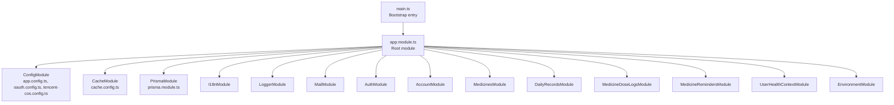
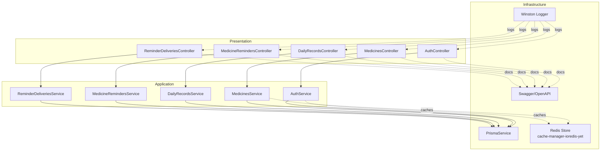
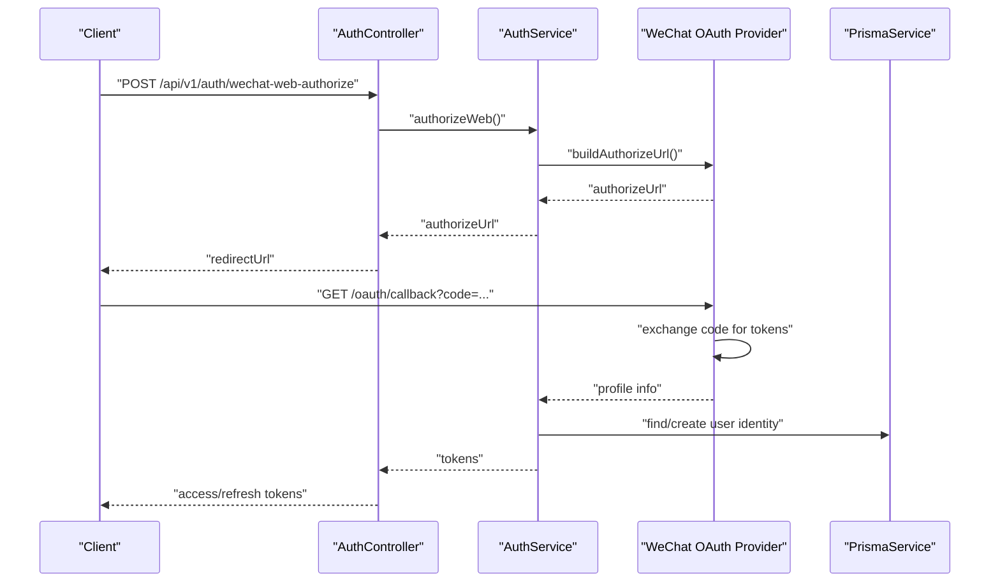
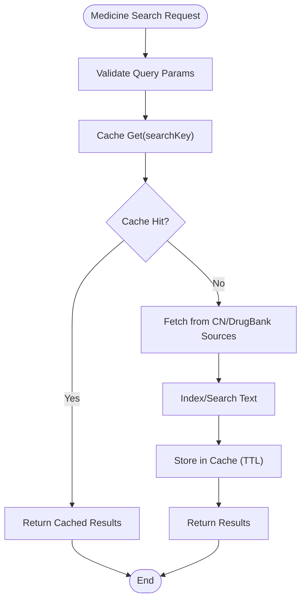
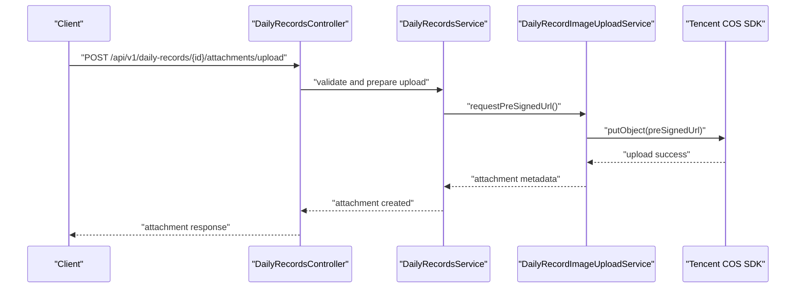
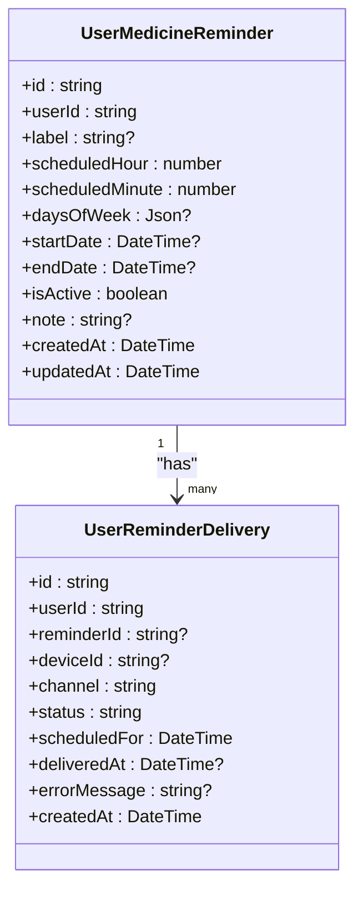
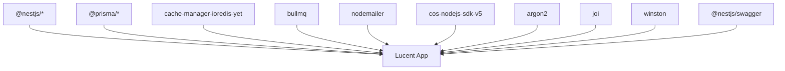

# Backend Architecture (Lucent)

<cite>
**Referenced Files in This Document**
- [main.ts](file://Lucent/src/main.ts)
- [app.module.ts](file://Lucent/src/app.module.ts)
- [setup-app.ts](file://Lucent/src/setup-app.ts)
- [app.config.ts](file://Lucent/src/config/app.config.ts)
- [cache.config.ts](file://Lucent/src/config/cache.config.ts)
- [oauth.config.ts](file://Lucent/src/config/oauth.config.ts)
- [tencent-cos.config.ts](file://Lucent/src/config/tencent-cos.config.ts)
- [prisma.module.ts](file://Lucent/src/prisma/prisma.module.ts)
- [schema.prisma](file://Lucent/prisma/schema.prisma)
- [package.json](file://Lucent/package.json)
- [nest-cli.json](file://Lucent/nest-cli.json)
- [auth.module.ts](file://Lucent/src/modules/auth/auth.module.ts)
- [medicines.module.ts](file://Lucent/src/modules/medicines/medicines.module.ts)
- [daily-records.module.ts](file://Lucent/src/modules/daily-records/daily-records.module.ts)
- [medicine-reminders.module.ts](file://Lucent/src/modules/medicine-reminders/medicine-reminders.module.ts)
</cite>

## Table of Contents
1. [Introduction](#introduction)
2. [Project Structure](#project-structure)
3. [Core Components](#core-components)
4. [Architecture Overview](#architecture-overview)
5. [Detailed Component Analysis](#detailed-component-analysis)
6. [Dependency Analysis](#dependency-analysis)
7. [Performance Considerations](#performance-considerations)
8. [Troubleshooting Guide](#troubleshooting-guide)
9. [Conclusion](#conclusion)
10. [Appendices](#appendices)

## Introduction
This document describes the backend architecture of the Lucent system built with the NestJS framework. It explains the modular design, system boundaries, and interactions among authentication, business logic, and data access layers. It also documents integration patterns with Tencent COS and WeChat OAuth, cross-cutting concerns such as security, logging, caching, and monitoring, and provides infrastructure and deployment guidance.

## Project Structure
Lucent follows a NestJS monorepo-like structure under the Lucent directory. The application bootstraps via a central module that aggregates feature modules and shared infrastructure modules. Configuration is centralized using NestJS ConfigModule with environment-driven providers. Prisma is used for database modeling and client generation.

**Diagram sources**
- [main.ts:1-23](file://Lucent/src/main.ts#L1-L23)
- [app.module.ts:26-50](file://Lucent/src/app.module.ts#L26-L50)
- [app.config.ts:21-26](file://Lucent/src/config/app.config.ts#L21-L26)
- [oauth.config.ts:16-29](file://Lucent/src/config/oauth.config.ts#L16-L29)
- [tencent-cos.config.ts:15-30](file://Lucent/src/config/tencent-cos.config.ts#L15-L30)
- [cache.config.ts:25-52](file://Lucent/src/config/cache.config.ts#L25-L52)
- [prisma.module.ts:4-10](file://Lucent/src/prisma/prisma.module.ts#L4-L10)

**Section sources**
- [main.ts:1-23](file://Lucent/src/main.ts#L1-L23)
- [app.module.ts:26-50](file://Lucent/src/app.module.ts#L26-L50)
- [nest-cli.json:1-17](file://Lucent/nest-cli.json#L1-L17)

## Core Components
- Bootstrap and Application Setup
  - Bootstrapping initializes NestJS, sets Winston-based logging, applies global middleware and interceptors, enables CORS, and registers Swagger/OpenAPI documentation.
  - Host and port are loaded from configuration.
- Configuration
  - Centralized configuration via ConfigModule with providers for app, JWT, OAuth, and Tencent COS settings.
  - Environment validation ensures required variables are present.
- Caching
  - CacheModule configured via CacheConfigService supporting optional Redis-backed stores with Keyv adapter.
- Data Access
  - PrismaModule exposes a globally available PrismaService for database operations.
  - Prisma schema defines domain models for users, identities, profiles, sessions, devices, health conditions, current medicines, reminders, dose logs, daily records, and attachments, plus medicine knowledge sources (DrugBank and CN products).
- Modules
  - Feature modules encapsulate business domains: authentication, medicines, daily records, reminders, dose logs, user health context, environment, and account.
  - Shared modules provide logging, i18n, mail, and cache.

**Section sources**
- [main.ts:9-20](file://Lucent/src/main.ts#L9-L20)
- [setup-app.ts:17-80](file://Lucent/src/setup-app.ts#L17-L80)
- [app.config.ts:21-26](file://Lucent/src/config/app.config.ts#L21-L26)
- [cache.config.ts:22-52](file://Lucent/src/config/cache.config.ts#L22-L52)
- [prisma.module.ts:4-10](file://Lucent/src/prisma/prisma.module.ts#L4-L10)
- [schema.prisma:106-599](file://Lucent/prisma/schema.prisma#L106-L599)

## Architecture Overview
The backend employs a layered architecture with clear separation of concerns:
- Presentation Layer: Controllers in feature modules expose REST endpoints.
- Application Layer: Services orchestrate business logic and coordinate with data access.
- Data Access Layer: PrismaService abstracts database operations.
- Cross-Cutting Concerns: Logging, validation, error handling, caching, CORS, and OpenAPI/Swagger.

**Diagram sources**
- [auth.module.ts:13-28](file://Lucent/src/modules/auth/auth.module.ts#L13-L28)
- [medicines.module.ts:9-18](file://Lucent/src/modules/medicines/medicines.module.ts#L9-L18)
- [daily-records.module.ts:8-12](file://Lucent/src/modules/daily-records/daily-records.module.ts#L8-L12)
- [medicine-reminders.module.ts:6-9](file://Lucent/src/modules/medicine-reminders/medicine-reminders.module.ts#L6-L9)
- [prisma.module.ts:4-10](file://Lucent/src/prisma/prisma.module.ts#L4-L10)
- [cache.config.ts:25-52](file://Lucent/src/config/cache.config.ts#L25-L52)
- [setup-app.ts:62-79](file://Lucent/src/setup-app.ts#L62-L79)

## Detailed Component Analysis

### Authentication and OAuth Integration
- Module Composition
  - AuthModule imports Passport and JwtModule, declares AuthController, and provides AuthService, strategies, verification code service, and WeChat OAuth providers for web and mobile.
- OAuth Providers
  - WeChat OAuth configurations are loaded via oauth.config.ts and support both web and mobile flows.
- Security Controls
  - Global ValidationPipe enforces DTO validation and transforms inputs.
  - Global interceptor wraps responses in a uniform envelope.
  - Global filter standardizes error responses.
  - CORS enabled based on configuration.
- Token Management
  - JWT access strategy is registered globally; secrets are managed per sign-in in AuthService.

**Diagram sources**
- [auth.module.ts:13-28](file://Lucent/src/modules/auth/auth.module.ts#L13-L28)
- [oauth.config.ts:16-29](file://Lucent/src/config/oauth.config.ts#L16-L29)
- [setup-app.ts:40-53](file://Lucent/src/setup-app.ts#L40-L53)

**Section sources**
- [auth.module.ts:13-28](file://Lucent/src/modules/auth/auth.module.ts#L13-L28)
- [oauth.config.ts:16-29](file://Lucent/src/config/oauth.config.ts#L16-L29)

### Medicines Domain and Caching
- Module Scope
  - MedicinesModule exposes MedicinesController and services for searching and managing medicines, including cache administration and runtime cache services.
- Data Sources
  - Services integrate with CN and DrugBank sources; Prisma models define import runs and indexed search text for efficient queries.
- Caching Strategy
  - CacheConfigService supports Redis-backed cache with Keyv adapter; TTL and store selection are environment-driven.

**Diagram sources**
- [medicines.module.ts:9-18](file://Lucent/src/modules/medicines/medicines.module.ts#L9-L18)
- [cache.config.ts:25-52](file://Lucent/src/config/cache.config.ts#L25-L52)
- [schema.prisma:424-519](file://Lucent/prisma/schema.prisma#L424-L519)

**Section sources**
- [medicines.module.ts:9-18](file://Lucent/src/modules/medicines/medicines.module.ts#L9-L18)
- [cache.config.ts:25-52](file://Lucent/src/config/cache.config.ts#L25-L52)

### Daily Records and Tencent COS Integration
- Module Scope
  - DailyRecordsModule provides controllers and services for CRUD operations on daily records and image uploads.
- Image Upload Pipeline
  - DailyRecordImageUploadService coordinates with Tencent COS SDK to generate pre-signed URLs and manage uploads.
- COS Configuration
  - TencentCosConfig loads credentials, bucket, region, base URL, expiration, and max upload size from environment.

**Diagram sources**
- [daily-records.module.ts:8-12](file://Lucent/src/modules/daily-records/daily-records.module.ts#L8-L12)
- [tencent-cos.config.ts:15-30](file://Lucent/src/config/tencent-cos.config.ts#L15-L30)

**Section sources**
- [daily-records.module.ts:8-12](file://Lucent/src/modules/daily-records/daily-records.module.ts#L8-L12)
- [tencent-cos.config.ts:15-30](file://Lucent/src/config/tencent-cos.config.ts#L15-L30)

### Medicine Reminders and Delivery Orchestration
- Module Scope
  - MedicineRemindersModule exposes controllers for reminders and reminder deliveries, coordinating scheduling and delivery tracking.
- Data Model
  - Prisma models include reminders, reminder deliveries, and associated indexes for efficient querying.

**Diagram sources**
- [schema.prisma:279-323](file://Lucent/prisma/schema.prisma#L279-L323)

**Section sources**
- [medicine-reminders.module.ts:6-9](file://Lucent/src/modules/medicine-reminders/medicine-reminders.module.ts#L6-L9)
- [schema.prisma:279-323](file://Lucent/prisma/schema.prisma#L279-L323)

### Data Models Overview
The Prisma schema defines core entities and relationships across user profiles, identities, sessions, devices, health conditions, current medicines, reminders, dose logs, daily records, and attachments. It also models imported medicine knowledge from CN and DrugBank sources.

```mermaid
erDiagram
USER {
string id PK
string email
string passwordHash
string nickname
string avatar
enum status
timestamptz emailVerifiedAt
timestamptz lastLoginAt
timestamptz deletedAt
timestamptz createdAt
timestamptz updatedAt
}
USER_IDENTITY {
string id PK
string userId FK
string provider
string providerUserId
string providerUnionId
string email
timestamptz emailVerifiedAt
json rawProfile
timestamptz createdAt
timestamptz updatedAt
}
USER_PROFILE {
string userId PK
date birthDate
enum sexAtBirth
int heightCm
enum pregnancyState
enum lactationState
string bloodType
string locale
string timezone
enum unitSystem
timestamptz onboardingCompletedAt
json extras
timestamptz createdAt
timestamptz updatedAt
}
USER_SESSION {
string id PK
string userId FK
string refreshTokenHash
enum deviceType
string deviceName
enum platform
string appVersion
string ipAddress
string userAgent
json context
timestamptz lastUsedAt
timestamptz expiresAt
timestamptz revokedAt
timestamptz createdAt
timestamptz updatedAt
}
USER_DEVICE {
string id PK
string userId FK
enum platform
string deviceName
string pushToken
string locale
string timezone
boolean notificationsEnabled
json capabilities
timestamptz lastSeenAt
timestamptz createdAt
timestamptz updatedAt
}
USER_ALLERGY {
string id PK
string userId FK
enum kind
string label
string reaction
enum severity
boolean isActive
string note
json extras
timestamptz recordedAt
timestamptz createdAt
timestamptz updatedAt
}
USER_CONDITION {
string id PK
string userId FK
string label
enum status
date diagnosedAt
date resolvedAt
string note
json extras
timestamptz createdAt
timestamptz updatedAt
}
USER_CURRENT_MEDICINE {
string id PK
string userId FK
enum source
string sourceRefId
string displayName
string strengthText
string doseText
string route
date startedAt
date endedAt
boolean isCurrent
string note
json sourcePayload
timestamptz createdAt
timestamptz updatedAt
}
USER_MEDICINE_REMINDER {
string id PK
string userId FK
string currentMedicineId
string label
int scheduledHour
int scheduledMinute
json daysOfWeek
date startDate
date endDate
boolean isActive
string note
timestamptz deletedAt
timestamptz createdAt
timestamptz updatedAt
}
USER_REMINDER_DELIVERY {
string id PK
string userId FK
string reminderId
string deviceId
string channel
string status
timestamptz scheduledFor
timestamptz deliveredAt
string errorMessage
timestamptz createdAt
}
USER_MEDICINE_DOSE_LOG {
string id PK
string userId FK
string currentMedicineId
enum status
date scheduledFor
timestamptz takenAt
string doseText
string note
string source
timestamptz deletedAt
timestamptz createdAt
timestamptz updatedAt
}
USER_DAILY_RECORD {
string id PK
string userId FK
enum kind
date occurredAt
string title
string value
string unit
string note
json payload
string source
timestamptz deletedAt
timestamptz createdAt
timestamptz updatedAt
}
USER_DAILY_RECORD_ATTACHMENT {
string id PK
string userId FK
string recordId FK
enum kind
string objectKey
string bucket
string provider
string fileName
string contentType
int sizeBytes
int width
int height
string publicUrl
timestamptz createdAt
}
DRUG_SOURCE_IMPORT {
string id PK
string sourceKey
string sourceName
string sourceVersion
string sourceFileName
string sourceFileHash
timestamptz sourceExportedAt
string status
int rawRowCount
int importedRowCount
int rejectedRowCount
json rejectionSummary
string note
timestamptz createdAt
timestamptz updatedAt
}
CN_MEDICINE_PRODUCT {
string id PK
string importRunId
string sourceName
int sourceRowNumber
string name
string imageUrl
string priceText
string packageSpec
string approvalNumber
string manufacturer
string drugType
string mainCategory
string subcategory
string sourceUrl
string brandName
string ingredients
string properties
string indications
string dosage
string adverseReactions
string contraindications
string precautions
string pediatricUse
string geriatricUse
string pregnancyLactation
string pharmacologyToxicology
string drugInteractions
string pharmacokinetics
string overdose
string storage
string validityPeriod
string barcode
string nationalDrugCode
string searchText
json extras
timestamptz createdAt
timestamptz updatedAt
}
DRUGBANK_DRUG {
string drugbankId PK
string importRunId
json secondaryDrugbankIds
string drugType
timestamptz sourceCreatedAt
timestamptz sourceUpdatedAt
string name
string description
string casNumber
string unii
string state
json groups
string indication
string pharmacodynamics
string mechanismOfAction
string toxicity
string metabolism
string absorption
string halfLife
string proteinBinding
string routeOfElimination
string volumeOfDistribution
string clearance
json classification
json synonyms
json products
json internationalBrands
json categories
json atcCodes
json foodInteractions
json drugInteractions
json externalIdentifiers
json externalLinks
string searchText
timestamptz createdAt
timestamptz updatedAt
}
DRUGBANK_EXTERNAL_LINK {
string id PK
string importRunId
string drugbankId FK
string drugName
string casNumber
string drugType
string keggCompoundId
string keggDrugId
string pubchemCompoundId
string pubchemSubstanceId
string chebiId
string pharmgkbId
string hetId
string uniprotId
string uniprotTitle
string genbankId
string dpdId
string rxlistLink
string pdrhealthLink
string wikipediaId
string drugsComLink
string ndcId
timestamptz createdAt
timestamptz updatedAt
}
DRUGBANK_TARGET {
string id PK
string importRunId
string sourceDataset
string sourceTargetId
string name
string geneName
string genbankProteinId
string genbankGeneId
string uniprotId
string uniprotTitle
json pdbIds
string geneCardId
string genAtlasId
string hgncId
string species
timestamptz createdAt
timestamptz updatedAt
}
DRUGBANK_DRUG_TARGET {
string id PK
string drugbankId FK
string targetId FK
string relationKind
json actions
string knownAction
timestamptz createdAt
timestamptz updatedAt
}
USER ||--o{ USER_IDENTITY : "has"
USER ||--|| USER_PROFILE : "has"
USER ||--o{ USER_SESSION : "has"
USER ||--o{ USER_DEVICE : "has"
USER ||--o{ USER_ALLERGY : "has"
USER ||--o{ USER_CONDITION : "has"
USER ||--o{ USER_CURRENT_MEDICINE : "has"
USER ||--o{ USER_MEDICINE_REMINDER : "has"
USER ||--o{ USER_REMINDER_DELIVERY : "has"
USER ||--o{ USER_MEDICINE_DOSE_LOG : "has"
USER ||--o{ USER_DAILY_RECORD : "has"
USER ||--o{ USER_DAILY_RECORD_ATTACHMENT : "has"
USER_CURRENT_MEDICINE ||--o{ USER_MEDICINE_DOSE_LOG : "has"
USER_CURRENT_MEDICINE ||--o{ USER_MEDICINE_REMINDER : "has"
USER_DAILY_RECORD ||--o{ USER_DAILY_RECORD_ATTACHMENT : "has"
DRUG_SOURCE_IMPORT ||--o{ CN_MEDICINE_PRODUCT : "contains"
DRUG_SOURCE_IMPORT ||--o{ DRUGBANK_DRUG : "contains"
DRUGBANK_DRUG ||--o{ DRUGBANK_EXTERNAL_LINK : "has"
DRUGBANK_DRUG ||--o{ DRUGBANK_DRUG_TARGET : "has"
DRUGBANK_TARGET ||--o{ DRUGBANK_DRUG_TARGET : "has"
```

**Diagram sources**
- [schema.prisma:106-599](file://Lucent/prisma/schema.prisma#L106-L599)

**Section sources**
- [schema.prisma:106-599](file://Lucent/prisma/schema.prisma#L106-L599)

## Dependency Analysis
- NestJS and TypeScript Toolchain
  - NestJS v11, TypeScript v5.7+, SWC builder, Jest for testing, ESLint/Prettier for linting/formatting.
- ORM and Database
  - Prisma v7.8.0 with PostgreSQL client and adapter; Prisma client generated into src/generated/prisma.
- Caching
  - cache-manager with Redis via cache-manager-ioredis-yet and Keyv adapter.
- Messaging and Background Jobs
  - BullMQ for queue-based job processing.
- Email
  - Nodemailer for outbound mail transport.
- Observability
  - Winston for structured logging with daily rotation; Swagger/OpenAPI for API documentation.
- Cloud Integrations
  - Tencent COS SDK for object storage; Argon2 for password hashing; Joi for validation; AdminJS for CMS.

**Diagram sources**
- [package.json:46-86](file://Lucent/package.json#L46-L86)
- [package.json:87-124](file://Lucent/package.json#L87-L124)

**Section sources**
- [package.json:46-86](file://Lucent/package.json#L46-L86)
- [package.json:87-124](file://Lucent/package.json#L87-L124)

## Performance Considerations
- Caching
  - Enable Redis-backed cache for high-traffic endpoints (e.g., medicines search) to reduce database load.
  - Configure appropriate TTL and monitor hit rates.
- Database Indexes
  - Leverage existing indexes on user identifiers, statuses, and timestamps to optimize queries.
- Pagination and Filtering
  - Apply pagination and selective field projection in controllers to limit payload sizes.
- Asynchronous Processing
  - Offload heavy tasks (e.g., image processing, notifications) to queues (BullMQ) to keep request latency low.
- CDN and Storage
  - Serve media via Tencent COS pre-signed URLs and leverage browser caching headers.

## Troubleshooting Guide
- Validation Failures
  - Global ValidationPipe converts validation errors into a structured response; check the unified error envelope for constraint messages.
- CORS Issues
  - Verify app.corsOrigin configuration matches frontend origins.
- Authentication Problems
  - Confirm OAuth provider credentials and redirect URIs; ensure JWT strategy is properly registered.
- Database Connectivity
  - Ensure Prisma client is generated and connected to a reachable PostgreSQL instance.
- Logging and Monitoring
  - Inspect Winston log files and enable request ID tracing for end-to-end correlation.

**Section sources**
- [setup-app.ts:40-53](file://Lucent/src/setup-app.ts#L40-L53)
- [app.config.ts:21-26](file://Lucent/src/config/app.config.ts#L21-L26)
- [auth.module.ts:13-28](file://Lucent/src/modules/auth/auth.module.ts#L13-L28)

## Conclusion
Lucent’s backend leverages NestJS modularity, Prisma for robust data modeling, and a suite of libraries for security, caching, messaging, and cloud integrations. The architecture cleanly separates concerns, supports extensibility, and provides strong observability and developer experience through Swagger/OpenAPI and structured logging.

## Appendices

### Technology Stack and Compatibility
- Runtime and Framework
  - Node.js LTS, NestJS v11, TypeScript v5.7+
- Build and Tooling
  - SWC compiler, Jest, ESLint, Prettier
- Database and ORM
  - PostgreSQL, Prisma v7.8.0, Prisma Client
- Caching and Queues
  - Redis-backed cache, BullMQ
- Cloud and DevOps
  - Tencent COS SDK, Docker, Docker Compose, CI/CD scripts

**Section sources**
- [package.json:46-86](file://Lucent/package.json#L46-L86)
- [package.json:87-124](file://Lucent/package.json#L87-L124)
- [nest-cli.json:5-12](file://Lucent/nest-cli.json#L5-L12)

### Infrastructure and Deployment Topology
- Local Development
  - Use provided scripts to spin up local stacks and apply Prisma migrations.
- Production
  - Containerize the application with Docker; configure environment variables for app, cache, OAuth, and COS.
  - Scale horizontally behind a reverse proxy; separate stateful components (PostgreSQL, Redis) accordingly.
- CI/CD
  - GitHub Actions workflows automate deployment; OpenAPI export and validation are integrated into the pipeline.

**Section sources**
- [package.json:17-36](file://Lucent/package.json#L17-L36)
- [Lucent/.github/workflows/deploy-server.yml](file://Lucent/.github/workflows/deploy-server.yml)