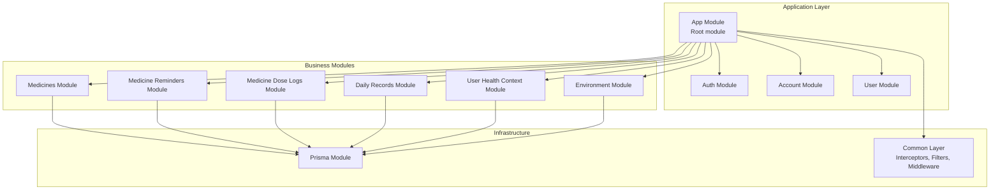
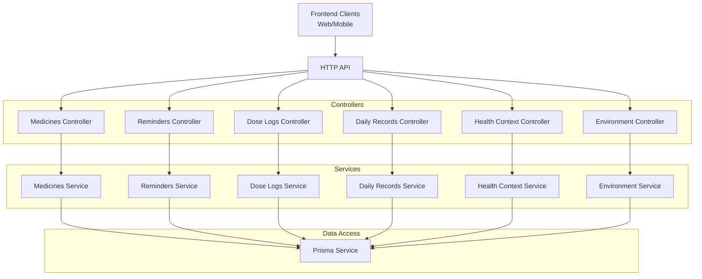
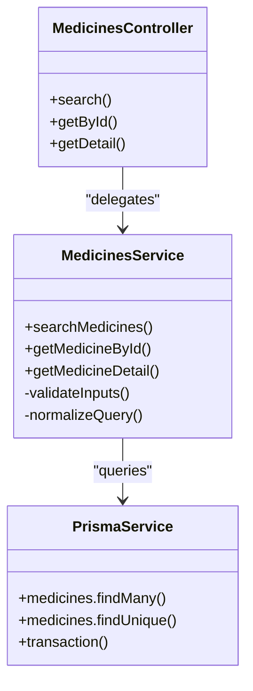
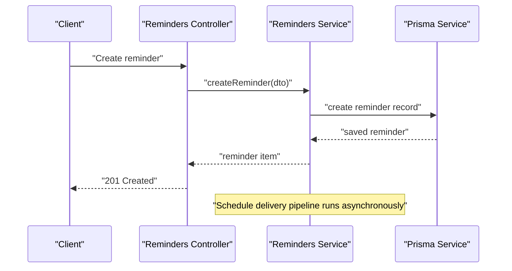
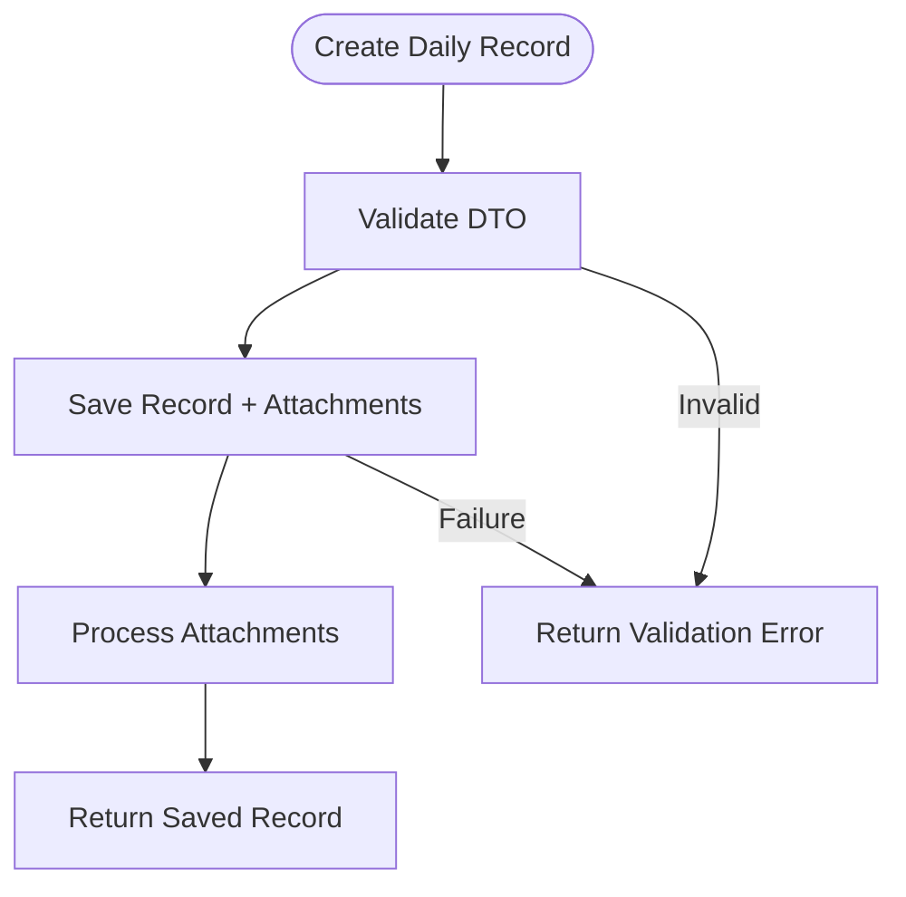
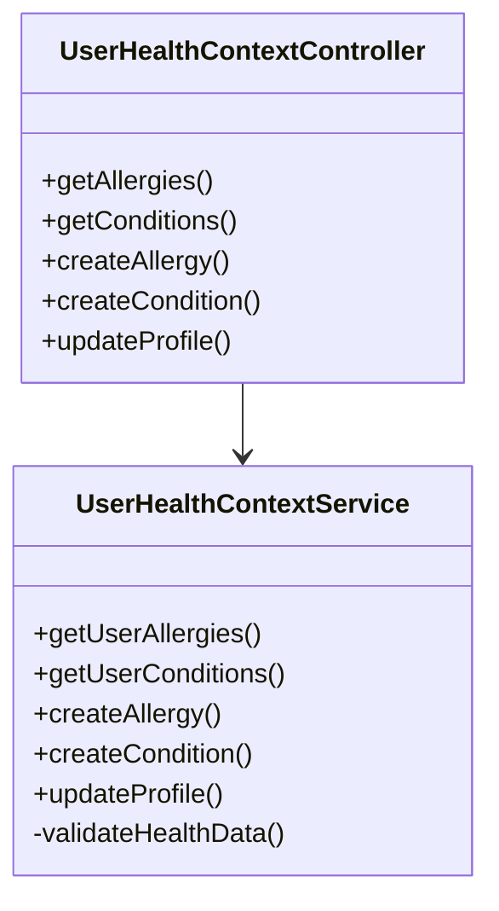
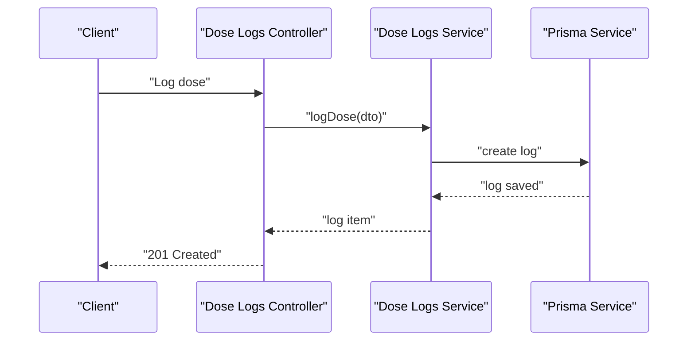
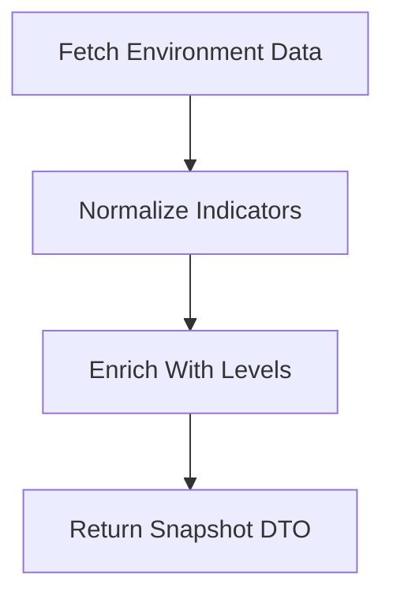
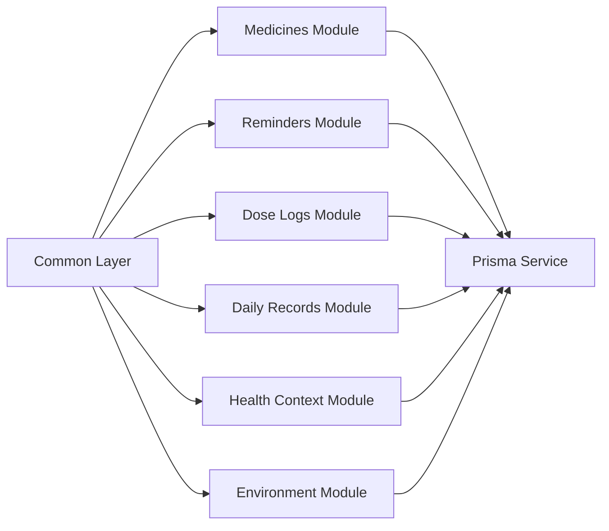

# Core Business Modules

<cite>
**Referenced Files in This Document**
- [app.module.ts](file://Lucent/src/app.module.ts)
- [medicines.module.ts](file://Lucent/src/modules/medicines/medicines.module.ts)
- [medicines.service.ts](file://Lucent/src/modules/medicines/medicines.service.ts)
- [medicines.controller.ts](file://Lucent/src/modules/medicines/medicines.controller.ts)
- [medicines.dto.ts](file://Lucent/src/modules/medicines/dto/)
- [medicine-reminders.module.ts](file://Lucent/src/modules/medicine-reminders/medicine-reminders.module.ts)
- [medicine-reminders.service.ts](file://Lucent/src/modules/medicine-reminders/medicine-reminders.service.ts)
- [medicine-reminders.controller.ts](file://Lucent/src/modules/medicine-reminders/medicine-reminders.controller.ts)
- [reminder-deliveries.controller.ts](file://Lucent/src/modules/medicine-reminders/reminder-deliveries.controller.ts)
- [daily-records.module.ts](file://Lucent/src/modules/daily-records/daily-records.module.ts)
- [daily-records.service.ts](file://Lucent/src/modules/daily-records/daily-records.service.ts)
- [daily-records.controller.ts](file://Lucent/src/modules/daily-records/daily-records.controller.ts)
- [user-health-context.module.ts](file://Lucent/src/modules/user-health-context/user-health-context.module.ts)
- [user-health-context.service.ts](file://Lucent/src/modules/user-health-context/user-health-context.service.ts)
- [user-health-context.controller.ts](file://Lucent/src/modules/user-health-context/user-health-context.controller.ts)
- [medicine-dose-logs.module.ts](file://Lucent/src/modules/medicine-dose-logs/medicine-dose-logs.module.ts)
- [medicine-dose-logs.service.ts](file://Lucent/src/modules/medicine-dose-logs/medicine-dose-logs.service.ts)
- [medicine-dose-logs.controller.ts](file://Lucent/src/modules/medicine-dose-logs/medicine-dose-logs.controller.ts)
- [environment.module.ts](file://Lucent/src/modules/environment/environment.module.ts)
- [environment.service.ts](file://Lucent/src/modules/environment/environment.service.ts)
- [environment.controller.ts](file://Lucent/src/modules/environment/environment.controller.ts)
- [prisma.module.ts](file://Lucent/src/prisma/prisma.module.ts)
- [prisma.service.ts](file://Lucent/src/prisma/prisma.service.ts)
- [api-envelope.interceptor.ts](file://Lucent/src/common/interceptors/api-envelope.interceptor.ts)
- [api-exception.filter.ts](file://Lucent/src/common/filters/api-exception.filter.ts)
- [request-id.middleware.ts](file://Lucent/src/common/middleware/request-id.middleware.ts)
- [medicines.utils.ts](file://Lucent/src/modules/medicines/medicines.utils.ts)
- [medicines.cache.ts](file://Lucent/src/modules/medicines/cache/)
- [medicines.sources.ts](file://Lucent/src/modules/medicines/sources/)
- [medicines.e2e-spec.ts](file://Lucent/test/medicines.e2e-spec.ts)
- [medicine-reminders.e2e-spec.ts](file://Lucent/test/medicine-reminders.e2e-spec.ts)
- [medicine-dose-logs.e2e-spec.ts](file://Lucent/test/medicine-dose-logs.e2e-spec.ts)
- [daily-records.e2e-spec.ts](file://Lucent/test/daily-records.e2e-spec.ts)
- [user-health-context.e2e-spec.ts](file://Lucent/test/user-health-context.e2e-spec.ts)
- [auth.e2e-spec.ts](file://Lucent/test/auth.e2e-spec.ts)
- [openapi.json](file://Lucent/docs/openapi.json)
- [environment.md](file://Lucent/docs/environment.md)
- [reminder-contract.md](file://Lucent/docs/public/reminder-contract.md)
- [data-sources.md](file://Lucent/docs/public/data-sources.md)
</cite>

## Table of Contents
1. [Introduction](#introduction)
2. [Project Structure](#project-structure)
3. [Core Components](#core-components)
4. [Architecture Overview](#architecture-overview)
5. [Detailed Component Analysis](#detailed-component-analysis)
6. [Dependency Analysis](#dependency-analysis)
7. [Performance Considerations](#performance-considerations)
8. [Troubleshooting Guide](#troubleshooting-guide)
9. [Conclusion](#conclusion)
10. [Appendices](#appendices)

## Introduction
This document describes the core business modules that define Lumos functionality. It focuses on the modular architecture pattern used across medicines management, medicine reminders, daily records, user health context, medicine dose logs, and environment monitoring. It documents the service layer implementation, controller responsibilities, and DTO patterns for each module, explains inter-module communication and data sharing, and details business rule enforcement. It also covers module-specific features such as medication interaction checking, reminder scheduling algorithms, health data visualization, and environmental monitoring, along with testing strategies, error handling, and performance considerations. Finally, it outlines the relationship between frontend features and backend services.

## Project Structure
The backend service is organized as a NestJS application with a clear module-per-feature structure. Each business domain is encapsulated in its own module containing a controller, service, and DTOs. Shared infrastructure includes Prisma integration, request envelope wrapping, exception filtering, and request ID middleware. The OpenAPI specification and domain-specific documentation support frontend integration and contract clarity.

**Diagram sources**
- [app.module.ts](file://Lucent/src/app.module.ts)
- [medicines.module.ts](file://Lucent/src/modules/medicines/medicines.module.ts)
- [medicine-reminders.module.ts](file://Lucent/src/modules/medicine-reminders/medicine-reminders.module.ts)
- [medicine-dose-logs.module.ts](file://Lucent/src/modules/medicine-dose-logs/medicine-dose-logs.module.ts)
- [daily-records.module.ts](file://Lucent/src/modules/daily-records/daily-records.module.ts)
- [user-health-context.module.ts](file://Lucent/src/modules/user-health-context/user-health-context.module.ts)
- [environment.module.ts](file://Lucent/src/modules/environment/environment.module.ts)
- [prisma.module.ts](file://Lucent/src/prisma/prisma.module.ts)

**Section sources**
- [app.module.ts](file://Lucent/src/app.module.ts)
- [prisma.module.ts](file://Lucent/src/prisma/prisma.module.ts)

## Core Components
- Prisma integration: Provides database access and transaction management across all modules via a shared Prisma module and service.
- Common infrastructure: Request envelope interceptor wraps API responses, exception filter centralizes error handling, and request ID middleware adds traceability.
- Module boundaries: Each business module exposes a controller for HTTP endpoints, a service for business logic, and a dedicated DTO package for request/response contracts.

Key responsibilities:
- Controllers: Define HTTP endpoints, apply route guards, and delegate to services.
- Services: Encapsulate domain logic, enforce business rules, coordinate data access, and manage cross-cutting concerns.
- DTOs: Define strict input/output contracts per endpoint, enabling frontend-backend alignment and automated validation.

**Section sources**
- [prisma.module.ts](file://Lucent/src/prisma/prisma.module.ts)
- [prisma.service.ts](file://Lucent/src/prisma/prisma.service.ts)
- [api-envelope.interceptor.ts](file://Lucent/src/common/interceptors/api-envelope.interceptor.ts)
- [api-exception.filter.ts](file://Lucent/src/common/filters/api-exception.filter.ts)
- [request-id.middleware.ts](file://Lucent/src/common/middleware/request-id.middleware.ts)

## Architecture Overview
The system follows a layered architecture with explicit module boundaries. Each module adheres to the typical NestJS pattern: controller → service → data access (Prisma). Cross-cutting concerns are centralized in the common layer. Inter-module communication is primarily through shared DTOs and the OpenAPI contract, ensuring frontend compatibility and predictable integrations.

**Diagram sources**
- [medicines.controller.ts](file://Lucent/src/modules/medicines/medicines.controller.ts)
- [medicine-reminders.controller.ts](file://Lucent/src/modules/medicine-reminders/medicine-reminders.controller.ts)
- [medicine-dose-logs.controller.ts](file://Lucent/src/modules/medicine-dose-logs/medicine-dose-logs.controller.ts)
- [daily-records.controller.ts](file://Lucent/src/modules/daily-records/daily-records.controller.ts)
- [user-health-context.controller.ts](file://Lucent/src/modules/user-health-context/user-health-context.controller.ts)
- [environment.controller.ts](file://Lucent/src/modules/environment/environment.controller.ts)
- [medicines.service.ts](file://Lucent/src/modules/medicines/medicines.service.ts)
- [medicine-reminders.service.ts](file://Lucent/src/modules/medicine-reminders/medicine-reminders.service.ts)
- [medicine-dose-logs.service.ts](file://Lucent/src/modules/medicine-dose-logs/medicine-dose-logs.service.ts)
- [daily-records.service.ts](file://Lucent/src/modules/daily-records/daily-records.service.ts)
- [user-health-context.service.ts](file://Lucent/src/modules/user-health-context/user-health-context.service.ts)
- [environment.service.ts](file://Lucent/src/modules/environment/environment.service.ts)
- [prisma.service.ts](file://Lucent/src/prisma/prisma.service.ts)

## Detailed Component Analysis

### Medicines Management
Responsibilities:
- Search, retrieve, and manage medicine knowledge.
- Enforce business rules around medicine identification, sources, and metadata.
- Support caching and external data source integration.

Key implementation patterns:
- Service encapsulates search and retrieval logic with Prisma access.
- DTOs define search criteria, pagination, and response shapes.
- Utilities and cache modules optimize lookup performance.
- Sources module integrates external datasets.

**Diagram sources**
- [medicines.controller.ts](file://Lucent/src/modules/medicines/medicines.controller.ts)
- [medicines.service.ts](file://Lucent/src/modules/medicines/medicines.service.ts)
- [prisma.service.ts](file://Lucent/src/prisma/prisma.service.ts)

Module-specific features:
- Medication interaction checking: Implemented in the service layer to validate potential interactions against stored knowledge.
- Data sources integration: External datasets are ingested and normalized for unified querying.
- Caching: Frequently accessed medicine entries are cached to reduce latency.

Testing strategy:
- E2E tests validate end-to-end flows for search and retrieval.
- DTO validation ensures robust input handling.

**Section sources**
- [medicines.controller.ts](file://Lucent/src/modules/medicines/medicines.controller.ts)
- [medicines.service.ts](file://Lucent/src/modules/medicines/medicines.service.ts)
- [medicines.utils.ts](file://Lucent/src/modules/medicines/medicines.utils.ts)
- [medicines.cache.ts](file://Lucent/src/modules/medicines/cache/)
- [medicines.sources.ts](file://Lucent/src/modules/medicines/sources/)
- [medicines.e2e-spec.ts](file://Lucent/test/medicines.e2e-spec.ts)

### Medicine Reminders
Responsibilities:
- Manage user-defined reminder schedules.
- Coordinate delivery notifications and adherence tracking.
- Enforce scheduling rules and recurrence patterns.

Key implementation patterns:
- Dedicated controller for reminder CRUD and listing.
- Reminder deliveries controller handles scheduled delivery events.
- Service manages scheduling algorithms, recurrence, and delivery coordination.

**Diagram sources**
- [medicine-reminders.controller.ts](file://Lucent/src/modules/medicine-reminders/medicine-reminders.controller.ts)
- [reminder-deliveries.controller.ts](file://Lucent/src/modules/medicine-reminders/reminder-deliveries.controller.ts)
- [medicine-reminders.service.ts](file://Lucent/src/modules/medicine-reminders/medicine-reminders.service.ts)
- [prisma.service.ts](file://Lucent/src/prisma/prisma.service.ts)

Module-specific features:
- Reminder scheduling algorithms: Implemented in the service to compute next delivery times, handle recurrence, and manage exceptions.
- Delivery orchestration: Separate endpoint/controller for delivering reminder events.

Testing strategy:
- E2E tests cover creation, updates, listing, and delivery flows.
- Contract documentation defines expected payload structures.

**Section sources**
- [medicine-reminders.controller.ts](file://Lucent/src/modules/medicine-reminders/medicine-reminders.controller.ts)
- [reminder-deliveries.controller.ts](file://Lucent/src/modules/medicine-reminders/reminder-deliveries.controller.ts)
- [medicine-reminders.service.ts](file://Lucent/src/modules/medicine-reminders/medicine-reminders.service.ts)
- [medicine-reminders.e2e-spec.ts](file://Lucent/test/medicine-reminders.e2e-spec.ts)
- [reminder-contract.md](file://Lucent/docs/public/reminder-contract.md)

### Daily Records
Responsibilities:
- Capture and manage daily health-related records.
- Support attachments and structured record types.
- Provide summaries and paginated listings.

Key implementation patterns:
- Controller exposes endpoints for creation, updates, listing, and image uploads.
- Service coordinates persistence and attachment handling.
- DTOs define record structures and upload contracts.

**Diagram sources**
- [daily-records.controller.ts](file://Lucent/src/modules/daily-records/daily-records.controller.ts)
- [daily-records.service.ts](file://Lucent/src/modules/daily-records/daily-records.service.ts)
- [prisma.service.ts](file://Lucent/src/prisma/prisma.service.ts)

Module-specific features:
- Health data visualization: Aggregated summaries and lists are returned via DTOs for frontend rendering.
- Image upload service: Handles media attachments for richer record content.

Testing strategy:
- E2E tests validate full lifecycle from creation to listing.
- DTO tests ensure shape and validation coverage.

**Section sources**
- [daily-records.controller.ts](file://Lucent/src/modules/daily-records/daily-records.controller.ts)
- [daily-records.service.ts](file://Lucent/src/modules/daily-records/daily-records.service.ts)
- [daily-records.e2e-spec.ts](file://Lucent/test/daily-records.e2e-spec.ts)

### User Health Context
Responsibilities:
- Maintain user health profiles, allergies, and conditions.
- Provide aggregated health summaries and structured data views.

Key implementation patterns:
- Controller manages CRUD for health context items.
- Service enforces business rules for profile completeness and data consistency.
- DTOs define health data structures and update semantics.

**Diagram sources**
- [user-health-context.controller.ts](file://Lucent/src/modules/user-health-context/user-health-context.controller.ts)
- [user-health-context.service.ts](file://Lucent/src/modules/user-health-context/user-health-context.service.ts)

Module-specific features:
- Health data visualization: Summaries and lists are exposed via dedicated DTOs for frontend dashboards.
- Profile management: Comprehensive health profile maintenance with validation.

Testing strategy:
- E2E tests cover CRUD operations and summary generation.
- DTO tests validate health data contracts.

**Section sources**
- [user-health-context.controller.ts](file://Lucent/src/modules/user-health-context/user-health-context.controller.ts)
- [user-health-context.service.ts](file://Lucent/src/modules/user-health-context/user-health-context.service.ts)
- [user-health-context.e2e-spec.ts](file://Lucent/test/user-health-context.e2e-spec.ts)

### Medicine Dose Logs
Responsibilities:
- Track individual doses taken, missed, or rescheduled.
- Enforce adherence rules and status transitions.

Key implementation patterns:
- Controller exposes endpoints for logging and querying dose history.
- Service manages status transitions and adherence analytics.
- DTOs define log creation and listing contracts.

**Diagram sources**
- [medicine-dose-logs.controller.ts](file://Lucent/src/modules/medicine-dose-logs/medicine-dose-logs.controller.ts)
- [medicine-dose-logs.service.ts](file://Lucent/src/modules/medicine-dose-logs/medicine-dose-logs.service.ts)
- [prisma.service.ts](file://Lucent/src/prisma/prisma.service.ts)

Module-specific features:
- Adherence tracking: Status modeling and analytics support adherence insights.
- Scheduling correlation: Logs align with reminder schedules for accurate reporting.

Testing strategy:
- E2E tests validate logging and listing flows.
- DTO tests ensure compliance with status and timing constraints.

**Section sources**
- [medicine-dose-logs.controller.ts](file://Lucent/src/modules/medicine-dose-logs/medicine-dose-logs.controller.ts)
- [medicine-dose-logs.service.ts](file://Lucent/src/modules/medicine-dose-logs/medicine-dose-logs.service.ts)
- [medicine-dose-logs.e2e-spec.ts](file://Lucent/test/medicine-dose-logs.e2e-spec.ts)

### Environment Monitoring
Responsibilities:
- Collect and expose environment snapshots (air quality, UV, pollen, etc.).
- Provide standardized indicators and levels for frontend visualization.

Key implementation patterns:
- Controller exposes environment snapshot endpoints.
- Service normalizes and enriches environment readings.
- DTOs define indicator structures and response envelopes.

**Diagram sources**
- [environment.controller.ts](file://Lucent/src/modules/environment/environment.controller.ts)
- [environment.service.ts](file://Lucent/src/modules/environment/environment.service.ts)

Module-specific features:
- Environmental monitoring: Structured DTOs enable frontend charts and alerts.
- Contract alignment: OpenAPI and domain docs define expected payloads.

Testing strategy:
- E2E tests validate snapshot retrieval and normalization.
- DTO tests ensure indicator and level contracts.

**Section sources**
- [environment.controller.ts](file://Lucent/src/modules/environment/environment.controller.ts)
- [environment.service.ts](file://Lucent/src/modules/environment/environment.service.ts)
- [environment.md](file://Lucent/docs/environment.md)

## Dependency Analysis
Module dependencies are intentionally decoupled, with shared Prisma access and common infrastructure. Controllers depend on services, services depend on Prisma, and DTOs are consumed by both. There is minimal cross-module coupling, reducing risk and improving maintainability.

**Diagram sources**
- [prisma.service.ts](file://Lucent/src/prisma/prisma.service.ts)
- [medicines.module.ts](file://Lucent/src/modules/medicines/medicines.module.ts)
- [medicine-reminders.module.ts](file://Lucent/src/modules/medicine-reminders/medicine-reminders.module.ts)
- [medicine-dose-logs.module.ts](file://Lucent/src/modules/medicine-dose-logs/medicine-dose-logs.module.ts)
- [daily-records.module.ts](file://Lucent/src/modules/daily-records/daily-records.module.ts)
- [user-health-context.module.ts](file://Lucent/src/modules/user-health-context/user-health-context.module.ts)
- [environment.module.ts](file://Lucent/src/modules/environment/environment.module.ts)

**Section sources**
- [prisma.module.ts](file://Lucent/src/prisma/prisma.module.ts)
- [prisma.service.ts](file://Lucent/src/prisma/prisma.service.ts)

## Performance Considerations
- Caching: Medicines module employs caching for frequent lookups to reduce database load.
- Asynchronous processing: Reminder delivery pipeline operates independently to avoid blocking request threads.
- Pagination and filtering: Listing endpoints use pagination DTOs to limit payload sizes.
- DTO validation: Early validation reduces unnecessary database round trips.
- Indexing: Prisma schema migrations define appropriate indexes for hot queries.

[No sources needed since this section provides general guidance]

## Troubleshooting Guide
- Error handling: Centralized exception filter ensures consistent error responses across modules.
- Request tracing: Request ID middleware attaches identifiers to requests for easier debugging.
- Logging: Logger module supports structured logging for audit trails and diagnostics.
- E2E tests: Comprehensive test suites help isolate issues and regressions quickly.

**Section sources**
- [api-exception.filter.ts](file://Lucent/src/common/filters/api-exception.filter.ts)
- [request-id.middleware.ts](file://Lucent/src/common/middleware/request-id.middleware.ts)
- [auth.e2e-spec.ts](file://Lucent/test/auth.e2e-spec.ts)
- [medicines.e2e-spec.ts](file://Lucent/test/medicines.e2e-spec.ts)
- [medicine-reminders.e2e-spec.ts](file://Lucent/test/medicine-reminders.e2e-spec.ts)
- [medicine-dose-logs.e2e-spec.ts](file://Lucent/test/medicine-dose-logs.e2e-spec.ts)
- [daily-records.e2e-spec.ts](file://Lucent/test/daily-records.e2e-spec.ts)
- [user-health-context.e2e-spec.ts](file://Lucent/test/user-health-context.e2e-spec.ts)

## Conclusion
The core business modules in Lumos follow a clean, modular architecture with strong separation of concerns. Each module encapsulates its domain logic behind controllers and services, with shared infrastructure providing consistent behavior across the board. DTOs and OpenAPI contracts ensure reliable frontend-backend integration, while testing strategies and error handling mechanisms support robust operation. Module-specific features like reminder scheduling, adherence tracking, and environmental monitoring are implemented with scalability and maintainability in mind.

[No sources needed since this section summarizes without analyzing specific files]

## Appendices
- Frontend-backend relationship: OpenAPI specification and domain documentation define contracts and capabilities for frontend features such as health visualization, reminder scheduling, and environment monitoring.
- Data sources: Domain documentation enumerates and describes the sources used for medicines and environment data.

**Section sources**
- [openapi.json](file://Lucent/docs/openapi.json)
- [data-sources.md](file://Lucent/docs/public/data-sources.md)
- [environment.md](file://Lucent/docs/environment.md)