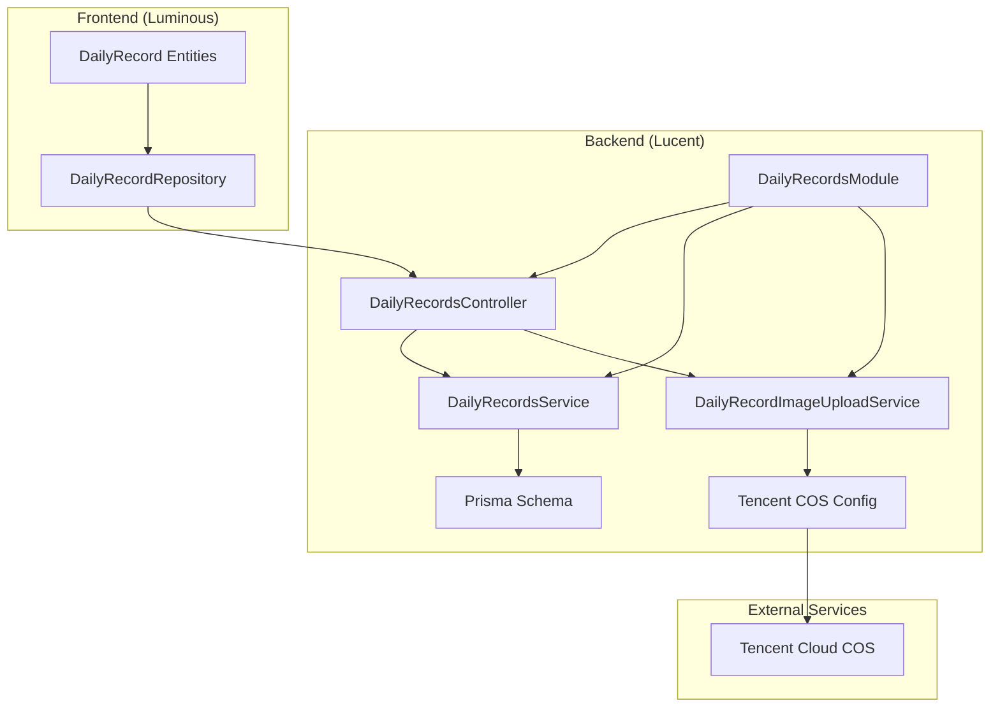
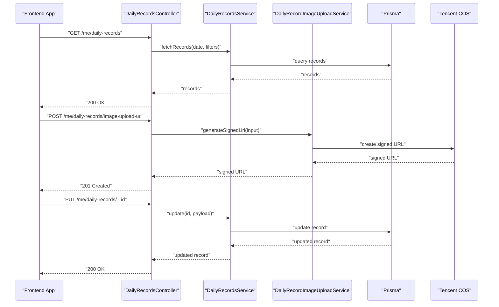
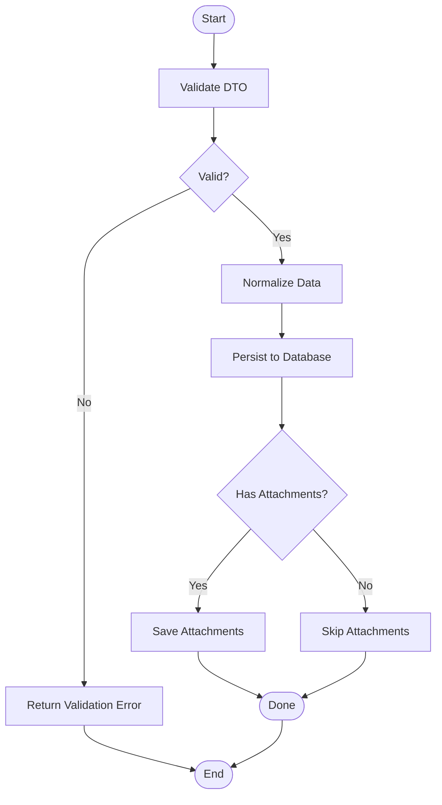
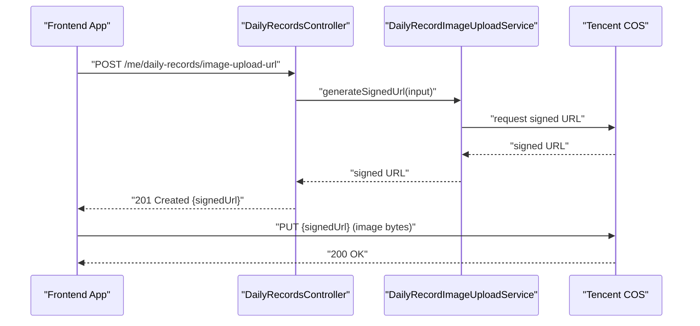
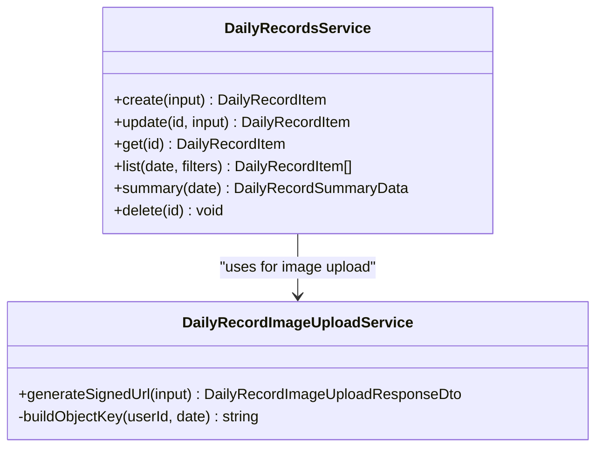
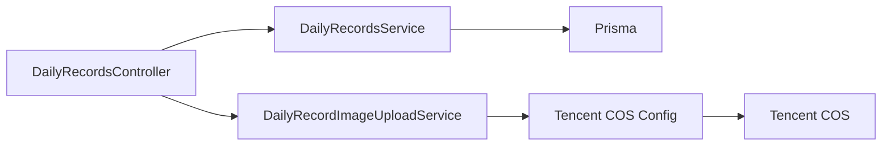
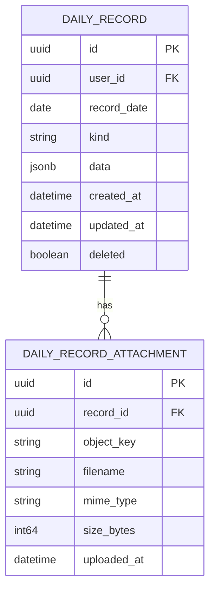

# Daily Records

<cite>
**Referenced Files in This Document**
- [daily-records.module.ts](file://Lucent/src/modules/daily-records/daily-records.module.ts)
- [daily-records.controller.ts](file://Lucent/src/modules/daily-records/daily-records.controller.ts)
- [daily-records.service.ts](file://Lucent/src/modules/daily-records/daily-records.service.ts)
- [daily-record-image-upload.service.ts](file://Lucent/src/modules/daily-records/daily-record-image-upload.service.ts)
- [create-daily-record.dto.ts](file://Lucent/src/modules/daily-records/dto/create-daily-record.dto.ts)
- [update-daily-record.dto.ts](file://Lucent/src/modules/daily-records/dto/update-daily-record.dto.ts)
- [daily-record-data.dto.ts](file://Lucent/src/modules/daily-records/dto/daily-record-data.dto.ts)
- [daily-record-attachment.dto.ts](file://Lucent/src/modules/daily-records/dto/daily-record-attachment.dto.ts)
- [daily-record-image-upload.dto.ts](file://Lucent/src/modules/daily-records/dto/daily-record-image-upload.dto.ts)
- [daily-record-attachment-input.dto.ts](file://Lucent/src/modules/daily-records/dto/daily-record-attachment-input.dto.ts)
- [tencent-cos.config.ts](file://Lucent/src/config/tencent-cos.config.ts)
- [schema.prisma](file://Lucent/prisma/schema.prisma)
- [daily-records.e2e-spec.ts](file://Lucent/test/daily-records.e2e-spec.ts)
- [daily-record_repository.dart](file://Luminous/lib/features/record/domain/repositories/daily_record_repository.dart)
- [daily_record.dart](file://Luminous/lib/features/record/domain/entities/daily_record.dart)
- [daily_record_inputs.dart](file://Luminous/lib/features/record/domain/entities/daily_record_inputs.dart)
- [openapi.json](file://Lucent/docs/openapi.json)
</cite>

## Table of Contents
1. [Introduction](#introduction)
2. [Project Structure](#project-structure)
3. [Core Components](#core-components)
4. [Architecture Overview](#architecture-overview)
5. [Detailed Component Analysis](#detailed-component-analysis)
6. [Dependency Analysis](#dependency-analysis)
7. [Performance Considerations](#performance-considerations)
8. [Troubleshooting Guide](#troubleshooting-guide)
9. [Conclusion](#conclusion)
10. [Appendices](#appendices)

## Introduction
This document describes the daily records module, a flexible health data collection system enabling users to capture, manage, and visualize personal health entries. It covers record types, attachment handling, image upload workflows, validation rules, service-layer implementation, controller endpoints, DTO patterns, and integrations with user health context and environmental monitoring. It also documents common operational concerns such as file size limits, attachment categorization, and privacy considerations.

## Project Structure
The daily records feature is implemented as a NestJS module with a dedicated controller, service, and image upload service. DTOs define request/response contracts. The backend integrates with Tencent Cloud COS for image storage via signed URLs. The frontend Flutter app interacts with the backend through generated OpenAPI clients and repositories.

**Diagram sources**
- [daily-records.module.ts](file://Lucent/src/modules/daily-records/daily-records.module.ts)
- [daily-records.controller.ts](file://Lucent/src/modules/daily-records/daily-records.controller.ts)
- [daily-records.service.ts](file://Lucent/src/modules/daily-records/daily-records.service.ts)
- [daily-record-image-upload.service.ts](file://Lucent/src/modules/daily-records/daily-record-image-upload.service.ts)
- [tencent-cos.config.ts](file://Lucent/src/config/tencent-cos.config.ts)
- [schema.prisma](file://Lucent/prisma/schema.prisma)
- [daily-record_repository.dart](file://Luminous/lib/features/record/domain/repositories/daily_record_repository.dart)

**Section sources**
- [daily-records.module.ts](file://Lucent/src/modules/daily-records/daily-records.module.ts)
- [daily-records.controller.ts](file://Lucent/src/modules/daily-records/daily-records.controller.ts)
- [daily-records.service.ts](file://Lucent/src/modules/daily-records/daily-records.service.ts)
- [daily-record-image-upload.service.ts](file://Lucent/src/modules/daily-records/daily-record-image-upload.service.ts)
- [tencent-cos.config.ts](file://Lucent/src/config/tencent-cos.config.ts)
- [schema.prisma](file://Lucent/prisma/schema.prisma)
- [daily-record_repository.dart](file://Luminous/lib/features/record/domain/repositories/daily_record_repository.dart)

## Core Components
- DailyRecordsModule: Declares dependencies and exports the module for use in the application.
- DailyRecordsController: Exposes REST endpoints for listing records, fetching summaries, retrieving individual records, creating/updating/deleting records, and obtaining signed URLs for image uploads.
- DailyRecordsService: Implements business logic for CRUD operations, data validation, and persistence via Prisma.
- DailyRecordImageUploadService: Manages image upload workflows using Tencent COS signed URLs, including path generation and URL signing.
- DTOs: Strongly typed request/response contracts for create, update, data payload, attachments, and image upload inputs.
- Prisma Schema: Defines database models for daily records and attachments, including relationships and indexes.
- Frontend Repository and Entities: Define remote data access contracts and domain entities for the Flutter app.

**Section sources**
- [daily-records.module.ts](file://Lucent/src/modules/daily-records/daily-records.module.ts)
- [daily-records.controller.ts](file://Lucent/src/modules/daily-records/daily-records.controller.ts)
- [daily-records.service.ts](file://Lucent/src/modules/daily-records/daily-records.service.ts)
- [daily-record-image-upload.service.ts](file://Lucent/src/modules/daily-records/daily-record-image-upload.service.ts)
- [create-daily-record.dto.ts](file://Lucent/src/modules/daily-records/dto/create-daily-record.dto.ts)
- [update-daily-record.dto.ts](file://Lucent/src/modules/daily-records/dto/update-daily-record.dto.ts)
- [daily-record-data.dto.ts](file://Lucent/src/modules/daily-records/dto/daily-record-data.dto.ts)
- [daily-record-attachment.dto.ts](file://Lucent/src/modules/daily-records/dto/daily-record-attachment.dto.ts)
- [daily-record-image-upload.dto.ts](file://Lucent/src/modules/daily-records/dto/daily-record-image-upload.dto.ts)
- [daily-record-attachment-input.dto.ts](file://Lucent/src/modules/daily-records/dto/daily-record-attachment-input.dto.ts)
- [schema.prisma](file://Lucent/prisma/schema.prisma)
- [daily-record_repository.dart](file://Luminous/lib/features/record/domain/repositories/daily_record_repository.dart)
- [daily_record.dart](file://Luminous/lib/features/record/domain/entities/daily_record.dart)
- [daily_record_inputs.dart](file://Luminous/lib/features/record/domain/entities/daily_record_inputs.dart)

## Architecture Overview
The system follows a layered architecture:
- Presentation Layer: REST endpoints exposed by the controller.
- Application Layer: Services encapsulate business logic and orchestrate operations.
- Persistence Layer: Prisma ORM maps DTOs to database entities.
- Integration Layer: Tencent COS integration for secure image uploads.

**Diagram sources**
- [daily-records.controller.ts](file://Lucent/src/modules/daily-records/daily-records.controller.ts)
- [daily-records.service.ts](file://Lucent/src/modules/daily-records/daily-records.service.ts)
- [daily-record-image-upload.service.ts](file://Lucent/src/modules/daily-records/daily-record-image-upload.service.ts)
- [schema.prisma](file://Lucent/prisma/schema.prisma)

## Detailed Component Analysis

### Record Types and Categories
Supported record kinds are defined in the backend DTOs and OpenAPI specification. Typical categories include:
- Symptom tracking (e.g., pain level, mood)
- Activity logging (steps, workouts)
- Sleep monitoring
- Medication adherence
- Environmental exposure (air quality, UV index)
- Notes and free-text entries

These categories guide data modeling, filtering, and visualization. The backend validates incoming kinds against allowed enumerations.

**Section sources**
- [openapi.json](file://Lucent/docs/openapi.json)
- [daily-record-data.dto.ts](file://Lucent/src/modules/daily-records/dto/daily-record-data.dto.ts)

### Record Creation and Update Workflows
Creation and update operations follow a consistent flow:
- Validation: DTOs enforce required fields and constraints.
- Normalization: Data is normalized according to record kind.
- Persistence: Prisma persists the record and related attachments.
- Response: Standardized DTOs are returned to the client.

**Diagram sources**
- [create-daily-record.dto.ts](file://Lucent/src/modules/daily-records/dto/create-daily-record.dto.ts)
- [update-daily-record.dto.ts](file://Lucent/src/modules/daily-records/dto/update-daily-record.dto.ts)
- [daily-records.service.ts](file://Lucent/src/modules/daily-records/daily-records.service.ts)
- [schema.prisma](file://Lucent/prisma/schema.prisma)

**Section sources**
- [daily-records.controller.ts](file://Lucent/src/modules/daily-records/daily-records.controller.ts)
- [daily-records.service.ts](file://Lucent/src/modules/daily-records/daily-records.service.ts)
- [create-daily-record.dto.ts](file://Lucent/src/modules/daily-records/dto/create-daily-record.dto.ts)
- [update-daily-record.dto.ts](file://Lucent/src/modules/daily-records/dto/update-daily-record.dto.ts)

### Attachment Management and Image Upload
Image upload is handled via signed URLs to Tencent COS:
- Request a signed URL from the backend.
- Upload directly to COS using the signed URL.
- Store metadata (object key, MIME type, size) in the database.
- Retrieve images via CDN URLs.

**Diagram sources**
- [daily-records.controller.ts](file://Lucent/src/modules/daily-records/daily-records.controller.ts)
- [daily-record-image-upload.service.ts](file://Lucent/src/modules/daily-records/daily-record-image-upload.service.ts)
- [daily-record-image-upload.dto.ts](file://Lucent/src/modules/daily-records/dto/daily-record-image-upload.dto.ts)
- [tencent-cos.config.ts](file://Lucent/src/config/tencent-cos.config.ts)

**Section sources**
- [daily-records.controller.ts](file://Lucent/src/modules/daily-records/daily-records.controller.ts)
- [daily-record-image-upload.service.ts](file://Lucent/src/modules/daily-records/daily-record-image-upload.service.ts)
- [daily-record-image-upload.dto.ts](file://Lucent/src/modules/daily-records/dto/daily-record-image-upload.dto.ts)
- [tencent-cos.config.ts](file://Lucent/src/config/tencent-cos.config.ts)

### Data Validation Rules
Validation is enforced at the DTO level and in service logic:
- Required fields: Date, kind, and content payload.
- Kind enumeration: Only allowed values are accepted.
- Size limits: Images must not exceed configured thresholds.
- MIME types: Only approved image types are permitted.
- Attachments: Each attachment must include a filename, MIME type, and size.

**Section sources**
- [create-daily-record.dto.ts](file://Lucent/src/modules/daily-records/dto/create-daily-record.dto.ts)
- [update-daily-record.dto.ts](file://Lucent/src/modules/daily-records/dto/update-daily-record.dto.ts)
- [daily-record-attachment-input.dto.ts](file://Lucent/src/modules/daily-records/dto/daily-record-attachment-input.dto.ts)
- [daily-record-image-upload.dto.ts](file://Lucent/src/modules/daily-records/dto/daily-record-image-upload.dto.ts)

### Service Layer Implementation
The service layer coordinates:
- Input validation and normalization.
- Prisma queries for record retrieval and updates.
- Attachment creation and linking to records.
- Integration with the image upload service for COS operations.

**Diagram sources**
- [daily-records.service.ts](file://Lucent/src/modules/daily-records/daily-records.service.ts)
- [daily-record-image-upload.service.ts](file://Lucent/src/modules/daily-records/daily-record-image-upload.service.ts)

**Section sources**
- [daily-records.service.ts](file://Lucent/src/modules/daily-records/daily-records.service.ts)
- [daily-record-image-upload.service.ts](file://Lucent/src/modules/daily-records/daily-record-image-upload.service.ts)

### Controller Endpoints
Key endpoints include:
- GET /me/daily-records: List records for a given date with optional filters.
- GET /me/daily-records/summary: Get counts grouped by kind for a date.
- GET /me/daily-records/:id: Retrieve a single record by ID.
- POST /me/daily-records: Create a new record.
- PUT /me/daily-records/:id: Update an existing record.
- DELETE /me/daily-records/:id: Soft-delete a record.
- POST /me/daily-records/image-upload-url: Obtain a signed URL for image upload.

Each endpoint is documented with operation summaries and response schemas in the OpenAPI spec.

**Section sources**
- [daily-records.controller.ts](file://Lucent/src/modules/daily-records/daily-records.controller.ts)
- [openapi.json](file://Lucent/docs/openapi.json)

### DTO Patterns
Core DTOs:
- CreateDailyRecordDto: Encapsulates kind, data payload, and optional attachments for creation.
- UpdateDailyRecordDto: Encapsulates updates to existing records.
- DailyRecordDataDto: Structured content payload per record kind.
- DailyRecordAttachmentDto: Metadata for stored attachments.
- DailyRecordAttachmentInputDto: Input for attaching files to a record.
- DailyRecordImageUploadDto: Input for requesting a signed URL.
- DailyRecordImageUploadResponseDto: Response containing the signed URL.

These DTOs ensure strong typing and consistent serialization across the API boundary.

**Section sources**
- [create-daily-record.dto.ts](file://Lucent/src/modules/daily-records/dto/create-daily-record.dto.ts)
- [update-daily-record.dto.ts](file://Lucent/src/modules/daily-records/dto/update-daily-record.dto.ts)
- [daily-record-data.dto.ts](file://Lucent/src/modules/daily-records/dto/daily-record-data.dto.ts)
- [daily-record-attachment.dto.ts](file://Lucent/src/modules/daily-records/dto/daily-record-attachment.dto.ts)
- [daily-record-attachment-input.dto.ts](file://Lucent/src/modules/daily-records/dto/daily-record-attachment-input.dto.ts)
- [daily-record-image-upload.dto.ts](file://Lucent/src/modules/daily-records/dto/daily-record-image-upload.dto.ts)
- [daily-record-image-upload.dto.ts](file://Lucent/src/modules/daily-records/dto/daily-record-image-upload.dto.ts)

### Integration with User Health Context and Environmental Monitoring
- User Health Context: The daily records module complements user health context by capturing temporal health events that inform condition/allergy profiles and medication adherence trends.
- Environmental Monitoring: Records can include environmental indicators (e.g., air quality, UV index) to correlate health outcomes with external conditions.

This integration enables richer analytics and personalized insights.

**Section sources**
- [openapi.json](file://Lucent/docs/openapi.json)

## Dependency Analysis
The module depends on:
- Prisma for data persistence.
- Tencent COS SDK for signed URL generation and image storage.
- NestJS modules for configuration and dependency injection.

**Diagram sources**
- [daily-records.controller.ts](file://Lucent/src/modules/daily-records/daily-records.controller.ts)
- [daily-records.service.ts](file://Lucent/src/modules/daily-records/daily-records.service.ts)
- [daily-record-image-upload.service.ts](file://Lucent/src/modules/daily-records/daily-record-image-upload.service.ts)
- [tencent-cos.config.ts](file://Lucent/src/config/tencent-cos.config.ts)
- [schema.prisma](file://Lucent/prisma/schema.prisma)

**Section sources**
- [daily-records.module.ts](file://Lucent/src/modules/daily-records/daily-records.module.ts)
- [daily-records.controller.ts](file://Lucent/src/modules/daily-records/daily-records.controller.ts)
- [daily-records.service.ts](file://Lucent/src/modules/daily-records/daily-records.service.ts)
- [daily-record-image-upload.service.ts](file://Lucent/src/modules/daily-records/daily-record-image-upload.service.ts)
- [tencent-cos.config.ts](file://Lucent/src/config/tencent-cos.config.ts)
- [schema.prisma](file://Lucent/prisma/schema.prisma)

## Performance Considerations
- Pagination: Use page and pageSize parameters when listing records to avoid large payloads.
- Filtering: Apply kind filters to reduce result sets.
- Image optimization: Compress images before upload to minimize bandwidth and storage costs.
- Batch operations: Prefer bulk actions where feasible to reduce round trips.
- Caching: Cache frequently accessed summaries for short intervals.

## Troubleshooting Guide
Common issues and resolutions:
- File size limits exceeded: Ensure images meet the configured maximum size; split large images or use compression.
- Invalid attachment MIME type: Confirm the file type is supported before upload.
- Signed URL expiration: Regenerate signed URLs if the previous one expires.
- Permission denied: Verify the user ID in the request matches the authenticated session.
- Duplicate object keys: The upload service generates unique keys; ensure no collisions occur in client-side logic.

**Section sources**
- [daily-record-image-upload.service.ts](file://Lucent/src/modules/daily-records/daily-record-image-upload.service.ts)
- [daily-record-image-upload.dto.ts](file://Lucent/src/modules/daily-records/dto/daily-record-image-upload.dto.ts)
- [daily-records.e2e-spec.ts](file://Lucent/test/daily-records.e2e-spec.ts)

## Conclusion
The daily records module provides a robust, extensible foundation for collecting and managing personal health data. Its modular design, strict DTO validation, and seamless integration with Tencent COS enable scalable image handling and reliable data persistence. By aligning record categories with user health context and environmental monitoring, the system supports meaningful insights and actionable health management.

## Appendices

### Database Model Overview
The Prisma schema defines the core entities for daily records and attachments, establishing relationships and constraints that underpin the module’s functionality.

**Diagram sources**
- [schema.prisma](file://Lucent/prisma/schema.prisma)

**Section sources**
- [schema.prisma](file://Lucent/prisma/schema.prisma)

### Example Workflows

- Creating a Symptom Record with an Image:
  - Client sends CreateDailyRecordDto with kind set to a symptom category and attaches an image.
  - Backend validates DTO, persists the record, and returns the created item with attachment metadata.

- Updating a Sleep Record:
  - Client sends UpdateDailyRecordDto with sleep duration and quality metrics.
  - Backend updates the record and returns the updated item.

- Uploading a New Image for an Existing Record:
  - Client requests a signed URL, uploads the image to COS, then links it to the record.

**Section sources**
- [create-daily-record.dto.ts](file://Lucent/src/modules/daily-records/dto/create-daily-record.dto.ts)
- [update-daily-record.dto.ts](file://Lucent/src/modules/daily-records/dto/update-daily-record.dto.ts)
- [daily-record-image-upload.dto.ts](file://Lucent/src/modules/daily-records/dto/daily-record-image-upload.dto.ts)
- [daily-record-image-upload.service.ts](file://Lucent/src/modules/daily-records/daily-record-image-upload.service.ts)