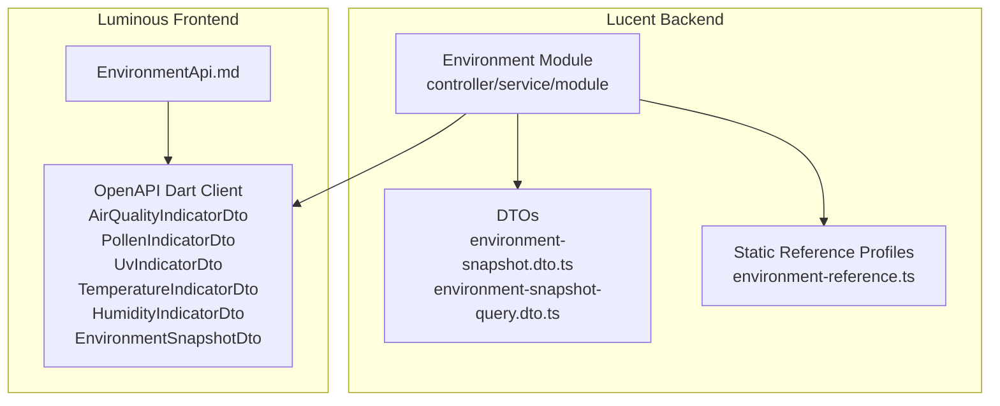
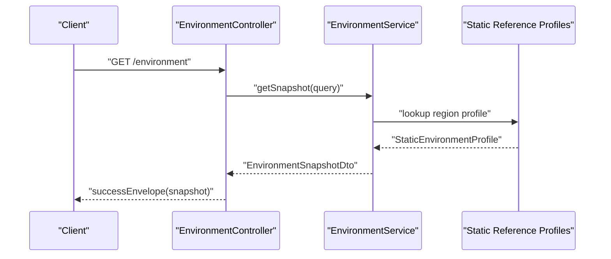
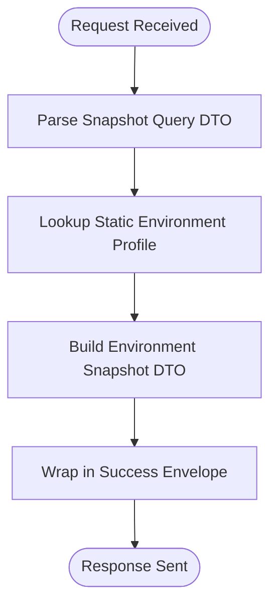
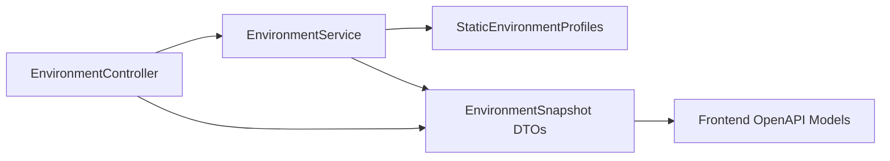

# Environment Monitoring

<cite>
**Referenced Files in This Document**
- [environment.controller.ts](file://Lucent/src/modules/environment/environment.controller.ts)
- [environment.service.ts](file://Lucent/src/modules/environment/environment.service.ts)
- [environment.module.ts](file://Lucent/src/modules/environment/environment.module.ts)
- [environment-reference.ts](file://Lucent/src/modules/environment/environment-reference.ts)
- [environment-snapshot.dto.ts](file://Lucent/src/modules/environment/dto/environment-snapshot.dto.ts)
- [environment-snapshot-query.dto.ts](file://Lucent/src/modules/environment/dto/environment-snapshot-query.dto.ts)
- [index.ts](file://Lucent/src/modules/environment/dto/index.ts)
- [environment.controller.spec.ts](file://Lucent/src/modules/environment/environment.controller.spec.ts)
- [environment.service.spec.ts](file://Lucent/src/modules/environment/environment.service.spec.ts)
- [AirQualityIndicatorDto](file://Luminous/packages/lucent_openapi/lib/src/model/air_quality_indicator_dto.dart)
- [HumidityIndicatorDto](file://Luminous/packages/lucent_openapi/lib/src/model/humidity_indicator_dto.dart)
- [TemperatureIndicatorDto](file://Luminous/packages/lucent_openapi/lib/src/model/temperature_indicator_dto.dart)
- [UvIndicatorDto](file://Luminous/packages/lucent_openapi/lib/src/model/uv_indicator_dto.dart)
- [PollenIndicatorDto](file://Luminous/packages/lucent_openapi/lib/src/model/pollen_indicator_dto.dart)
- [EnvironmentSnapshotDto](file://Luminous/packages/lucent_openapi/lib/src/model/environment_snapshot_response_dto.dart)
- [EnvironmentApi.md](file://Luminous/packages/lucent_openapi/doc/EnvironmentApi.md)
- [environment.md](file://Lucent/docs/public/environment.md)
- [openapi.json](file://Lucent/docs/openapi.json)
</cite>

## Table of Contents
1. [Introduction](#introduction)
2. [Project Structure](#project-structure)
3. [Core Components](#core-components)
4. [Architecture Overview](#architecture-overview)
5. [Detailed Component Analysis](#detailed-component-analysis)
6. [Dependency Analysis](#dependency-analysis)
7. [Performance Considerations](#performance-considerations)
8. [Troubleshooting Guide](#troubleshooting-guide)
9. [Conclusion](#conclusion)
10. [Appendices](#appendices)

## Introduction
This document describes the environment monitoring module responsible for collecting, aggregating, and exposing environmental data for personalized health recommendations. It covers:
- Environmental data collection and snapshot creation
- Air quality tracking, weather integration, and pollen count monitoring
- Data aggregation and alert generation mechanisms
- Integration with external weather services and custom alert systems
- Service layer implementation, controller endpoints, and DTO patterns
- Relationship with user health context for personalized recommendations
- Impact on health tracking and common operational concerns

## Project Structure
The environment module resides under the backend NestJS application (Lucent) and exposes a single endpoint to fetch environment snapshots. Supporting DTOs and static reference profiles are included alongside the module.

**Diagram sources**
- [environment.controller.ts:1-50](file://Lucent/src/modules/environment/environment.controller.ts#L1-L50)
- [environment.service.ts:1-120](file://Lucent/src/modules/environment/environment.service.ts#L1-L120)
- [environment-reference.ts:1-200](file://Lucent/src/modules/environment/environment-reference.ts#L1-L200)
- [environment-snapshot.dto.ts:1-120](file://Lucent/src/modules/environment/dto/environment-snapshot.dto.ts#L1-L120)
- [environment-snapshot-query.dto.ts:1-80](file://Lucent/src/modules/environment/dto/environment-snapshot-query.dto.ts#L1-L80)
- [AirQualityIndicatorDto:1-200](file://Luminous/packages/lucent_openapi/lib/src/model/air_quality_indicator_dto.dart#L1-L200)
- [PollenIndicatorDto:1-200](file://Luminous/packages/lucent_openapi/lib/src/model/pollen_indicator_dto.dart#L1-L200)
- [UvIndicatorDto:1-200](file://Luminous/packages/lucent_openapi/lib/src/model/uv_indicator_dto.dart#L1-L200)
- [TemperatureIndicatorDto:1-200](file://Luminous/packages/lucent_openapi/lib/src/model/temperature_indicator_dto.dart#L1-L200)
- [HumidityIndicatorDto:1-200](file://Luminous/packages/lucent_openapi/lib/src/model/humidity_indicator_dto.dart#L1-L200)
- [EnvironmentSnapshotDto:1-200](file://Luminous/packages/lucent_openapi/lib/src/model/environment_snapshot_response_dto.dart#L1-L200)
- [EnvironmentApi.md:1-200](file://Luminous/packages/lucent_openapi/doc/EnvironmentApi.md#L1-L200)

**Section sources**
- [environment.controller.ts:1-50](file://Lucent/src/modules/environment/environment.controller.ts#L1-L50)
- [environment.service.ts:1-120](file://Lucent/src/modules/environment/environment.service.ts#L1-L120)
- [environment.module.ts:1-20](file://Lucent/src/modules/environment/environment.module.ts#L1-L20)
- [environment-reference.ts:1-200](file://Lucent/src/modules/environment/environment-reference.ts#L1-L200)
- [environment-snapshot.dto.ts:1-120](file://Lucent/src/modules/environment/dto/environment-snapshot.dto.ts#L1-L120)
- [environment-snapshot-query.dto.ts:1-80](file://Lucent/src/modules/environment/dto/environment-snapshot-query.dto.ts#L1-L80)
- [index.ts:1-10](file://Lucent/src/modules/environment/dto/index.ts#L1-L10)
- [AirQualityIndicatorDto:1-200](file://Luminous/packages/lucent_openapi/lib/src/model/air_quality_indicator_dto.dart#L1-L200)
- [PollenIndicatorDto:1-200](file://Luminous/packages/lucent_openapi/lib/src/model/pollen_indicator_dto.dart#L1-L200)
- [UvIndicatorDto:1-200](file://Luminous/packages/lucent_openapi/lib/src/model/uv_indicator_dto.dart#L1-L200)
- [TemperatureIndicatorDto:1-200](file://Luminous/packages/lucent_openapi/lib/src/model/temperature_indicator_dto.dart#L1-L200)
- [HumidityIndicatorDto:1-200](file://Luminous/packages/lucent_openapi/lib/src/model/humidity_indicator_dto.dart#L1-L200)
- [EnvironmentSnapshotDto:1-200](file://Luminous/packages/lucent_openapi/lib/src/model/environment_snapshot_response_dto.dart#L1-L200)
- [EnvironmentApi.md:1-200](file://Luminous/packages/lucent_openapi/doc/EnvironmentApi.md#L1-L200)

## Core Components
- Environment Controller: Exposes the GET endpoint to retrieve environment snapshots.
- Environment Service: Implements snapshot retrieval logic and integrates static reference profiles.
- DTOs: Strongly typed request/response models for environment data.
- Static Reference Profiles: Built-in environment baselines per region for default/fallback scenarios.
- OpenAPI Client Models: Dart DTOs consumed by the frontend for rendering environment indicators.

Key responsibilities:
- Accept snapshot queries (e.g., region hints)
- Aggregate indicators (air quality, pollen, UV, temperature, humidity)
- Return a unified snapshot response envelope
- Support future live data integration via external weather services

**Section sources**
- [environment.controller.ts:1-50](file://Lucent/src/modules/environment/environment.controller.ts#L1-L50)
- [environment.service.ts:1-120](file://Lucent/src/modules/environment/environment.service.ts#L1-L120)
- [environment-snapshot.dto.ts:1-120](file://Lucent/src/modules/environment/dto/environment-snapshot.dto.ts#L1-L120)
- [environment-reference.ts:1-200](file://Lucent/src/modules/environment/environment-reference.ts#L1-L200)

## Architecture Overview
The environment module follows a clean separation of concerns:
- Controller handles HTTP requests and response envelopes
- Service encapsulates business logic and data aggregation
- DTOs define the contract for request/response shapes
- Static reference profiles act as the current data source
- OpenAPI-generated models enable frontend consumption

**Diagram sources**
- [environment.controller.ts:1-50](file://Lucent/src/modules/environment/environment.controller.ts#L1-L50)
- [environment.service.ts:1-120](file://Lucent/src/modules/environment/environment.service.ts#L1-L120)
- [environment-reference.ts:1-200](file://Lucent/src/modules/environment/environment-reference.ts#L1-L200)

## Detailed Component Analysis

### Environment Controller
Responsibilities:
- Define the environment endpoint
- Validate and pass query parameters to the service
- Wrap responses in a standardized envelope

Endpoint highlights:
- Path: environment
- Method: GET
- Query: snapshot query DTO
- Response: success envelope containing environment snapshot DTO

Operational notes:
- Uses NestJS Swagger metadata for documentation
- Delegates all computation to the service layer

**Section sources**
- [environment.controller.ts:1-50](file://Lucent/src/modules/environment/environment.controller.ts#L1-L50)
- [environment.controller.spec.ts:1-80](file://Lucent/src/modules/environment/environment.controller.spec.ts#L1-L80)

### Environment Service
Responsibilities:
- Resolve environment snapshot based on query
- Aggregate indicators into a unified snapshot
- Return a normalized DTO for downstream consumers

Processing logic:
- Accepts a snapshot query DTO
- Selects a static environment profile based on region hint
- Constructs an environment snapshot DTO with all indicators
- Returns the snapshot for the controller to envelope

Future extensibility:
- Can integrate live weather APIs by replacing or augmenting static lookup
- Can add alert generation based on thresholds

**Section sources**
- [environment.service.ts:1-120](file://Lucent/src/modules/environment/environment.service.ts#L1-L120)
- [environment.service.spec.ts:1-80](file://Lucent/src/modules/environment/environment.service.spec.ts#L1-L80)

### DTO Patterns
Request DTO:
- Snapshot query DTO defines the shape for incoming query parameters (e.g., region hint)

Response DTOs:
- Environment snapshot DTO aggregates all indicators
- Individual indicator DTOs: AirQualityIndicatorDto, PollenIndicatorDto, UvIndicatorDto, TemperatureIndicatorDto, HumidityIndicatorDto

Enums and constants:
- Data source types (static/live)
- Indicator levels (pollen, UV, air quality)
- Exported via DTO index for centralized imports

**Section sources**
- [environment-snapshot-query.dto.ts:1-80](file://Lucent/src/modules/environment/dto/environment-snapshot-query.dto.ts#L1-L80)
- [environment-snapshot.dto.ts:1-120](file://Lucent/src/modules/environment/dto/environment-snapshot.dto.ts#L1-L120)
- [index.ts:1-10](file://Lucent/src/modules/environment/dto/index.ts#L1-L10)

### Static Reference Profiles
Purpose:
- Provide default environment data when live sources are unavailable
- Enable immediate functionality without external integrations

Structure:
- Region-specific profiles with baseline values for pollen, UV, air quality, temperature, and humidity
- Includes region hints and primary pollen types

Usage:
- Service selects a profile based on the query
- Ensures consistent behavior across deployments

**Section sources**
- [environment-reference.ts:1-200](file://Lucent/src/modules/environment/environment-reference.ts#L1-L200)

### OpenAPI Integration (Frontend Consumption)
Frontend consumes strongly-typed DTOs generated from the OpenAPI specification:
- AirQualityIndicatorDto, PollenIndicatorDto, UvIndicatorDto, TemperatureIndicatorDto, HumidityIndicatorDto
- EnvironmentSnapshotDto for the full response
- EnvironmentApi documentation for endpoint usage

Benefits:
- Consistent contracts between backend and frontend
- Automatic client generation and validation

**Section sources**
- [AirQualityIndicatorDto:1-200](file://Luminous/packages/lucent_openapi/lib/src/model/air_quality_indicator_dto.dart#L1-L200)
- [PollenIndicatorDto:1-200](file://Luminous/packages/lucent_openapi/lib/src/model/pollen_indicator_dto.dart#L1-L200)
- [UvIndicatorDto:1-200](file://Luminous/packages/lucent_openapi/lib/src/model/uv_indicator_dto.dart#L1-L200)
- [TemperatureIndicatorDto:1-200](file://Luminous/packages/lucent_openapi/lib/src/model/temperature_indicator_dto.dart#L1-L200)
- [HumidityIndicatorDto:1-200](file://Luminous/packages/lucent_openapi/lib/src/model/humidity_indicator_dto.dart#L1-L200)
- [EnvironmentSnapshotDto:1-200](file://Luminous/packages/lucent_openapi/lib/src/model/environment_snapshot_response_dto.dart#L1-L200)
- [EnvironmentApi.md:1-200](file://Luminous/packages/lucent_openapi/doc/EnvironmentApi.md#L1-L200)

### Alert Generation Mechanisms
Current state:
- Alerts are not implemented in the environment module
- The service returns a snapshot without evaluating thresholds

Recommended approach:
- Introduce threshold checks against indicator DTOs
- Emit alerts when levels exceed predefined limits
- Integrate with existing notification systems

Impact on health tracking:
- Alerts can trigger personalized recommendations in user health context
- Enable proactive health guidance based on environmental conditions

[No sources needed since this section proposes recommendations without analyzing specific files]

### Weather Integration and Live Data
Current state:
- Data source is static reference profiles
- No live weather service integration exists

Recommended approach:
- Add a weather service adapter (e.g., OpenWeatherMap, WeatherAPI)
- Fetch current conditions and update snapshot aggregation
- Implement caching and fallback to static profiles when live data fails

[No sources needed since this section proposes recommendations without analyzing specific files]

### Air Quality Tracking
Current state:
- Air quality DTO present with AQI and primary pollutant fields
- Static baseline values provided

Recommended approach:
- Replace or augment with live AQI data
- Normalize units and levels consistently
- Apply thresholds for alerting

**Section sources**
- [environment-snapshot.dto.ts:1-120](file://Lucent/src/modules/environment/dto/environment-snapshot.dto.ts#L1-L120)
- [AirQualityIndicatorDto:1-200](file://Luminous/packages/lucent_openapi/lib/src/model/air_quality_indicator_dto.dart#L1-L200)

### Pollen Count Monitoring
Current state:
- Pollen DTO supports level, primary type, value, and unit
- Static baseline values provided

Recommended approach:
- Integrate regional pollen forecasts
- Track seasonal variations and allergen types
- Trigger alerts for sensitive individuals

**Section sources**
- [environment-snapshot.dto.ts:1-120](file://Lucent/src/modules/environment/dto/environment-snapshot.dto.ts#L1-L120)
- [PollenIndicatorDto:1-200](file://Luminous/packages/lucent_openapi/lib/src/model/pollen_indicator_dto.dart#L1-L200)

### Weather Indicators (UV, Temperature, Humidity)
Current state:
- UV, temperature, and humidity DTOs are defined
- Static baseline values provided

Recommended approach:
- Fetch live weather metrics
- Apply comfort and health thresholds
- Support personalized recommendations for activity and health

**Section sources**
- [environment-snapshot.dto.ts:1-120](file://Lucent/src/modules/environment/dto/environment-snapshot.dto.ts#L1-L120)
- [UvIndicatorDto:1-200](file://Luminous/packages/lucent_openapi/lib/src/model/uv_indicator_dto.dart#L1-L200)
- [TemperatureIndicatorDto:1-200](file://Luminous/packages/lucent_openapi/lib/src/model/temperature_indicator_dto.dart#L1-L200)
- [HumidityIndicatorDto:1-200](file://Luminous/packages/lucent_openapi/lib/src/model/humidity_indicator_dto.dart#L1-L200)

### Environment Snapshot Creation Process

**Diagram sources**
- [environment.controller.ts:1-50](file://Lucent/src/modules/environment/environment.controller.ts#L1-L50)
- [environment.service.ts:1-120](file://Lucent/src/modules/environment/environment.service.ts#L1-L120)
- [environment-reference.ts:1-200](file://Lucent/src/modules/environment/environment-reference.ts#L1-L200)

### Example Workflows

#### Retrieving an Environment Snapshot
- Endpoint: GET /environment
- Request: Snapshot query DTO (e.g., region hint)
- Response: Success envelope containing environment snapshot DTO

References:
- Controller method and route definition
- Service snapshot resolution
- DTO shapes for request/response

**Section sources**
- [environment.controller.ts:1-50](file://Lucent/src/modules/environment/environment.controller.ts#L1-L50)
- [environment.service.ts:1-120](file://Lucent/src/modules/environment/environment.service.ts#L1-L120)
- [environment-snapshot-query.dto.ts:1-80](file://Lucent/src/modules/environment/dto/environment-snapshot-query.dto.ts#L1-L80)
- [environment-snapshot.dto.ts:1-120](file://Lucent/src/modules/environment/dto/environment-snapshot.dto.ts#L1-L120)

#### Generating Alerts Based on Thresholds
- Evaluate indicator DTOs against configured thresholds
- Emit notifications for unhealthy air quality, high pollen, extreme UV
- Integrate with user health context for personalized recommendations

[No sources needed since this section proposes recommendations without analyzing specific files]

## Dependency Analysis

**Diagram sources**
- [environment.controller.ts:1-50](file://Lucent/src/modules/environment/environment.controller.ts#L1-L50)
- [environment.service.ts:1-120](file://Lucent/src/modules/environment/environment.service.ts#L1-L120)
- [environment-reference.ts:1-200](file://Lucent/src/modules/environment/environment-reference.ts#L1-L200)
- [environment-snapshot.dto.ts:1-120](file://Lucent/src/modules/environment/dto/environment-snapshot.dto.ts#L1-L120)

**Section sources**
- [environment.module.ts:1-20](file://Lucent/src/modules/environment/environment.module.ts#L1-L20)
- [environment.controller.ts:1-50](file://Lucent/src/modules/environment/environment.controller.ts#L1-L50)
- [environment.service.ts:1-120](file://Lucent/src/modules/environment/environment.service.ts#L1-L120)

## Performance Considerations
- Static profiles eliminate network latency but lack real-time accuracy
- Consider caching strategies for live weather data
- Batch requests and avoid redundant computations
- Monitor DTO serialization overhead for large responses

[No sources needed since this section provides general guidance]

## Troubleshooting Guide
Common issues and resolutions:
- Missing environment variables: Validate configuration during startup
- Unavailable live data: Fallback to static profiles transparently
- Incorrect region hints: Normalize inputs and log warnings
- DTO mismatches: Keep OpenAPI contracts synchronized between backend and frontend

**Section sources**
- [environment.controller.spec.ts:1-80](file://Lucent/src/modules/environment/environment.controller.spec.ts#L1-L80)
- [environment.service.spec.ts:1-80](file://Lucent/src/modules/environment/environment.service.spec.ts#L1-L80)

## Conclusion
The environment monitoring module currently provides a robust foundation for environment snapshot retrieval using static reference profiles. By integrating live weather services, implementing alert thresholds, and aligning with user health context, the system can evolve into a comprehensive environmental health platform that supports personalized recommendations and proactive wellness guidance.

[No sources needed since this section summarizes without analyzing specific files]

## Appendices

### API Definition Highlights
- Endpoint: GET /environment
- Query: Snapshot query DTO
- Response: Success envelope with environment snapshot DTO

**Section sources**
- [EnvironmentApi.md:1-200](file://Luminous/packages/lucent_openapi/doc/EnvironmentApi.md#L1-L200)
- [openapi.json:1-200](file://Lucent/docs/openapi.json#L1-L200)
- [environment.md:1-200](file://Lucent/docs/public/environment.md#L1-L200)