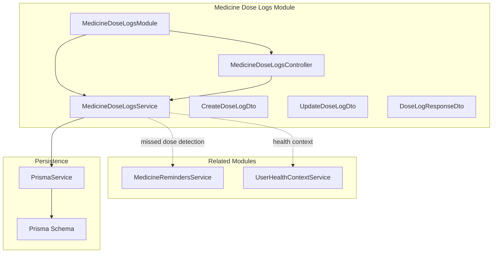
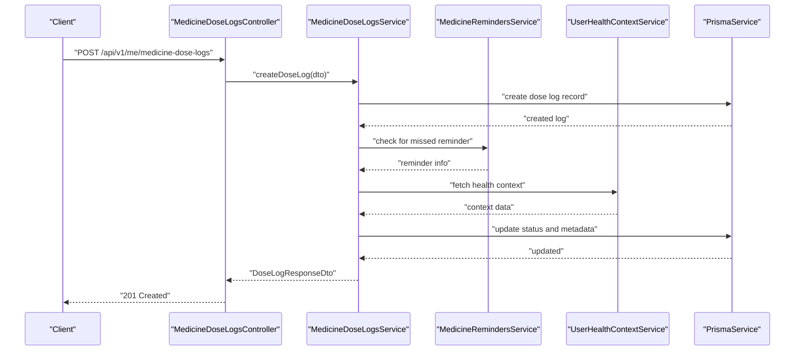
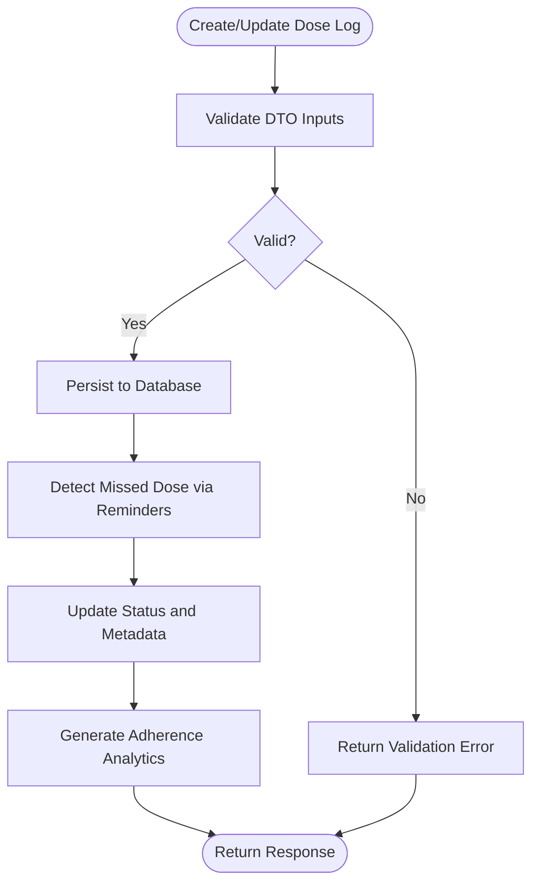
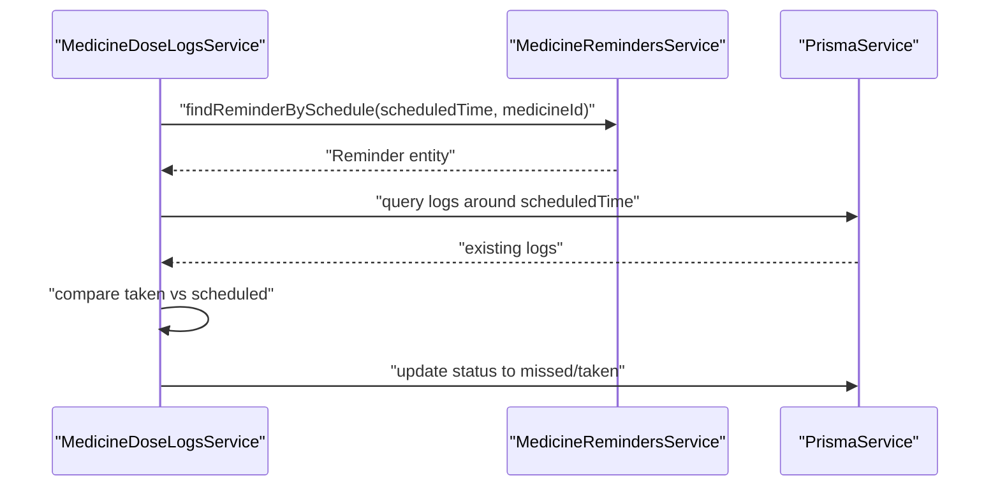
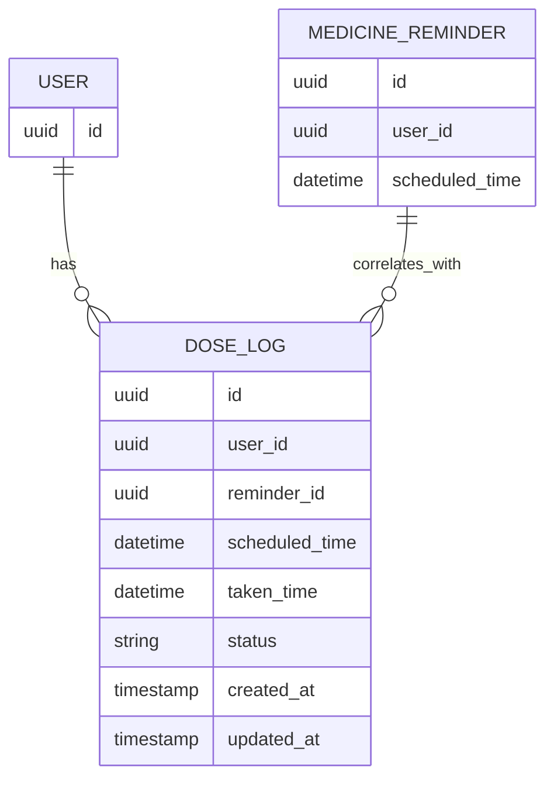
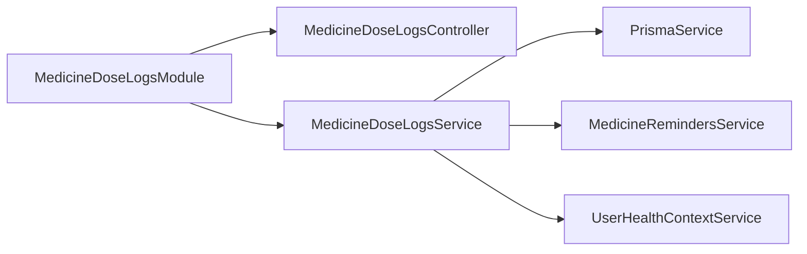

# Medicine Dose Logs

<cite>
**Referenced Files in This Document**
- [medicine-dose-logs.module.ts](file://Lucent/src/modules/medicine-dose-logs/medicine-dose-logs.module.ts)
- [medicine-dose-logs.controller.ts](file://Lucent/src/modules/medicine-dose-logs/medicine-dose-logs.controller.ts)
- [medicine-dose-logs.service.ts](file://Lucent/src/modules/medicine-dose-logs/medicine-dose-logs.service.ts)
- [create-dose-log.dto.ts](file://Lucent/src/modules/medicine-dose-logs/dto/create-dose-log.dto.ts)
- [update-dose-log.dto.ts](file://Lucent/src/modules/medicine-dose-logs/dto/update-dose-log.dto.ts)
- [dose-log-response.dto.ts](file://Lucent/src/modules/medicine-dose-logs/dto/dose-log-response.dto.ts)
- [index.ts](file://Lucent/src/modules/medicine-dose-logs/dto/index.ts)
- [medicine-reminders.service.ts](file://Lucent/src/modules/medicine-reminders/medicine-reminders.service.ts)
- [user-health-context.service.ts](file://Lucent/src/modules/user-health-context/user-health-context.service.ts)
- [prisma.service.ts](file://Lucent/src/prisma/prisma.service.ts)
- [schema.prisma](file://Lucent/prisma/schema.prisma)
- [medicine-dose-logs.e2e-spec.ts](file://Lucent/test/medicine-dose-logs.e2e-spec.ts)
- [app.module.ts](file://Lucent/src/app.module.ts)
</cite>

## Table of Contents
1. [Introduction](#introduction)
2. [Project Structure](#project-structure)
3. [Core Components](#core-components)
4. [Architecture Overview](#architecture-overview)
5. [Detailed Component Analysis](#detailed-component-analysis)
6. [Dependency Analysis](#dependency-analysis)
7. [Performance Considerations](#performance-considerations)
8. [Troubleshooting Guide](#troubleshooting-guide)
9. [Conclusion](#conclusion)

## Introduction
This document describes the medicine dose logs module responsible for tracking patient medication adherence. It covers the logging mechanisms, status management, historical record keeping, integration with reminders for missed dose detection, and reporting capabilities for healthcare providers. The module provides a service layer, controller endpoints, and DTO patterns for creating and updating dose logs, while maintaining audit trails and ensuring data integrity.

## Project Structure
The medicine dose logs module follows NestJS conventions with a dedicated module, controller, service, DTOs, and tests. It integrates with Prisma for persistence and interacts with related modules such as medicine reminders and user health context.

**Diagram sources**
- [medicine-dose-logs.module.ts](file://Lucent/src/modules/medicine-dose-logs/medicine-dose-logs.module.ts)
- [medicine-dose-logs.controller.ts](file://Lucent/src/modules/medicine-dose-logs/medicine-dose-logs.controller.ts)
- [medicine-dose-logs.service.ts](file://Lucent/src/modules/medicine-dose-logs/medicine-dose-logs.service.ts)
- [create-dose-log.dto.ts](file://Lucent/src/modules/medicine-dose-logs/dto/create-dose-log.dto.ts)
- [update-dose-log.dto.ts](file://Lucent/src/modules/medicine-dose-logs/dto/update-dose-log.dto.ts)
- [dose-log-response.dto.ts](file://Lucent/src/modules/medicine-dose-logs/dto/dose-log-response.dto.ts)
- [medicine-reminders.service.ts](file://Lucent/src/modules/medicine-reminders/medicine-reminders.service.ts)
- [user-health-context.service.ts](file://Lucent/src/modules/user-health-context/user-health-context.service.ts)
- [prisma.service.ts](file://Lucent/src/prisma/prisma.service.ts)
- [schema.prisma](file://Lucent/prisma/schema.prisma)

**Section sources**
- [medicine-dose-logs.module.ts](file://Lucent/src/modules/medicine-dose-logs/medicine-dose-logs.module.ts)
- [app.module.ts](file://Lucent/src/app.module.ts)

## Core Components
- Module: Declares and wires the controller and service.
- Controller: Exposes REST endpoints under the "me/medicine-dose-logs" path for creating, retrieving, updating, and listing dose logs.
- Service: Implements business logic for creating and updating logs, managing statuses, detecting missed doses via reminders, and generating analytics.
- DTOs: Define request/response shapes for creating, updating, and returning dose log records.
- Persistence: Uses Prisma to manage schema and queries for dose logs and related entities.

Key responsibilities:
- Logging mechanism: Create new dose logs with validated inputs and derive initial status.
- Status management: Track status transitions (e.g., scheduled, taken, missed) and maintain audit trails.
- Historical record keeping: Store timestamps, user context, and associated reminder identifiers.
- Compliance analytics: Aggregate adherence metrics for reporting to healthcare providers.
- Integration: Coordinate with reminders and health context for missed detection and contextual insights.

**Section sources**
- [medicine-dose-logs.controller.ts](file://Lucent/src/modules/medicine-dose-logs/medicine-dose-logs.controller.ts)
- [medicine-dose-logs.service.ts](file://Lucent/src/modules/medicine-dose-logs/medicine-dose-logs.service.ts)
- [create-dose-log.dto.ts](file://Lucent/src/modules/medicine-dose-logs/dto/create-dose-log.dto.ts)
- [update-dose-log.dto.ts](file://Lucent/src/modules/medicine-dose-logs/dto/update-dose-log.dto.ts)
- [dose-log-response.dto.ts](file://Lucent/src/modules/medicine-dose-logs/dto/dose-log-response.dto.ts)
- [prisma.service.ts](file://Lucent/src/prisma/prisma.service.ts)
- [schema.prisma](file://Lucent/prisma/schema.prisma)

## Architecture Overview
The module adheres to layered architecture:
- Presentation: Controller handles HTTP requests and delegates to the service.
- Application: Service orchestrates domain operations, validates inputs, and coordinates with persistence and integrations.
- Infrastructure: Prisma manages database operations and schema evolution.
- Integrations: Interacts with medicine reminders for missed detection and user health context for clinical relevance.

**Diagram sources**
- [medicine-dose-logs.controller.ts](file://Lucent/src/modules/medicine-dose-logs/medicine-dose-logs.controller.ts)
- [medicine-dose-logs.service.ts](file://Lucent/src/modules/medicine-dose-logs/medicine-dose-logs.service.ts)
- [medicine-reminders.service.ts](file://Lucent/src/modules/medicine-reminders/medicine-reminders.service.ts)
- [user-health-context.service.ts](file://Lucent/src/modules/user-health-context/user-health-context.service.ts)
- [prisma.service.ts](file://Lucent/src/prisma/prisma.service.ts)

## Detailed Component Analysis

### Service Layer Implementation
Responsibilities:
- Create new dose logs with validated inputs and set initial status.
- Detect missed doses by correlating with reminders and current time.
- Update existing logs with status changes and audit trail updates.
- Generate analytics for adherence reporting.

Processing logic highlights:
- Input validation via DTOs ensures consistent and safe creation/update.
- Status synchronization with reminders maintains accurate adherence tracking.
- Audit trail maintained through persisted timestamps and metadata.

**Diagram sources**
- [medicine-dose-logs.service.ts](file://Lucent/src/modules/medicine-dose-logs/medicine-dose-logs.service.ts)
- [create-dose-log.dto.ts](file://Lucent/src/modules/medicine-dose-logs/dto/create-dose-log.dto.ts)
- [update-dose-log.dto.ts](file://Lucent/src/modules/medicine-dose-logs/dto/update-dose-log.dto.ts)
- [prisma.service.ts](file://Lucent/src/prisma/prisma.service.ts)

**Section sources**
- [medicine-dose-logs.service.ts](file://Lucent/src/modules/medicine-dose-logs/medicine-dose-logs.service.ts)
- [prisma.service.ts](file://Lucent/src/prisma/prisma.service.ts)

### Controller Endpoints
Endpoints:
- POST /api/v1/me/medicine-dose-logs: Create a new dose log.
- GET /api/v1/me/medicine-dose-logs: List dose logs with optional filters.
- GET /api/v1/me/medicine-dose-logs/:id: Retrieve a specific dose log.
- PUT /api/v1/me/medicine-dose-logs/:id: Update an existing dose log.
- DELETE /api/v1/me/medicine-dose-logs/:id: Remove a dose log.

Notes:
- All endpoints are scoped to the authenticated user ("me").
- Responses use standardized envelopes and DTOs.

**Section sources**
- [medicine-dose-logs.controller.ts](file://Lucent/src/modules/medicine-dose-logs/medicine-dose-logs.controller.ts)
- [medicine-dose-logs.e2e-spec.ts](file://Lucent/test/medicine-dose-logs.e2e-spec.ts)

### DTO Patterns
DTOs define structured request/response contracts:
- CreateDoseLogDto: Defines fields for creating a new log (e.g., medicine identifier, scheduled time, taken time, status).
- UpdateDoseLogDto: Defines fields for updating an existing log (e.g., status, taken time, notes).
- DoseLogResponseDto: Standardized response shape for log items, including identifiers, timestamps, status, and related metadata.

Usage:
- Controllers accept DTOs as request bodies.
- Services operate on DTOs to validate and transform data.
- Responses return DTOs to clients.

**Section sources**
- [create-dose-log.dto.ts](file://Lucent/src/modules/medicine-dose-logs/dto/create-dose-log.dto.ts)
- [update-dose-log.dto.ts](file://Lucent/src/modules/medicine-dose-logs/dto/update-dose-log.dto.ts)
- [dose-log-response.dto.ts](file://Lucent/src/modules/medicine-dose-logs/dto/dose-log-response.dto.ts)
- [index.ts](file://Lucent/src/modules/medicine-dose-logs/dto/index.ts)

### Integration with Reminder System
Integration points:
- Missed dose detection: Service correlates logs with reminders to flag missed doses based on schedule and timing.
- Status synchronization: Updates log status to reflect whether the dose was taken on time or delayed.

**Diagram sources**
- [medicine-dose-logs.service.ts](file://Lucent/src/modules/medicine-dose-logs/medicine-dose-logs.service.ts)
- [medicine-reminders.service.ts](file://Lucent/src/modules/medicine-reminders/medicine-reminders.service.ts)
- [prisma.service.ts](file://Lucent/src/prisma/prisma.service.ts)

**Section sources**
- [medicine-dose-logs.service.ts](file://Lucent/src/modules/medicine-dose-logs/medicine-dose-logs.service.ts)
- [medicine-reminders.service.ts](file://Lucent/src/modules/medicine-reminders/medicine-reminders.service.ts)

### Relationship with User Health Context
The service integrates with user health context to enrich analytics and provide clinical insights:
- Fetch relevant health data to contextualize adherence patterns.
- Support reporting features for healthcare providers by correlating logs with health conditions and allergies.

**Section sources**
- [medicine-dose-logs.service.ts](file://Lucent/src/modules/medicine-dose-logs/medicine-dose-logs.service.ts)
- [user-health-context.service.ts](file://Lucent/src/modules/user-health-context/user-health-context.service.ts)

### Data Model and Persistence
Schema elements:
- Dose log entity with fields for user, medicine, scheduled time, taken time, status, and audit metadata.
- Relationships to user and reminder entities for cross-referencing.

**Diagram sources**
- [schema.prisma](file://Lucent/prisma/schema.prisma)
- [prisma.service.ts](file://Lucent/src/prisma/prisma.service.ts)

**Section sources**
- [schema.prisma](file://Lucent/prisma/schema.prisma)
- [prisma.service.ts](file://Lucent/src/prisma/prisma.service.ts)

### Examples of Workflows

#### Creating a New Dose Log
- Client sends a POST request with CreateDoseLogDto.
- Controller validates and forwards to service.
- Service persists the record and detects if it is missed based on reminders.
- Response returns DoseLogResponseDto.

#### Updating a Dose Log Status
- Client sends a PUT request with UpdateDoseLogDto.
- Controller validates and forwards to service.
- Service updates status and audit metadata.
- Response returns updated DoseLogResponseDto.

#### Generating Compliance Analytics
- Service aggregates logs by period and computes adherence rates.
- Results support reporting dashboards for healthcare providers.

**Section sources**
- [medicine-dose-logs.controller.ts](file://Lucent/src/modules/medicine-dose-logs/medicine-dose-logs.controller.ts)
- [medicine-dose-logs.service.ts](file://Lucent/src/modules/medicine-dose-logs/medicine-dose-logs.service.ts)
- [create-dose-log.dto.ts](file://Lucent/src/modules/medicine-dose-logs/dto/create-dose-log.dto.ts)
- [update-dose-log.dto.ts](file://Lucent/src/modules/medicine-dose-logs/dto/update-dose-log.dto.ts)
- [dose-log-response.dto.ts](file://Lucent/src/modules/medicine-dose-logs/dto/dose-log-response.dto.ts)

## Dependency Analysis
Module dependencies:
- MedicineDoseLogsModule depends on MedicineDoseLogsController and MedicineDoseLogsService.
- Service depends on PrismaService for persistence and integrates with MedicineRemindersService and UserHealthContextService.
- Controller depends on MedicineDoseLogsService.

**Diagram sources**
- [medicine-dose-logs.module.ts](file://Lucent/src/modules/medicine-dose-logs/medicine-dose-logs.module.ts)
- [medicine-dose-logs.controller.ts](file://Lucent/src/modules/medicine-dose-logs/medicine-dose-logs.controller.ts)
- [medicine-dose-logs.service.ts](file://Lucent/src/modules/medicine-dose-logs/medicine-dose-logs.service.ts)
- [medicine-reminders.service.ts](file://Lucent/src/modules/medicine-reminders/medicine-reminders.service.ts)
- [user-health-context.service.ts](file://Lucent/src/modules/user-health-context/user-health-context.service.ts)
- [prisma.service.ts](file://Lucent/src/prisma/prisma.service.ts)

**Section sources**
- [medicine-dose-logs.module.ts](file://Lucent/src/modules/medicine-dose-logs/medicine-dose-logs.module.ts)
- [medicine-dose-logs.controller.ts](file://Lucent/src/modules/medicine-dose-logs/medicine-dose-logs.controller.ts)
- [medicine-dose-logs.service.ts](file://Lucent/src/modules/medicine-dose-logs/medicine-dose-logs.service.ts)

## Performance Considerations
- Indexing: Ensure database indexes exist on frequently queried fields such as user_id, scheduled_time, and status to optimize filtering and analytics queries.
- Batch operations: For bulk analytics generation, consider paginated queries and efficient aggregation strategies.
- Caching: Cache static or slowly changing data like medicine metadata to reduce repeated lookups.
- Asynchronous processing: Offload heavy analytics computations to background jobs to keep API responses fast.

## Troubleshooting Guide
Common issues and resolutions:
- Duplicate logging: Implement de-duplication checks by verifying existing logs within a tolerance window around the scheduled time and preventing multiple entries for the same reminder.
- Status synchronization: Ensure status updates are atomic and consistent with reminder schedules; reconcile discrepancies periodically.
- Audit trail requirements: Maintain immutable audit logs with timestamps and user actions; expose audit endpoints for compliance reviews.
- Validation failures: Validate DTO inputs early in the controller layer and return clear error messages for malformed requests.
- Integration failures: Add retry logic and circuit breakers for reminder and health context services; monitor external dependencies.

**Section sources**
- [medicine-dose-logs.service.ts](file://Lucent/src/modules/medicine-dose-logs/medicine-dose-logs.service.ts)
- [medicine-dose-logs.controller.ts](file://Lucent/src/modules/medicine-dose-logs/medicine-dose-logs.controller.ts)
- [prisma.service.ts](file://Lucent/src/prisma/prisma.service.ts)

## Conclusion
The medicine dose logs module provides a robust foundation for tracking medication adherence, integrating with reminders for missed detection, and supporting healthcare provider reporting. Its layered architecture, strong DTO contracts, and Prisma-backed persistence enable reliable status management, historical record keeping, and compliance analytics. Proper indexing, caching, and asynchronous processing further enhance performance, while careful attention to duplicate prevention, status synchronization, and audit trails ensures data integrity and regulatory compliance.