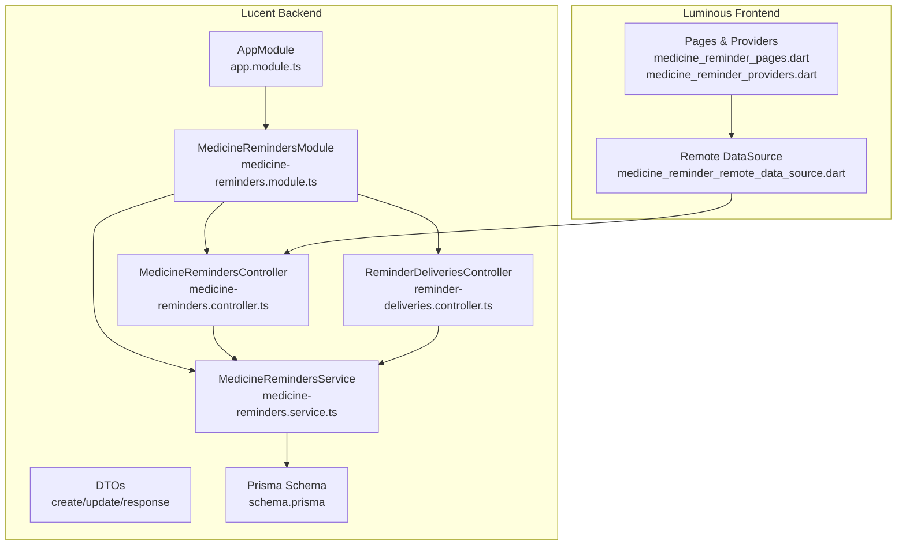
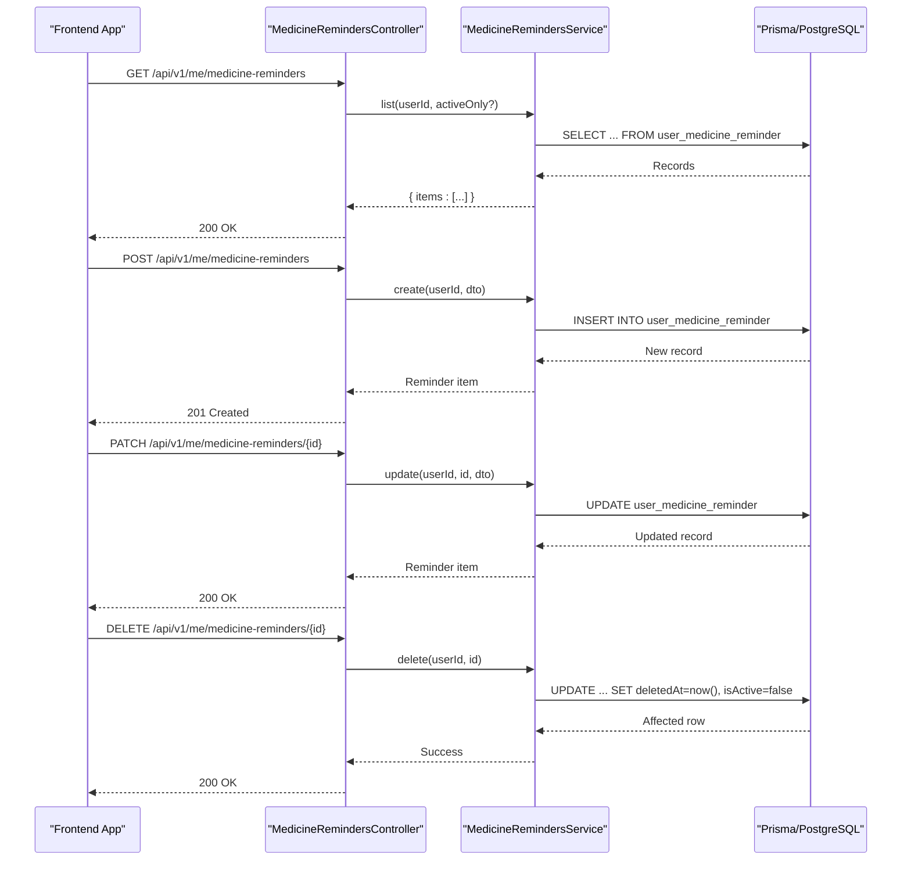
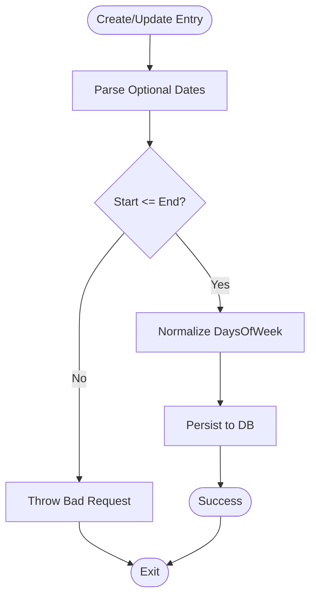
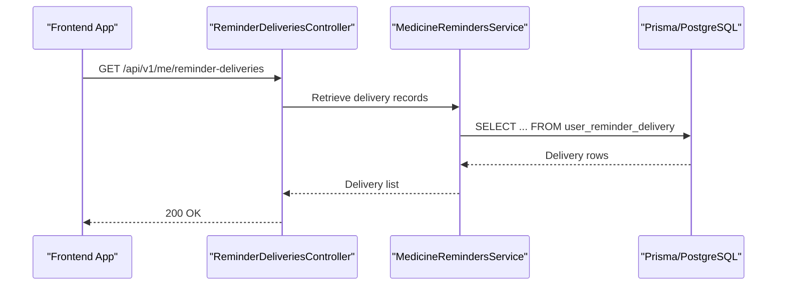
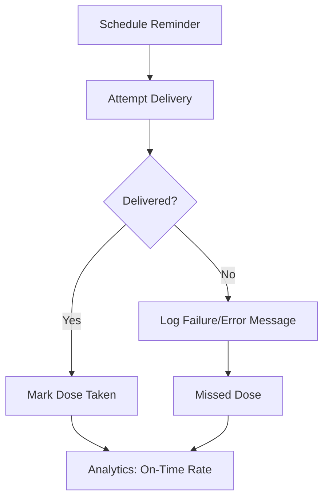
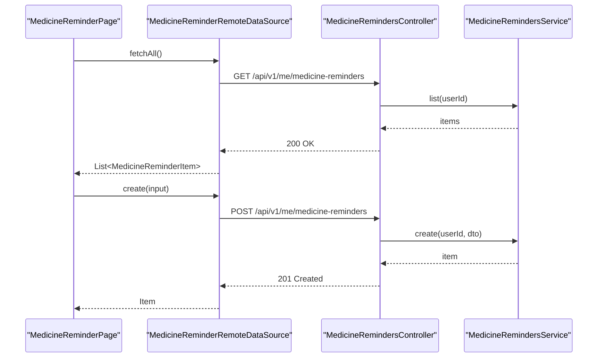
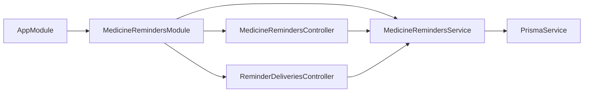
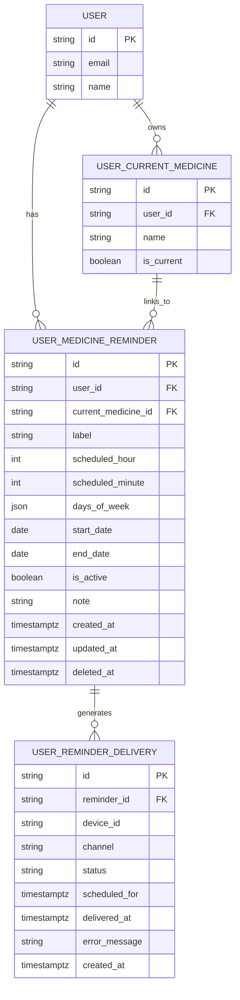

# Medicine Reminders

<cite>
**Referenced Files in This Document**
- [app.module.ts](file://Lucent/src/app.module.ts)
- [medicine-reminders.module.ts](file://Lucent/src/modules/medicine-reminders/medicine-reminders.module.ts)
- [medicine-reminders.controller.ts](file://Lucent/src/modules/medicine-reminders/medicine-reminders.controller.ts)
- [reminder-deliveries.controller.ts](file://Lucent/src/modules/medicine-reminders/reminder-deliveries.controller.ts)
- [medicine-reminders.service.ts](file://Lucent/src/modules/medicine-reminders/medicine-reminders.service.ts)
- [medicine-reminders.service.spec.ts](file://Lucent/src/modules/medicine-reminders/medicine-reminders.service.spec.ts)
- [medicine-reminder-response.dto.ts](file://Lucent/src/modules/medicine-reminders/dto/medicine-reminder-response.dto.ts)
- [create-medicine-reminder.dto.ts](file://Lucent/src/modules/medicine-reminders/dto/create-medicine-reminder.dto.ts)
- [update-medicine-reminder.dto.ts](file://Lucent/src/modules/medicine-reminders/dto/update-medicine-reminder.dto.ts)
- [reminder-delivery-response.dto.ts](file://Lucent/src/modules/medicine-reminders/dto/reminder-delivery-response.dto.ts)
- [schema.prisma](file://Lucent/prisma/schema.prisma)
- [medicine-reminders.e2e-spec.ts](file://Lucent/test/medicine-reminders.e2e-spec.ts)
- [medicines.service.ts](file://Lucent/src/modules/medicines/medicines.service.ts)
- [medicines.controller.ts](file://Lucent/src/modules/medicines/medicines.controller.ts)
- [medicine_reminder_remote_data_source.dart](file://Luminous/lib/features/medicine/data/datasources/medicine_reminder_remote_data_source.dart)
- [medicine_reminder_pages_test.dart](file://Luminous/test/medicine_reminder_pages_test.dart)
- [medicine_reminder_pages.dart](file://Luminous/lib/features/medicine/presentation/pages/medicine_reminder_pages.dart)
- [medicine_reminder_providers.dart](file://Luminous/lib/features/medicine/presentation/providers/medicine_reminder_providers.dart)
- [MedicineRemindersApi.md](file://Luminous/packages/lucent_openapi/doc/MedicineRemindersApi.md)
- [2026-06-09.md](file://Luminous/docs/migration-log/2026-06-09.md)
</cite>

## Table of Contents
1. [Introduction](#introduction)
2. [Project Structure](#project-structure)
3. [Core Components](#core-components)
4. [Architecture Overview](#architecture-overview)
5. [Detailed Component Analysis](#detailed-component-analysis)
6. [Dependency Analysis](#dependency-analysis)
7. [Performance Considerations](#performance-considerations)
8. [Troubleshooting Guide](#troubleshooting-guide)
9. [Conclusion](#conclusion)
10. [Appendices](#appendices)

## Introduction
This document explains the medicine reminders module in the Lumos project. It covers the reminder scheduling system, delivery management, and missed dose handling. It documents reminder creation and update processes, delivery channel management, analytics reporting, integration with notification systems, and the reminder delivery controller functionality. It also explains relationships with the medicines module and user preferences, and addresses common issues such as timezone handling, delivery failures, and reminder customization options.

## Project Structure
The medicine reminders feature spans the backend NestJS module and the frontend Flutter app:
- Backend: NestJS module under Lucent/src/modules/medicine-reminders with controllers, service, DTOs, and database model via Prisma.
- Frontend: Flutter app under Luminous with remote data source, pages, providers, and UI flows for reminders.

**Diagram sources**
- [app.module.ts:1-30](file://Lucent/src/app.module.ts#L1-L30)
- [medicine-reminders.module.ts:1-20](file://Lucent/src/modules/medicine-reminders/medicine-reminders.module.ts#L1-L20)
- [medicine-reminders.controller.ts:1-120](file://Lucent/src/modules/medicine-reminders/medicine-reminders.controller.ts#L1-L120)
- [reminder-deliveries.controller.ts:1-60](file://Lucent/src/modules/medicine-reminders/reminder-deliveries.controller.ts#L1-L60)
- [medicine-reminders.service.ts:1-280](file://Lucent/src/modules/medicine-reminders/medicine-reminders.service.ts#L1-L280)
- [schema.prisma:279-296](file://Lucent/prisma/schema.prisma#L279-L296)
- [medicine_reminder_remote_data_source.dart:151-177](file://Luminous/lib/features/medicine/data/datasources/medicine_reminder_remote_data_source.dart#L151-L177)
- [medicine_reminder_pages.dart:50-96](file://Luminous/lib/features/medicine/presentation/pages/medicine_reminder_pages.dart#L50-L96)
- [medicine_reminder_providers.dart:67-114](file://Luminous/lib/features/medicine/presentation/providers/medicine_reminder_providers.dart#L67-L114)

**Section sources**
- [app.module.ts:1-30](file://Lucent/src/app.module.ts#L1-L30)
- [medicine-reminders.module.ts:1-20](file://Lucent/src/modules/medicine-reminders/medicine-reminders.module.ts#L1-L20)
- [schema.prisma:279-296](file://Lucent/prisma/schema.prisma#L279-L296)

## Core Components
- Controllers
  - MedicineRemindersController: exposes endpoints for listing, creating, updating, and soft-deleting reminders.
  - ReminderDeliveriesController: exposes endpoints for retrieving reminder delivery records.
- Service
  - MedicineRemindersService: orchestrates persistence, ownership checks, date window validation, normalization, and soft-deletion.
- DTOs
  - Create/Update/Response DTOs define the contract for reminder creation, updates, and responses.
  - ReminderDeliveryResponse DTO defines the delivery record structure.
- Database Model
  - UserMedicineReminder and related delivery records are defined in Prisma schema.

Key responsibilities:
- Scheduling: scheduledHour/scheduledMinute, daysOfWeek, optional start/end dates.
- Delivery: channels, statuses, scheduledFor, deliveredAt, error messages.
- Ownership: ensures reminders belong to the requesting user.
- Soft deletion: marks reminders as deleted and deactivates them.

**Section sources**
- [medicine-reminders.controller.ts:32-90](file://Lucent/src/modules/medicine-reminders/medicine-reminders.controller.ts#L32-L90)
- [reminder-deliveries.controller.ts:1-60](file://Lucent/src/modules/medicine-reminders/reminder-deliveries.controller.ts#L1-L60)
- [medicine-reminders.service.ts:45-87](file://Lucent/src/modules/medicine-reminders/medicine-reminders.service.ts#L45-L87)
- [medicine-reminder-response.dto.ts:1-50](file://Lucent/src/modules/medicine-reminders/dto/medicine-reminder-response.dto.ts#L1-L50)
- [reminder-delivery-response.dto.ts:1-40](file://Lucent/src/modules/medicine-reminders/dto/reminder-delivery-response.dto.ts#L1-L40)
- [schema.prisma:279-296](file://Lucent/prisma/schema.prisma#L279-L296)

## Architecture Overview
The reminder system follows a layered architecture:
- Presentation: Controllers expose REST endpoints.
- Application: Service encapsulates business logic.
- Persistence: Prisma ORM maps to PostgreSQL.
- Integration: Frontend communicates via HTTP to backend endpoints.

**Diagram sources**
- [medicine-reminders.controller.ts:32-90](file://Lucent/src/modules/medicine-reminders/medicine-reminders.controller.ts#L32-L90)
- [medicine-reminders.service.ts:45-87](file://Lucent/src/modules/medicine-reminders/medicine-reminders.service.ts#L45-L87)
- [medicine-reminders.e2e-spec.ts:251-297](file://Lucent/test/medicine-reminders.e2e-spec.ts#L251-L297)

## Detailed Component Analysis

### Reminder Creation and Update Processes
- Creation
  - Validates ownership of linked current medicine (if present).
  - Parses and validates optional start/end dates.
  - Normalizes daysOfWeek (null means every day).
  - Inserts reminder with defaults for isActive and timestamps.
- Update
  - Ensures the reminder belongs to the user.
  - Applies partial updates via UpdateMedicineReminderDto.
  - Re-validates date window if applicable.
- Deletion
  - Soft-deletes by setting deletedAt and deactivating reminder.

**Diagram sources**
- [medicine-reminders.service.ts:62-87](file://Lucent/src/modules/medicine-reminders/medicine-reminders.service.ts#L62-L87)
- [medicine-reminders.service.ts:89-115](file://Lucent/src/modules/medicine-reminders/medicine-reminders.service.ts#L89-L115)
- [medicine-reminders.service.spec.ts:228-237](file://Lucent/src/modules/medicine-reminders/medicine-reminders.service.spec.ts#L228-L237)

**Section sources**
- [medicine-reminders.service.ts:62-115](file://Lucent/src/modules/medicine-reminders/medicine-reminders.service.ts#L62-L115)
- [medicine-reminders.service.spec.ts:228-237](file://Lucent/src/modules/medicine-reminders/medicine-reminders.service.spec.ts#L228-L237)
- [medicine-reminders.e2e-spec.ts:251-297](file://Lucent/test/medicine-reminders.e2e-spec.ts#L251-L297)

### Reminder Delivery Controller and Analytics
- Endpoint exposure
  - ReminderDeliveriesController provides retrieval of delivery records associated with reminders.
- Delivery record fields
  - Includes channel, status, scheduledFor, deliveredAt, and error messages for diagnostics.
- Analytics reporting
  - Delivery records enable reporting on on-time vs delayed deliveries, channel effectiveness, and user engagement.

**Diagram sources**
- [reminder-deliveries.controller.ts:1-60](file://Lucent/src/modules/medicine-reminders/reminder-deliveries.controller.ts#L1-L60)
- [reminder-delivery-response.dto.ts:1-40](file://Lucent/src/modules/medicine-reminders/dto/reminder-delivery-response.dto.ts#L1-L40)

**Section sources**
- [reminder-deliveries.controller.ts:1-60](file://Lucent/src/modules/medicine-reminders/reminder-deliveries.controller.ts#L1-L60)
- [reminder-delivery-response.dto.ts:1-40](file://Lucent/src/modules/medicine-reminders/dto/reminder-delivery-response.dto.ts#L1-L40)

### Delivery Channel Management and Missed Dose Handling
- Channels and statuses
  - Channel indicates delivery method (e.g., push notifications).
  - Status tracks delivery lifecycle (e.g., scheduled, delivered, failed).
  - scheduledFor and deliveredAt track timing.
  - errorMessage captures failure reasons for diagnostics.
- Missed doses
  - Missed reminders can be inferred from lack of deliveredAt within expected time windows.
  - UI supports marking doses as taken and associating with reminders.

**Diagram sources**
- [reminder-delivery-response.dto.ts:1-40](file://Lucent/src/modules/medicine-reminders/dto/reminder-delivery-response.dto.ts#L1-L40)
- [medicine_reminder_remote_data_source.dart:151-177](file://Luminous/lib/features/medicine/data/datasources/medicine_reminder_remote_data_source.dart#L151-L177)

**Section sources**
- [reminder-delivery-response.dto.ts:1-40](file://Lucent/src/modules/medicine-reminders/dto/reminder-delivery-response.dto.ts#L1-L40)
- [medicine_reminder_remote_data_source.dart:151-177](file://Luminous/lib/features/medicine/data/datasources/medicine_reminder_remote_data_source.dart#L151-L177)

### Integration with Notification Systems
- Frontend integration
  - Remote data source performs HTTP requests to backend endpoints for CRUD operations.
  - Pages and providers coordinate UI state and user interactions.
- Backend integration
  - Controllers accept and return DTOs aligned with OpenAPI models.
  - Service persists reminders and delivery records.

**Diagram sources**
- [medicine_reminder_remote_data_source.dart:151-177](file://Luminous/lib/features/medicine/data/datasources/medicine_reminder_remote_data_source.dart#L151-L177)
- [medicine_reminder_pages.dart:50-96](file://Luminous/lib/features/medicine/presentation/pages/medicine_reminder_pages.dart#L50-L96)
- [MedicineRemindersApi.md:161-183](file://Luminous/packages/lucent_openapi/doc/MedicineRemindersApi.md#L161-L183)

**Section sources**
- [medicine_reminder_remote_data_source.dart:151-177](file://Luminous/lib/features/medicine/data/datasources/medicine_reminder_remote_data_source.dart#L151-L177)
- [medicine_reminder_pages.dart:50-96](file://Luminous/lib/features/medicine/presentation/pages/medicine_reminder_pages.dart#L50-L96)
- [MedicineRemindersApi.md:161-183](file://Luminous/packages/lucent_openapi/doc/MedicineRemindersApi.md#L161-L183)

### Reminder Setup Examples and Scheduling Patterns
- Example: Daily reminder at 08:00 with no weekday filter.
- Example: Multiple times per day (e.g., 08:00 and 20:00) for the same medicine.
- Example: Schedule-only reminders grouped by current medicine in the UI.
- Example: Start/end date windows to limit active periods.

These patterns are supported by:
- scheduledHour/scheduledMinute for time-of-day.
- daysOfWeek as array or null for recurring patterns.
- startDate/endDate for temporal bounds.

**Section sources**
- [medicine-reminder-response.dto.ts:13-37](file://Lucent/src/modules/medicine-reminders/dto/medicine-reminder-response.dto.ts#L13-L37)
- [2026-06-09.md:34-42](file://Luminous/docs/migration-log/2026-06-09.md#L34-L42)
- [medicine_reminder_pages_test.dart:73-102](file://Luminous/test/medicine_reminder_pages_test.dart#L73-L102)

### Relationship with Medicines Module and User Preferences
- Ownership linkage
  - Reminders can optionally link to a current medicine; creation/update validates ownership.
- User preferences
  - isActive flag controls whether a reminder is considered active.
  - note field allows user-provided context.
- UI grouping
  - The UI groups multiple reminder times by current medicine for editing.

**Section sources**
- [medicine-reminders.service.ts:62-87](file://Lucent/src/modules/medicine-reminders/medicine-reminders.service.ts#L62-L87)
- [medicine-reminders.service.ts:89-115](file://Lucent/src/modules/medicine-reminders/medicine-reminders.service.ts#L89-L115)
- [2026-06-09.md:34-42](file://Luminous/docs/migration-log/2026-06-09.md#L34-L42)

## Dependency Analysis
- Module wiring
  - AppModule imports MedicineRemindersModule.
  - MedicineRemindersModule declares controllers and service.
- Internal dependencies
  - Controllers depend on MedicineRemindersService.
  - Service depends on PrismaService and handles ownership and validation.
- External dependencies
  - Frontend uses HTTP client to call backend endpoints.
  - OpenAPI models define DTO contracts.

**Diagram sources**
- [app.module.ts:1-30](file://Lucent/src/app.module.ts#L1-L30)
- [medicine-reminders.module.ts:1-20](file://Lucent/src/modules/medicine-reminders/medicine-reminders.module.ts#L1-L20)
- [medicine-reminders.controller.ts:29-35](file://Lucent/src/modules/medicine-reminders/medicine-reminders.controller.ts#L29-L35)
- [reminder-deliveries.controller.ts:13-15](file://Lucent/src/modules/medicine-reminders/reminder-deliveries.controller.ts#L13-L15)
- [medicine-reminders.service.ts:42-43](file://Lucent/src/modules/medicine-reminders/medicine-reminders.service.ts#L42-L43)

**Section sources**
- [app.module.ts:1-30](file://Lucent/src/app.module.ts#L1-L30)
- [medicine-reminders.module.ts:1-20](file://Lucent/src/modules/medicine-reminders/medicine-reminders.module.ts#L1-L20)
- [medicine-reminders.controller.ts:29-35](file://Lucent/src/modules/medicine-reminders/medicine-reminders.controller.ts#L29-L35)
- [reminder-deliveries.controller.ts:13-15](file://Lucent/src/modules/medicine-reminders/reminder-deliveries.controller.ts#L13-L15)
- [medicine-reminders.service.ts:42-43](file://Lucent/src/modules/medicine-reminders/medicine-reminders.service.ts#L42-L43)

## Performance Considerations
- Indexing and ordering
  - Queries order by scheduledHour, scheduledMinute, and createdAt to optimize UI presentation.
- Soft deletion
  - Soft deletes avoid costly cascading operations and keep historical analytics intact.
- DTO normalization
  - Normalization of daysOfWeek reduces variability and simplifies downstream logic.
- Pagination and filtering
  - Consider adding pagination for large reminder lists and filtering by activeOnly for performance.

[No sources needed since this section provides general guidance]

## Troubleshooting Guide
Common issues and resolutions:
- Ownership errors
  - Creating or updating a reminder linked to a current medicine requires ownership; otherwise, a not-found error is raised.
- Date window validation
  - End date must not precede start date; otherwise, a bad request is returned.
- Soft deletion behavior
  - After deletion, reminders are hidden from normal lists and marked inactive.
- Delivery failures
  - Review delivery records for errorMessage and status to diagnose failures.
- UI synchronization
  - Ensure frontend CRUD operations align with backend DTOs and endpoint contracts.

**Section sources**
- [medicine-reminders.service.ts:250-280](file://Lucent/src/modules/medicine-reminders/medicine-reminders.service.ts#L250-L280)
- [medicine-reminders.service.spec.ts:228-237](file://Lucent/src/modules/medicine-reminders/medicine-reminders.service.spec.ts#L228-L237)
- [medicine-reminders.e2e-spec.ts:265-297](file://Lucent/test/medicine-reminders.e2e-spec.ts#L265-L297)
- [reminder-delivery-response.dto.ts:1-40](file://Lucent/src/modules/medicine-reminders/dto/reminder-delivery-response.dto.ts#L1-L40)

## Conclusion
The medicine reminders module provides a robust, user-centric system for managing medication schedules. It integrates cleanly with the medicines module, supports flexible scheduling patterns, and offers delivery tracking and analytics. The backend enforces ownership and validation, while the frontend enables intuitive reminder management and dose logging.

[No sources needed since this section summarizes without analyzing specific files]

## Appendices

### API Endpoints and DTO Contracts
- Endpoints
  - GET /api/v1/me/medicine-reminders
  - POST /api/v1/me/medicine-reminders
  - PATCH /api/v1/me/medicine-reminders/{id}
  - DELETE /api/v1/me/medicine-reminders/{id}
  - GET /api/v1/me/reminder-deliveries
- DTOs
  - CreateMedicineReminderDto
  - UpdateMedicineReminderDto
  - MedicineReminderResponseDto
  - ReminderDeliveryResponseDto

**Section sources**
- [MedicineRemindersApi.md:161-183](file://Luminous/packages/lucent_openapi/doc/MedicineRemindersApi.md#L161-L183)
- [create-medicine-reminder.dto.ts:1-200](file://Lucent/src/modules/medicine-reminders/dto/create-medicine-reminder.dto.ts#L1-L200)
- [update-medicine-reminder.dto.ts:1-120](file://Lucent/src/modules/medicine-reminders/dto/update-medicine-reminder.dto.ts#L1-L120)
- [medicine-reminder-response.dto.ts:1-50](file://Lucent/src/modules/medicine-reminders/dto/medicine-reminder-response.dto.ts#L1-L50)
- [reminder-delivery-response.dto.ts:1-40](file://Lucent/src/modules/medicine-reminders/dto/reminder-delivery-response.dto.ts#L1-L40)

### Database Model Overview

**Diagram sources**
- [schema.prisma:279-296](file://Lucent/prisma/schema.prisma#L279-L296)