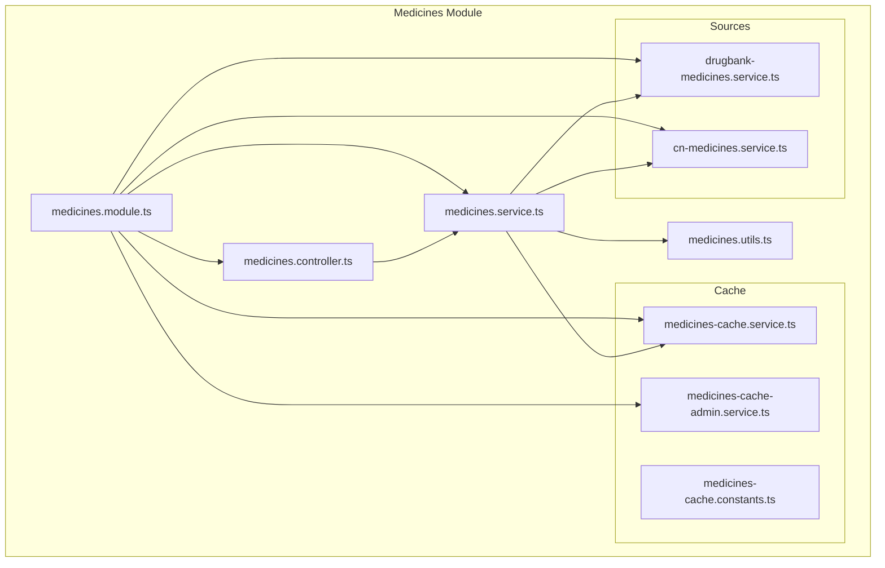
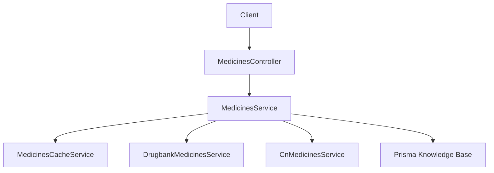
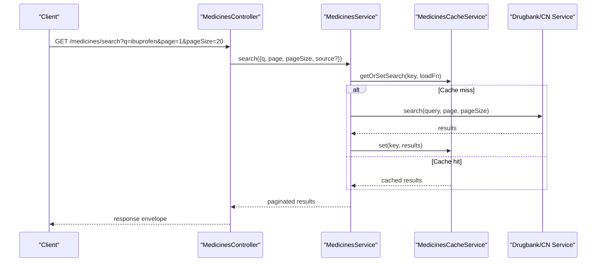
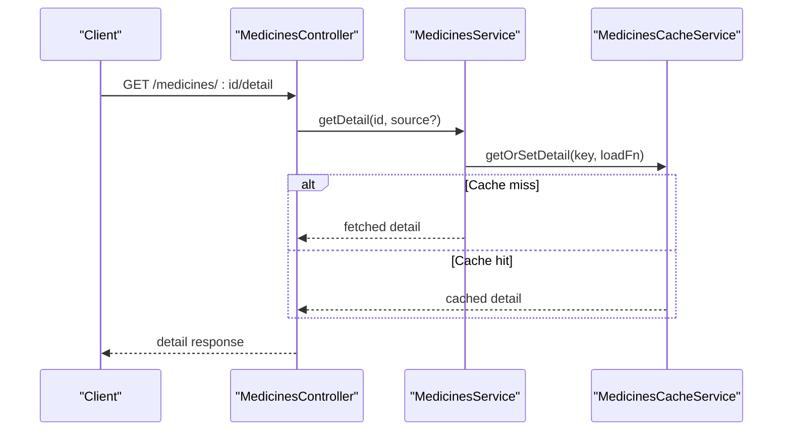
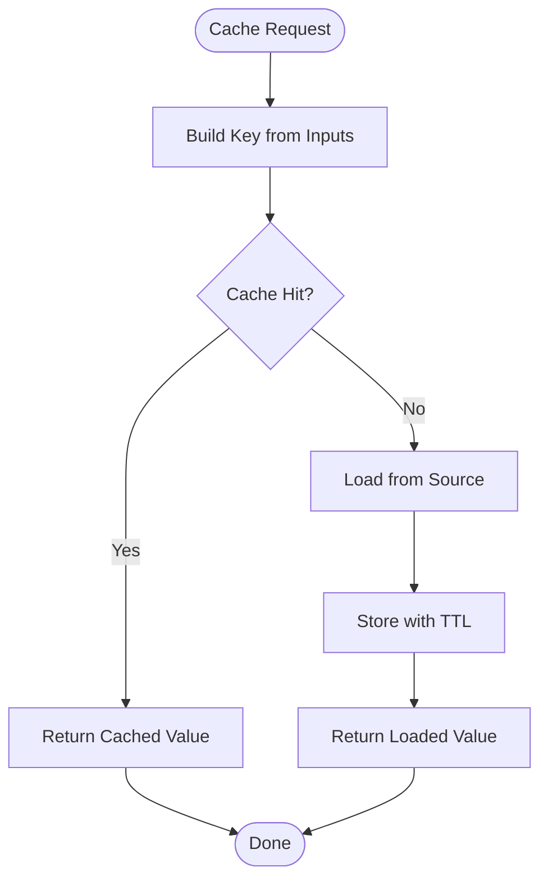
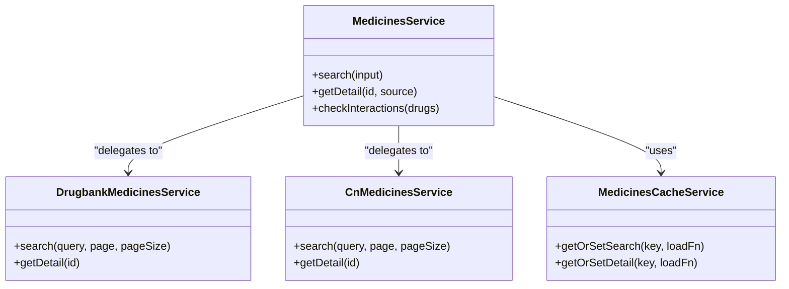
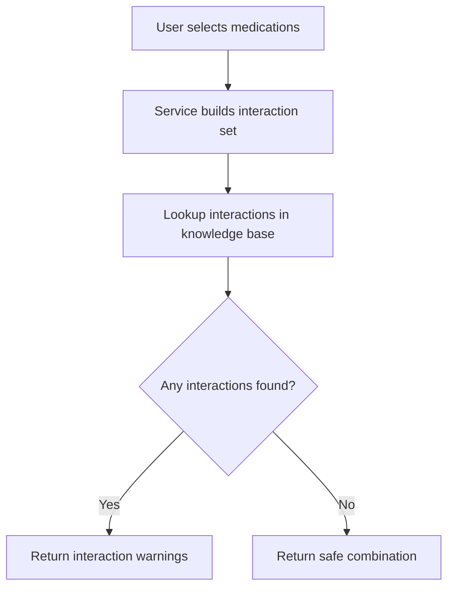
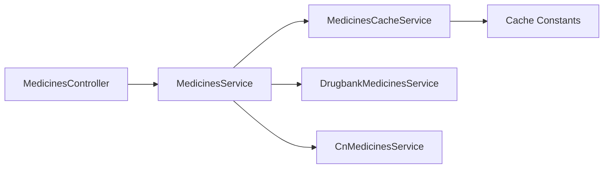

# Medicines Management

<cite>
**Referenced Files in This Document**
- [medicines.module.ts](file://Lucent/src/modules/medicines/medicines.module.ts)
- [medicines.controller.ts](file://Lucent/src/modules/medicines/medicines.controller.ts)
- [medicines.service.ts](file://Lucent/src/modules/medicines/medicines.service.ts)
- [medicines.utils.ts](file://Lucent/src/modules/medicines/medicines.utils.ts)
- [medicines-cache.service.ts](file://Lucent/src/modules/medicines/cache/medicines-cache.service.ts)
- [medicines-cache-admin.service.ts](file://Lucent/src/modules/medicines/cache/medicines-cache-admin.service.ts)
- [medicines-cache.constants.ts](file://Lucent/src/modules/medicines/cache/medicines-cache.constants.ts)
- [drugbank-medicines.service.ts](file://Lucent/src/modules/medicines/sources/drugbank-medicines.service.ts)
- [cn-medicines.service.ts](file://Lucent/src/modules/medicines/sources/cn-medicines.service.ts)
- [medicines.service.spec.ts](file://Lucent/src/modules/medicines/medicines.service.spec.ts)
- [medicines-cache.service.spec.ts](file://Lucent/src/modules/medicines/cache/medicines-cache.service.spec.ts)
- [medicines-cache-admin.service.spec.ts](file://Lucent/src/modules/medicines/cache/medicines-cache-admin.service.spec.ts)
- [schema.prisma](file://Lucent/prisma/schema.prisma)
- [import-medicine-knowledge.js](file://Lucent/scripts/medicine/import-medicine-knowledge.js)
- [drugbank_drugs.py](file://Lucent/scripts/medicine/parsers/drugbank_drugs.py)
- [drugbank_targets.py](file://Lucent/scripts/medicine/parsers/drugbank_targets.py)
- [drugbank_external_links.py](file://Lucent/scripts/merge_chinese_drug_data.py)
- [medicines.controller.js](file://Lucent/dist/modules/medicines/medicines.controller.js)
- [medicines.service.js](file://Lucent/dist/modules/medicines/medicines.service.js)
- [medicines-cache.service.js](file://Lucent/dist/modules/medicines/cache/medicines-cache.service.js)
- [medicines-cache-admin.service.js](file://Lucent/dist/modules/medicines/cache/medicines-cache-admin.service.js)
- [medicines.utils.js](file://Lucent/dist/modules/medicines/medicines.utils.js)
</cite>

## Table of Contents
1. [Introduction](#introduction)
2. [Project Structure](#project-structure)
3. [Core Components](#core-components)
4. [Architecture Overview](#architecture-overview)
5. [Detailed Component Analysis](#detailed-component-analysis)
6. [Dependency Analysis](#dependency-analysis)
7. [Performance Considerations](#performance-considerations)
8. [Troubleshooting Guide](#troubleshooting-guide)
9. [Conclusion](#conclusion)
10. [Appendices](#appendices)

## Introduction
This document describes the medicines management module, focusing on multi-source drug database integration (DrugBank and Chinese medicine databases), the medication knowledge base, search and interaction-checking mechanisms, caching strategy, and service/controller patterns. It also explains relationships with related modules such as medicine reminders and user health context, and provides guidance for common issues like missing drug information and performance optimization for large datasets.

## Project Structure
The medicines module is organized around a service-layer architecture with clear separation of concerns:
- Module bootstrap and DI wiring
- Controller exposing HTTP endpoints
- Services implementing business logic for search, detail retrieval, and interaction checks
- Caching subsystem for performance
- Source-specific services for external knowledge bases
- Utilities for data processing and normalization
- Prisma schema defining the persisted knowledge base
- Import pipeline scripts for ingesting and transforming external datasets

**Diagram sources**
- [medicines.module.ts:1-21](file://Lucent/src/modules/medicines/medicines.module.ts#L1-L21)
- [medicines.controller.ts:23-120](file://Lucent/src/modules/medicines/medicines.controller.ts#L23-L120)
- [medicines.service.ts:1-200](file://Lucent/src/modules/medicines/medicines.service.ts#L1-L200)
- [medicines.utils.ts:1-200](file://Lucent/src/modules/medicines/medicines.utils.ts#L1-L200)
- [medicines-cache.service.ts:1-200](file://Lucent/src/modules/medicines/cache/medicines-cache.service.ts#L1-L200)
- [medicines-cache-admin.service.ts:1-200](file://Lucent/src/modules/medicines/cache/medicines-cache-admin.service.ts#L1-L200)
- [medicines-cache.constants.ts:1-4](file://Lucent/src/modules/medicines/cache/medicines-cache.constants.ts#L1-L4)
- [drugbank-medicines.service.ts:1-200](file://Lucent/src/modules/medicines/sources/drugbank-medicines.service.ts#L1-L200)
- [cn-medicines.service.ts:1-200](file://Lucent/src/modules/medicines/sources/cn-medicines.service.ts#L1-L200)

**Section sources**
- [medicines.module.ts:1-21](file://Lucent/src/modules/medicines/medicines.module.ts#L1-L21)

## Core Components
- MedicinesModule: Declares and wires the controller, services, and cache admin for the medicines domain.
- MedicinesController: Exposes endpoints for searching and retrieving medicine details, with cache bypass support via HTTP header.
- MedicinesService: Orchestrates multi-source queries, applies filters, and performs interaction checks against the knowledge base.
- MedicinesCacheService: Provides TTL-based caching for search and detail results keyed by normalized inputs and source identifiers.
- MedicinesCacheAdminService: Administrative operations to flush or inspect cache keys.
- DrugbankMedicinesService: Integrates with the DrugBank knowledge source for Western/standardized drug information.
- CnMedicinesService: Integrates with Chinese medicine databases for traditional formulations and indications.
- MedicinesUtils: Utility functions for normalization, filtering, and result transformation.
- Prisma Schema: Defines the persisted knowledge base model for medicines and related entities.
- Import Scripts: Python-based parsers and Node.js ingestion pipeline to populate the knowledge base from external sources.

**Section sources**
- [medicines.controller.ts:23-120](file://Lucent/src/modules/medicines/medicines.controller.ts#L23-L120)
- [medicines.service.ts:1-200](file://Lucent/src/modules/medicines/medicines.service.ts#L1-L200)
- [medicines-cache.service.ts:1-200](file://Lucent/src/modules/medicines/cache/medicines-cache.service.ts#L1-L200)
- [medicines-cache-admin.service.ts:1-200](file://Lucent/src/modules/medicines/cache/medicines-cache-admin.service.ts#L1-L200)
- [drugbank-medicines.service.ts:1-200](file://Lucent/src/modules/medicines/sources/drugbank-medicines.service.ts#L1-L200)
- [cn-medicines.service.ts:1-200](file://Lucent/src/modules/medicines/sources/cn-medicines.service.ts#L1-L200)
- [medicines.utils.ts:1-200](file://Lucent/src/modules/medicines/medicines.utils.ts#L1-L200)
- [schema.prisma](file://Lucent/prisma/schema.prisma)

## Architecture Overview
The module follows a layered architecture:
- Presentation: Controller handles HTTP requests and delegates to the service.
- Application: Service coordinates multiple sources, applies business rules, and manages caching.
- Persistence: Prisma-backed knowledge base for stored medicine records and metadata.
- External Integration: Source services encapsulate access to DrugBank and Chinese medicine datasets.

**Diagram sources**
- [medicines.controller.ts:23-120](file://Lucent/src/modules/medicines/medicines.controller.ts#L23-L120)
- [medicines.service.ts:1-200](file://Lucent/src/modules/medicines/medicines.service.ts#L1-L200)
- [medicines-cache.service.ts:1-200](file://Lucent/src/modules/medicines/cache/medicines-cache.service.ts#L1-L200)
- [drugbank-medicines.service.ts:1-200](file://Lucent/src/modules/medicines/sources/drugbank-medicines.service.ts#L1-L200)
- [cn-medicines.service.ts:1-200](file://Lucent/src/modules/medicines/sources/cn-medicines.service.ts#L1-L200)
- [schema.prisma](file://Lucent/prisma/schema.prisma)

## Detailed Component Analysis

### MedicinesService Implementation
Responsibilities:
- Multi-source search: Defaults to DrugBank when no explicit source is provided, normalizes query terms, and paginates results.
- Detail retrieval: Fetches detailed information from the selected source and caches results.
- Interaction checking: Validates potential drug–drug interactions against the knowledge base.
- Filtering and localization: Applies filters and leverages internationalization services for localized responses.

Key behaviors:
- Normalizes whitespace and trims query strings before dispatching to sources.
- Uses cache keys derived from source, query, page, and page size to avoid redundant fetches.
- Delegates to source services for actual data retrieval and falls back gracefully when data is missing.

**Diagram sources**
- [medicines.controller.ts:23-120](file://Lucent/src/modules/medicines/medicines.controller.ts#L23-L120)
- [medicines.service.ts:1-200](file://Lucent/src/modules/medicines/medicines.service.ts#L1-L200)
- [medicines-cache.service.ts:1-200](file://Lucent/src/modules/medicines/cache/medicines-cache.service.ts#L1-L200)

**Section sources**
- [medicines.service.ts:1-200](file://Lucent/src/modules/medicines/medicines.service.ts#L1-L200)
- [medicines.service.spec.ts:34-120](file://Lucent/src/modules/medicines/medicines.service.spec.ts#L34-L120)

### MedicinesController Endpoints
Endpoints:
- GET /medicines/search: Searches across configured sources with pagination and optional source selection.
- GET /medicines/:id/detail: Retrieves detailed information for a specific medicine identifier.
- Cache bypass: Supports bypassing cache via a dedicated request header.

Behavior highlights:
- Enforces cache bypass semantics for administrative or testing scenarios.
- Returns standardized response envelopes with pagination metadata.

**Diagram sources**
- [medicines.controller.ts:23-120](file://Lucent/src/modules/medicines/medicines.controller.ts#L23-L120)
- [medicines-cache.service.ts:1-200](file://Lucent/src/modules/medicines/cache/medicines-cache.service.ts#L1-L200)

**Section sources**
- [medicines.controller.ts:23-120](file://Lucent/src/modules/medicines/medicines.controller.ts#L23-L120)

### Caching Strategy
Caching constants:
- Key prefix: "medicines"
- Search TTL: 5 minutes
- Detail TTL: 15 minutes
- Bypass header: x-bypass-cache

Mechanics:
- Search cache key includes source, normalized query, page, and page size.
- Detail cache key includes source and identifier.
- Cache admin supports listing and removing cache keys for maintenance.

**Diagram sources**
- [medicines-cache.constants.ts:1-4](file://Lucent/src/modules/medicines/cache/medicines-cache.constants.ts#L1-L4)
- [medicines-cache.service.ts:1-200](file://Lucent/src/modules/medicines/cache/medicines-cache.service.ts#L1-L200)
- [medicines-cache-admin.service.ts:1-200](file://Lucent/src/modules/medicines/cache/medicines-cache-admin.service.ts#L1-L200)

**Section sources**
- [medicines-cache.constants.ts:1-4](file://Lucent/src/modules/medicines/cache/medicines-cache.constants.ts#L1-L4)
- [medicines-cache.service.spec.ts:1-200](file://Lucent/src/modules/medicines/cache/medicines-cache.service.spec.ts#L1-L200)
- [medicines-cache-admin.service.spec.ts:1-200](file://Lucent/src/modules/medicines/cache/medicines-cache-admin.service.spec.ts#L1-L200)

### Multi-Source Integration: DrugBank and Chinese Medicine
- DrugBank integration: Provides standardized Western drug information, targets, and external links. The service encapsulates fetching and normalization.
- Chinese medicine integration: Aggregates traditional formulations and indications from local datasets. The service handles encoding and search normalization for Chinese terms.

**Diagram sources**
- [medicines.service.ts:1-200](file://Lucent/src/modules/medicines/medicines.service.ts#L1-L200)
- [drugbank-medicines.service.ts:1-200](file://Lucent/src/modules/medicines/sources/drugbank-medicines.service.ts#L1-L200)
- [cn-medicines.service.ts:1-200](file://Lucent/src/modules/medicines/sources/cn-medicines.service.ts#L1-L200)
- [medicines-cache.service.ts:1-200](file://Lucent/src/modules/medicines/cache/medicines-cache.service.ts#L1-L200)

**Section sources**
- [drugbank-medicines.service.ts:1-200](file://Lucent/src/modules/medicines/sources/drugbank-medicines.service.ts#L1-L200)
- [cn-medicines.service.ts:1-200](file://Lucent/src/modules/medicines/sources/cn-medicines.service.ts#L1-L200)

### Medication Knowledge Base and Interaction Checking
Knowledge base:
- Persisted via Prisma schema with entities representing medicines and related metadata.
- Population handled by import scripts that parse external datasets and normalize entries.

Interaction checking:
- Implemented within the service layer to validate potential interactions among drugs.
- Utilizes stored knowledge to return warnings and recommendations.

**Diagram sources**
- [medicines.service.ts:1-200](file://Lucent/src/modules/medicines/medicines.service.ts#L1-L200)
- [schema.prisma](file://Lucent/prisma/schema.prisma)

**Section sources**
- [medicines.service.ts:1-200](file://Lucent/src/modules/medicines/medicines.service.ts#L1-L200)
- [schema.prisma](file://Lucent/prisma/schema.prisma)

### DTO Patterns and Utilities
- DTOs: Defined under the medicines module DTO folders for search, detail, pagination, and source-specific representations.
- Utilities: Functions for normalization, filtering, and result transformation to ensure consistent cross-source behavior.

**Section sources**
- [medicines.utils.ts:1-200](file://Lucent/src/modules/medicines/medicines.utils.ts#L1-L200)

### Import Pipeline and Data Processing
- Python parsers transform raw external datasets into structured records.
- Node.js import script orchestrates ingestion into the knowledge base.
- Merge scripts handle Chinese medicine dataset consolidation.

**Section sources**
- [import-medicine-knowledge.js](file://Lucent/scripts/medicine/import-medicine-knowledge.js)
- [drugbank_drugs.py](file://Lucent/scripts/medicine/parsers/drugbank_drugs.py)
- [drugbank_targets.py](file://Lucent/scripts/medicine/parsers/drugbank_targets.py)
- [merge_chinese_drug_data.py](file://Lucent/scripts/merge_chinese_drug_data.py)

## Dependency Analysis
The medicines module exhibits low coupling and high cohesion:
- Controller depends on Service only.
- Service depends on Source services and Cache service.
- Cache service depends on constants and underlying storage abstraction.
- No circular dependencies observed in the module.

**Diagram sources**
- [medicines.controller.ts:23-120](file://Lucent/src/modules/medicines/medicines.controller.ts#L23-L120)
- [medicines.service.ts:1-200](file://Lucent/src/modules/medicines/medicines.service.ts#L1-L200)
- [medicines-cache.service.ts:1-200](file://Lucent/src/modules/medicines/cache/medicines-cache.service.ts#L1-L200)
- [medicines-cache.constants.ts:1-4](file://Lucent/src/modules/medicines/cache/medicines-cache.constants.ts#L1-L4)
- [drugbank-medicines.service.ts:1-200](file://Lucent/src/modules/medicines/sources/drugbank-medicines.service.ts#L1-L200)
- [cn-medicines.service.ts:1-200](file://Lucent/src/modules/medicines/sources/cn-medicines.service.ts#L1-L200)

**Section sources**
- [medicines.module.ts:1-21](file://Lucent/src/modules/medicines/medicines.module.ts#L1-L21)

## Performance Considerations
- Caching: Leverage TTL-based caching for frequent searches and details to reduce latency and external API load.
- Pagination: Always apply pagination to limit payload sizes and improve responsiveness.
- Query normalization: Normalize queries to minimize cache fragmentation and improve hit rates.
- Batch operations: For bulk lookups, batch requests to minimize round trips.
- Indexing: Ensure database indices on frequently queried fields (e.g., identifiers, names) to speed up lookups.
- Monitoring: Track cache hit ratios and latency metrics to identify bottlenecks.

[No sources needed since this section provides general guidance]

## Troubleshooting Guide
Common issues and resolutions:
- Missing drug information:
  - Verify import pipeline completion and check for parsing errors in the import logs.
  - Confirm that the target source (DrugBank or Chinese medicine) contains the requested identifier or name.
  - Use cache admin operations to clear stale keys and re-run the search.
- Performance degradation:
  - Inspect cache TTLs and adjust if necessary.
  - Review pagination parameters and ensure clients are using appropriate page sizes.
  - Monitor external API rate limits and implement backoff strategies.
- Interaction warnings not appearing:
  - Validate that the knowledge base contains interaction records for the queried substances.
  - Confirm that the interaction checking logic is invoked during the search or detail retrieval process.
- Cache bypass behavior:
  - Ensure the bypass header is correctly set when testing or debugging.
  - Use cache admin to inspect and remove keys as needed.

**Section sources**
- [medicines-cache-admin.service.spec.ts:1-200](file://Lucent/src/modules/medicines/cache/medicines-cache-admin.service.spec.ts#L1-L200)
- [medicines-cache.service.spec.ts:1-200](file://Lucent/src/modules/medicines/cache/medicines-cache.service.spec.ts#L1-L200)

## Conclusion
The medicines management module integrates multiple drug databases through a clean service-layer architecture, with robust caching, standardized DTOs, and a knowledge base for interaction checking. Its modular design enables easy extension to additional sources and improved performance through caching and pagination. Proper maintenance of the import pipeline and cache administration ensures reliable operation at scale.

[No sources needed since this section summarizes without analyzing specific files]

## Appendices

### Endpoint Reference
- GET /medicines/search
  - Query parameters: q (required), page, pageSize, source (optional)
  - Response: paginated search results
- GET /medicines/:id/detail
  - Path parameter: id (required), source (optional)
  - Response: detailed medicine information
- Headers:
  - x-bypass-cache: bypass cache for the current request

**Section sources**
- [medicines.controller.ts:23-120](file://Lucent/src/modules/medicines/medicines.controller.ts#L23-L120)

### Example Scenarios
- Drug lookup operations:
  - Search for "ibuprofen" with page size 20 returns a paginated list from the default source.
  - Retrieve detail for a specific identifier from either DrugBank or Chinese medicine source.
- Interaction warnings:
  - When combining multiple medications, the service validates against the knowledge base and returns warnings if interactions are detected.
- Search result filtering:
  - Apply filters (e.g., dosage form, manufacturer) via the service layer after retrieving results.

**Section sources**
- [medicines.service.spec.ts:34-120](file://Lucent/src/modules/medicines/medicines.service.spec.ts#L34-L120)

### Relationship with Other Modules
- Medicine reminders:
  - Reminders module consumes medicine identifiers and names from the knowledge base to schedule doses and manage adherence.
- User health context:
  - Health context module may influence search relevance or filter results based on user conditions and allergies.

[No sources needed since this section provides general guidance]