# User Health Context

<cite>
**Referenced Files in This Document**
- [user-health-context.module.ts](file://Lucent/src/modules/user-health-context/user-health-context.module.ts)
- [user-health-context.controller.ts](file://Lucent/src/modules/user-health-context/user-health-context.controller.ts)
- [user-health-context.service.ts](file://Lucent/src/modules/user-health-context/user-health-context.service.ts)
- [user-health-context.service.spec.ts](file://Lucent/src/modules/user-health-context/user-health-context.service.spec.ts)
- [health-context-response.dto.ts](file://Lucent/src/modules/user-health-context/dto/health-context-response.dto.ts)
- [create-allergy.dto.ts](file://Lucent/src/modules/user-health-context/dto/create-allergy.dto.ts)
- [update-allergy.dto.ts](file://Lucent/src/modules/user-health-context/dto/update-allergy.dto.ts)
- [create-condition.dto.ts](file://Lucent/src/modules/user-health-context/dto/create-condition.dto.ts)
- [update-condition.dto.ts](file://Lucent/src/modules/user-health-context/dto/update-condition.dto.ts)
- [create-current-medicine.dto.ts](file://Lucent/src/modules/user-health-context/dto/create-current-medicine.dto.ts)
- [update-current-medicine.dto.ts](file://Lucent/src/modules/user-health-context/dto/update-current-medicine.dto.ts)
- [update-health-context-profile.dto.ts](file://Lucent/src/modules/user-health-context/dto/update-health-context-profile.dto.ts)
- [user-health-context.e2e-spec.ts](file://Lucent/test/user-health-context.e2e-spec.ts)
- [prisma.client.ts](file://Lucent/dist/generated/prisma/client/index.ts)
- [prisma.model.user-allergy.ts](file://Lucent/dist/generated/prisma/client/UserAllergy.ts)
- [prisma.model.user-condition.ts](file://Lucent/dist/generated/prisma/client/UserCondition.ts)
- [prisma.model.user-current-medicine.ts](file://Lucent/dist/generated/prisma/client/UserCurrentMedicine.ts)
- [prisma.model.user-profile.ts](file://Lucent/dist/generated/prisma/client/UserProfile.ts)
- [medicines.service.ts](file://Lucent/src/modules/medicines/medicines.service.ts)
- [medicines.controller.ts](file://Lucent/src/modules/medicines/medicines.controller.ts)
- [medicines.utils.ts](file://Lucent/src/modules/medicines/medicines.utils.ts)
</cite>

## Table of Contents
1. [Introduction](#introduction)
2. [Project Structure](#project-structure)
3. [Core Components](#core-components)
4. [Architecture Overview](#architecture-overview)
5. [Detailed Component Analysis](#detailed-component-analysis)
6. [Dependency Analysis](#dependency-analysis)
7. [Performance Considerations](#performance-considerations)
8. [Troubleshooting Guide](#troubleshooting-guide)
9. [Conclusion](#conclusion)

## Introduction
The User Health Context module manages a comprehensive personal health profile for each user, including allergy tracking, condition management, and current medication tracking. It provides a unified health summary, detailed profile data, and lists of allergies, conditions, and current medications. The module integrates with the broader system to support personalized recommendations and safety checks, particularly around drug interactions.

Key capabilities:
- Health profile creation and updates (including demographics, pregnancy/lactation state, preferences)
- Allergy management with severity classification and reaction notes
- Condition lifecycle management (active/resolved) with diagnosis dates
- Current medication tracking with upstream source linkage and administration details
- Health summary generation for quick insights and onboarding guidance
- Integration with medicines management for interaction warnings and recommendation refinement

## Project Structure
The module follows a standard NestJS pattern with a dedicated feature module, controller, service, and DTOs. It leverages Prisma-generated models for data persistence and Swagger for API documentation.

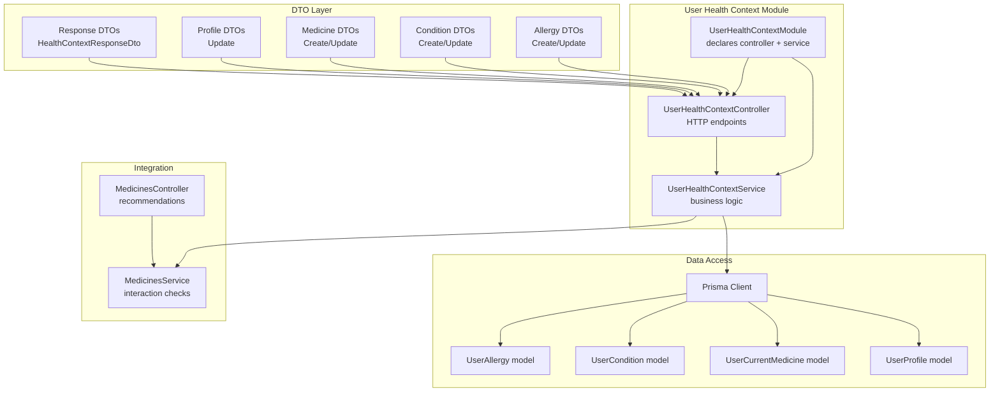

**Diagram sources**
- [user-health-context.module.ts](file://Lucent/src/modules/user-health-context/user-health-context.module.ts)
- [user-health-context.controller.ts](file://Lucent/src/modules/user-health-context/user-health-context.controller.ts)
- [user-health-context.service.ts](file://Lucent/src/modules/user-health-context/user-health-context.service.ts)
- [health-context-response.dto.ts](file://Lucent/src/modules/user-health-context/dto/health-context-response.dto.ts)
- [create-allergy.dto.ts](file://Lucent/src/modules/user-health-context/dto/create-allergy.dto.ts)
- [update-allergy.dto.ts](file://Lucent/src/modules/user-health-context/dto/update-allergy.dto.ts)
- [create-condition.dto.ts](file://Lucent/src/modules/user-health-context/dto/create-condition.dto.ts)
- [update-condition.dto.ts](file://Lucent/src/modules/user-health-context/dto/update-condition.dto.ts)
- [create-current-medicine.dto.ts](file://Lucent/src/modules/user-health-context/dto/create-current-medicine.dto.ts)
- [update-current-medicine.dto.ts](file://Lucent/src/modules/user-health-context/dto/update-current-medicine.dto.ts)
- [update-health-context-profile.dto.ts](file://Lucent/src/modules/user-health-context/dto/update-health-context-profile.dto.ts)
- [prisma.client.ts](file://Lucent/dist/generated/prisma/client/index.ts)
- [prisma.model.user-allergy.ts](file://Lucent/dist/generated/prisma/client/UserAllergy.ts)
- [prisma.model.user-condition.ts](file://Lucent/dist/generated/prisma/client/UserCondition.ts)
- [prisma.model.user-current-medicine.ts](file://Lucent/dist/generated/prisma/client/UserCurrentMedicine.ts)
- [prisma.model.user-profile.ts](file://Lucent/dist/generated/prisma/client/UserProfile.ts)
- [medicines.service.ts](file://Lucent/src/modules/medicines/medicines.service.ts)
- [medicines.controller.ts](file://Lucent/src/modules/medicines/medicines.controller.ts)

**Section sources**
- [user-health-context.module.ts](file://Lucent/src/modules/user-health-context/user-health-context.module.ts)
- [user-health-context.controller.ts](file://Lucent/src/modules/user-health-context/user-health-context.controller.ts)
- [user-health-context.service.ts](file://Lucent/src/modules/user-health-context/user-health-context.service.ts)

## Core Components
- Module declaration: Registers the controller and service within the NestJS DI container.
- Controller: Exposes HTTP endpoints for retrieving and updating health context data.
- Service: Implements business logic for CRUD operations, validation, and integration with medicines.
- DTOs: Strongly typed request/response models for all operations, validated via class-validator and documented via Swagger.

Validation and data shaping:
- Allergies: Kind, label, optional reaction/severity/note, recorded timestamp.
- Conditions: Label, optional status (active by default), diagnosis date, optional note.
- Current Medicines: Source and reference ID (required for specific sources), display name, strength/dose/route, start/end dates, optional note.
- Profile Updates: Locale/timezone/unit system, birth date, sex at birth, height, pregnancy/lactation state, blood type, onboarding completion toggle.

**Section sources**
- [health-context-response.dto.ts](file://Lucent/src/modules/user-health-context/dto/health-context-response.dto.ts)
- [create-allergy.dto.ts](file://Lucent/src/modules/user-health-context/dto/create-allergy.dto.ts)
- [update-allergy.dto.ts](file://Lucent/src/modules/user-health-context/dto/update-allergy.dto.ts)
- [create-condition.dto.ts](file://Lucent/src/modules/user-health-context/dto/create-condition.dto.ts)
- [update-condition.dto.ts](file://Lucent/src/modules/user-health-context/dto/update-condition.dto.ts)
- [create-current-medicine.dto.ts](file://Lucent/src/modules/user-health-context/dto/create-current-medicine.dto.ts)
- [update-current-medicine.dto.ts](file://Lucent/src/modules/user-health-context/dto/update-current-medicine.dto.ts)
- [update-health-context-profile.dto.ts](file://Lucent/src/modules/user-health-context/dto/update-health-context-profile.dto.ts)

## Architecture Overview
The module orchestrates health data retrieval and updates, aggregates a health summary, and ensures data integrity through DTO validation and Prisma models. It interacts with the medicines domain to inform recommendations and warnings.

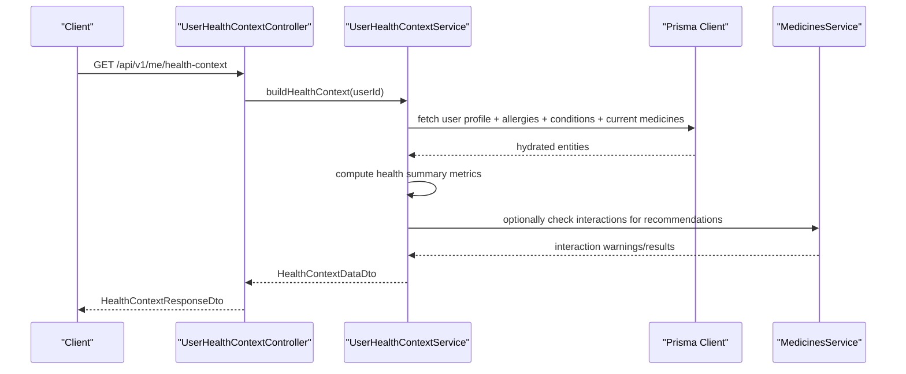

**Diagram sources**
- [user-health-context.controller.ts](file://Lucent/src/modules/user-health-context/user-health-context.controller.ts)
- [user-health-context.service.ts](file://Lucent/src/modules/user-health-context/user-health-context.service.ts)
- [health-context-response.dto.ts](file://Lucent/src/modules/user-health-context/dto/health-context-response.dto.ts)
- [prisma.client.ts](file://Lucent/dist/generated/prisma/client/index.ts)
- [medicines.service.ts](file://Lucent/src/modules/medicines/medicines.service.ts)

## Detailed Component Analysis

### Health Context Data Model and DTOs
The response DTOs define structured payloads for health summaries, profiles, and collections of health items. They encapsulate computed metrics and itemized lists with metadata timestamps.

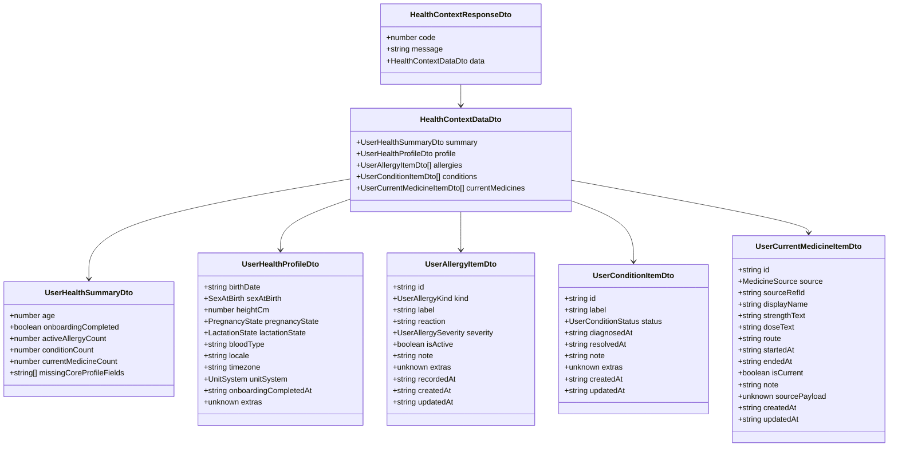

**Diagram sources**
- [health-context-response.dto.ts](file://Lucent/src/modules/user-health-context/dto/health-context-response.dto.ts)

**Section sources**
- [health-context-response.dto.ts](file://Lucent/src/modules/user-health-context/dto/health-context-response.dto.ts)

### Allergy Management
Allergies are represented with kind, label, optional reaction, severity, activity flag, and recorded timestamp. Validation ensures label length, optional reaction/severity/note constraints, and ISO 8601 timestamp for recording.

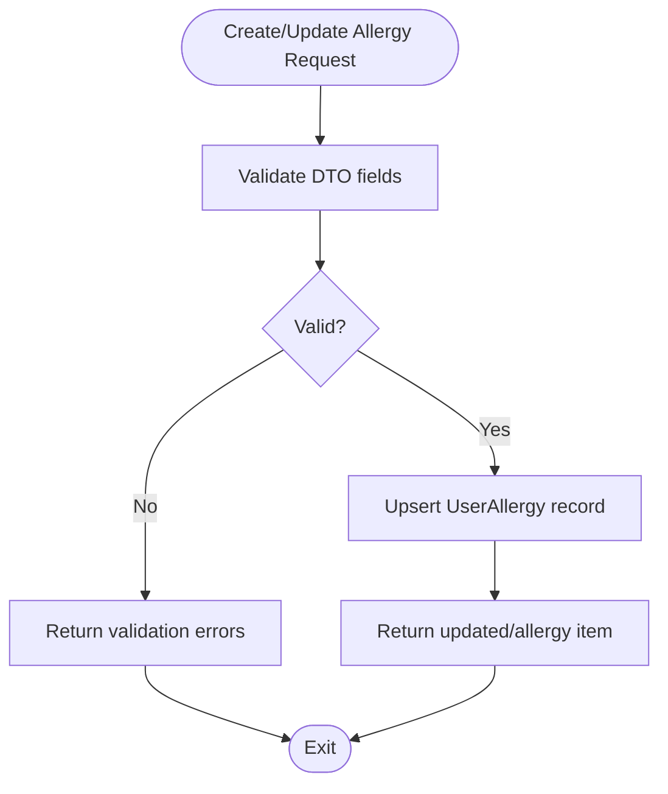

**Diagram sources**
- [create-allergy.dto.ts](file://Lucent/src/modules/user-health-context/dto/create-allergy.dto.ts)
- [update-allergy.dto.ts](file://Lucent/src/modules/user-health-context/dto/update-allergy.dto.ts)
- [prisma.model.user-allergy.ts](file://Lucent/dist/generated/prisma/client/UserAllergy.ts)

**Section sources**
- [create-allergy.dto.ts](file://Lucent/src/modules/user-health-context/dto/create-allergy.dto.ts)
- [update-allergy.dto.ts](file://Lucent/src/modules/user-health-context/dto/update-allergy.dto.ts)

### Condition Management
Conditions include label, status (active by default), optional diagnosis date, and optional note. Validation enforces label length, status enum, and YYYY-MM-DD format for diagnosis date.

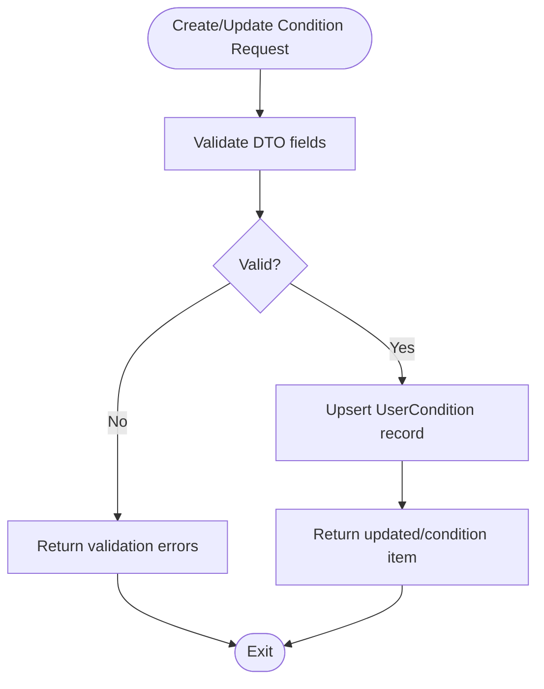

**Diagram sources**
- [create-condition.dto.ts](file://Lucent/src/modules/user-health-context/dto/create-condition.dto.ts)
- [update-condition.dto.ts](file://Lucent/src/modules/user-health-context/dto/update-condition.dto.ts)
- [prisma.model.user-condition.ts](file://Lucent/dist/generated/prisma/client/UserCondition.ts)

**Section sources**
- [create-condition.dto.ts](file://Lucent/src/modules/user-health-context/dto/create-condition.dto.ts)
- [update-condition.dto.ts](file://Lucent/src/modules/user-health-context/dto/update-condition.dto.ts)

### Current Medication Tracking
Current medications are anchored to upstream sources with required reference IDs for specific sources. Fields include display name, strength/dose/route, start/end dates, and optional note. Validation enforces enums, lengths, and date formats.

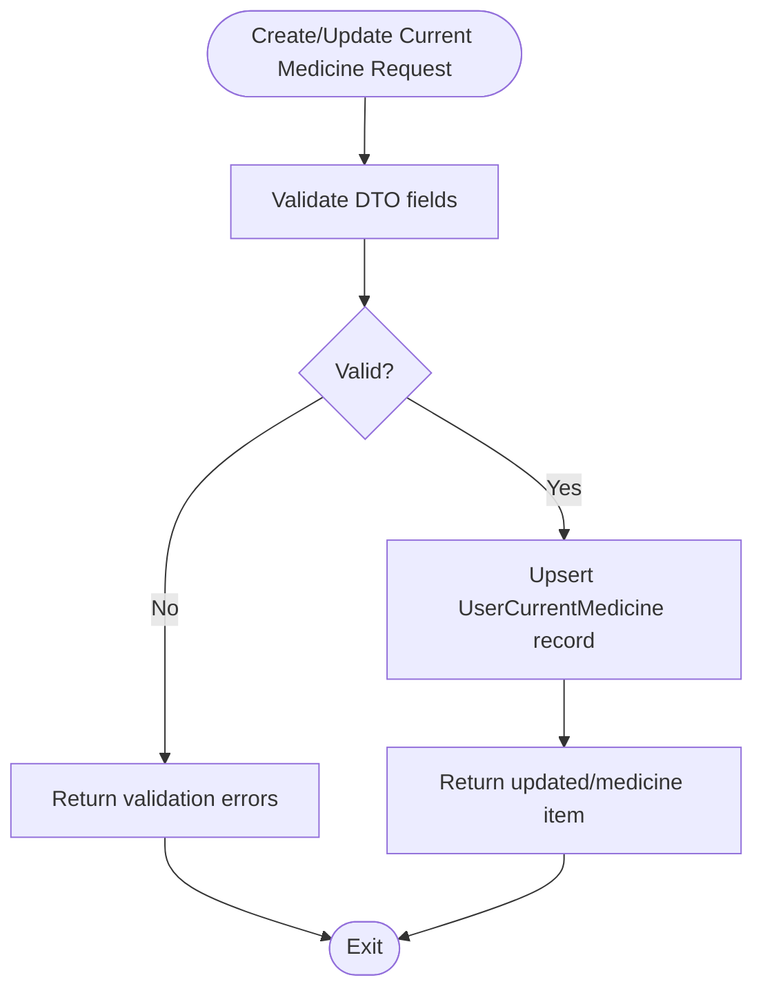

**Diagram sources**
- [create-current-medicine.dto.ts](file://Lucent/src/modules/user-health-context/dto/create-current-medicine.dto.ts)
- [update-current-medicine.dto.ts](file://Lucent/src/modules/user-health-context/dto/update-current-medicine.dto.ts)
- [prisma.model.user-current-medicine.ts](file://Lucent/dist/generated/prisma/client/UserCurrentMedicine.ts)

**Section sources**
- [create-current-medicine.dto.ts](file://Lucent/src/modules/user-health-context/dto/create-current-medicine.dto.ts)
- [update-current-medicine.dto.ts](file://Lucent/src/modules/user-health-context/dto/update-current-medicine.dto.ts)

### Profile Management
Profile updates support locale/timezone/unit system, birth date, sex at birth, height (1–300 cm), pregnancy/lactation state, blood type, and toggling onboarding completion. Validation ensures format correctness and safe numeric bounds.

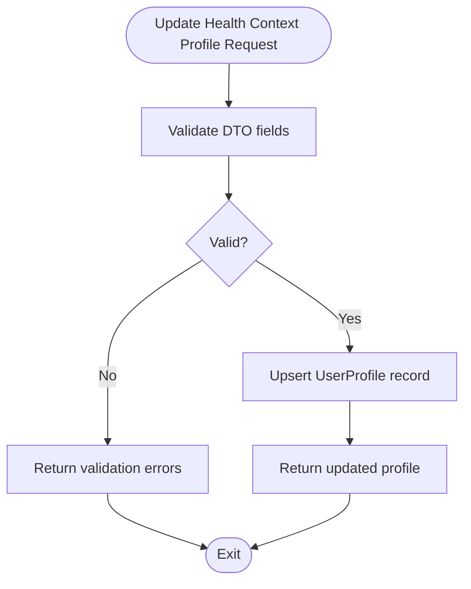

**Diagram sources**
- [update-health-context-profile.dto.ts](file://Lucent/src/modules/user-health-context/dto/update-health-context-profile.dto.ts)
- [prisma.model.user-profile.ts](file://Lucent/dist/generated/prisma/client/UserProfile.ts)

**Section sources**
- [update-health-context-profile.dto.ts](file://Lucent/src/modules/user-health-context/dto/update-health-context-profile.dto.ts)

### Service Layer Implementation
The service coordinates data retrieval, computation of health metrics, and integration with medicines for warnings and recommendations. It validates active user existence and delegates persistence to Prisma.

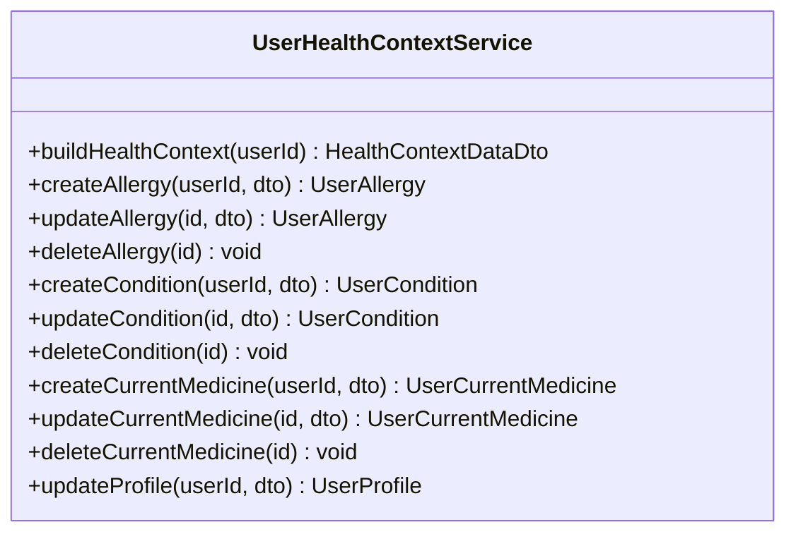

**Diagram sources**
- [user-health-context.service.ts](file://Lucent/src/modules/user-health-context/user-health-context.service.ts)

**Section sources**
- [user-health-context.service.ts](file://Lucent/src/modules/user-health-context/user-health-context.service.ts)

### Controller Endpoints
Endpoints expose health context operations with proper authorization and response envelopes. The primary endpoint retrieves a comprehensive health context snapshot.

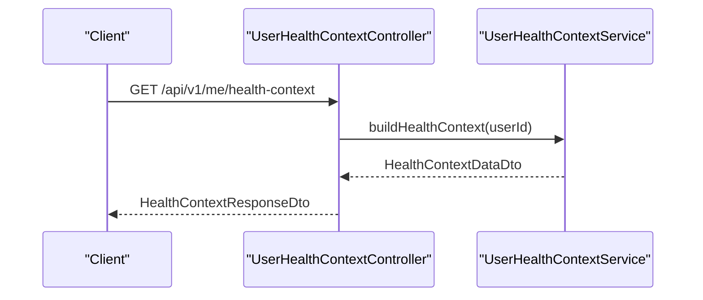

**Diagram sources**
- [user-health-context.controller.ts](file://Lucent/src/modules/user-health-context/user-health-context.controller.ts)
- [health-context-response.dto.ts](file://Lucent/src/modules/user-health-context/dto/health-context-response.dto.ts)

**Section sources**
- [user-health-context.controller.ts](file://Lucent/src/modules/user-health-context/user-health-context.controller.ts)

### Integration with Medicines Management
The health context influences medicines recommendations and warnings. The service can consult medicines utilities/services to evaluate potential interactions against user allergies and current medications.

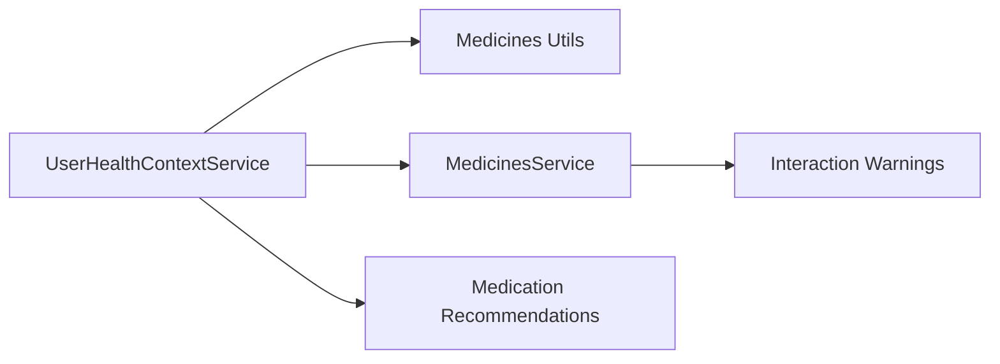

**Diagram sources**
- [user-health-context.service.ts](file://Lucent/src/modules/user-health-context/user-health-context.service.ts)
- [medicines.utils.ts](file://Lucent/src/modules/medicines/medicines.utils.ts)
- [medicines.service.ts](file://Lucent/src/modules/medicines/medicines.service.ts)

**Section sources**
- [user-health-context.service.ts](file://Lucent/src/modules/user-health-context/user-health-context.service.ts)
- [medicines.service.ts](file://Lucent/src/modules/medicines/medicines.service.ts)
- [medicines.utils.ts](file://Lucent/src/modules/medicines/medicines.utils.ts)

## Dependency Analysis
The module depends on Prisma-generated models for data persistence and Swagger for API documentation. It integrates with medicines services for interaction warnings and recommendation refinement.

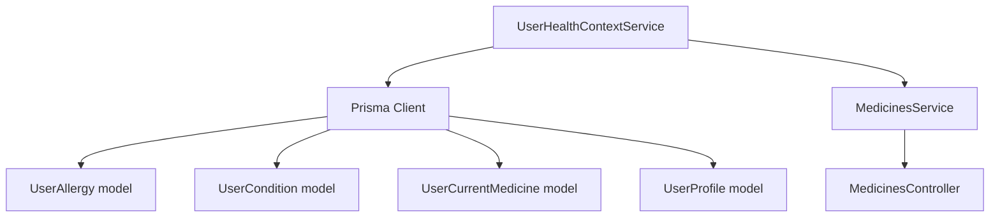

**Diagram sources**
- [user-health-context.service.ts](file://Lucent/src/modules/user-health-context/user-health-context.service.ts)
- [prisma.client.ts](file://Lucent/dist/generated/prisma/client/index.ts)
- [prisma.model.user-allergy.ts](file://Lucent/dist/generated/prisma/client/UserAllergy.ts)
- [prisma.model.user-condition.ts](file://Lucent/dist/generated/prisma/client/UserCondition.ts)
- [prisma.model.user-current-medicine.ts](file://Lucent/dist/generated/prisma/client/UserCurrentMedicine.ts)
- [prisma.model.user-profile.ts](file://Lucent/dist/generated/prisma/client/UserProfile.ts)
- [medicines.service.ts](file://Lucent/src/modules/medicines/medicines.service.ts)
- [medicines.controller.ts](file://Lucent/src/modules/medicines/medicines.controller.ts)

**Section sources**
- [user-health-context.service.ts](file://Lucent/src/modules/user-health-context/user-health-context.service.ts)
- [prisma.client.ts](file://Lucent/dist/generated/prisma/client/index.ts)

## Performance Considerations
- Batch queries: Retrieve profile, allergies, conditions, and current medicines in a single operation to minimize round-trips.
- Pagination: For large lists, consider pagination in future enhancements.
- Caching: Cache frequently accessed static data (e.g., enums) at the application layer.
- DTO validation: Keep validation lightweight and leverage class-validator for early failure.
- Indexes: Ensure Prisma models have appropriate indexes on foreign keys and frequently filtered fields.

## Troubleshooting Guide
Common issues and resolutions:
- Active user not found: The service throws a not-found error when the active user does not exist. Ensure authentication precedes health context requests.
- Validation failures: DTOs enforce strict validation; review field constraints (lengths, formats, enums) and correct input accordingly.
- Data consistency: Use transactions for related updates (e.g., creating/updating a medicine with reminders) to maintain referential integrity.
- Privacy controls: Restrict health context access to authenticated users and ensure data minimization according to policy.
- Synchronization: Align health context updates with medicines updates to keep interaction warnings accurate.

Evidence of validation and error handling:
- Service tests assert not-found scenarios and mock Prisma operations for deterministic testing.
- DTOs specify validation rules and optional fields clearly.

**Section sources**
- [user-health-context.service.spec.ts](file://Lucent/src/modules/user-health-context/user-health-context.service.spec.ts)
- [user-health-context.e2e-spec.ts](file://Lucent/test/user-health-context.e2e-spec.ts)

## Conclusion
The User Health Context module provides a robust foundation for managing personal health data, enabling precise health summaries, and integrating with medicines recommendations and warnings. Its structured DTOs, strong validation, and clear separation of concerns facilitate maintainability and extensibility while ensuring data integrity and user privacy.