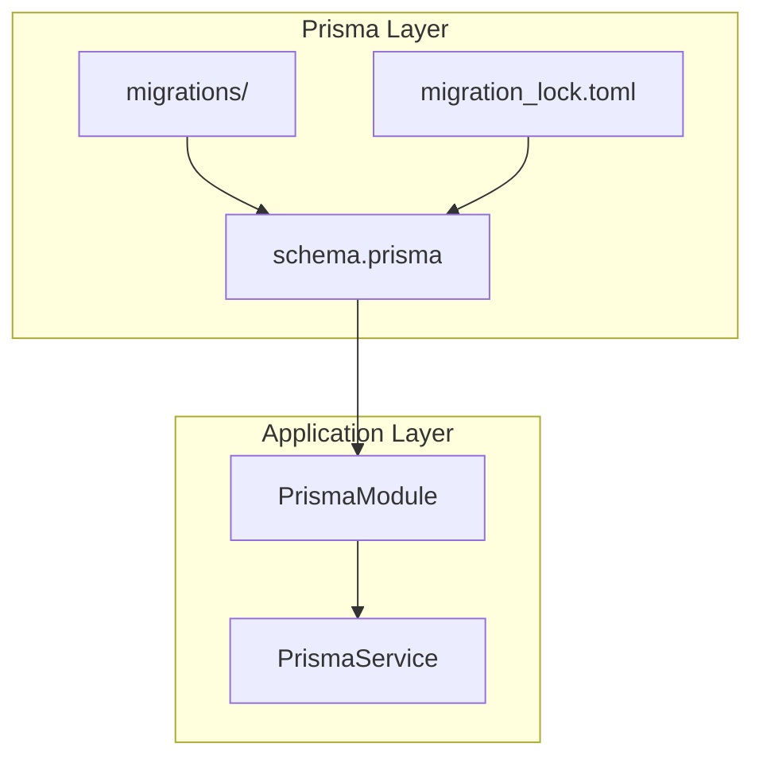
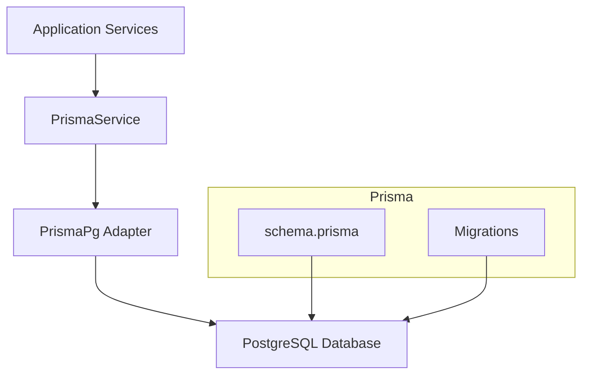
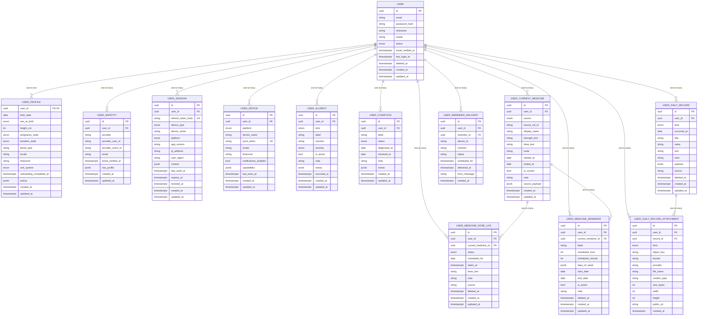
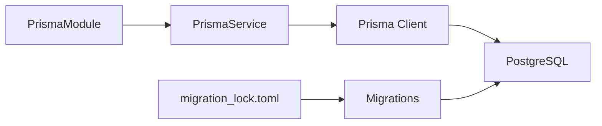

# Database Design & ORM

<cite>
**Referenced Files in This Document**
- [schema.prisma](file://Lucent/prisma/schema.prisma)
- [prisma.service.ts](file://Lucent/src/prisma/prisma.service.ts)
- [prisma.module.ts](file://Lucent/src/prisma/prisma.module.ts)
- [index.ts](file://Lucent/src/prisma/index.ts)
- [20260527131112_init/migration.sql](file://Lucent/prisma/migrations/20260527131112_init/migration.sql)
- [20260530183000_expand_user_domain/migration.sql](file://Lucent/prisma/migrations/20260530183000_expand_user_domain/migration.sql)
- [20260530233000_add_medicine_knowledge/migration.sql](file://Lucent/prisma/migrations/20260530233000_add_medicine_knowledge/migration.sql)
- [20260604000000_add_user_daily_records/migration.sql](file://Lucent/prisma/migrations/20260604000000_add_user_daily_records/migration.sql)
- [20260604010000_add_user_medicine_dose_logs/migration.sql](file://Lucent/prisma/migrations/20260604010000_add_user_medicine_dose_logs/migration.sql)
- [20260605153000_add_user_identities/migration.sql](file://Lucent/prisma/migrations/20260605153000_add_user_identities/migration.sql)
- [20260605160000_make_user_email_nullable/migration.sql](file://Lucent/prisma/migrations/20260605160000_make_user_email_nullable/migration.sql)
- [20260605161000_add_user_identity_union_id/migration.sql](file://Lucent/prisma/migrations/20260605161000_add_user_identity_union_id/migration.sql)
- [20260606133000_add_daily_record_attachments/migration.sql](file://Lucent/prisma/migrations/20260606133000_add_daily_record_attachments/migration.sql)
- [20260608193000_add_user_medicine_reminders/migration.sql](file://Lucent/prisma/migrations/20260608193000_add_user_medicine_reminders/migration.sql)
- [20260610093000_extend_medicine_reminders/migration.sql](file://Lucent/prisma/migrations/20260610093000_extend_medicine_reminders/migration.sql)
- [migration_lock.toml](file://Lucent/prisma/migrations/migration_lock.toml)
</cite>

## Table of Contents
1. [Introduction](#introduction)
2. [Project Structure](#project-structure)
3. [Core Components](#core-components)
4. [Architecture Overview](#architecture-overview)
5. [Detailed Component Analysis](#detailed-component-analysis)
6. [Dependency Analysis](#dependency-analysis)
7. [Performance Considerations](#performance-considerations)
8. [Troubleshooting Guide](#troubleshooting-guide)
9. [Conclusion](#conclusion)
10. [Appendices](#appendices)

## Introduction
This document provides comprehensive database design and ORM documentation for the Prisma implementation in the project. It covers entity relationships defined in schema.prisma, field definitions, data types, primary and foreign keys, indexes, and constraints. It also documents the migration system, seed data management, schema evolution strategies, data access patterns via the Prisma service, transaction handling, performance optimization techniques, data lifecycle and retention policies, backup considerations, and data security and access control at the database level.

## Project Structure
The database layer is organized around Prisma’s schema definition and generated client, with a dedicated service and module for dependency injection in the NestJS application. Migrations are stored under the prisma/migrations directory with numbered folders representing ordered schema changes.

**Diagram sources**
- [schema.prisma](file://Lucent/prisma/schema.prisma)
- [prisma.module.ts](file://Lucent/src/prisma/prisma.module.ts)
- [prisma.service.ts](file://Lucent/src/prisma/prisma.service.ts)
- [migration_lock.toml](file://Lucent/prisma/migrations/migration_lock.toml)

**Section sources**
- [schema.prisma](file://Lucent/prisma/schema.prisma)
- [prisma.module.ts](file://Lucent/src/prisma/prisma.module.ts)
- [prisma.service.ts](file://Lucent/src/prisma/prisma.service.ts)

## Core Components
- Prisma schema defines models, enums, relations, indexes, and constraints.
- PrismaService encapsulates connection management and integrates with NestJS via PrismaModule.
- Migrations capture ordered schema evolution; migration_lock.toml prevents concurrent writes.

Key responsibilities:
- Define domain entities and relationships.
- Enforce referential integrity and uniqueness.
- Provide efficient query indexes.
- Manage schema evolution safely.

**Section sources**
- [schema.prisma](file://Lucent/prisma/schema.prisma)
- [prisma.module.ts](file://Lucent/src/prisma/prisma.module.ts)
- [prisma.service.ts](file://Lucent/src/prisma/prisma.service.ts)
- [migration_lock.toml](file://Lucent/prisma/migrations/migration_lock.toml)

## Architecture Overview
The application uses Prisma Client with a PostgreSQL adapter. The PrismaService constructs the client using a connection string from configuration and exposes it globally via PrismaModule. Application services depend on PrismaService for data access.

**Diagram sources**
- [prisma.service.ts](file://Lucent/src/prisma/prisma.service.ts)
- [prisma.module.ts](file://Lucent/src/prisma/prisma.module.ts)
- [schema.prisma](file://Lucent/prisma/schema.prisma)

## Detailed Component Analysis

### Entity Model: User
- Primary key: id (UUID, default via function)
- Optional fields: email, passwordHash, nickname, avatar
- Status enum defaults to active
- Timestamps: emailVerifiedAt, lastLoginAt, deletedAt, createdAt, updatedAt (with timestamptz(3))
- Relations: one-to-one UserProfile, one-to-many UserIdentity, UserSession, UserDevice, UserAllergy, UserCondition, UserCurrentMedicine, UserMedicineReminder, UserReminderDelivery, UserDailyRecord, UserDailyRecordAttachment, UserMedicineDoseLog
- Indexes: email, status
- Additional mapping: table name override

Constraints and notes:
- Email is indexed for fast lookup.
- Status is indexed for filtering active/suspended/deleted users.
- Cascading deletes propagate from User to related records.

**Section sources**
- [schema.prisma:106-134](file://Lucent/prisma/schema.prisma#L106-L134)

### Entity Model: UserProfile
- Primary key: userId (UUID, references User.id)
- Personal attributes: birthDate (date), sexAtBirth (enum), heightCm, pregnancyState (enum), lactationState (enum), bloodType, locale, timezone, unitSystem (enum)
- Metadata: onboardingCompletedAt (timestamptz(3)), extras (JSONB)
- Timestamps: createdAt, updatedAt (timestamptz(3))
- Relation: one-to-one with User (onDelete Cascade)

Indexes and constraints:
- Implicitly indexed via relation key.
- Table name override.

**Section sources**
- [schema.prisma:156-174](file://Lucent/prisma/schema.prisma#L156-L174)

### Entity Model: UserIdentity
- Primary key: id (UUID)
- Foreign key: userId -> User.id (onDelete Cascade)
- Identity fields: provider, providerUserId, providerUnionId, email, emailVerifiedAt (timestamptz(3)), rawProfile (JSONB)
- Timestamps: createdAt, updatedAt (timestamptz(3))
- Unique constraint: provider + providerUserId
- Indexes: userId, providerUnionId, email
- Table name override.

Notes:
- Supports federated identity with optional union ID.
- Cascading deletion ensures cleanup when user is removed.

**Section sources**
- [schema.prisma:136-154](file://Lucent/prisma/schema.prisma#L136-L154)

### Entity Model: UserSession
- Primary key: id (UUID)
- Unique: refreshTokenHash
- Foreign key: userId -> User.id (onDelete Cascade)
- Device/session metadata: deviceType (enum), deviceName, platform (enum), appVersion, ipAddress, userAgent, context (JSONB)
- Lifecycle: lastUsedAt, expiresAt, revokedAt (timestamptz(3))
- Timestamps: createdAt, updatedAt (timestamptz(3))
- Indexes: userId+revokedAt, userId+expiresAt
- Table name override.

**Section sources**
- [schema.prisma:176-197](file://Lucent/prisma/schema.prisma#L176-L197)

### Entity Model: UserDevice
- Primary key: id (UUID)
- Unique: pushToken
- Foreign key: userId -> User.id (onDelete Cascade)
- Platform/device info: platform (enum), deviceName, locale, timezone, notificationsEnabled (boolean), capabilities (JSONB), lastSeenAt (timestamptz(3))
- Timestamps: createdAt, updatedAt (timestamptz(3))
- Indexes: userId+platform
- Table name override.

**Section sources**
- [schema.prisma:199-216](file://Lucent/prisma/schema.prisma#L199-L216)

### Entity Model: UserAllergy
- Primary key: id (UUID)
- Foreign key: userId -> User.id (onDelete Cascade)
- Attributes: kind (enum), label, reaction, severity (enum), isActive (boolean), note, extras (JSONB), recordedAt (timestamptz(3))
- Timestamps: createdAt, updatedAt (timestamptz(3))
- Indexes: userId+isActive
- Table name override.

**Section sources**
- [schema.prisma:218-235](file://Lucent/prisma/schema.prisma#L218-L235)

### Entity Model: UserCondition
- Primary key: id (UUID)
- Foreign key: userId -> User.id (onDelete Cascade)
- Attributes: label, status (enum), diagnosedAt (date), resolvedAt (date), note, extras (JSONB)
- Timestamps: createdAt, updatedAt (timestamptz(3))
- Indexes: userId+status
- Table name override.

**Section sources**
- [schema.prisma:237-252](file://Lucent/prisma/schema.prisma#L237-L252)

### Entity Model: UserCurrentMedicine
- Primary key: id (UUID)
- Foreign key: userId -> User.id (onDelete Cascade)
- Attributes: source (enum), sourceRefId, displayName, strengthText, doseText, route, startedAt/endedAt (date), isCurrent (boolean), note, sourcePayload (JSONB)
- Timestamps: createdAt, updatedAt (timestamptz(3))
- Indexes: userId+isCurrent, userId+source
- Relations: one-to-many UserMedicineDoseLog, UserMedicineReminder
- Table name override.

**Section sources**
- [schema.prisma:254-277](file://Lucent/prisma/schema.prisma#L254-L277)

### Entity Model: UserMedicineReminder
- Primary key: id (UUID)
- Foreign keys: userId -> User.id (onDelete Cascade), currentMedicineId -> UserCurrentMedicine.id (onDelete SetNull)
- Attributes: label, scheduledHour/minute, daysOfWeek (JSONB), startDate/endDate (date), isActive (boolean), note, deletedAt (timestamptz(3))
- Timestamps: createdAt, updatedAt (timestamptz(3))
- Indexes: userId+isActive, userId+currentMedicineId, userId+deletedAt, userId+startDate+endDate
- Relation: one-to-many UserReminderDelivery
- Table name override.

**Section sources**
- [schema.prisma:279-303](file://Lucent/prisma/schema.prisma#L279-L303)

### Entity Model: UserReminderDelivery
- Primary key: id (UUID)
- Foreign keys: userId -> User.id (onDelete Cascade), reminderId -> UserMedicineReminder.id (onDelete SetNull)
- Attributes: deviceId, channel, status, scheduledFor/deliveredAt (timestamptz(3)), errorMessage
- Timestamps: createdAt (timestamptz(3))
- Indexes: userId+scheduledFor, userId+reminderId, userId+channel+status
- Table name override.

**Section sources**
- [schema.prisma:305-323](file://Lucent/prisma/schema.prisma#L305-L323)

### Entity Model: UserMedicineDoseLog
- Primary key: id (UUID)
- Foreign keys: userId -> User.id (onDelete Cascade), currentMedicineId -> UserCurrentMedicine.id (onDelete SetNull)
- Attributes: status (enum), scheduledFor (date), takenAt (timestamptz(3)), doseText, note, source (default "manual"), deletedAt (timestamptz(3))
- Timestamps: createdAt, updatedAt (timestamptz(3))
- Indexes: userId+scheduledFor, userId+currentMedicineId, userId+deletedAt
- Table name override.

**Section sources**
- [schema.prisma:332-352](file://Lucent/prisma/schema.prisma#L332-L352)

### Entity Model: UserDailyRecord
- Primary key: id (UUID)
- Foreign key: userId -> User.id (onDelete Cascade)
- Attributes: kind (enum), occurredAt (date), title/value/unit, note, payload (JSONB), source (default "manual"), deletedAt (timestamptz(3))
- Timestamps: createdAt, updatedAt (timestamptz(3))
- Indexes: userId+occurredAt, userId+kind, userId+deletedAt
- Relation: one-to-many UserDailyRecordAttachment
- Table name override.

**Section sources**
- [schema.prisma:354-375](file://Lucent/prisma/schema.prisma#L354-L375)

### Entity Model: UserDailyRecordAttachment
- Primary key: id (UUID)
- Foreign keys: userId -> User.id (onDelete Cascade), recordId -> UserDailyRecord.id (onDelete Cascade)
- Attributes: kind (enum), objectKey, bucket/provider, fileName, contentType, sizeBytes, width, height, publicUrl
- Timestamps: createdAt (timestamptz(3))
- Indexes: userId+recordId
- Table name override.

**Section sources**
- [schema.prisma:377-397](file://Lucent/prisma/schema.prisma#L377-L397)

### Supporting Entities (Medicine Knowledge)
These entities support medicine-related knowledge and are part of the broader domain but are not requested in the objective. They include import tracking and multiple knowledge sources.

- DrugSourceImport: tracks imports with status and counts; relates to knowledge entities.
- CnMedicineProduct: Chinese medicine product catalog with extensive indexing.
- DrugbankDrug: DrugBank drug dataset with rich JSONB fields and indices.
- DrugbankExternalLink: cross-references to external identifiers.
- DrugbankTarget: molecular targets with unique composite key.
- DrugbankDrugTarget: many-to-many relationship between drugs and targets.

**Section sources**
- [schema.prisma:399-599](file://Lucent/prisma/schema.prisma#L399-L599)

### Data Types and Constraints Summary
- UUID primary keys with default generation.
- Enumerations for controlled vocabularies (e.g., statuses, units, allergy kinds).
- JSONB fields for flexible payloads (e.g., raw profiles, extras, days of week).
- Date vs. timestamptz(3) distinctions for temporal precision needs.
- Unique constraints on federated identity provider keys and push tokens.
- Indexes strategically placed to optimize frequent queries (by user, by status, by date ranges).

**Section sources**
- [schema.prisma:106-599](file://Lucent/prisma/schema.prisma#L106-L599)

### Relationship Diagram (Selected Entities)

**Diagram sources**
- [schema.prisma:106-599](file://Lucent/prisma/schema.prisma#L106-L599)

## Dependency Analysis
PrismaModule provides PrismaService globally. PrismaService constructs the client using a PostgreSQL adapter and a connection string from configuration. Migrations evolve the schema over time, and migration_lock.toml ensures safe concurrent migration execution.

**Diagram sources**
- [prisma.module.ts](file://Lucent/src/prisma/prisma.module.ts)
- [prisma.service.ts](file://Lucent/src/prisma/prisma.service.ts)
- [migration_lock.toml](file://Lucent/prisma/migrations/migration_lock.toml)

**Section sources**
- [prisma.module.ts](file://Lucent/src/prisma/prisma.module.ts)
- [prisma.service.ts](file://Lucent/src/prisma/prisma.service.ts)
- [migration_lock.toml](file://Lucent/prisma/migrations/migration_lock.toml)

## Performance Considerations
- Indexes:
  - Users: email, status for quick filtering and lookup.
  - UserSession: composite indexes on (userId, revokedAt) and (userId, expiresAt) to efficiently query sessions per user and by lifecycle.
  - UserDevice: composite index on (userId, platform) to filter devices by user and platform.
  - UserAllergy and UserCondition: composite indexes on (userId, isActive) and (userId, status) to quickly fetch active or current records.
  - UserCurrentMedicine: indexes on (userId, isCurrent) and (userId, source) to optimize current meds and source queries.
  - UserMedicineReminder: indexes on (userId, isActive), (userId, currentMedicineId), (userId, deletedAt), and (userId, startDate, endDate) to support scheduling and lifecycle filtering.
  - UserReminderDelivery: indexes on (userId, scheduledFor), (userId, reminderId), and (userId, channel, status) to support delivery planning and reporting.
  - UserMedicineDoseLog: indexes on (userId, scheduledFor), (userId, currentMedicineId), and (userId, deletedAt) to support adherence tracking.
  - UserDailyRecord: indexes on (userId, occurredAt), (userId, kind), and (userId, deletedAt) to support timeline views and filtering by type.
  - UserDailyRecordAttachment: index on (userId, recordId) to quickly list attachments for a record.
  - Knowledge entities: indexes on name, approvalNumber, manufacturer, barcode, nationalDrugCode, searchText; and on external identifiers for cross-references.
- Data types:
  - Use timestamptz(3) for precise timestamps with timezone awareness.
  - Use date for date-only fields to reduce storage and simplify comparisons.
  - Use JSONB for flexible payloads to avoid rigid schema changes.
- Queries:
  - Prefer filtered queries using existing indexes.
  - Use relation loading judiciously; paginate large lists.
  - Avoid N+1 selects by batching or using include/@@select patterns where appropriate.

[No sources needed since this section provides general guidance]

## Troubleshooting Guide
- Connection issues:
  - Ensure DATABASE_URL is set and reachable.
  - Confirm PrismaService initialization succeeds.
- Migration conflicts:
  - Check migration_lock.toml to prevent concurrent migrations.
  - Review migration order and resolve conflicts by applying pending migrations.
- Query performance:
  - Add missing indexes based on query patterns.
  - Use explain plans to identify bottlenecks.
- Data integrity:
  - Validate enums and unique constraints.
  - Confirm cascading deletes align with business rules.

**Section sources**
- [prisma.service.ts](file://Lucent/src/prisma/prisma.service.ts)
- [migration_lock.toml](file://Lucent/prisma/migrations/migration_lock.toml)

## Conclusion
The database design leverages Prisma’s strong typing and relational modeling to represent user profiles, identities, sessions, devices, health conditions, allergies, current medications, reminders, dose logs, daily records, and attachments. The schema emphasizes controlled vocabularies via enums, flexible JSONB payloads, and carefully chosen indexes to support common queries. The migration system enables safe, incremental schema evolution, while the PrismaService provides a robust, globally injected client for data access.

[No sources needed since this section summarizes without analyzing specific files]

## Appendices

### Migration System and Schema Evolution
- Ordered migrations under prisma/migrations/<timestamp>/capture discrete schema changes.
- migration_lock.toml prevents concurrent migration runs.
- Typical evolution steps observed:
  - Initial schema creation.
  - Expansion of user domain (identities, profiles).
  - Addition of medicine knowledge base.
  - Extension to daily records and attachments.
  - Addition and extension of reminders and dose logs.
- Seed data:
  - No explicit seed files were identified in the repository snapshot; seed data would typically be managed via Prisma Studio, scripts, or initial import jobs.

**Section sources**
- [20260527131112_init/migration.sql](file://Lucent/prisma/migrations/20260527131112_init/migration.sql)
- [20260530183000_expand_user_domain/migration.sql](file://Lucent/prisma/migrations/20260530183000_expand_user_domain/migration.sql)
- [20260530233000_add_medicine_knowledge/migration.sql](file://Lucent/prisma/migrations/20260530233000_add_medicine_knowledge/migration.sql)
- [20260604000000_add_user_daily_records/migration.sql](file://Lucent/prisma/migrations/20260604000000_add_user_daily_records/migration.sql)
- [20260604010000_add_user_medicine_dose_logs/migration.sql](file://Lucent/prisma/migrations/20260604010000_add_user_medicine_dose_logs/migration.sql)
- [20260605153000_add_user_identities/migration.sql](file://Lucent/prisma/migrations/20260605153000_add_user_identities/migration.sql)
- [20260605160000_make_user_email_nullable/migration.sql](file://Lucent/prisma/migrations/20260605160000_make_user_email_nullable/migration.sql)
- [20260605161000_add_user_identity_union_id/migration.sql](file://Lucent/prisma/migrations/20260605161000_add_user_identity_union_id/migration.sql)
- [20260606133000_add_daily_record_attachments/migration.sql](file://Lucent/prisma/migrations/20260606133000_add_daily_record_attachments/migration.sql)
- [20260608193000_add_user_medicine_reminders/migration.sql](file://Lucent/prisma/migrations/20260608193000_add_user_medicine_reminders/migration.sql)
- [20260610093000_extend_medicine_reminders/migration.sql](file://Lucent/prisma/migrations/20260610093000_extend_medicine_reminders/migration.sql)
- [migration_lock.toml](file://Lucent/prisma/migrations/migration_lock.toml)

### Data Access Patterns and Transactions
- PrismaService provides a singleton client instance initialized with a PostgreSQL adapter and configured connection string.
- Application services inject PrismaService and perform CRUD operations using generated client methods.
- Transactions:
  - Use PrismaClient.$transaction for multi-step writes requiring atomicity.
  - Wrap sensitive operations (e.g., reminder creation with logs) in transactions.
- Best practices:
  - Keep transactions short-lived.
  - Use savepoints for nested operations when supported.
  - Apply proper error handling and rollback semantics.

**Section sources**
- [prisma.service.ts](file://Lucent/src/prisma/prisma.service.ts)
- [prisma.module.ts](file://Lucent/src/prisma/prisma.module.ts)
- [index.ts](file://Lucent/src/prisma/index.ts)

### Data Lifecycle, Retention, and Backup
- Lifecycle:
  - Soft-deletion pattern via deletedAt fields on identities, reminders, and daily records supports reversible archival.
  - Status fields (active, suspended, deleted) on users and reminders enable operational control.
- Retention:
  - Consider implementing periodic cleanup jobs for old records marked as deleted or inactive.
  - Define retention policies aligned with compliance requirements (e.g., audit trails, health data).
- Backup:
  - Schedule regular logical backups of the PostgreSQL database.
  - Test restore procedures periodically.
  - Encrypt backups at rest and in transit.

[No sources needed since this section provides general guidance]

### Security and Access Control
- Transport:
  - Use encrypted connections (SSL/TLS) to the database.
- Secrets:
  - Store DATABASE_URL securely in environment variables; avoid committing secrets to source control.
- Least privilege:
  - Configure database roles with minimal required permissions for application usage.
- Data protection:
  - Consider encrypting sensitive fields (e.g., email) at rest if required by policy.
  - Mask PII in logs and monitoring outputs.
- Authentication:
  - Use database-level authentication and consider row-level security (RLS) if applicable.
- Auditing:
  - Track schema changes and access via migration logs and database audit trails.

[No sources needed since this section provides general guidance]