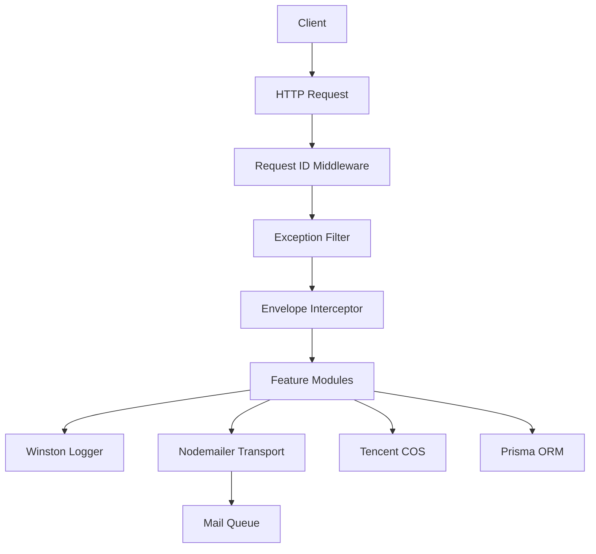
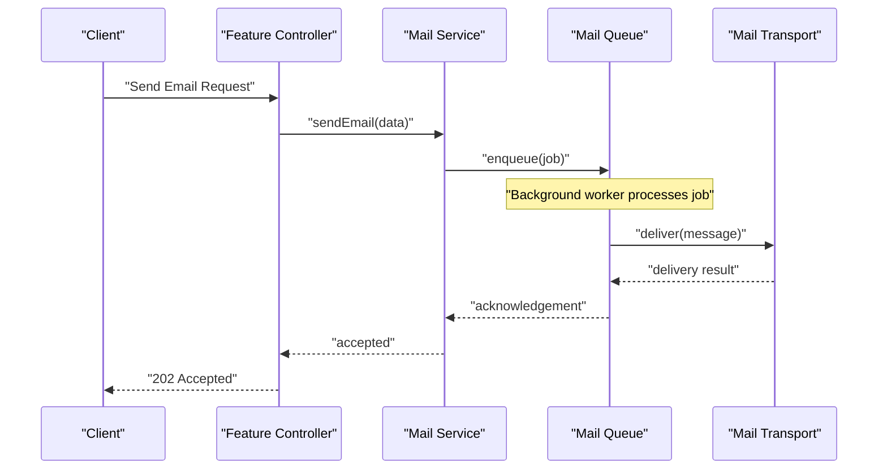
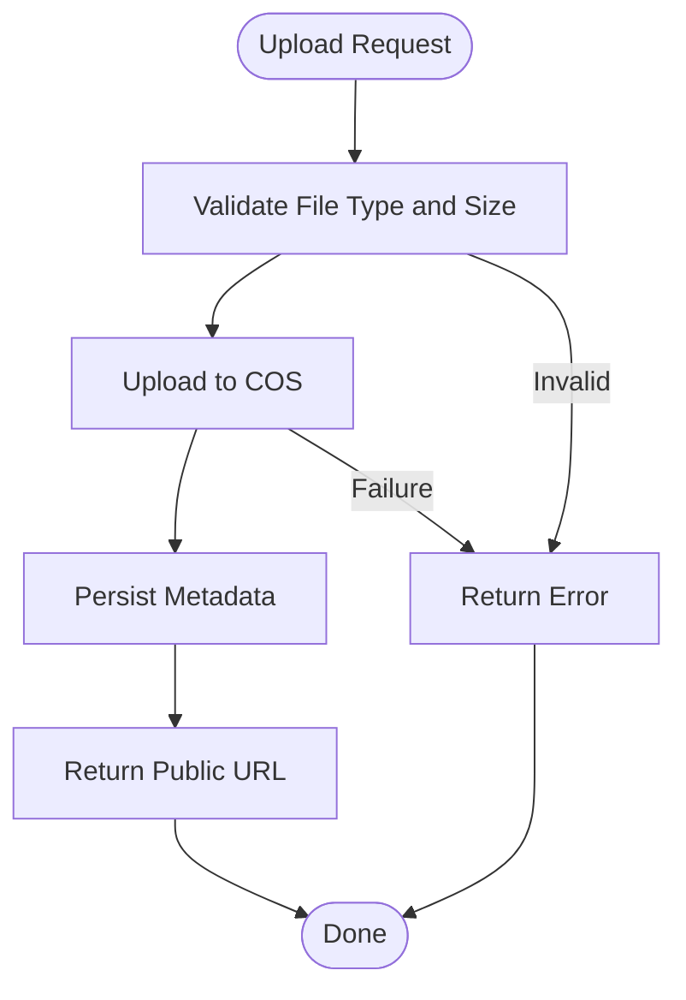
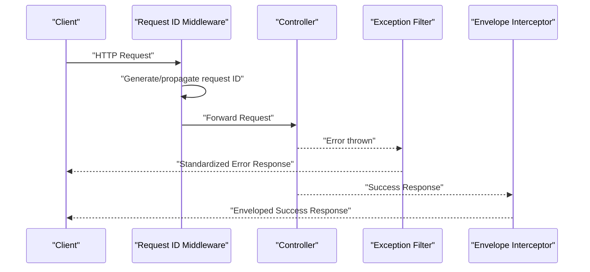
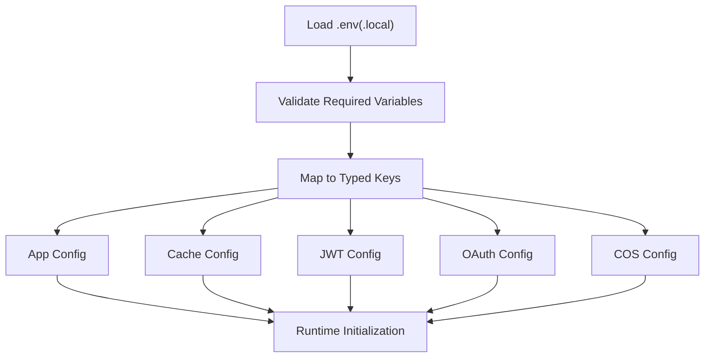
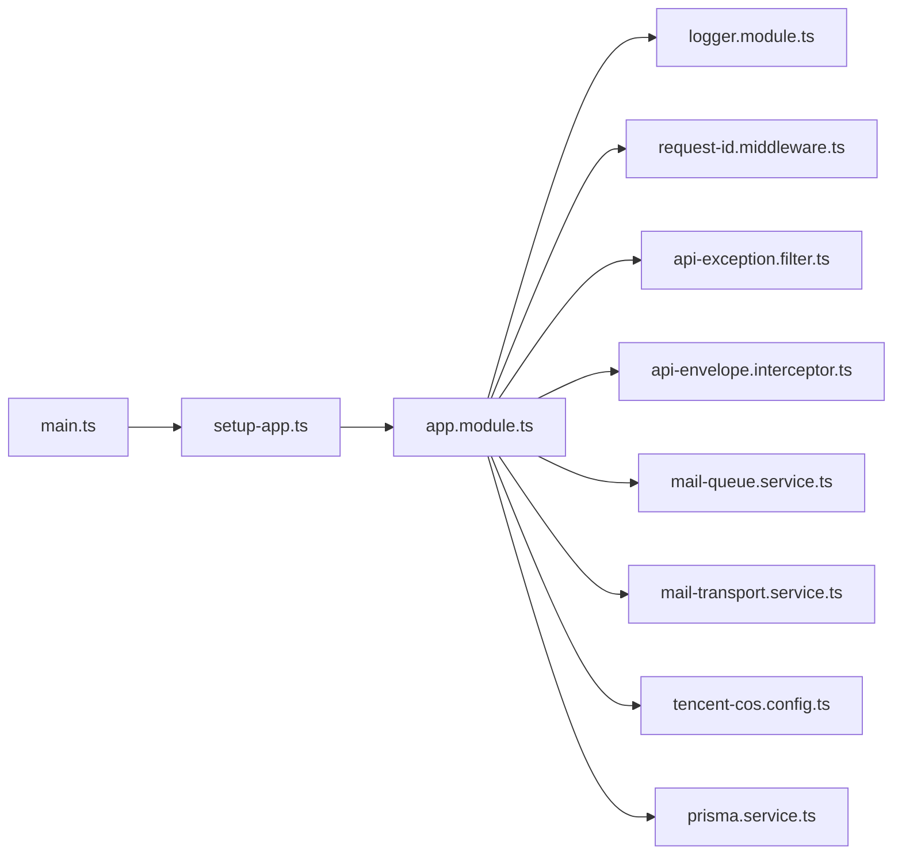

# Infrastructure & Utilities

<cite>
**Referenced Files in This Document**
- [logger.config.ts](file://Lucent/src/common/logger/logger.config.ts)
- [logger.module.ts](file://Lucent/src/common/logger/logger.module.ts)
- [request-id.middleware.ts](file://Lucent/src/common/middleware/request-id.middleware.ts)
- [api-exception.filter.ts](file://Lucent/src/common/filters/api-exception.filter.ts)
- [api-envelope.interceptor.ts](file://Lucent/src/common/interceptors/api-envelope.interceptor.ts)
- [app.config.ts](file://Lucent/src/config/app.config.ts)
- [cache.config.ts](file://Lucent/src/config/cache.config.ts)
- [mail-queue.service.ts](file://Lucent/src/mail/mail-queue.service.ts)
- [mail-transport.service.ts](file://Lucent/src/mail/mail-transport.service.ts)
- [tencent-cos.config.ts](file://Lucent/src/config/tencent-cos.config.ts)
- [daily-record-image-upload.service.ts](file://Lucent/src/modules/daily-records/daily-record-image-upload.service.ts)
- [main.ts](file://Lucent/src/main.ts)
- [setup-app.ts](file://Lucent/src/setup-app.ts)
- [app.module.ts](file://Lucent/src/app.module.ts)
- [environment.validation.ts](file://Lucent/src/config/environment.validation.ts)
- [env-file-paths.ts](file://Lucent/src/config/env-file-paths.ts)
- [config-keys.enum.ts](file://Lucent/src/config/config-keys.enum.ts)
- [env-keys.enum.ts](file://Lucent/src/config/env-keys.enum.ts)
- [mail.module.ts](file://Lucent/src/mail/mail.module.ts)
- [mail.service.ts](file://Lucent/src/mail/mail.service.ts)
- [jwt.config.ts](file://Lucent/src/config/jwt.config.ts)
- [oauth.config.ts](file://Lucent/src/config/oauth.config.ts)
- [prisma.config.ts](file://Lucent/prisma.config.ts)
- [prisma.service.ts](file://Lucent/src/prisma/prisma.service.ts)
- [docker-compose.yml](file://Lucent/docker-compose.yml)
- [Dockerfile](file://Lucent/Dockerfile)
- [deploy-server.sh](file://Lucent/scripts/deploy/deploy-server.sh)
- [tencent-cloud-cicd.md](file://Lucent/docs/tencent-cloud-cicd.md)
</cite>

## Table of Contents
1. [Introduction](#introduction)
2. [Project Structure](#project-structure)
3. [Core Components](#core-components)
4. [Architecture Overview](#architecture-overview)
5. [Detailed Component Analysis](#detailed-component-analysis)
6. [Dependency Analysis](#dependency-analysis)
7. [Performance Considerations](#performance-considerations)
8. [Troubleshooting Guide](#troubleshooting-guide)
9. [Conclusion](#conclusion)
10. [Appendices](#appendices)

## Introduction
This document describes the backend infrastructure and utility systems powering the server-side of the application. It focuses on the logging framework built on Winston, the email service leveraging Nodemailer, and Tencent Cloud Object Storage (COS) integration for file uploads. It also documents the middleware stack (request ID tracking, global exception filtering, and API response envelope formatting), configuration management across environments, caching, and security middleware. Finally, it outlines background job processing, monitoring and alerting integration points, infrastructure requirements, scaling considerations, and disaster recovery planning.

## Project Structure
The backend is organized as a NestJS application with modularized concerns:
- Common utilities: logging, middleware, filters, interceptors, request helpers
- Configuration: environment-driven settings for app, cache, JWT, OAuth, and Tencent COS
- Services: email transport and queue management
- Modules: domain features (account, auth, daily records, environment, etc.)
- Infrastructure: Prisma ORM, Docker, CI/CD documentation

```mermaid
graph TB
subgraph "Common"
LOG["Logger<br/>logger.config.ts, logger.module.ts"]
MID["Middleware<br/>request-id.middleware.ts"]
FIL["Filters<br/>api-exception.filter.ts"]
INT["Interceptors<br/>api-envelope.interceptor.ts"]
end
subgraph "Config"
APP["App Config<br/>app.config.ts"]
CACHE["Cache Config<br/>cache.config.ts"]
JWT["JWT Config<br/>jwt.config.ts"]
OAUTH["OAuth Config<br/>oauth.config.ts"]
COS["Tencent COS Config<br/>tencent-cos.config.ts"]
ENVV["Environment Validation<br/>environment.validation.ts"]
ENVP["Env File Paths<br/>env-file-paths.ts"]
CK["Config Keys Enum<br/>config-keys.enum.ts"]
EK["Env Keys Enum<br/>env-keys.enum.ts"]
end
subgraph "Mail"
MQ["Mail Queue Service<br/>mail-queue.service.ts"]
MT["Mail Transport Service<br/>mail-transport.service.ts"]
MM["Mail Module<br/>mail.module.ts"]
MS["Mail Service<br/>mail.service.ts"]
end
subgraph "Modules"
DRU["Daily Record Image Upload Service<br/>daily-record-image-upload.service.ts"]
end
MAIN["Main Entrypoint<br/>main.ts"]
SETUP["App Setup<br/>setup-app.ts"]
APPMOD["App Module<br/>app.module.ts"]
PRISMA["Prisma Service<br/>prisma.service.ts"]
MAIN --> SETUP
SETUP --> APPMOD
APPMOD --> LOG
APPMOD --> MID
APPMOD --> FIL
APPMOD --> INT
APPMOD --> MQ
APPMOD --> MT
APPMOD --> DRU
APPMOD --> PRISMA
APPMOD --> CACHE
APPMOD --> JWT
APPMOD --> OAUTH
APPMOD --> COS
```

**Diagram sources**
- [logger.config.ts](file://Lucent/src/common/logger/logger.config.ts)
- [logger.module.ts](file://Lucent/src/common/logger/logger.module.ts)
- [request-id.middleware.ts](file://Lucent/src/common/middleware/request-id.middleware.ts)
- [api-exception.filter.ts](file://Lucent/src/common/filters/api-exception.filter.ts)
- [api-envelope.interceptor.ts](file://Lucent/src/common/interceptors/api-envelope.interceptor.ts)
- [app.config.ts](file://Lucent/src/config/app.config.ts)
- [cache.config.ts](file://Lucent/src/config/cache.config.ts)
- [jwt.config.ts](file://Lucent/src/config/jwt.config.ts)
- [oauth.config.ts](file://Lucent/src/config/oauth.config.ts)
- [tencent-cos.config.ts](file://Lucent/src/config/tencent-cos.config.ts)
- [mail-queue.service.ts](file://Lucent/src/mail/mail-queue.service.ts)
- [mail-transport.service.ts](file://Lucent/src/mail/mail-transport.service.ts)
- [mail.module.ts](file://Lucent/src/mail/mail.module.ts)
- [mail.service.ts](file://Lucent/src/mail/mail.service.ts)
- [daily-record-image-upload.service.ts](file://Lucent/src/modules/daily-records/daily-record-image-upload.service.ts)
- [main.ts](file://Lucent/src/main.ts)
- [setup-app.ts](file://Lucent/src/setup-app.ts)
- [app.module.ts](file://Lucent/src/app.module.ts)
- [prisma.service.ts](file://Lucent/src/prisma/prisma.service.ts)

**Section sources**
- [main.ts](file://Lucent/src/main.ts)
- [setup-app.ts](file://Lucent/src/setup-app.ts)
- [app.module.ts](file://Lucent/src/app.module.ts)

## Core Components
- Logging framework using Winston configured via dedicated module and configuration.
- Email service with Nodemailer transport and queue abstraction for asynchronous delivery.
- Tencent COS integration for cloud object storage uploads.
- Middleware stack: request ID propagation, global exception filtering, and standardized API response envelopes.
- Environment-aware configuration management with validation and typed keys.
- Security middleware and authentication configuration (JWT/OAuth).
- Background job processing for email delivery and image uploads.
- Monitoring and alerting hooks for production observability.

**Section sources**
- [logger.config.ts](file://Lucent/src/common/logger/logger.config.ts)
- [logger.module.ts](file://Lucent/src/common/logger/logger.module.ts)
- [mail-queue.service.ts](file://Lucent/src/mail/mail-queue.service.ts)
- [mail-transport.service.ts](file://Lucent/src/mail/mail-transport.service.ts)
- [tencent-cos.config.ts](file://Lucent/src/config/tencent-cos.config.ts)
- [request-id.middleware.ts](file://Lucent/src/common/middleware/request-id.middleware.ts)
- [api-exception.filter.ts](file://Lucent/src/common/filters/api-exception.filter.ts)
- [api-envelope.interceptor.ts](file://Lucent/src/common/interceptors/api-envelope.interceptor.ts)
- [environment.validation.ts](file://Lucent/src/config/environment.validation.ts)
- [env-file-paths.ts](file://Lucent/src/config/env-file-paths.ts)
- [config-keys.enum.ts](file://Lucent/src/config/config-keys.enum.ts)
- [env-keys.enum.ts](file://Lucent/src/config/env-keys.enum.ts)
- [jwt.config.ts](file://Lucent/src/config/jwt.config.ts)
- [oauth.config.ts](file://Lucent/src/config/oauth.config.ts)

## Architecture Overview
The backend composes a layered architecture:
- Entry point initializes the NestJS application and registers global providers.
- Global middleware enriches requests with correlation IDs.
- Exception filter centralizes error handling.
- Interceptor wraps responses in a consistent envelope.
- Domain modules depend on shared services for logging, email, and storage.
- Configuration modules provide environment-specific settings validated at startup.

**Diagram sources**
- [request-id.middleware.ts](file://Lucent/src/common/middleware/request-id.middleware.ts)
- [api-exception.filter.ts](file://Lucent/src/common/filters/api-exception.filter.ts)
- [api-envelope.interceptor.ts](file://Lucent/src/common/interceptors/api-envelope.interceptor.ts)
- [logger.config.ts](file://Lucent/src/common/logger/logger.config.ts)
- [mail-transport.service.ts](file://Lucent/src/mail/mail-transport.service.ts)
- [mail-queue.service.ts](file://Lucent/src/mail/mail-queue.service.ts)
- [tencent-cos.config.ts](file://Lucent/src/config/tencent-cos.config.ts)
- [prisma.service.ts](file://Lucent/src/prisma/prisma.service.ts)

## Detailed Component Analysis

### Logging Framework (Winston)
- Winston is configured via a dedicated module and configuration file, enabling structured logging with appropriate transports and formatting.
- The logger is injected across services and modules to maintain consistent log formatting and enrichment.

Key implementation patterns:
- Centralized logger configuration defines transports, levels, and formatting.
- Logger module exposes provider tokens for dependency injection.
- Logging is used throughout services for audit trails, operational diagnostics, and error tracking.

Example snippet paths:
- [Logger configuration](file://Lucent/src/common/logger/logger.config.ts)
- [Logger module](file://Lucent/src/common/logger/logger.module.ts)

**Section sources**
- [logger.config.ts](file://Lucent/src/common/logger/logger.config.ts)
- [logger.module.ts](file://Lucent/src/common/logger/logger.module.ts)

### Email Service (Nodemailer)
- Transport service encapsulates Nodemailer configuration and delivery mechanisms.
- Queue service abstracts asynchronous email processing, decoupling request handling from SMTP latency.
- Mail module wires transport and queue into the application’s dependency graph.
- Mail service provides a facade for sending templated emails.

Processing flow:
- Application triggers email send via mail service.
- Queue service enqueues jobs for background processing.
- Transport service delivers messages asynchronously using configured SMTP settings.

Example snippet paths:
- [Mail transport service](file://Lucent/src/mail/mail-transport.service.ts)
- [Mail queue service](file://Lucent/src/mail/mail-queue.service.ts)
- [Mail module](file://Lucent/src/mail/mail.module.ts)
- [Mail service](file://Lucent/src/mail/mail.service.ts)

**Diagram sources**
- [mail.service.ts](file://Lucent/src/mail/mail.service.ts)
- [mail-queue.service.ts](file://Lucent/src/mail/mail-queue.service.ts)
- [mail-transport.service.ts](file://Lucent/src/mail/mail-transport.service.ts)

**Section sources**
- [mail-queue.service.ts](file://Lucent/src/mail/mail-queue.service.ts)
- [mail-transport.service.ts](file://Lucent/src/mail/mail-transport.service.ts)
- [mail.module.ts](file://Lucent/src/mail/mail.module.ts)
- [mail.service.ts](file://Lucent/src/mail/mail.service.ts)

### Tencent COS Integration
- COS configuration encapsulates credentials, bucket, region, and endpoint settings.
- Daily record image upload service integrates with COS to store uploaded images, returning public URLs for retrieval.
- COS settings are environment-driven and validated during configuration loading.

Example snippet paths:
- [COS configuration](file://Lucent/src/config/tencent-cos.config.ts)
- [Daily record image upload service](file://Lucent/src/modules/daily-records/daily-record-image-upload.service.ts)

**Diagram sources**
- [tencent-cos.config.ts](file://Lucent/src/config/tencent-cos.config.ts)
- [daily-record-image-upload.service.ts](file://Lucent/src/modules/daily-records/daily-record-image-upload.service.ts)

**Section sources**
- [tencent-cos.config.ts](file://Lucent/src/config/tencent-cos.config.ts)
- [daily-record-image-upload.service.ts](file://Lucent/src/modules/daily-records/daily-record-image-upload.service.ts)

### Middleware Stack
- Request ID middleware attaches a unique identifier to each request, enabling correlation across logs and distributed tracing.
- Global exception filter standardizes error responses, mapping exceptions to consistent HTTP semantics.
- API envelope interceptor wraps successful responses in a uniform envelope, simplifying client consumption.

Example snippet paths:
- [Request ID middleware](file://Lucent/src/common/middleware/request-id.middleware.ts)
- [Exception filter](file://Lucent/src/common/filters/api-exception.filter.ts)
- [Envelope interceptor](file://Lucent/src/common/interceptors/api-envelope.interceptor.ts)

**Diagram sources**
- [request-id.middleware.ts](file://Lucent/src/common/middleware/request-id.middleware.ts)
- [api-exception.filter.ts](file://Lucent/src/common/filters/api-exception.filter.ts)
- [api-envelope.interceptor.ts](file://Lucent/src/common/interceptors/api-envelope.interceptor.ts)

**Section sources**
- [request-id.middleware.ts](file://Lucent/src/common/middleware/request-id.middleware.ts)
- [api-exception.filter.ts](file://Lucent/src/common/filters/api-exception.filter.ts)
- [api-envelope.interceptor.ts](file://Lucent/src/common/interceptors/api-envelope.interceptor.ts)

### Configuration Management
- Environment validation ensures required variables are present and conform to expected formats before runtime.
- Environment file paths define per-environment configuration files.
- Typed enums enumerate configuration keys and environment variables for compile-time safety.
- App, cache, JWT, OAuth, and COS configurations are loaded from environment variables and validated.

Example snippet paths:
- [Environment validation](file://Lucent/src/config/environment.validation.ts)
- [Environment file paths](file://Lucent/src/config/env-file-paths.ts)
- [Config keys enum](file://Lucent/src/config/config-keys.enum.ts)
- [Env keys enum](file://Lucent/src/config/env-keys.enum.ts)
- [App config](file://Lucent/src/config/app.config.ts)
- [Cache config](file://Lucent/src/config/cache.config.ts)
- [JWT config](file://Lucent/src/config/jwt.config.ts)
- [OAuth config](file://Lucent/src/config/oauth.config.ts)

**Diagram sources**
- [environment.validation.ts](file://Lucent/src/config/environment.validation.ts)
- [env-file-paths.ts](file://Lucent/src/config/env-file-paths.ts)
- [config-keys.enum.ts](file://Lucent/src/config/config-keys.enum.ts)
- [env-keys.enum.ts](file://Lucent/src/config/env-keys.enum.ts)
- [app.config.ts](file://Lucent/src/config/app.config.ts)
- [cache.config.ts](file://Lucent/src/config/cache.config.ts)
- [jwt.config.ts](file://Lucent/src/config/jwt.config.ts)
- [oauth.config.ts](file://Lucent/src/config/oauth.config.ts)
- [tencent-cos.config.ts](file://Lucent/src/config/tencent-cos.config.ts)

**Section sources**
- [environment.validation.ts](file://Lucent/src/config/environment.validation.ts)
- [env-file-paths.ts](file://Lucent/src/config/env-file-paths.ts)
- [config-keys.enum.ts](file://Lucent/src/config/config-keys.enum.ts)
- [env-keys.enum.ts](file://Lucent/src/config/env-keys.enum.ts)
- [app.config.ts](file://Lucent/src/config/app.config.ts)
- [cache.config.ts](file://Lucent/src/config/cache.config.ts)
- [jwt.config.ts](file://Lucent/src/config/jwt.config.ts)
- [oauth.config.ts](file://Lucent/src/config/oauth.config.ts)

### Security Middleware and Authentication
- JWT configuration defines signing, expiration, and issuer settings for secure tokens.
- OAuth configuration supports external identity providers and callback handling.
- Together with request ID middleware and exception filter, the stack ensures secure, traceable, and resilient API interactions.

Example snippet paths:
- [JWT config](file://Lucent/src/config/jwt.config.ts)
- [OAuth config](file://Lucent/src/config/oauth.config.ts)

**Section sources**
- [jwt.config.ts](file://Lucent/src/config/jwt.config.ts)
- [oauth.config.ts](file://Lucent/src/config/oauth.config.ts)

### Background Job Processing
- Mail queue service manages asynchronous email delivery, decoupling request handling from SMTP delivery.
- The mail transport service performs actual delivery using Nodemailer.
- This pattern can be extended to other background tasks (e.g., image processing, notifications).

Example snippet paths:
- [Mail queue service](file://Lucent/src/mail/mail-queue.service.ts)
- [Mail transport service](file://Lucent/src/mail/mail-transport.service.ts)

**Section sources**
- [mail-queue.service.ts](file://Lucent/src/mail/mail-queue.service.ts)
- [mail-transport.service.ts](file://Lucent/src/mail/mail-transport.service.ts)

### Monitoring and Alerting Integration
- Winston logger emits structured logs suitable for ingestion by centralized logging systems (e.g., ELK, Cloud Logging).
- Request ID middleware enables cross-service correlation for distributed tracing platforms.
- Production deployments integrate with CI/CD pipelines and cloud monitoring solutions for alerts and dashboards.

[No sources needed since this section provides general guidance]

## Dependency Analysis
The application exhibits strong modularity with clear separation of concerns:
- Common utilities are imported by app module and feature modules.
- Configuration modules are consumed by services and providers.
- Email and storage services are optional integrations used by domain modules.
- Prisma service provides database access across modules.

**Diagram sources**
- [main.ts](file://Lucent/src/main.ts)
- [setup-app.ts](file://Lucent/src/setup-app.ts)
- [app.module.ts](file://Lucent/src/app.module.ts)
- [logger.module.ts](file://Lucent/src/common/logger/logger.module.ts)
- [request-id.middleware.ts](file://Lucent/src/common/middleware/request-id.middleware.ts)
- [api-exception.filter.ts](file://Lucent/src/common/filters/api-exception.filter.ts)
- [api-envelope.interceptor.ts](file://Lucent/src/common/interceptors/api-envelope.interceptor.ts)
- [mail-queue.service.ts](file://Lucent/src/mail/mail-queue.service.ts)
- [mail-transport.service.ts](file://Lucent/src/mail/mail-transport.service.ts)
- [tencent-cos.config.ts](file://Lucent/src/config/tencent-cos.config.ts)
- [prisma.service.ts](file://Lucent/src/prisma/prisma.service.ts)

**Section sources**
- [app.module.ts](file://Lucent/src/app.module.ts)
- [prisma.service.ts](file://Lucent/src/prisma/prisma.service.ts)

## Performance Considerations
- Asynchronous email delivery via queue reduces request latency and improves throughput.
- Structured logging minimizes overhead while enabling efficient log aggregation.
- Cache configuration should be tuned per environment to balance freshness and performance.
- COS uploads should leverage multipart upload and CDN distribution for large files.
- Database queries should be indexed and batched where appropriate; Prisma service should be used consistently.

[No sources needed since this section provides general guidance]

## Troubleshooting Guide
- Logging: Verify Winston configuration and ensure log level is appropriate for the environment. Confirm structured log output and transport destinations.
- Email: Check SMTP credentials and TLS settings in the transport service. Monitor queue backlog and retry policies.
- COS: Validate bucket permissions, region, and endpoint settings. Confirm upload policies and public URL generation.
- Middleware: Ensure request ID propagation is intact across services. Validate exception filter behavior for unhandled errors.
- Configuration: Run environment validation locally and in CI to catch missing or invalid variables early.

**Section sources**
- [logger.config.ts](file://Lucent/src/common/logger/logger.config.ts)
- [mail-transport.service.ts](file://Lucent/src/mail/mail-transport.service.ts)
- [tencent-cos.config.ts](file://Lucent/src/config/tencent-cos.config.ts)
- [request-id.middleware.ts](file://Lucent/src/common/middleware/request-id.middleware.ts)
- [api-exception.filter.ts](file://Lucent/src/common/filters/api-exception.filter.ts)
- [environment.validation.ts](file://Lucent/src/config/environment.validation.ts)

## Conclusion
The backend leverages a robust set of infrastructure utilities: a structured logging framework, asynchronous email delivery, and cloud storage integration. The middleware stack ensures consistent request tracing, error handling, and response formatting. Environment-driven configuration with validation guarantees reliable deployments across development, staging, and production. With background job processing and clear extension points, the system is prepared for scaling and advanced observability.

[No sources needed since this section summarizes without analyzing specific files]

## Appendices

### Infrastructure Requirements
- Containerization: Docker image and compose files support local and CI environments.
- Orchestration: Compose files define services and volumes for local stacks.
- CI/CD: Deployment script and documentation outline Tencent Cloud integration.

**Section sources**
- [Dockerfile](file://Lucent/Dockerfile)
- [docker-compose.yml](file://Lucent/docker-compose.yml)
- [deploy-server.sh](file://Lucent/scripts/deploy/deploy-server.sh)
- [tencent-cloud-cicd.md](file://Lucent/docs/tencent-cloud-cicd.md)

### Scaling Considerations
- Horizontal pod autoscaling for stateless API pods.
- Background workers for email and image processing scaled independently.
- CDN and object storage for static assets and media.
- Database scaling via read replicas and connection pooling.

[No sources needed since this section provides general guidance]

### Disaster Recovery Planning
- Backup schedules for database and configuration artifacts.
- Immutable container images with reproducible builds.
- Multi-region deployment with failover routing.
- Log retention and audit trail preservation for compliance.

[No sources needed since this section provides general guidance]