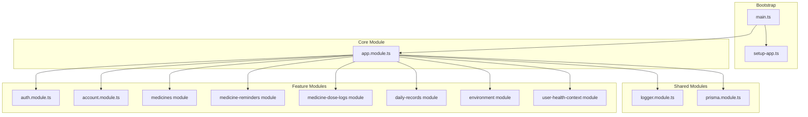
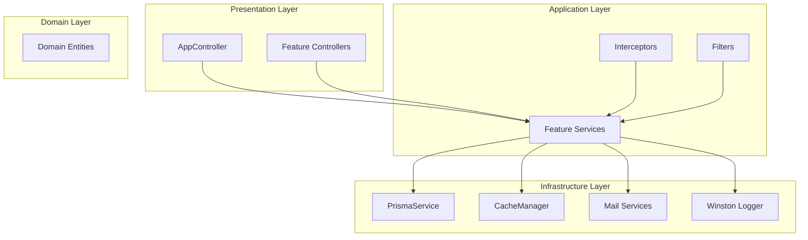
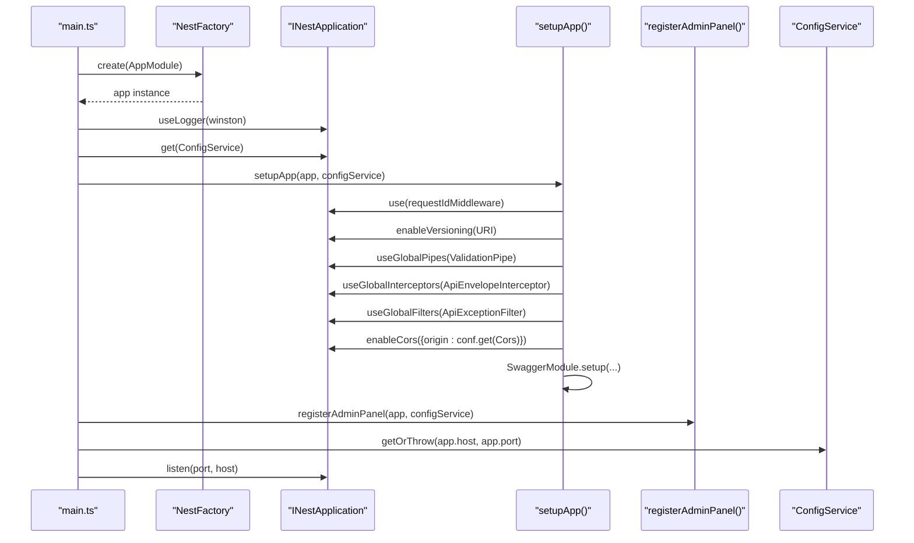
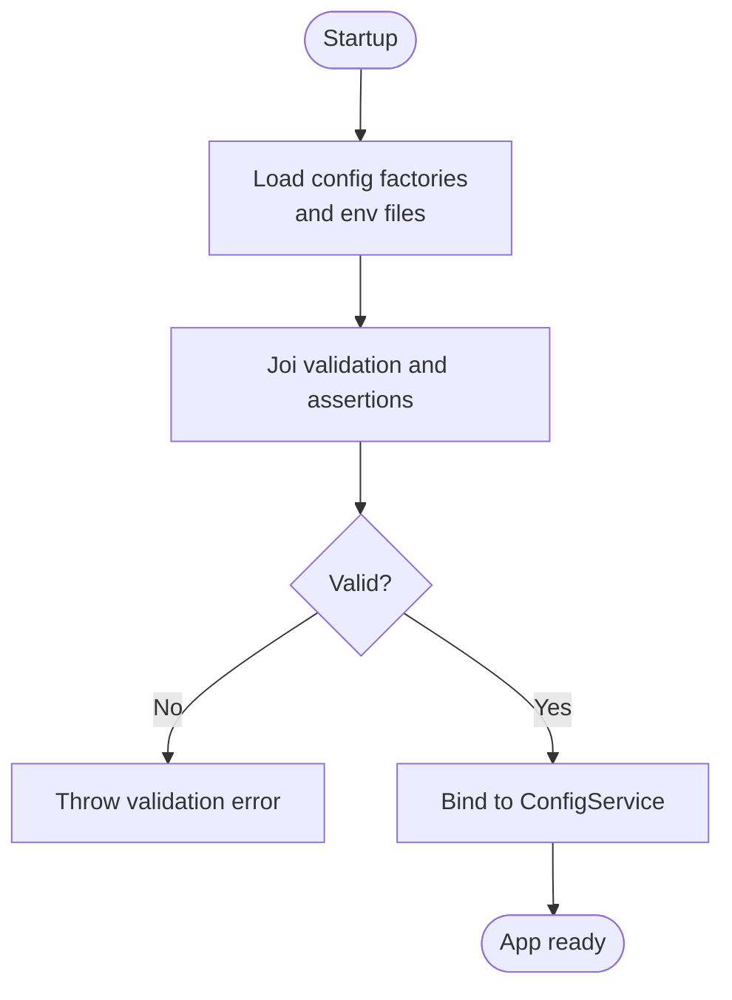
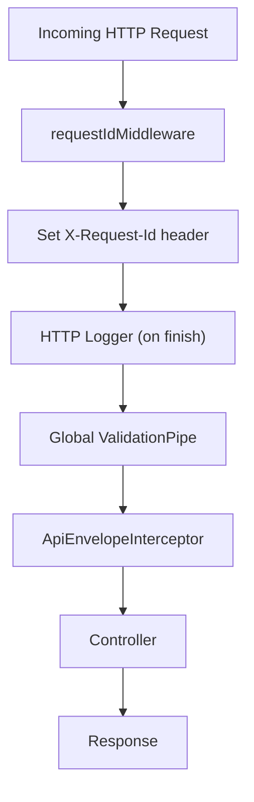
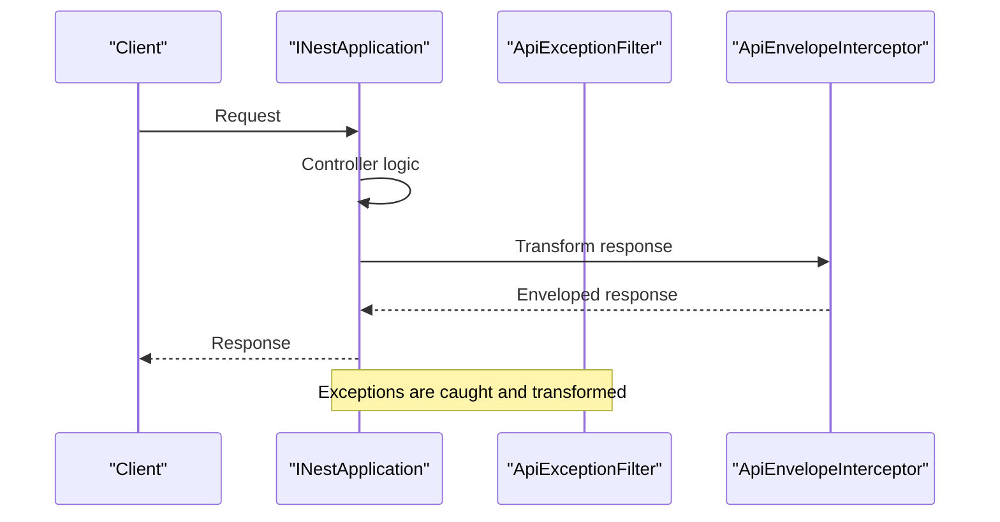
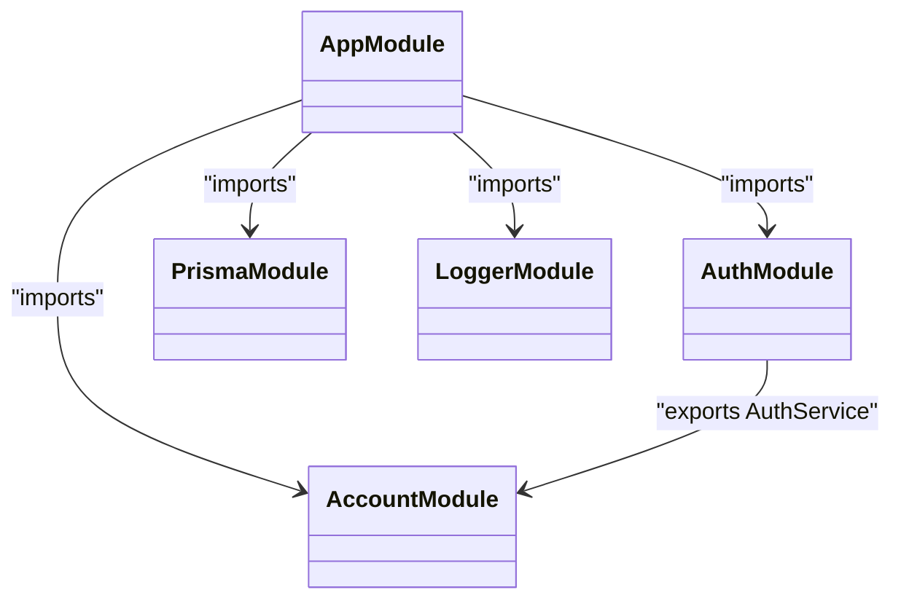
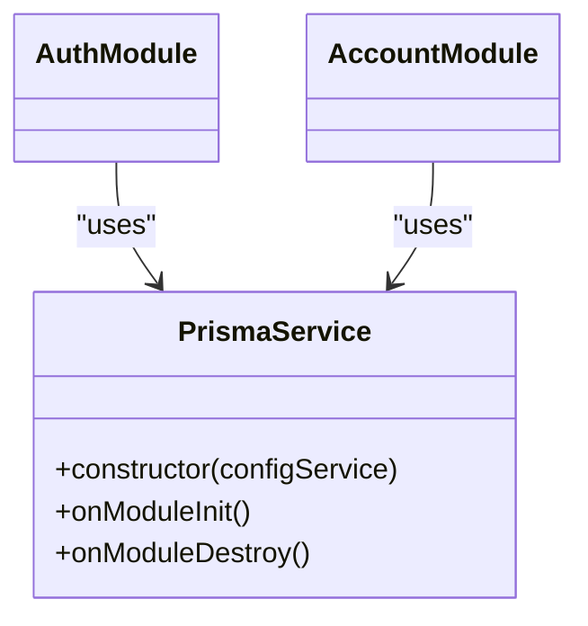
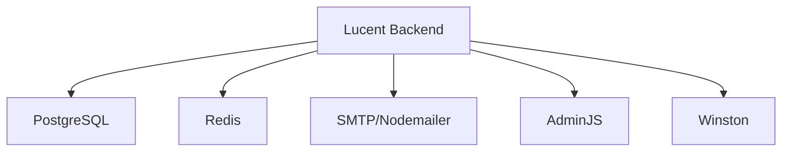

# System Architecture Overview

<cite>
**Referenced Files in This Document**
- [main.ts](file://Lucent/src/main.ts)
- [app.module.ts](file://Lucent/src/app.module.ts)
- [setup-app.ts](file://Lucent/src/setup-app.ts)
- [config-keys.enum.ts](file://Lucent/src/config/config-keys.enum.ts)
- [env-keys.enum.ts](file://Lucent/src/config/env-keys.enum.ts)
- [environment.validation.ts](file://Lucent/src/config/environment.validation.ts)
- [logger.module.ts](file://Lucent/src/common/logger/logger.module.ts)
- [request-id.middleware.ts](file://Lucent/src/common/middleware/request-id.middleware.ts)
- [auth.module.ts](file://Lucent/src/modules/auth/auth.module.ts)
- [account.module.ts](file://Lucent/src/modules/account/account.module.ts)
- [prisma.module.ts](file://Lucent/src/prisma/prisma.module.ts)
- [prisma.service.ts](file://Lucent/src/prisma/prisma.service.ts)
- [api-envelope.interceptor.ts](file://Lucent/src/common/interceptors/api-envelope.interceptor.ts)
- [package.json](file://Lucent/package.json)
- [nest-cli.json](file://Lucent/nest-cli.json)
</cite>

## Table of Contents
1. [Introduction](#introduction)
2. [Project Structure](#project-structure)
3. [Core Components](#core-components)
4. [Architecture Overview](#architecture-overview)
5. [Detailed Component Analysis](#detailed-component-analysis)
6. [Dependency Analysis](#dependency-analysis)
7. [Performance Considerations](#performance-considerations)
8. [Troubleshooting Guide](#troubleshooting-guide)
9. [Conclusion](#conclusion)

## Introduction
This document presents a comprehensive system architecture overview of the Lucent backend built with NestJS. It explains the application bootstrap process, modular architecture organization, dependency injection patterns, configuration management via environment variables, middleware setup, and cross-cutting concerns such as logging, exception handling, and request ID tracking. It also documents architectural patterns including layered architecture, repository pattern, and service layer abstraction, and illustrates the relationships among AppModule, feature modules, and shared modules. Finally, it provides system context diagrams showing component boundaries and external integrations.

## Project Structure
The backend follows a classic NestJS modular structure with clear separation of concerns:
- Entry point initializes the application and delegates setup to a dedicated function.
- AppModule aggregates configuration, infrastructure, and feature modules.
- Feature modules encapsulate domain capabilities (authentication, accounts, medicines, reminders, etc.).
- Shared modules provide cross-cutting services (logging, caching, mail, Prisma).
- Common utilities include middleware, interceptors, and filters.

**Diagram sources**
- [main.ts:1-23](file://Lucent/src/main.ts#L1-L23)
- [setup-app.ts:17-80](file://Lucent/src/setup-app.ts#L17-L80)
- [app.module.ts:26-55](file://Lucent/src/app.module.ts#L26-L55)
- [logger.module.ts:6-20](file://Lucent/src/common/logger/logger.module.ts#L6-L20)
- [prisma.module.ts:4-10](file://Lucent/src/prisma/prisma.module.ts#L4-L10)
- [auth.module.ts:13-30](file://Lucent/src/modules/auth/auth.module.ts#L13-L30)
- [account.module.ts:7-13](file://Lucent/src/modules/account/account.module.ts#L7-L13)

**Section sources**
- [main.ts:1-23](file://Lucent/src/main.ts#L1-L23)
- [app.module.ts:1-56](file://Lucent/src/app.module.ts#L1-L56)
- [setup-app.ts:17-80](file://Lucent/src/setup-app.ts#L17-L80)

## Core Components
- Bootstrap and Initialization
  - The application starts in the entry file, creates the NestJS application instance with AppModule, sets the logger provider, retrieves configuration, runs application setup, registers the Admin panel, and listens on the configured host and port.
- Configuration Management
  - Centralized via @nestjs/config with environment validation using Joi. Configuration namespaces are defined for application, JWT, mail, OAuth, and Tencent COS settings.
- Middleware and Cross-Cutting Concerns
  - Request ID tracking middleware, global HTTP logging, CORS, versioning, Swagger/OpenAPI, global pipes, interceptors, and filters.
- Logging
  - Winston-based logging module configured globally with runtime log level and environment awareness.
- Persistence
  - Prisma module provides a globally scoped Prisma service configured from DATABASE_URL.

**Section sources**
- [main.ts:9-22](file://Lucent/src/main.ts#L9-L22)
- [setup-app.ts:17-80](file://Lucent/src/setup-app.ts#L17-L80)
- [config-keys.enum.ts:6-21](file://Lucent/src/config/config-keys.enum.ts#L6-L21)
- [env-keys.enum.ts:1-40](file://Lucent/src/config/env-keys.enum.ts#L1-L40)
- [environment.validation.ts:168-186](file://Lucent/src/config/environment.validation.ts#L168-L186)
- [logger.module.ts:6-20](file://Lucent/src/common/logger/logger.module.ts#L6-L20)
- [prisma.module.ts:4-10](file://Lucent/src/prisma/prisma.module.ts#L4-L10)
- [prisma.service.ts:12-21](file://Lucent/src/prisma/prisma.service.ts#L12-L21)

## Architecture Overview
The system employs a layered architecture with clear separation between presentation, application, domain, and infrastructure layers. Dependency injection powers the inversion of control, enabling loose coupling and testability. The AppModule acts as the composition root, importing shared modules and feature modules. Feature modules encapsulate bounded contexts and expose controllers and services. Shared modules provide reusable infrastructure services.

**Diagram sources**
- [app.module.ts:51-52](file://Lucent/src/app.module.ts#L51-L52)
- [auth.module.ts:19-27](file://Lucent/src/modules/auth/auth.module.ts#L19-L27)
- [prisma.module.ts:6-7](file://Lucent/src/prisma/prisma.module.ts#L6-L7)
- [api-envelope.interceptor.ts:24-38](file://Lucent/src/common/interceptors/api-envelope.interceptor.ts#L24-L38)

## Detailed Component Analysis

### Application Bootstrap and Initialization Sequence
The bootstrap process orchestrates startup, configuration, middleware registration, and server listening.

**Diagram sources**
- [main.ts:9-22](file://Lucent/src/main.ts#L9-L22)
- [setup-app.ts:17-80](file://Lucent/src/setup-app.ts#L17-L80)

**Section sources**
- [main.ts:9-22](file://Lucent/src/main.ts#L9-L22)
- [setup-app.ts:17-80](file://Lucent/src/setup-app.ts#L17-L80)

### Configuration Management Through Environment Variables
Configuration is centralized and validated at startup:
- Namespaces define logical groups (application, JWT, mail, OAuth, Tencent COS).
- Environment variables are validated with Joi, including defaults and production hardening.
- The ConfigModule loads configuration factories and performs validation before the app boots.

**Diagram sources**
- [app.module.ts:28-33](file://Lucent/src/app.module.ts#L28-L33)
- [environment.validation.ts:168-186](file://Lucent/src/config/environment.validation.ts#L168-L186)

**Section sources**
- [config-keys.enum.ts:6-21](file://Lucent/src/config/config-keys.enum.ts#L6-L21)
- [env-keys.enum.ts:1-40](file://Lucent/src/config/env-keys.enum.ts#L1-40)
- [environment.validation.ts:168-237](file://Lucent/src/config/environment.validation.ts#L168-L237)
- [app.module.ts:28-33](file://Lucent/src/app.module.ts#L28-L33)

### Middleware Setup and Request ID Tracking
- Request ID middleware attaches a unique identifier to requests and responses, supporting tracing across services.
- Global HTTP logging records method, URL, status code, and response duration.
- CORS, versioning, Swagger/OpenAPI, and global pipes are applied during setup.

**Diagram sources**
- [request-id.middleware.ts:10-24](file://Lucent/src/common/middleware/request-id.middleware.ts#L10-L24)
- [setup-app.ts:21-53](file://Lucent/src/setup-app.ts#L21-L53)

**Section sources**
- [request-id.middleware.ts:10-24](file://Lucent/src/common/middleware/request-id.middleware.ts#L10-L24)
- [setup-app.ts:21-53](file://Lucent/src/setup-app.ts#L21-L53)

### Cross-Cutting Concerns: Logging, Exception Handling, and Envelope Interceptor
- Logging: Winston is configured globally with environment-aware log levels.
- Exception handling: A global filter translates exceptions into a standardized envelope format.
- Response envelope: An interceptor wraps successful responses in a consistent envelope unless already enveloped.

**Diagram sources**
- [logger.module.ts:6-20](file://Lucent/src/common/logger/logger.module.ts#L6-L20)
- [setup-app.ts:52-53](file://Lucent/src/setup-app.ts#L52-L53)
- [api-envelope.interceptor.ts:24-38](file://Lucent/src/common/interceptors/api-envelope.interceptor.ts#L24-L38)

**Section sources**
- [logger.module.ts:6-20](file://Lucent/src/common/logger/logger.module.ts#L6-L20)
- [setup-app.ts:52-53](file://Lucent/src/setup-app.ts#L52-L53)
- [api-envelope.interceptor.ts:24-38](file://Lucent/src/common/interceptors/api-envelope.interceptor.ts#L24-L38)

### Modular Architecture: AppModule, Feature Modules, and Shared Modules
- AppModule imports shared modules (configuration, cache, i18n, logger, Prisma, mail) and all feature modules.
- Feature modules declare their own controllers and providers, often depending on shared services (e.g., AuthModule depends on UserModule).
- Shared modules are globally provided and exported for reuse across the application.

**Diagram sources**
- [app.module.ts:10-24](file://Lucent/src/app.module.ts#L10-L24)
- [auth.module.ts:20-27](file://Lucent/src/modules/auth/auth.module.ts#L20-L27)
- [account.module.ts:7-11](file://Lucent/src/modules/account/account.module.ts#L7-L11)
- [prisma.module.ts:4-10](file://Lucent/src/prisma/prisma.module.ts#L4-L10)
- [logger.module.ts:6-20](file://Lucent/src/common/logger/logger.module.ts#L6-L20)

**Section sources**
- [app.module.ts:10-24](file://Lucent/src/app.module.ts#L10-L24)
- [auth.module.ts:13-30](file://Lucent/src/modules/auth/auth.module.ts#L13-L30)
- [account.module.ts:7-13](file://Lucent/src/modules/account/account.module.ts#L7-L13)
- [prisma.module.ts:4-10](file://Lucent/src/prisma/prisma.module.ts#L4-L10)
- [logger.module.ts:6-20](file://Lucent/src/common/logger/logger.module.ts#L6-L20)

### Persistence Layer: Prisma Service and Repository Pattern
- PrismaService is globally provided and initialized with a connection string from configuration.
- Feature services depend on PrismaService to query and mutate domain data, embodying a service layer abstraction over repositories.

**Diagram sources**
- [prisma.service.ts:8-30](file://Lucent/src/prisma/prisma.service.ts#L8-L30)
- [auth.module.ts:19-27](file://Lucent/src/modules/auth/auth.module.ts#L19-L27)
- [account.module.ts:10](file://Lucent/src/modules/account/account.module.ts#L10)

**Section sources**
- [prisma.service.ts:8-30](file://Lucent/src/prisma/prisma.service.ts#L8-L30)
- [prisma.module.ts:4-10](file://Lucent/src/prisma/prisma.module.ts#L4-L10)

### Architectural Patterns
- Layered Architecture
  - Presentation (controllers), Application (services), Domain (business logic), Infrastructure (Prisma, cache, mail).
- Service Layer Abstraction
  - Feature services encapsulate business operations and coordinate with infrastructure services.
- Repository Pattern
  - PrismaService abstracts database access; feature services act as repositories for domain entities.

**Section sources**
- [auth.module.ts:19-27](file://Lucent/src/modules/auth/auth.module.ts#L19-L27)
- [account.module.ts:10](file://Lucent/src/modules/account/account.module.ts#L10)
- [prisma.service.ts:12-21](file://Lucent/src/prisma/prisma.service.ts#L12-L21)

## Dependency Analysis
External dependencies and integrations include:
- Database: PostgreSQL via Prisma adapter.
- Caching: Redis via cache-manager and ioredis-yet.
- Email: Nodemailer transport.
- Admin Panel: AdminJS with Prisma adapter.
- Observability: Winston logging with daily rotation.

**Diagram sources**
- [package.json:46-85](file://Lucent/package.json#L46-L85)
- [prisma.service.ts:3](file://Lucent/src/prisma/prisma.service.ts#L3)
- [environment.validation.ts:67-73](file://Lucent/src/config/environment.validation.ts#L67-L73)

**Section sources**
- [package.json:46-85](file://Lucent/package.json#L46-L85)
- [environment.validation.ts:67-73](file://Lucent/src/config/environment.validation.ts#L67-L73)

## Performance Considerations
- Use global pipes to enforce validation early and reduce controller clutter.
- Enable CORS only with explicit origins in production to minimize preflight overhead.
- Configure cache manager with appropriate TTL and storage backend for hot data.
- Keep interceptors lightweight; avoid heavy synchronous work inside them.
- Monitor Prisma queries and consider pagination for large datasets.

## Troubleshooting Guide
Common issues and diagnostics:
- Environment validation failures
  - Ensure all required environment variables are present and correctly formatted; production requires explicit CORS origin and secrets.
- Missing database or Redis URLs
  - Confirm DATABASE_URL and REDIS_URL are set appropriately; PrismaService throws if missing.
- Admin panel credentials
  - Admin credentials and cookie secret must meet minimum length requirements in production.
- Request tracing
  - Verify X-Request-Id header presence and propagation across services.

**Section sources**
- [environment.validation.ts:188-213](file://Lucent/src/config/environment.validation.ts#L188-L213)
- [environment.validation.ts:215-237](file://Lucent/src/config/environment.validation.ts#L215-L237)
- [prisma.service.ts:14-18](file://Lucent/src/prisma/prisma.service.ts#L14-L18)
- [request-id.middleware.ts:15-22](file://Lucent/src/common/middleware/request-id.middleware.ts#L15-L22)

## Conclusion
The Lucent backend leverages NestJS’s modular architecture and dependency injection to achieve a clean separation of concerns. Configuration is robustly managed with validation and environment-specific defaults. Cross-cutting concerns are consistently applied through middleware, interceptors, filters, and a global logger. The service layer abstracts domain logic while the Prisma service provides a reliable persistence layer. Together, these patterns support maintainability, scalability, and operability across development, testing, and production environments.