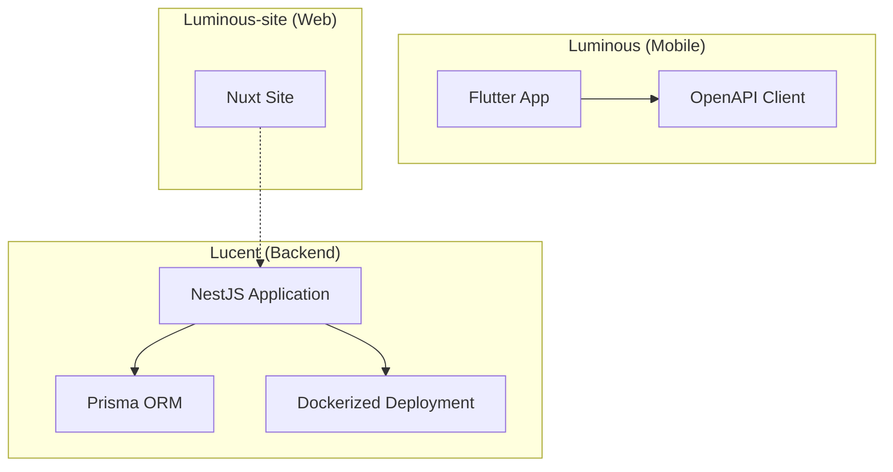
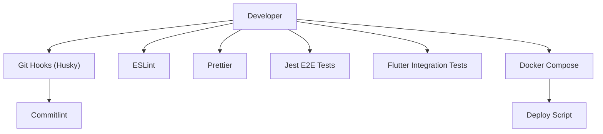
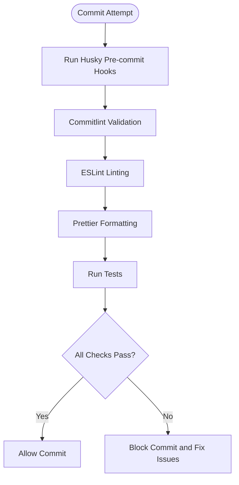
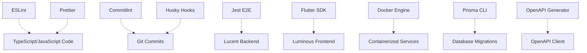

# Contributing Guidelines

<cite>
**Referenced Files in This Document**
- [CONTRIBUTING.md](file://Luminous/CONTRIBUTING.md)
- [eslint.config.mjs](file://Lucent/eslint.config.mjs)
- [commitlint.config.mjs](file://Lucent/commitlint.config.mjs)
- [.prettierrc](file://Lucent/.prettierrc)
- [.editorconfig](file://Luminous/.editorconfig)
- [analysis_options.yaml](file://Luminous/packages/lucent_openapi/analysis_options.yaml)
- [package.json](file://Lucent/package.json)
- [pubspec.yaml](file://Luminous/pubspec.yaml)
- [pubspec.yaml](file://Luminous/packages/lucent_openapi/pubspec.yaml)
- [docker-compose.yml](file://Lucent/docker-compose.yml)
- [docker-compose.dev.yml](file://Lucent/docker-compose.dev.yml)
- [Dockerfile](file://Lucent/Dockerfile)
- [scripts/dev/up-local-stack.ps1](file://Lucent/scripts/dev/up-local-stack.ps1)
- [scripts/dev/down-local-stack.ps1](file://Lucent/scripts/dev/down-local-stack.ps1)
- [scripts/dev/migrate-local-databases.ps1](file://Lucent/scripts/dev/migrate-local-databases.ps1)
- [scripts/dev/import-medicine-datasets.ps1](file://Lucent/scripts/dev/import-medicine-datasets.ps1)
- [scripts/deploy/deploy-server.sh](file://Lucent/scripts/deploy/deploy-server.sh)
- [test/app.e2e-spec.ts](file://Lucent/test/app.e2e-spec.ts)
- [integration_test/app_smoke_test.dart](file://Luminous/integration_test/app_smoke_test.dart)
- [docs/README.md](file://Lucent/docs/README.md)
- [docs/environment.md](file://Lucent/docs/environment.md)
- [docs/openapi.json](file://Lucent/docs/openapi.json)
- [.learnings/LEARNINGS.md](file://.learnings/LEARNINGS.md)
- [.learnings/ERRORS.md](file://.learnings/ERRORS.md)
- [.learnings/FEATURE_REQUESTS.md](file://.learnings/FEATURE_REQUESTS.md)
- [AGENTS.md](file://Lucent/AGENTS.md)
- [AGENTS.md](file://Luminous/AGENTS.md)
</cite>

## Table of Contents
1. [Introduction](#introduction)
2. [Project Structure](#project-structure)
3. [Core Components](#core-components)
4. [Architecture Overview](#architecture-overview)
5. [Detailed Component Analysis](#detailed-component-analysis)
6. [Dependency Analysis](#dependency-analysis)
7. [Performance Considerations](#performance-considerations)
8. [Troubleshooting Guide](#troubleshooting-guide)
9. [Conclusion](#conclusion)
10. [Appendices](#appendices)

## Introduction
This document defines how to contribute effectively to the Lumos project. It consolidates development standards, code style conventions, quality assurance procedures, commit message conventions, pull request processes, code review guidelines, environment setup, testing and debugging practices, learning resources, error tracking methodologies, feature request processes, documentation contributions, issue reporting, community engagement, formatting standards, linting rules, automated quality checks, onboarding procedures, and mentorship resources. The guidance is derived from the repository’s existing configuration and documentation.

## Project Structure
The Lumos project consists of three primary areas:
- Lucent: NestJS backend service with TypeScript, Prisma ORM, and Docker-based deployment.
- Luminous: Flutter frontend mobile application.
- Luminous-site: Nuxt-based marketing site.

Key characteristics:
- Backend uses ESLint, Prettier, Husky, and Commitlint for code quality and commit hygiene.
- Frontend uses Dart with Flutter and OpenAPI client generation.
- Both backend and frontend include CI/CD workflows and local development scripts.
- Documentation exists under Lucent/docs and Luminous/docs.

**Section sources**
- [package.json:1-200](file://Lucent/package.json#L1-L200)
- [pubspec.yaml:1-200](file://Luminous/pubspec.yaml#L1-L200)
- [pubspec.yaml:1-200](file://Luminous/packages/lucent_openapi/pubspec.yaml#L1-L200)
- [docker-compose.yml:1-200](file://Lucent/docker-compose.yml#L1-L200)
- [docker-compose.dev.yml:1-200](file://Lucent/docker-compose.dev.yml#L1-L200)
- [Dockerfile:1-200](file://Lucent/Dockerfile#L1-L200)

## Core Components
This section outlines the essential development and quality tools present in the repository.

- Code Quality Tools
  - ESLint: Enforced via a centralized configuration file for TypeScript projects.
  - Prettier: Formatting rules configured via a dedicated configuration file.
  - EditorConfig: Consistent editor behavior across editors.
  - Commitlint: Enforces conventional commit messages.
  - Husky: Git hooks integration for pre-commit checks.

- Testing and Coverage
  - Jest-based E2E tests in the backend.
  - Flutter integration tests in the frontend.
  - OpenAPI client generation and validation.

- Documentation
  - Backend documentation and OpenAPI spec included in docs.
  - Learning materials for errors, feature requests, and general learnings.

- Deployment and DevOps
  - Docker Compose configurations for local and production environments.
  - Scripts for up/down stacks, database migrations, and dataset imports.
  - CI/CD workflows for server deployment and Flutter builds.

**Section sources**
- [eslint.config.mjs:1-200](file://Lucent/eslint.config.mjs#L1-L200)
- [.prettierrc:1-200](file://Lucent/.prettierrc#L1-L200)
- [.editorconfig:1-200](file://Luminous/.editorconfig#L1-L200)
- [commitlint.config.mjs:1-200](file://Lucent/commitlint.config.mjs#L1-L200)
- [test/app.e2e-spec.ts:1-200](file://Lucent/test/app.e2e-spec.ts#L1-L200)
- [integration_test/app_smoke_test.dart:1-200](file://Luminous/integration_test/app_smoke_test.dart#L1-L200)
- [docs/README.md:1-200](file://Lucent/docs/README.md#L1-L200)
- [docs/openapi.json:1-200](file://Lucent/docs/openapi.json#L1-L200)

## Architecture Overview
The Lumos architecture integrates a backend API, a mobile frontend, and a supporting website. Automated tooling ensures consistent code quality and reliable deployments.

**Diagram sources**
- [commitlint.config.mjs:1-200](file://Lucent/commitlint.config.mjs#L1-L200)
- [eslint.config.mjs:1-200](file://Lucent/eslint.config.mjs#L1-L200)
- [.prettierrc:1-200](file://Lucent/.prettierrc#L1-L200)
- [test/app.e2e-spec.ts:1-200](file://Lucent/test/app.e2e-spec.ts#L1-L200)
- [integration_test/app_smoke_test.dart:1-200](file://Luminous/integration_test/app_smoke_test.dart#L1-L200)
- [docker-compose.yml:1-200](file://Lucent/docker-compose.yml#L1-L200)
- [scripts/deploy/deploy-server.sh:1-200](file://Lucent/scripts/deploy/deploy-server.sh#L1-L200)

## Detailed Component Analysis

### Code Style and Formatting Standards
- JavaScript/TypeScript
  - ESLint centralizes linting rules for the backend.
  - Prettier enforces formatting; use the provided configuration file for consistent formatting.
  - EditorConfig ensures consistent editor behavior across contributors.
- Dart/Flutter
  - Analysis options define linting rules for Dart code.
  - EditorConfig also applies to Flutter code.

Recommended actions:
- Run formatter and linter locally before committing.
- Configure your editor to use the provided formatting and linting rules.

**Section sources**
- [eslint.config.mjs:1-200](file://Lucent/eslint.config.mjs#L1-L200)
- [.prettierrc:1-200](file://Lucent/.prettierrc#L1-L200)
- [.editorconfig:1-200](file://Luminous/.editorconfig#L1-L200)
- [analysis_options.yaml:1-200](file://Luminous/packages/lucent_openapi/analysis_options.yaml#L1-L200)

### Commit Message Conventions
- Conventional commits are enforced via Commitlint.
- Ensure commit messages follow the conventional pattern to pass pre-commit hooks.

Recommended actions:
- Use imperative mood and concise subject lines.
- Reference issues or feature work in the footer when applicable.

**Section sources**
- [commitlint.config.mjs:1-200](file://Lucent/commitlint.config.mjs#L1-L200)

### Pull Request Processes and Code Review Guidelines
- Use conventional commit messages for PR history.
- Keep PRs focused and small to facilitate review.
- Ensure all automated checks pass (lint, format, tests).
- Assign reviewers based on module ownership.
- Address comments promptly and update tests if logic changes.

[No sources needed since this section provides general guidance]

### Development Environment Setup
Backend (Lucent):
- Install dependencies using the package manager defined in the project.
- Use Docker Compose for local stack management.
- Run local up/down scripts to spin up services.
- Apply database migrations and seed datasets as needed.

Frontend (Luminous):
- Install Flutter dependencies using the pubspec.
- Run integration smoke tests to validate environment readiness.

Website (Luminous-site):
- Install dependencies and build the static site as per package configuration.

**Section sources**
- [package.json:1-200](file://Lucent/package.json#L1-L200)
- [docker-compose.yml:1-200](file://Lucent/docker-compose.yml#L1-L200)
- [docker-compose.dev.yml:1-200](file://Lucent/docker-compose.dev.yml#L1-L200)
- [scripts/dev/up-local-stack.ps1:1-200](file://Lucent/scripts/dev/up-local-stack.ps1#L1-L200)
- [scripts/dev/down-local-stack.ps1:1-200](file://Lucent/scripts/dev/down-local-stack.ps1#L1-L200)
- [scripts/dev/migrate-local-databases.ps1:1-200](file://Lucent/scripts/dev/migrate-local-databases.ps1#L1-L200)
- [scripts/dev/import-medicine-datasets.ps1:1-200](file://Lucent/scripts/dev/import-medicine-datasets.ps1#L1-L200)
- [pubspec.yaml:1-200](file://Luminous/pubspec.yaml#L1-L200)

### Testing Procedures
Backend:
- E2E tests are organized under the test directory.
- Run the test suite locally to validate changes.

Frontend:
- Integration tests are located under integration_test.
- Execute smoke tests to verify basic functionality.

**Section sources**
- [test/app.e2e-spec.ts:1-200](file://Lucent/test/app.e2e-spec.ts#L1-L200)
- [integration_test/app_smoke_test.dart:1-200](file://Luminous/integration_test/app_smoke_test.dart#L1-L200)

### Debugging Techniques
- Backend:
  - Use logs and structured logging configuration.
  - Inspect audit logs for recent operations.
  - Leverage environment-specific configurations for debugging.
- Frontend:
  - Use Flutter DevTools for profiling and inspection.
  - Enable verbose logging during development.

**Section sources**
- [docs/README.md:1-200](file://Lucent/docs/README.md#L1-L200)
- [docs/environment.md:1-200](file://Lucent/docs/environment.md#L1-L200)
- [Lucent/logs/.b8595fc7c58e3fcc8e2e28a1f0e14a8ce2706a3f-audit.json:1-200](file://Lucent/logs/.b8595fc7c58e3fcc8e2e28a1f0e14a8ce2706a3f-audit.json#L1-L200)
- [Lucent/logs/.e3747247bf6fbef9024a3bc93c5047da6e41f772-audit.json:1-200](file://Lucent/logs/.e3747247bf6fbef9024a3bc93c5047da6e41f772-audit.json#L1-L200)

### Learning Resources and Knowledge Base
- General learnings and patterns are documented in the learnings directory.
- Error tracking and resolution guidance is available.
- Feature request process and rationale are documented.

Recommended actions:
- Review learnings before starting significant tasks.
- Add entries to learnings after resolving issues or implementing features.

**Section sources**
- [.learnings/LEARNINGS.md:1-200](file://.learnings/LEARNINGS.md#L1-L200)
- [.learnings/ERRORS.md:1-200](file://.learnings/ERRORS.md#L1-L200)
- [.learnings/FEATURE_REQUESTS.md:1-200](file://.learnings/FEATURE_REQUESTS.md#L1-L200)

### Error Tracking Methodologies
- Maintain audit logs for recent operations.
- Use structured logging to capture contextual information.
- Document recurring issues and resolutions in the learnings section.

**Section sources**
- [Lucent/logs/.b8595fc7c58e3fcc8e2e28a1f0e14a8ce2706a3f-audit.json:1-200](file://Lucent/logs/.b8595fc7c58e3fcc8e2e28a1f0e14a8ce2706a3f-audit.json#L1-L200)
- [Lucent/logs/.e3747247bf6fbef9024a3bc93c5047da6e41f772-audit.json:1-200](file://Lucent/logs/.e3747247bf6fbef9024a3bc93c5047da6e41f772-audit.json#L1-L200)
- [.learnings/ERRORS.md:1-200](file://.learnings/ERRORS.md#L1-L200)

### Feature Request Process
- Document feature requests and rationale in the learnings section.
- Link feature requests to issues or plans as appropriate.
- Prioritize requests based on impact and feasibility.

**Section sources**
- [.learnings/FEATURE_REQUESTS.md:1-200](file://.learnings/FEATURE_REQUESTS.md#L1-L200)

### Documentation Contributions
- Backend documentation and OpenAPI spec are maintained under docs.
- Ensure generated clients and API docs remain consistent with schema changes.
- Update documentation alongside feature additions.

**Section sources**
- [docs/README.md:1-200](file://Lucent/docs/README.md#L1-L200)
- [docs/openapi.json:1-200](file://Lucent/docs/openapi.json#L1-L200)

### Issue Reporting
- Use conventional commit messages and include issue references in commit footers.
- Summarize problems in learnings and track resolutions.
- Provide reproducible steps and environment details when filing issues.

**Section sources**
- [commitlint.config.mjs:1-200](file://Lucent/commitlint.config.mjs#L1-L200)
- [.learnings/ERRORS.md:1-200](file://.learnings/ERRORS.md#L1-L200)

### Community Engagement
- Collaborate openly and respectfully.
- Share learnings and lessons learned in the learnings section.
- Use agents and documentation to align team practices.

**Section sources**
- [AGENTS.md:1-200](file://Lucent/AGENTS.md#L1-L200)
- [AGENTS.md:1-200](file://Luminous/AGENTS.md#L1-L200)
- [.learnings/LEARNINGS.md:1-200](file://.learnings/LEARNINGS.md#L1-L200)

### Automated Quality Checks
- Pre-commit hooks enforce commit message conventions.
- Linting and formatting are enforced via ESLint and Prettier.
- Tests must pass before merging.

**Diagram sources**
- [commitlint.config.mjs:1-200](file://Lucent/commitlint.config.mjs#L1-L200)
- [eslint.config.mjs:1-200](file://Lucent/eslint.config.mjs#L1-L200)
- [.prettierrc:1-200](file://Lucent/.prettierrc#L1-L200)
- [test/app.e2e-spec.ts:1-200](file://Lucent/test/app.e2e-spec.ts#L1-L200)

### Onboarding Procedures for New Contributors
- Install prerequisites for backend and frontend as defined in their respective configuration files.
- Bring up the local environment using provided scripts.
- Run smoke tests to validate setup.
- Review learnings and contribution guidelines.
- Pair with a maintainer for initial tasks.

**Section sources**
- [package.json:1-200](file://Lucent/package.json#L1-L200)
- [pubspec.yaml:1-200](file://Luminous/pubspec.yaml#L1-L200)
- [scripts/dev/up-local-stack.ps1:1-200](file://Lucent/scripts/dev/up-local-stack.ps1#L1-L200)
- [integration_test/app_smoke_test.dart:1-200](file://Luminous/integration_test/app_smoke_test.dart#L1-L200)
- [.learnings/LEARNINGS.md:1-200](file://.learnings/LEARNINGS.md#L1-L200)

### Mentorship Resources
- Use the agents documentation to align practices and decisions.
- Encourage new contributors to document their progress and challenges.
- Maintain a culture of knowledge sharing and continuous improvement.

**Section sources**
- [AGENTS.md:1-200](file://Lucent/AGENTS.md#L1-L200)
- [AGENTS.md:1-200](file://Luminous/AGENTS.md#L1-L200)

## Dependency Analysis
The project relies on several external tools and services for development and deployment.

**Diagram sources**
- [eslint.config.mjs:1-200](file://Lucent/eslint.config.mjs#L1-L200)
- [.prettierrc:1-200](file://Lucent/.prettierrc#L1-L200)
- [commitlint.config.mjs:1-200](file://Lucent/commitlint.config.mjs#L1-L200)
- [test/app.e2e-spec.ts:1-200](file://Lucent/test/app.e2e-spec.ts#L1-L200)
- [integration_test/app_smoke_test.dart:1-200](file://Luminous/integration_test/app_smoke_test.dart#L1-L200)
- [docker-compose.yml:1-200](file://Lucent/docker-compose.yml#L1-L200)
- [pubspec.yaml:1-200](file://Luminous/pubspec.yaml#L1-L200)
- [pubspec.yaml:1-200](file://Luminous/packages/lucent_openapi/pubspec.yaml#L1-L200)

**Section sources**
- [package.json:1-200](file://Lucent/package.json#L1-L200)
- [pubspec.yaml:1-200](file://Luminous/pubspec.yaml#L1-L200)
- [pubspec.yaml:1-200](file://Luminous/packages/lucent_openapi/pubspec.yaml#L1-L200)

## Performance Considerations
- Keep PRs small to reduce review time and CI overhead.
- Optimize Docker image builds and caching strategies.
- Minimize unnecessary dependencies to reduce bundle sizes and attack surface.
- Profile Flutter UI and backend APIs to identify bottlenecks.

[No sources needed since this section provides general guidance]

## Troubleshooting Guide
Common issues and remedies:
- Local environment not starting:
  - Verify Docker installation and permissions.
  - Re-run up/down scripts and check compose logs.
- Database migration failures:
  - Re-run migration scripts and inspect migration SQL.
  - Confirm environment variables and connection strings.
- Test failures:
  - Run tests locally with verbose output.
  - Compare against integration smoke tests.
- Formatting/lint errors:
  - Apply auto-formatting and re-run linters.
  - Align with project’s ESLint and Prettier configs.

**Section sources**
- [scripts/dev/up-local-stack.ps1:1-200](file://Lucent/scripts/dev/up-local-stack.ps1#L1-L200)
- [scripts/dev/down-local-stack.ps1:1-200](file://Lucent/scripts/dev/down-local-stack.ps1#L1-L200)
- [scripts/dev/migrate-local-databases.ps1:1-200](file://Lucent/scripts/dev/migrate-local-databases.ps1#L1-L200)
- [test/app.e2e-spec.ts:1-200](file://Lucent/test/app.e2e-spec.ts#L1-L200)
- [integration_test/app_smoke_test.dart:1-200](file://Luminous/integration_test/app_smoke_test.dart#L1-L200)

## Conclusion
By adhering to the established conventions, using the provided tooling, and following the outlined processes, contributors can efficiently collaborate on Lumos while maintaining high code quality and reliability. Regular documentation updates, robust testing, and strong community practices ensure sustainable growth.

[No sources needed since this section summarizes without analyzing specific files]

## Appendices
- Additional references for agent-driven development and project guardrails are available in the agents documentation and related project documents.

**Section sources**
- [AGENTS.md:1-200](file://Lucent/AGENTS.md#L1-L200)
- [AGENTS.md:1-200](file://Luminous/AGENTS.md#L1-L200)