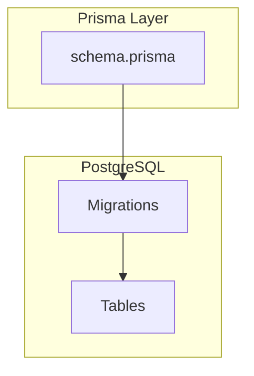
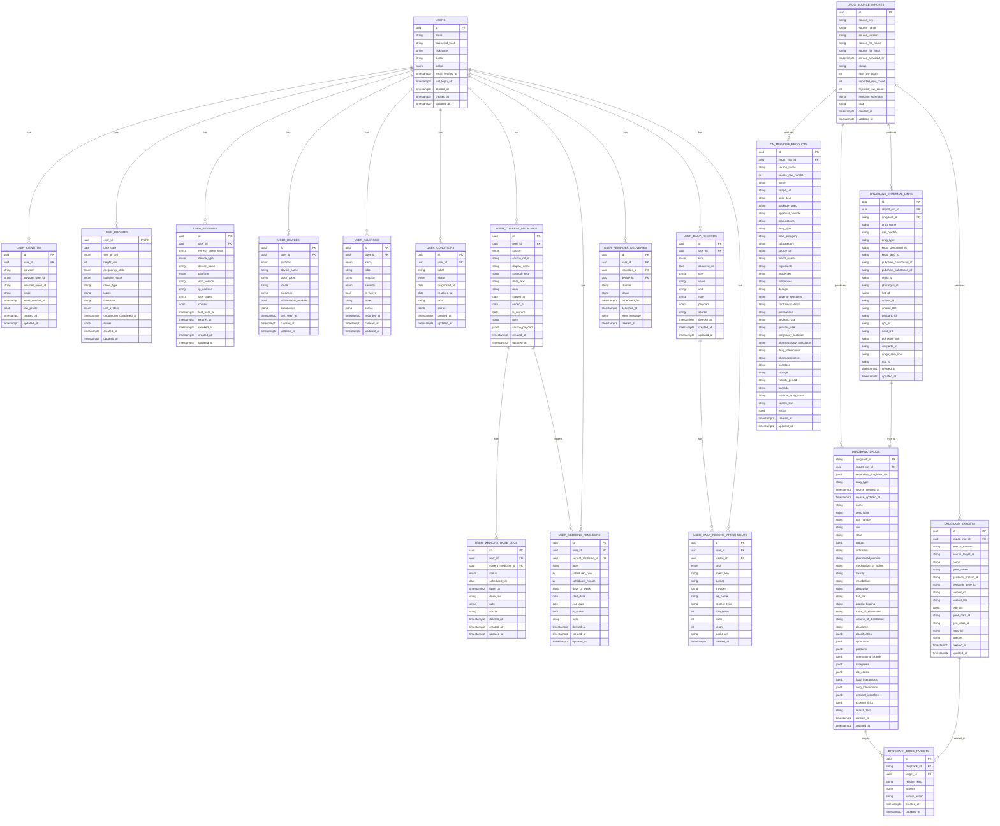
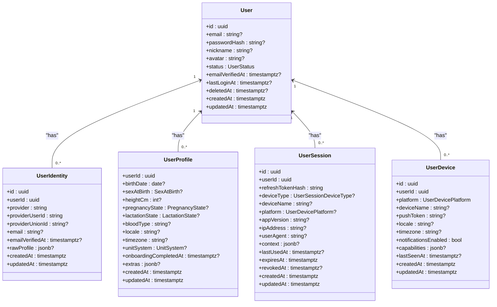
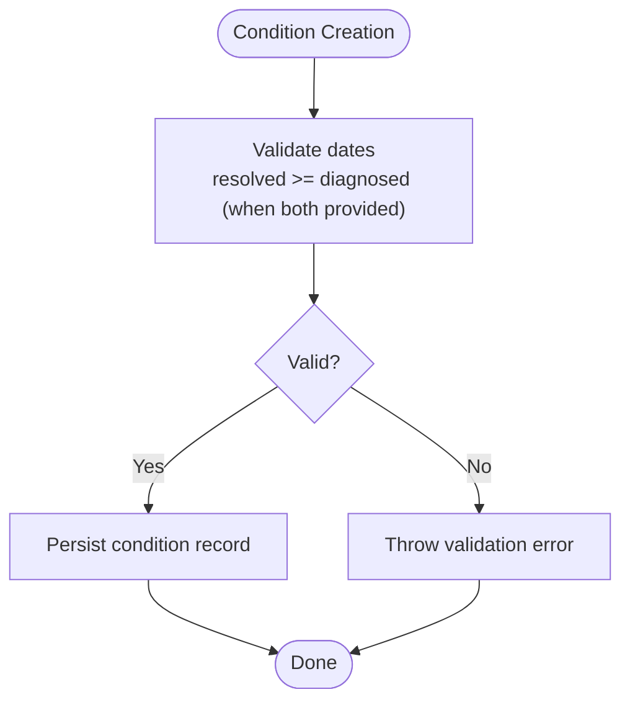
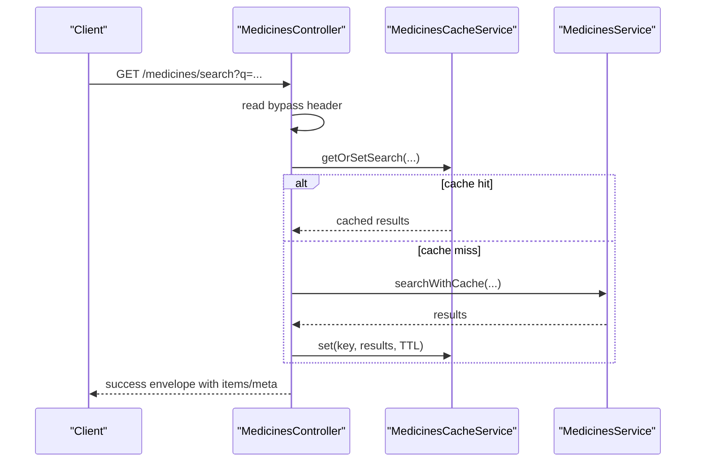
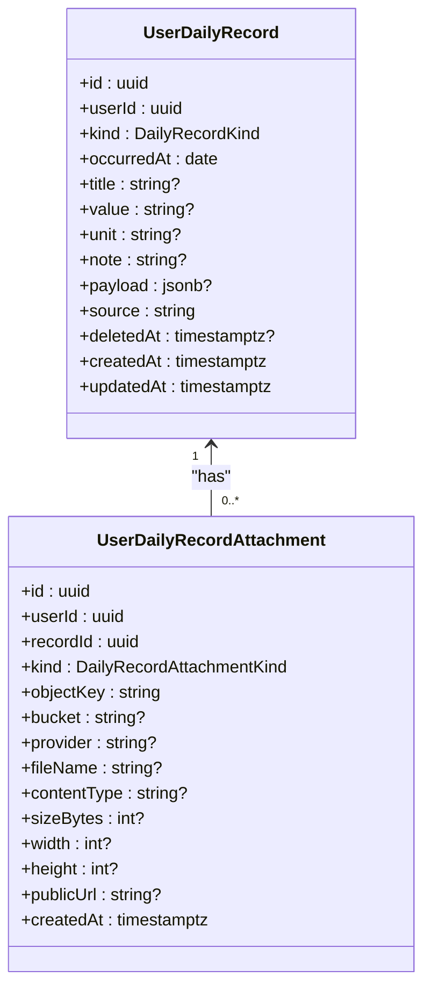
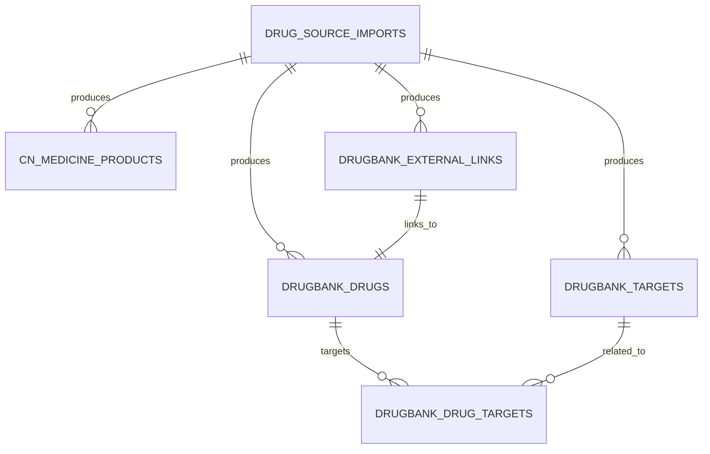
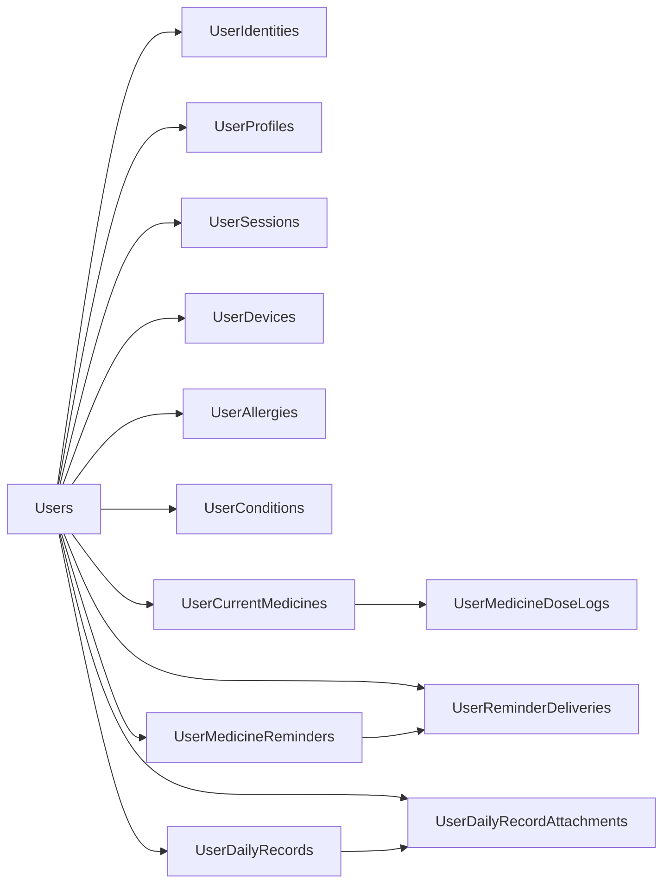

# Database Schema & Data Model

<cite>
**Referenced Files in This Document**
- [schema.prisma](file://Lucent/prisma/schema.prisma)
- [20260527131112_init/migration.sql](file://Lucent/prisma/migrations/20260527131112_init/migration.sql)
- [20260530183000_expand_user_domain/migration.sql](file://Lucent/prisma/migrations/20260530183000_expand_user_domain/migration.sql)
- [20260530233000_add_medicine_knowledge/migration.sql](file://Lucent/prisma/migrations/20260530233000_add_medicine_knowledge/migration.sql)
- [20260604000000_add_user_daily_records/migration.sql](file://Lucent/prisma/migrations/20260604000000_add_user_daily_records/migration.sql)
- [20260604010000_add_user_medicine_dose_logs/migration.sql](file://Lucent/prisma/migrations/20260604010000_add_user_medicine_dose_logs/migration.sql)
- [20260605153000_add_user_identities/migration.sql](file://Lucent/prisma/migrations/20260605153000_add_user_identities/migration.sql)
- [20260605160000_make_user_email_nullable/migration.sql](file://Lucent/prisma/migrations/20260605160000_make_user_email_nullable/migration.sql)
- [20260605161000_add_user_identity_union_id/migration.sql](file://Lucent/prisma/migrations/20260605161000_add_user_identity_union_id/migration.sql)
- [20260606133000_add_daily_record_attachments/migration.sql](file://Lucent/prisma/migrations/20260606133000_add_daily_record_attachments/migration.sql)
- [20260608193000_add_user_medicine_reminders/migration.sql](file://Lucent/prisma/migrations/20260608193000_add_user_medicine_reminders/migration.sql)
- [20260610093000_extend_medicine_reminders/migration.sql](file://Lucent/prisma/migrations/20260610093000_extend_medicine_reminders/migration.sql)
- [medicines-cache.constants.ts](file://Lucent/src/modules/medicines/cache/medicines-cache.constants.ts)
- [medicines-cache.service.ts](file://Lucent/src/modules/medicines/cache/medicines-cache.service.ts)
- [medicines.controller.ts](file://Lucent/src/modules/medicines/medicines.controller.ts)
- [medicine-reminders.service.ts](file://Lucent/src/modules/medicine-reminders/medicine-reminders.service.ts)
- [create-condition.dto.ts](file://Lucent/src/modules/user-health-context/dto/create-condition.dto.ts)
</cite>

## Table of Contents
1. [Introduction](#introduction)
2. [Project Structure](#project-structure)
3. [Core Components](#core-components)
4. [Architecture Overview](#architecture-overview)
5. [Detailed Component Analysis](#detailed-component-analysis)
6. [Dependency Analysis](#dependency-analysis)
7. [Performance Considerations](#performance-considerations)
8. [Troubleshooting Guide](#troubleshooting-guide)
9. [Conclusion](#conclusion)
10. [Appendices](#appendices)

## Introduction
This document provides comprehensive data model documentation for the Lumos database schema. It covers entity definitions, relationships, indexes, constraints, referential integrity, validation rules, and lifecycle management. It also documents caching strategies, performance optimization techniques, migration history, and operational considerations such as data retention and backup procedures. The schema is defined via Prisma and implemented through PostgreSQL migrations.

## Project Structure
The database schema is defined in Prisma and materialized by PostgreSQL migrations. The Prisma schema enumerates all domain models and their relations, while migrations capture the evolving physical structure of the database over time.

**Diagram sources**
- [schema.prisma:1-599](file://Lucent/prisma/schema.prisma#L1-L599)
- [20260527131112_init/migration.sql:1-35](file://Lucent/prisma/migrations/20260527131112_init/migration.sql#L1-L35)

**Section sources**
- [schema.prisma:1-599](file://Lucent/prisma/schema.prisma#L1-L599)

## Core Components
This section outlines the principal entities and their roles in the health and medication domain.

- Users
  - Purpose: Core identity and account holder.
  - Key attributes: identifiers, credentials, status, timestamps.
  - Relationships: profiles, identities, sessions, devices, allergies, conditions, current medicines, reminders, reminder deliveries, daily records, attachments, dose logs.
  - Indexes: email, status.
  - Constraints: unique email per active status window; cascading deletes on related entities.

- User Profiles
  - Purpose: Demographics, physiology, preferences.
  - Key attributes: birth date, sex at birth, height, pregnancy/lactation state, blood type, locale/timezone, units, onboarding completion, extras.
  - Constraints: height positive check.

- User Identities
  - Purpose: Multi-provider authentication linkage (e.g., OAuth).
  - Key attributes: provider, provider user id, union id, email, verified timestamp, raw profile.
  - Constraints: unique provider/provider user id; optional provider union id.

- User Sessions and Devices
  - Purpose: Device and session metadata for secure sessions.
  - Key attributes: refresh token hash, device type/platform, app version, IP/user agent, context, expiry/revocation, last used.
  - Constraints: unique refresh token hash; unique push token; indexed by user/device.

- Health Context (Allergies and Conditions)
  - Allergies: kind, label, reaction, severity, active flag, recorded timestamp.
  - Conditions: label, status, diagnosed/resolved dates, note/extras.
  - Constraints: condition date validity checks.

- Medications (Current Medicines, Dose Logs, Reminders)
  - Current Medicines: source, source ref id, display name, strength/dose text, route, start/end dates, current flag, note, source payload.
  - Dose Logs: status, scheduled date, taken timestamp, source, note.
  - Reminders: label, scheduled hour/minute, days of week (JSON array), start/end dates, active flag, note.
  - Delivery Tracking: reminder deliveries with channel/status/scheduling/timestamps.

- Daily Records and Attachments
  - Daily Records: kind, occurred date, title/value/unit/note/payload/source, deletion marker.
  - Attachments: image metadata and cloud object reference.

- Medicine Knowledge Base
  - Import metadata: source key/name/version/file info, status, counts, rejection summary.
  - CN Medicine Products: product catalog with approvals, ingredients, warnings, etc.
  - DrugBank Drugs: drug metadata, interactions, targets, identifiers.
  - Targets and Links: external identifiers and links.
  - Bridge table: drug-target relations.

**Section sources**
- [schema.prisma:106-599](file://Lucent/prisma/schema.prisma#L106-L599)

## Architecture Overview
The schema follows a relational model with JSONB for semi-structured fields and enums for controlled vocabularies. Entities are organized around the user-centric domain with explicit referential integrity and indexing for common queries.

**Diagram sources**
- [schema.prisma:106-599](file://Lucent/prisma/schema.prisma#L106-L599)

## Detailed Component Analysis

### Users and Authentication Domains
- Users
  - Primary key: id (UUID).
  - Notable indexes: email, status.
  - Cascading relations: identities, profiles, sessions, devices, allergies, conditions, current medicines, reminders, reminder deliveries, daily records, attachments, dose logs.
  - Business constraints: email uniqueness enforced with a partial unique index on active records; password hash may be null for non-local providers.

- User Identities
  - Composite unique constraint: provider + provider_user_id.
  - Optional provider_union_id for federated linking.
  - Indexed: user_id, provider_union_id, email.

- User Profiles
  - One-to-one with users via foreign key.
  - Validation: height_cm must be positive if provided.

- User Sessions and Devices
  - Unique constraints: refresh_token_hash, push_token.
  - Indexed: user-session by revocation/expiry; user-device by platform.

**Diagram sources**
- [schema.prisma:106-216](file://Lucent/prisma/schema.prisma#L106-L216)

**Section sources**
- [schema.prisma:106-216](file://Lucent/prisma/schema.prisma#L106-L216)
- [20260527131112_init/migration.sql:1-35](file://Lucent/prisma/migrations/20260527131112_init/migration.sql#L1-L35)
- [20260530183000_expand_user_domain/migration.sql:48-182](file://Lucent/prisma/migrations/20260530183000_expand_user_domain/migration.sql#L48-L182)
- [20260605153000_add_user_identities/migration.sql:1-22](file://Lucent/prisma/migrations/20260605153000_add_user_identities/migration.sql#L1-L22)
- [20260605160000_make_user_email_nullable/migration.sql:1-2](file://Lucent/prisma/migrations/20260605160000_make_user_email_nullable/migration.sql#L1-L2)
- [20260605161000_add_user_identity_union_id/migration.sql:1-4](file://Lucent/prisma/migrations/20260605161000_add_user_identity_union_id/migration.sql#L1-L4)

### Health Context: Allergies and Conditions
- User Allergies
  - Kind and severity enums; active flag; recorded timestamp.
  - Indexes: user+active.

- User Conditions
  - Status enum; diagnosed/resolved date range validation.
  - Indexes: user+status.

**Diagram sources**
- [20260530183000_expand_user_domain/migration.sql:132-148](file://Lucent/prisma/migrations/20260530183000_expand_user_domain/migration.sql#L132-L148)
- [create-condition.dto.ts:1-52](file://Lucent/src/modules/user-health-context/dto/create-condition.dto.ts#L1-L52)

**Section sources**
- [schema.prisma:218-252](file://Lucent/prisma/schema.prisma#L218-L252)
- [20260530183000_expand_user_domain/migration.sql:113-148](file://Lucent/prisma/migrations/20260530183000_expand_user_domain/migration.sql#L113-L148)
- [create-condition.dto.ts:1-52](file://Lucent/src/modules/user-health-context/dto/create-condition.dto.ts#L1-L52)

### Medications Domain
- User Current Medicines
  - Source enum supports multiple knowledge bases; source_ref_id links to external systems.
  - Date range validation: ended >= started (when both provided).
  - Indexes: user+current, user+source.

- User Medicine Dose Logs
  - Status enum; scheduled date; optional taken timestamp; source defaults to manual; deletion marker.
  - Indexes: user+scheduled, user+medicine, user+deleted.

- User Medicine Reminders
  - Scheduled time and days-of-week (JSON array); optional start/end dates; active flag; deletion marker.
  - Indexes: user+active, user+medicine, user+deleted, user+date window.

- Reminder Deliveries
  - Tracks delivery attempts by channel/status; scheduled and delivered timestamps; error messages.

**Diagram sources**
- [medicines.controller.ts:41-96](file://Lucent/src/modules/medicines/medicines.controller.ts#L41-L96)
- [medicines-cache.service.ts:45-83](file://Lucent/src/modules/medicines/cache/medicines-cache.service.ts#L45-L83)
- [medicines-cache.constants.ts:1-4](file://Lucent/src/modules/medicines/cache/medicines-cache.constants.ts#L1-L4)

**Section sources**
- [schema.prisma:254-352](file://Lucent/prisma/schema.prisma#L254-L352)
- [20260604010000_add_user_medicine_dose_logs/migration.sql:1-36](file://Lucent/prisma/migrations/20260604010000_add_user_medicine_dose_logs/migration.sql#L1-L36)
- [20260608193000_add_user_medicine_reminders/migration.sql:1-27](file://Lucent/prisma/migrations/20260608193000_add_user_medicine_reminders/migration.sql#L1-L27)
- [20260610093000_extend_medicine_reminders/migration.sql:1-31](file://Lucent/prisma/migrations/20260610093000_extend_medicine_reminders/migration.sql#L1-L31)
- [medicines.controller.ts:41-96](file://Lucent/src/modules/medicines/medicines.controller.ts#L41-L96)
- [medicines-cache.service.ts:45-83](file://Lucent/src/modules/medicines/cache/medicines-cache.service.ts#L45-L83)
- [medicines-cache.constants.ts:1-4](file://Lucent/src/modules/medicines/cache/medicines-cache.constants.ts#L1-L4)

### Daily Records and Attachments
- User Daily Records
  - Kind enum supports water, meal, vital signs, mood, symptoms, activity, notes.
  - Indexes: user+occurrence date, user+kind, user+deleted.

- User Daily Record Attachments
  - Image attachment metadata; cloud object key; optional provider/bucket; dimensions and content type; public URL.

**Diagram sources**
- [schema.prisma:354-397](file://Lucent/prisma/schema.prisma#L354-L397)
- [20260604000000_add_user_daily_records/migration.sql:1-34](file://Lucent/prisma/migrations/20260604000000_add_user_daily_records/migration.sql#L1-L34)
- [20260606133000_add_daily_record_attachments/migration.sql:1-32](file://Lucent/prisma/migrations/20260606133000_add_daily_record_attachments/migration.sql#L1-L32)

**Section sources**
- [schema.prisma:354-397](file://Lucent/prisma/schema.prisma#L354-L397)
- [20260604000000_add_user_daily_records/migration.sql:1-34](file://Lucent/prisma/migrations/20260604000000_add_user_daily_records/migration.sql#L1-L34)
- [20260606133000_add_daily_record_attachments/migration.sql:1-32](file://Lucent/prisma/migrations/20260606133000_add_daily_record_attachments/migration.sql#L1-L32)

### Medicine Knowledge Base
- Import Metadata
  - Tracks source key/name/version, file info, export timestamp, status, counts, rejection summary, note.
  - Index: source key + creation time.

- CN Medicine Products
  - Product catalog with approvals, ingredients, warnings, dosages, storage, validity, identifiers, search text.
  - Indexes: name, approval number, manufacturer, barcode, national drug code, search text.

- DrugBank Drugs
  - Comprehensive drug metadata, interactions, identifiers, categories, ATC codes, external links, search text.
  - Indexes: name, CAS number, UNII, search text.

- External Links and Targets
  - External identifiers and links; targets with gene/protein ids, PDB ids, species.
  - Unique constraints on target dataset+id pairs; unique bridge key on drug/target/relation.

- Drug-Target Relations
  - Bridge table linking drugs to targets with relation kind and actions.

**Diagram sources**
- [schema.prisma:399-599](file://Lucent/prisma/schema.prisma#L399-L599)
- [20260530233000_add_medicine_knowledge/migration.sql:1-273](file://Lucent/prisma/migrations/20260530233000_add_medicine_knowledge/migration.sql#L1-L273)

**Section sources**
- [schema.prisma:399-599](file://Lucent/prisma/schema.prisma#L399-L599)
- [20260530233000_add_medicine_knowledge/migration.sql:1-273](file://Lucent/prisma/migrations/20260530233000_add_medicine_knowledge/migration.sql#L1-L273)

## Dependency Analysis
- Referential Integrity
  - All relations define cascade deletes from user to child entities.
  - Some foreign keys use SET NULL to decouple when parent records are removed (e.g., reminder’s current medicine, dose log’s current medicine, attachment’s record).

- Indexes and Cardinality
  - High-selectivity fields (e.g., email, refresh token hash, push token) are unique-indexed.
  - Composite indexes optimize frequent queries (user+status, user+active, user+occurrence date, user+kind, user+deleted, user+medicine, user+date window).

- Enumerations
  - Centralized enums reduce data inconsistency and simplify validation.

**Diagram sources**
- [schema.prisma:106-599](file://Lucent/prisma/schema.prisma#L106-L599)

**Section sources**
- [schema.prisma:106-599](file://Lucent/prisma/schema.prisma#L106-L599)

## Performance Considerations
- Caching Strategy
  - Medicines search and detail results are cached with distinct TTLs.
  - Cache keys are hierarchical and include source, query, pagination, and encoded terms.
  - An admin service can enumerate and invalidate caches for the medicines domain.

- Cache Control
  - Controllers expose a bypass header to skip cache for specific requests.

- Index Utilization
  - Queries commonly filter by user id combined with time-based or categorical fields; composite indexes align with these patterns.

- Data Types
  - JSONB fields support flexible payloads without schema rigidity; however, avoid overusing for frequently joined or filtered columns.

**Section sources**
- [medicines-cache.constants.ts:1-4](file://Lucent/src/modules/medicines/cache/medicines-cache.constants.ts#L1-L4)
- [medicines-cache.service.ts:45-83](file://Lucent/src/modules/medicines/cache/medicines-cache.service.ts#L45-L83)
- [medicines.controller.ts:41-96](file://Lucent/src/modules/medicines/medicines.controller.ts#L41-L96)

## Troubleshooting Guide
- Validation Failures
  - Condition date window validation prevents invalid resolved-before-diagnosed scenarios.
  - Reminder days-of-week normalization rejects empty arrays and ensures numeric integrity.

- Common Issues
  - Email uniqueness conflicts: ensure unique constraints are respected for active users.
  - Reminder scheduling: confirm start/end dates and days-of-week are valid.

**Section sources**
- [20260530183000_expand_user_domain/migration.sql:132-148](file://Lucent/prisma/migrations/20260530183000_expand_user_domain/migration.sql#L132-L148)
- [medicine-reminders.service.ts:177-217](file://Lucent/src/modules/medicine-reminders/medicine-reminders.service.ts#L177-L217)

## Conclusion
The Lumos schema is designed around a user-centric health and medication domain with strong referential integrity, controlled vocabularies via enums, and strategic indexing. The addition of a robust caching layer for medicine knowledge improves read performance. Migrations document a clear evolution path, enabling safe schema changes over time.

## Appendices

### Migration History and Evolution
- Initial users and refresh tokens.
- Expanded user domain with profiles, sessions, devices, allergies, conditions, current medicines.
- Introduced medicine knowledge base (imports, CN products, DrugBank drugs, targets, links).
- Added daily records and attachments.
- Added dose logs and reminders; extended reminders with date windows and delivery tracking.

**Section sources**
- [20260527131112_init/migration.sql:1-35](file://Lucent/prisma/migrations/20260527131112_init/migration.sql#L1-L35)
- [20260530183000_expand_user_domain/migration.sql:1-182](file://Lucent/prisma/migrations/20260530183000_expand_user_domain/migration.sql#L1-L182)
- [20260530233000_add_medicine_knowledge/migration.sql:1-273](file://Lucent/prisma/migrations/20260530233000_add_medicine_knowledge/migration.sql#L1-L273)
- [20260604000000_add_user_daily_records/migration.sql:1-34](file://Lucent/prisma/migrations/20260604000000_add_user_daily_records/migration.sql#L1-L34)
- [20260604010000_add_user_medicine_dose_logs/migration.sql:1-36](file://Lucent/prisma/migrations/20260604010000_add_user_medicine_dose_logs/migration.sql#L1-L36)
- [20260605153000_add_user_identities/migration.sql:1-22](file://Lucent/prisma/migrations/20260605153000_add_user_identities/migration.sql#L1-L22)
- [20260605160000_make_user_email_nullable/migration.sql:1-2](file://Lucent/prisma/migrations/20260605160000_make_user_email_nullable/migration.sql#L1-L2)
- [20260605161000_add_user_identity_union_id/migration.sql:1-4](file://Lucent/prisma/migrations/20260605161000_add_user_identity_union_id/migration.sql#L1-L4)
- [20260606133000_add_daily_record_attachments/migration.sql:1-32](file://Lucent/prisma/migrations/20260606133000_add_daily_record_attachments/migration.sql#L1-L32)
- [20260608193000_add_user_medicine_reminders/migration.sql:1-27](file://Lucent/prisma/migrations/20260608193000_add_user_medicine_reminders/migration.sql#L1-L27)
- [20260610093000_extend_medicine_reminders/migration.sql:1-31](file://Lucent/prisma/migrations/20260610093000_extend_medicine_reminders/migration.sql#L1-L31)

### Data Lifecycle Management
- Deletion markers: deleted_at on daily records, dose logs, reminders enable soft-deletion semantics.
- Cascading deletes preserve referential integrity when user records are removed.
- Partial unique index on email ensures uniqueness among active users.

**Section sources**
- [schema.prisma:354-352](file://Lucent/prisma/schema.prisma#L354-L352)
- [20260527131112_init/migration.sql:43-46](file://Lucent/prisma/migrations/20260527131112_init/migration.sql#L43-L46)

### Data Access Patterns
- Frequent queries include user-scoped lists by date/kind/status; composite indexes support these.
- Medicine search/detail reads are cached to reduce database load.

**Section sources**
- [schema.prisma:354-397](file://Lucent/prisma/schema.prisma#L354-L397)
- [medicines-cache.service.ts:45-83](file://Lucent/src/modules/medicines/cache/medicines-cache.service.ts#L45-L83)

### Security and Privacy
- Password hashes stored for local accounts; non-local providers may not require password hashes.
- Session refresh token hash is unique and indexed; sessions track device/platform/context and expiry/revocation.
- Sensitive health data is scoped under user ownership with cascading deletes upon user removal.

**Section sources**
- [schema.prisma:106-216](file://Lucent/prisma/schema.prisma#L106-L216)