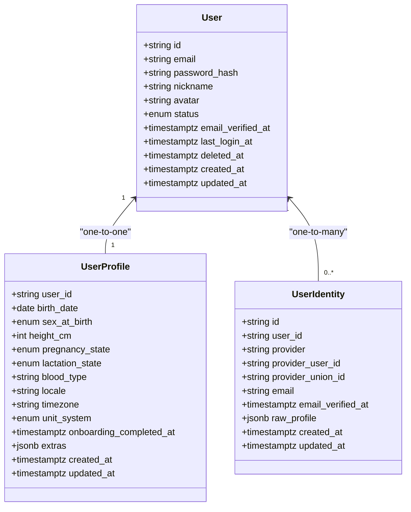
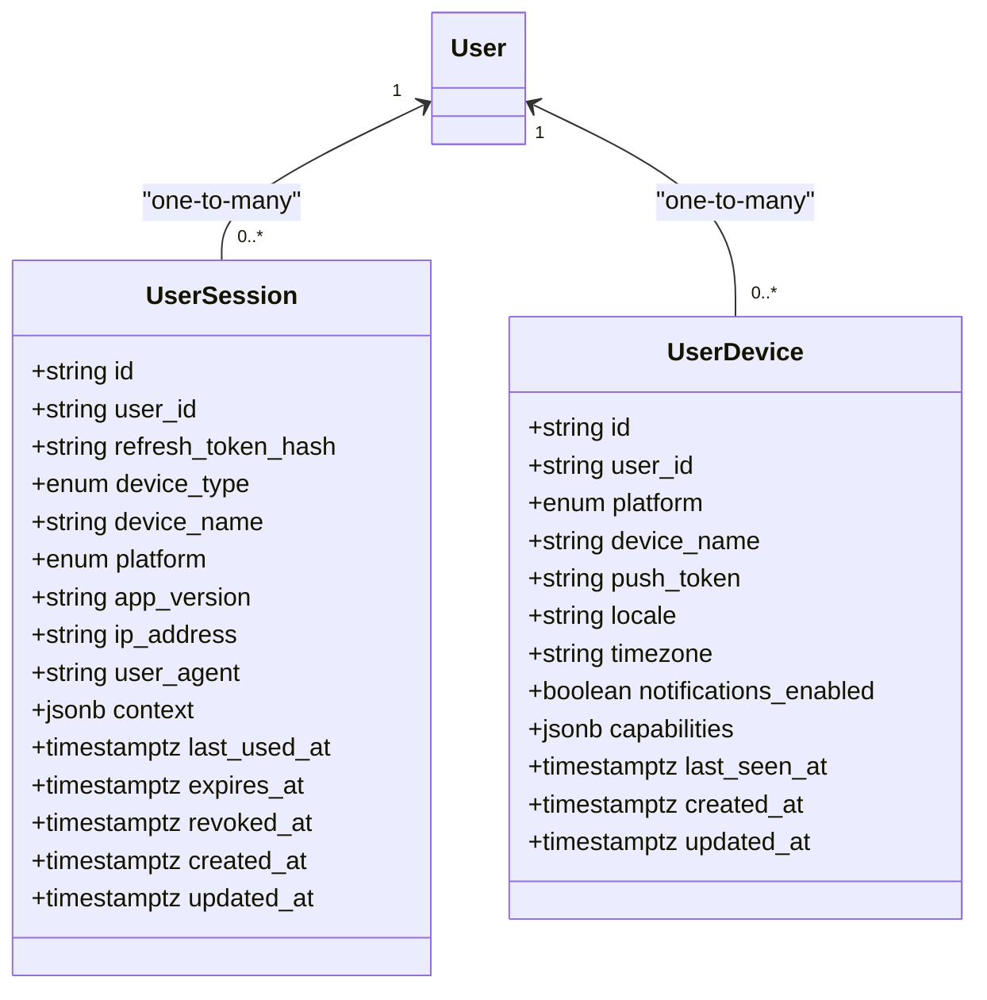
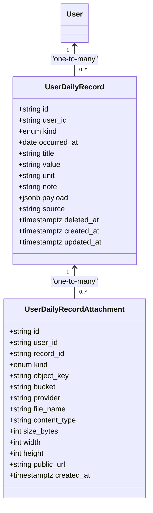
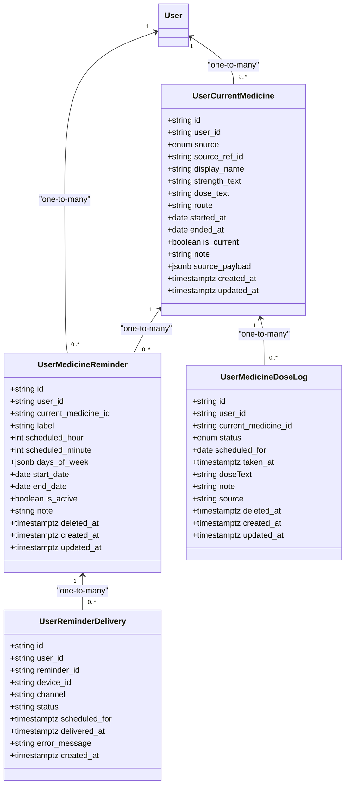
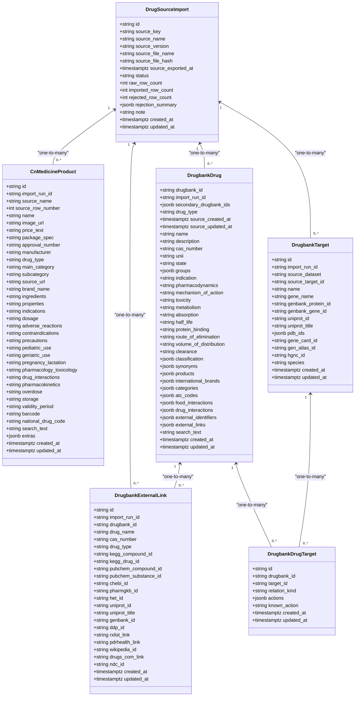
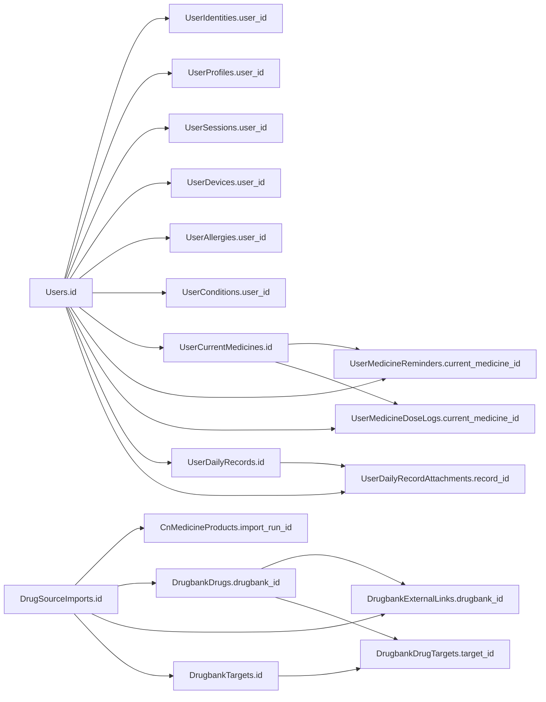

# Entity Relationship Diagram

<cite>
**Referenced Files in This Document**
- [schema.prisma](file://Lucent/prisma/schema.prisma)
- [20260527131112_init/migration.sql](file://Lucent/prisma/migrations/20260527131112_init/migration.sql)
- [20260530183000_expand_user_domain/migration.sql](file://Lucent/prisma/migrations/20260530183000_expand_user_domain/migration.sql)
- [20260530233000_add_medicine_knowledge/migration.sql](file://Lucent/prisma/migrations/20260530233000_add_medicine_knowledge/migration.sql)
- [20260604000000_add_user_daily_records/migration.sql](file://Lucent/prisma/migrations/20260604000000_add_user_daily_records/migration.sql)
- [20260604010000_add_user_medicine_dose_logs/migration.sql](file://Lucent/prisma/migrations/20260604010000_add_user_medicine_dose_logs/migration.sql)
- [20260605153000_add_user_identities/migration.sql](file://Lucent/prisma/migrations/20260605153000_add_user_identities/migration.sql)
- [20260605160000_make_user_email_nullable/migration.sql](file://Lucent/prisma/migrations/20260605160000_make_user_email_nullable/migration.sql)
- [20260605161000_add_user_identity_union_id/migration.sql](file://Lucent/prisma/migrations/20260605161000_add_user_identity_union_id/migration.sql)
- [20260606133000_add_daily_record_attachments/migration.sql](file://Lucent/prisma/migrations/20260606133000_add_daily_record_attachments/migration.sql)
- [20260608193000_add_user_medicine_reminders/migration.sql](file://Lucent/prisma/migrations/20260608193000_add_user_medicine_reminders/migration.sql)
- [20260610093000_extend_medicine_reminders/migration.sql](file://Lucent/prisma/migrations/20260610093000_extend_medicine_reminders/migration.sql)
</cite>

## Table of Contents
1. [Introduction](#introduction)
2. [Project Structure](#project-structure)
3. [Core Components](#core-components)
4. [Architecture Overview](#architecture-overview)
5. [Detailed Component Analysis](#detailed-component-analysis)
6. [Dependency Analysis](#dependency-analysis)
7. [Performance Considerations](#performance-considerations)
8. [Troubleshooting Guide](#troubleshooting-guide)
9. [Conclusion](#conclusion)

## Introduction
This document presents a comprehensive entity relationship (ER) model for the Lumos database schema. It focuses on the core domains of users, identities, profiles, sessions, devices, health data (daily records and attachments), medications (current medicines, reminders, and dose logs), and system configurations (drug knowledge base). The ER model documents primary keys, foreign keys, referential integrity constraints, cascade behaviors, and indexing strategies derived from the Prisma schema and migration history.

## Project Structure
The database schema is defined declaratively via Prisma and evolved through PostgreSQL migrations. The Prisma schema defines models, relations, enums, and indexes. Migrations capture the historical evolution of the schema and enforce referential constraints at the SQL level.

```mermaid
graph TB
subgraph "Prisma Schema"
PRISMA["schema.prisma"]
end
subgraph "Migrations"
M_INIT["20260527131112_init<br/>Initial users & refresh tokens"]
M_EXPAND["20260530183000_expand_user_domain<br/>Users expanded"]
M_MED_KNOWLEDGE["20260530233000_add_medicine_knowledge<br/>Drug knowledge base"]
M_DAILY["20260604000000_add_user_daily_records<br/>Daily records"]
M_DOSE_LOGS["20260604010000_add_user_medicine_dose_logs<br/>Dose logs"]
M_IDENTITIES["20260605153000_add_user_identities<br/>Identities"]
M_EMAIL_NULL["20260605160000_make_user_email_nullable<br/>Email nullable"]
M_UNION_ID["20260605161000_add_user_identity_union_id<br/>Union ID"]
M_ATTACH["20260606133000_add_daily_record_attachments<br/>Attachments"]
M_REMINDERS["20260608193000_add_user_medicine_reminders<br/>Reminders"]
M_REM_EXT["20260610093000_extend_medicine_reminders<br/>Reminder deliveries"]
end
PRISMA --> M_INIT
PRISMA --> M_EXPAND
PRISMA --> M_MED_KNOWLEDGE
PRISMA --> M_DAILY
PRISMA --> M_DOSE_LOGS
PRISMA --> M_IDENTITIES
PRISMA --> M_EMAIL_NULL
PRISMA --> M_UNION_ID
PRISMA --> M_ATTACH
PRISMA --> M_REMINDERS
PRISMA --> M_REM_EXT
```

**Diagram sources**
- [schema.prisma:1-599](file://Lucent/prisma/schema.prisma#L1-L599)
- [20260527131112_init/migration.sql:1-35](file://Lucent/prisma/migrations/20260527131112_init/migration.sql#L1-L35)
- [20260530183000_expand_user_domain/migration.sql:1-182](file://Lucent/prisma/migrations/20260530183000_expand_user_domain/migration.sql#L1-L182)
- [20260530233000_add_medicine_knowledge/migration.sql:1-273](file://Lucent/prisma/migrations/20260530233000_add_medicine_knowledge/migration.sql#L1-L273)
- [20260604000000_add_user_daily_records/migration.sql:1-34](file://Lucent/prisma/migrations/20260604000000_add_user_daily_records/migration.sql#L1-L34)
- [20260604010000_add_user_medicine_dose_logs/migration.sql:1-36](file://Lucent/prisma/migrations/20260604010000_add_user_medicine_dose_logs/migration.sql#L1-L36)
- [20260605153000_add_user_identities/migration.sql:1-22](file://Lucent/prisma/migrations/20260605153000_add_user_identities/migration.sql#L1-L22)
- [20260605160000_make_user_email_nullable/migration.sql:1-2](file://Lucent/prisma/migrations/20260605160000_make_user_email_nullable/migration.sql#L1-L2)
- [20260605161000_add_user_identity_union_id/migration.sql:1-4](file://Lucent/prisma/migrations/20260605161000_add_user_identity_union_id/migration.sql#L1-L4)
- [20260606133000_add_daily_record_attachments/migration.sql:1-32](file://Lucent/prisma/migrations/20260606133000_add_daily_record_attachments/migration.sql#L1-L32)
- [20260608193000_add_user_medicine_reminders/migration.sql:1-27](file://Lucent/prisma/migrations/20260608193000_add_user_medicine_reminders/migration.sql#L1-L27)
- [20260610093000_extend_medicine_reminders/migration.sql:1-31](file://Lucent/prisma/migrations/20260610093000_extend_medicine_reminders/migration.sql#L1-L31)

**Section sources**
- [schema.prisma:1-599](file://Lucent/prisma/schema.prisma#L1-L599)

## Core Components
This section summarizes the principal entities and their roles in the Lumos schema.

- Users: Central identity and account holder with lifecycle and audit fields.
- Identities: Multi-provider identity linkage to users (e.g., OAuth).
- Profiles: Demographics and preferences bound to users.
- Sessions: Device-bound authentication sessions with refresh token hashing.
- Devices: Push notification-capable devices registered per user.
- Health Data: Daily records and attachments for self-reported and structured health entries.
- Medications: Current medicines, reminders, and dose logs for medication adherence.
- Drug Knowledge Base: Imported external medicine catalogs and targets.

Primary keys and foreign keys are enforced by Prisma relations and SQL constraints. Indexes optimize frequent queries by user, date ranges, and active flags.

**Section sources**
- [schema.prisma:106-397](file://Lucent/prisma/schema.prisma#L106-L397)
- [20260527131112_init/migration.sql:1-35](file://Lucent/prisma/migrations/20260527131112_init/migration.sql#L1-L35)
- [20260530183000_expand_user_domain/migration.sql:48-182](file://Lucent/prisma/migrations/20260530183000_expand_user_domain/migration.sql#L48-L182)
- [20260604000000_add_user_daily_records/migration.sql:4-34](file://Lucent/prisma/migrations/20260604000000_add_user_daily_records/migration.sql#L4-L34)
- [20260604010000_add_user_medicine_dose_logs/migration.sql:4-36](file://Lucent/prisma/migrations/20260604010000_add_user_medicine_dose_logs/migration.sql#L4-L36)
- [20260608193000_add_user_medicine_reminders/migration.sql:1-27](file://Lucent/prisma/migrations/20260608193000_add_user_medicine_reminders/migration.sql#L1-L27)
- [20260610093000_extend_medicine_reminders/migration.sql:7-31](file://Lucent/prisma/migrations/20260610093000_extend_medicine_reminders/migration.sql#L7-L31)

## Architecture Overview
The ER model centers around the Users entity and connects to related domains through foreign keys. The schema enforces referential integrity with cascading deletes for user-dependent entities and set-null semantics for optional parent-child relationships.

```mermaid
erDiagram
USERS {
string id PK
string email
string password_hash
string nickname
string avatar
enum status
timestamptz email_verified_at
timestamptz last_login_at
timestamptz deleted_at
timestamptz created_at
timestamptz updated_at
}
USER_IDENTITIES {
string id PK
string user_id FK
string provider
string provider_user_id
string provider_union_id
string email
timestamptz email_verified_at
jsonb raw_profile
timestamptz created_at
timestamptz updated_at
}
USER_PROFILES {
string user_id PK,FK
date birth_date
enum sex_at_birth
int height_cm
enum pregnancy_state
enum lactation_state
string blood_type
string locale
string timezone
enum unit_system
timestamptz onboarding_completed_at
jsonb extras
timestamptz created_at
timestamptz updated_at
}
USER_SESSIONS {
string id PK
string user_id FK
string refresh_token_hash UK
enum device_type
string device_name
enum platform
string app_version
string ip_address
string user_agent
jsonb context
timestamptz last_used_at
timestamptz expires_at
timestamptz revoked_at
timestamptz created_at
timestamptz updated_at
}
USER_DEVICES {
string id PK
string user_id FK
enum platform
string device_name
string push_token UK
string locale
string timezone
boolean notifications_enabled
jsonb capabilities
timestamptz last_seen_at
timestamptz created_at
timestamptz updated_at
}
USER_ALLERGIES {
string id PK
string user_id FK
enum kind
string label
string reaction
enum severity
boolean is_active
string note
jsonb extras
timestamptz recorded_at
timestamptz created_at
timestamptz updated_at
}
USER_CONDITIONS {
string id PK
string user_id FK
string label
enum status
date diagnosed_at
date resolved_at
string note
jsonb extras
timestamptz created_at
timestamptz updated_at
}
USER_CURRENT_MEDICINES {
string id PK
string user_id FK
enum source
string source_ref_id
string display_name
string strength_text
string dose_text
string route
date started_at
date ended_at
boolean is_current
string note
jsonb source_payload
timestamptz created_at
timestamptz updated_at
}
USER_MEDICINE_REMINDERS {
string id PK
string user_id FK
string current_medicine_id FK
string label
int scheduled_hour
int scheduled_minute
jsonb days_of_week
date start_date
date end_date
boolean is_active
string note
timestamptz deleted_at
timestamptz created_at
timestamptz updated_at
}
USER_REMINDER_DELIVERIES {
string id PK
string user_id FK
string reminder_id FK
string device_id
string channel
string status
timestamptz scheduled_for
timestamptz delivered_at
string error_message
timestamptz created_at
}
USER_MEDICINE_DOSE_LOGS {
string id PK
string user_id FK
string current_medicine_id FK
enum status
date scheduled_for
timestamptz taken_at
string doseText
string note
string source
timestamptz deleted_at
timestamptz created_at
timestamptz updated_at
}
USER_DAILY_RECORDS {
string id PK
string user_id FK
enum kind
date occurred_at
string title
string value
string unit
string note
jsonb payload
string source
timestamptz deleted_at
timestamptz created_at
timestamptz updated_at
}
USER_DAILY_RECORD_ATTACHMENTS {
string id PK
string user_id FK
string record_id FK
enum kind
string object_key
string bucket
string provider
string file_name
string content_type
int size_bytes
int width
int height
string public_url
timestamptz created_at
}
DRUG_SOURCE_IMPORTS {
string id PK
string source_key
string source_name
string source_version
string source_file_name
string source_file_hash
timestamptz source_exported_at
string status
int raw_row_count
int imported_row_count
int rejected_row_count
jsonb rejection_summary
string note
timestamptz created_at
timestamptz updated_at
}
CN_MEDICINE_PRODUCTS {
string id PK
string import_run_id FK
string source_name
int source_row_number
string name
string image_url
string price_text
string package_spec
string approval_number
string manufacturer
string drug_type
string main_category
string subcategory
string source_url
string brand_name
string ingredients
string properties
string indications
string dosage
string adverse_reactions
string contraindications
string precautions
string pediatric_use
string geriatric_use
string pregnancy_lactation
string pharmacology_toxicology
string drug_interactions
string pharmacokinetics
string overdose
string storage
string validity_period
string barcode
string national_drug_code
string search_text
jsonb extras
timestamptz created_at
timestamptz updated_at
}
DRUGBANK_DRUGS {
string drugbank_id PK
string import_run_id FK
jsonb secondary_drugbank_ids
string drug_type
timestamptz source_created_at
timestamptz source_updated_at
string name
string description
string cas_number
string unii
string state
jsonb groups
string indication
string pharmacodynamics
string mechanism_of_action
string toxicity
string metabolism
string absorption
string half_life
string protein_binding
string route_of_elimination
string volume_of_distribution
string clearance
jsonb classification
jsonb synonyms
jsonb products
jsonb international_brands
jsonb categories
jsonb atc_codes
jsonb food_interactions
jsonb drug_interactions
jsonb external_identifiers
jsonb external_links
string search_text
timestamptz created_at
timestamptz updated_at
}
DRUGBANK_EXTERNAL_LINKS {
string id PK
string import_run_id FK
string drugbank_id FK
string drug_name
string cas_number
string drug_type
string kegg_compound_id
string kegg_drug_id
string pubchem_compound_id
string pubchem_substance_id
string chebi_id
string pharmgkb_id
string het_id
string uniprot_id
string uniprot_title
string genbank_id
string ddp_id
string rxlist_link
string pdrhealth_link
string wikipedia_id
string drugs_com_link
string ndc_id
timestamptz created_at
timestamptz updated_at
}
DRUGBANK_TARGETS {
string id PK
string import_run_id FK
string source_dataset
string source_target_id
string name
string gene_name
string genbank_protein_id
string genbank_gene_id
string uniprot_id
string uniprot_title
jsonb pdb_ids
string gene_card_id
string gen_atlas_id
string hgnc_id
string species
timestamptz created_at
timestamptz updated_at
}
DRUGBANK_DRUG_TARGETS {
string id PK
string drugbank_id FK
string target_id FK
string relation_kind
jsonb actions
string known_action
timestamptz created_at
timestamptz updated_at
}
USERS ||--o{ USER_IDENTITIES : "has"
USERS ||--o{ USER_PROFILES : "has"
USERS ||--o{ USER_SESSIONS : "has"
USERS ||--o{ USER_DEVICES : "has"
USERS ||--o{ USER_ALLERGIES : "has"
USERS ||--o{ USER_CONDITIONS : "has"
USERS ||--o{ USER_CURRENT_MEDITACES : "has"
USERS ||--o{ USER_MEDICINE_REMINDERS : "has"
USERS ||--o{ USER_MEDICINE_DOSE_LOGS : "has"
USERS ||--o{ USER_DAILY_RECORDS : "has"
USERS ||--o{ USER_DAILY_RECORD_ATTACHMENTS : "has"
USER_CURRENT_MEDITACES ||--o{ USER_MEDICINE_REMINDERS : "generates"
USER_CURRENT_MEDITACES ||--o{ USER_MEDICINE_DOSE_LOGS : "generates"
USER_DAILY_RECORDS ||--o{ USER_DAILY_RECORD_ATTACHMENTS : "has"
DRUG_SOURCE_IMPORTS ||--o{ CN_MEDICINE_PRODUCTS : "sources"
DRUG_SOURCE_IMPORTS ||--o{ DRUGBANK_DRUGS : "sources"
DRUG_SOURCE_IMPORTS ||--o{ DRUGBANK_EXTERNAL_LINKS : "sources"
DRUG_SOURCE_IMPORTS ||--o{ DRUGBANK_TARGETS : "sources"
DRUGBANK_DRUGS ||--o{ DRUGBANK_EXTERNAL_LINKS : "has"
DRUGBANK_DRUGS ||--o{ DRUGBANK_DRUG_TARGETS : "has"
DRUGBANK_TARGETS ||--o{ DRUGBANK_DRUG_TARGETS : "has"
```

**Diagram sources**
- [schema.prisma:106-397](file://Lucent/prisma/schema.prisma#L106-L397)
- [20260530233000_add_medicine_knowledge/migration.sql:4-273](file://Lucent/prisma/migrations/20260530233000_add_medicine_knowledge/migration.sql#L4-L273)

## Detailed Component Analysis

### Users and Identities
- One-to-one: Users to Profiles via profile’s composite key referencing user id.
- One-to-many: Users to Identities, Sessions, Devices, Allergies, Conditions, Current Medicines, Reminders, Dose Logs, Daily Records, Attachments.
- Cascade delete: All dependent entities inherit onDelete: Cascade from relations.

**Diagram sources**
- [schema.prisma:106-174](file://Lucent/prisma/schema.prisma#L106-L174)
- [20260530183000_expand_user_domain/migration.sql:48-67](file://Lucent/prisma/migrations/20260530183000_expand_user_domain/migration.sql#L48-L67)
- [20260605153000_add_user_identities/migration.sql:3-21](file://Lucent/prisma/migrations/20260605153000_add_user_identities/migration.sql#L3-L21)

**Section sources**
- [schema.prisma:106-174](file://Lucent/prisma/schema.prisma#L106-L174)
- [20260605153000_add_user_identities/migration.sql:1-22](file://Lucent/prisma/migrations/20260605153000_add_user_identities/migration.sql#L1-L22)
- [20260605160000_make_user_email_nullable/migration.sql:1-2](file://Lucent/prisma/migrations/20260605160000_make_user_email_nullable/migration.sql#L1-L2)
- [20260605161000_add_user_identity_union_id/migration.sql:1-4](file://Lucent/prisma/migrations/20260605161000_add_user_identity_union_id/migration.sql#L1-L4)

### Sessions and Devices
- Sessions: Hashed refresh tokens with device/platform metadata and expiry.
- Devices: Push tokens and capability metadata per platform.

**Diagram sources**
- [schema.prisma:176-216](file://Lucent/prisma/schema.prisma#L176-L216)
- [20260530183000_expand_user_domain/migration.sql:69-112](file://Lucent/prisma/migrations/20260530183000_expand_user_domain/migration.sql#L69-L112)

**Section sources**
- [schema.prisma:176-216](file://Lucent/prisma/schema.prisma#L176-L216)

### Health Data: Daily Records and Attachments
- Daily records capture structured or free-form entries by kind and date.
- Attachments link media to specific daily records.

**Diagram sources**
- [schema.prisma:354-397](file://Lucent/prisma/schema.prisma#L354-L397)
- [20260604000000_add_user_daily_records/migration.sql:4-34](file://Lucent/prisma/migrations/20260604000000_add_user_daily_records/migration.sql#L4-L34)
- [20260606133000_add_daily_record_attachments/migration.sql:4-32](file://Lucent/prisma/migrations/20260606133000_add_daily_record_attachments/migration.sql#L4-L32)

**Section sources**
- [schema.prisma:354-397](file://Lucent/prisma/schema.prisma#L354-L397)

### Medications: Current Medicines, Reminders, Dose Logs, Deliveries
- Current medicines represent ongoing therapies.
- Reminders schedule doses with recurrence rules and date bounds.
- Dose logs track adherence with status and timing.
- Deliveries track notification attempts.

**Diagram sources**
- [schema.prisma:254-352](file://Lucent/prisma/schema.prisma#L254-L352)
- [20260608193000_add_user_medicine_reminders/migration.sql:1-27](file://Lucent/prisma/migrations/20260608193000_add_user_medicine_reminders/migration.sql#L1-L27)
- [20260610093000_extend_medicine_reminders/migration.sql:7-31](file://Lucent/prisma/migrations/20260610093000_extend_medicine_reminders/migration.sql#L7-L31)

**Section sources**
- [schema.prisma:254-352](file://Lucent/prisma/schema.prisma#L254-L352)

### Drug Knowledge Base
- Import runs track external dataset ingestion.
- Products and drugs represent curated medicine catalogs.
- External links and targets connect to external identifiers and protein targets.
- Many-to-many between drugs and targets via junction table.

**Diagram sources**
- [schema.prisma:399-598](file://Lucent/prisma/schema.prisma#L399-L598)
- [20260530233000_add_medicine_knowledge/migration.sql:4-273](file://Lucent/prisma/migrations/20260530233000_add_medicine_knowledge/migration.sql#L4-L273)

**Section sources**
- [schema.prisma:399-598](file://Lucent/prisma/schema.prisma#L399-L598)

## Dependency Analysis
This section maps referential dependencies and cascade behaviors across entities.

**Diagram sources**
- [schema.prisma:106-397](file://Lucent/prisma/schema.prisma#L106-L397)
- [20260530233000_add_medicine_knowledge/migration.sql:225-273](file://Lucent/prisma/migrations/20260530233000_add_medicine_knowledge/migration.sql#L225-L273)

**Section sources**
- [schema.prisma:106-397](file://Lucent/prisma/schema.prisma#L106-L397)

## Performance Considerations
- Indexing strategy:
  - Users: email, status for filtering and uniqueness checks.
  - Identities: provider/provider_user_id unique, provider_union_id, email for fast lookup.
  - Sessions: composite indexes on user plus revoked/expiry for efficient rotation and cleanup.
  - Devices: user+platform for device discovery.
  - Allergies/Conditions: user+active/status for active lists.
  - Current medicines: user+is_current, user+source for current/current source queries.
  - Daily records: user+occurred_at, user+kind, user+deleted_at for timeline and filtering.
  - Dose logs: user+scheduled_for, user+current_medicine_id, user+deleted_at for adherence analytics.
  - Reminders: user+is_active, user+current_medicine_id, user+deleted_at, user+start/end dates.
  - Attachments: user+record_id for record-centric retrieval.
  - Knowledge base: name, approval number, manufacturer, barcode, national drug code, search text; external link indices on uniprot_id/ndc_id; target indices on name/gene/uniprot_id; drug-target unique composite index.
- Cascade behaviors:
  - onDelete: Cascade on user-dependent entities ensures clean removal when a user is deleted.
  - onDelete: SetNull on optional parent references (e.g., current_medicine_id in reminders/logs) prevents orphaning while allowing deletion of parent entities.
- Timezone-aware timestamps:
  - Timestamptz(3) ensures consistent global ordering and avoids daylight saving pitfalls.

[No sources needed since this section provides general guidance]

## Troubleshooting Guide
- Unique constraint violations:
  - Users.email must be unique when active; check status and deleted_at filters.
  - Identities.provider/provider_user_id must be unique; provider_union_id also indexed for deduplication.
- Referential integrity errors:
  - Ensure parent entities (Users, Current Medicines, Daily Records) exist before inserting children.
  - When deleting parents with optional children, expect SetNull for foreign keys where configured.
- Index-related performance issues:
  - Queries filtering by user+date range or user+kind should leverage existing composite indexes.
  - If missing indexes appear necessary, consider adding targeted indexes aligned with query patterns.

**Section sources**
- [20260530183000_expand_user_domain/migration.sql:43-46](file://Lucent/prisma/migrations/20260530183000_expand_user_domain/migration.sql#L43-L46)
- [20260605153000_add_user_identities/migration.sql:17-19](file://Lucent/prisma/migrations/20260605153000_add_user_identities/migration.sql#L17-L19)
- [schema.prisma:149-152](file://Lucent/prisma/schema.prisma#L149-L152)

## Conclusion
The Lumos database schema establishes a robust, normalized ER model centered on Users with strong referential integrity and deliberate cascade behaviors. The schema supports comprehensive user identity, health tracking, medication management, and external drug knowledge integration. Carefully maintained indexes enable efficient querying across user-centric timelines and administrative datasets.