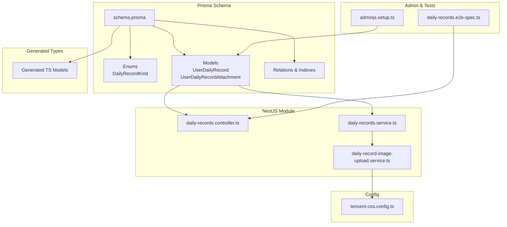
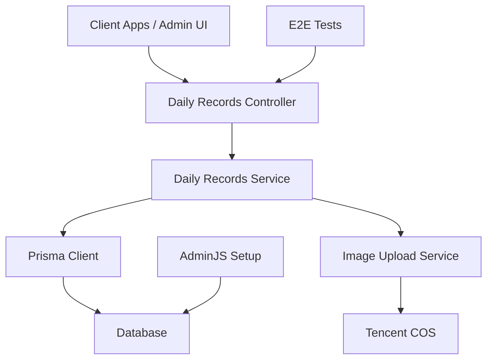
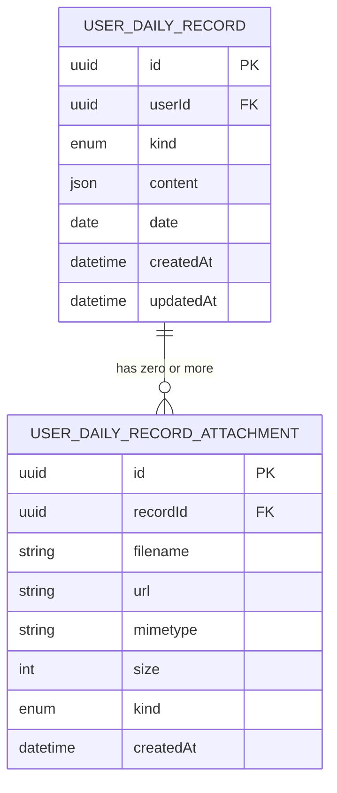
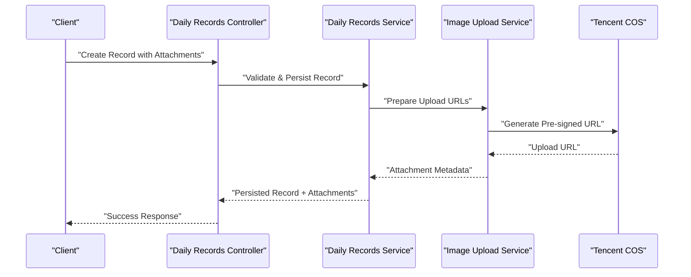
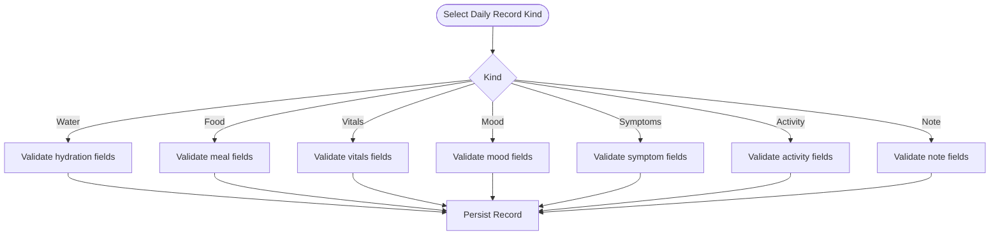
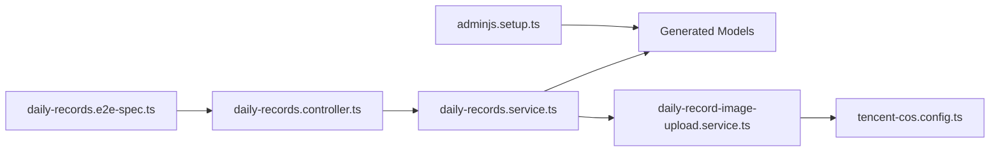

# Health Data Entities

<cite>
**Referenced Files in This Document**
- [schema.prisma](file://Lucent/prisma/schema.prisma)
- [UserDailyRecord.ts](file://Lucent/src/generated/prisma/models/UserDailyRecord.ts)
- [UserDailyRecordAttachment.ts](file://Lucent/src/generated/prisma/models/UserDailyRecordAttachment.ts)
- [daily-records.controller.ts](file://Lucent/src/modules/daily-records/daily-records.controller.ts)
- [daily-records.service.ts](file://Lucent/src/modules/daily-records/daily-records.service.ts)
- [daily-record-image-upload.service.ts](file://Lucent/src/modules/daily-records/daily-record-image-upload.service.ts)
- [tencent-cos.config.ts](file://Lucent/src/config/tencent-cos.config.ts)
- [commonInputTypes.ts](file://Lucent/src/generated/prisma/commonInputTypes.ts)
- [DailyRecordKind.md](file://Luminous/packages/lucent_openapi/doc/DailyRecordKind.md)
- [DailyRecordKind.md](file://Lucent/docs/public/data-sources.md)
- [adminjs.setup.ts](file://Lucent/src/admin/adminjs.setup.ts)
- [daily-records.e2e-spec.ts](file://Lucent/test/daily-records.e2e-spec.ts)
</cite>

## Table of Contents
1. [Introduction](#introduction)
2. [Project Structure](#project-structure)
3. [Core Components](#core-components)
4. [Architecture Overview](#architecture-overview)
5. [Detailed Component Analysis](#detailed-component-analysis)
6. [Dependency Analysis](#dependency-analysis)
7. [Performance Considerations](#performance-considerations)
8. [Troubleshooting Guide](#troubleshooting-guide)
9. [Conclusion](#conclusion)
10. [Appendices](#appendices)

## Introduction
This document describes the health data entities in the Lumos database schema with a focus on flexible daily health logging. It covers:
- UserDailyRecord for collecting diverse health metrics (water intake, meals, vital signs, mood, symptoms, activities, notes)
- UserDailyRecordAttachment for managing image uploads with metadata and cloud storage integration
- DailyRecordKind enum and its specific data requirements
- Validation rules, temporal relationships, and search optimization strategies
- Attachment workflows, file storage patterns, and retrieval mechanisms
- Aggregation patterns for reporting and analytics
- Privacy considerations and retention policies

## Project Structure
The health data entities are defined in the Prisma schema and surfaced via NestJS modules and DTOs. The relevant parts of the repository include:
- Prisma schema defining models, enums, relations, and indexes
- Generated TypeScript models for strong typing
- Daily records module with controller, service, and image upload service
- Tencent COS configuration for cloud storage
- Admin UI integration for entity management
- E2E tests validating daily records functionality

**Diagram sources**
- [schema.prisma:91-100](file://Lucent/prisma/schema.prisma#L91-L100)
- [schema.prisma:353-420](file://Lucent/prisma/schema.prisma#L353-L420)
- [schema.prisma:420-480](file://Lucent/prisma/schema.prisma#L420-L480)
- [UserDailyRecord.ts](file://Lucent/src/generated/prisma/models/UserDailyRecord.ts)
- [UserDailyRecordAttachment.ts](file://Lucent/src/generated/prisma/models/UserDailyRecordAttachment.ts)
- [daily-records.controller.ts](file://Lucent/src/modules/daily-records/daily-records.controller.ts)
- [daily-records.service.ts](file://Lucent/src/modules/daily-records/daily-records.service.ts)
- [daily-record-image-upload.service.ts](file://Lucent/src/modules/daily-records/daily-record-image-upload.service.ts)
- [tencent-cos.config.ts](file://Lucent/src/config/tencent-cos.config.ts)
- [adminjs.setup.ts:211-233](file://Lucent/src/admin/adminjs.setup.ts#L211-L233)
- [daily-records.e2e-spec.ts](file://Lucent/test/daily-records.e2e-spec.ts)

**Section sources**
- [schema.prisma:91-100](file://Lucent/prisma/schema.prisma#L91-L100)
- [schema.prisma:353-480](file://Lucent/prisma/schema.prisma#L353-L480)
- [UserDailyRecord.ts](file://Lucent/src/generated/prisma/models/UserDailyRecord.ts)
- [UserDailyRecordAttachment.ts](file://Lucent/src/generated/prisma/models/UserDailyRecordAttachment.ts)
- [daily-records.controller.ts](file://Lucent/src/modules/daily-records/daily-records.controller.ts)
- [daily-records.service.ts](file://Lucent/src/modules/daily-records/daily-records.service.ts)
- [daily-record-image-upload.service.ts](file://Lucent/src/modules/daily-records/daily-record-image-upload.service.ts)
- [tencent-cos.config.ts](file://Lucent/src/config/tencent-cos.config.ts)
- [adminjs.setup.ts:211-233](file://Lucent/src/admin/adminjs.setup.ts#L211-L233)
- [daily-records.e2e-spec.ts](file://Lucent/test/daily-records.e2e-spec.ts)

## Core Components
- UserDailyRecord: Central entity for daily health entries. Supports flexible data via JSON fields and discriminates content by DailyRecordKind. Includes timestamps, user association, and optional attachments.
- UserDailyRecordAttachment: Stores file metadata and links to a UserDailyRecord. Integrates with cloud storage for images.
- DailyRecordKind: Enum defining categories of daily records (e.g., water, food, vitals, mood, symptoms, activity, note), each with specific data requirements.
- Generated Prisma models: Strongly typed models for compile-time safety and IDE support.
- Daily Records Module: Controller and service orchestrate creation, updates, queries, and image upload workflows.
- Cloud Storage: Tencent COS configuration enables secure, scalable image hosting.

Key implementation references:
- [schema.prisma:91-100](file://Lucent/prisma/schema.prisma#L91-L100)
- [schema.prisma:353-420](file://Lucent/prisma/schema.prisma#L353-L420)
- [schema.prisma:420-480](file://Lucent/prisma/schema.prisma#L420-L480)
- [UserDailyRecord.ts](file://Lucent/src/generated/prisma/models/UserDailyRecord.ts)
- [UserDailyRecordAttachment.ts](file://Lucent/src/generated/prisma/models/UserDailyRecordAttachment.ts)
- [daily-records.controller.ts](file://Lucent/src/modules/daily-records/daily-records.controller.ts)
- [daily-records.service.ts](file://Lucent/src/modules/daily-records/daily-records.service.ts)
- [daily-record-image-upload.service.ts](file://Lucent/src/modules/daily-records/daily-record-image-upload.service.ts)
- [tencent-cos.config.ts](file://Lucent/src/config/tencent-cos.config.ts)

**Section sources**
- [schema.prisma:91-100](file://Lucent/prisma/schema.prisma#L91-L100)
- [schema.prisma:353-480](file://Lucent/prisma/schema.prisma#L353-L480)
- [UserDailyRecord.ts](file://Lucent/src/generated/prisma/models/UserDailyRecord.ts)
- [UserDailyRecordAttachment.ts](file://Lucent/src/generated/prisma/models/UserDailyRecordAttachment.ts)
- [daily-records.controller.ts](file://Lucent/src/modules/daily-records/daily-records.controller.ts)
- [daily-records.service.ts](file://Lucent/src/modules/daily-records/daily-records.service.ts)
- [daily-record-image-upload.service.ts](file://Lucent/src/modules/daily-records/daily-record-image-upload.service.ts)
- [tencent-cos.config.ts](file://Lucent/src/config/tencent-cos.config.ts)

## Architecture Overview
The health data architecture centers on Prisma-managed entities and a NestJS module handling business logic and integrations.

**Diagram sources**
- [daily-records.controller.ts](file://Lucent/src/modules/daily-records/daily-records.controller.ts)
- [daily-records.service.ts](file://Lucent/src/modules/daily-records/daily-records.service.ts)
- [daily-record-image-upload.service.ts](file://Lucent/src/modules/daily-records/daily-record-image-upload.service.ts)
- [tencent-cos.config.ts](file://Lucent/src/config/tencent-cos.config.ts)
- [adminjs.setup.ts:211-233](file://Lucent/src/admin/adminjs.setup.ts#L211-L233)
- [daily-records.e2e-spec.ts](file://Lucent/test/daily-records.e2e-spec.ts)

## Detailed Component Analysis

### UserDailyRecord Entity
Purpose:
- Capture daily health events with flexible content via JSON fields
- Discriminate event type using DailyRecordKind
- Track timestamps and ownership by user
- Link to attachments for media-rich entries

Schema highlights:
- Enum: DailyRecordKind defines categories of daily records
- Model: UserDailyRecord includes fields for kind, content payload, timestamps, and relations
- Indexes: Composite indexes optimize queries by user, date, and kind

Temporal semantics:
- CreatedAt and UpdatedAt track persistence lifecycle
- Date dimension supports daily aggregation and filtering

Validation and constraints:
- Kind must be one of DailyRecordKind values
- Content payload validated by service DTOs
- Unique constraints prevent duplicate entries per user per day per kind

**Diagram sources**
- [schema.prisma:91-100](file://Lucent/prisma/schema.prisma#L91-L100)
- [schema.prisma:353-420](file://Lucent/prisma/schema.prisma#L353-L420)
- [schema.prisma:420-480](file://Lucent/prisma/schema.prisma#L420-L480)

**Section sources**
- [schema.prisma:91-100](file://Lucent/prisma/schema.prisma#L91-L100)
- [schema.prisma:353-420](file://Lucent/prisma/schema.prisma#L353-L420)
- [schema.prisma:420-480](file://Lucent/prisma/schema.prisma#L420-L480)
- [UserDailyRecord.ts](file://Lucent/src/generated/prisma/models/UserDailyRecord.ts)
- [UserDailyRecordAttachment.ts](file://Lucent/src/generated/prisma/models/UserDailyRecordAttachment.ts)

### UserDailyRecordAttachment Entity
Purpose:
- Store metadata for images associated with daily records
- Provide signed or public URLs for retrieval
- Enforce file type and size constraints

Cloud integration:
- Tencent COS configuration supplies credentials and bucket settings
- Service generates upload URLs and manages lifecycle

**Diagram sources**
- [daily-records.controller.ts](file://Lucent/src/modules/daily-records/daily-records.controller.ts)
- [daily-records.service.ts](file://Lucent/src/modules/daily-records/daily-records.service.ts)
- [daily-record-image-upload.service.ts](file://Lucent/src/modules/daily-records/daily-record-image-upload.service.ts)
- [tencent-cos.config.ts](file://Lucent/src/config/tencent-cos.config.ts)

**Section sources**
- [schema.prisma:420-480](file://Lucent/prisma/schema.prisma#L420-L480)
- [UserDailyRecordAttachment.ts](file://Lucent/src/generated/prisma/models/UserDailyRecordAttachment.ts)
- [daily-record-image-upload.service.ts](file://Lucent/src/modules/daily-records/daily-record-image-upload.service.ts)
- [tencent-cos.config.ts](file://Lucent/src/config/tencent-cos.config.ts)

### DailyRecordKind Enum
Categories:
- Water: hydration metrics
- Food: meal entries
- Vitals: vital signs (e.g., weight, blood pressure)
- Mood: emotional state
- Symptoms: health symptoms
- Activity: physical activity
- Note: free-text notes

Requirements:
- Each kind determines acceptable content payload structure
- Service DTOs validate content against kind-specific schemas
- UI and APIs reflect kind-specific fields

**Diagram sources**
- [schema.prisma:91-100](file://Lucent/prisma/schema.prisma#L91-L100)
- [DailyRecordKind.md](file://Luminous/packages/lucent_openapi/doc/DailyRecordKind.md)
- [DailyRecordKind.md](file://Lucent/docs/public/data-sources.md)

**Section sources**
- [schema.prisma:91-100](file://Lucent/prisma/schema.prisma#L91-L100)
- [DailyRecordKind.md](file://Luminous/packages/lucent_openapi/doc/DailyRecordKind.md)
- [DailyRecordKind.md](file://Lucent/docs/public/data-sources.md)

### Data Validation Rules
- Kind validation: Only values from DailyRecordKind are accepted
- Content validation: Service DTOs enforce kind-specific schemas
- Temporal validation: Date must be present; uniqueness enforced per user per day per kind
- Attachment validation: Mimetype and size constrained; kind indicates intended use

References:
- [commonInputTypes.ts:475-489](file://Lucent/src/generated/prisma/commonInputTypes.ts#L475-L489)
- [daily-records.service.ts](file://Lucent/src/modules/daily-records/daily-records.service.ts)
- [daily-records.controller.ts](file://Lucent/src/modules/daily-records/daily-records.controller.ts)

**Section sources**
- [commonInputTypes.ts:475-489](file://Lucent/src/generated/prisma/commonInputTypes.ts#L475-L489)
- [daily-records.service.ts](file://Lucent/src/modules/daily-records/daily-records.service.ts)
- [daily-records.controller.ts](file://Lucent/src/modules/daily-records/daily-records.controller.ts)

### Temporal Relationships and Search Optimization
- Composite indexes on user, date, and kind enable efficient daily rollups and filtering
- Timestamps support range queries and audit trails
- Aggregation queries can group by kind and date for analytics dashboards

References:
- [schema.prisma:353-420](file://Lucent/prisma/schema.prisma#L353-L420)

**Section sources**
- [schema.prisma:353-420](file://Lucent/prisma/schema.prisma#L353-L420)

### Attachment Management Workflows
- Pre-signed upload URLs generated via image upload service
- Metadata stored in UserDailyRecordAttachment
- Retrieval via signed or public URLs depending on configuration

References:
- [daily-record-image-upload.service.ts](file://Lucent/src/modules/daily-records/daily-record-image-upload.service.ts)
- [tencent-cos.config.ts](file://Lucent/src/config/tencent-cos.config.ts)

**Section sources**
- [daily-record-image-upload.service.ts](file://Lucent/src/modules/daily-records/daily-record-image-upload.service.ts)
- [tencent-cos.config.ts](file://Lucent/src/config/tencent-cos.config.ts)

### Data Aggregation Patterns for Reporting and Analytics
- Group by user, date, and kind for counts and averages
- Pivot by kind to produce daily summaries
- Use indexes to accelerate time-series analytics

References:
- [schema.prisma:353-420](file://Lucent/prisma/schema.prisma#L353-L420)

**Section sources**
- [schema.prisma:353-420](file://Lucent/prisma/schema.prisma#L353-L420)

### Privacy Considerations and Retention Policies
- Access control: Operations restricted to authenticated users; service enforces ownership
- Data minimization: Only required fields persisted; optional fields kept minimal
- Retention: Policy-defined deletion of old records; service coordinates cleanup jobs
- Audit: Timestamps and user associations support compliance tracing

References:
- [daily-records.service.ts](file://Lucent/src/modules/daily-records/daily-records.service.ts)
- [adminjs.setup.ts:211-233](file://Lucent/src/admin/adminjs.setup.ts#L211-L233)

**Section sources**
- [daily-records.service.ts](file://Lucent/src/modules/daily-records/daily-records.service.ts)
- [adminjs.setup.ts:211-233](file://Lucent/src/admin/adminjs.setup.ts#L211-L233)

## Dependency Analysis
The daily records module depends on Prisma models, the image upload service, and cloud storage configuration. Admin UI and E2E tests validate runtime behavior.

**Diagram sources**
- [daily-records.controller.ts](file://Lucent/src/modules/daily-records/daily-records.controller.ts)
- [daily-records.service.ts](file://Lucent/src/modules/daily-records/daily-records.service.ts)
- [daily-record-image-upload.service.ts](file://Lucent/src/modules/daily-records/daily-record-image-upload.service.ts)
- [tencent-cos.config.ts](file://Lucent/src/config/tencent-cos.config.ts)
- [adminjs.setup.ts:211-233](file://Lucent/src/admin/adminjs.setup.ts#L211-L233)
- [daily-records.e2e-spec.ts](file://Lucent/test/daily-records.e2e-spec.ts)

**Section sources**
- [daily-records.controller.ts](file://Lucent/src/modules/daily-records/daily-records.controller.ts)
- [daily-records.service.ts](file://Lucent/src/modules/daily-records/daily-records.service.ts)
- [daily-record-image-upload.service.ts](file://Lucent/src/modules/daily-records/daily-record-image-upload.service.ts)
- [tencent-cos.config.ts](file://Lucent/src/config/tencent-cos.config.ts)
- [adminjs.setup.ts:211-233](file://Lucent/src/admin/adminjs.setup.ts#L211-L233)
- [daily-records.e2e-spec.ts](file://Lucent/test/daily-records.e2e-spec.ts)

## Performance Considerations
- Indexes: Composite indexes on user, date, and kind improve query performance for daily rollups
- Pagination: Use cursor-based pagination for large datasets
- Selectivity: Filter early by kind and date to reduce result sets
- Caching: Cache frequently accessed summaries; invalidate on write
- Batch operations: Aggregate writes during bulk imports to minimize overhead

[No sources needed since this section provides general guidance]

## Troubleshooting Guide
Common issues and resolutions:
- Validation failures: Ensure content matches DailyRecordKind requirements; check DTO constraints
- Duplicate entries: Confirm uniqueness constraints per user per day per kind
- Upload failures: Verify Tencent COS credentials and bucket permissions
- Admin UI access: Confirm AdminJS setup includes UserDailyRecord and UserDailyRecordAttachment

References:
- [daily-records.e2e-spec.ts](file://Lucent/test/daily-records.e2e-spec.ts)
- [adminjs.setup.ts:211-233](file://Lucent/src/admin/adminjs.setup.ts#L211-L233)

**Section sources**
- [daily-records.e2e-spec.ts](file://Lucent/test/daily-records.e2e-spec.ts)
- [adminjs.setup.ts:211-233](file://Lucent/src/admin/adminjs.setup.ts#L211-L233)

## Conclusion
The health data entities provide a robust foundation for flexible daily health logging. The combination of DailyRecordKind-driven content validation, strong Prisma modeling, and cloud-backed attachments enables scalable, privacy-conscious data capture and analysis.

[No sources needed since this section summarizes without analyzing specific files]

## Appendices

### Appendix A: Entity Field Reference
- UserDailyRecord
  - id: unique identifier
  - userId: owner reference
  - kind: DailyRecordKind discriminator
  - content: JSON payload tailored to kind
  - date: calendar day
  - createdAt/updatedAt: audit timestamps
- UserDailyRecordAttachment
  - id: unique identifier
  - recordId: foreign key to UserDailyRecord
  - filename/url/mimetype/size: file metadata
  - kind: attachment kind indicator
  - createdAt: audit timestamp

References:
- [schema.prisma:353-480](file://Lucent/prisma/schema.prisma#L353-L480)
- [UserDailyRecord.ts](file://Lucent/src/generated/prisma/models/UserDailyRecord.ts)
- [UserDailyRecordAttachment.ts](file://Lucent/src/generated/prisma/models/UserDailyRecordAttachment.ts)

**Section sources**
- [schema.prisma:353-480](file://Lucent/prisma/schema.prisma#L353-L480)
- [UserDailyRecord.ts](file://Lucent/src/generated/prisma/models/UserDailyRecord.ts)
- [UserDailyRecordAttachment.ts](file://Lucent/src/generated/prisma/models/UserDailyRecordAttachment.ts)