# Medication Entities

<cite>
**Referenced Files in This Document**
- [schema.prisma](file://Lucent/prisma/schema.prisma)
- [20260608193000_add_user_medicine_reminders/migration.sql](file://Lucent/prisma/migrations/20260608193000_add_user_medicine_reminders/migration.sql)
- [20260610093000_extend_medicine_reminders/migration.sql](file://Lucent/prisma/migrations/20260610093000_extend_medicine_reminders/migration.sql)
- [20260604010000_add_user_medicine_dose_logs/migration.sql](file://Lucent/prisma/migrations/20260604010000_add_user_medicine_dose_logs/migration.sql)
- [medicines.controller.ts](file://Lucent/src/modules/medicines/medicines.controller.ts)
- [medicines.service.ts](file://Lucent/src/modules/medicines/medicines.service.ts)
- [medicine-reminders.controller.ts](file://Lucent/src/modules/medicine-reminders/medicine-reminders.controller.ts)
- [reminder-deliveries.controller.ts](file://Lucent/src/modules/medicine-reminders/reminder-deliveries.controller.ts)
- [medicine-dose-logs.controller.ts](file://Lucent/src/modules/medicine-dose-logs/medicine-dose-logs.controller.ts)
- [user-current-medicine-item.dto.ts](file://Luminous/packages/lucent_openapi/lib/src/model/user_current_medicine_item_dto.ts)
- [medicine-reminder-item.dto.ts](file://Luminous/packages/lucent_openapi/lib/src/model/medicine-reminder-item.dto.ts)
- [reminder-delivery-item.dto.ts](file://Luminous/packages/lucent_openapi/lib/src/model/reminder-delivery-item.dto.ts)
- [dose-log-item.dto.ts](file://Luminous/packages/lucent_openapi/lib/src/model/dose-log-item.dto.ts)
- [medicine-source.md](file://Luminous/packages/lucent_openapi/doc/MedicineSource.md)
- [medicines_api_test.ts](file://Luminous/packages/lucent_openapi/test/medicines_api_test.dart)
- [medicine_reminders_api_test.ts](file://Luminous/packages/lucent_openapi/test/medicine_reminders_api_test.dart)
- [reminder_deliveries_api_test.ts](file://Luminous/packages/lucent_openapi/test/reminder_deliveries_api_test.dart)
- [medicine_dose_logs_api_test.ts](file://Luminous/packages/lucent_openapi/test/medicine_dose_logs_api_test.dart)
- [import-medicine-knowledge.js](file://Lucent/scripts/medicine/import-medicine-knowledge.js)
- [drugbank_drugs.py](file://Lucent/scripts/medicine/parsers/drugbank_drugs.py)
- [cn_products.py](file://Lucent/scripts/medicine/parsers/cn_products.py)
- [common.py](file://Lucent/scripts/medicine/parsers/common.py)
- [data-sources.md](file://Lucent/docs/public/data-sources.md)
- [reminder-contract.md](file://Lucent/docs/public/reminder-contract.md)
</cite>

## Table of Contents
1. [Introduction](#introduction)
2. [Project Structure](#project-structure)
3. [Core Components](#core-components)
4. [Architecture Overview](#architecture-overview)
5. [Detailed Component Analysis](#detailed-component-analysis)
6. [Dependency Analysis](#dependency-analysis)
7. [Performance Considerations](#performance-considerations)
8. [Troubleshooting Guide](#troubleshooting-guide)
9. [Conclusion](#conclusion)

## Introduction
This document describes the medication-related database entities and workflows in the Lumos platform. It focuses on:
- UserCurrentMedicine for current medication tracking integrated from DrugBank and Chinese medicine sources
- UserMedicineReminder for automated medication scheduling with daily patterns and delivery channels
- UserReminderDelivery for notification management across multiple channels and devices
- UserMedicineDoseLog for dose tracking with status management (taken, skipped, missed, planned)
- MedicineSource enum for multi-source drug integration
- Interaction checking workflows, medication history tracking, and compliance analytics
- Relationships between medication entities and health data for comprehensive care management

## Project Structure
The medication domain spans the backend Prisma schema, NestJS modules, DTOs in the frontend OpenAPI client, and data ingestion scripts.

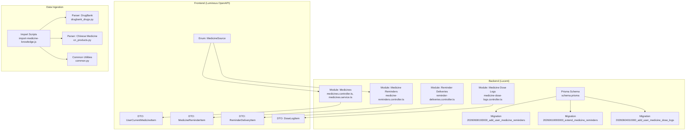

**Diagram sources**
- [schema.prisma](file://Lucent/prisma/schema.prisma)
- [20260608193000_add_user_medicine_reminders/migration.sql](file://Lucent/prisma/migrations/20260608193000_add_user_medicine_reminders/migration.sql)
- [20260610093000_extend_medicine_reminders/migration.sql](file://Lucent/prisma/migrations/20260610093000_extend_medicine_reminders/migration.sql)
- [20260604010000_add_user_medicine_dose_logs/migration.sql](file://Lucent/prisma/migrations/20260604010000_add_user_medicine_dose_logs/migration.sql)
- [medicines.controller.ts](file://Lucent/src/modules/medicines/medicines.controller.ts)
- [medicine-reminders.controller.ts](file://Lucent/src/modules/medicine-reminders/medicine-reminders.controller.ts)
- [reminder-deliveries.controller.ts](file://Lucent/src/modules/medicine-reminders/reminder-deliveries.controller.ts)
- [medicine-dose-logs.controller.ts](file://Lucent/src/modules/medicine-dose-logs/medicine-dose-logs.controller.ts)
- [user-current-medicine-item.dto.ts](file://Luminous/packages/lucent_openapi/lib/src/model/user_current_medicine_item_dto.ts)
- [medicine-reminder-item.dto.ts](file://Luminous/packages/lucent_openapi/lib/src/model/medicine-reminder-item.dto.ts)
- [reminder-delivery-item.dto.ts](file://Luminous/packages/lucent_openapi/lib/src/model/reminder-delivery-item.dto.ts)
- [dose-log-item.dto.ts](file://Luminous/packages/lucent_openapi/lib/src/model/dose-log-item.dto.ts)
- [medicine-source.md](file://Luminous/packages/lucent_openapi/doc/MedicineSource.md)
- [import-medicine-knowledge.js](file://Lucent/scripts/medicine/import-medicine-knowledge.js)
- [drugbank_drugs.py](file://Lucent/scripts/medicine/parsers/drugbank_drugs.py)
- [cn_products.py](file://Lucent/scripts/medicine/parsers/cn_products.py)
- [common.py](file://Lucent/scripts/medicine/parsers/common.py)

**Section sources**
- [schema.prisma](file://Lucent/prisma/schema.prisma)
- [medicines.controller.ts](file://Lucent/src/modules/medicines/medicines.controller.ts)
- [medicine-reminders.controller.ts](file://Lucent/src/modules/medicine-reminders/medicine-reminders.controller.ts)
- [reminder-deliveries.controller.ts](file://Lucent/src/modules/medicine-reminders/reminder-deliveries.controller.ts)
- [medicine-dose-logs.controller.ts](file://Lucent/src/modules/medicine-dose-logs/medicine-dose-logs.controller.ts)
- [user-current-medicine-item.dto.ts](file://Luminous/packages/lucent_openapi/lib/src/model/user_current_medicine_item_dto.ts)
- [medicine-reminder-item.dto.ts](file://Luminous/packages/lucent_openapi/lib/src/model/medicine-reminder-item.dto.ts)
- [reminder-delivery-item.dto.ts](file://Luminous/packages/lucent_openapi/lib/src/model/reminder-delivery-item.dto.ts)
- [dose-log-item.dto.ts](file://Luminous/packages/lucent_openapi/lib/src/model/dose-log-item.dto.ts)
- [medicine-source.md](file://Luminous/packages/lucent_openapi/doc/MedicineSource.md)

## Core Components
- UserCurrentMedicine: Tracks a user’s currently active medications with source metadata and optional free-text notes. Supports integration from DrugBank and Chinese medicine databases via source identifiers and payloads.
- UserMedicineReminder: Defines scheduled reminders with daily patterns and delivery preferences. Extends across multiple days and supports recurrence rules.
- UserReminderDelivery: Manages delivery channels and device targeting for reminder notifications.
- UserMedicineDoseLog: Records individual doses with statuses (planned, taken, skipped, missed) and timestamps, enabling compliance analytics.
- MedicineSource: Enumerates supported data sources (e.g., DrugBank, Chinese medicine) to unify multi-source drug knowledge.

These components are backed by Prisma schema definitions and exposed via NestJS controllers with DTOs in the OpenAPI client.

**Section sources**
- [schema.prisma](file://Lucent/prisma/schema.prisma)
- [20260608193000_add_user_medicine_reminders/migration.sql](file://Lucent/prisma/migrations/20260608193000_add_user_medicine_reminders/migration.sql)
- [20260610093000_extend_medicine_reminders/migration.sql](file://Lucent/prisma/migrations/20260610093000_extend_medicine_reminders/migration.sql)
- [20260604010000_add_user_medicine_dose_logs/migration.sql](file://Lucent/prisma/migrations/20260604010000_add_user_medicine_dose_logs/migration.sql)
- [user-current-medicine-item.dto.ts](file://Luminous/packages/lucent_openapi/lib/src/model/user_current_medicine_item_dto.ts)
- [medicine-reminder-item.dto.ts](file://Luminous/packages/lucent_openapi/lib/src/model/medicine-reminder-item.dto.ts)
- [reminder-delivery-item.dto.ts](file://Luminous/packages/lucent_openapi/lib/src/model/reminder-delivery-item.dto.ts)
- [dose-log-item.dto.ts](file://Luminous/packages/lucent_openapi/lib/src/model/dose-log-item.dto.ts)
- [medicine-source.md](file://Luminous/packages/lucent_openapi/doc/MedicineSource.md)

## Architecture Overview
The medication subsystem integrates data ingestion, persistence, and API exposure across backend and frontend boundaries.

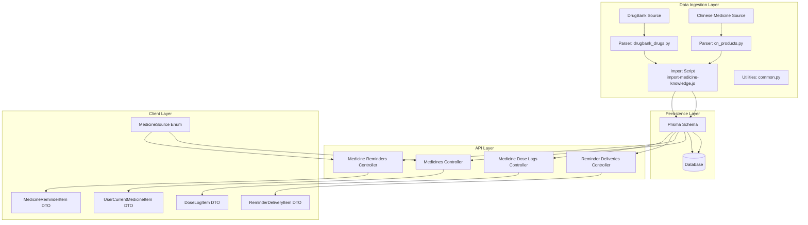

**Diagram sources**
- [import-medicine-knowledge.js](file://Lucent/scripts/medicine/import-medicine-knowledge.js)
- [drugbank_drugs.py](file://Lucent/scripts/medicine/parsers/drugbank_drugs.py)
- [cn_products.py](file://Lucent/scripts/medicine/parsers/cn_products.py)
- [common.py](file://Lucent/scripts/medicine/parsers/common.py)
- [schema.prisma](file://Lucent/prisma/schema.prisma)
- [medicines.controller.ts](file://Lucent/src/modules/medicines/medicines.controller.ts)
- [medicine-reminders.controller.ts](file://Lucent/src/modules/medicine-reminders/medicine-reminders.controller.ts)
- [reminder-deliveries.controller.ts](file://Lucent/src/modules/medicine-reminders/reminder-deliveries.controller.ts)
- [medicine-dose-logs.controller.ts](file://Lucent/src/modules/medicine-dose-logs/medicine-dose-logs.controller.ts)
- [user-current-medicine-item.dto.ts](file://Luminous/packages/lucent_openapi/lib/src/model/user_current_medicine_item_dto.ts)
- [medicine-reminder-item.dto.ts](file://Luminous/packages/lucent_openapi/lib/src/model/medicine-reminder-item.dto.ts)
- [reminder-delivery-item.dto.ts](file://Luminous/packages/lucent_openapi/lib/src/model/reminder-delivery-item.dto.ts)
- [dose-log-item.dto.ts](file://Luminous/packages/lucent_openapi/lib/src/model/dose-log-item.dto.ts)
- [medicine-source.md](file://Luminous/packages/lucent_openapi/doc/MedicineSource.md)

## Detailed Component Analysis

### UserCurrentMedicine
Purpose:
- Track a user’s current medications with source integration from DrugBank and Chinese medicine databases.
- Store human-readable display names, strengths, routes, and optional notes.
- Preserve original source payloads for auditability and future reprocessing.

Key attributes (from DTO):
- Identifier, source, source reference ID, display name, strength text, dose text, route, start/end dates, current flag, user note, source payload, timestamps.

Integration:
- Multi-source support via MedicineSource enum.
- Source payloads stored as JSON for fidelity.

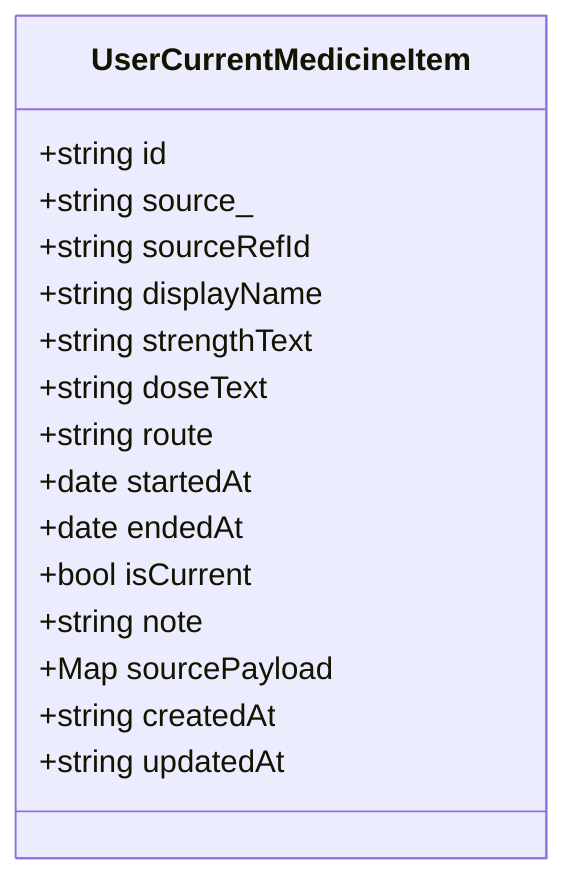

**Diagram sources**
- [user-current-medicine-item.dto.ts](file://Luminous/packages/lucent_openapi/lib/src/model/user_current_medicine_item_dto.ts)

**Section sources**
- [user-current-medicine-item.dto.ts](file://Luminous/packages/lucent_openapi/lib/src/model/user_current_medicine_item_dto.ts)
- [medicine-source.md](file://Luminous/packages/lucent_openapi/doc/MedicineSource.md)

### UserMedicineReminder
Purpose:
- Define automated medication reminders with daily scheduling patterns and delivery preferences.
- Support recurrence and per-reminder overrides.

Core capabilities:
- Daily pattern definition and recurrence rules.
- Delivery channel selection and device targeting.
- Extension of reminder configuration over time.

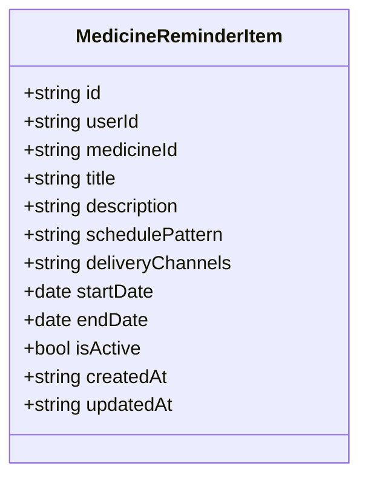

**Diagram sources**
- [medicine-reminder-item.dto.ts](file://Luminous/packages/lucent_openapi/lib/src/model/medicine-reminder-item.dto.ts)

**Section sources**
- [medicine-reminder-item.dto.ts](file://Luminous/packages/lucent_openapi/lib/src/model/medicine-reminder-item.dto.ts)
- [20260608193000_add_user_medicine_reminders/migration.sql](file://Lucent/prisma/migrations/20260608193000_add_user_medicine_reminders/migration.sql)
- [20260610093000_extend_medicine_reminders/migration.sql](file://Lucent/prisma/migrations/20260610093000_extend_medicine_reminders/migration.sql)

### UserReminderDelivery
Purpose:
- Manage notification delivery across multiple channels and devices.
- Enable targeted delivery preferences per reminder.

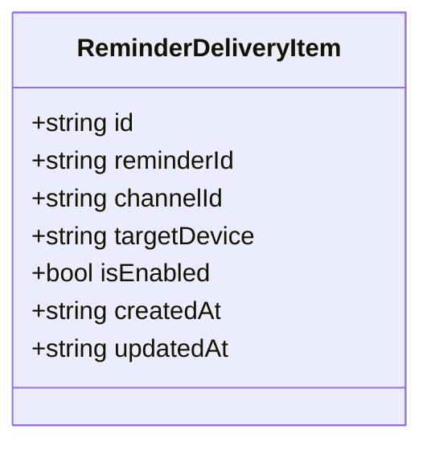

**Diagram sources**
- [reminder-delivery-item.dto.ts](file://Luminous/packages/lucent_openapi/lib/src/model/reminder-delivery-item.dto.ts)

**Section sources**
- [reminder-delivery-item.dto.ts](file://Luminous/packages/lucent_openapi/lib/src/model/reminder-delivery-item.dto.ts)

### UserMedicineDoseLog
Purpose:
- Record individual doses with precise status tracking and timestamps.
- Enable compliance analytics (taken/skipped/missed/planned).

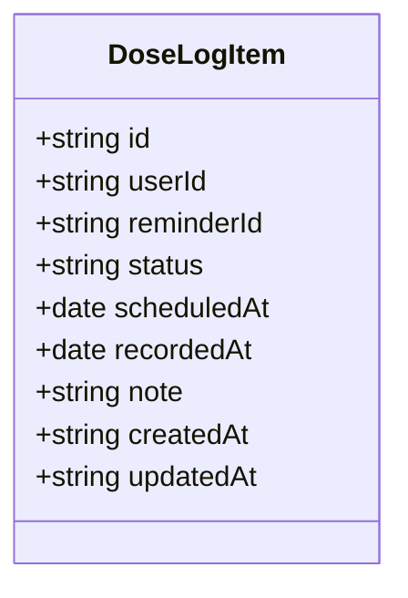

**Diagram sources**
- [dose-log-item.dto.ts](file://Luminous/packages/lucent_openapi/lib/src/model/dose-log-item.dto.ts)

**Section sources**
- [dose-log-item.dto.ts](file://Luminous/packages/lucent_openapi/lib/src/model/dose-log-item.dto.ts)
- [20260604010000_add_user_medicine_dose_logs/migration.sql](file://Lucent/prisma/migrations/20260604010000_add_user_medicine_dose_logs/migration.sql)

### MedicineSource Enum
Purpose:
- Unify multi-source drug integration by enumerating supported sources (e.g., DrugBank, Chinese medicine).
- Enable consistent mapping and routing of source-specific payloads.

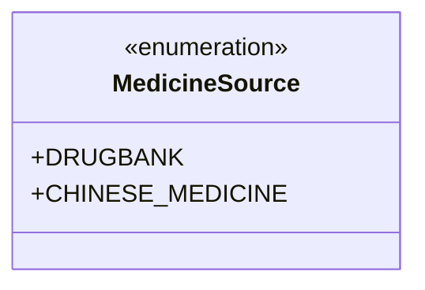

**Diagram sources**
- [medicine-source.md](file://Luminous/packages/lucent_openapi/doc/MedicineSource.md)

**Section sources**
- [medicine-source.md](file://Luminous/packages/lucent_openapi/doc/MedicineSource.md)

### Data Ingestion and Multi-Source Integration
Workflow:
- Parse DrugBank and Chinese medicine datasets.
- Normalize to unified schema.
- Import into Prisma-managed database.
- Expose via APIs and DTOs.

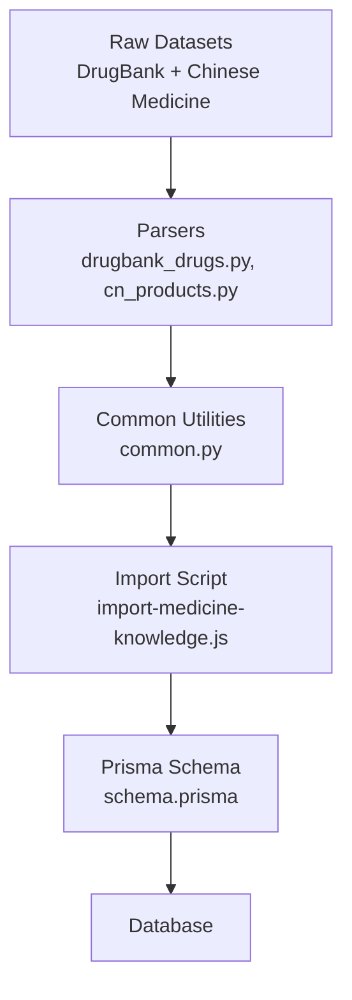

**Diagram sources**
- [import-medicine-knowledge.js](file://Lucent/scripts/medicine/import-medicine-knowledge.js)
- [drugbank_drugs.py](file://Lucent/scripts/medicine/parsers/drugbank_drugs.py)
- [cn_products.py](file://Lucent/scripts/medicine/parsers/cn_products.py)
- [common.py](file://Lucent/scripts/medicine/parsers/common.py)
- [schema.prisma](file://Lucent/prisma/schema.prisma)

**Section sources**
- [import-medicine-knowledge.js](file://Lucent/scripts/medicine/import-medicine-knowledge.js)
- [drugbank_drugs.py](file://Lucent/scripts/medicine/parsers/drugbank_drugs.py)
- [cn_products.py](file://Lucent/scripts/medicine/parsers/cn_products.py)
- [common.py](file://Lucent/scripts/medicine/parsers/common.py)
- [data-sources.md](file://Lucent/docs/public/data-sources.md)

### API Workflows

#### Create/Update Current Medication
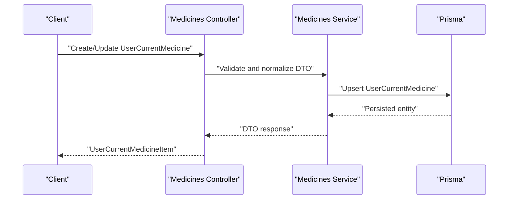

**Diagram sources**
- [medicines.controller.ts](file://Lucent/src/modules/medicines/medicines.controller.ts)
- [medicines.service.ts](file://Lucent/src/modules/medicines/medicines.service.ts)
- [user-current-medicine-item.dto.ts](file://Luminous/packages/lucent_openapi/lib/src/model/user_current_medicine_item_dto.ts)

#### Schedule a Reminder and Configure Deliveries
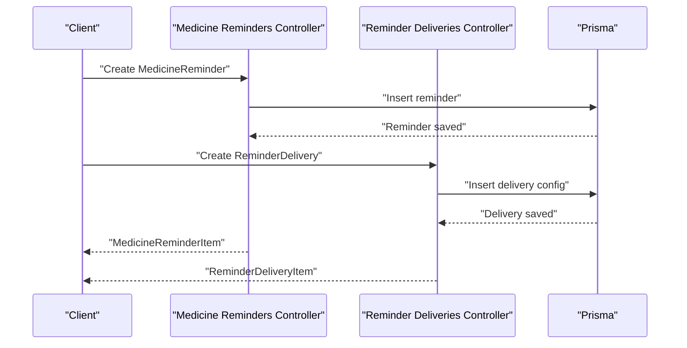

**Diagram sources**
- [medicine-reminders.controller.ts](file://Lucent/src/modules/medicine-reminders/medicine-reminders.controller.ts)
- [reminder-deliveries.controller.ts](file://Lucent/src/modules/medicine-reminders/reminder-deliveries.controller.ts)
- [medicine-reminder-item.dto.ts](file://Luminous/packages/lucent_openapi/lib/src/model/medicine-reminder-item.dto.ts)
- [reminder-delivery-item.dto.ts](file://Luminous/packages/lucent_openapi/lib/src/model/reminder-delivery-item.dto.ts)

#### Log a Dose and Update Compliance
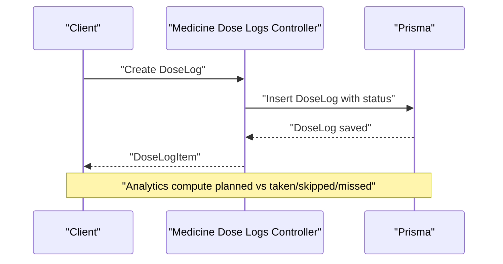

**Diagram sources**
- [medicine-dose-logs.controller.ts](file://Lucent/src/modules/medicine-dose-logs/medicine-dose-logs.controller.ts)
- [dose-log-item.dto.ts](file://Luminous/packages/lucent_openapi/lib/src/model/dose-log-item.dto.ts)

### Interaction Checking Workflows
- Multi-source integration requires mapping identifiers across sources (e.g., DrugBank ID to Chinese medicine product).
- Use normalized identifiers and sourcePayload to detect potential duplications or mismatches.
- Flag inconsistencies during ingestion and surface warnings to administrators.

[No sources needed since this section provides general guidance]

### Medication History Tracking and Compliance Analytics
- History: Maintain start/end dates and current flags in UserCurrentMedicine for timeline views.
- Compliance: Compute ratios from DoseLogItem statuses (planned, taken, skipped, missed) aggregated by user, medicine, and time windows.

[No sources needed since this section provides general guidance]

### Relationship Between Medication Entities and Health Data
- UserCurrentMedicine ties to user health profiles and conditions for contraindication checks.
- DoseLogItem timestamps correlate with environment snapshots and daily records for contextual analytics.
- Reminder configuration can factor into adherence insights combined with health context.

[No sources needed since this section provides general guidance]

## Dependency Analysis
The backend modules depend on Prisma for persistence and expose DTOs consumed by the frontend OpenAPI client. Data ingestion scripts feed the schema with normalized multi-source data.

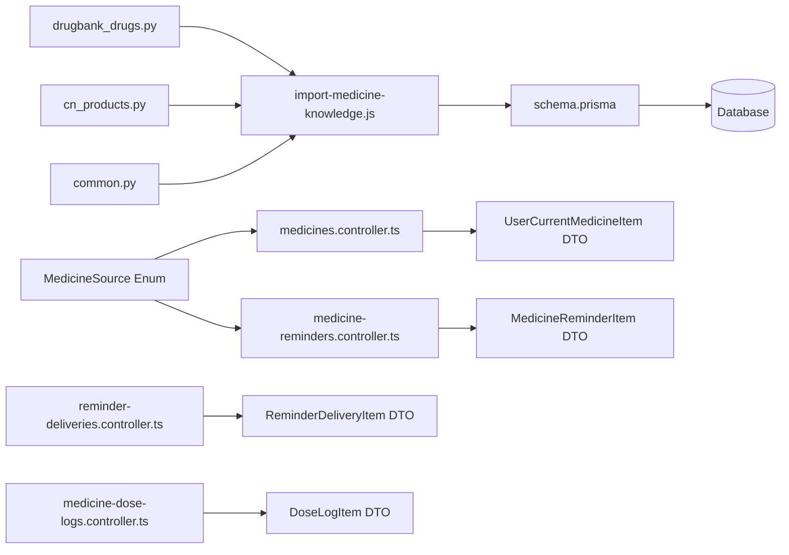

**Diagram sources**
- [drugbank_drugs.py](file://Lucent/scripts/medicine/parsers/drugbank_drugs.py)
- [cn_products.py](file://Lucent/scripts/medicine/parsers/cn_products.py)
- [common.py](file://Lucent/scripts/medicine/parsers/common.py)
- [import-medicine-knowledge.js](file://Lucent/scripts/medicine/import-medicine-knowledge.js)
- [schema.prisma](file://Lucent/prisma/schema.prisma)
- [medicines.controller.ts](file://Lucent/src/modules/medicines/medicines.controller.ts)
- [medicine-reminders.controller.ts](file://Lucent/src/modules/medicine-reminders/medicine-reminders.controller.ts)
- [reminder-deliveries.controller.ts](file://Lucent/src/modules/medicine-reminders/reminder-deliveries.controller.ts)
- [medicine-dose-logs.controller.ts](file://Lucent/src/modules/medicine-dose-logs/medicine-dose-logs.controller.ts)
- [user-current-medicine-item.dto.ts](file://Luminous/packages/lucent_openapi/lib/src/model/user_current_medicine_item_dto.ts)
- [medicine-reminder-item.dto.ts](file://Luminous/packages/lucent_openapi/lib/src/model/medicine-reminder-item.dto.ts)
- [reminder-delivery-item.dto.ts](file://Luminous/packages/lucent_openapi/lib/src/model/reminder-delivery-item.dto.ts)
- [dose-log-item.dto.ts](file://Luminous/packages/lucent_openapi/lib/src/model/dose-log-item.dto.ts)
- [medicine-source.md](file://Luminous/packages/lucent_openapi/doc/MedicineSource.md)

**Section sources**
- [schema.prisma](file://Lucent/prisma/schema.prisma)
- [medicines.controller.ts](file://Lucent/src/modules/medicines/medicines.controller.ts)
- [medicine-reminders.controller.ts](file://Lucent/src/modules/medicine-reminders/medicine-reminders.controller.ts)
- [reminder-deliveries.controller.ts](file://Lucent/src/modules/medicine-reminders/reminder-deliveries.controller.ts)
- [medicine-dose-logs.controller.ts](file://Lucent/src/modules/medicine-dose-logs/medicine-dose-logs.controller.ts)

## Performance Considerations
- Indexing: Add database indexes on frequently queried fields (userId, medicineId, reminderId, scheduledAt, createdAt).
- Batch ingestion: Normalize and batch-import large datasets to reduce transaction overhead.
- DTO normalization: Keep DTO shapes minimal to reduce serialization costs.
- Caching: Cache frequent queries for current medications and recent reminders.

[No sources needed since this section provides general guidance]

## Troubleshooting Guide
- Multi-source conflicts: If a medicine appears under different source IDs, reconcile using sourcePayload and shared identifiers.
- Ingestion failures: Validate parser outputs against schema expectations; check for missing required fields.
- API errors: Use DTO tests to validate request/response shapes; refer to OpenAPI test suites for expected behavior.
- Compliance gaps: Investigate DoseLogItem statuses and reminder delivery logs to identify missed or delayed notifications.

**Section sources**
- [medicines_api_test.ts](file://Luminous/packages/lucent_openapi/test/medicines_api_test.dart)
- [medicine_reminders_api_test.ts](file://Luminous/packages/lucent_openapi/test/medicine_reminders_api_test.dart)
- [reminder_deliveries_api_test.ts](file://Luminous/packages/lucent_openapi/test/reminder_deliveries_api_test.dart)
- [medicine_dose_logs_api_test.ts](file://Luminous/packages/lucent_openapi/test/medicine_dose_logs_api_test.dart)

## Conclusion
The Lumos medication subsystem provides a robust foundation for multi-source drug integration, automated reminders, delivery orchestration, and dose tracking with compliance analytics. By leveraging Prisma-backed entities, structured DTOs, and standardized ingestion pipelines, the platform enables comprehensive care management that connects medication data with broader health context.