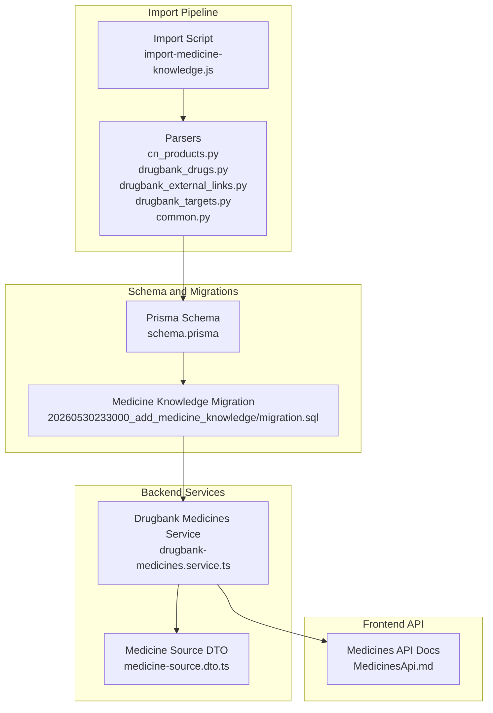
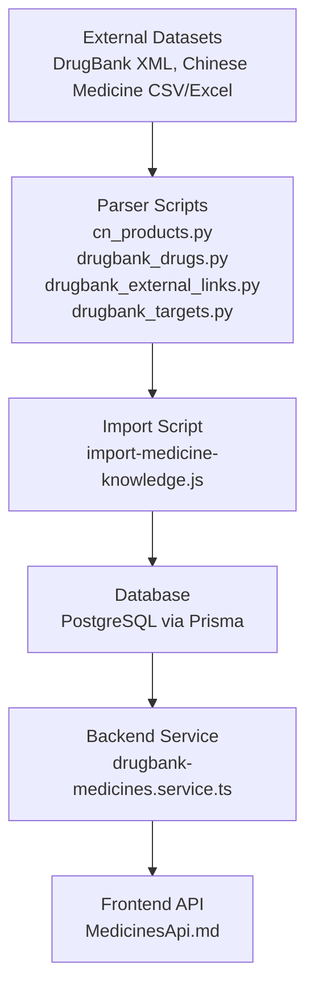
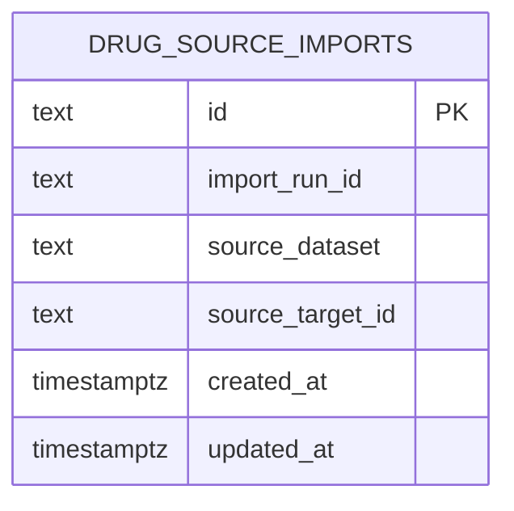
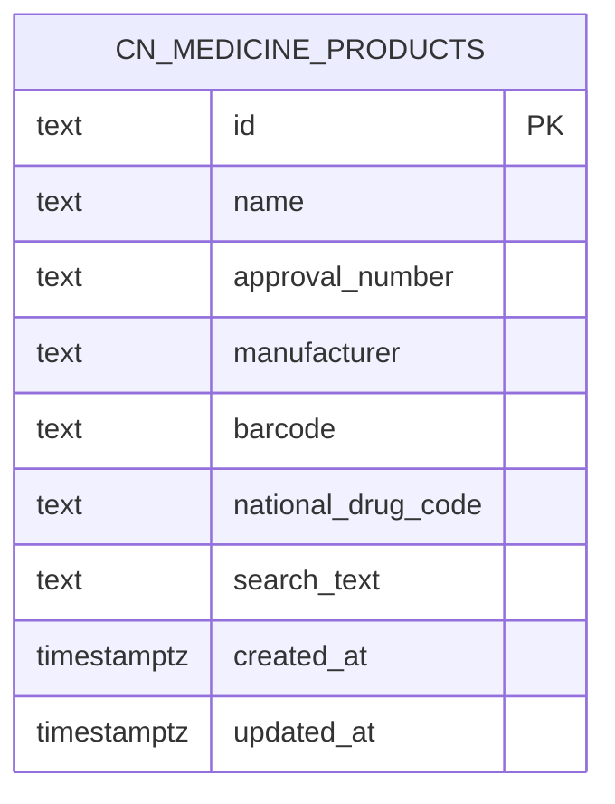
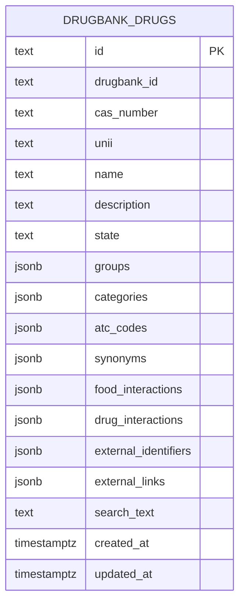
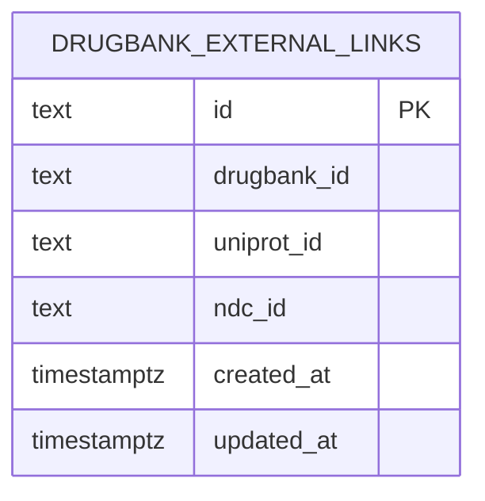
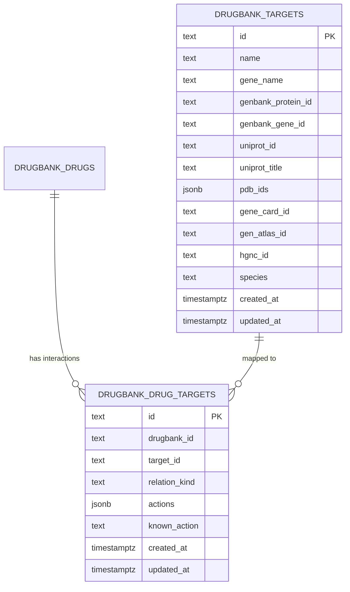
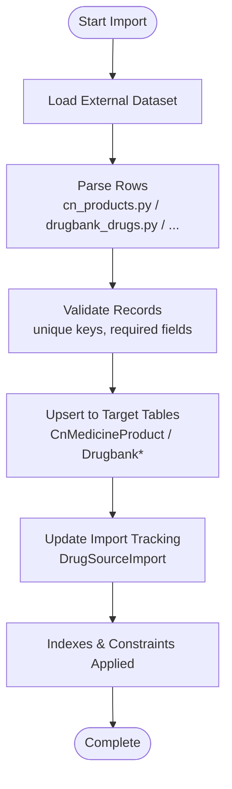
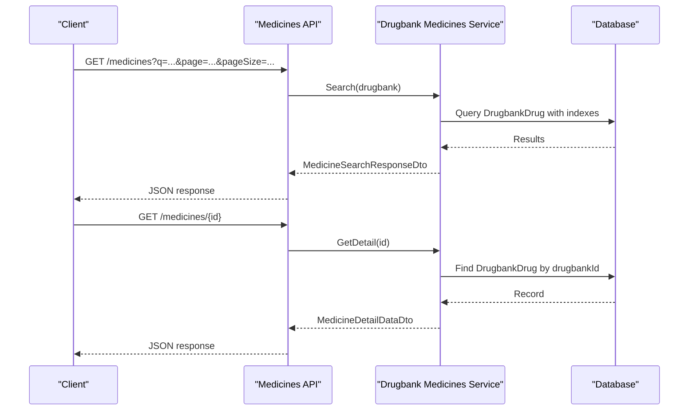
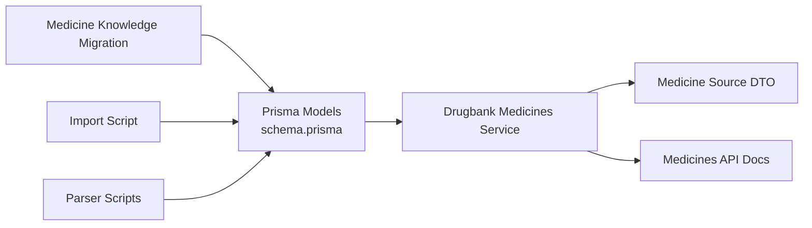

# System Configuration Entities

<cite>
**Referenced Files in This Document**
- [schema.prisma](file://Lucent/prisma/schema.prisma)
- [20260530233000_add_medicine_knowledge/migration.sql](file://Lucent/prisma/migrations/20260530233000_add_medicine_knowledge/migration.sql)
- [medicines.e2e-spec.ts](file://Lucent/test/medicines.e2e-spec.ts)
- [drugbank-medicines.service.ts](file://Lucent/src/modules/medicines/sources/drugbank-medicines.service.ts)
- [medicine-source.dto.ts](file://Lucent/src/modules/medicines/dto/medicine-source.dto.ts)
- [MedicinesApi.md](file://Luminous/packages/lucent_openapi/doc/MedicinesApi.md)
- [import-medicine-knowledge.js](file://Lucent/scripts/medicine/import-medicine-knowledge.js)
- [cn_products.py](file://Lucent/scripts/medicine/parsers/cn_products.py)
- [drugbank_drugs.py](file://Lucent/scripts/medicine/parsers/drugbank_drugs.py)
- [drugbank_external_links.py](file://Lucent/scripts/medicine/parsers/drugbank_external_links.py)
- [drugbank_targets.py](file://Lucent/scripts/medicine/parsers/drugbank_targets.py)
- [common.py](file://Lucent/scripts/medicine/parsers/common.py)
</cite>

## Table of Contents
1. [Introduction](#introduction)
2. [Project Structure](#project-structure)
3. [Core Components](#core-components)
4. [Architecture Overview](#architecture-overview)
5. [Detailed Component Analysis](#detailed-component-analysis)
6. [Dependency Analysis](#dependency-analysis)
7. [Performance Considerations](#performance-considerations)
8. [Troubleshooting Guide](#troubleshooting-guide)
9. [Conclusion](#conclusion)

## Introduction
This document describes the system configuration and administrative entities that support the Lumos medicine knowledge base. It focuses on:
- DrugSourceImport for managing external medication database imports (DrugBank and Chinese medicine)
- Import workflow tracking with status management and error handling
- CnMedicineProduct for Chinese medicine database integration with comprehensive drug information fields
- DrugbankDrug for standardized drug information with extensive metadata
- DrugbankExternalLink for cross-referencing with external databases
- DrugbankTarget for drug-target interaction mapping and therapeutic target identification
It also covers data synchronization patterns, import validation rules, and quality assurance processes.

## Project Structure
The medicine knowledge domain spans Prisma schema definitions, database migrations, backend services, frontend API documentation, and import scripts:
- Prisma schema defines models and indexes for import tracking and medicine entities
- Migrations add and evolve the medicine knowledge tables
- Backend service exposes DrugBank-based medicine details
- Frontend API documentation specifies search behavior and defaults
- Import scripts parse external datasets and synchronize to the database

**Diagram sources**
- [schema.prisma](file://Lucent/prisma/schema.prisma)
- [20260530233000_add_medicine_knowledge/migration.sql](file://Lucent/prisma/migrations/20260530233000_add_medicine_knowledge/migration.sql)
- [drugbank-medicines.service.ts](file://Lucent/src/modules/medicines/sources/drugbank-medicines.service.ts)
- [medicine-source.dto.ts](file://Lucent/src/modules/medicines/dto/medicine-source.dto.ts)
- [MedicinesApi.md](file://Luminous/packages/lucent_openapi/doc/MedicinesApi.md)
- [import-medicine-knowledge.js](file://Lucent/scripts/medicine/import-medicine-knowledge.js)
- [cn_products.py](file://Lucent/scripts/medicine/parsers/cn_products.py)
- [drugbank_drugs.py](file://Lucent/scripts/medicine/parsers/drugbank_drugs.py)
- [drugbank_external_links.py](file://Lucent/scripts/medicine/parsers/drugbank_external_links.py)
- [drugbank_targets.py](file://Lucent/scripts/medicine/parsers/drugbank_targets.py)
- [common.py](file://Lucent/scripts/medicine/parsers/common.py)

**Section sources**
- [schema.prisma](file://Lucent/prisma/schema.prisma)
- [20260530233000_add_medicine_knowledge/migration.sql](file://Lucent/prisma/migrations/20260530233000_add_medicine_knowledge/migration.sql)
- [drugbank-medicines.service.ts](file://Lucent/src/modules/medicines/sources/drugbank-medicines.service.ts)
- [medicine-source.dto.ts](file://Lucent/src/modules/medicines/dto/medicine-source.dto.ts)
- [MedicinesApi.md](file://Luminous/packages/lucent_openapi/doc/MedicinesApi.md)
- [import-medicine-knowledge.js](file://Lucent/scripts/medicine/import-medicine-knowledge.js)
- [cn_products.py](file://Lucent/scripts/medicine/parsers/cn_products.py)
- [drugbank_drugs.py](file://Lucent/scripts/medicine/parsers/drugbank_drugs.py)
- [drugbank_external_links.py](file://Lucent/scripts/medicine/parsers/drugbank_external_links.py)
- [drugbank_targets.py](file://Lucent/scripts/medicine/parsers/drugbank_targets.py)
- [common.py](file://Lucent/scripts/medicine/parsers/common.py)

## Core Components
This section documents the primary entities and their roles in the system configuration.

- DrugSourceImport
  - Purpose: Tracks import runs for external medicine datasets
  - Key attributes: import_run_id, source_dataset, source_target_id, timestamps
  - Indexes: composite index on source_key and created_at for efficient lookup
  - Status/error handling: Supports deduplication via unique constraints and tracks creation/update times for auditability

- CnMedicineProduct
  - Purpose: Stores Chinese medicine product records
  - Key attributes: name, approval_number, manufacturer, barcode, national_drug_code, search_text, and related identifiers
  - Indexes: dedicated indexes on name, approval_number, manufacturer, barcode, national_drug_code, and search_text for fast search and filtering

- DrugbankDrug
  - Purpose: Standardized drug information from DrugBank
  - Key attributes: identifiers (drugbankId, casNumber, unii), name, description, state, groups, categories, atcCodes, synonyms, foodInteractions, drugInteractions, externalIdentifiers, externalLinks
  - Indexes: indexes on name, casNumber, unii, and search_text for optimized queries

- DrugbankExternalLink
  - Purpose: Cross-reference DrugBank drugs with external resources
  - Key attributes: drugbank_id, uniprot_id, ndc_id, and other external identifiers
  - Indexes: indexes on drugbank_id, uniprot_id, and ndc_id for join and lookup performance

- DrugbankTarget
  - Purpose: Therapeutic target information linked to drugs
  - Key attributes: target identifiers (gene_name, genbank_protein_id, genbank_gene_id, uniprot_id, pdb_ids, gene_card_id, gen_atlas_id, hgnc_id), species, and name/title fields
  - Indexes: indexes on name, gene_name, uniprot_id, and uniqueness constraint on (source_dataset, source_target_id)

- DrugbankDrugTarget
  - Purpose: Association between drugs and targets with interaction details
  - Key attributes: relation_kind, actions, known_action
  - Used to model mechanisms and known actions for quality assurance

**Section sources**
- [schema.prisma](file://Lucent/prisma/schema.prisma)
- [20260530233000_add_medicine_knowledge/migration.sql](file://Lucent/prisma/migrations/20260530233000_add_medicine_knowledge/migration.sql)

## Architecture Overview
The system integrates external datasets into the database through a structured pipeline and exposes standardized views to clients.

**Diagram sources**
- [import-medicine-knowledge.js](file://Lucent/scripts/medicine/import-medicine-knowledge.js)
- [cn_products.py](file://Lucent/scripts/medicine/parsers/cn_products.py)
- [drugbank_drugs.py](file://Lucent/scripts/medicine/parsers/drugbank_drugs.py)
- [drugbank_external_links.py](file://Lucent/scripts/medicine/parsers/drugbank_external_links.py)
- [drugbank_targets.py](file://Lucent/scripts/medicine/parsers/drugbank_targets.py)
- [drugbank-medicines.service.ts](file://Lucent/src/modules/medicines/sources/drugbank-medicines.service.ts)
- [MedicinesApi.md](file://Luminous/packages/lucent_openapi/doc/MedicinesApi.md)

## Detailed Component Analysis

### DrugSourceImport: Import Tracking and Workflow
- Role: Central entity for tracking import runs across sources
- Fields: import_run_id, source_dataset, source_target_id, timestamps
- Uniqueness: Composite unique constraint on (source_dataset, source_target_id) prevents duplicate imports
- Indexing: Index on (source_key, created_at) supports efficient retrieval by source and chronological order
- Status management: Creation and update timestamps enable auditability and retry logic
- Error handling: Deduplication reduces risk of reprocessing failures; unique constraints surface conflicts early

**Diagram sources**
- [schema.prisma](file://Lucent/prisma/schema.prisma)
- [20260530233000_add_medicine_knowledge/migration.sql](file://Lucent/prisma/migrations/20260530233000_add_medicine_knowledge/migration.sql)

**Section sources**
- [schema.prisma](file://Lucent/prisma/schema.prisma)
- [20260530233000_add_medicine_knowledge/migration.sql](file://Lucent/prisma/migrations/20260530233000_add_medicine_knowledge/migration.sql)

### CnMedicineProduct: Chinese Medicine Integration
- Role: Encapsulates Chinese medicine product data for search and cataloging
- Fields: name, approval_number, manufacturer, barcode, national_drug_code, search_text, and related identifiers
- Indexing: Dedicated indexes on name, approval_number, manufacturer, barcode, national_drug_code, and search_text optimize search performance
- Validation: Unique constraints on identifiers prevent duplicates; indexes enforce fast lookup during ingestion and queries

**Diagram sources**
- [schema.prisma](file://Lucent/prisma/schema.prisma)
- [20260530233000_add_medicine_knowledge/migration.sql](file://Lucent/prisma/migrations/20260530233000_add_medicine_knowledge/migration.sql)

**Section sources**
- [schema.prisma](file://Lucent/prisma/schema.prisma)
- [20260530233000_add_medicine_knowledge/migration.sql](file://Lucent/prisma/migrations/20260530233000_add_medicine_knowledge/migration.sql)

### DrugbankDrug: Standardized Drug Information
- Role: Centralized representation of DrugBank drug metadata
- Fields: identifiers (drugbankId, casNumber, unii), name, description, state, groups, categories, atcCodes, synonyms, foodInteractions, drugInteractions, externalIdentifiers, externalLinks
- Indexing: Indexes on name, casNumber, unii, and search_text enable efficient filtering and search
- Quality: External identifiers and links support cross-validation and traceability

**Diagram sources**
- [schema.prisma](file://Lucent/prisma/schema.prisma)
- [20260530233000_add_medicine_knowledge/migration.sql](file://Lucent/prisma/migrations/20260530233000_add_medicine_knowledge/migration.sql)

**Section sources**
- [schema.prisma](file://Lucent/prisma/schema.prisma)
- [20260530233000_add_medicine_knowledge/migration.sql](file://Lucent/prisma/migrations/20260530233000_add_medicine_knowledge/migration.sql)

### DrugbankExternalLink: Cross-Reference Mapping
- Role: Links DrugBank drugs to external resources (e.g., UniProt, NDC)
- Fields: drugbank_id, uniprot_id, ndc_id, and other external identifiers
- Indexing: Indexes on drugbank_id, uniprot_id, and ndc_id improve join performance and lookup speed

**Diagram sources**
- [schema.prisma](file://Lucent/prisma/schema.prisma)
- [20260530233000_add_medicine_knowledge/migration.sql](file://Lucent/prisma/migrations/20260530233000_add_medicine_knowledge/migration.sql)

**Section sources**
- [schema.prisma](file://Lucent/prisma/schema.prisma)
- [20260530233000_add_medicine_knowledge/migration.sql](file://Lucent/prisma/migrations/20260530233000_add_medicine_knowledge/migration.sql)

### DrugbankTarget and DrugbankDrugTarget: Interaction Mapping
- DrugbankTarget: Target information with identifiers (gene_name, genbank_protein_id, genbank_gene_id, uniprot_id, pdb_ids, gene_card_id, gen_atlas_id, hgnc_id), species, and name/title fields
- DrugbankDrugTarget: Association between drugs and targets with relation_kind, actions, and known_action
- Indexing: Indexes on name, gene_name, uniprot_id; uniqueness constraint on (source_dataset, source_target_id) ensures consistent mapping

**Diagram sources**
- [schema.prisma](file://Lucent/prisma/schema.prisma)
- [20260530233000_add_medicine_knowledge/migration.sql](file://Lucent/prisma/migrations/20260530233000_add_medicine_knowledge/migration.sql)

**Section sources**
- [schema.prisma](file://Lucent/prisma/schema.prisma)
- [20260530233000_add_medicine_knowledge/migration.sql](file://Lucent/prisma/migrations/20260530233000_add_medicine_knowledge/migration.sql)

### Import Pipeline: Data Synchronization Patterns
- Parser scripts transform external datasets into normalized rows
- Import script coordinates ingestion per dataset and updates import tracking
- Indexes and constraints ensure data integrity and performance post-ingestion

**Diagram sources**
- [import-medicine-knowledge.js](file://Lucent/scripts/medicine/import-medicine-knowledge.js)
- [cn_products.py](file://Lucent/scripts/medicine/parsers/cn_products.py)
- [drugbank_drugs.py](file://Lucent/scripts/medicine/parsers/drugbank_drugs.py)
- [drugbank_external_links.py](file://Lucent/scripts/medicine/parsers/drugbank_external_links.py)
- [drugbank_targets.py](file://Lucent/scripts/medicine/parsers/drugbank_targets.py)
- [common.py](file://Lucent/scripts/medicine/parsers/common.py)

**Section sources**
- [import-medicine-knowledge.js](file://Lucent/scripts/medicine/import-medicine-knowledge.js)
- [cn_products.py](file://Lucent/scripts/medicine/parsers/cn_products.py)
- [drugbank_drugs.py](file://Lucent/scripts/medicine/parsers/drugbank_drugs.py)
- [drugbank_external_links.py](file://Lucent/scripts/medicine/parsers/drugbank_external_links.py)
- [drugbank_targets.py](file://Lucent/scripts/medicine/parsers/drugbank_targets.py)
- [common.py](file://Lucent/scripts/medicine/parsers/common.py)

### API Exposure: Search and Detail Retrieval
- Default source: The backend defaults to 'drugbank' when no source is specified
- Search behavior: Accepts keywords, pagination, and optional cache bypass header
- Detail retrieval: Exposes standardized detail DTOs for DrugBank entries

**Diagram sources**
- [MedicinesApi.md](file://Luminous/packages/lucent_openapi/doc/MedicinesApi.md)
- [drugbank-medicines.service.ts](file://Lucent/src/modules/medicines/sources/drugbank-medicines.service.ts)

**Section sources**
- [MedicinesApi.md](file://Luminous/packages/lucent_openapi/doc/MedicinesApi.md)
- [drugbank-medicines.service.ts](file://Lucent/src/modules/medicines/sources/drugbank-medicines.service.ts)
- [medicine-source.dto.ts](file://Lucent/src/modules/medicines/dto/medicine-source.dto.ts)

## Dependency Analysis
The backend service depends on Prisma models and migrations, while the frontend API documentation defines the contract for consumers.

**Diagram sources**
- [schema.prisma](file://Lucent/prisma/schema.prisma)
- [20260530233000_add_medicine_knowledge/migration.sql](file://Lucent/prisma/migrations/20260530233000_add_medicine_knowledge/migration.sql)
- [drugbank-medicines.service.ts](file://Lucent/src/modules/medicines/sources/drugbank-medicines.service.ts)
- [medicine-source.dto.ts](file://Lucent/src/modules/medicines/dto/medicine-source.dto.ts)
- [MedicinesApi.md](file://Luminous/packages/lucent_openapi/doc/MedicinesApi.md)
- [import-medicine-knowledge.js](file://Lucent/scripts/medicine/import-medicine-knowledge.js)
- [cn_products.py](file://Lucent/scripts/medicine/parsers/cn_products.py)
- [drugbank_drugs.py](file://Lucent/scripts/medicine/parsers/drugbank_drugs.py)
- [drugbank_external_links.py](file://Lucent/scripts/medicine/parsers/drugbank_external_links.py)
- [drugbank_targets.py](file://Lucent/scripts/medicine/parsers/drugbank_targets.py)
- [common.py](file://Lucent/scripts/medicine/parsers/common.py)

**Section sources**
- [schema.prisma](file://Lucent/prisma/schema.prisma)
- [20260530233000_add_medicine_knowledge/migration.sql](file://Lucent/prisma/migrations/20260530233000_add_medicine_knowledge/migration.sql)
- [drugbank-medicines.service.ts](file://Lucent/src/modules/medicines/sources/drugbank-medicines.service.ts)
- [medicine-source.dto.ts](file://Lucent/src/modules/medicines/dto/medicine-source.dto.ts)
- [MedicinesApi.md](file://Luminous/packages/lucent_openapi/doc/MedicinesApi.md)
- [import-medicine-knowledge.js](file://Lucent/scripts/medicine/import-medicine-knowledge.js)
- [cn_products.py](file://Lucent/scripts/medicine/parsers/cn_products.py)
- [drugbank_drugs.py](file://Lucent/scripts/medicine/parsers/drugbank_drugs.py)
- [drugbank_external_links.py](file://Lucent/scripts/medicine/parsers/drugbank_external_links.py)
- [drugbank_targets.py](file://Lucent/scripts/medicine/parsers/drugbank_targets.py)
- [common.py](file://Lucent/scripts/medicine/parsers/common.py)

## Performance Considerations
- Indexes: Strategic indexes on frequently queried fields (names, identifiers, search_text) significantly reduce query latency
- Unique constraints: Prevent duplicate imports and maintain referential integrity
- Pagination defaults: Controlled page sizes and defaults help manage memory and response times
- Cache bypass: Optional cache bypass allows fresh reads when needed

## Troubleshooting Guide
- Deduplication conflicts: If an import fails due to unique constraint violations, inspect the import tracking records and resolve duplicates before retrying
- Search performance: Verify indexes exist and are being used; rebuild indexes if necessary
- Data validation: Ensure parser scripts produce valid JSONB payloads and conform to expected schemas
- End-to-end cleanup: Tests demonstrate cleanup of all imported tables prior to and after runs, useful as a reference for manual resets

**Section sources**
- [medicines.e2e-spec.ts](file://Lucent/test/medicines.e2e-spec.ts)

## Conclusion
The Lumos medicine knowledge base leverages a robust schema with targeted entities for import tracking, Chinese medicine products, standardized drug information, external cross-references, and drug-target interactions. The import pipeline, supported by parsers and an orchestration script, synchronizes external datasets into PostgreSQL with strong indexing and constraints. The backend service and API documentation define a clear contract for consuming this knowledge, while tests and indexes provide reliability and performance guarantees.