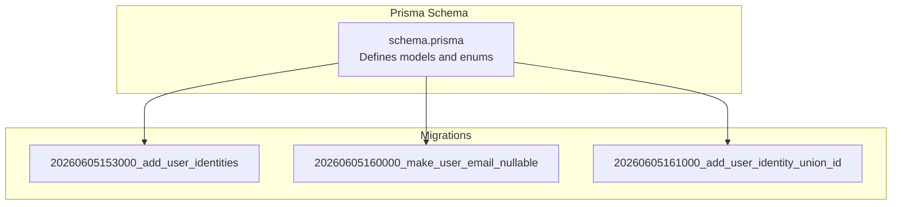
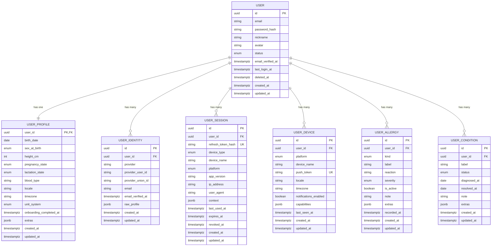
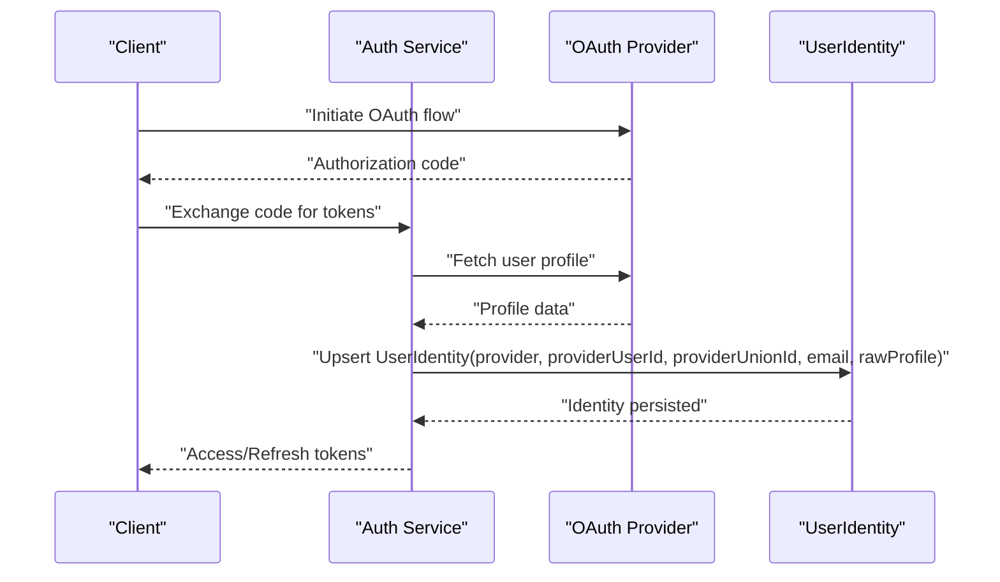
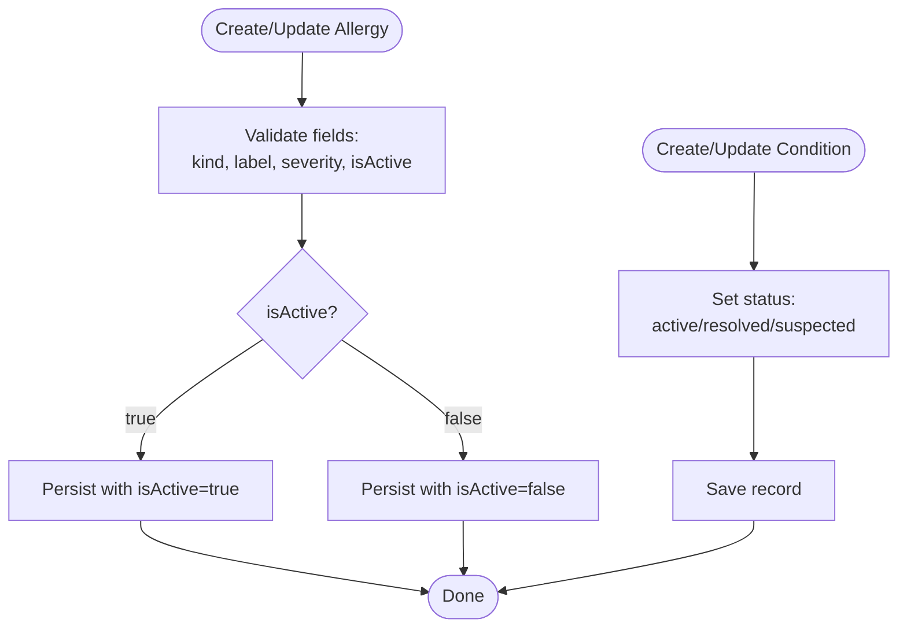
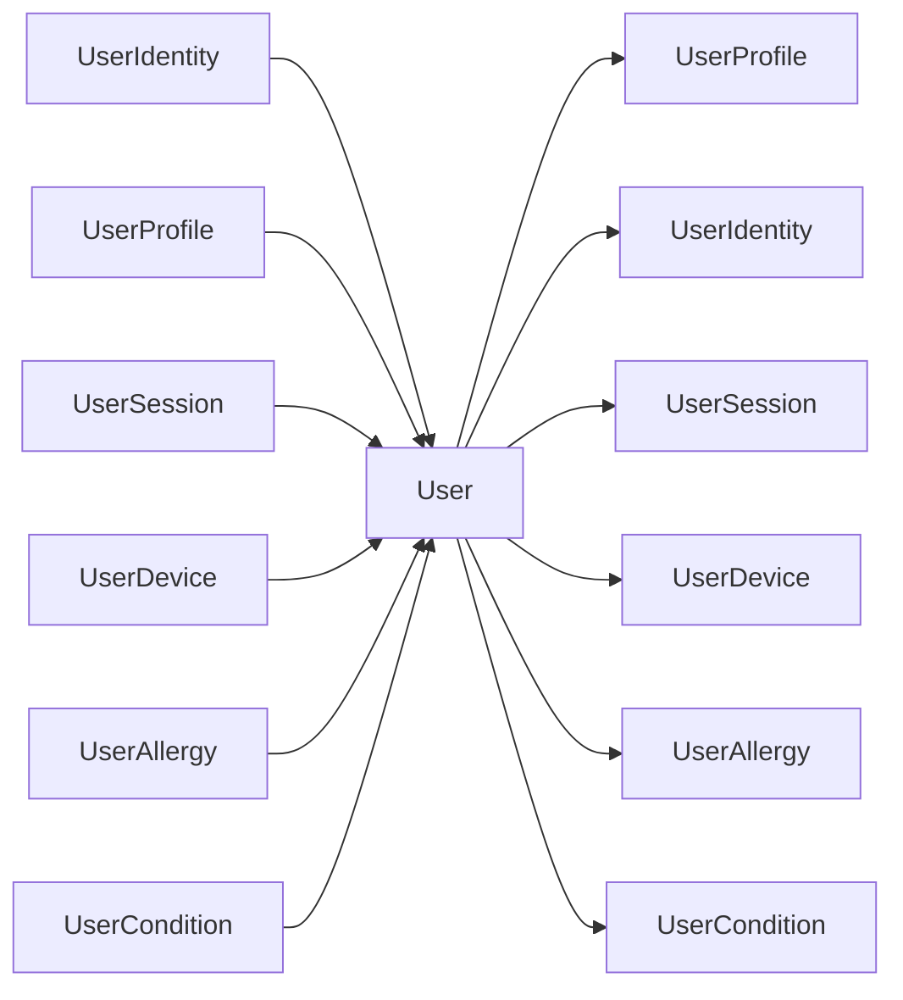

# User Management Entities

<cite>
**Referenced Files in This Document**
- [schema.prisma](file://Lucent/prisma/schema.prisma)
- [20260605153000_add_user_identities/migration.sql](file://Lucent/prisma/migrations/20260605153000_add_user_identities/migration.sql)
- [20260605160000_make_user_email_nullable/migration.sql](file://Lucent/prisma/migrations/20260605160000_make_user_email_nullable/migration.sql)
- [20260605161000_add_user_identity_union_id/migration.sql](file://Lucent/prisma/migrations/20260605161000_add_user_identity_union_id/migration.sql)
- [openapi.json](file://Lucent/docs/openapi.json)
- [UserHealthContextApi.md](file://Luminous/packages/lucent_openapi/doc/UserHealthContextApi.md)
</cite>

## Table of Contents
1. [Introduction](#introduction)
2. [Project Structure](#project-structure)
3. [Core Components](#core-components)
4. [Architecture Overview](#architecture-overview)
5. [Detailed Component Analysis](#detailed-component-analysis)
6. [Dependency Analysis](#dependency-analysis)
7. [Performance Considerations](#performance-considerations)
8. [Troubleshooting Guide](#troubleshooting-guide)
9. [Conclusion](#conclusion)
10. [Appendices](#appendices)

## Introduction
This document describes the user management database entities in the Lumos platform. It focuses on the core user domain models and their relationships, including identity, profile, session, device, allergies, and conditions. It explains attributes, validation rules, indexing strategies, and privacy considerations derived from the Prisma schema and supporting migration files. Where applicable, API documentation references are included to clarify field semantics exposed to clients.

## Project Structure
The user domain is defined centrally in the Prisma schema and extended via PostgreSQL migrations. The schema enumerates domain-specific enums and defines models with relations and indexes. Migrations reflect incremental evolution of the user domain, including nullable email support and OAuth identity enhancements.

**Diagram sources**
- [schema.prisma](file://Lucent/prisma/schema.prisma)
- [20260605153000_add_user_identities/migration.sql](file://Lucent/prisma/migrations/20260605153000_add_user_identities/migration.sql)
- [20260605160000_make_user_email_nullable/migration.sql](file://Lucent/prisma/migrations/20260605160000_make_user_email_nullable/migration.sql)
- [20260605161000_add_user_identity_union_id/migration.sql](file://Lucent/prisma/migrations/20260605161000_add_user_identity_union_id/migration.sql)

**Section sources**
- [schema.prisma](file://Lucent/prisma/schema.prisma)

## Core Components
This section documents the primary user-related entities and their attributes, constraints, and indexes.

- User
  - Purpose: Core account holder with authentication credentials and lifecycle metadata.
  - Key attributes:
    - id: UUID primary key
    - email: String? (nullable per migration)
    - passwordHash: String? (argon2 hashed for local accounts)
    - nickname: String?
    - avatar: String?
    - status: UserStatus enum (@default active)
    - emailVerifiedAt: DateTime?
    - lastLoginAt: DateTime?
    - deletedAt: DateTime?
    - createdAt/updatedAt: DateTime with timestamptz(3)
  - Relations: One-to-one UserProfile, one-to-many UserIdentity, UserSession, UserDevice, UserAllergy, UserCondition, and several others.
  - Indexes: email, status.
  - Notes: Email is nullable; passwordHash is nullable to support OAuth-only accounts.

- UserIdentity
  - Purpose: OAuth integration records linking external providers to a User.
  - Key attributes:
    - id: UUID primary key
    - userId: foreign key to User
    - provider: String
    - providerUserId: String
    - providerUnionId: String? (added via migration)
    - email: String?
    - emailVerifiedAt: DateTime?
    - rawProfile: Json?
    - createdAt/updatedAt: DateTime with timestamptz(3)
  - Constraints: Unique(provider, providerUserId); unique providerUnionId; indexes on userId, providerUnionId, email.
  - Notes: Supports federated sign-in and optional union identifiers.

- UserProfile
  - Purpose: Demographic and health preference data.
  - Key attributes:
    - userId: UUID primary key (foreign key to User)
    - birthDate: Date
    - sexAtBirth: SexAtBirth enum
    - heightCm: Int?
    - pregnancyState: PregnancyState enum
    - lactationState: LactationState enum
    - bloodType: String?
    - locale/timezone/unitSystem: String?
    - onboardingCompletedAt: DateTime?
    - extras: Json?
    - createdAt/updatedAt: DateTime with timestamptz(3)
  - Notes: One-to-one with User via userId.

- UserSession
  - Purpose: JWT refresh token management and device tracking.
  - Key attributes:
    - id: UUID primary key
    - userId: foreign key to User
    - refreshTokenHash: String (unique)
    - deviceType: UserSessionDeviceType enum?
    - deviceName: String?
    - platform: UserDevicePlatform enum?
    - appVersion: String?
    - ipAddress: String?
    - userAgent: String?
    - context: Json?
    - lastUsedAt/ExpiresAt/RevokedAt: DateTime?
    - createdAt/updatedAt: DateTime with timestamptz(3)
  - Indexes: (userId, revokedAt), (userId, expiresAt).
  - Notes: Cascading delete on user removal.

- UserDevice
  - Purpose: Push notification tokens and platform detection.
  - Key attributes:
    - id: UUID primary key
    - userId: foreign key to User
    - platform: UserDevicePlatform enum
    - deviceName: String?
    - pushToken: String? (unique)
    - locale/timezone: String?
    - notificationsEnabled: Boolean (@default false)
    - capabilities: Json?
    - lastSeenAt: DateTime?
    - createdAt/updatedAt: DateTime with timestamptz(3)
  - Indexes: (userId, platform).
  - Notes: Cascading delete on user removal.

- UserAllergy
  - Purpose: Allergy management with severity and reaction tracking.
  - Key attributes:
    - id: UUID primary key
    - userId: foreign key to User
    - kind: UserAllergyKind enum
    - label: String
    - reaction: String?
    - severity: UserAllergySeverity enum (@default unknown)
    - isActive: Boolean (@default true)
    - note: String?
    - extras: Json?
    - recordedAt: DateTime?
    - createdAt/updatedAt: DateTime with timestamptz(3)
  - Indexes: (userId, isActive).
  - Notes: Cascading delete on user removal.

- UserCondition
  - Purpose: Chronic condition tracking with status management.
  - Key attributes:
    - id: UUID primary key
    - userId: foreign key to User
    - label: String
    - status: UserConditionStatus enum (@default active)
    - diagnosedAt/resolvedAt: Date?
    - note: String?
    - extras: Json?
    - createdAt/updatedAt: DateTime with timestamptz(3)
  - Indexes: (userId, status).
  - Notes: Cascading delete on user removal.

**Section sources**
- [schema.prisma](file://Lucent/prisma/schema.prisma)
- [20260605153000_add_user_identities/migration.sql](file://Lucent/prisma/migrations/20260605153000_add_user_identities/migration.sql)
- [20260605160000_make_user_email_nullable/migration.sql](file://Lucent/prisma/migrations/20260605160000_make_user_email_nullable/migration.sql)
- [20260605161000_add_user_identity_union_id/migration.sql](file://Lucent/prisma/migrations/20260605161000_add_user_identity_union_id/migration.sql)

## Architecture Overview
The user domain follows a normalized relational design with explicit foreign keys and cascading deletes. Enumerations encapsulate controlled vocabularies for statuses and categories. JSON fields accommodate flexible metadata while maintaining referential integrity.

**Diagram sources**
- [schema.prisma](file://Lucent/prisma/schema.prisma)

## Detailed Component Analysis

### User Identity OAuth Integration
OAuth integration is modeled via UserIdentity, enabling multiple provider logins per user. The schema supports:
- provider and providerUserId to uniquely identify an external account
- providerUnionId for platform-specific union identifiers
- email and emailVerifiedAt for federated email handling
- rawProfile for storing provider-specific user data

**Diagram sources**
- [schema.prisma](file://Lucent/prisma/schema.prisma)
- [20260605153000_add_user_identities/migration.sql](file://Lucent/prisma/migrations/20260605153000_add_user_identities/migration.sql)
- [20260605161000_add_user_identity_union_id/migration.sql](file://Lucent/prisma/migrations/20260605161000_add_user_identity_union_id/migration.sql)

**Section sources**
- [schema.prisma](file://Lucent/prisma/schema.prisma)
- [20260605153000_add_user_identities/migration.sql](file://Lucent/prisma/migrations/20260605153000_add_user_identities/migration.sql)
- [20260605161000_add_user_identity_union_id/migration.sql](file://Lucent/prisma/migrations/20260605161000_add_user_identity_union_id/migration.sql)

### Allergy and Condition Management Workflows
Allergy and condition records are managed through dedicated DTOs and APIs. The backend enforces defaults and nullable semantics for optional fields.

**Diagram sources**
- [schema.prisma](file://Lucent/prisma/schema.prisma)
- [openapi.json](file://Lucent/docs/openapi.json)
- [UserHealthContextApi.md](file://Luminous/packages/lucent_openapi/doc/UserHealthContextApi.md)

**Section sources**
- [schema.prisma](file://Lucent/prisma/schema.prisma)
- [openapi.json](file://Lucent/docs/openapi.json)
- [UserHealthContextApi.md](file://Luminous/packages/lucent_openapi/doc/UserHealthContextApi.md)

## Dependency Analysis
The user domain exhibits clear parent-child relationships with cascading deletes. Enumerations centralize domain semantics. Indexes optimize frequent queries by email, status, and composite keys.

**Diagram sources**
- [schema.prisma](file://Lucent/prisma/schema.prisma)

**Section sources**
- [schema.prisma](file://Lucent/prisma/schema.prisma)

## Performance Considerations
- Index selection
  - User.email and User.status: Support filtering by email and account state.
  - UserIdentity(provider, providerUserId): Uniqueness constraint; ensure fast lookup by provider+external ID.
  - UserIdentity(providerUnionId), UserIdentity(email): Efficient federation and email-based lookups.
  - UserSession(userId, revokedAt), UserSession(userId, expiresAt): Optimize token revocation and expiration checks.
  - UserDevice(userId, platform): Efficient device targeting.
  - UserAllergy(userId, isActive), UserCondition(userId, status): Filter active allergies and conditions efficiently.
- JSON fields
  - raw_profile, extras, context, capabilities: Flexible but may increase storage; consider pruning unused keys.
- Cascading deletes
  - Ensures referential integrity but may trigger cascade operations on user deletion; plan maintenance windows accordingly.

[No sources needed since this section provides general guidance]

## Troubleshooting Guide
- OAuth identity conflicts
  - Symptom: Duplicate provider+providerUserId.
  - Resolution: Ensure uniqueness constraint is respected; merge or deduplicate identities.
- Nullable email handling
  - Symptom: Authentication attempts without email.
  - Resolution: Email is nullable; ensure downstream logic handles null emails for OAuth-only accounts.
- Union ID updates
  - Symptom: Missing providerUnionId after initial sync.
  - Resolution: Use migration-provided column; update identity records as needed.
- Session cleanup
  - Symptom: Stale sessions accumulating.
  - Resolution: Exploit indexes on (userId, revokedAt) and (userId, expiresAt) to purge expired/revoked sessions.

**Section sources**
- [20260605153000_add_user_identities/migration.sql](file://Lucent/prisma/migrations/20260605153000_add_user_identities/migration.sql)
- [20260605160000_make_user_email_nullable/migration.sql](file://Lucent/prisma/migrations/20260605160000_make_user_email_nullable/migration.sql)
- [20260605161000_add_user_identity_union_id/migration.sql](file://Lucent/prisma/migrations/20260605161000_add_user_identity_union_id/migration.sql)

## Conclusion
The user management entities in Lumos provide a robust foundation for identity, profile, session/device, and health context data. Enums and indexes enforce data integrity and performance, while JSON fields enable flexibility. OAuth integration is first-class, and allergy/condition management aligns with API contracts. Adhering to the documented constraints and indexes ensures reliable operation and maintainability.

[No sources needed since this section summarizes without analyzing specific files]

## Appendices

### Field Validation Rules and Semantics
- User
  - email: nullable; unique at provider level via UserIdentity
  - passwordHash: nullable; present only for local accounts
  - status: enum with default active
- UserIdentity
  - provider+providerUserId: unique
  - providerUnionId: unique
  - rawProfile: JSON blob; provider-specific
- UserProfile
  - Optional demographic fields; units and enums constrained
- UserSession
  - refreshTokenHash: unique; used for refresh token rotation
  - deviceType/platform/appVersion/ipAddress/userAgent/context: optional telemetry
- UserDevice
  - pushToken: unique; enables targeted push delivery
  - notificationsEnabled: default false; opt-in by user
- UserAllergy
  - kind/label/severity: required fields; defaults applied where applicable
  - isActive: toggles visibility in active lists
- UserCondition
  - status: enum with default active

**Section sources**
- [schema.prisma](file://Lucent/prisma/schema.prisma)
- [openapi.json](file://Lucent/docs/openapi.json)

### Audit Trail and Privacy Considerations
- Audit trail
  - createdAt/updatedAt present on most entities; leverage for change tracking.
  - UserSession includes context and timestamps for usage insights.
- Privacy
  - Email is nullable to support privacy-conscious OAuth-only profiles.
  - sensitive health data stored in JSON fields; apply encryption at rest and restrict access via RBAC.
  - Consider anonymization or pseudonymization for analytics pipelines.

[No sources needed since this section provides general guidance]