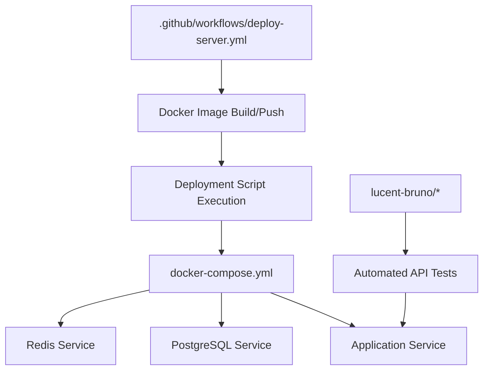
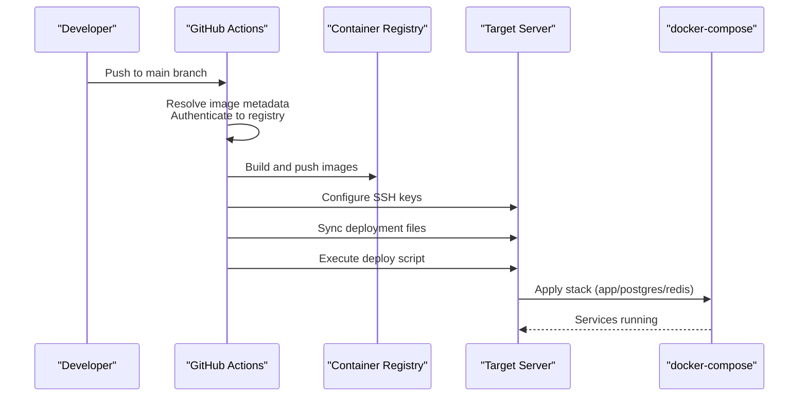
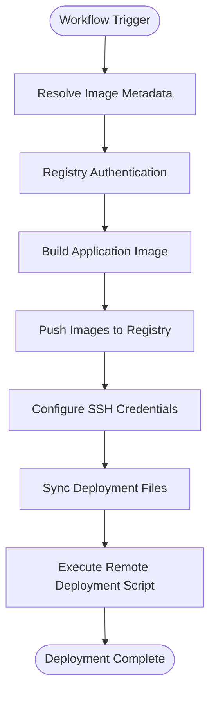
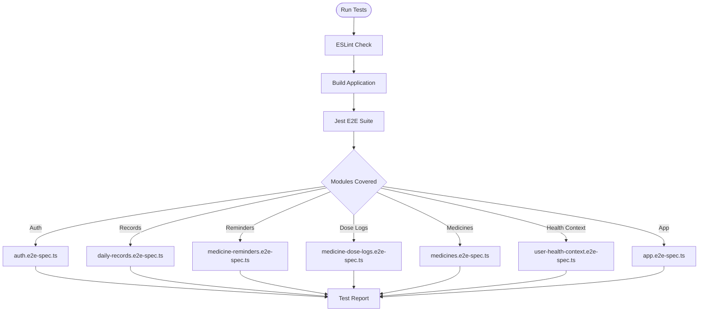
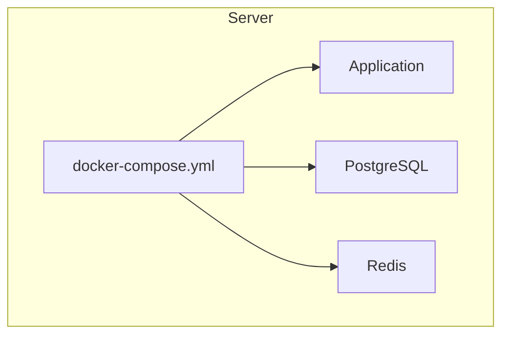
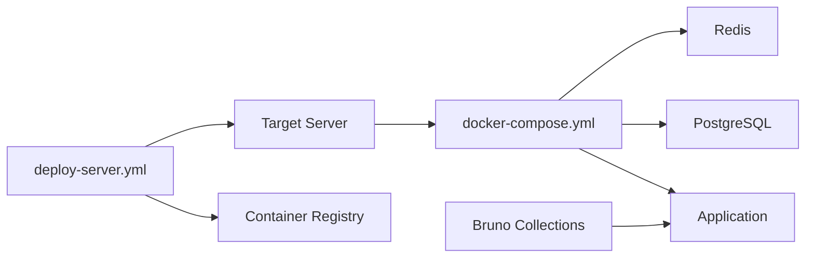

# CI/CD Pipeline

<cite>
**Referenced Files in This Document**
- [deploy-server.yml](file://Lucent/.github/workflows/deploy-server.yml)
- [AGENTS.md](file://AGENTS.md)
- [CLAUDE.md](file://CLAUDE.md)
- [package.json](file://Lucent/package.json)
- [eslint.config.mjs](file://Lucent/eslint.config.mjs)
- [jest-e2e.json](file://Lucent/test/jest-e2e.json)
- [app.e2e-spec.ts](file://Lucent/test/app.e2e-spec.ts)
- [docker-compose.yml](file://Lucent/docker-compose.yml)
- [docker-compose.dev.yml](file://Lucent/docker-compose.dev.yml)
- [Dockerfile](file://Lucent/Dockerfile)
- [scripts/deploy/deploy-server.sh](file://Lucent/scripts/deploy/deploy-server.sh)
- [lucent-bruno/opencollection.yml](file://Lucent/lucent-bruno/opencollection.yml)
- [lucent-bruno/environments/dev.yml](file://Lucent/lucent-bruno/environments/dev.yml)
- [lucent-bruno/environments/prod.yml](file://Lucent/lucent-bruno/environments/prod.yml)
- [lucent-bruno/common/检查可达性.yml](file://Lucent/lucent-bruno/common/检查可达性.yml)
- [docs/tencent-cloud-cicd.md](file://Lucent/docs/tencent-cloud-cicd.md)
</cite>

## Table of Contents
1. [Introduction](#introduction)
2. [Project Structure](#project-structure)
3. [Core Components](#core-components)
4. [Architecture Overview](#architecture-overview)
5. [Detailed Component Analysis](#detailed-component-analysis)
6. [Dependency Analysis](#dependency-analysis)
7. [Performance Considerations](#performance-considerations)
8. [Troubleshooting Guide](#troubleshooting-guide)
9. [Conclusion](#conclusion)
10. [Appendices](#appendices)

## Introduction
This document describes the CI/CD pipeline for the Lumos platform, focusing on the backend service (Lucent). It covers GitHub Actions workflow configuration, build and test stages, deployment processes, quality gates, security scanning integration, environment-specific deployment strategies, automated testing workflows, release management, rollback mechanisms, monitoring, and troubleshooting. The content is derived from the repository’s CI/CD-related files and operational documentation.

## Project Structure
The CI/CD surface area spans several areas:
- GitHub Actions workflow for containerization and deployment
- Build, linting, and testing configuration for the backend
- Container orchestration via Docker Compose
- Deployment automation scripts
- API testing harness using Bruno collections
- Operational documentation for Tencent Cloud CI/CD

**Diagram sources**
- [deploy-server.yml:101-197](file://Lucent/.github/workflows/deploy-server.yml#L101-L197)
- [docker-compose.yml](file://Lucent/docker-compose.yml)
- [scripts/deploy/deploy-server.sh](file://Lucent/scripts/deploy/deploy-server.sh)

**Section sources**
- [deploy-server.yml:101-197](file://Lucent/.github/workflows/deploy-server.yml#L101-L197)
- [docker-compose.yml](file://Lucent/docker-compose.yml)
- [docker-compose.dev.yml](file://Lucent/docker-compose.dev.yml)
- [Dockerfile](file://Lucent/Dockerfile)
- [scripts/deploy/deploy-server.sh](file://Lucent/scripts/deploy/deploy-server.sh)

## Core Components
- GitHub Actions Workflow: Orchestrates image resolution, Docker build/push, and remote deployment via SSH.
- Build and Test Tooling: Uses pnpm scripts for linting, building, and running end-to-end tests.
- Container Orchestration: Defines application, database, and cache services with docker-compose.
- Deployment Automation: Copies deployment artifacts and executes a server-side script to apply changes.
- API Testing: Bruno collection and environment files define automated API tests for development and production.
- Security and Quality Gates: ESLint configuration enforces code quality; optional security scanning can be integrated at the runner level.

**Section sources**
- [deploy-server.yml:101-197](file://Lucent/.github/workflows/deploy-server.yml#L101-L197)
- [AGENTS.md:34-46](file://AGENTS.md#L34-L46)
- [eslint.config.mjs](file://Lucent/eslint.config.mjs)
- [docker-compose.yml](file://Lucent/docker-compose.yml)
- [lucent-bruno/opencollection.yml](file://Lucent/lucent-bruno/opencollection.yml)
- [lucent-bruno/environments/dev.yml](file://Lucent/lucent-bruno/environments/dev.yml)
- [lucent-bruno/environments/prod.yml](file://Lucent/lucent-bruno/environments/prod.yml)

## Architecture Overview
The CI/CD pipeline follows a GitHub Actions-driven flow:
- On pushes to the main branch, the workflow resolves registry metadata, authenticates to the container registry, builds the application image, and pushes it.
- The deployment job configures SSH keys, syncs deployment files to the target server, and executes a deployment script.
- The deployment script applies docker-compose stacks to provision or update the application, database, and cache services.

**Diagram sources**
- [deploy-server.yml:101-197](file://Lucent/.github/workflows/deploy-server.yml#L101-L197)
- [scripts/deploy/deploy-server.sh](file://Lucent/scripts/deploy/deploy-server.sh)
- [docker-compose.yml](file://Lucent/docker-compose.yml)

## Detailed Component Analysis

### GitHub Actions Workflow
- Purpose: Automate container image creation and deployment to a remote server.
- Triggers: Runs on pushes to the main branch; PRs are excluded from deployment.
- Key Steps:
  - Resolve image metadata (registry host, namespace, image name, tags).
  - Authenticate to the registry using repository secrets.
  - Build and push the application image.
  - Configure SSH credentials for the target server.
  - Sync deployment files (compose and script) to the server.
  - Execute the deployment script remotely.

**Diagram sources**
- [deploy-server.yml:101-197](file://Lucent/.github/workflows/deploy-server.yml#L101-L197)

**Section sources**
- [deploy-server.yml:101-197](file://Lucent/.github/workflows/deploy-server.yml#L101-L197)

### Build Stages and Quality Gates
- Build: The backend uses pnpm to compile TypeScript into JavaScript for runtime execution.
- Linting: ESLint enforces code quality and style; the repository configuration defines lint rules and ignores generated files.
- Quality Gates:
  - Lint must pass before builds are considered successful.
  - Optional: Add security scanning (e.g., SAST/SBOM) at the runner level or integrate with third-party tools.

**Section sources**
- [AGENTS.md:34-40](file://AGENTS.md#L34-L40)
- [eslint.config.mjs](file://Lucent/eslint.config.mjs)
- [package.json](file://Lucent/package.json)

### Automated Testing Workflows
- Unit and Integration Tests: Jest configuration enables end-to-end testing across multiple modules.
- E2E Coverage: Separate spec files validate core features (authentication, records, reminders, medicines, user health context).
- API-Level Testing: Bruno collections define reusable requests and environments for development and production, including health checks.

**Diagram sources**
- [jest-e2e.json](file://Lucent/test/jest-e2e.json)
- [app.e2e-spec.ts](file://Lucent/test/app.e2e-spec.ts)

**Section sources**
- [jest-e2e.json](file://Lucent/test/jest-e2e.json)
- [app.e2e-spec.ts](file://Lucent/test/app.e2e-spec.ts)
- [auth.e2e-spec.ts](file://Lucent/test/auth.e2e-spec.ts)
- [daily-records.e2e-spec.ts](file://Lucent/test/daily-records.e2e-spec.ts)
- [medicine-reminders.e2e-spec.ts](file://Lucent/test/medicine-reminders.e2e-spec.ts)
- [medicine-dose-logs.e2e-spec.ts](file://Lucent/test/medicine-dose-logs.e2e-spec.ts)
- [medicines.e2e-spec.ts](file://Lucent/test/medicines.e2e-spec.ts)
- [user-health-context.e2e-spec.ts](file://Lucent/test/user-health-context.e2e-spec.ts)

### API Testing with Bruno
- Collections: Define reusable API requests grouped by feature (e.g., authentication).
- Environments: Separate configurations for development and production endpoints.
- Health Checks: Common endpoint validations ensure service availability during deployments.

**Section sources**
- [lucent-bruno/opencollection.yml](file://Lucent/lucent-bruno/opencollection.yml)
- [lucent-bruno/environments/dev.yml](file://Lucent/lucent-bruno/environments/dev.yml)
- [lucent-bruno/environments/prod.yml](file://Lucent/lucent-bruno/environments/prod.yml)
- [lucent-bruno/common/检查可达性.yml](file://Lucent/lucent-bruno/common/检查可达性.yml)

### Deployment Strategies
- Target Environment: The workflow supports deploying to a single remote server configured via SSH.
- Services Managed: Application, PostgreSQL, and Redis are orchestrated via docker-compose.
- Deployment Method: Files are synced over SSH and a deployment script applies the stack.

**Diagram sources**
- [docker-compose.yml](file://Lucent/docker-compose.yml)
- [scripts/deploy/deploy-server.sh](file://Lucent/scripts/deploy/deploy-server.sh)

**Section sources**
- [deploy-server.yml:162-197](file://Lucent/.github/workflows/deploy-server.yml#L162-L197)
- [docker-compose.yml](file://Lucent/docker-compose.yml)
- [scripts/deploy/deploy-server.sh](file://Lucent/scripts/deploy/deploy-server.sh)

### Rollback Mechanisms and Failure Recovery
- Image Tags: The workflow publishes images with a “latest” tag; rollback can target a previous image digest/tag by updating the compose file and reapplying.
- Health Checks: Bruno environment files include health-check endpoints to validate service readiness post-deployment.
- Failure Recovery: The workflow sets a timeout; failures should be investigated via server logs and the deployment script output.

**Section sources**
- [deploy-server.yml:166-167](file://Lucent/.github/workflows/deploy-server.yml#L166-L167)
- [lucent-bruno/common/检查可达性.yml](file://Lucent/lucent-bruno/common/检查可达性.yml)

### Release Management and Versioning
- Tagging: The workflow does not enforce semantic versioning or Git tags; releases are associated with commits to the main branch.
- Artifact Publishing: The workflow builds and pushes container images; no explicit artifact uploads are configured in the referenced workflow.

**Section sources**
- [deploy-server.yml:101-197](file://Lucent/.github/workflows/deploy-server.yml#L101-L197)

### Security Scanning Integration
- The referenced workflow does not include explicit security scanning steps. Security scanning can be integrated at the runner level or by adding dedicated jobs for SAST/SBOM generation prior to deployment.

**Section sources**
- [deploy-server.yml:101-197](file://Lucent/.github/workflows/deploy-server.yml#L101-L197)

## Dependency Analysis
The CI/CD pipeline depends on:
- GitHub Actions for orchestration and secrets management.
- Container registry for image storage and distribution.
- Target server for runtime deployment.
- docker-compose for service orchestration.
- Bruno collections for API-level regression testing.

**Diagram sources**
- [deploy-server.yml:101-197](file://Lucent/.github/workflows/deploy-server.yml#L101-L197)
- [docker-compose.yml](file://Lucent/docker-compose.yml)
- [lucent-bruno/opencollection.yml](file://Lucent/lucent-bruno/opencollection.yml)

**Section sources**
- [deploy-server.yml:101-197](file://Lucent/.github/workflows/deploy-server.yml#L101-L197)
- [docker-compose.yml](file://Lucent/docker-compose.yml)
- [lucent-bruno/opencollection.yml](file://Lucent/lucent-bruno/opencollection.yml)

## Performance Considerations
- Parallelism: The workflow currently focuses on sequential build and deploy steps; consider parallelizing linting and build tasks where feasible.
- Caching: Introduce caching for dependency installation (pnpm) and Docker layer caching to reduce build times.
- Image Size: Optimize Dockerfile layers and prune unnecessary files to minimize pull/push times.
- Network Efficiency: Use compressed tar transfers for syncing deployment files to the server.

## Troubleshooting Guide
Common issues and resolutions:
- SSH Authentication Failures: Verify server SSH key, known hosts, and user/host/port secrets.
- Registry Authentication Failures: Confirm registry hostname, username, and password secrets match the configured registry.
- Image Resolution Issues: Ensure registry host, namespace, and image name variables are set appropriately.
- Deployment Timeout: Review server-side logs and adjust timeouts if network conditions require it.
- Service Unavailable: Use Bruno health-check endpoints to validate service readiness after deployment.

**Section sources**
- [deploy-server.yml:166-197](file://Lucent/.github/workflows/deploy-server.yml#L166-L197)
- [scripts/deploy/deploy-server.sh](file://Lucent/scripts/deploy/deploy-server.sh)
- [lucent-bruno/common/检查可达性.yml](file://Lucent/lucent-bruno/common/检查可达性.yml)

## Conclusion
The Lumos CI/CD pipeline centers on a streamlined GitHub Actions workflow that builds and pushes container images, then deploys them to a remote server using SSH and docker-compose. Quality gates are enforced via linting, while API-level regression testing is supported by Bruno collections. The current configuration targets a single-server deployment model; enhancements such as environment-specific deployments, blue-green or rolling updates, and integrated security scanning can be introduced to improve reliability and safety.

## Appendices
- Additional operational guidance for Tencent Cloud CI/CD is documented separately and can complement the GitHub Actions workflow.

**Section sources**
- [docs/tencent-cloud-cicd.md](file://Lucent/docs/tencent-cloud-cicd.md)