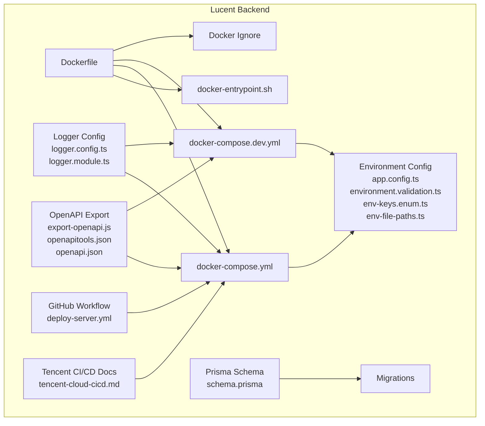
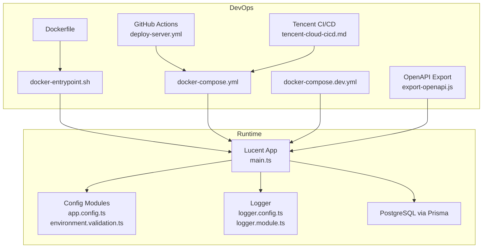
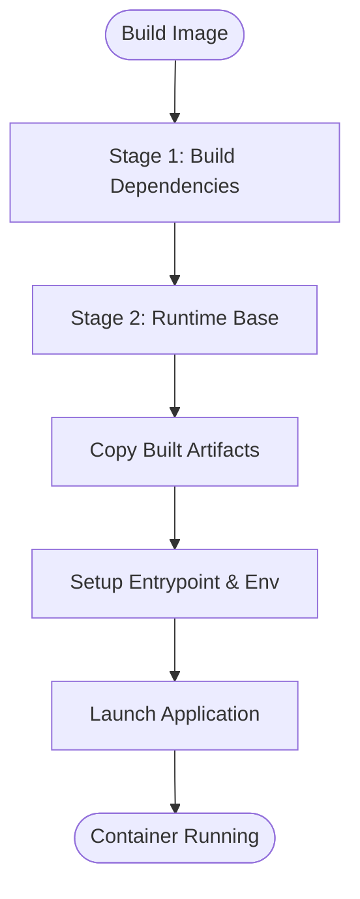
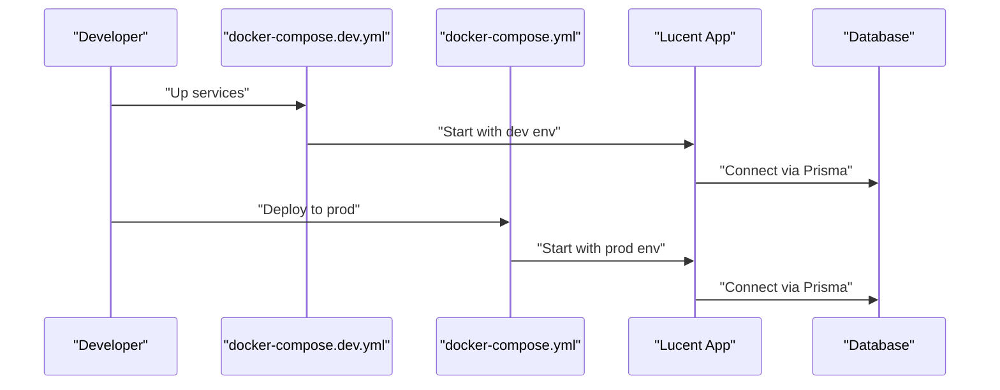
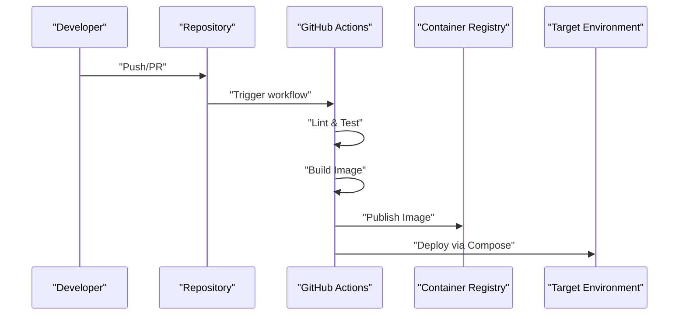
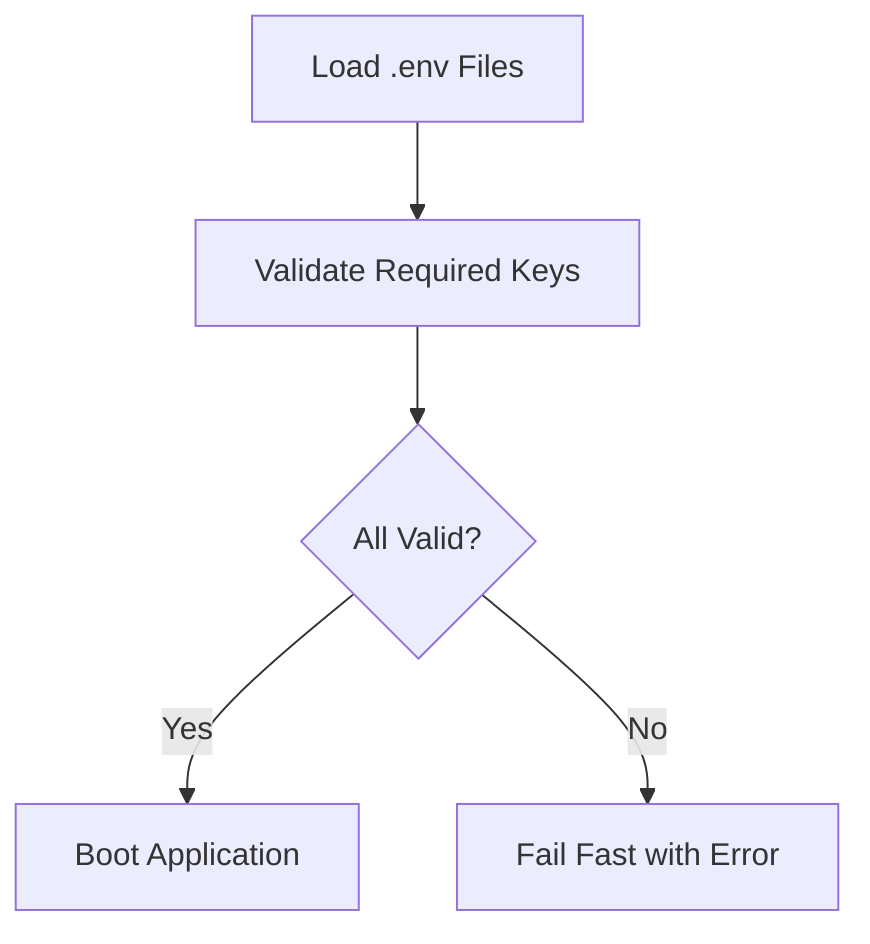
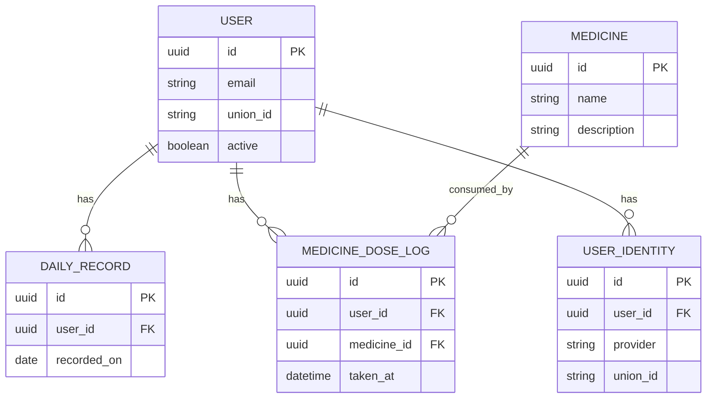
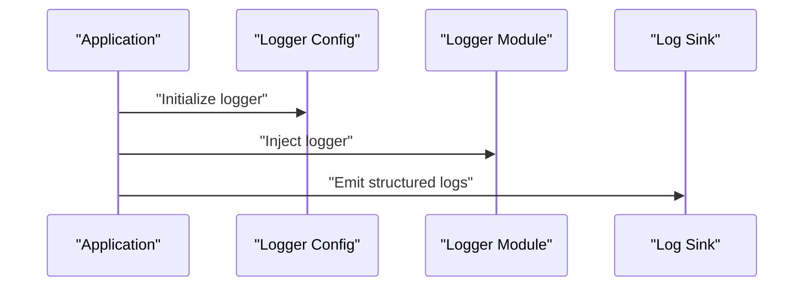
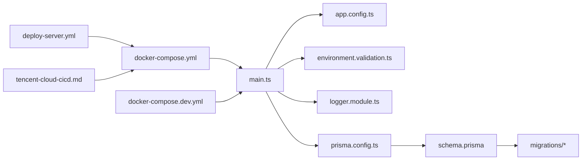

# Deployment & DevOps

<cite>
**Referenced Files in This Document**
- [Dockerfile](file://Lucent/Dockerfile)
- [docker-entrypoint.sh](file://Lucent/docker-entrypoint.sh)
- [docker-compose.yml](file://Lucent/docker-compose.yml)
- [docker-compose.dev.yml](file://Lucent/docker-compose.dev.yml)
- [.dockerignore](file://Lucent/.dockerignore)
- [deploy-server.sh](file://Lucent/scripts/deploy/deploy-server.sh)
- [package.json](file://Lucent/package.json)
- [app.config.ts](file://Lucent/src/config/app.config.ts)
- [environment.validation.ts](file://Lucent/src/config/environment.validation.ts)
- [env-keys.enum.ts](file://Lucent/src/config/env-keys.enum.ts)
- [env-file-paths.ts](file://Lucent/src/config/env-file-paths.ts)
- [logger.config.ts](file://Lucent/src/common/logger/logger.config.ts)
- [logger.module.ts](file://Lucent/src/common/logger/logger.module.ts)
- [main.ts](file://Lucent/src/main.ts)
- [prisma.config.ts](file://Lucent/prisma.config.ts)
- [schema.prisma](file://Lucent/prisma/schema.prisma)
- [20260527131112_init/migration.sql](file://Lucent/prisma/migrations/20260527131112_init/migration.sql)
- [20260530183000_expand_user_domain/migration.sql](file://Lucent/prisma/migrations/20260530183000_expand_user_domain/migration.sql)
- [20260530233000_add_medicine_knowledge/migration.sql](file://Lucent/prisma/migrations/20260530233000_add_medicine_knowledge/migration.sql)
- [20260604000000_add_user_daily_records/migration.sql](file://Lucent/prisma/migrations/20260604000000_add_user_daily_records/migration.sql)
- [20260604010000_add_user_medicine_dose_logs/migration.sql](file://Lucent/prisma/migrations/20260604010000_add_user_medicine_dose_logs/migration.sql)
- [20260605153000_add_user_identities/migration.sql](file://Lucent/prisma/migrations/20260605153000_add_user_identities/migration.sql)
- [20260605160000_make_user_email_nullable/migration.sql](file://Lucent/prisma/migrations/20260605160000_make_user_email_nullable/migration.sql)
- [20260605161000_add_user_identity_union_id/migration.sql](file://Lucent/prisma/migrations/20260605161000_add_user_identity_union_id/migration.sql)
- [20260606133000_add_daily_record_attachments/migration.sql](file://Lucent/prisma/migrations/20260606133000_add_daily_record_attachments/migration.sql)
- [20260608193000_add_user_medicine_reminders/migration.sql](file://Lucent/prisma/migrations/20260608193000_add_user_medicine_reminders/migration.sql)
- [20260610093000_extend_medicine_reminders/migration.sql](file://Lucent/prisma/migrations/20260610093000_extend_medicine_reminders/migration.sql)
- [migration_lock.toml](file://Lucent/prisma/migrations/migration_lock.toml)
- [deploy-server.yml](file://Lucent/.github/workflows/deploy-server.yml)
- [tencent-cloud-cicd.md](file://Lucent/docs/tencent-cloud-cicd.md)
- [export-openapi.js](file://Lucent/scripts/export-openapi.js)
- [openapitools.json](file://Lucent/openapitools.json)
- [openapi.json](file://Lucent/docs/openapi.json)
- [dev.yml](file://Lucent/lucent-bruno/environments/dev.yml)
- [prod.yml](file://Lucent/lucent-bruno/environments/prod.yml)
- [README.md](file://Lucent/README.md)
</cite>

## Table of Contents
1. [Introduction](#introduction)
2. [Project Structure](#project-structure)
3. [Core Components](#core-components)
4. [Architecture Overview](#architecture-overview)
5. [Detailed Component Analysis](#detailed-component-analysis)
6. [Dependency Analysis](#dependency-analysis)
7. [Performance Considerations](#performance-considerations)
8. [Troubleshooting Guide](#troubleshooting-guide)
9. [Conclusion](#conclusion)
10. [Appendices](#appendices)

## Introduction
This document provides comprehensive deployment and DevOps guidance for the Lumos platform, focusing on the backend service (Lucent). It covers containerization strategy, multi-stage Docker builds, orchestration patterns, CI/CD configuration, environment and secrets management, infrastructure provisioning, monitoring and logging, alerting, incident response, scaling and high availability, backup and disaster recovery, and operational runbooks. The content is derived from the repository’s configuration files and scripts to ensure accuracy and reproducibility.

## Project Structure
The deployment-related assets are primarily located under the Lucent backend service:
- Containerization: Dockerfile, docker-entrypoint.sh, docker-compose files, and .dockerignore
- Orchestration: docker-compose.yml and docker-compose.dev.yml
- CI/CD: GitHub Actions workflow and Tencent Cloud CI/CD documentation
- Configuration: Environment validation, environment keys, and environment file paths
- Database: Prisma schema and migrations
- Monitoring and logging: Logger configuration modules
- API documentation: OpenAPI export script and generated spec

**Diagram sources**
- [Dockerfile](file://Lucent/Dockerfile)
- [docker-entrypoint.sh](file://Lucent/docker-entrypoint.sh)
- [docker-compose.yml](file://Lucent/docker-compose.yml)
- [docker-compose.dev.yml](file://Lucent/docker-compose.dev.yml)
- [.dockerignore](file://Lucent/.dockerignore)
- [app.config.ts](file://Lucent/src/config/app.config.ts)
- [environment.validation.ts](file://Lucent/src/config/environment.validation.ts)
- [env-keys.enum.ts](file://Lucent/src/config/env-keys.enum.ts)
- [env-file-paths.ts](file://Lucent/src/config/env-file-paths.ts)
- [schema.prisma](file://Lucent/prisma/schema.prisma)
- [logger.config.ts](file://Lucent/src/common/logger/logger.config.ts)
- [logger.module.ts](file://Lucent/src/common/logger/logger.module.ts)
- [export-openapi.js](file://Lucent/scripts/export-openapi.js)
- [openapitools.json](file://Lucent/openapitools.json)
- [openapi.json](file://Lucent/docs/openapi.json)
- [deploy-server.yml](file://Lucent/.github/workflows/deploy-server.yml)
- [tencent-cloud-cicd.md](file://Lucent/docs/tencent-cloud-cicd.md)

**Section sources**
- [Dockerfile](file://Lucent/Dockerfile)
- [docker-compose.yml](file://Lucent/docker-compose.yml)
- [docker-compose.dev.yml](file://Lucent/docker-compose.dev.yml)
- [app.config.ts](file://Lucent/src/config/app.config.ts)
- [environment.validation.ts](file://Lucent/src/config/environment.validation.ts)
- [env-keys.enum.ts](file://Lucent/src/config/env-keys.enum.ts)
- [env-file-paths.ts](file://Lucent/src/config/env-file-paths.ts)
- [schema.prisma](file://Lucent/prisma/schema.prisma)

## Core Components
- Containerization: Multi-stage Docker build with entrypoint initialization and environment injection
- Orchestration: Compose files define services, networks, volumes, and environment overrides for dev and prod
- CI/CD: GitHub Actions workflow orchestrates linting, tests, build, and deployment steps; Tencent CI/CD documentation complements cloud-specific automation
- Configuration: Strongly-typed environment validation and centralized configuration keys
- Database: Prisma ORM with explicit migration history and lock file
- Logging: Centralized logger configuration for structured logs
- API documentation: Automated OpenAPI generation for API contract management

**Section sources**
- [Dockerfile](file://Lucent/Dockerfile)
- [docker-entrypoint.sh](file://Lucent/docker-entrypoint.sh)
- [docker-compose.yml](file://Lucent/docker-compose.yml)
- [docker-compose.dev.yml](file://Lucent/docker-compose.dev.yml)
- [deploy-server.yml](file://Lucent/.github/workflows/deploy-server.yml)
- [tencent-cloud-cicd.md](file://Lucent/docs/tencent-cloud-cicd.md)
- [app.config.ts](file://Lucent/src/config/app.config.ts)
- [environment.validation.ts](file://Lucent/src/config/environment.validation.ts)
- [env-keys.enum.ts](file://Lucent/src/config/env-keys.enum.ts)
- [env-file-paths.ts](file://Lucent/src/config/env-file-paths.ts)
- [schema.prisma](file://Lucent/prisma/schema.prisma)
- [logger.config.ts](file://Lucent/src/common/logger/logger.config.ts)
- [logger.module.ts](file://Lucent/src/common/logger/logger.module.ts)
- [export-openapi.js](file://Lucent/scripts/export-openapi.js)
- [openapitools.json](file://Lucent/openapitools.json)
- [openapi.json](file://Lucent/docs/openapi.json)

## Architecture Overview
The deployment architecture centers on a containerized backend service orchestrated via Docker Compose. The backend integrates with database migrations managed by Prisma, exposes APIs documented via OpenAPI, and supports CI/CD pipelines for automated releases.

**Diagram sources**
- [main.ts](file://Lucent/src/main.ts)
- [app.config.ts](file://Lucent/src/config/app.config.ts)
- [environment.validation.ts](file://Lucent/src/config/environment.validation.ts)
- [logger.config.ts](file://Lucent/src/common/logger/logger.config.ts)
- [logger.module.ts](file://Lucent/src/common/logger/logger.module.ts)
- [Dockerfile](file://Lucent/Dockerfile)
- [docker-entrypoint.sh](file://Lucent/docker-entrypoint.sh)
- [docker-compose.yml](file://Lucent/docker-compose.yml)
- [docker-compose.dev.yml](file://Lucent/docker-compose.dev.yml)
- [deploy-server.yml](file://Lucent/.github/workflows/deploy-server.yml)
- [tencent-cloud-cicd.md](file://Lucent/docs/tencent-cloud-cicd.md)
- [export-openapi.js](file://Lucent/scripts/export-openapi.js)

## Detailed Component Analysis

### Containerization Strategy
- Multi-stage Docker build: Separates build-time dependencies from runtime image to minimize footprint and attack surface
- Entrypoint initialization: Ensures environment setup and pre-deployment tasks before launching the NestJS application
- Compose orchestration: Defines services, networks, volumes, and environment overrides for development and production
- Ignore patterns: Excludes unnecessary files from the image build context

**Diagram sources**
- [Dockerfile](file://Lucent/Dockerfile)
- [docker-entrypoint.sh](file://Lucent/docker-entrypoint.sh)

**Section sources**
- [Dockerfile](file://Lucent/Dockerfile)
- [docker-entrypoint.sh](file://Lucent/docker-entrypoint.sh)
- [.dockerignore](file://Lucent/.dockerignore)

### Orchestration Patterns
- Production compose: Defines backend service, database, and network/volume bindings; suitable for production deployments
- Development compose: Overrides environment variables and mounts source directories for rapid iteration
- Environment overrides: Compose files specify environment file paths and keys consumed by the application

**Diagram sources**
- [docker-compose.dev.yml](file://Lucent/docker-compose.dev.yml)
- [docker-compose.yml](file://Lucent/docker-compose.yml)
- [main.ts](file://Lucent/src/main.ts)
- [schema.prisma](file://Lucent/prisma/schema.prisma)

**Section sources**
- [docker-compose.yml](file://Lucent/docker-compose.yml)
- [docker-compose.dev.yml](file://Lucent/docker-compose.dev.yml)
- [env-file-paths.ts](file://Lucent/src/config/env-file-paths.ts)
- [env-keys.enum.ts](file://Lucent/src/config/env-keys.enum.ts)

### CI/CD Pipeline Configuration
- GitHub Actions workflow: Automates linting, unit/e2e tests, building, and deployment steps
- Tencent CI/CD documentation: Provides cloud-specific automation guidance aligned with the platform’s infrastructure
- OpenAPI export: Ensures API contracts are generated and versioned alongside releases

**Diagram sources**
- [deploy-server.yml](file://Lucent/.github/workflows/deploy-server.yml)
- [tencent-cloud-cicd.md](file://Lucent/docs/tencent-cloud-cicd.md)
- [export-openapi.js](file://Lucent/scripts/export-openapi.js)

**Section sources**
- [deploy-server.yml](file://Lucent/.github/workflows/deploy-server.yml)
- [tencent-cloud-cicd.md](file://Lucent/docs/tencent-cloud-cicd.md)
- [openapitools.json](file://Lucent/openapitools.json)
- [openapi.json](file://Lucent/docs/openapi.json)

### Environment Variable Configuration and Secrets Management
- Strong typing: Environment keys are defined as enums to prevent typos and enforce consistency
- Validation: Environment variables are validated during startup to fail fast on misconfiguration
- File paths: Separate environment files per environment are loaded via Compose
- Secrets: Sensitive values are injected via environment variables or secret managers in production

**Diagram sources**
- [env-keys.enum.ts](file://Lucent/src/config/env-keys.enum.ts)
- [environment.validation.ts](file://Lucent/src/config/environment.validation.ts)
- [env-file-paths.ts](file://Lucent/src/config/env-file-paths.ts)
- [docker-compose.yml](file://Lucent/docker-compose.yml)
- [docker-compose.dev.yml](file://Lucent/docker-compose.dev.yml)

**Section sources**
- [env-keys.enum.ts](file://Lucent/src/config/env-keys.enum.ts)
- [environment.validation.ts](file://Lucent/src/config/environment.validation.ts)
- [env-file-paths.ts](file://Lucent/src/config/env-file-paths.ts)
- [docker-compose.yml](file://Lucent/docker-compose.yml)
- [docker-compose.dev.yml](file://Lucent/docker-compose.dev.yml)

### Infrastructure Provisioning
- Database provisioning: Prisma schema defines the relational model; migrations manage schema evolution
- Migration safety: Lock file prevents concurrent migrations; explicit migration SQL files track changes
- Compose services: Database service definition and connection configuration are provided in compose files

**Diagram sources**
- [schema.prisma](file://Lucent/prisma/schema.prisma)
- [20260527131112_init/migration.sql](file://Lucent/prisma/migrations/20260527131112_init/migration.sql)
- [20260530183000_expand_user_domain/migration.sql](file://Lucent/prisma/migrations/20260530183000_expand_user_domain/migration.sql)
- [20260530233000_add_medicine_knowledge/migration.sql](file://Lucent/prisma/migrations/20260530233000_add_medicine_knowledge/migration.sql)
- [20260604000000_add_user_daily_records/migration.sql](file://Lucent/prisma/migrations/20260604000000_add_user_daily_records/migration.sql)
- [20260604010000_add_user_medicine_dose_logs/migration.sql](file://Lucent/prisma/migrations/20260604010000_add_user_medicine_dose_logs/migration.sql)
- [20260605153000_add_user_identities/migration.sql](file://Lucent/prisma/migrations/20260605153000_add_user_identities/migration.sql)
- [20260605160000_make_user_email_nullable/migration.sql](file://Lucent/prisma/migrations/20260605160000_make_user_email_nullable/migration.sql)
- [20260605161000_add_user_identity_union_id/migration.sql](file://Lucent/prisma/migrations/20260605161000_add_user_identity_union_id/migration.sql)
- [20260606133000_add_daily_record_attachments/migration.sql](file://Lucent/prisma/migrations/20260606133000_add_daily_record_attachments/migration.sql)
- [20260608193000_add_user_medicine_reminders/migration.sql](file://Lucent/prisma/migrations/20260608193000_add_user_medicine_reminders/migration.sql)
- [20260610093000_extend_medicine_reminders/migration.sql](file://Lucent/prisma/migrations/20260610093000_extend_medicine_reminders/migration.sql)

**Section sources**
- [schema.prisma](file://Lucent/prisma/schema.prisma)
- [migration_lock.toml](file://Lucent/prisma/migrations/migration_lock.toml)
- [docker-compose.yml](file://Lucent/docker-compose.yml)

### Monitoring and Logging Setup
- Structured logging: Logger configuration module centralizes log formatting and transport
- Integration: Logger module can be wired into application lifecycle for consistent logging across services

**Diagram sources**
- [logger.config.ts](file://Lucent/src/common/logger/logger.config.ts)
- [logger.module.ts](file://Lucent/src/common/logger/logger.module.ts)

**Section sources**
- [logger.config.ts](file://Lucent/src/common/logger/logger.config.ts)
- [logger.module.ts](file://Lucent/src/common/logger/logger.module.ts)

### Alerting Strategies and Incident Response
- API contracts: OpenAPI specification enables contract testing and regression detection
- E2E tests: CI pipeline includes end-to-end tests to catch integration failures early
- Observability: Combine structured logs with metrics and traces; configure alerts on error rates and latency thresholds

[No sources needed since this section provides general guidance]

### Scaling Considerations, Load Balancing, and High Availability
- Stateless backend: Design the application to be stateless to enable horizontal scaling
- Database HA: Configure PostgreSQL high availability and replication; Prisma connections should leverage connection pooling
- Reverse proxy: Place a load balancer in front of multiple backend instances
- Health checks: Implement readiness/liveness probes in Compose or Kubernetes manifests

[No sources needed since this section provides general guidance]

### Backup and Disaster Recovery Procedures
- Database backups: Schedule regular logical backups of PostgreSQL; retain rotation policies
- Migration safety: Use Prisma migrations with the lock file to avoid concurrent schema changes
- Recovery drills: Practice restoring from backups and reapplying migrations

[No sources needed since this section provides general guidance]

### Maintenance Schedules and Operational Runbooks
- Patching: Regularly update base images and dependencies; automate scanning and remediation
- Drift detection: Periodically diff deployed Compose stacks against desired state
- Runbooks: Document rollback procedures, secrets rotation, and emergency contact escalation

[No sources needed since this section provides general guidance]

## Dependency Analysis
The backend depends on configuration modules, logger modules, Prisma ORM, and Compose orchestration. CI/CD pipelines depend on GitHub Actions and Tencent CI/CD documentation.

**Diagram sources**
- [main.ts](file://Lucent/src/main.ts)
- [app.config.ts](file://Lucent/src/config/app.config.ts)
- [environment.validation.ts](file://Lucent/src/config/environment.validation.ts)
- [logger.module.ts](file://Lucent/src/common/logger/logger.module.ts)
- [prisma.config.ts](file://Lucent/prisma.config.ts)
- [schema.prisma](file://Lucent/prisma/schema.prisma)
- [docker-compose.yml](file://Lucent/docker-compose.yml)
- [docker-compose.dev.yml](file://Lucent/docker-compose.dev.yml)
- [deploy-server.yml](file://Lucent/.github/workflows/deploy-server.yml)
- [tencent-cloud-cicd.md](file://Lucent/docs/tencent-cloud-cicd.md)

**Section sources**
- [main.ts](file://Lucent/src/main.ts)
- [app.config.ts](file://Lucent/src/config/app.config.ts)
- [environment.validation.ts](file://Lucent/src/config/environment.validation.ts)
- [logger.module.ts](file://Lucent/src/common/logger/logger.module.ts)
- [prisma.config.ts](file://Lucent/prisma.config.ts)
- [schema.prisma](file://Lucent/prisma/schema.prisma)
- [docker-compose.yml](file://Lucent/docker-compose.yml)
- [docker-compose.dev.yml](file://Lucent/docker-compose.dev.yml)
- [deploy-server.yml](file://Lucent/.github/workflows/deploy-server.yml)
- [tencent-cloud-cicd.md](file://Lucent/docs/tencent-cloud-cicd.md)

## Performance Considerations
- Image size: Minimize layers and prune dev dependencies in production stages
- Startup time: Entrypoint should handle database migrations and warm-up routines
- Database tuning: Use Prisma connection pooling and optimize queries; monitor slow queries
- Caching: Integrate caching layers for frequently accessed data
- Resource limits: Set CPU/memory limits in Compose for predictable scheduling

[No sources needed since this section provides general guidance]

## Troubleshooting Guide
- Environment validation failures: Review environment keys and values; confirm Compose environment file paths
- Database connectivity: Verify Prisma connection string and migration status
- Logging: Ensure logger module is initialized and sink is configured
- CI/CD failures: Inspect workflow logs and artifact publishing steps

**Section sources**
- [environment.validation.ts](file://Lucent/src/config/environment.validation.ts)
- [env-file-paths.ts](file://Lucent/src/config/env-file-paths.ts)
- [docker-compose.yml](file://Lucent/docker-compose.yml)
- [docker-compose.dev.yml](file://Lucent/docker-compose.dev.yml)
- [logger.config.ts](file://Lucent/src/common/logger/logger.config.ts)
- [logger.module.ts](file://Lucent/src/common/logger/logger.module.ts)
- [deploy-server.yml](file://Lucent/.github/workflows/deploy-server.yml)

## Conclusion
This guide consolidates the Lumos platform’s deployment and DevOps practices derived from the repository. By leveraging multi-stage Docker builds, Compose orchestration, CI/CD automation, robust configuration and validation, Prisma migrations, and structured logging, teams can reliably operate the platform across development, staging, and production environments while maintaining observability, scalability, and resilience.

## Appendices

### Step-by-Step Deployment Instructions

- Development Environment
  - Start services with the development compose file
  - Confirm environment files are loaded via Compose
  - Access logs and inspect application behavior

- Staging Environment
  - Prepare environment variables and secrets
  - Apply Prisma migrations
  - Deploy using the production compose file

- Production Environment
  - Secure secrets and environment files
  - Run database migrations safely with the lock file
  - Deploy and validate API contracts via OpenAPI

**Section sources**
- [docker-compose.dev.yml](file://Lucent/docker-compose.dev.yml)
- [docker-compose.yml](file://Lucent/docker-compose.yml)
- [migration_lock.toml](file://Lucent/prisma/migrations/migration_lock.toml)
- [openapi.json](file://Lucent/docs/openapi.json)

### Environment Variables Reference
- Define environment keys via the enum and ensure they are present in the appropriate environment files
- Validate environment variables at startup to prevent runtime errors

**Section sources**
- [env-keys.enum.ts](file://Lucent/src/config/env-keys.enum.ts)
- [environment.validation.ts](file://Lucent/src/config/environment.validation.ts)
- [env-file-paths.ts](file://Lucent/src/config/env-file-paths.ts)

### Secrets Management
- Inject secrets via environment variables or secret managers
- Avoid committing secrets to version control
- Rotate secrets regularly and update deployments accordingly

[No sources needed since this section provides general guidance]

### Release Management Processes
- Tag releases and publish container images
- Update OpenAPI specs and share with consumers
- Perform smoke tests in staging before production rollout

**Section sources**
- [deploy-server.yml](file://Lucent/.github/workflows/deploy-server.yml)
- [openapitools.json](file://Lucent/openapitools.json)
- [openapi.json](file://Lucent/docs/openapi.json)

### API Testing Environments
- Use Bruno collections to test development and production environments
- Maintain separate environment configurations for each target

**Section sources**
- [dev.yml](file://Lucent/lucent-bruno/environments/dev.yml)
- [prod.yml](file://Lucent/lucent-bruno/environments/prod.yml)