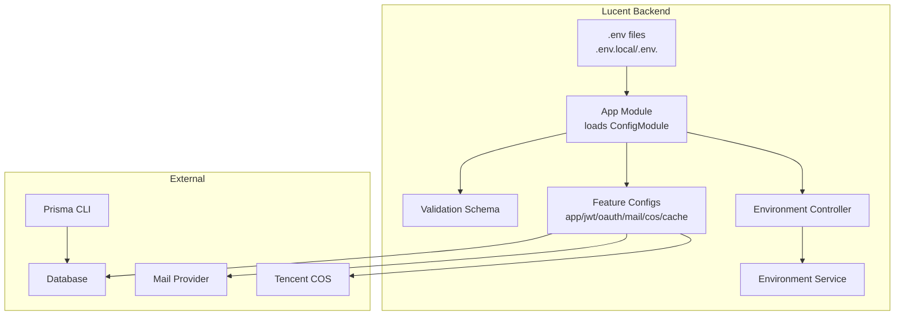
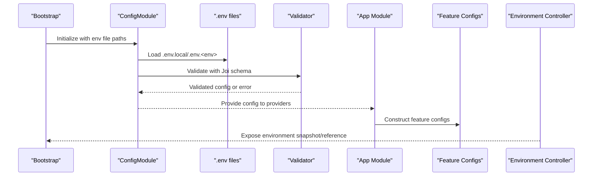
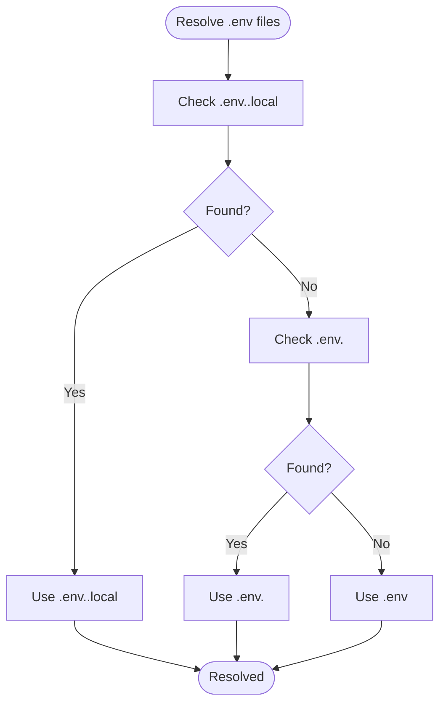
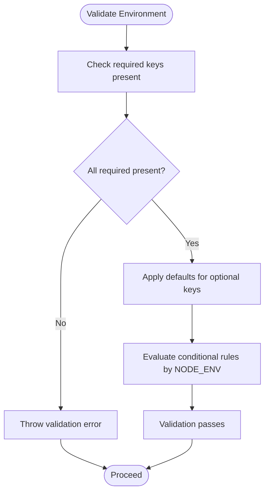
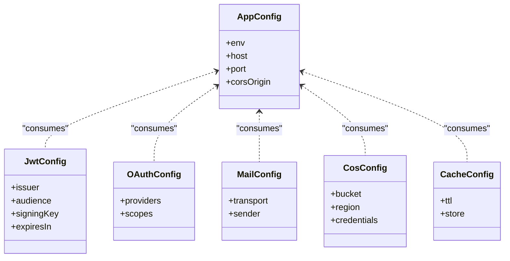
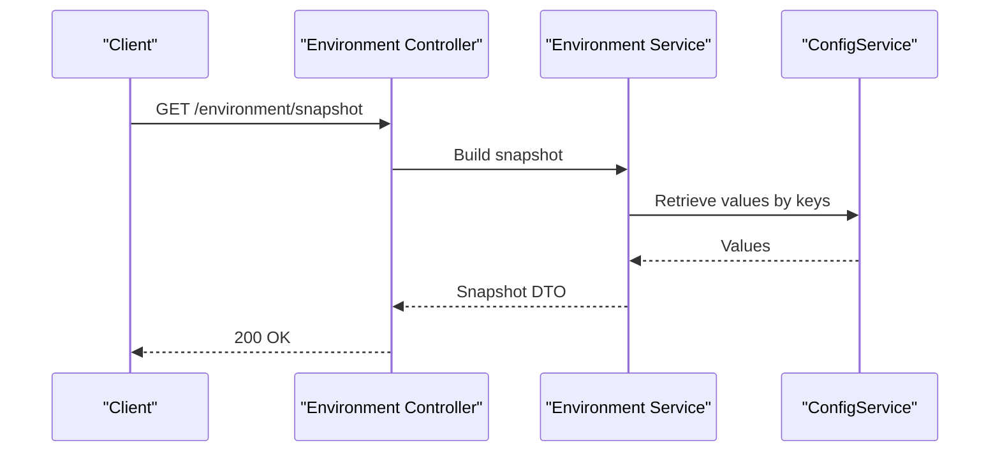
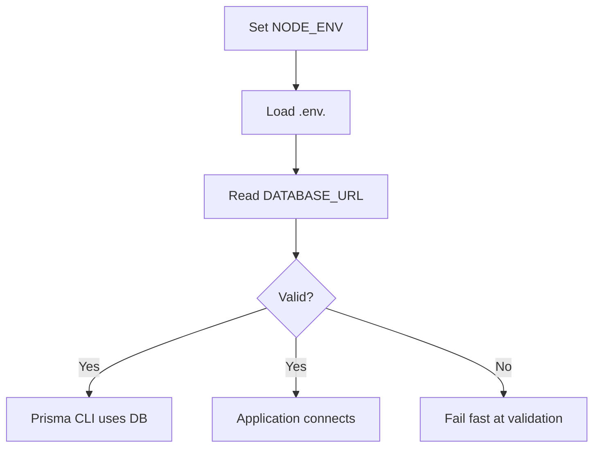
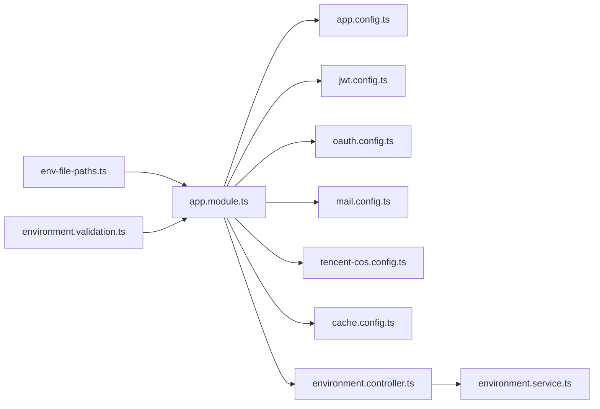

# Environment Configuration

<cite>
**Referenced Files in This Document**
- [app.module.ts](file://Lucent/src/app.module.ts)
- [main.ts](file://Lucent/src/main.ts)
- [env-file-paths.ts](file://Lucent/src/config/env-file-paths.ts)
- [env-keys.enum.ts](file://Lucent/src/config/env-keys.enum.ts)
- [config-keys.enum.ts](file://Lucent/src/config/config-keys.enum.ts)
- [environment.validation.ts](file://Lucent/src/config/environment.validation.ts)
- [environment.validation.spec.ts](file://Lucent/src/config/environment.validation.spec.ts)
- [app.config.ts](file://Lucent/src/config/app.config.ts)
- [jwt.config.ts](file://Lucent/src/config/jwt.config.ts)
- [oauth.config.ts](file://Lucent/src/config/oauth.config.ts)
- [mail.config.ts](file://Lucent/src/config/mail.config.ts)
- [tencent-cos.config.ts](file://Lucent/src/config/tencent-cos.config.ts)
- [cache.config.ts](file://Lucent/src/config/cache.config.ts)
- [environment.controller.ts](file://Lucent/src/modules/environment/environment.controller.ts)
- [environment.service.ts](file://Lucent/src/modules/environment/environment.service.ts)
- [environment-reference.ts](file://Lucent/src/modules/environment/environment-reference.ts)
- [logger.module.ts](file://Lucent/src/common/logger/logger.module.ts)
- [prisma.config.ts](file://Lucent/prisma.config.ts)
- [docker-compose.yml](file://Lucent/docker-compose.yml)
- [docker-compose.dev.yml](file://Lucent/docker-compose.dev.yml)
- [deploy-server.sh](file://Lucent/scripts/deploy/deploy-server.sh)
- [dev/up-local-stack.ps1](file://Lucent/scripts/dev/up-local-stack.ps1)
- [dev/down-local-stack.ps1](file://Lucent/scripts/dev/down-local-stack.ps1)
- [dev/migrate-local-databases.ps1](file://Lucent/scripts/dev/migrate-local-databases.ps1)
- [dev/import-medicine-datasets.ps1](file://Lucent/scripts/dev/import-medicine-datasets.ps1)
- [lucent-bruno/environments/dev.yml](file://Lucent/lucent-bruno/environments/dev.yml)
- [lucent-bruno/environments/prod.yml](file://Lucent/lucent-brugo/environments/prod.yml)
</cite>

## Table of Contents
1. [Introduction](#introduction)
2. [Project Structure](#project-structure)
3. [Core Components](#core-components)
4. [Architecture Overview](#architecture-overview)
5. [Detailed Component Analysis](#detailed-component-analysis)
6. [Dependency Analysis](#dependency-analysis)
7. [Performance Considerations](#performance-considerations)
8. [Troubleshooting Guide](#troubleshooting-guide)
9. [Conclusion](#conclusion)
10. [Appendices](#appendices)

## Introduction
This document explains how the Lumos platform manages environment configuration across development, testing, staging, and production environments. It covers environment variable loading, validation, defaults, secrets handling, configuration file organization, and integration with external services. It also documents configuration validation rules, type safety measures, runtime configuration updates via the Environment module, and operational practices to prevent configuration drift and maintain security.

## Project Structure
The environment configuration system centers on the Lucent backend (NestJS) and complementary DevOps tooling:
- Environment files: .env.*.local and .env.* resolved by the ConfigModule
- Validation: Joi-based schema applied during application bootstrap
- Feature configs: app, JWT, OAuth, mail, Tencent COS, cache
- Runtime exposure: Environment controller/service for snapshot and reference
- Orchestration: Docker Compose for local and CI/CD deployments
- Testing: Bruno collections for environment-specific API testing

**Diagram sources**
- [app.module.ts](file://Lucent/src/app.module.ts)
- [env-file-paths.ts](file://Lucent/src/config/env-file-paths.ts)
- [environment.validation.ts](file://Lucent/src/config/environment.validation.ts)
- [app.config.ts](file://Lucent/src/config/app.config.ts)
- [jwt.config.ts](file://Lucent/src/config/jwt.config.ts)
- [oauth.config.ts](file://Lucent/src/config/oauth.config.ts)
- [mail.config.ts](file://Lucent/src/config/mail.config.ts)
- [tencent-cos.config.ts](file://Lucent/src/config/tencent-cos.config.ts)
- [cache.config.ts](file://Lucent/src/config/cache.config.ts)
- [environment.controller.ts](file://Lucent/src/modules/environment/environment.controller.ts)
- [environment.service.ts](file://Lucent/src/modules/environment/environment.service.ts)
- [prisma.config.ts](file://Lucent/prisma.config.ts)

**Section sources**
- [app.module.ts](file://Lucent/src/app.module.ts)
- [env-file-paths.ts](file://Lucent/src/config/env-file-paths.ts)
- [environment.validation.ts](file://Lucent/src/config/environment.validation.ts)

## Core Components
- Environment file resolution: The ConfigModule loads .env files in precedence order based on NODE_ENV.
- Validation: A Joi schema validates required variables and applies conditional rules.
- Feature configurations: Typed configuration factories for app, JWT, OAuth, mail, Tencent COS, and cache.
- Runtime exposure: Environment module exposes a snapshot and reference of current configuration.
- Secrets handling: Admin credentials and cookie secret are retrieved via ConfigService; sensitive keys are defined as enums.
- Defaults: Safe defaults are applied for non-sensitive values; missing required values cause startup failure.

**Section sources**
- [env-file-paths.ts](file://Lucent/src/config/env-file-paths.ts)
- [environment.validation.ts](file://Lucent/src/config/environment.validation.ts)
- [app.config.ts](file://Lucent/src/config/app.config.ts)
- [jwt.config.ts](file://Lucent/src/config/jwt.config.ts)
- [oauth.config.ts](file://Lucent/src/config/oauth.config.ts)
- [mail.config.ts](file://Lucent/src/config/mail.config.ts)
- [tencent-cos.config.ts](file://Lucent/src/config/tencent-cos.config.ts)
- [cache.config.ts](file://Lucent/src/config/cache.config.ts)
- [environment.controller.ts](file://Lucent/src/modules/environment/environment.controller.ts)
- [environment.service.ts](file://Lucent/src/modules/environment/environment.service.ts)
- [env-keys.enum.ts](file://Lucent/src/config/env-keys.enum.ts)
- [config-keys.enum.ts](file://Lucent/src/config/config-keys.enum.ts)

## Architecture Overview
The configuration lifecycle spans file loading, validation, and runtime consumption by feature modules. The Environment module provides a controlled way to inspect configuration at runtime.

**Diagram sources**
- [app.module.ts](file://Lucent/src/app.module.ts)
- [env-file-paths.ts](file://Lucent/src/config/env-file-paths.ts)
- [environment.validation.ts](file://Lucent/src/config/environment.validation.ts)
- [environment.controller.ts](file://Lucent/src/modules/environment/environment.controller.ts)

## Detailed Component Analysis

### Environment File Organization and Resolution
- Precedence: .env.<env>.local overrides .env.<env>, which overrides .env.
- Resolution logic: Determined by NODE_ENV; defaults to development when unset.
- Prisma mirroring: The Prisma CLI resolves the same .env files to target the correct database per NODE_ENV.

**Diagram sources**
- [env-file-paths.ts](file://Lucent/src/config/env-file-paths.ts)
- [prisma.config.ts](file://Lucent/prisma.config.ts)

**Section sources**
- [env-file-paths.ts](file://Lucent/src/config/env-file-paths.ts)
- [prisma.config.ts](file://Lucent/prisma.config.ts)

### Configuration Validation and Type Safety
- Validation schema: Joi enforces presence and types of required variables; optional variables receive defaults.
- Conditional validation: Some variables are required only under specific NODE_ENV values.
- Test coverage: Unit tests assert validation behavior across environments.

**Diagram sources**
- [environment.validation.ts](file://Lucent/src/config/environment.validation.ts)
- [environment.validation.spec.ts](file://Lucent/src/config/environment.validation.spec.ts)

**Section sources**
- [environment.validation.ts](file://Lucent/src/config/environment.validation.ts)
- [environment.validation.spec.ts](file://Lucent/src/config/environment.validation.spec.ts)

### Feature Configuration Modules
- Application config: Host, port, CORS origin, and environment.
- JWT config: Token issuer, audience, signing keys, expiration.
- OAuth config: Provider settings and scopes.
- Mail config: Transport settings and sender identity.
- Tencent COS config: Bucket, region, credentials.
- Cache config: TTL and store settings.

**Diagram sources**
- [app.config.ts](file://Lucent/src/config/app.config.ts)
- [jwt.config.ts](file://Lucent/src/config/jwt.config.ts)
- [oauth.config.ts](file://Lucent/src/config/oauth.config.ts)
- [mail.config.ts](file://Lucent/src/config/mail.config.ts)
- [tencent-cos.config.ts](file://Lucent/src/config/tencent-cos.config.ts)
- [cache.config.ts](file://Lucent/src/config/cache.config.ts)

**Section sources**
- [app.config.ts](file://Lucent/src/config/app.config.ts)
- [jwt.config.ts](file://Lucent/src/config/jwt.config.ts)
- [oauth.config.ts](file://Lucent/src/config/oauth.config.ts)
- [mail.config.ts](file://Lucent/src/config/mail.config.ts)
- [tencent-cos.config.ts](file://Lucent/src/config/tencent-cos.config.ts)
- [cache.config.ts](file://Lucent/src/config/cache.config.ts)

### Runtime Configuration Exposure (Environment Module)
- Snapshot endpoint: Returns current configuration values for inspection.
- Reference endpoint: Provides a structured reference of environment variables and their roles.
- Controlled access: Uses decorators and guards to limit exposure.

**Diagram sources**
- [environment.controller.ts](file://Lucent/src/modules/environment/environment.controller.ts)
- [environment.service.ts](file://Lucent/src/modules/environment/environment.service.ts)
- [environment-reference.ts](file://Lucent/src/modules/environment/environment-reference.ts)

**Section sources**
- [environment.controller.ts](file://Lucent/src/modules/environment/environment.controller.ts)
- [environment.service.ts](file://Lucent/src/modules/environment/environment.service.ts)
- [environment-reference.ts](file://Lucent/src/modules/environment/environment-reference.ts)

### Database Connection Configuration
- Database URL: Loaded from DATABASE_URL; validated and used by Prisma and application.
- Environment-specific databases: NODE_ENV determines which .env file is loaded, aligning Prisma CLI and application to the same DB.
- Local development: Scripts orchestrate local stack and migrations.

**Diagram sources**
- [prisma.config.ts](file://Lucent/prisma.config.ts)
- [environment.validation.ts](file://Lucent/src/config/environment.validation.ts)

**Section sources**
- [prisma.config.ts](file://Lucent/prisma.config.ts)
- [environment.validation.ts](file://Lucent/src/config/environment.validation.ts)

### External Service Integrations
- Mail provider: Transport and sender configured via environment variables.
- Tencent COS: Bucket, region, and credentials configured via environment variables.
- OAuth providers: Issuer, client ID/secret, and scopes configured via environment variables.

**Section sources**
- [mail.config.ts](file://Lucent/src/config/mail.config.ts)
- [tencent-cos.config.ts](file://Lucent/src/config/tencent-cos.config.ts)
- [oauth.config.ts](file://Lucent/src/config/oauth.config.ts)

### Security-Related Environment Variables
- Admin credentials: Admin email, password, and cookie secret are retrieved via ConfigService and enforced by validation rules.
- JWT signing key: Managed via environment variables and validated by schema.
- Cookie security: Production flag influences cookie security settings.

**Section sources**
- [environment.validation.ts](file://Lucent/src/config/environment.validation.ts)
- [jwt.config.ts](file://Lucent/src/config/jwt.config.ts)
- [adminjs.setup.ts](file://Lucent/src/admin/adminjs.setup.ts)

### Environment-Specific Settings and Defaults
- Development: Defaults to NODE_ENV=development; allows lenient logging and CORS.
- Production: Requires stricter validation and secure cookie settings.
- Staging: Mirrors production with environment-specific overrides.

**Section sources**
- [env-file-paths.ts](file://Lucent/src/config/env-file-paths.ts)
- [environment.validation.ts](file://Lucent/src/config/environment.validation.ts)
- [logger.module.ts](file://Lucent/src/common/logger/logger.module.ts)

### Secrets Handling
- Secret retrieval: Admin credentials and cookie secret are accessed via ConfigService.getOrThrow.
- Secret definition: Keys are centralized in enums for type safety.
- Secret rotation: Recommended practice is to rotate secrets and redeploy with new values.

**Section sources**
- [env-keys.enum.ts](file://Lucent/src/config/env-keys.enum.ts)
- [config-keys.enum.ts](file://Lucent/src/config/config-keys.enum.ts)
- [adminjs.setup.ts](file://Lucent/src/admin/adminjs.setup.ts)

### Configuration Drift Prevention
- Centralized validation: All environment variables validated at startup.
- Environment module: Provides a canonical snapshot for auditing.
- CI/CD alignment: Docker Compose and deployment scripts enforce environment parity.

**Section sources**
- [environment.validation.ts](file://Lucent/src/config/environment.validation.ts)
- [environment.controller.ts](file://Lucent/src/modules/environment/environment.controller.ts)
- [docker-compose.yml](file://Lucent/docker-compose.yml)
- [deploy-server.sh](file://Lucent/scripts/deploy/deploy-server.sh)

## Dependency Analysis
The configuration system exhibits low coupling and high cohesion:
- ConfigModule depends on environment file paths and validation schema.
- Feature configs depend on ConfigService for typed values.
- Environment module depends on ConfigService and exposes DTOs.

**Diagram sources**
- [app.module.ts](file://Lucent/src/app.module.ts)
- [env-file-paths.ts](file://Lucent/src/config/env-file-paths.ts)
- [environment.validation.ts](file://Lucent/src/config/environment.validation.ts)
- [app.config.ts](file://Lucent/src/config/app.config.ts)
- [jwt.config.ts](file://Lucent/src/config/jwt.config.ts)
- [oauth.config.ts](file://Lucent/src/config/oauth.config.ts)
- [mail.config.ts](file://Lucent/src/config/mail.config.ts)
- [tencent-cos.config.ts](file://Lucent/src/config/tencent-cos.config.ts)
- [cache.config.ts](file://Lucent/src/config/cache.config.ts)
- [environment.controller.ts](file://Lucent/src/modules/environment/environment.controller.ts)
- [environment.service.ts](file://Lucent/src/modules/environment/environment.service.ts)

**Section sources**
- [app.module.ts](file://Lucent/src/app.module.ts)
- [env-file-paths.ts](file://Lucent/src/config/env-file-paths.ts)
- [environment.validation.ts](file://Lucent/src/config/environment.validation.ts)

## Performance Considerations
- Early validation: Fail fast at startup to avoid runtime misconfiguration overhead.
- Minimal parsing: Keep environment parsing logic in one place to reduce repeated work.
- Logging level: Tune LOG_LEVEL per environment to balance observability and performance.

[No sources needed since this section provides general guidance]

## Troubleshooting Guide
- Validation errors at startup: Review required variables and conditional rules; confirm .env files are loaded in the correct order.
- Missing DATABASE_URL: Ensure NODE_ENV is set and the corresponding .env file contains DATABASE_URL.
- Admin credentials not applied: Confirm ADMIN_EMAIL, ADMIN_PASSWORD, and COOKIE_SECRET are present and valid according to the schema.
- CORS or host/port issues: Verify HOST, PORT, and CORS_ORIGIN values for the current environment.
- OAuth or mail failures: Check provider credentials and scopes; ensure transport settings are correct.
- Environment snapshot discrepancies: Use the Environment module endpoints to compare runtime values against .env files.

**Section sources**
- [environment.validation.ts](file://Lucent/src/config/environment.validation.ts)
- [environment.controller.ts](file://Lucent/src/modules/environment/environment.controller.ts)
- [environment.service.ts](file://Lucent/src/modules/environment/environment.service.ts)
- [logger.module.ts](file://Lucent/src/common/logger/logger.module.ts)

## Conclusion
The Lumos platform’s environment configuration system provides robust validation, clear separation of concerns across feature modules, and a controlled runtime interface for configuration inspection. By enforcing strict validation, centralizing secret management, and aligning environment files with CI/CD tooling, teams can safely operate across development, testing, staging, and production environments while preventing configuration drift.

[No sources needed since this section summarizes without analyzing specific files]

## Appendices

### Appendix A: Environment Variable Reference
- NODE_ENV: Application environment selector; drives .env file resolution and conditional validation.
- DATABASE_URL: Database connection string; required for Prisma and application.
- ADMIN_EMAIL, ADMIN_PASSWORD, COOKIE_SECRET: Admin portal credentials and session security.
- JWT issuer, audience, signing key, expiration: Token issuance and validation settings.
- OAuth provider settings: Issuer, client ID/secret, scopes.
- Mail transport and sender: Provider-specific settings and sender identity.
- Tencent COS bucket, region, credentials: Cloud storage integration.
- HOST, PORT, CORS_ORIGIN: Application binding and cross-origin policy.
- LOG_LEVEL: Logging verbosity per environment.

**Section sources**
- [env-keys.enum.ts](file://Lucent/src/config/env-keys.enum.ts)
- [config-keys.enum.ts](file://Lucent/src/config/config-keys.enum.ts)
- [environment.validation.ts](file://Lucent/src/config/environment.validation.ts)
- [app.config.ts](file://Lucent/src/config/app.config.ts)
- [jwt.config.ts](file://Lucent/src/config/jwt.config.ts)
- [oauth.config.ts](file://Lucent/src/config/oauth.config.ts)
- [mail.config.ts](file://Lucent/src/config/mail.config.ts)
- [tencent-cos.config.ts](file://Lucent/src/config/tencent-cos.config.ts)

### Appendix B: Environment-Specific Examples
- Development: NODE_ENV=development; .env.development.local for overrides; lenient CORS and logging.
- Production: NODE_ENV=production; strict validation and secure cookie settings; minimal CORS.
- Staging: Similar to production with environment-specific overrides.

**Section sources**
- [env-file-paths.ts](file://Lucent/src/config/env-file-paths.ts)
- [environment.validation.ts](file://Lucent/src/config/environment.validation.ts)
- [lucent-bruno/environments/dev.yml](file://Lucent/lucent-bruno/environments/dev.yml)
- [lucent-bruno/environments/prod.yml](file://Lucent/lucent-bruno/environments/prod.yml)

### Appendix C: Operational Scripts and Tooling
- Local stack: Up/down scripts for local development and database migrations.
- Deployment: Server deployment script integrated with CI/CD.
- Orchestration: Docker Compose files for local and server environments.

**Section sources**
- [dev/up-local-stack.ps1](file://Lucent/scripts/dev/up-local-stack.ps1)
- [dev/down-local-stack.ps1](file://Lucent/scripts/dev/down-local-stack.ps1)
- [dev/migrate-local-databases.ps1](file://Lucent/scripts/dev/migrate-local-databases.ps1)
- [dev/import-medicine-datasets.ps1](file://Lucent/scripts/dev/import-medicine-datasets.ps1)
- [deploy-server.sh](file://Lucent/scripts/deploy/deploy-server.sh)
- [docker-compose.yml](file://Lucent/docker-compose.yml)
- [docker-compose.dev.yml](file://Lucent/docker-compose.dev.yml)