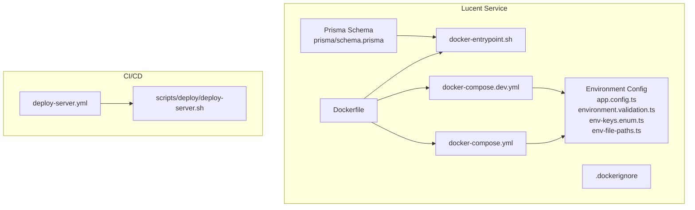
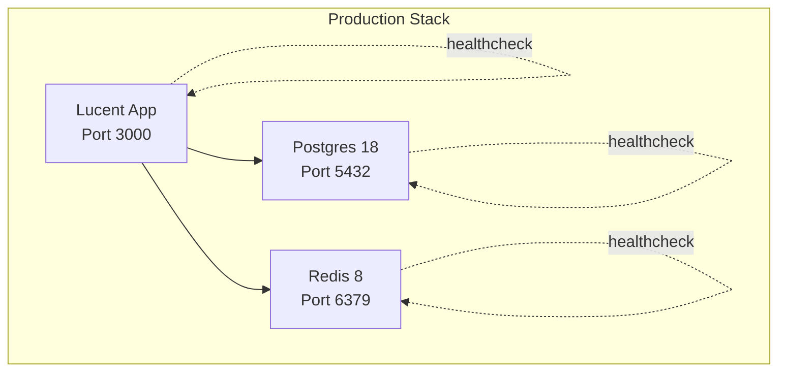
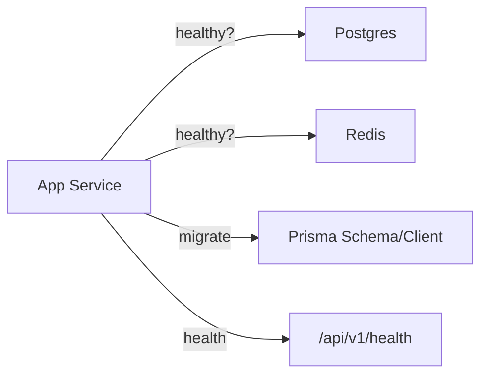

# Infrastructure Setup

<cite>
**Referenced Files in This Document**
- [Dockerfile](file://Lucent/Dockerfile)
- [docker-compose.yml](file://Lucent/docker-compose.yml)
- [docker-compose.dev.yml](file://Lucent/docker-compose.dev.yml)
- [.dockerignore](file://Lucent/.dockerignore)
- [docker-entrypoint.sh](file://Lucent/docker-entrypoint.sh)
- [deploy-server.yml](file://Lucent/.github/workflows/deploy-server.yml)
- [deploy-server.sh](file://Lucent/scripts/deploy/deploy-server.sh)
- [environment.validation.ts](file://Lucent/src/config/environment.validation.ts)
- [env-keys.enum.ts](file://Lucent/src/config/env-keys.enum.ts)
- [env-file-paths.ts](file://Lucent/src/config/env-file-paths.ts)
- [app.config.ts](file://Lucent/src/config/app.config.ts)
- [prisma.schema](file://Lucent/prisma/schema.prisma)
- [migrate-local-databases.ps1](file://Lucent/scripts/dev/migrate-local-databases.ps1)
- [up-local-stack.ps1](file://Lucent/scripts/dev/up-local-stack.ps1)
- [down-local-stack.ps1](file://Lucent/scripts/dev/down-local-stack.ps1)
</cite>

## Table of Contents
1. [Introduction](#introduction)
2. [Project Structure](#project-structure)
3. [Core Components](#core-components)
4. [Architecture Overview](#architecture-overview)
5. [Detailed Component Analysis](#detailed-component-analysis)
6. [Dependency Analysis](#dependency-analysis)
7. [Performance Considerations](#performance-considerations)
8. [Troubleshooting Guide](#troubleshooting-guide)
9. [Conclusion](#conclusion)
10. [Appendices](#appendices)

## Introduction
This document provides comprehensive infrastructure setup guidance for the Lumos platform with a focus on the backend service (Lucent). It covers containerization strategy, Docker Compose configuration for local and production environments, networking and volumes, inter-service communication, environment and secrets management, health checks, resource considerations, registry and deployment automation, and troubleshooting.

## Project Structure
The containerized backend is implemented in the Lucent directory with the following key files:
- Multi-stage Dockerfile for building and running the NestJS application
- Docker Compose configurations for development and production
- Entrypoint script for database migrations and startup
- GitHub Actions workflow for CI/CD and image publishing
- Scripts for local development stack management
- Environment configuration and validation modules

**Diagram sources**
- [Dockerfile:1-50](file://Lucent/Dockerfile#L1-L50)
- [docker-compose.yml:1-67](file://Lucent/docker-compose.yml#L1-L67)
- [docker-compose.dev.yml:1-59](file://Lucent/docker-compose.dev.yml#L1-L59)
- [docker-entrypoint.sh:1-9](file://Lucent/docker-entrypoint.sh#L1-L9)
- [deploy-server.yml:1-222](file://Lucent/.github/workflows/deploy-server.yml#L1-L222)
- [deploy-server.sh](file://Lucent/scripts/deploy/deploy-server.sh)

**Section sources**
- [Dockerfile:1-50](file://Lucent/Dockerfile#L1-L50)
- [docker-compose.yml:1-67](file://Lucent/docker-compose.yml#L1-L67)
- [docker-compose.dev.yml:1-59](file://Lucent/docker-compose.dev.yml#L1-L59)
- [.dockerignore:1-12](file://Lucent/.dockerignore#L1-L12)
- [docker-entrypoint.sh:1-9](file://Lucent/docker-entrypoint.sh#L1-L9)

## Core Components
- Container image: Multi-stage build using Node.js 22 Alpine, PNPM, and Prisma CLI embedded for production runtime.
- Runtime entrypoint: Applies Prisma migrations via migrate deploy and starts the compiled NestJS application.
- Orchestration: Docker Compose defines Postgres, Redis, and the application service with health checks and dependencies.
- CI/CD: GitHub Actions builds images, pushes to a registry, and orchestrates remote deployment via SSH.

Key implementation references:
- Multi-stage build and runtime copy of artifacts and Prisma client
- Production health check and port exposure
- Entrypoint migration and startup sequence
- Compose service dependencies and health checks
- Workflow image metadata, registry credentials, and deployment steps

**Section sources**
- [Dockerfile:1-50](file://Lucent/Dockerfile#L1-L50)
- [docker-entrypoint.sh:1-9](file://Lucent/docker-entrypoint.sh#L1-L9)
- [docker-compose.yml:34-62](file://Lucent/docker-compose.yml#L34-L62)
- [deploy-server.yml:93-222](file://Lucent/.github/workflows/deploy-server.yml#L93-L222)

## Architecture Overview
The system consists of three primary containers orchestrated together:
- Application service (Lucent): Runs the NestJS backend, connects to Postgres and Redis, exposes health endpoints, and applies database migrations at startup.
- Postgres: Persistent relational database for application data.
- Redis: In-memory cache/store for session/state and caching.

**Diagram sources**
- [docker-compose.yml:1-67](file://Lucent/docker-compose.yml#L1-L67)
- [docker-entrypoint.sh:1-9](file://Lucent/docker-entrypoint.sh#L1-L9)

## Detailed Component Analysis

### Dockerfile: Multi-Stage Build and Image Optimization
The Dockerfile implements a two-stage build:
- Builder stage: Installs dependencies with PNPM, generates Prisma client, compiles TypeScript, and produces the dist artifact.
- Production stage: Copies built artifacts, Prisma client, Prisma schema, and entrypoint script; installs runtime dependencies including Prisma CLI; exposes port 3000; sets entrypoint.

Optimization techniques visible in the build:
- Alpine base reduces image size.
- PNPM with frozen lockfile ensures reproducible installs and avoids unnecessary lifecycle hooks during build.
- Separate stages minimize final image size by excluding build tools and sources.
- Prisma client and schema are copied from the builder to avoid runtime generation.

Security considerations:
- Non-root-friendly setup is implied by the base image choice; consider adding a dedicated non-root user and read-only filesystem mounts in production deployments.

**Section sources**
- [Dockerfile:1-50](file://Lucent/Dockerfile#L1-L50)

### docker-compose.yml: Production Orchestration
Production Compose defines:
- Postgres service with persistent volume, health check using pg_isready, and exposed port mapping.
- Redis service with persistent volume, health check using redis-cli ping.
- Application service with:
  - Image reference from environment variable LUCENT_IMAGE (required).
  - Environment file loading (.env.production) and explicit environment variables for DATABASE_URL, REDIS_URL, NODE_ENV, HOST, and PORT.
  - Port mapping 3000:3000.
  - Depends on Postgres and Redis with health conditions.
  - Health check against internal /api/v1/health endpoint.
  - Named volumes for persistence (pgdata, redisdata).

Networking:
- Services communicate via Docker bridge network using service names as hostnames (e.g., postgres, redis).

Volumes:
- Named volumes persist Postgres and Redis data across container recreation.

Inter-service communication:
- DATABASE_URL and REDIS_URL use service names and ports.
- Health checks rely on internal loopback for the app.

**Section sources**
- [docker-compose.yml:1-67](file://Lucent/docker-compose.yml#L1-L67)

### docker-compose.dev.yml: Local Development and Testing Environments
Development Compose defines:
- postgres-dev: Dedicated Postgres instance for development with mapped host port 15432:5432.
- postgres-test: Separate Postgres instance for test/e2e with mapped host port 5432:5432.
- redis: Shared Redis instance for development.

Volumes:
- Separate named volumes for dev/test Postgres data isolation.

Health checks:
- Uses pg_isready and redis-cli ping commands similar to production.

Networking:
- Services communicate internally via service names.

**Section sources**
- [docker-compose.dev.yml:1-59](file://Lucent/docker-compose.dev.yml#L1-L59)

### docker-entrypoint.sh: Migration and Startup Sequence
The entrypoint performs:
- Applies Prisma migrations using migrate deploy with the schema path.
- Starts the application using node dist/main.js.

Operational implications:
- Ensures database schema is up-to-date before accepting traffic.
- The script is executable and resides in the image for production runtime.

**Section sources**
- [docker-entrypoint.sh:1-9](file://Lucent/docker-entrypoint.sh#L1-L9)

### Environment Management and Secrets Handling
Environment configuration and validation:
- Environment keys are defined in an enumeration module.
- Validation logic ensures required variables are present and properly formatted.
- Environment file paths define locations for environment files used by the app.
- Application configuration aggregates validated environment variables for use across the app.

Secrets handling:
- The production Compose file loads environment variables from .env.production.
- CI/CD workflow injects secrets via GitHub Actions secrets and passes registry credentials to the build/push steps.
- For production servers, the deployment script reads environment variables and registry credentials securely via SSH.

Best practices observed:
- Environment variables are loaded from files in production.
- CI/CD uses registry credentials from secrets.
- Deployment script avoids echoing sensitive values.

**Section sources**
- [environment.validation.ts](file://Lucent/src/config/environment.validation.ts)
- [env-keys.enum.ts](file://Lucent/src/config/env-keys.enum.ts)
- [env-file-paths.ts](file://Lucent/src/config/env-file-paths.ts)
- [app.config.ts](file://Lucent/src/config/app.config.ts)
- [docker-compose.yml:38-39](file://Lucent/docker-compose.yml#L38-L39)
- [deploy-server.yml:140-146](file://Lucent/.github/workflows/deploy-server.yml#L140-L146)

### CI/CD Pipeline and Deployment Automation
GitHub Actions workflow:
- CI job:
  - Sets up Node.js 22 and PNPM.
  - Installs dependencies, generates Prisma client, applies test migrations, runs lint/build/tests.
  - Spins up Postgres and Redis service containers with health checks.
- Docker job:
  - Resolves image metadata (registry host, namespace, image name) and outputs image references.
  - Logs into the registry using secrets.
  - Builds and pushes the application image.
  - Also resolves Postgres and Redis image references for the registry.
- Deploy job:
  - Configures SSH keys and known hosts.
  - Syncs docker-compose.yml and deployment script to the remote server.
  - Executes the deployment script remotely with environment variables and decoded registry password.

Deployment script:
- Performs secure deployment steps on the target server using the synced files and environment variables.

**Section sources**
- [deploy-server.yml:1-222](file://Lucent/.github/workflows/deploy-server.yml#L1-L222)
- [deploy-server.sh](file://Lucent/scripts/deploy/deploy-server.sh)

### Local Development Scripts
PowerShell scripts support local development:
- up-local-stack.ps1: Starts the local development stack using docker-compose.dev.yml.
- down-local-stack.ps1: Stops and removes local containers.
- migrate-local-databases.ps1: Applies database migrations locally.

These scripts streamline local iteration and testing.

**Section sources**
- [up-local-stack.ps1](file://Lucent/scripts/dev/up-local-stack.ps1)
- [down-local-stack.ps1](file://Lucent/scripts/dev/down-local-stack.ps1)
- [migrate-local-databases.ps1](file://Lucent/scripts/dev/migrate-local-databases.ps1)

## Dependency Analysis
Container dependencies and relationships:
- Application depends on Postgres and Redis being healthy before starting.
- Application health check validates internal API health endpoint.
- Entrypoint depends on Prisma schema and client availability.

**Diagram sources**
- [docker-compose.yml:48-62](file://Lucent/docker-compose.yml#L48-L62)
- [docker-entrypoint.sh:4-5](file://Lucent/docker-entrypoint.sh#L4-L5)

**Section sources**
- [docker-compose.yml:48-62](file://Lucent/docker-compose.yml#L48-L62)
- [docker-entrypoint.sh:4-5](file://Lucent/docker-entrypoint.sh#L4-L5)

## Performance Considerations
Observed characteristics:
- Alpine-based images reduce footprint and improve cold-start times.
- PNPM with frozen lockfiles accelerates installs and ensures deterministic builds.
- Multi-stage build excludes build-time dependencies from the final image.
- Health checks with intervals and retries help detect and recover from transient failures.

Recommendations (general guidance):
- Add resource limits (CPU/memory) and restart policies in production Compose.
- Enable Prisma connection pooling and configure Redis eviction policies.
- Use read replicas for Postgres if scaling read workloads.
- Monitor application metrics and container resource utilization.

[No sources needed since this section provides general guidance]

## Troubleshooting Guide
Common containerization issues and resolutions:
- Application fails to start due to unapplied migrations:
  - Verify Prisma schema presence and entrypoint execution.
  - Check migration command output and database connectivity.
  - Reference: [docker-entrypoint.sh:4-5](file://Lucent/docker-entrypoint.sh#L4-L5)
- Database connectivity errors:
  - Confirm DATABASE_URL format and service name resolution.
  - Validate Postgres health and credentials.
  - Reference: [docker-compose.yml:41-42](file://Lucent/docker-compose.yml#L41-L42)
- Redis connectivity errors:
  - Confirm REDIS_URL and Redis health check.
  - Reference: [docker-compose.yml](file://Lucent/docker-compose.yml#L42)
- Health check failures:
  - Review app health endpoint and timing (start period, retries).
  - Reference: [docker-compose.yml:53-62](file://Lucent/docker-compose.yml#L53-L62)
- Environment variable issues:
  - Validate presence and correctness using environment validation logic.
  - Reference: [environment.validation.ts](file://Lucent/src/config/environment.validation.ts)
- CI/CD image build/push failures:
  - Ensure registry credentials and image metadata resolution.
  - Reference: [deploy-server.yml:113-161](file://Lucent/.github/workflows/deploy-server.yml#L113-L161)
- Local development stack not starting:
  - Use provided PowerShell scripts to bring up/down services.
  - Reference: [up-local-stack.ps1](file://Lucent/scripts/dev/up-local-stack.ps1), [down-local-stack.ps1](file://Lucent/scripts/dev/down-local-stack.ps1)

**Section sources**
- [docker-entrypoint.sh:4-5](file://Lucent/docker-entrypoint.sh#L4-L5)
- [docker-compose.yml:41-42](file://Lucent/docker-compose.yml#L41-L42)
- [docker-compose.yml:53-62](file://Lucent/docker-compose.yml#L53-L62)
- [environment.validation.ts](file://Lucent/src/config/environment.validation.ts)
- [deploy-server.yml:113-161](file://Lucent/.github/workflows/deploy-server.yml#L113-L161)
- [up-local-stack.ps1](file://Lucent/scripts/dev/up-local-stack.ps1)
- [down-local-stack.ps1](file://Lucent/scripts/dev/down-local-stack.ps1)

## Conclusion
The Lumos backend leverages a clean multi-stage Docker build, robust Docker Compose orchestration, and a CI/CD pipeline that builds and deploys containerized artifacts. The setup includes health checks, environment-driven configuration, and practical local development scripts. Applying the recommendations herein will further harden security, observability, and operational reliability.

[No sources needed since this section summarizes without analyzing specific files]

## Appendices

### Appendix A: Container Networking and Volume Mounting
- Networking:
  - Services communicate over Docker’s default bridge network using service names as hostnames.
- Volumes:
  - Named volumes persist Postgres and Redis data across container lifecycles.
- References:
  - [docker-compose.yml:12-13](file://Lucent/docker-compose.yml#L12-L13)
  - [docker-compose.yml:26-27](file://Lucent/docker-compose.yml#L26-L27)
  - [docker-compose.dev.yml:13-14](file://Lucent/docker-compose.dev.yml#L13-L14)
  - [docker-compose.dev.yml:32-33](file://Lucent/docker-compose.dev.yml#L32-L33)
  - [docker-compose.dev.yml:47-48](file://Lucent/docker-compose.dev.yml#L47-L48)

**Section sources**
- [docker-compose.yml:12-13](file://Lucent/docker-compose.yml#L12-L13)
- [docker-compose.yml:26-27](file://Lucent/docker-compose.yml#L26-L27)
- [docker-compose.dev.yml:13-14](file://Lucent/docker-compose.dev.yml#L13-L14)
- [docker-compose.dev.yml:32-33](file://Lucent/docker-compose.dev.yml#L32-L33)
- [docker-compose.dev.yml:47-48](file://Lucent/docker-compose.dev.yml#L47-L48)

### Appendix B: Container Security Best Practices
- Use non-root users and minimal privileges in production.
- Scan images regularly and pin base image digests.
- Restrict container capabilities and mount filesystems as read-only where possible.
- Store secrets in a secret manager and pass via environment variables or mounted files.
- Limit exposed ports and use internal networks only.

[No sources needed since this section provides general guidance]

### Appendix C: Image Registry and Tagging Strategy
- Registry host and namespace are configurable via workflow variables.
- Images are tagged with latest for the main branch.
- Separate images are resolved for Postgres and Redis.
- References:
  - [deploy-server.yml:113-138](file://Lucent/.github/workflows/deploy-server.yml#L113-L138)
  - [deploy-server.yml:147-161](file://Lucent/.github/workflows/deploy-server.yml#L147-L161)

**Section sources**
- [deploy-server.yml:113-138](file://Lucent/.github/workflows/deploy-server.yml#L113-L138)
- [deploy-server.yml:147-161](file://Lucent/.github/workflows/deploy-server.yml#L147-L161)