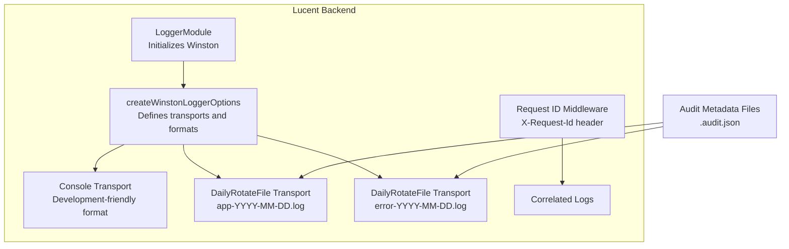
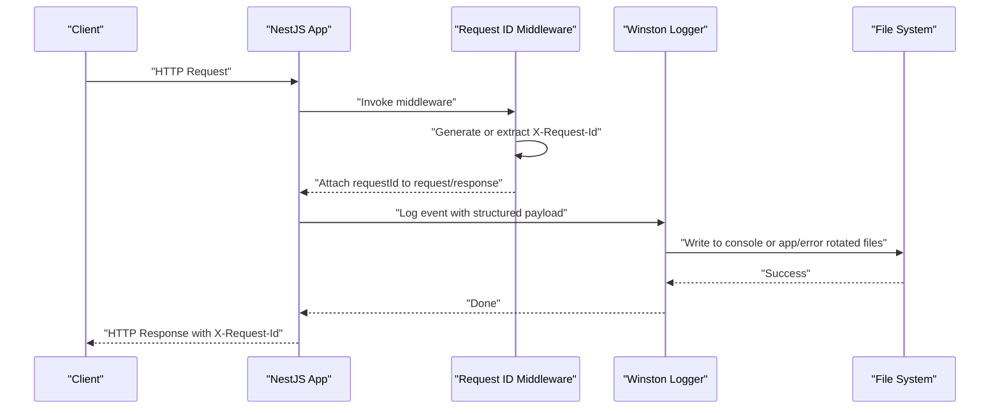
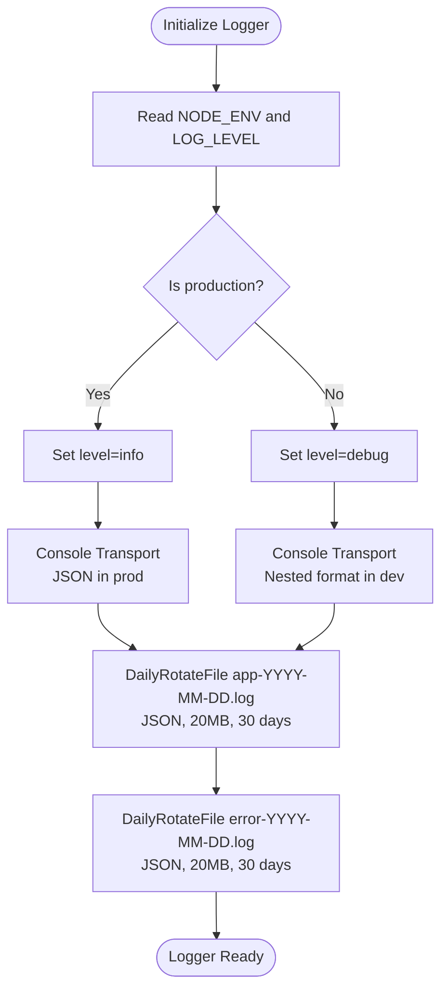
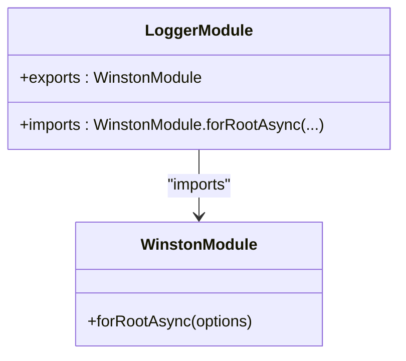
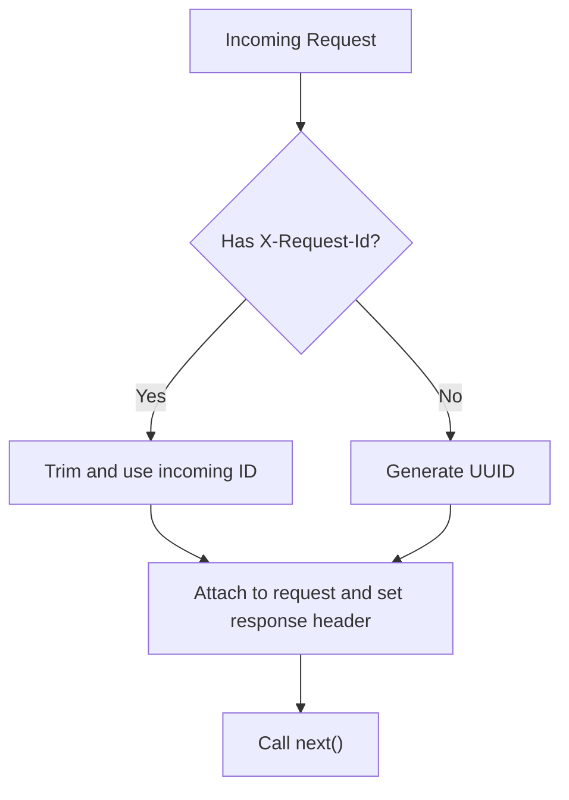
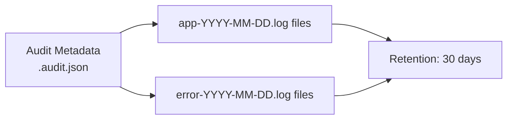
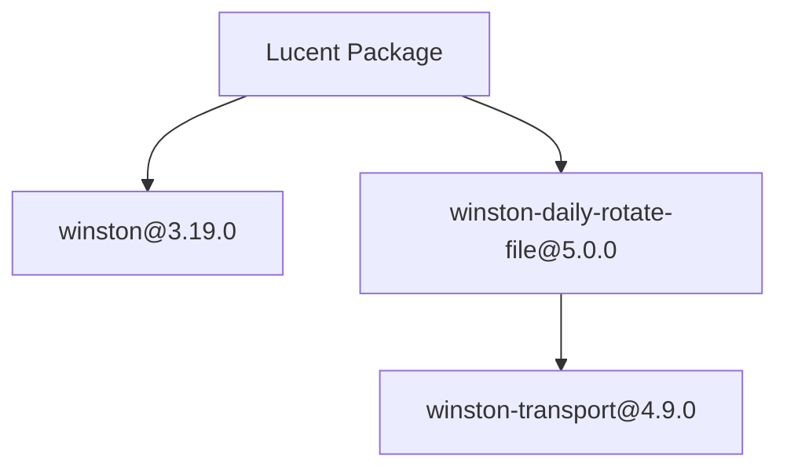

# Monitoring & Logging

<cite>
**Referenced Files in This Document**
- [logger.config.ts](file://Lucent/src/common/logger/logger.config.ts)
- [logger.module.ts](file://Lucent/src/common/logger/logger.module.ts)
- [request-id.middleware.ts](file://Lucent/src/common/middleware/request-id.middleware.ts)
- [request-id.middleware.spec.ts](file://Lucent/src/common/middleware/request-id.middleware.spec.ts)
- [.b8595fc7c58e3fcc8e2e28a1f0e14a8ce2706a3f-audit.json](file://Lucent/logs/.b8595fc7c58e3fcc8e2e28a1f0e14a8ce2706a3f-audit.json)
- [.e3747247bf6fbef9024a3bc93c5047da6e41f772-audit.json](file://Lucent/logs/.e3747247bf6fbef9024a3bc93c5047da6e41f772-audit.json)
- [pnpm-lock.yaml](file://Lucent/pnpm-lock.yaml)
</cite>

## Table of Contents
1. [Introduction](#introduction)
2. [Project Structure](#project-structure)
3. [Core Components](#core-components)
4. [Architecture Overview](#architecture-overview)
5. [Detailed Component Analysis](#detailed-component-analysis)
6. [Dependency Analysis](#dependency-analysis)
7. [Performance Considerations](#performance-considerations)
8. [Troubleshooting Guide](#troubleshooting-guide)
9. [Conclusion](#conclusion)
10. [Appendices](#appendices)

## Introduction
This document describes the Lumos platform’s monitoring and logging architecture with a focus on the backend service (Lucent). It covers centralized logging, log aggregation strategies, structured logging, Winston logger configuration, log levels, custom formatting, audit logging for compliance, user activity tracking, security monitoring, performance monitoring setup, metrics collection, alerting configuration, log analysis tools, search capabilities, log retention policies, distributed tracing via request correlation, observability patterns, dashboard setup, custom metrics, anomaly detection, and troubleshooting guidance.

## Project Structure
The logging subsystem is implemented in the Lucent backend and consists of:
- A Winston-based logger configured via a dedicated module and factory.
- A request ID middleware enabling request correlation across services and logs.
- Log rotation and retention managed by daily-rotate-file transport.
- Audit metadata files that track rotated log files and retention periods.

**Diagram sources**
- [logger.module.ts:1-20](file://Lucent/src/common/logger/logger.module.ts#L1-L20)
- [logger.config.ts:28-60](file://Lucent/src/common/logger/logger.config.ts#L28-L60)
- [request-id.middleware.ts:1-24](file://Lucent/src/common/middleware/request-id.middleware.ts#L1-L24)
- [.b8595fc7c58e3fcc8e2e28a1f0e14a8ce2706a3f-audit.json:1-33](file://Lucent/logs/.b8595fc7c58e3fcc8e2e28a1f0e14a8ce2706a3f-audit.json#L1-L33)
- [.e3747247bf6fbef9024a3bc93c5047da6e41f772-audit.json:1-32](file://Lucent/logs/.e3747247bf6fbef9024a3bc93c5047da6e41f772-audit.json#L1-L32)

**Section sources**
- [logger.module.ts:1-20](file://Lucent/src/common/logger/logger.module.ts#L1-L20)
- [logger.config.ts:1-60](file://Lucent/src/common/logger/logger.config.ts#L1-L60)
- [request-id.middleware.ts:1-24](file://Lucent/src/common/middleware/request-id.middleware.ts#L1-L24)
- [.b8595fc7c58e3fcc8e2e28a1f0e14a8ce2706a3f-audit.json:1-33](file://Lucent/logs/.b8595fc7c58e3fcc8e2e28a1f0e14a8ce2706a3f-audit.json#L1-L33)
- [.e3747247bf6fbef9024a3bc93c5047da6e41f772-audit.json:1-32](file://Lucent/logs/.e3747247bf6fbef9024a3bc93c5047da6e41f772-audit.json#L1-L32)

## Core Components
- Winston logger configuration and transports:
  - Console transport with development-friendly nested format and production JSON format.
  - Daily rotate transports for application logs and error-only logs with JSON formatting and retention.
- Logger module:
  - Global NestJS module that initializes Winston asynchronously using environment variables for node environment and log level.
- Request correlation:
  - Middleware generates or accepts a request ID header and attaches it to requests and responses for cross-service correlation.

**Section sources**
- [logger.config.ts:28-60](file://Lucent/src/common/logger/logger.config.ts#L28-L60)
- [logger.module.ts:6-18](file://Lucent/src/common/logger/logger.module.ts#L6-L18)
- [request-id.middleware.ts:10-24](file://Lucent/src/common/middleware/request-id.middleware.ts#L10-L24)

## Architecture Overview
The logging architecture integrates Winston transports with NestJS. Requests are correlated via a request ID header. Rotated log files are retained per the audit metadata configuration.

**Diagram sources**
- [request-id.middleware.ts:10-24](file://Lucent/src/common/middleware/request-id.middleware.ts#L10-L24)
- [logger.config.ts:35-57](file://Lucent/src/common/logger/logger.config.ts#L35-L57)
- [logger.module.ts:9-15](file://Lucent/src/common/logger/logger.module.ts#L9-L15)

## Detailed Component Analysis

### Winston Logger Configuration
- Transports:
  - Console transport: Uses a nested format in development and JSON format in production.
  - DailyRotateFile transports:
    - Application logs: full level logs rotated daily with JSON format and retention of 30 days.
    - Error logs: error-level-only logs rotated daily with JSON format and retention of 30 days.
- Log levels:
  - Determined by environment and optional explicit log level override.
  - Production defaults to info; development defaults to debug.
- Structured logging:
  - JSON format ensures machine-parseable logs suitable for log aggregation systems.

**Diagram sources**
- [logger.config.ts:28-60](file://Lucent/src/common/logger/logger.config.ts#L28-L60)

**Section sources**
- [logger.config.ts:28-60](file://Lucent/src/common/logger/logger.config.ts#L28-L60)
- [logger.module.ts:9-15](file://Lucent/src/common/logger/logger.module.ts#L9-L15)

### Logger Module Initialization
- Global module that registers Winston with NestJS.
- Asynchronously constructs logger options using environment variables.

**Diagram sources**
- [logger.module.ts:6-18](file://Lucent/src/common/logger/logger.module.ts#L6-L18)

**Section sources**
- [logger.module.ts:6-18](file://Lucent/src/common/logger/logger.module.ts#L6-L18)

### Request Correlation Middleware
- Generates a UUID if no request ID is provided.
- Accepts and normalizes an incoming request ID header.
- Sets the response header to propagate correlation ID to clients.
- Ensures next() is always called.

**Diagram sources**
- [request-id.middleware.ts:10-24](file://Lucent/src/common/middleware/request-id.middleware.ts#L10-L24)

**Section sources**
- [request-id.middleware.ts:10-24](file://Lucent/src/common/middleware/request-id.middleware.ts#L10-L24)
- [request-id.middleware.spec.ts:23-129](file://Lucent/src/common/middleware/request-id.middleware.spec.ts#L23-L129)

### Audit Logging and Retention
- Audit metadata files track rotated log files and retention policy (30 days).
- Two audit files exist: one for application logs and one for error logs.

**Diagram sources**
- [.b8595fc7c58e3fcc8e2e28a1f0e14a8ce2706a3f-audit.json:1-33](file://Lucent/logs/.b8595fc7c58e3fcc8e2e28a1f0e14a8ce2706a3f-audit.json#L1-L33)
- [.e3747247bf6fbef9024a3bc93c5047da6e41f772-audit.json:1-32](file://Lucent/logs/.e3747247bf6fbef9024a3bc93c5047da6e41f772-audit.json#L1-L32)

**Section sources**
- [.b8595fc7c58e3fcc8e2e28a1f0e14a8ce2706a3f-audit.json:1-33](file://Lucent/logs/.b8595fc7c58e3fcc8e2e28a1f0e14a8ce2706a3f-audit.json#L1-L33)
- [.e3747247bf6fbef9024a3bc93c5047da6e41f772-audit.json:1-32](file://Lucent/logs/.e3747247bf6fbef9024a3bc93c5047da6e41f772-audit.json#L1-L32)

## Dependency Analysis
- Winston and Winston transports are declared as dependencies.
- The project uses winston-daily-rotate-file for rotating logs.

**Diagram sources**
- [pnpm-lock.yaml:11680-11688](file://Lucent/pnpm-lock.yaml#L11680-L11688)
- [pnpm-lock.yaml:19446-19452](file://Lucent/pnpm-lock.yaml#L19446-L19452)

**Section sources**
- [pnpm-lock.yaml:11680-11688](file://Lucent/pnpm-lock.yaml#L11680-L11688)
- [pnpm-lock.yaml:19446-19452](file://Lucent/pnpm-lock.yaml#L19446-L19452)

## Performance Considerations
- Log volume and disk usage:
  - Daily rotation with JSON format and a 20MB size cap reduce per-file growth.
  - Retention of 30 days balances historical analysis with storage costs.
- Log level tuning:
  - Prefer info in production to minimize overhead while retaining actionable events.
- Transport selection:
  - Console transport is lightweight; file transports add I/O overhead—monitor disk throughput and rotation frequency.

[No sources needed since this section provides general guidance]

## Troubleshooting Guide
- No logs appear in console:
  - Verify NODE_ENV and LOG_LEVEL environment variables and ensure the logger module is imported in the app bootstrap.
- Excessive disk usage:
  - Confirm rotation settings and retention policy; adjust maxFiles or maxSize if necessary.
- Missing correlation IDs:
  - Ensure the request ID middleware is registered early in the NestJS pipeline and that clients propagate X-Request-Id headers.
- Audit file discrepancies:
  - Check the audit metadata files for expected rotated filenames and retention dates.

**Section sources**
- [logger.module.ts:9-15](file://Lucent/src/common/logger/logger.module.ts#L9-L15)
- [request-id.middleware.ts:10-24](file://Lucent/src/common/middleware/request-id.middleware.ts#L10-L24)
- [.b8595fc7c58e3fcc8e2e28a1f0e14a8ce2706a3f-audit.json:1-33](file://Lucent/logs/.b8595fc7c58e3fcc8e2e28a1f0e14a8ce2706a3f-audit.json#L1-L33)
- [.e3747247bf6fbef9024a3bc93c5047da6e41f772-audit.json:1-32](file://Lucent/logs/.e3747247bf6fbef9024a3bc93c5047da6e41f772-audit.json#L1-L32)

## Conclusion
The Lumos backend employs a robust, production-ready logging setup centered on Winston with daily rotation and JSON formatting. Request correlation via X-Request-Id enables distributed tracing across services. Audit metadata files define retention policies. While the current implementation focuses on structured logs and correlation, extending it with metrics, dashboards, and alerting would complete the observability picture.

[No sources needed since this section summarizes without analyzing specific files]

## Appendices

### Centralized Logging and Aggregation Strategies
- Ship logs to a centralized collector (e.g., Fluent Bit, Logstash, Vector) and ingest into a log aggregation platform (e.g., Elasticsearch/OpenSearch, Loki).
- Use JSON parsing to extract fields such as timestamp, level, service, and request ID for filtering and correlation.

[No sources needed since this section provides general guidance]

### Structured Logging Implementation Notes
- Winston JSON format ensures consistent field extraction.
- Include standardized fields like service, version, region, and request_id for cross-service queries.

[No sources needed since this section provides general guidance]

### Log Levels and Custom Formatting
- Use info for operational events, warn for recoverable issues, error for failures.
- In development, leverage NestJS nested format for readability; in production, rely on JSON.

[No sources needed since this section provides general guidance]

### Audit Logging for Compliance
- Maintain immutable records of rotated log files and retention periods using the existing audit metadata files.
- Periodically review and export audit trails for compliance audits.

**Section sources**
- [.b8595fc7c58e3fcc8e2e28a1f0e14a8ce2706a3f-audit.json:1-33](file://Lucent/logs/.b8595fc7c58e3fcc8e2e28a1f0e14a8ce2706a3f-audit.json#L1-L33)
- [.e3747247bf6fbef9024a3bc93c5047da6e41f772-audit.json:1-32](file://Lucent/logs/.e3747247bf6fbef9024a3bc93c5047da6e41f772-audit.json#L1-L32)

### Security Monitoring
- Monitor error logs for patterns indicating failed authentication attempts, authorization failures, and unexpected exceptions.
- Correlate suspicious IP addresses with request IDs to investigate incidents.

[No sources needed since this section provides general guidance]

### Metrics Collection and Alerting
- Integrate metrics libraries (e.g., Prometheus client) to expose counters and histograms alongside logs.
- Configure alerts for elevated error rates, latency spikes, and saturation thresholds.

[No sources needed since this section provides general guidance]

### Log Analysis Tools and Search Capabilities
- Use Kibana, Grafana Explore, or Loki’s PromQL to search and visualize logs.
- Filter by request_id to trace end-to-end flows across services.

[No sources needed since this section provides general guidance]

### Distributed Tracing and Observability Patterns
- Propagate X-Request-Id as a trace identifier across microservices.
- Combine logs, traces, and metrics in a unified observability platform.

[No sources needed since this section provides general guidance]

### Monitoring Dashboard Setup and Custom Metrics
- Build dashboards to track error rates, latency distributions, and throughput.
- Add anomaly detection rules to detect unusual patterns automatically.

[No sources needed since this section provides general guidance]