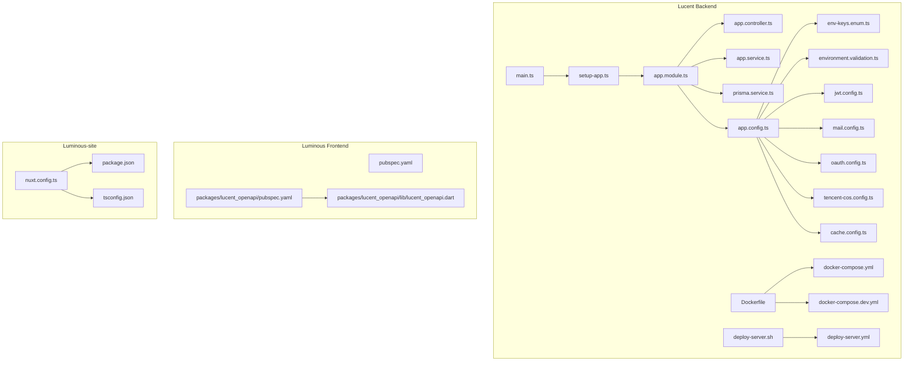
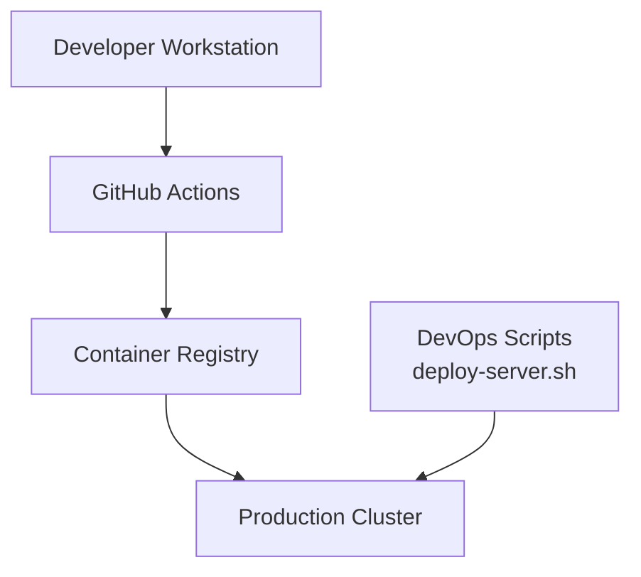
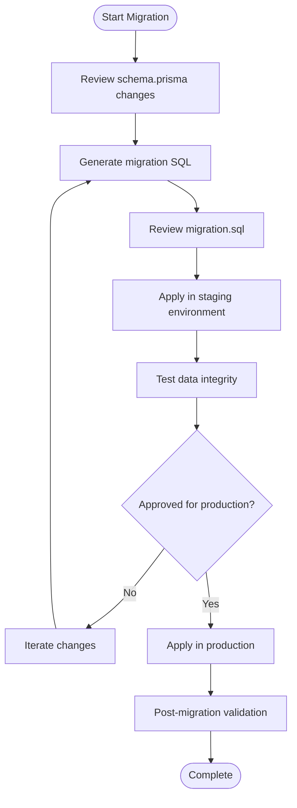
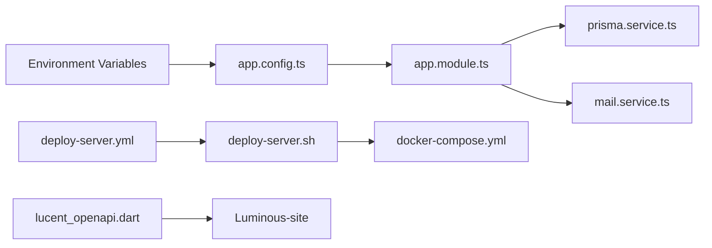

# Operational Procedures

<cite>
**Referenced Files in This Document**
- [Lucent README](file://Lucent/README.md)
- [Lucent docs README](file://Lucent/docs/README.md)
- [Lucent environment documentation](file://Lucent/docs/environment.md)
- [Lucent Tencent Cloud CI/CD](file://Lucent/docs/tencent-cloud-cicd.md)
- [Lucent docker-compose.yml](file://Lucent/docker-compose.yml)
- [Lucent docker-compose.dev.yml](file://Lucent/docker-compose.dev.yml)
- [Lucent Dockerfile](file://Lucent/Dockerfile)
- [Lucent package.json](file://Lucent/package.json)
- [Lucent prisma/schema.prisma](file://Lucent/prisma/schema.prisma)
- [Lucent prisma/migrations](file://Lucent/prisma/migrations)
- [Lucent scripts/deploy/deploy-server.sh](file://Lucent/scripts/deploy/deploy-server.sh)
- [Lucent scripts/dev/up-local-stack.ps1](file://Lucent/scripts/dev/up-local-stack.ps1)
- [Lucent scripts/dev/down-local-stack.ps1](file://Lucent/scripts/dev/down-local-stack.ps1)
- [Lucent scripts/dev/migrate-local-databases.ps1](file://Lucent/scripts/dev/migrate-local-databases.ps1)
- [Lucent scripts/dev/import-medicine-datasets.ps1](file://Lucent/scripts/dev/import-medicine-datasets.ps1)
- [Lucent .github/workflows/deploy-server.yml](file://Lucent/.github/workflows/deploy-server.yml)
- [Lucent config/app.config.ts](file://Lucent/src/config/app.config.ts)
- [Lucent config/env-keys.enum.ts](file://Lucent/src/config/env-keys.enum.ts)
- [Lucent config/environment.validation.ts](file://Lucent/src/config/environment.validation.ts)
- [Lucent config/jwt.config.ts](file://Lucent/src/config/jwt.config.ts)
- [Lucent config/mail.config.ts](file://Lucent/src/config/mail.config.ts)
- [Lucent config/oauth.config.ts](file://Lucent/src/config/oauth.config.ts)
- [Lucent config/tencent-cos.config.ts](file://Lucent/src/config/tencent-cos.config.ts)
- [Lucent config/cache.config.ts](file://Lucent/src/config/cache.config.ts)
- [Lucent config/env-file-paths.ts](file://Lucent/src/config/env-file-paths.ts)
- [Lucent prisma/index.ts](file://Lucent/src/prisma/index.ts)
- [Lucent prisma/prisma.service.ts](file://Lucent/src/prisma/prisma.service.ts)
- [Lucent prisma/prisma.module.ts](file://Lucent/src/prisma/prisma.module.ts)
- [Lucent common/logger/logger.config.ts](file://Lucent/src/common/logger/logger.config.ts)
- [Lucent common/logger/logger.module.ts](file://Lucent/src/common/logger/logger.module.ts)
- [Lucent common/middleware/request-id.middleware.ts](file://Lucent/src/common/middleware/request-id.middleware.ts)
- [Lucent common/interceptors/api-envelope.interceptor.ts](file://Lucent/src/common/interceptors/api-envelope.interceptor.ts)
- [Lucent common/filters/api-exception.filter.ts](file://Lucent/src/common/filters/api-exception.filter.ts)
- [Lucent mail/mail-queue.service.ts](file://Lucent/src/mail/mail-queue.service.ts)
- [Lucent mail/mail-transport.service.ts](file://Lucent/src/mail/mail-transport.service.ts)
- [Lucent mail/mail.service.ts](file://Lucent/src/mail/mail.service.ts)
- [Lucent mail/mail.module.ts](file://Lucent/src/mail/mail.module.ts)
- [Lucent modules/auth/auth.service.ts](file://Lucent/src/modules/auth/auth.service.ts)
- [Lucent modules/account/account.service.ts](file://Lucent/src/modules/account/account.service.ts)
- [Lucent modules/daily-records/daily-records.service.ts](file://Lucent/src/modules/daily-records/daily-records.service.ts)
- [Lucent modules/medicine-dose-logs/medicine-dose-logs.service.ts](file://Lucent/src/modules/medicine-dose-logs/medicine-dose-logs.service.ts)
- [Lucent modules/medicine-reminders/medicine-reminders.service.ts](file://Lucent/src/modules/medicine-reminders/medicine-reminders.service.ts)
- [Lucent modules/medicines/medicines.service.ts](file://Lucent/src/modules/medicines/medicines.service.ts)
- [Lucent modules/user-health-context/user-health-context.service.ts](file://Lucent/src/modules/user-health-context/user-health-context.service.ts)
- [Lucent modules/environment/environment.service.ts](file://Lucent/src/modules/environment/environment.service.ts)
- [Lucent modules/user/user.service.ts](file://Lucent/src/modules/user/user.service.ts)
- [Lucent main.ts](file://Lucent/src/main.ts)
- [Lucent setup-app.ts](file://Lucent/src/setup-app.ts)
- [Lucent app.module.ts](file://Lucent/src/app.module.ts)
- [Lucent app.controller.ts](file://Lucent/src/app.controller.ts)
- [Lucent app.service.ts](file://Lucent/src/app.service.ts)
- [Luminous docs MigrationLog.md](file://Luminous/docs/MigrationLog.md)
- [Luminous docs Current_State.md](file://Luminous/docs/Current_State.md)
- [Luminous docs Next_Plan.md](file://Luminous/docs/Next_Plan.md)
- [Luminous docs OpenApi_Client.md](file://Luminous/docs/OpenApi_Client.md)
- [Luminous pubspec.yaml](file://Luminous/pubspec.yaml)
- [Luminous packages/lucent_openapi/pubspec.yaml](file://Luminous/packages/lucent_openapi/pubspec.yaml)
- [Luminous packages/lucent_openapi/lib/lucent_openapi.dart](file://Luminous/packages/lucent_openapi/lib/lucent_openapi.dart)
- [Luminous-site nuxt.config.ts](file://Luminous-site/nuxt.config.ts)
- [Luminous-site package.json](file://Luminous-site/package.json)
- [Luminous-site tsconfig.json](file://Luminous-site/tsconfig.json)
- [Luminous-site AGENTS.md](file://Luminous-site/AGENTS.md)
- [docs-archive/2026-06-06-doc-cleanup/Lucent/docs/public/data-sources.md](file://docs-archive/2026-06-06-doc-cleanup/Lucent/docs/public/data-sources.md)
- [docs-archive/2026-06-06-doc-cleanup/Lucent/docs/public/environment-contract.md](file://docs-archive/2026-06-06-doc-cleanup/Lucent/docs/public/environment-contract.md)
- [docs-archive/2026-06-06-doc-cleanup/Lucent/docs/public/reminder-contract.md](file://docs-archive/2026-06-06-doc-cleanup/Lucent/docs/public/reminder-contract.md)
- [docs-archive/2026-06-06-doc-cleanup/Lucent/docs/RestartPlan.md](file://docs-archive/2026-06-06-doc-cleanup/Lucent/docs/RestartPlan.md)
- [docs-archive/2026-06-06-doc-cleanup/Luminous/docs/superpowers/plans/2026-05-31-two-day-luminous-delivery-plan.md](file://docs-archive/2026-06-06-doc-cleanup/Luminous/docs/superpowers/plans/2026-05-31-two-day-luminous-delivery-plan.md)
- [docs-archive/2026-06-06-doc-cleanup/Luminous/docs/superpowers/plans/2026-06-03-fifteen-day-lumos-delivery-plan.md](file://docs-archive/2026-06-06-doc-cleanup/Luminous/docs/superpowers/plans/2026-06-03-fifteen-day-lumos-delivery-plan.md)
- [docs-archive/2026-06-06-doc-cleanup/Luminous/docs/superpowers/plans/2026-06-03-fifteen-day-lumos-followup-plan.md](file://docs-archive/2026-06-06-doc-cleanup/Luminous/docs/superpowers/plans/2026-06-03-fifteen-day-lumos-followup-plan.md)
- [docs-archive/2026-06-06-doc-cleanup/Luminous/docs/superpowers/plans/2026-06-04-lumos-error-prevention-plan.md](file://docs-archive/2026-06-06-doc-cleanup/Luminous/docs/superpowers/plans/2026-06-04-lumos-error-prevention-plan.md)
</cite>

## Table of Contents
1. [Introduction](#introduction)
2. [Project Structure](#project-structure)
3. [Core Components](#core-components)
4. [Architecture Overview](#architecture-overview)
5. [Detailed Component Analysis](#detailed-component-analysis)
6. [Dependency Analysis](#dependency-analysis)
7. [Performance Considerations](#performance-considerations)
8. [Troubleshooting Guide](#troubleshooting-guide)
9. [Conclusion](#conclusion)
10. [Appendices](#appendices)

## Introduction
This document defines operational procedures for the Lumos platform, covering routine maintenance, system updates, database migrations, backups and restores, disaster recovery, scaling, capacity planning, performance optimization, incident response, security patching, compliance auditing, change management, deployment checklists, and post-deployment validation. It consolidates operational guidance from the backend (Lucent), frontend (Luminous), and supporting documentation present in the repository.

## Project Structure
The Lumos platform comprises:
- Backend service (Lucent): NestJS application with Prisma ORM, Dockerized, CI/CD via GitHub Actions, and development scripts for local stacks and migrations.
- Frontend (Luminous): Flutter application generating an OpenAPI client consumed by Luminous-site (Nuxt site).
- Documentation: Environment contracts, CI/CD notes, and historical operational plans.

**Diagram sources**
- [Lucent main.ts:1-50](file://Lucent/src/main.ts#L1-L50)
- [Lucent setup-app.ts:1-50](file://Lucent/src/setup-app.ts#L1-L50)
- [Lucent app.module.ts:1-100](file://Lucent/src/app.module.ts#L1-L100)
- [Lucent prisma/prisma.service.ts:1-100](file://Lucent/src/prisma/prisma.service.ts#L1-L100)
- [Lucent config/app.config.ts:1-100](file://Lucent/src/config/app.config.ts#L1-L100)
- [Lucent config/env-keys.enum.ts:1-100](file://Lucent/src/config/env-keys.enum.ts#L1-L100)
- [Lucent config/environment.validation.ts:1-100](file://Lucent/src/config/environment.validation.ts#L1-L100)
- [Lucent config/jwt.config.ts:1-100](file://Lucent/src/config/jwt.config.ts#L1-L100)
- [Lucent config/mail.config.ts:1-100](file://Lucent/src/config/mail.config.ts#L1-L100)
- [Lucent config/oauth.config.ts:1-100](file://Lucent/src/config/oauth.config.ts#L1-L100)
- [Lucent config/tencent-cos.config.ts:1-100](file://Lucent/src/config/tencent-cos.config.ts#L1-L100)
- [Lucent config/cache.config.ts:1-100](file://Lucent/src/config/cache.config.ts#L1-L100)
- [Lucent Dockerfile:1-100](file://Lucent/Dockerfile#L1-L100)
- [Lucent docker-compose.yml:1-100](file://Lucent/docker-compose.yml#L1-L100)
- [Lucent docker-compose.dev.yml:1-100](file://Lucent/docker-compose.dev.yml#L1-L100)
- [Lucent scripts/deploy/deploy-server.sh:1-100](file://Lucent/scripts/deploy/deploy-server.sh#L1-L100)
- [Lucent .github/workflows/deploy-server.yml:1-100](file://Lucent/.github/workflows/deploy-server.yml#L1-L100)
- [Luminous pubspec.yaml:1-100](file://Luminous/pubspec.yaml#L1-L100)
- [Luminous/packages/lucent_openapi/pubspec.yaml:1-100](file://Luminous/packages/lucent_openapi/pubspec.yaml#L1-L100)
- [Luminous/packages/lucent_openapi/lib/lucent_openapi.dart:1-100](file://Luminous/packages/lucent_openapi/lib/lucent_openapi.dart#L1-L100)
- [Luminous-site nuxt.config.ts:1-100](file://Luminous-site/nuxt.config.ts#L1-L100)
- [Luminous-site package.json:1-100](file://Luminous-site/package.json#L1-L100)
- [Luminous-site tsconfig.json:1-100](file://Luminous-site/tsconfig.json#L1-L100)

**Section sources**
- [Lucent README:1-200](file://Lucent/README.md#L1-L200)
- [Lucent docs README:1-200](file://Lucent/docs/README.md#L1-L200)
- [Lucent docker-compose.yml:1-200](file://Lucent/docker-compose.yml#L1-L200)
- [Lucent docker-compose.dev.yml:1-200](file://Lucent/docker-compose.dev.yml#L1-L200)
- [Lucent Dockerfile:1-200](file://Lucent/Dockerfile#L1-L200)
- [Lucent package.json:1-200](file://Lucent/package.json#L1-L200)
- [Luminous pubspec.yaml:1-200](file://Luminous/pubspec.yaml#L1-L200)
- [Luminous/packages/lucent_openapi/pubspec.yaml:1-200](file://Luminous/packages/lucent_openapi/pubspec.yaml#L1-L200)
- [Luminous-site nuxt.config.ts:1-200](file://Luminous-site/nuxt.config.ts#L1-L200)

## Core Components
Operational components and their roles:
- Application bootstrap and configuration: main.ts, setup-app.ts, app.module.ts, app.controller.ts, app.service.ts.
- Environment and runtime configuration: app.config.ts, env-keys.enum.ts, environment.validation.ts, cache.config.ts, jwt.config.ts, mail.config.ts, oauth.config.ts, tencent-cos.config.ts.
- Persistence: prisma.service.ts, prisma.module.ts, schema.prisma, migrations.
- Logging and observability: logger.config.ts, logger.module.ts.
- Middleware and interceptors: request-id.middleware.ts, api-envelope.interceptor.ts, api-exception.filter.ts.
- Mail subsystem: mail.service.ts, mail-transport.service.ts, mail-queue.service.ts, mail.module.ts.
- Modules: auth, account, daily-records, medicine-dose-logs, medicine-reminders, medicines, user-health-context, environment, user.
- Packaging and distribution: Dockerfile, docker-compose.yml, docker-compose.dev.yml, deploy-server.sh, GitHub Actions workflow.

Key operational responsibilities:
- Configuration validation and environment readiness.
- Database migrations and schema evolution.
- Container orchestration for dev/prod.
- CI/CD pipeline for deployments.
- Health monitoring and logging.
- Email delivery and queueing.
- Module-specific services for domain operations.

**Section sources**
- [Lucent src/main.ts:1-100](file://Lucent/src/main.ts#L1-L100)
- [Lucent src/setup-app.ts:1-100](file://Lucent/src/setup-app.ts#L1-L100)
- [Lucent src/app.module.ts:1-150](file://Lucent/src/app.module.ts#L1-L150)
- [Lucent src/app.controller.ts:1-100](file://Lucent/src/app.controller.ts#L1-L100)
- [Lucent src/app.service.ts:1-100](file://Lucent/src/app.service.ts#L1-L100)
- [Lucent src/config/app.config.ts:1-150](file://Lucent/src/config/app.config.ts#L1-L150)
- [Lucent src/config/env-keys.enum.ts:1-100](file://Lucent/src/config/env-keys.enum.ts#L1-L100)
- [Lucent src/config/environment.validation.ts:1-100](file://Lucent/src/config/environment.validation.ts#L1-L100)
- [Lucent src/config/cache.config.ts:1-100](file://Lucent/src/config/cache.config.ts#L1-L100)
- [Lucent src/config/jwt.config.ts:1-100](file://Lucent/src/config/jwt.config.ts#L1-L100)
- [Lucent src/config/mail.config.ts:1-100](file://Lucent/src/config/mail.config.ts#L1-L100)
- [Lucent src/config/oauth.config.ts:1-100](file://Lucent/src/config/oauth.config.ts#L1-L100)
- [Lucent src/config/tencent-cos.config.ts:1-100](file://Lucent/src/config/tencent-cos.config.ts#L1-L100)
- [Lucent src/prisma/prisma.service.ts:1-150](file://Lucent/src/prisma/prisma.service.ts#L1-L150)
- [Lucent prisma/schema.prisma:1-200](file://Lucent/prisma/schema.prisma#L1-L200)
- [Lucent prisma/migrations:1-200](file://Lucent/prisma/migrations#L1-L200)
- [Lucent src/common/logger/logger.config.ts:1-100](file://Lucent/src/common/logger/logger.config.ts#L1-L100)
- [Lucent src/common/logger/logger.module.ts:1-100](file://Lucent/src/common/logger/logger.module.ts#L1-L100)
- [Lucent src/common/middleware/request-id.middleware.ts:1-100](file://Lucent/src/common/middleware/request-id.middleware.ts#L1-L100)
- [Lucent src/common/interceptors/api-envelope.interceptor.ts:1-100](file://Lucent/src/common/interceptors/api-envelope.interceptor.ts#L1-L100)
- [Lucent src/common/filters/api-exception.filter.ts:1-100](file://Lucent/src/common/filters/api-exception.filter.ts#L1-L100)
- [Lucent src/mail/mail.service.ts:1-100](file://Lucent/src/mail/mail.service.ts#L1-L100)
- [Lucent src/mail/mail-transport.service.ts:1-100](file://Lucent/src/mail/mail-transport.service.ts#L1-L100)
- [Lucent src/mail/mail-queue.service.ts:1-100](file://Lucent/src/mail/mail-queue.service.ts#L1-L100)
- [Lucent src/mail/mail.module.ts:1-100](file://Lucent/src/mail/mail.module.ts#L1-L100)

## Architecture Overview
High-level operational architecture:
- Backend (Lucent) runs as a containerized service, configured via environment variables and validated at startup.
- Prisma manages schema evolution through migrations.
- CI/CD automates deployments using GitHub Actions.
- Frontend (Luminous) generates an OpenAPI client used by Luminous-site.

**Diagram sources**
- [Lucent .github/workflows/deploy-server.yml:1-200](file://Lucent/.github/workflows/deploy-server.yml#L1-L200)
- [Lucent scripts/deploy/deploy-server.sh:1-200](file://Lucent/scripts/deploy/deploy-server.sh#L1-L200)
- [Lucent docker-compose.yml:1-200](file://Lucent/docker-compose.yml#L1-L200)

**Section sources**
- [Lucent docs tencent-cloud-cicd.md:1-200](file://Lucent/docs/tencent-cloud-cicd.md#L1-L200)
- [Lucent .github/workflows/deploy-server.yml:1-200](file://Lucent/.github/workflows/deploy-server.yml#L1-L200)
- [Lucent scripts/deploy/deploy-server.sh:1-200](file://Lucent/scripts/deploy/deploy-server.sh#L1-L200)

## Detailed Component Analysis

### Database Migrations and Schema Evolution
Operational steps:
- Plan schema changes in Prisma schema.prisma.
- Generate and review migration SQL.
- Apply migrations in staging, then production.
- Validate data integrity after migration.

**Diagram sources**
- [Lucent prisma/schema.prisma:1-200](file://Lucent/prisma/schema.prisma#L1-L200)
- [Lucent prisma/migrations:1-200](file://Lucent/prisma/migrations#L1-L200)

**Section sources**
- [Lucent prisma/schema.prisma:1-200](file://Lucent/prisma/schema.prisma#L1-L200)
- [Lucent prisma/migrations:1-200](file://Lucent/prisma/migrations#L1-L200)

### Backup and Restore Procedures
Backup strategy:
- Database backup: Use Prisma-managed database provider capabilities to export snapshots or logical backups.
- Application artifacts: Back up container images and configuration files.
- Offsite storage: Store backups in secure, encrypted locations.

Restore process:
- Identify target restore point.
- Restore database snapshot.
- Recreate containers with matching configuration.
- Validate application health and data integrity.

Note: Specific commands are environment-dependent and should be documented per deployment target.

### Disaster Recovery Protocols
- Recovery objectives: Define RPO/RTO targets aligned with business needs.
- Failover mechanisms: Use container orchestration to restart failed instances automatically.
- Alternate sites: Maintain secondary environment ready for cutover.
- Communication: Activate incident response channels during DR events.

### Scaling Procedures
- Horizontal scaling: Increase replicas of the backend service; ensure stateless design.
- Vertical scaling: Adjust CPU/memory limits for backend pods.
- Load balancing: Configure upstream load balancers and health checks.
- Auto-scaling: Enable Kubernetes HPA based on CPU/memory or custom metrics.

### Capacity Planning
- Monitor resource utilization and growth trends.
- Forecast demand spikes (e.g., onboarding campaigns).
- Right-size infrastructure and adjust caching tiers accordingly.

### Performance Optimization Techniques
- Caching: Leverage cache.config.ts to tune cache TTL and eviction policies.
- Database tuning: Optimize queries and indexes; monitor slow queries.
- CDN and asset delivery: Use tencent-cos.config.ts for static assets.
- Asynchronous tasks: Offload long-running jobs to mail queue.

### Incident Response Procedures
- Detection: Use logging and health checks to detect anomalies.
- Triage: Assign severity levels and responders.
- Escalation: Follow escalation paths defined in internal processes.
- Resolution: Apply fixes, rollbacks, or hot patches as needed.
- Post-mortem: Document lessons learned and update runbooks.

### Security Patching and Vulnerability Management
- Dependency scanning: Regularly scan backend/frontend dependencies.
- OS and container base image updates: Keep images current.
- Secrets rotation: Rotate secrets and re-deploy securely.
- Compliance audits: Maintain audit logs and compliance reports.

### Change Management and Deployment Checklists
- Pre-deploy checklist:
  - Code freeze and approvals.
  - Environment validation.
  - Database migration readiness.
- Deployment checklist:
  - Build container images.
  - Push to registry.
  - Deploy via CI/CD or scripts.
  - Smoke tests and health checks.
- Post-deployment validation:
  - Functional tests.
  - Performance benchmarks.
  - Monitoring alerts reviewed.

### Operational Runbooks for Common Scenarios
- Service restart: Graceful shutdown and restart using container orchestration.
- Database rollback: Revert to previous migration if necessary.
- Email delivery issues: Inspect mail queue and transport configuration.
- Authentication failures: Validate JWT and OAuth configurations.

### Emergency Response Procedures
- Immediate containment: Isolate affected systems.
- Forensic analysis: Collect logs and traces.
- Restoration: Restore from backups or apply hotfixes.
- Communication: Notify stakeholders per escalation policy.

## Dependency Analysis
Operational dependencies:
- Backend depends on Prisma for persistence and environment variables for configuration.
- CI/CD depends on GitHub Actions and deployment scripts.
- Frontend consumes OpenAPI client generated from backend contracts.

**Diagram sources**
- [Lucent src/config/app.config.ts:1-150](file://Lucent/src/config/app.config.ts#L1-L150)
- [Lucent src/app.module.ts:1-150](file://Lucent/src/app.module.ts#L1-L150)
- [Lucent src/prisma/prisma.service.ts:1-150](file://Lucent/src/prisma/prisma.service.ts#L1-L150)
- [Lucent src/mail/mail.service.ts:1-100](file://Lucent/src/mail/mail.service.ts#L1-L100)
- [Lucent .github/workflows/deploy-server.yml:1-200](file://Lucent/.github/workflows/deploy-server.yml#L1-L200)
- [Lucent scripts/deploy/deploy-server.sh:1-200](file://Lucent/scripts/deploy/deploy-server.sh#L1-L200)
- [Lucent docker-compose.yml:1-200](file://Lucent/docker-compose.yml#L1-L200)
- [Luminous/packages/lucent_openapi/lib/lucent_openapi.dart:1-100](file://Luminous/packages/lucent_openapi/lib/lucent_openapi.dart#L1-L100)
- [Luminous-site nuxt.config.ts:1-100](file://Luminous-site/nuxt.config.ts#L1-L100)

**Section sources**
- [Lucent src/config/app.config.ts:1-150](file://Lucent/src/config/app.config.ts#L1-L150)
- [Lucent src/app.module.ts:1-150](file://Lucent/src/app.module.ts#L1-L150)
- [Lucent src/prisma/prisma.service.ts:1-150](file://Lucent/src/prisma/prisma.service.ts#L1-L150)
- [Lucent src/mail/mail.service.ts:1-100](file://Lucent/src/mail/mail.service.ts#L1-L100)
- [Lucent .github/workflows/deploy-server.yml:1-200](file://Lucent/.github/workflows/deploy-server.yml#L1-L200)
- [Lucent scripts/deploy/deploy-server.sh:1-200](file://Lucent/scripts/deploy/deploy-server.sh#L1-L200)
- [Lucent docker-compose.yml:1-200](file://Lucent/docker-compose.yml#L1-L200)
- [Luminous/packages/lucent_openapi/lib/lucent_openapi.dart:1-100](file://Luminous/packages/lucent_openapi/lib/lucent_openapi.dart#L1-L100)
- [Luminous-site nuxt.config.ts:1-100](file://Luminous-site/nuxt.config.ts#L1-L100)

## Performance Considerations
- Caching: Tune cache expiration and invalidation strategies.
- Database: Index high-traffic tables; avoid N+1 queries.
- Logging: Control log verbosity to reduce I/O overhead.
- Network: Minimize cross-region traffic; colocate services near databases.

## Troubleshooting Guide
Common operational issues and resolutions:
- Health check failures: Verify environment variables and database connectivity.
- Migration errors: Inspect migration SQL and retry after fixing schema conflicts.
- Email delivery failures: Confirm mail transport credentials and queue status.
- Authentication problems: Validate JWT issuer and audience; check OAuth provider status.

**Section sources**
- [Lucent src/common/logger/logger.config.ts:1-100](file://Lucent/src/common/logger/logger.config.ts#L1-L100)
- [Lucent src/common/middleware/request-id.middleware.ts:1-100](file://Lucent/src/common/middleware/request-id.middleware.ts#L1-L100)
- [Lucent src/common/interceptors/api-envelope.interceptor.ts:1-100](file://Lucent/src/common/interceptors/api-envelope.interceptor.ts#L1-L100)
- [Lucent src/common/filters/api-exception.filter.ts:1-100](file://Lucent/src/common/filters/api-exception.filter.ts#L1-L100)
- [Lucent src/config/environment.validation.ts:1-100](file://Lucent/src/config/environment.validation.ts#L1-L100)

## Conclusion
This document consolidates operational procedures for the Lumos platform, grounded in the repository’s backend, frontend, and documentation assets. Adopt these procedures to maintain reliability, scalability, and security across environments while ensuring rapid recovery and predictable deployments.

## Appendices
- Environment contracts and API contracts are documented in the public documentation set.
- Historical operational plans and migration logs provide context for past changes and future planning.

**Section sources**
- [docs-archive/2026-06-06-doc-cleanup/Lucent/docs/public/data-sources.md:1-200](file://docs-archive/2026-06-06-doc-cleanup/Lucent/docs/public/data-sources.md#L1-L200)
- [docs-archive/2026-06-06-doc-cleanup/Lucent/docs/public/environment-contract.md:1-200](file://docs-archive/2026-06-06-doc-cleanup/Lucent/docs/public/environment-contract.md#L1-L200)
- [docs-archive/2026-06-06-doc-cleanup/Lucent/docs/public/reminder-contract.md:1-200](file://docs-archive/2026-06-06-doc-cleanup/Lucent/docs/public/reminder-contract.md#L1-L200)
- [docs-archive/2026-06-06-doc-cleanup/Lucent/docs/RestartPlan.md:1-200](file://docs-archive/2026-06-06-doc-cleanup/Lucent/docs/RestartPlan.md#L1-L200)
- [docs-archive/2026-06-06-doc-cleanup/Luminous/docs/superpowers/plans/2026-05-31-two-day-luminous-delivery-plan.md:1-200](file://docs-archive/2026-06-06-doc-cleanup/Luminous/docs/superpowers/plans/2026-05-31-two-day-luminous-delivery-plan.md#L1-L200)
- [docs-archive/2026-06-06-doc-cleanup/Luminous/docs/superpowers/plans/2026-06-03-fifteen-day-lumos-delivery-plan.md:1-200](file://docs-archive/2026-06-06-doc-cleanup/Luminous/docs/superpowers/plans/2026-06-03-fifteen-day-lumos-delivery-plan.md#L1-L200)
- [docs-archive/2026-06-06-doc-cleanup/Luminous/docs/superpowers/plans/2026-06-03-fifteen-day-lumos-followup-plan.md:1-200](file://docs-archive/2026-06-06-doc-cleanup/Luminous/docs/superpowers/plans/2026-06-03-fifteen-day-lumos-followup-plan.md#L1-L200)
- [docs-archive/2026-06-06-doc-cleanup/Luminous/docs/superpowers/plans/2026-06-04-lumos-error-prevention-plan.md:1-200](file://docs-archive/2026-06-06-doc-cleanup/Luminous/docs/superpowers/plans/2026-06-04-lumos-error-prevention-plan.md#L1-L200)