# Application Structure

<cite>
**Referenced Files in This Document**
- [main.dart](file://Luminous/lib/main.dart)
- [app.dart](file://Luminous/lib/app/app.dart)
- [router.dart](file://Luminous/lib/app/router.dart)
- [pubspec.yaml](file://Luminous/pubspec.yaml)
- [l10n.yaml](file://Luminous/l10n.yaml)
- [app_locale.dart](file://Luminous/lib/core/i18n/app_locale.dart)
- [app_locale_controller.dart](file://Luminous/lib/core/i18n/app_locale_controller.dart)
- [app_theme.dart](file://Luminous/lib/core/theme/app_theme.dart)
- [app_theme_controller.dart](file://Luminous/lib/core/theme/app_theme_controller.dart)
- [auth_session_provider.dart](file://Luminous/lib/features/auth/presentation/providers/auth_session_provider.dart)
- [health_context_data_providers.dart](file://Luminous/lib/features/health_context/data/providers/health_context_data_providers.dart)
- [medicine_reminder_notification_coordinator.dart](file://Luminous/lib/features/medicine/presentation/providers/medicine_reminder_notification_coordinator.dart)
- [app_localizations.dart](file://Luminous/lib/l10n/app_localizations.dart)
</cite>

## Table of Contents
1. [Introduction](#introduction)
2. [Project Structure](#project-structure)
3. [Core Components](#core-components)
4. [Architecture Overview](#architecture-overview)
5. [Detailed Component Analysis](#detailed-component-analysis)
6. [Dependency Analysis](#dependency-analysis)
7. [Performance Considerations](#performance-considerations)
8. [Troubleshooting Guide](#troubleshooting-guide)
9. [Conclusion](#conclusion)
10. [Appendices](#appendices)

## Introduction
This document describes the Luminous Flutter application structure, focusing on the Flutter project setup, the main entry point, routing configuration, modular architecture, dependency injection patterns, configuration management, internationalization, asset management, and build configuration. It also covers navigation patterns, screen transitions, route protection mechanisms, and platform-specific configurations for iOS, Android, web, and desktop targets. Guidance on project organization, code splitting strategies, and module boundaries is included to help maintain a scalable and cohesive codebase.

## Project Structure
The Luminous application follows a layered and feature-based organization:
- Entry point initializes the app, loads environment variables, and runs the root widget under Riverpod’s ProviderScope.
- The root widget composes the MaterialApp.router with localized themes, locales, and the application router.
- Routing is configured via a dedicated router module that encapsulates navigation logic and route protection.
- Internationalization is centralized with ARB files and generated localization delegates.
- Platform-specific configurations are handled through Flutter plugins and native project files for Android, iOS, Web, Linux, macOS, and Windows.

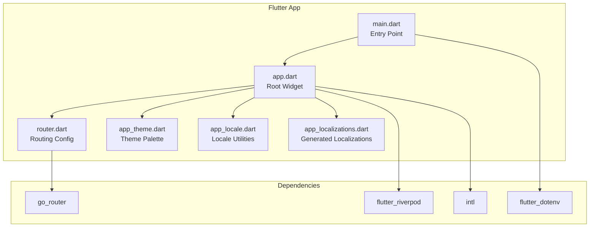

**Diagram sources**
- [main.dart:1-11](file://Luminous/lib/main.dart#L1-L11)
- [app.dart:1-116](file://Luminous/lib/app/app.dart#L1-L116)
- [router.dart](file://Luminous/lib/app/router.dart)
- [app_theme.dart](file://Luminous/lib/core/theme/app_theme.dart)
- [app_locale.dart](file://Luminous/lib/core/i18n/app_locale.dart)
- [app_localizations.dart](file://Luminous/lib/l10n/app_localizations.dart)
- [pubspec.yaml:35-66](file://Luminous/pubspec.yaml#L35-L66)

**Section sources**
- [main.dart:1-11](file://Luminous/lib/main.dart#L1-L11)
- [app.dart:1-116](file://Luminous/lib/app/app.dart#L1-L116)
- [pubspec.yaml:101-106](file://Luminous/pubspec.yaml#L101-L106)

## Core Components
- Entry point and initialization:
  - Ensures Flutter binding initialization, conditionally loads environment variables, and wraps the root widget with Riverpod’s ProviderScope.
- Root application widget:
  - Material app configured with router, theme, dark theme, theme mode, locale, and localization delegates.
  - Listens to authentication state changes to invalidate providers and restore locale preferences from backend profiles.
- Routing:
  - Router configuration is provided by a dedicated router module that integrates with go_router.
- Internationalization:
  - ARB-based localization with generated delegates and supported locales.
- Themes:
  - Light/dark themes derived from a palette preference managed by a controller provider.

**Section sources**
- [main.dart:6-10](file://Luminous/lib/main.dart#L6-L10)
- [app.dart:37-95](file://Luminous/lib/app/app.dart#L37-L95)
- [app.dart:97-114](file://Luminous/lib/app/app.dart#L97-L114)
- [l10n.yaml:1-5](file://Luminous/l10n.yaml#L1-L5)

## Architecture Overview
The application adopts a modular architecture with clear separation of concerns:
- Presentation layer: Widgets and providers orchestrated by Riverpod.
- Domain layer: Feature-specific modules encapsulating business logic and data providers.
- Infrastructure layer: Plugins and platform integrations (notifications, secure storage, permissions, etc.).

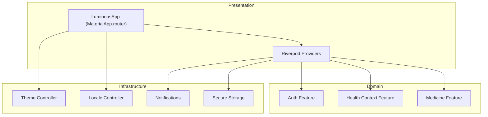

**Diagram sources**
- [app.dart:16-116](file://Luminous/lib/app/app.dart#L16-L116)
- [auth_session_provider.dart](file://Luminous/lib/features/auth/presentation/providers/auth_session_provider.dart)
- [health_context_data_providers.dart](file://Luminous/lib/features/health_context/data/providers/health_context_data_providers.dart)
- [medicine_reminder_notification_coordinator.dart](file://Luminous/lib/features/medicine/presentation/providers/medicine_reminder_notification_coordinator.dart)
- [app_theme_controller.dart](file://Luminous/lib/core/theme/app_theme_controller.dart)
- [app_locale_controller.dart](file://Luminous/lib/core/i18n/app_locale_controller.dart)

## Detailed Component Analysis

### Entry Point and Initialization
- Initializes Flutter binding and loads environment variables.
- Runs the root widget inside ProviderScope to enable global state management.

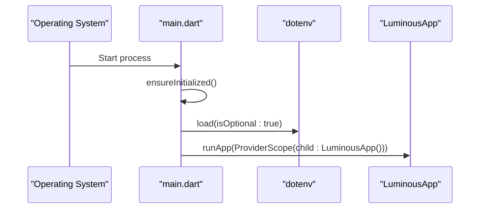

**Diagram sources**
- [main.dart:6-10](file://Luminous/lib/main.dart#L6-L10)

**Section sources**
- [main.dart:6-10](file://Luminous/lib/main.dart#L6-L10)

### Root Application Widget and Theme/Locale Composition
- Builds MaterialApp.router with:
  - Theme and dark theme derived from a palette preference.
  - Theme mode controlled by a preference.
  - Locale resolved from a controller and supported locales from generated delegates.
  - Router configuration injected via a router module.
- Listens to authentication state to invalidate providers and synchronize locale preferences.

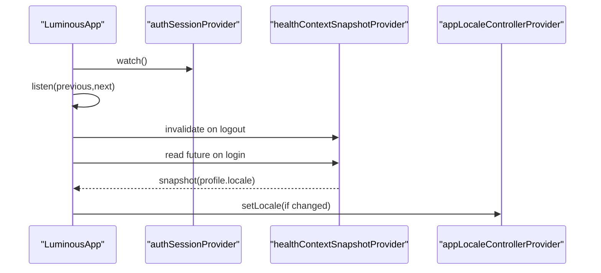

**Diagram sources**
- [app.dart:39-61](file://Luminous/lib/app/app.dart#L39-L61)
- [app.dart:97-114](file://Luminous/lib/app/app.dart#L97-L114)

**Section sources**
- [app.dart:37-95](file://Luminous/lib/app/app.dart#L37-L95)
- [app.dart:97-114](file://Luminous/lib/app/app.dart#L97-L114)

### Routing Configuration and Navigation Patterns
- Router configuration is provided by a dedicated router module that integrates with go_router.
- Navigation patterns leverage go_router for declarative routing and transitions.
- Route protection is implemented by listening to authentication state and invalidating providers upon logout.

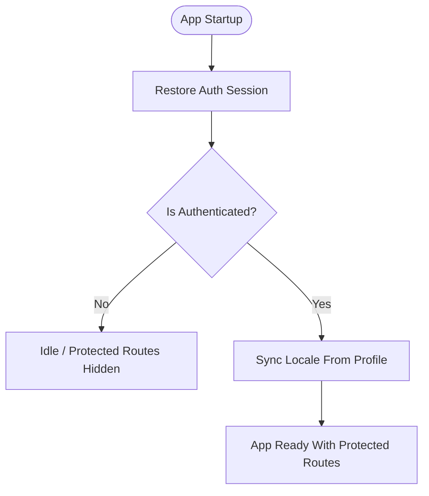

**Diagram sources**
- [app.dart:29-35](file://Luminous/lib/app/app.dart#L29-L35)
- [app.dart:43-61](file://Luminous/lib/app/app.dart#L43-L61)
- [router.dart](file://Luminous/lib/app/router.dart)

**Section sources**
- [app.dart:29-35](file://Luminous/lib/app/app.dart#L29-L35)
- [app.dart:43-61](file://Luminous/lib/app/app.dart#L43-L61)
- [router.dart](file://Luminous/lib/app/router.dart)

### Internationalization Setup
- ARB directory and template file define localization keys.
- Generated localization delegates and supported locales are supplied to MaterialApp.
- Locale restoration from backend profile ensures user preference persistence across sessions.

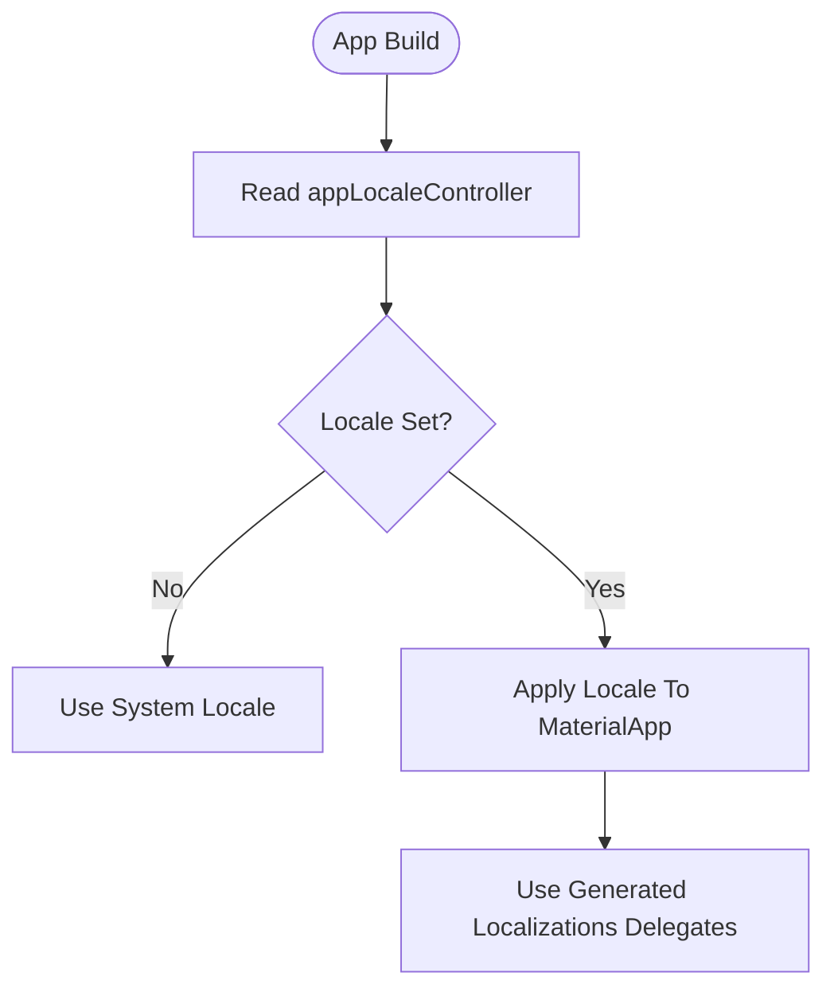

**Diagram sources**
- [app.dart:67-92](file://Luminous/lib/app/app.dart#L67-L92)
- [l10n.yaml:1-5](file://Luminous/l10n.yaml#L1-L5)
- [app_localizations.dart](file://Luminous/lib/l10n/app_localizations.dart)

**Section sources**
- [app.dart:67-92](file://Luminous/lib/app/app.dart#L67-L92)
- [l10n.yaml:1-5](file://Luminous/l10n.yaml#L1-L5)

### Asset Management and Build Configuration
- Assets are declared in pubspec.yaml under the flutter section.
- Icons and other static assets are organized under assets/ and referenced by platform generators.

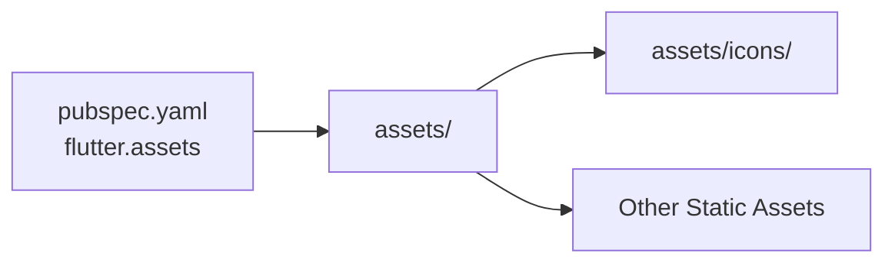

**Diagram sources**
- [pubspec.yaml:101-106](file://Luminous/pubspec.yaml#L101-L106)

**Section sources**
- [pubspec.yaml:101-106](file://Luminous/pubspec.yaml#L101-L106)

### Dependency Injection Patterns
- Riverpod providers orchestrate state and cross-cutting concerns such as theme, locale, auth session, and health context snapshots.
- The root widget listens to provider streams to react to state changes (e.g., authentication transitions).

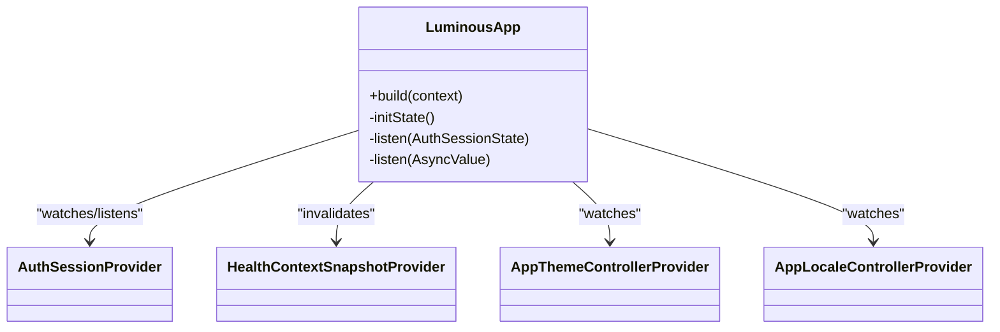

**Diagram sources**
- [app.dart:25-116](file://Luminous/lib/app/app.dart#L25-L116)
- [auth_session_provider.dart](file://Luminous/lib/features/auth/presentation/providers/auth_session_provider.dart)
- [health_context_data_providers.dart](file://Luminous/lib/features/health_context/data/providers/health_context_data_providers.dart)
- [app_theme_controller.dart](file://Luminous/lib/core/theme/app_theme_controller.dart)
- [app_locale_controller.dart](file://Luminous/lib/core/i18n/app_locale_controller.dart)

**Section sources**
- [app.dart:25-116](file://Luminous/lib/app/app.dart#L25-L116)

### Configuration Management
- Environment variables are loaded via flutter_dotenv at startup.
- Platform-specific configurations are handled by plugins and native project files (Android Gradle, iOS Podfile, etc.).

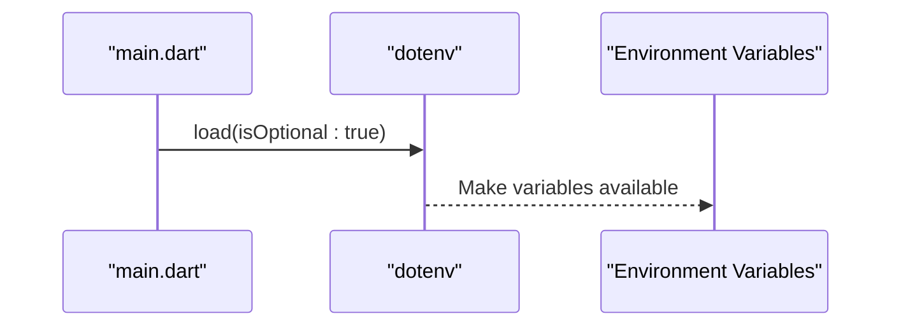

**Diagram sources**
- [main.dart:8](file://Luminous/lib/main.dart#L8)

**Section sources**
- [main.dart:8](file://Luminous/lib/main.dart#L8)

### Platform-Specific Configurations
- Android: Gradle build files and key properties for signing and SDK configuration.
- iOS: Scene delegate configuration for WeChat OAuth and asset catalogs.
- Web: Manifest and splash assets for PWA support.
- Desktop (Linux/macOS/Windows): CMake-based runners and entitlements/profiles.

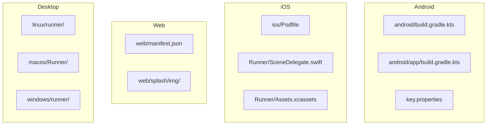

**Diagram sources**
- [pubspec.yaml:25-28](file://Luminous/pubspec.yaml#L25-L28)

**Section sources**
- [pubspec.yaml:25-28](file://Luminous/pubspec.yaml#L25-L28)

## Dependency Analysis
External dependencies include UI toolkit, state management, routing, HTTP client, database, notifications, permissions, and localization. Dev dependencies support code generation and linting.

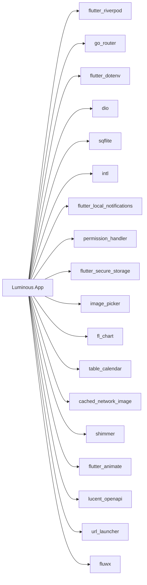

**Diagram sources**
- [pubspec.yaml:35-66](file://Luminous/pubspec.yaml#L35-L66)

**Section sources**
- [pubspec.yaml:35-78](file://Luminous/pubspec.yaml#L35-L78)

## Performance Considerations
- Prefer lightweight widgets and avoid unnecessary rebuilds by leveraging Riverpod selectors and efficient provider scopes.
- Defer heavy initialization tasks until after the first frame to keep startup snappy.
- Use caching for network requests and images to reduce latency.
- Keep asset sizes optimized and lazy-load non-critical resources.

## Troubleshooting Guide
- Authentication state transitions:
  - If routes appear protected unexpectedly, verify the auth session provider state and ensure it restores properly on startup.
- Locale synchronization:
  - If the app does not reflect user preferences, confirm the health context snapshot provider returns a valid locale and the locale controller applies it.
- Theme mode:
  - If theme mode does not switch, check the theme controller provider and ensure the palette preference is applied consistently.

**Section sources**
- [app.dart:39-61](file://Luminous/lib/app/app.dart#L39-L61)
- [app.dart:97-114](file://Luminous/lib/app/app.dart#L97-L114)

## Conclusion
Luminous employs a clean, modular Flutter architecture with Riverpod for state management, go_router for navigation, and a robust internationalization pipeline. The design emphasizes separation of concerns, testability, and scalability across platforms. By adhering to the outlined patterns and guidelines, teams can maintain a consistent and extensible codebase.

## Appendices
- Project organization tips:
  - Keep feature modules cohesive and self-contained.
  - Centralize cross-cutting concerns (theme, locale, auth) behind providers.
  - Use code generation for localization and DTOs to reduce boilerplate.
- Code splitting strategies:
  - Split large features into smaller modules and lazy-load route pages.
  - Use Riverpod providers to isolate state and enable selective invalidation.
- Module boundaries:
  - Define clear interfaces between features and infrastructure.
  - Avoid tight coupling between presentation and domain layers.