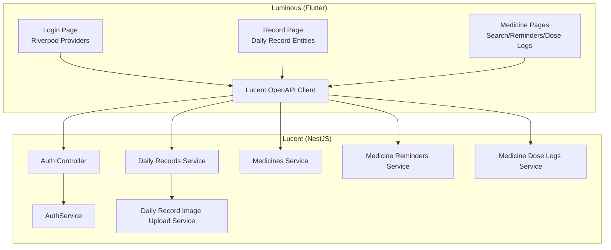
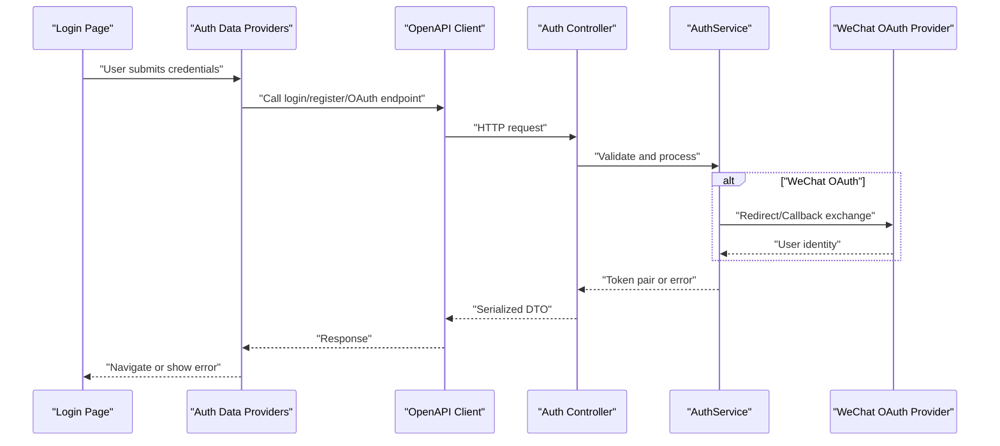
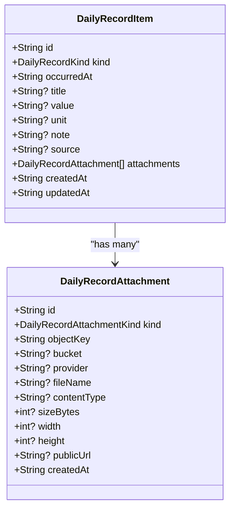
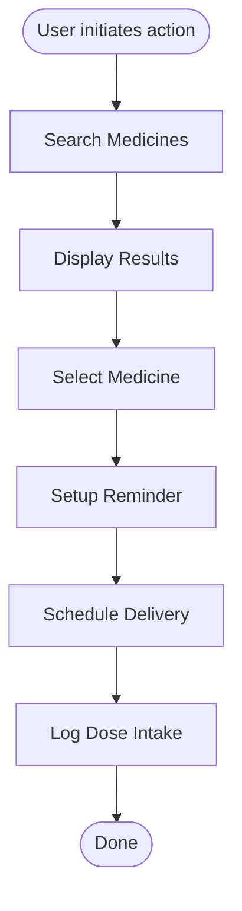
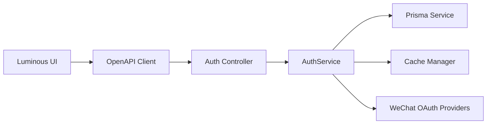

# Core Features Implementation

<cite>
**Referenced Files in This Document**
- [auth_api.dart](file://Luminous/packages/lucent_openapi/lib/src/api/auth_api.dart)
- [auth_data_providers.dart](file://Luminous/lib/features/auth/data/providers/auth_data_providers.dart)
- [login_page.dart](file://Luminous/lib/features/auth/presentation/pages/login_page.dart)
- [auth.service.ts](file://Lucent/src/modules/auth/auth.service.ts)
- [wechat-mobile-oauth.provider.ts](file://Lucent/src/modules/auth/wechat-mobile-oauth.provider.ts)
- [wechat-web-oauth.provider.ts](file://Lucent/src/modules/auth/wechat-web-oauth.provider.ts)
- [verification-code.service.ts](file://Lucent/src/modules/auth/verification-code.service.ts)
- [daily_record.dart](file://Luminous/lib/features/record/domain/entities/daily_record.dart)
- [daily_records.service.ts](file://Lucent/src/modules/daily-records/daily-records.service.ts)
- [daily_records.controller.ts](file://Lucent/src/modules/daily-records/daily-records.controller.ts)
- [daily_record_image_upload.service.ts](file://Lucent/src/modules/daily-records/daily-record-image-upload.service.ts)
- [medicines.service.ts](file://Lucent/src/modules/medicines/medicines.service.ts)
- [medicine-reminders.service.ts](file://Lucent/src/modules/medicine-reminders/medicine-reminders.service.ts)
- [reminder-deliveries.controller.ts](file://Lucent/src/modules/medicine-reminders/reminder-deliveries.controller.ts)
- [medicine-dose-logs.service.ts](file://Lucent/src/modules/medicine-dose-logs/medicine-dose-logs.service.ts)
- [medicines.controller.ts](file://Lucent/src/modules/medicines/medicines.controller.ts)
- [medicines.module.ts](file://Lucent/src/modules/medicines/medicines.module.ts)
- [medicines.utils.ts](file://Lucent/src/modules/medicines/medicines.utils.ts)
- [medicines_api_test.dart](file://Luminous/test/medicines_api_test.dart)
</cite>

## Table of Contents
1. [Introduction](#introduction)
2. [Project Structure](#project-structure)
3. [Core Components](#core-components)
4. [Architecture Overview](#architecture-overview)
5. [Detailed Component Analysis](#detailed-component-analysis)
6. [Dependency Analysis](#dependency-analysis)
7. [Performance Considerations](#performance-considerations)
8. [Troubleshooting Guide](#troubleshooting-guide)
9. [Conclusion](#conclusion)

## Introduction
This document details the core feature implementations in Luminous, focusing on:
- Authentication flow: login, registration, and OAuth integration with WeChat (mobile and web)
- Health data management: daily record creation, image attachment, and form validation
- Medication management: search, reminder setup, and dose logging
It also covers UI components, state management patterns, data persistence strategies, error handling, loading states, user feedback, cross-platform compatibility, performance optimization, and accessibility compliance.

## Project Structure
The system comprises:
- Backend (NestJS): Lucent provides REST APIs for authentication, health records, medications, reminders, and environment data.
- Frontend (Flutter Riverpod): Luminous consumes the backend via an OpenAPI-generated client and manages UI, state, and platform integrations.
- Shared OpenAPI client: Luminous depends on a Dart OpenAPI client package for typed API interactions.

**Diagram sources**
- [auth_api.dart](file://Luminous/packages/lucent_openapi/lib/src/api/auth_api.dart)
- [auth_data_providers.dart](file://Luminous/lib/features/auth/data/providers/auth_data_providers.dart)
- [login_page.dart](file://Luminous/lib/features/auth/presentation/pages/login_page.dart)
- [auth.service.ts](file://Lucent/src/modules/auth/auth.service.ts)
- [daily_records.service.ts](file://Lucent/src/modules/daily-records/daily-records.service.ts)
- [daily_record_image_upload.service.ts](file://Lucent/src/modules/daily-records/daily-record-image-upload.service.ts)
- [medicines.service.ts](file://Lucent/src/modules/medicines/medicines.service.ts)
- [medicine-reminders.service.ts](file://Lucent/src/modules/medicine-reminders/medicine-reminders.service.ts)
- [medicine-dose-logs.service.ts](file://Lucent/src/modules/medicine-dose-logs/medicine-dose-logs.service.ts)

**Section sources**
- [auth_api.dart](file://Luminous/packages/lucent_openapi/lib/src/api/auth_api.dart)
- [auth_data_providers.dart](file://Luminous/lib/features/auth/data/providers/auth_data_providers.dart)
- [login_page.dart](file://Luminous/lib/features/auth/presentation/pages/login_page.dart)
- [auth.service.ts](file://Lucent/src/modules/auth/auth.service.ts)
- [daily_records.service.ts](file://Lucent/src/modules/daily-records/daily-records.service.ts)
- [medicines.service.ts](file://Lucent/src/modules/medicines/medicines.service.ts)

## Core Components
- Authentication subsystem: backend service orchestrates JWT issuance, verification code delivery, and WeChat OAuth providers; frontend integrates via Riverpod and OpenAPI client.
- Health records subsystem: domain entities define record kinds and attachments; backend services manage CRUD and image uploads; frontend pages render forms and lists.
- Medication subsystem: backend exposes search, reminders, and dose logging; frontend pages coordinate search UX, reminder scheduling, and logging actions.

**Section sources**
- [auth.service.ts](file://Lucent/src/modules/auth/auth.service.ts)
- [wechat-mobile-oauth.provider.ts](file://Lucent/src/modules/auth/wechat-mobile-oauth.provider.ts)
- [wechat-web-oauth.provider.ts](file://Lucent/src/modules/auth/wechat-web-oauth.provider.ts)
- [verification-code.service.ts](file://Lucent/src/modules/auth/verification-code.service.ts)
- [daily_record.dart](file://Luminous/lib/features/record/domain/entities/daily_record.dart)
- [daily_records.service.ts](file://Lucent/src/modules/daily-records/daily-records.service.ts)
- [medicines.service.ts](file://Lucent/src/modules/medicines/medicines.service.ts)
- [medicine-reminders.service.ts](file://Lucent/src/modules/medicine-reminders/medicine-reminders.service.ts)
- [medicine-dose-logs.service.ts](file://Lucent/src/modules/medicine-dose-logs/medicine-dose-logs.service.ts)

## Architecture Overview
The authentication flow spans frontend and backend:
- Frontend triggers login/register/OAuth actions via Riverpod providers and OpenAPI client.
- Backend validates inputs, manages sessions, and communicates with external providers (WeChat) and internal services (verification, user, JWT).
- Responses are serialized via DTOs and returned to the frontend.

**Diagram sources**
- [auth_data_providers.dart](file://Luminous/lib/features/auth/data/providers/auth_data_providers.dart)
- [auth_api.dart](file://Luminous/packages/lucent_openapi/lib/src/api/auth_api.dart)
- [auth.service.ts](file://Lucent/src/modules/auth/auth.service.ts)
- [wechat-mobile-oauth.provider.ts](file://Lucent/src/modules/auth/wechat-mobile-oauth.provider.ts)
- [wechat-web-oauth.provider.ts](file://Lucent/src/modules/auth/wechat-web-oauth.provider.ts)

## Detailed Component Analysis

### Authentication Flow
- Backend orchestration:
  - Registration and login paths are handled by the authentication service, including JWT configuration and rate-limiting buckets for failures.
  - Verification code service supports email/SMS flows during registration and password resets.
  - WeChat OAuth providers support mobile and web flows with state handling and callbacks.
- Frontend integration:
  - Riverpod providers supply remote data sources and OAuth clients to UI pages.
  - OpenAPI client methods expose typed endpoints for WeChat login (mobile/web) and other auth operations.

Implementation highlights:
- Registration and login orchestration in the backend service.
- Verification code generation and delivery.
- WeChat OAuth state management and secure callback handling.
- Frontend providers wiring OpenAPI client to UI.

**Section sources**
- [auth.service.ts](file://Lucent/src/modules/auth/auth.service.ts)
- [verification-code.service.ts](file://Lucent/src/modules/auth/verification-code.service.ts)
- [wechat-mobile-oauth.provider.ts](file://Lucent/src/modules/auth/wechat-mobile-oauth.provider.ts)
- [wechat-web-oauth.provider.ts](file://Lucent/src/modules/auth/wechat-web-oauth.provider.ts)
- [auth_data_providers.dart](file://Luminous/lib/features/auth/data/providers/auth_data_providers.dart)
- [auth_api.dart](file://Luminous/packages/lucent_openapi/lib/src/api/auth_api.dart)

### Health Data Management
- Domain model:
  - Daily record kinds and attachments are modeled as enums and entities.
- Backend services:
  - Daily records controller and service manage creation, updates, and retrieval.
  - Image upload service handles attachment metadata and storage integration.
- Frontend:
  - Pages consume OpenAPI client to submit forms and display lists.
  - Entities define validation constraints (e.g., required fields, units).

**Diagram sources**
- [daily_record.dart](file://Luminous/lib/features/record/domain/entities/daily_record.dart)

**Section sources**
- [daily_record.dart](file://Luminous/lib/features/record/domain/entities/daily_record.dart)
- [daily_records.service.ts](file://Lucent/src/modules/daily-records/daily-records.service.ts)
- [daily_records.controller.ts](file://Lucent/src/modules/daily-records/daily-records.controller.ts)
- [daily_record_image_upload.service.ts](file://Lucent/src/modules/daily-records/daily-record-image-upload.service.ts)

### Medication Management
- Search:
  - Backend medicines module exposes search endpoints and utilities for parsing and normalization.
- Reminders:
  - Reminders service manages scheduling and delivery; reminder deliveries controller surfaces delivery events.
- Dose logging:
  - Dose logs service persists intake events with status tracking.

**Diagram sources**
- [medicines.service.ts](file://Lucent/src/modules/medicines/medicines.service.ts)
- [medicines.utils.ts](file://Lucent/src/modules/medicines/medicines.utils.ts)
- [medicine-reminders.service.ts](file://Lucent/src/modules/medicine-reminders/medicine-reminders.service.ts)
- [reminder-deliveries.controller.ts](file://Lucent/src/modules/medicine-reminders/reminder-deliveries.controller.ts)
- [medicine-dose-logs.service.ts](file://Lucent/src/modules/medicine-dose-logs/medicine-dose-logs.service.ts)

**Section sources**
- [medicines.service.ts](file://Lucent/src/modules/medicines/medicines.service.ts)
- [medicines.utils.ts](file://Lucent/src/modules/medicines/medicines.utils.ts)
- [medicines.controller.ts](file://Lucent/src/modules/medicines/medicines.controller.ts)
- [medicines.module.ts](file://Lucent/src/modules/medicines/medicines.module.ts)
- [medicine-reminders.service.ts](file://Lucent/src/modules/medicine-reminders/medicine-reminders.service.ts)
- [reminder-deliveries.controller.ts](file://Lucent/src/modules/medicine-reminders/reminder-deliveries.controller.ts)
- [medicine-dose-logs.service.ts](file://Lucent/src/modules/medicine-dose-logs/medicine-dose-logs.service.ts)

### UI Components, State Management, and Data Persistence
- State management:
  - Riverpod providers encapsulate remote data sources and OAuth clients for login and WeChat flows.
- Data persistence:
  - Backend uses Prisma-managed PostgreSQL tables for user identities, daily records, attachments, reminders, and dose logs.
- Cross-platform:
  - Flutter targets Android, iOS, Web, Windows, macOS, and Linux; platform-specific configurations exist for each target.
- Accessibility:
  - Internationalization is supported via locale-aware DTOs and UI text keys.

**Section sources**
- [auth_data_providers.dart](file://Luminous/lib/features/auth/data/providers/auth_data_providers.dart)
- [login_page.dart](file://Luminous/lib/features/auth/presentation/pages/login_page.dart)
- [auth_api.dart](file://Luminous/packages/lucent_openapi/lib/src/api/auth_api.dart)

## Dependency Analysis
- Frontend-to-backend:
  - OpenAPI client methods depend on backend controllers and services.
- Backend-to-data:
  - Services depend on Prisma for database operations and cache for short-lived state (e.g., OAuth state).
- Frontend-to-platform:
  - Platform channels and native configurations enable OAuth and notifications on mobile/desktop.

**Diagram sources**
- [auth_api.dart](file://Luminous/packages/lucent_openapi/lib/src/api/auth_api.dart)
- [auth.service.ts](file://Lucent/src/modules/auth/auth.service.ts)

**Section sources**
- [auth_api.dart](file://Luminous/packages/lucent_openapi/lib/src/api/auth_api.dart)
- [auth.service.ts](file://Lucent/src/modules/auth/auth.service.ts)

## Performance Considerations
- API envelope and interceptors standardize responses and reduce overhead.
- DTO-driven serialization minimizes payload sizes and improves cacheability.
- Prisma migrations and indexes support efficient querying for records, reminders, and logs.
- Image upload service manages metadata and URLs to avoid large payloads in record items.

[No sources needed since this section provides general guidance]

## Troubleshooting Guide
- Authentication:
  - Verify OAuth state TTL and secure callback handling.
  - Check verification code delivery and rate-limiting buckets.
- Health records:
  - Validate daily record kind and attachment constraints.
  - Confirm image upload metadata and public URL resolution.
- Medications:
  - Ensure search queries align with normalized medicine data.
  - Confirm reminder scheduling and delivery events.

**Section sources**
- [auth.service.ts](file://Lucent/src/modules/auth/auth.service.ts)
- [verification-code.service.ts](file://Lucent/src/modules/auth/verification-code.service.ts)
- [daily_records.service.ts](file://Lucent/src/modules/daily-records/daily-records.service.ts)
- [daily_record_image_upload.service.ts](file://Lucent/src/modules/daily-records/daily-record-image-upload.service.ts)
- [medicines.service.ts](file://Lucent/src/modules/medicines/medicines.service.ts)
- [medicine-reminders.service.ts](file://Lucent/src/modules/medicine-reminders/medicine-reminders.service.ts)
- [medicine-dose-logs.service.ts](file://Lucent/src/modules/medicine-dose-logs/medicine-dose-logs.service.ts)

## Conclusion
Luminous integrates a robust backend (Lucent) with a responsive frontend (Luminous) to deliver authentication, health records, and medication management. The system leverages typed APIs, domain-driven design, and platform-specific capabilities to ensure reliability, scalability, and cross-platform compatibility.