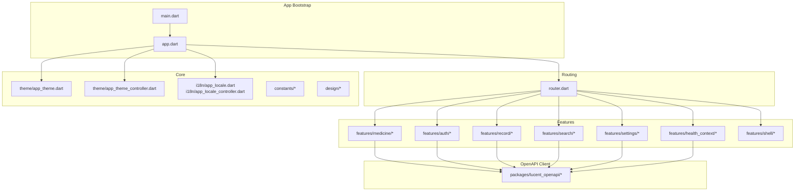
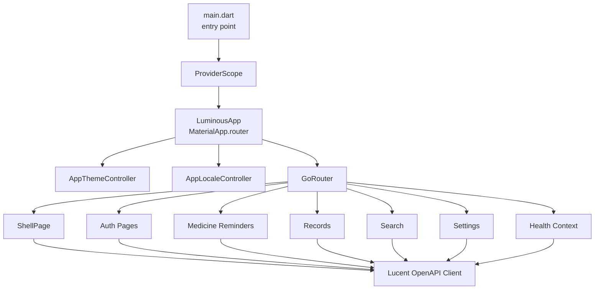
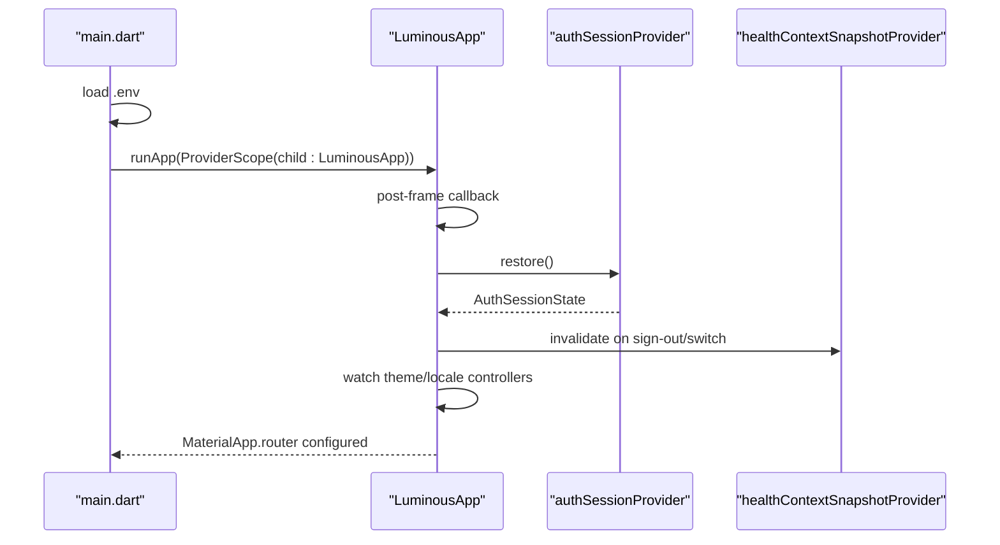
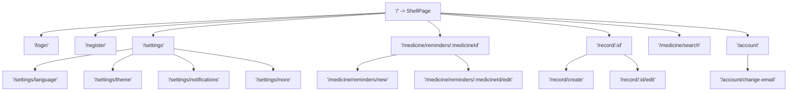
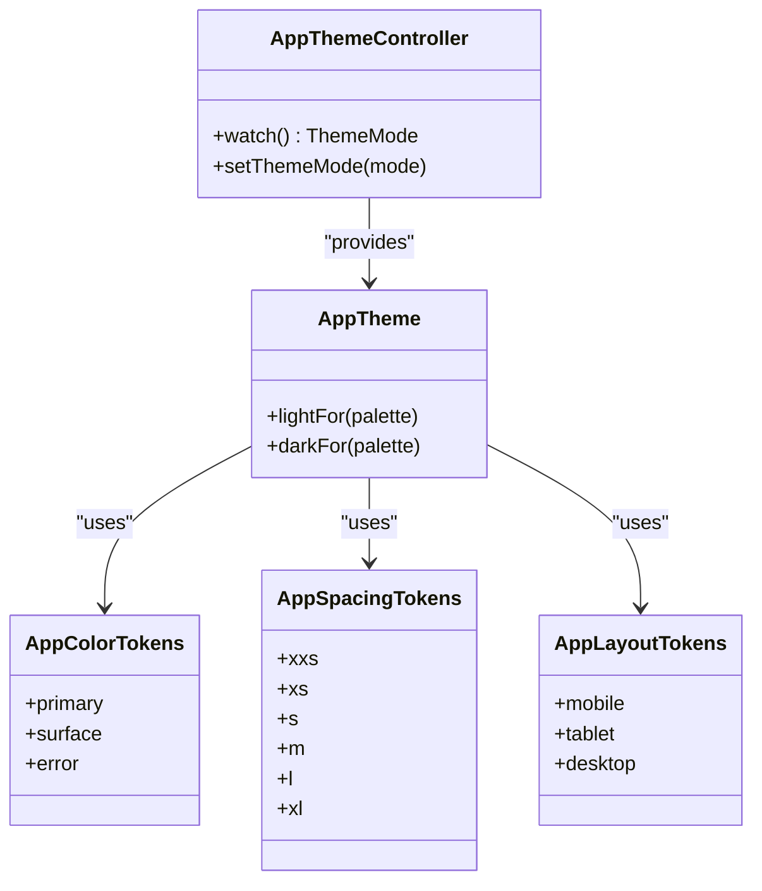
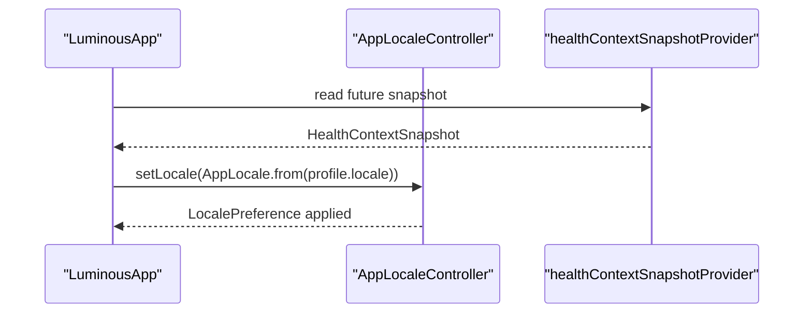
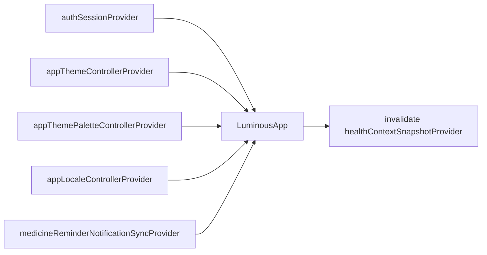
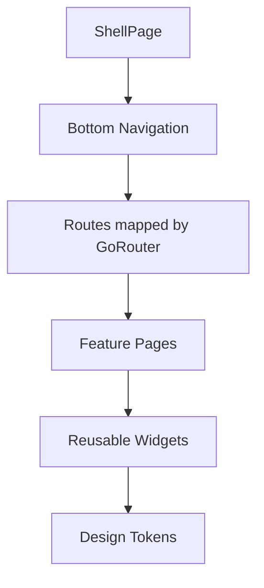
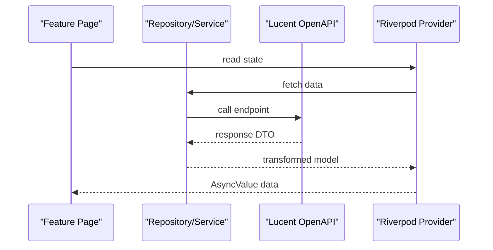
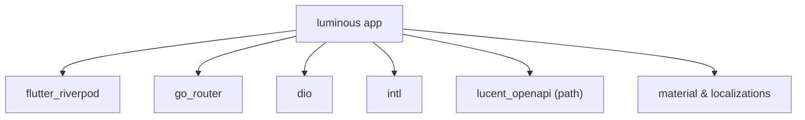

# Frontend Architecture (Luminous)

<cite>
**Referenced Files in This Document**
- [pubspec.yaml](file://Luminous/pubspec.yaml)
- [main.dart](file://Luminous/lib/main.dart)
- [app.dart](file://Luminous/lib/app/app.dart)
- [router.dart](file://Luminous/lib/app/router.dart)
- [app_theme.dart](file://Luminous/lib/core/theme/app_theme.dart)
- [app_theme_controller.dart](file://Luminous/lib/core/theme/app_theme_controller.dart)
- [app_locale.dart](file://Luminous/lib/core/i18n/app_locale.dart)
- [app_locale_controller.dart](file://Luminous/lib/core/i18n/app_locale_controller.dart)
- [app_breakpoints.dart](file://Luminous/lib/core/constants/app_breakpoints.dart)
- [app_colors.dart](file://Luminous/lib/core/constants/app_colors.dart)
- [app_color_tokens.dart](file://Luminous/lib/core/design/app_color_tokens.dart)
- [app_design.dart](file://Luminous/lib/core/design/app_design.dart)
- [app_layout_tokens.dart](file://Luminous/lib/core/design/app_layout_tokens.dart)
- [app_radius_tokens.dart](file://Luminous/lib/core/design/app_radius_tokens.dart)
- [app_shadow_tokens.dart](file://Luminous/lib/core/design/app_shadow_tokens.dart)
- [app_spacing_tokens.dart](file://Luminous/lib/core/design/app_spacing_tokens.dart)
- [auth_session_provider.dart](file://Luminous/lib/features/auth/presentation/providers/auth_session_provider.dart)
- [health_context_data_providers.dart](file://Luminous/lib/features/health_context/data/providers/health_context_data_providers.dart)
- [medicine_reminder_notification_coordinator.dart](file://Luminous/lib/features/medicine/presentation/providers/medicine_reminder_notification_coordinator.dart)
- [shell_page.dart](file://Luminous/lib/features/shell/presentation/shell_page.dart)
- [lucent_openapi.dart](file://Luminous/packages/lucent_openapi/lib/lucent_openapi.dart)
- [daily_records_api.dart](file://Luminous/packages/lucent_openapi/lib/src/apis/daily_records_api.dart)
- [medicines_api.dart](file://Luminous/packages/lucent_openapi/lib/src/apis/medicines_api.dart)
- [auth_api.dart](file://Luminous/packages/lucent_openapi/lib/src/apis/auth_api.dart)
- [app_smoke_test.dart](file://Luminous/integration_test/app_smoke_test.dart)
- [auth_entry_e2e_test.dart](file://Luminous/integration_test/auth_entry_e2e_test.dart)
- [record_navigation_e2e_test.dart](file://Luminous/integration_test/record_navigation_e2e_test.dart)
- [medicine_e2e_test.dart](file://Luminous/integration_test/medicine_e2e_test.dart)
- [mine_e2e_test.dart](file://Luminous/integration_test/mine_e2e_test.dart)
- [settings_preferences_e2e_test.dart](file://Luminous/integration_test/settings_preferences_e2e_test.dart)
</cite>

## Table of Contents
1. [Introduction](#introduction)
2. [Project Structure](#project-structure)
3. [Core Components](#core-components)
4. [Architecture Overview](#architecture-overview)
5. [Detailed Component Analysis](#detailed-component-analysis)
6. [Dependency Analysis](#dependency-analysis)
7. [Performance Considerations](#performance-considerations)
8. [Troubleshooting Guide](#troubleshooting-guide)
9. [Conclusion](#conclusion)
10. [Appendices](#appendices)

## Introduction
This document describes the frontend architecture of the Luminous application, a Flutter-based cross-platform system. It covers the application bootstrap, routing, state management via Riverpod, theming and localization systems, modular feature organization, UI component hierarchy, styling approaches, and integration with backend APIs through an OpenAPI-generated client library. Platform-specific deployment considerations for iOS, Android, web, and desktop are included, along with testing strategies, performance optimization techniques, and debugging approaches.

## Project Structure
The Luminous frontend is organized into a layered, feature-driven structure:
- Application bootstrap and entry point
- Core modules for theme, i18n, constants, and design tokens
- Feature modules for authentication, health context, medicine reminders, records, search, settings, and shell
- Integration tests for end-to-end coverage
- An internal OpenAPI client package for backend communication

**Diagram sources**
- [main.dart:1-11](file://Luminous/lib/main.dart#L1-L11)
- [app.dart:1-116](file://Luminous/lib/app/app.dart#L1-L116)
- [router.dart:1-163](file://Luminous/lib/app/router.dart#L1-L163)
- [app_theme.dart](file://Luminous/lib/core/theme/app_theme.dart)
- [app_theme_controller.dart](file://Luminous/lib/core/theme/app_theme_controller.dart)
- [app_locale.dart](file://Luminous/lib/core/i18n/app_locale.dart)
- [app_locale_controller.dart](file://Luminous/lib/core/i18n/app_locale_controller.dart)
- [app_breakpoints.dart](file://Luminous/lib/core/constants/app_breakpoints.dart)
- [app_colors.dart](file://Luminous/lib/core/constants/app_colors.dart)
- [app_color_tokens.dart](file://Luminous/lib/core/design/app_color_tokens.dart)
- [app_design.dart](file://Luminous/lib/core/design/app_design.dart)
- [app_layout_tokens.dart](file://Luminous/lib/core/design/app_layout_tokens.dart)
- [app_radius_tokens.dart](file://Luminous/lib/core/design/app_radius_tokens.dart)
- [app_shadow_tokens.dart](file://Luminous/lib/core/design/app_shadow_tokens.dart)
- [app_spacing_tokens.dart](file://Luminous/lib/core/design/app_spacing_tokens.dart)
- [auth_session_provider.dart](file://Luminous/lib/features/auth/presentation/providers/auth_session_provider.dart)
- [health_context_data_providers.dart](file://Luminous/lib/features/health_context/data/providers/health_context_data_providers.dart)
- [medicine_reminder_notification_coordinator.dart](file://Luminous/lib/features/medicine/presentation/providers/medicine_reminder_notification_coordinator.dart)
- [shell_page.dart](file://Luminous/lib/features/shell/presentation/shell_page.dart)
- [lucent_openapi.dart](file://Luminous/packages/lucent_openapi/lib/lucent_openapi.dart)

**Section sources**
- [pubspec.yaml:1-106](file://Luminous/pubspec.yaml#L1-L106)
- [main.dart:1-11](file://Luminous/lib/main.dart#L1-L11)
- [app.dart:1-116](file://Luminous/lib/app/app.dart#L1-L116)
- [router.dart:1-163](file://Luminous/lib/app/router.dart#L1-L163)

## Core Components
- Application bootstrap initializes environment variables and wraps the app in Riverpod’s ProviderScope.
- LuminousApp configures Material 3 theming, localization delegates, and integrates Riverpod providers for session restoration and health context snapshot invalidation.
- Routing is centralized via GoRouter with named routes for authentication, settings, medicine reminders, records, and health context editing.
- Theme system supports light/dark modes and palette preferences via dedicated controllers and AppTheme.
- Internationalization is configured with AppLocalizations and AppLocale controller for runtime locale switching.
- Constants and design tokens define spacing, radius, shadows, layout, and color palettes for consistent UI.

**Section sources**
- [main.dart:1-11](file://Luminous/lib/main.dart#L1-L11)
- [app.dart:1-116](file://Luminous/lib/app/app.dart#L1-L116)
- [router.dart:1-163](file://Luminous/lib/app/router.dart#L1-L163)
- [app_theme.dart](file://Luminous/lib/core/theme/app_theme.dart)
- [app_theme_controller.dart](file://Luminous/lib/core/theme/app_theme_controller.dart)
- [app_locale.dart](file://Luminous/lib/core/i18n/app_locale.dart)
- [app_locale_controller.dart](file://Luminous/lib/core/i18n/app_locale_controller.dart)
- [app_breakpoints.dart](file://Luminous/lib/core/constants/app_breakpoints.dart)
- [app_colors.dart](file://Luminous/lib/core/constants/app_colors.dart)
- [app_color_tokens.dart](file://Luminous/lib/core/design/app_color_tokens.dart)
- [app_design.dart](file://Luminous/lib/core/design/app_design.dart)
- [app_layout_tokens.dart](file://Luminous/lib/core/design/app_layout_tokens.dart)
- [app_radius_tokens.dart](file://Luminous/lib/core/design/app_radius_tokens.dart)
- [app_shadow_tokens.dart](file://Luminous/lib/core/design/app_shadow_tokens.dart)
- [app_spacing_tokens.dart](file://Luminous/lib/core/design/app_spacing_tokens.dart)

## Architecture Overview
The frontend follows a Riverpod-centric architecture with:
- Stateless widgets orchestrated by providers
- Centralized routing with route guards and deep-link support
- Modular feature boundaries with isolated providers and pages
- Strong separation of concerns between presentation, domain, and data layers
- OpenAPI client package encapsulating backend contracts

**Diagram sources**
- [main.dart:1-11](file://Luminous/lib/main.dart#L1-L11)
- [app.dart:1-116](file://Luminous/lib/app/app.dart#L1-L116)
- [router.dart:1-163](file://Luminous/lib/app/router.dart#L1-L163)
- [lucent_openapi.dart](file://Luminous/packages/lucent_openapi/lib/lucent_openapi.dart)

## Detailed Component Analysis

### Application Bootstrap and Lifecycle
- The app loads environment variables and runs under ProviderScope.
- LuminousApp restores authentication state after the first frame and invalidates health context snapshots upon sign-out or user switch.
- It listens for notification sync provider updates and applies locale restoration from backend user profile preferences.

**Diagram sources**
- [main.dart:1-11](file://Luminous/lib/main.dart#L1-L11)
- [app.dart:25-115](file://Luminous/lib/app/app.dart#L25-L115)
- [auth_session_provider.dart](file://Luminous/lib/features/auth/presentation/providers/auth_session_provider.dart)
- [health_context_data_providers.dart](file://Luminous/lib/features/health_context/data/providers/health_context_data_providers.dart)

**Section sources**
- [main.dart:1-11](file://Luminous/lib/main.dart#L1-L11)
- [app.dart:25-115](file://Luminous/lib/app/app.dart#L25-L115)

### Navigation Structure
- Routes are defined centrally with GoRouter, supporting nested pages for medicine reminders, records, and health context editing.
- OAuth flows for WeChat are integrated via query parameters.
- Route parameters enable dynamic page construction (e.g., editing existing items).

**Diagram sources**
- [router.dart:24-155](file://Luminous/lib/app/router.dart#L24-L155)

**Section sources**
- [router.dart:1-163](file://Luminous/lib/app/router.dart#L1-L163)

### Theme System and Responsive Design
- Theme mode and palette are controlled by dedicated Riverpod controllers and applied to MaterialApp.router.
- Design tokens (spacing, radius, shadow, layout) and color tokens provide consistent styling across components.
- Breakpoints are defined for responsive layouts.

**Diagram sources**
- [app_theme_controller.dart](file://Luminous/lib/core/theme/app_theme_controller.dart)
- [app_theme.dart](file://Luminous/lib/core/theme/app_theme.dart)
- [app_color_tokens.dart](file://Luminous/lib/core/design/app_color_tokens.dart)
- [app_spacing_tokens.dart](file://Luminous/lib/core/design/app_spacing_tokens.dart)
- [app_layout_tokens.dart](file://Luminous/lib/core/design/app_layout_tokens.dart)
- [app_breakpoints.dart](file://Luminous/lib/core/constants/app_breakpoints.dart)

**Section sources**
- [app_theme.dart](file://Luminous/lib/core/theme/app_theme.dart)
- [app_theme_controller.dart](file://Luminous/lib/core/theme/app_theme_controller.dart)
- [app_color_tokens.dart](file://Luminous/lib/core/design/app_color_tokens.dart)
- [app_spacing_tokens.dart](file://Luminous/lib/core/design/app_spacing_tokens.dart)
- [app_layout_tokens.dart](file://Luminous/lib/core/design/app_layout_tokens.dart)
- [app_breakpoints.dart](file://Luminous/lib/core/constants/app_breakpoints.dart)

### Internationalization Setup
- AppLocalizations delegates and supported locales are configured in LuminousApp.
- AppLocaleController manages runtime locale selection and persistence.
- Backend user profile locale preference is restored asynchronously during session initialization.

**Diagram sources**
- [app.dart:97-114](file://Luminous/lib/app/app.dart#L97-L114)
- [app_locale.dart](file://Luminous/lib/core/i18n/app_locale.dart)
- [app_locale_controller.dart](file://Luminous/lib/core/i18n/app_locale_controller.dart)
- [health_context_data_providers.dart](file://Luminous/lib/features/health_context/data/providers/health_context_data_providers.dart)

**Section sources**
- [app.dart:76-114](file://Luminous/lib/app/app.dart#L76-L114)
- [app_locale.dart](file://Luminous/lib/core/i18n/app_locale.dart)
- [app_locale_controller.dart](file://Luminous/lib/core/i18n/app_locale_controller.dart)

### State Management with Riverpod
- Providers orchestrate session restoration, locale and theme preferences, and notification sync.
- Consumers listen to provider streams to react to state changes (e.g., invalidating health snapshots on auth changes).
- Notification coordinator ensures reminders remain synchronized with backend.

**Diagram sources**
- [app.dart:39-65](file://Luminous/lib/app/app.dart#L39-L65)
- [auth_session_provider.dart](file://Luminous/lib/features/auth/presentation/providers/auth_session_provider.dart)
- [health_context_data_providers.dart](file://Luminous/lib/features/health_context/data/providers/health_context_data_providers.dart)
- [medicine_reminder_notification_coordinator.dart](file://Luminous/lib/features/medicine/presentation/providers/medicine_reminder_notification_coordinator.dart)

**Section sources**
- [app.dart:39-65](file://Luminous/lib/app/app.dart#L39-L65)
- [auth_session_provider.dart](file://Luminous/lib/features/auth/presentation/providers/auth_session_provider.dart)
- [health_context_data_providers.dart](file://Luminous/lib/features/health_context/data/providers/health_context_data_providers.dart)
- [medicine_reminder_notification_coordinator.dart](file://Luminous/lib/features/medicine/presentation/providers/medicine_reminder_notification_coordinator.dart)

### UI Component Hierarchy and Composition Patterns
- ShellPage serves as the primary scaffold, hosting bottom navigation and route transitions.
- Feature pages are composed from reusable widgets and styled via design tokens.
- Responsive breakpoints guide layout adaptation across mobile, tablet, and desktop.

**Diagram sources**
- [shell_page.dart](file://Luminous/lib/features/shell/presentation/shell_page.dart)
- [router.dart:24-155](file://Luminous/lib/app/router.dart#L24-L155)
- [app_layout_tokens.dart](file://Luminous/lib/core/design/app_layout_tokens.dart)
- [app_breakpoints.dart](file://Luminous/lib/core/constants/app_breakpoints.dart)

**Section sources**
- [shell_page.dart](file://Luminous/lib/features/shell/presentation/shell_page.dart)
- [router.dart:24-155](file://Luminous/lib/app/router.dart#L24-L155)
- [app_layout_tokens.dart](file://Luminous/lib/core/design/app_layout_tokens.dart)
- [app_breakpoints.dart](file://Luminous/lib/core/constants/app_breakpoints.dart)

### Backend Integration via OpenAPI Client
- The internal package packages/lucent_openapi exposes typed APIs for authentication, medicines, daily records, and reminders.
- APIs are consumed by feature repositories/services and exposed to UI via Riverpod providers.
- Real-time synchronization is coordinated by providers that listen to backend events and update local state accordingly.

**Diagram sources**
- [lucent_openapi.dart](file://Luminous/packages/lucent_openapi/lib/lucent_openapi.dart)
- [daily_records_api.dart](file://Luminous/packages/lucent_openapi/lib/src/apis/daily_records_api.dart)
- [medicines_api.dart](file://Luminous/packages/lucent_openapi/lib/src/apis/medicines_api.dart)
- [auth_api.dart](file://Luminous/packages/lucent_openapi/lib/src/apis/auth_api.dart)

**Section sources**
- [lucent_openapi.dart](file://Luminous/packages/lucent_openapi/lib/lucent_openapi.dart)
- [daily_records_api.dart](file://Luminous/packages/lucent_openapi/lib/src/apis/daily_records_api.dart)
- [medicines_api.dart](file://Luminous/packages/lucent_openapi/lib/src/apis/medicines_api.dart)
- [auth_api.dart](file://Luminous/packages/lucent_openapi/lib/src/apis/auth_api.dart)

### Platform-Specific Considerations
- iOS: Scene delegate enabled for WeChat OAuth flows.
- Android: Gradle configuration and signing keys managed in the android directory.
- Web: Manifest and splash assets configured for PWA-like experience.
- Desktop (Windows/macOS/Linux): Platform runners and CMake configurations present for native builds.

**Section sources**
- [pubspec.yaml:25-28](file://Luminous/pubspec.yaml#L25-L28)
- [android/build.gradle.kts](file://Luminous/android/build.gradle.kts)
- [ios/Runner/AppDelegate.swift](file://Luminous/ios/Runner/AppDelegate.swift)
- [web/index.html](file://Luminous/web/index.html)
- [windows/CMakeLists.txt](file://Luminous/windows/CMakeLists.txt)
- [linux/CMakeLists.txt](file://Luminous/linux/CMakeLists.txt)
- [macos/Runner/AppDelegate.swift](file://Luminous/macos/Runner/AppDelegate.swift)

## Dependency Analysis
External and internal dependencies are declared in pubspec.yaml. Key dependencies include:
- Riverpod for reactive state management
- GoRouter for declarative routing
- Dio for HTTP requests
- OpenAPI client package for backend integration
- Localization and material design packages

**Diagram sources**
- [pubspec.yaml:35-66](file://Luminous/pubspec.yaml#L35-L66)

**Section sources**
- [pubspec.yaml:35-66](file://Luminous/pubspec.yaml#L35-L66)

## Performance Considerations
- Prefer lightweight providers and avoid unnecessary rebuilds by watching only required slices of state.
- Use AsyncValue helpers to handle loading and error states efficiently.
- Cache frequently accessed data (e.g., health context snapshot) and invalidate on user/session changes.
- Defer heavy computations to background isolates when integrating with notifications or periodic tasks.
- Optimize network calls with Dio interceptors and caching strategies where appropriate.

## Troubleshooting Guide
- Authentication restoration failures: verify authSessionProvider restoration logic and ensure it runs after the first frame.
- Locale mismatch: confirm health context snapshot retrieval and locale controller updates occur after authentication.
- Routing issues: validate route parameters and query parameters parsing in GoRouter.
- OpenAPI client errors: check endpoint URLs, authentication headers, and DTO mapping consistency.
- Integration tests: leverage smoke tests and feature-specific e2e tests to detect regressions across platforms.

**Section sources**
- [app.dart:27-35](file://Luminous/lib/app/app.dart#L27-L35)
- [app.dart:97-114](file://Luminous/lib/app/app.dart#L97-L114)
- [router.dart:157-162](file://Luminous/lib/app/router.dart#L157-L162)
- [app_smoke_test.dart](file://Luminous/integration_test/app_smoke_test.dart)
- [auth_entry_e2e_test.dart](file://Luminous/integration_test/auth_entry_e2e_test.dart)
- [record_navigation_e2e_test.dart](file://Luminous/integration_test/record_navigation_e2e_test.dart)
- [medicine_e2e_test.dart](file://Luminous/integration_test/medicine_e2e_test.dart)
- [mine_e2e_test.dart](file://Luminous/integration_test/mine_e2e_test.dart)
- [settings_preferences_e2e_test.dart](file://Luminous/integration_test/settings_preferences_e2e_test.dart)

## Conclusion
Luminous employs a clean, modular Flutter architecture with Riverpod for state management, GoRouter for navigation, and a comprehensive theming and localization system. The internal OpenAPI client package enables type-safe backend integration, while integration tests ensure cross-platform reliability. By adhering to design tokens, provider best practices, and responsive design principles, the system remains maintainable and scalable across iOS, Android, web, and desktop targets.

## Appendices
- Accessibility: Leverage Material 3 semantics and dynamic text scaling; ensure sufficient color contrast per theme palette.
- Testing: Combine unit tests with Riverpod providers, widget tests for UI logic, and integration tests for end-to-end flows.
- Debugging: Use DevTools, structured logging, and provider listeners to trace state changes and route transitions.