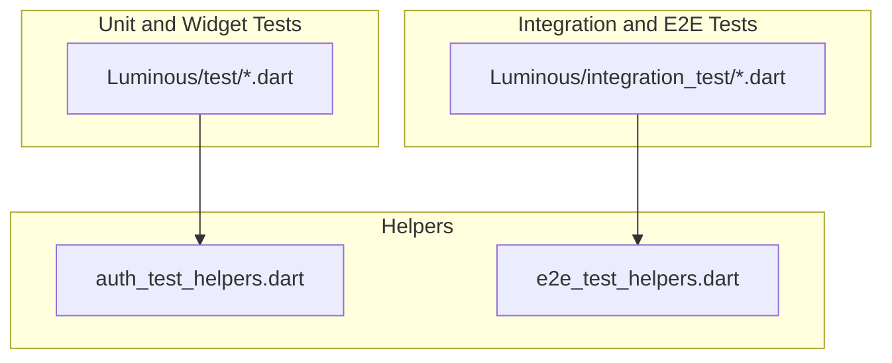
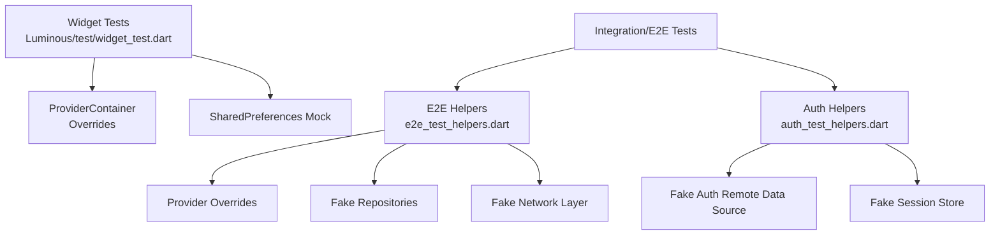
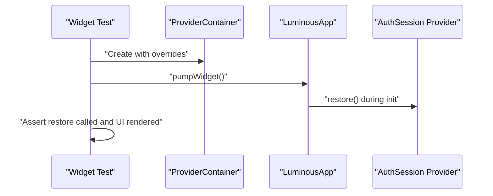
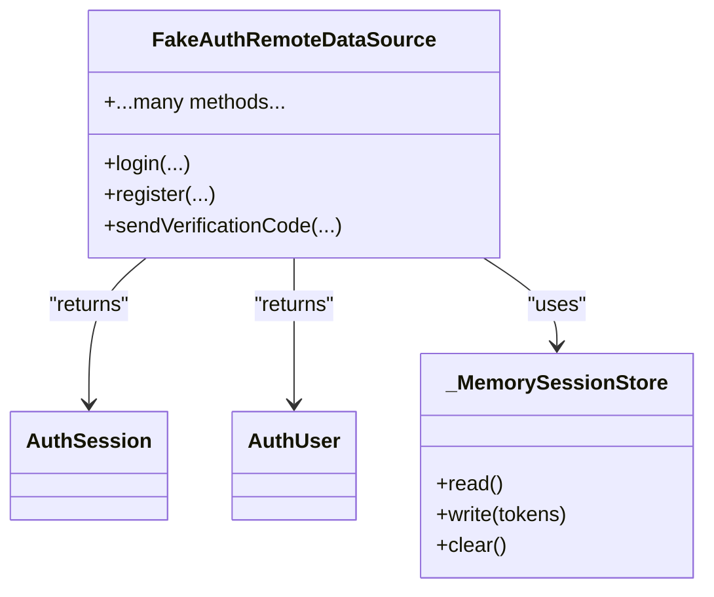
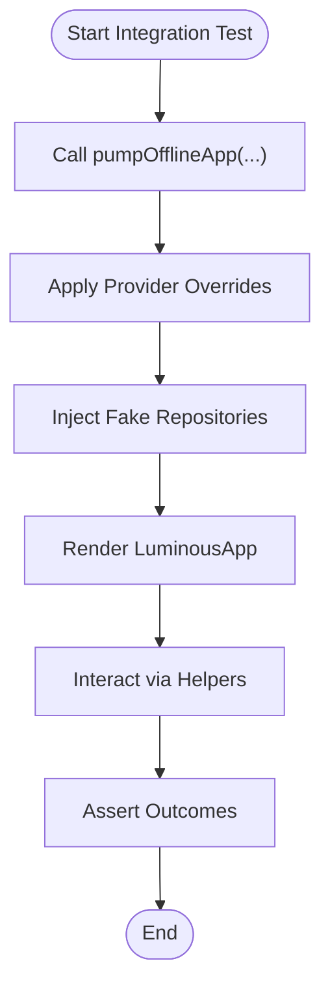
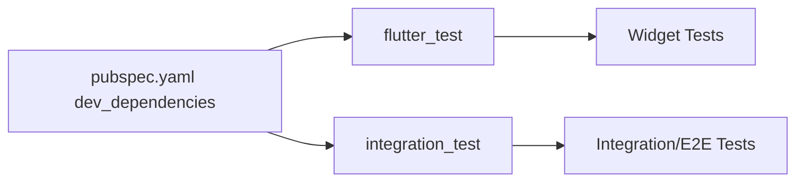
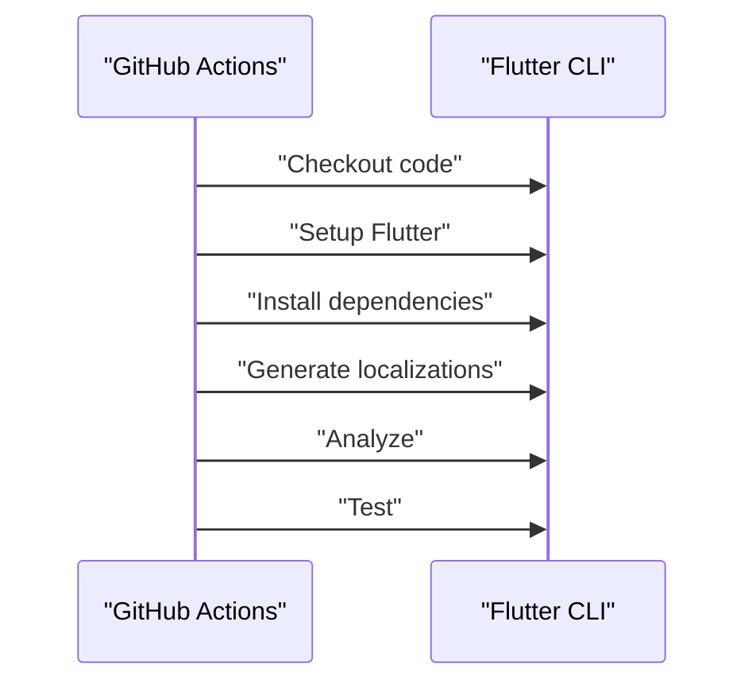

# Testing Strategy

<cite>
**Referenced Files in This Document**
- [widget_test.dart](file://Luminous/test/widget_test.dart)
- [auth_test_helpers.dart](file://Luminous/test/auth_test_helpers.dart)
- [e2e_test_helpers.dart](file://Luminous/integration_test/e2e_test_helpers.dart)
- [flutter-ci.yml](file://Luminous/.github/workflows/flutter-ci.yml)
- [pubspec.yaml](file://Luminous/pubspec.yaml)
- [account_settings_page_test.dart](file://Luminous/test/account_settings_page_test.dart)
- [login_page_test.dart](file://Luminous/test/login_page_test.dart)
- [record_page_test.dart](file://Luminous/test/record_page_test.dart)
- [app_smoke_test.dart](file://Luminous/integration_test/app_smoke_test.dart)
- [auth_entry_e2e_test.dart](file://Luminous/integration_test/auth_entry_e2e_test.dart)
- [record_mutation_e2e_test.dart](file://Luminous/integration_test/record_mutation_e2e_test.dart)
- [medicine_e2e_test.dart](file://Luminous/integration_test/medicine_e2e_test.dart)
- [mine_e2e_test.dart](file://Luminous/integration_test/mine_e2e_test.dart)
</cite>

## Table of Contents
1. [Introduction](#introduction)
2. [Project Structure](#project-structure)
3. [Core Components](#core-components)
4. [Architecture Overview](#architecture-overview)
5. [Detailed Component Analysis](#detailed-component-analysis)
6. [Dependency Analysis](#dependency-analysis)
7. [Performance Considerations](#performance-considerations)
8. [Troubleshooting Guide](#troubleshooting-guide)
9. [Conclusion](#conclusion)
10. [Appendices](#appendices)

## Introduction
This document describes the testing strategy for the Luminous frontend. It covers unit tests, widget tests, integration tests, and end-to-end testing. It explains test organization patterns, mock implementations, test data management, testing helpers, page-object-like patterns, automated workflows, continuous integration testing, cross-platform test execution, coverage expectations, debugging failures, and best practices for maintaining reliable test suites.

## Project Structure
The Luminous frontend organizes tests under:
- Unit and widget tests: Luminous/test
- Integration and end-to-end tests: Luminous/integration_test

Key characteristics:
- Widget tests validate UI rendering and provider-driven behavior.
- Integration tests orchestrate realistic flows across repositories, providers, and network layers.
- Helpers encapsulate common setup, mocks, and navigation utilities for repeatability and clarity.

**Diagram sources**
- [widget_test.dart:1-170](file://Luminous/test/widget_test.dart#L1-L170)
- [auth_test_helpers.dart:1-336](file://Luminous/test/auth_test_helpers.dart#L1-L336)
- [e2e_test_helpers.dart:1-759](file://Luminous/integration_test/e2e_test_helpers.dart#L1-L759)

**Section sources**
- [pubspec.yaml:68-77](file://Luminous/pubspec.yaml#L68-L77)

## Core Components
- Widget tests: Validate app bootstrapping, session restoration, and localization behavior using Riverpod providers and shared preferences mocks.
- Authentication helpers: Provide fake remote data sources, session stores, and provider overrides to simulate auth flows without external dependencies.
- Integration/E2E helpers: Offer comprehensive provider overrides, repository fakes, and navigation utilities to drive realistic user journeys.

Examples of test files:
- [widget_test.dart:1-170](file://Luminous/test/widget_test.dart#L1-L170)
- [auth_test_helpers.dart:1-336](file://Luminous/test/auth_test_helpers.dart#L1-L336)
- [e2e_test_helpers.dart:1-759](file://Luminous/integration_test/e2e_test_helpers.dart#L1-L759)

**Section sources**
- [widget_test.dart:1-170](file://Luminous/test/widget_test.dart#L1-L170)
- [auth_test_helpers.dart:1-336](file://Luminous/test/auth_test_helpers.dart#L1-L336)
- [e2e_test_helpers.dart:1-759](file://Luminous/integration_test/e2e_test_helpers.dart#L1-L759)

## Architecture Overview
The testing architecture leverages:
- Flutter’s test framework for unit and widget tests.
- Riverpod ProviderContainer for isolated provider mocking and overrides.
- Shared preferences mock for persistence behavior.
- Fake repositories and remote data sources for controlled IO.
- Integration tests orchestrated via integration_test with helper utilities.

**Diagram sources**
- [widget_test.dart:13-51](file://Luminous/test/widget_test.dart#L13-L51)
- [auth_test_helpers.dart:34-295](file://Luminous/test/auth_test_helpers.dart#L34-L295)
- [e2e_test_helpers.dart:58-119](file://Luminous/integration_test/e2e_test_helpers.dart#L58-L119)

## Detailed Component Analysis

### Widget Tests
Purpose:
- Verify app initialization, session restoration, and locale backfill behavior.
- Ensure UI renders under different provider states.

Key patterns:
- Use ProviderContainer with overrides to inject test providers.
- Use SharedPreferences.setMockInitialValues to simulate persisted state.
- Render LuminousApp with a minimal router for deterministic behavior.

Representative test file:
- [widget_test.dart:1-170](file://Luminous/test/widget_test.dart#L1-L170)

**Diagram sources**
- [widget_test.dart:13-51](file://Luminous/test/widget_test.dart#L13-L51)

**Section sources**
- [widget_test.dart:13-51](file://Luminous/test/widget_test.dart#L13-L51)

### Authentication Test Helpers
Purpose:
- Provide fake implementations of remote data sources and session stores.
- Enable deterministic auth scenarios without hitting real APIs.

Key components:
- FakeAuthRemoteDataSource: Records method calls and returns test sessions.
- _MemorySessionStore: In-memory token storage for auth flows.
- Test utilities: Helper session builders and signed-in/notifier variants.

Representative helper file:
- [auth_test_helpers.dart:1-336](file://Luminous/test/auth_test_helpers.dart#L1-L336)

**Diagram sources**
- [auth_test_helpers.dart:34-295](file://Luminous/test/auth_test_helpers.dart#L34-L295)

**Section sources**
- [auth_test_helpers.dart:34-295](file://Luminous/test/auth_test_helpers.dart#L34-L295)

### Integration and End-to-End Test Helpers
Purpose:
- Provide comprehensive provider overrides and fake repositories for realistic flows.
- Offer navigation helpers and reusable setup functions for smoke and scenario tests.

Key components:
- pumpOfflineApp: Builds a ProviderContainer with multiple overrides and renders the app.
- Navigation helpers: openTab, openSettings, openLoginFromMedicineDose.
- Fakes: E2eAuthRemoteDataSource, E2eNotificationPermissionService, E2eHealthContextRepository, E2eRecordRepository, E2eDailyRecordRepository, E2eMedicineWorkspaceRepository, E2eDoseLogRemoteDataSource.

Representative helper file:
- [e2e_test_helpers.dart:1-759](file://Luminous/integration_test/e2e_test_helpers.dart#L1-L759)

**Diagram sources**
- [e2e_test_helpers.dart:58-119](file://Luminous/integration_test/e2e_test_helpers.dart#L58-L119)

**Section sources**
- [e2e_test_helpers.dart:58-119](file://Luminous/integration_test/e2e_test_helpers.dart#L58-L119)

### Example Test Suites
- Unit and widget tests: [account_settings_page_test.dart](file://Luminous/test/account_settings_page_test.dart), [login_page_test.dart](file://Luminous/test/login_page_test.dart), [record_page_test.dart](file://Luminous/test/record_page_test.dart)
- Integration smoke and flows: [app_smoke_test.dart](file://Luminous/integration_test/app_smoke_test.dart), [auth_entry_e2e_test.dart](file://Luminous/integration_test/auth_entry_e2e_test.dart), [record_mutation_e2e_test.dart](file://Luminous/integration_test/record_mutation_e2e_test.dart), [medicine_e2e_test.dart](file://Luminous/integration_test/medicine_e2e_test.dart), [mine_e2e_test.dart](file://Luminous/integration_test/mine_e2e_test.dart)

**Section sources**
- [account_settings_page_test.dart](file://Luminous/test/account_settings_page_test.dart)
- [login_page_test.dart](file://Luminous/test/login_page_test.dart)
- [record_page_test.dart](file://Luminous/test/record_page_test.dart)
- [app_smoke_test.dart](file://Luminous/integration_test/app_smoke_test.dart)
- [auth_entry_e2e_test.dart](file://Luminous/integration_test/auth_entry_e2e_test.dart)
- [record_mutation_e2e_test.dart](file://Luminous/integration_test/record_mutation_e2e_test.dart)
- [medicine_e2e_test.dart](file://Luminous/integration_test/medicine_e2e_test.dart)
- [mine_e2e_test.dart](file://Luminous/integration_test/mine_e2e_test.dart)

## Dependency Analysis
Testing dependencies and runtime dependencies are declared in pubspec.yaml. The dev_dependencies include flutter_test and integration_test, enabling both unit/widget and integration/e2e testing.

**Diagram sources**
- [pubspec.yaml:68-77](file://Luminous/pubspec.yaml#L68-L77)

**Section sources**
- [pubspec.yaml:68-77](file://Luminous/pubspec.yaml#L68-L77)

## Performance Considerations
- Prefer widget tests for fast feedback on UI and provider behavior.
- Use fake repositories and remote data sources to avoid network latency.
- Minimize real device/emulator interactions by leveraging integration_test helpers and provider overrides.
- Keep test data small and deterministic to reduce setup overhead.

## Troubleshooting Guide
Common issues and resolutions:
- Provider state not applied: Ensure ProviderContainer overrides are set before pumping the widget tree.
- SharedPreferences values not taking effect: Use SharedPreferences.setMockInitialValues before rendering.
- Flaky UI assertions: Add pumpAndSettle after interactions to wait for animations and rebuilds.
- Integration test navigation failing: Use helper functions like openTab and openSettings to ensure correct UI state before assertions.

Helpful references:
- [widget_test.dart:13-51](file://Luminous/test/widget_test.dart#L13-L51)
- [e2e_test_helpers.dart:121-135](file://Luminous/integration_test/e2e_test_helpers.dart#L121-L135)

**Section sources**
- [widget_test.dart:13-51](file://Luminous/test/widget_test.dart#L13-L51)
- [e2e_test_helpers.dart:121-135](file://Luminous/integration_test/e2e_test_helpers.dart#L121-L135)

## Conclusion
The Luminous frontend employs a layered testing strategy: fast widget/unit tests for UI and provider logic, robust integration/e2e tests for realistic flows, and comprehensive helpers for deterministic setups. By centralizing mocks and provider overrides, the suite remains maintainable, reliable, and efficient across platforms.

## Appendices

### Continuous Integration Testing
Automated CI workflow executes Flutter analysis and tests on Ubuntu runners.

**Diagram sources**
- [flutter-ci.yml:1-44](file://Luminous/.github/workflows/flutter-ci.yml#L1-L44)

**Section sources**
- [flutter-ci.yml:1-44](file://Luminous/.github/workflows/flutter-ci.yml#L1-L44)

### Cross-Platform Test Execution
- CI uses ubuntu-latest runners for Flutter tests.
- Helpers support desktop, mobile, and web targets via platform-agnostic widgets and Riverpod providers.

**Section sources**
- [flutter-ci.yml:18-31](file://Luminous/.github/workflows/flutter-ci.yml#L18-L31)

### Test Coverage Expectations
- Aim for high coverage in widget/provider logic and critical business flows.
- Prioritize integration/e2e coverage for user journeys and navigation.

[No sources needed since this section provides general guidance]

### Writing Effective Tests
- Isolate concerns: Use helpers and overrides to isolate units.
- Favor deterministic inputs: Use fake repositories and mocked providers.
- Assert meaningful outcomes: Focus on user-visible behavior and state transitions.

[No sources needed since this section provides general guidance]