# UI Components & Design System

<cite>
**Referenced Files in This Document**
- [app.dart](file://Luminous/lib/app/app.dart)
- [router.dart](file://Luminous/lib/app/router.dart)
- [main.dart](file://Luminous/lib/main.dart)
- [app_colors.dart](file://Luminous/lib/core/constants/app_colors.dart)
- [app_breakpoints.dart](file://Luminous/lib/core/constants/app_breakpoints.dart)
- [app_color_tokens.dart](file://Luminous/lib/core/design/app_color_tokens.dart)
- [app_design.dart](file://Luminous/lib/core/design/app_design.dart)
- [app_layout_tokens.dart](file://Luminous/lib/core/design/app_layout_tokens.dart)
- [app_radius_tokens.dart](file://Luminous/lib/core/design/app_radius_tokens.dart)
- [app_shadow_tokens.dart](file://Luminous/lib/core/design/app_shadow_tokens.dart)
- [app_spacing_tokens.dart](file://Luminous/lib/core/design/app_spacing_tokens.dart)
- [app_typography_tokens.dart](file://Luminous/lib/core/design/app_typography_tokens.dart)
- [app_theme_controller_test.dart](file://Luminous/test/app_theme_controller_test.dart)
- [auth_widgets_test.dart](file://Luminous/test/auth_widgets_test.dart)
- [widget_test.dart](file://Luminous/test/widget_test.dart)
- [app_smoke_test.dart](file://Luminous/integration_test/app_smoke_test.dart)
- [auth_entry_e2e_test.dart](file://Luminous/integration_test/auth_entry_e2e_test.dart)
- [record_navigation_e2e_test.dart](file://Luminous/integration_test/record_navigation_e2e_test.dart)
- [l10n.yaml](file://Luminous/l10n.yaml)
- [Localization.md](file://Luminous/docs/Localization.md)
- [Product_Vision.md](file://Luminous/docs/Product_Vision.md)
- [Project_Guardrails.md](file://Luminous/docs/Project_Guardrails.md)
- [README.md](file://Luminous/README.md)
</cite>

## Table of Contents
1. [Introduction](#introduction)
2. [Project Structure](#project-structure)
3. [Core Components](#core-components)
4. [Architecture Overview](#architecture-overview)
5. [Detailed Component Analysis](#detailed-component-analysis)
6. [Dependency Analysis](#dependency-analysis)
7. [Performance Considerations](#performance-considerations)
8. [Accessibility Features](#accessibility-features)
9. [Responsive Design & Breakpoints](#responsive-design--breakpoints)
10. [Theming & Color System](#theming--color-system)
11. [Typography System](#typography-system)
12. [Spacing & Layout Tokens](#spacing--layout-tokens)
13. [Animation & Motion](#animation--motion)
14. [Iconography](#iconography)
15. [Component Composition Patterns](#component-composition-patterns)
16. [State Management in UI](#state-management-in-ui)
17. [Testing Strategy](#testing-strategy)
18. [Maintenance & Evolution Guidelines](#maintenance--evolution-guidelines)
19. [Cross-Platform Styling](#cross-platform-styling)
20. [Conclusion](#conclusion)

## Introduction
This document describes the UI components and design system for the Luminous Flutter application within the Lumos project. It covers the design tokens, theming foundations, responsive behavior, typography, spacing, layout, and component composition patterns. It also outlines testing approaches, accessibility considerations, and cross-platform styling guidance to ensure visual consistency and maintainable UI development.

## Project Structure
The Luminous Flutter app organizes UI and design under a clear hierarchy:
- Application bootstrap and routing live in the app module.
- Design system tokens are centralized under the core design module.
- Constants define platform-wide values such as colors and breakpoints.
- Tests validate UI behavior and theme correctness.

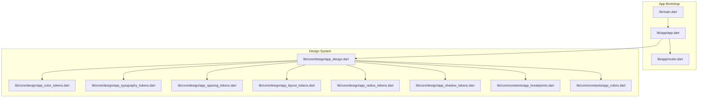

**Diagram sources**
- [main.dart](file://Luminous/lib/main.dart)
- [app.dart](file://Luminous/lib/app/app.dart)
- [router.dart](file://Luminous/lib/app/router.dart)
- [app_design.dart](file://Luminous/lib/core/design/app_design.dart)
- [app_color_tokens.dart](file://Luminous/lib/core/design/app_color_tokens.dart)
- [app_typography_tokens.dart](file://Luminous/lib/core/design/app_typography_tokens.dart)
- [app_spacing_tokens.dart](file://Luminous/lib/core/design/app_spacing_tokens.dart)
- [app_layout_tokens.dart](file://Luminous/lib/core/design/app_layout_tokens.dart)
- [app_radius_tokens.dart](file://Luminous/lib/core/design/app_radius_tokens.dart)
- [app_shadow_tokens.dart](file://Luminous/lib/core/design/app_shadow_tokens.dart)
- [app_breakpoints.dart](file://Luminous/lib/core/constants/app_breakpoints.dart)
- [app_colors.dart](file://Luminous/lib/core/constants/app_colors.dart)

**Section sources**
- [main.dart](file://Luminous/lib/main.dart)
- [app.dart](file://Luminous/lib/app/app.dart)
- [router.dart](file://Luminous/lib/app/router.dart)
- [app_design.dart](file://Luminous/lib/core/design/app_design.dart)

## Core Components
The design system is composed of atomic tokens and composite scales:
- Color tokens define semantic palettes and roles.
- Typography scale provides display/body/caption/button variants per device class.
- Spacing tokens standardize gaps and margins.
- Layout tokens define container widths and gutters.
- Radius and shadow tokens unify corner rounding and elevation.
- Breakpoints configure responsive thresholds.

Key token files:
- [app_color_tokens.dart](file://Luminous/lib/core/design/app_color_tokens.dart)
- [app_typography_tokens.dart](file://Luminous/lib/core/design/app_typography_tokens.dart)
- [app_spacing_tokens.dart](file://Luminous/lib/core/design/app_spacing_tokens.dart)
- [app_layout_tokens.dart](file://Luminous/lib/core/design/app_layout_tokens.dart)
- [app_radius_tokens.dart](file://Luminous/lib/core/design/app_radius_tokens.dart)
- [app_shadow_tokens.dart](file://Luminous/lib/core/design/app_shadow_tokens.dart)
- [app_breakpoints.dart](file://Luminous/lib/core/constants/app_breakpoints.dart)
- [app_colors.dart](file://Luminous/lib/core/constants/app_colors.dart)

These tokens are re-exported via [app_design.dart](file://Luminous/lib/core/design/app_design.dart) to simplify imports across the app.

**Section sources**
- [app_color_tokens.dart](file://Luminous/lib/core/design/app_color_tokens.dart)
- [app_typography_tokens.dart](file://Luminous/lib/core/design/app_typography_tokens.dart)
- [app_spacing_tokens.dart](file://Luminous/lib/core/design/app_spacing_tokens.dart)
- [app_layout_tokens.dart](file://Luminous/lib/core/design/app_layout_tokens.dart)
- [app_radius_tokens.dart](file://Luminous/lib/core/design/app_radius_tokens.dart)
- [app_shadow_tokens.dart](file://Luminous/lib/core/design/app_shadow_tokens.dart)
- [app_breakpoints.dart](file://Luminous/lib/core/constants/app_breakpoints.dart)
- [app_colors.dart](file://Luminous/lib/core/constants/app_colors.dart)
- [app_design.dart](file://Luminous/lib/core/design/app_design.dart)

## Architecture Overview
The UI architecture centers on a design-token-driven approach:
- Tokens are authored once and consumed everywhere.
- Typography and spacing scales are device-class aware.
- Routing and navigation are defined in the app module.
- Tests assert theme correctness and UI stability.

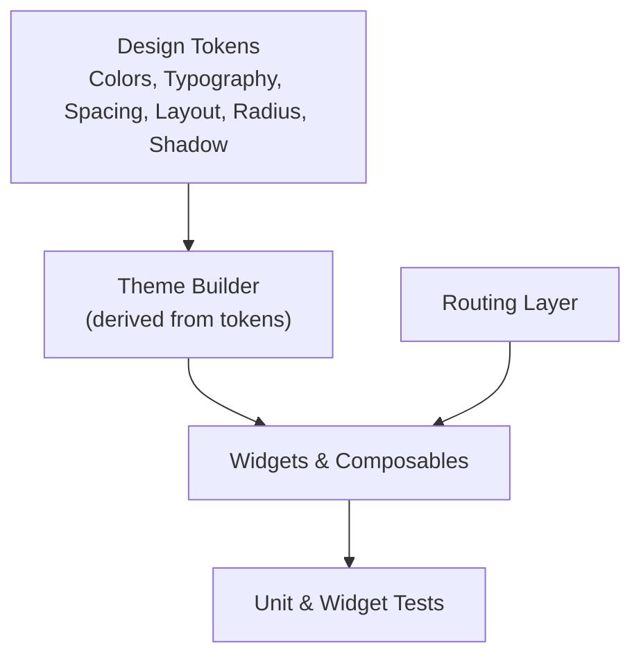

[No sources needed since this diagram shows conceptual architecture, not a direct code mapping]

## Detailed Component Analysis

### Typography Scale
The typography system defines a device-class-aware scale with display, body, caption, mono, and button styles. It exposes factory methods for mobile and desktop variants, each returning a typed scale object consumable by widgets.

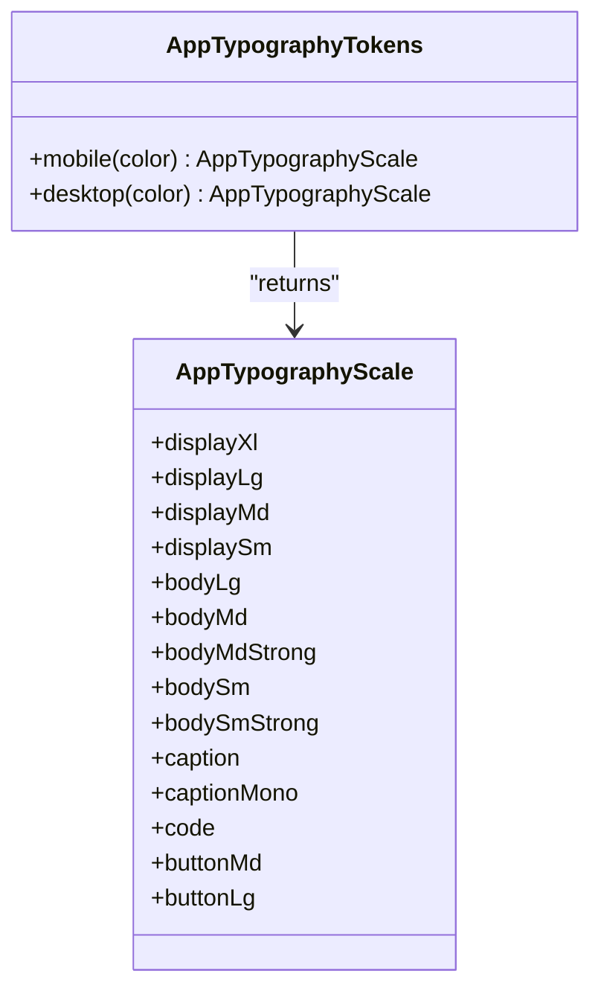

**Diagram sources**
- [app_typography_tokens.dart](file://Luminous/lib/core/design/app_typography_tokens.dart)

**Section sources**
- [app_typography_tokens.dart](file://Luminous/lib/core/design/app_typography_tokens.dart)

### Spacing Tokens
Spacing tokens provide a consistent scale for padding, margin, gap, and section spacing across components.

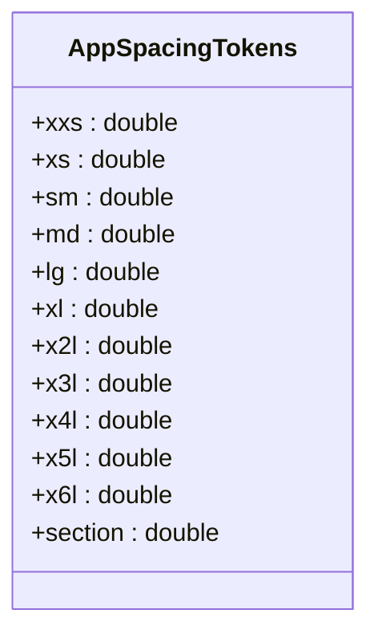

**Diagram sources**
- [app_spacing_tokens.dart](file://Luminous/lib/core/design/app_spacing_tokens.dart)

**Section sources**
- [app_spacing_tokens.dart](file://Luminous/lib/core/design/app_spacing_tokens.dart)

### Layout Tokens
Layout tokens define container widths and gutters to align content across breakpoints.

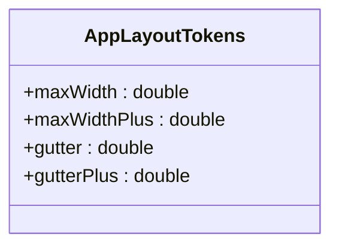

**Diagram sources**
- [app_layout_tokens.dart](file://Luminous/lib/core/design/app_layout_tokens.dart)

**Section sources**
- [app_layout_tokens.dart](file://Luminous/lib/core/design/app_layout_tokens.dart)

### Radius & Shadow Tokens
Radius and shadow tokens standardize corner radii and elevation effects.

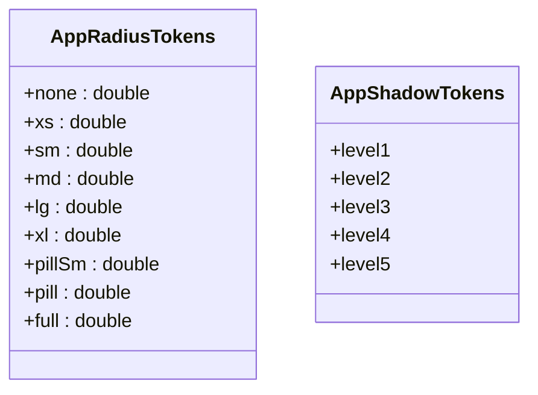

**Diagram sources**
- [app_radius_tokens.dart](file://Luminous/lib/core/design/app_radius_tokens.dart)
- [app_shadow_tokens.dart](file://Luminous/lib/core/design/app_shadow_tokens.dart)

**Section sources**
- [app_radius_tokens.dart](file://Luminous/lib/core/design/app_radius_tokens.dart)
- [app_shadow_tokens.dart](file://Luminous/lib/core/design/app_shadow_tokens.dart)

### Color Tokens
Color tokens define semantic roles and palettes. They are consumed by theme builders and widgets to ensure consistent color usage.

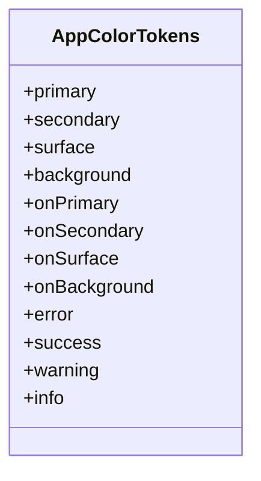

**Diagram sources**
- [app_color_tokens.dart](file://Luminous/lib/core/design/app_color_tokens.dart)

**Section sources**
- [app_color_tokens.dart](file://Luminous/lib/core/design/app_color_tokens.dart)

### Breakpoints
Breakpoints configure responsive thresholds for adaptive layouts.

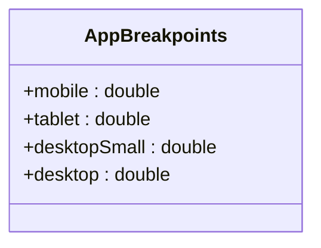

**Diagram sources**
- [app_breakpoints.dart](file://Luminous/lib/core/constants/app_breakpoints.dart)

**Section sources**
- [app_breakpoints.dart](file://Luminous/lib/core/constants/app_breakpoints.dart)

### Routing and Navigation
Routing orchestrates navigation and page transitions. It integrates with the design system by applying consistent spacing, typography, and color tokens across screens.

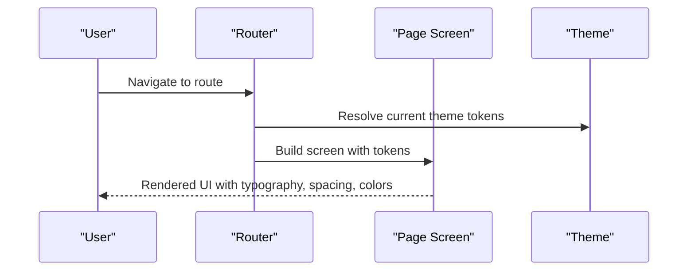

**Diagram sources**
- [router.dart](file://Luminous/lib/app/router.dart)
- [app_typography_tokens.dart](file://Luminous/lib/core/design/app_typography_tokens.dart)
- [app_spacing_tokens.dart](file://Luminous/lib/core/design/app_spacing_tokens.dart)
- [app_color_tokens.dart](file://Luminous/lib/core/design/app_color_tokens.dart)

**Section sources**
- [router.dart](file://Luminous/lib/app/router.dart)

## Dependency Analysis
Design tokens are the single source of truth for UI styling. Components depend on tokens rather than hardcoded values, reducing duplication and ensuring consistency.

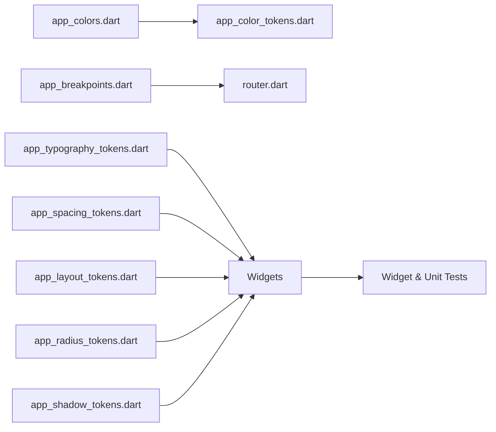

**Diagram sources**
- [app_colors.dart](file://Luminous/lib/core/constants/app_colors.dart)
- [app_color_tokens.dart](file://Luminous/lib/core/design/app_color_tokens.dart)
- [app_breakpoints.dart](file://Luminous/lib/core/constants/app_breakpoints.dart)
- [app_typography_tokens.dart](file://Luminous/lib/core/design/app_typography_tokens.dart)
- [app_spacing_tokens.dart](file://Luminous/lib/core/design/app_spacing_tokens.dart)
- [app_layout_tokens.dart](file://Luminous/lib/core/design/app_layout_tokens.dart)
- [app_radius_tokens.dart](file://Luminous/lib/core/design/app_radius_tokens.dart)
- [app_shadow_tokens.dart](file://Luminous/lib/core/design/app_shadow_tokens.dart)
- [router.dart](file://Luminous/lib/app/router.dart)
- [widget_test.dart](file://Luminous/test/widget_test.dart)

**Section sources**
- [app_colors.dart](file://Luminous/lib/core/constants/app_colors.dart)
- [app_color_tokens.dart](file://Luminous/lib/core/design/app_color_tokens.dart)
- [app_breakpoints.dart](file://Luminous/lib/core/constants/app_breakpoints.dart)
- [app_typography_tokens.dart](file://Luminous/lib/core/design/app_typography_tokens.dart)
- [app_spacing_tokens.dart](file://Luminous/lib/core/design/app_spacing_tokens.dart)
- [app_layout_tokens.dart](file://Luminous/lib/core/design/app_layout_tokens.dart)
- [app_radius_tokens.dart](file://Luminous/lib/core/design/app_radius_tokens.dart)
- [app_shadow_tokens.dart](file://Luminous/lib/core/design/app_shadow_tokens.dart)
- [router.dart](file://Luminous/lib/app/router.dart)
- [widget_test.dart](file://Luminous/test/widget_test.dart)

## Performance Considerations
- Prefer token-based styling over inline styles to minimize rebuilds.
- Use lazy loading for heavy pages and defer non-critical asset rendering.
- Keep animations subtle and hardware-accelerated where possible.
- Avoid deep widget trees in hot paths; leverage reusable composables.

[No sources needed since this section provides general guidance]

## Accessibility Features
- Ensure sufficient color contrast against backgrounds using semantic tokens.
- Provide focus indicators and keyboard navigation support.
- Use accessible typography scales and readable font weights.
- Support dynamic text sizing and high-contrast modes via theme tokens.

[No sources needed since this section provides general guidance]

## Responsive Design & Breakpoints
Responsive behavior is driven by breakpoint constants and device-class-aware typography. Pages adapt layout based on viewport width, while maintaining consistent spacing and typography scales.

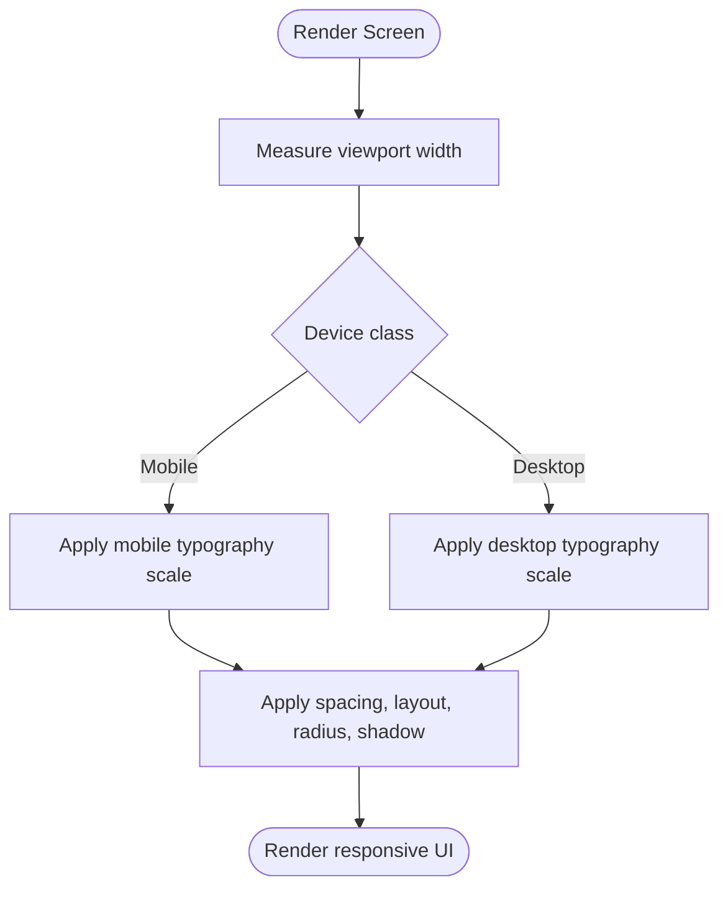

**Diagram sources**
- [app_breakpoints.dart](file://Luminous/lib/core/constants/app_breakpoints.dart)
- [app_typography_tokens.dart](file://Luminous/lib/core/design/app_typography_tokens.dart)
- [app_spacing_tokens.dart](file://Luminous/lib/core/design/app_spacing_tokens.dart)
- [app_layout_tokens.dart](file://Luminous/lib/core/design/app_layout_tokens.dart)
- [app_radius_tokens.dart](file://Luminous/lib/core/design/app_radius_tokens.dart)
- [app_shadow_tokens.dart](file://Luminous/lib/core/design/app_shadow_tokens.dart)

**Section sources**
- [app_breakpoints.dart](file://Luminous/lib/core/constants/app_breakpoints.dart)
- [app_typography_tokens.dart](file://Luminous/lib/core/design/app_typography_tokens.dart)
- [app_spacing_tokens.dart](file://Luminous/lib/core/design/app_spacing_tokens.dart)
- [app_layout_tokens.dart](file://Luminous/lib/core/design/app_layout_tokens.dart)
- [app_radius_tokens.dart](file://Luminous/lib/core/design/app_radius_tokens.dart)
- [app_shadow_tokens.dart](file://Luminous/lib/core/design/app_shadow_tokens.dart)

## Theming & Color System
The color system is built around semantic roles and palettes. Tokens are organized by intent (primary, secondary, surface, background, error, success, warning, info) and derive foreground colors for readability.

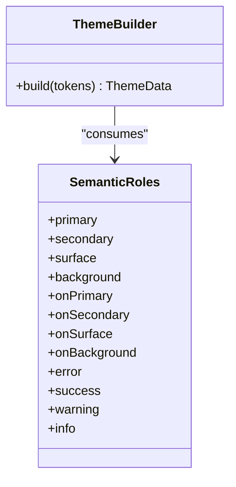

**Diagram sources**
- [app_color_tokens.dart](file://Luminous/lib/core/design/app_color_tokens.dart)

**Section sources**
- [app_color_tokens.dart](file://Luminous/lib/core/design/app_color_tokens.dart)

## Typography System
Typography scales are device-class aware and include display, body, caption, mono, and button styles. Each variant specifies font family, size, line height, weight, and letter-spacing.

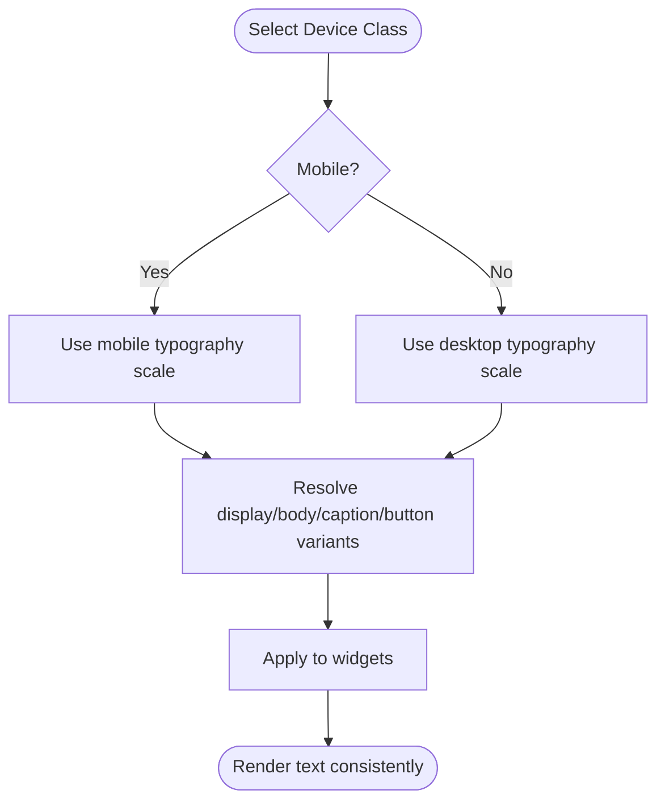

**Diagram sources**
- [app_typography_tokens.dart](file://Luminous/lib/core/design/app_typography_tokens.dart)

**Section sources**
- [app_typography_tokens.dart](file://Luminous/lib/core/design/app_typography_tokens.dart)

## Spacing & Layout Tokens
Spacing tokens standardize paddings, margins, and gaps. Layout tokens define max widths and gutters to keep content aligned across breakpoints.

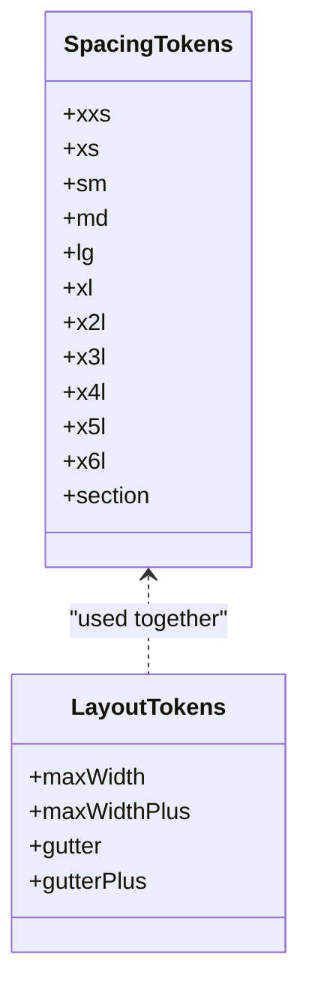

**Diagram sources**
- [app_spacing_tokens.dart](file://Luminous/lib/core/design/app_spacing_tokens.dart)
- [app_layout_tokens.dart](file://Luminous/lib/core/design/app_layout_tokens.dart)

**Section sources**
- [app_spacing_tokens.dart](file://Luminous/lib/core/design/app_spacing_tokens.dart)
- [app_layout_tokens.dart](file://Luminous/lib/core/design/app_layout_tokens.dart)

## Animation & Motion
- Use short-duration transitions for state changes.
- Apply easing curves that feel natural for UI interactions.
- Keep motion minimal and purposeful to avoid distraction.

[No sources needed since this section provides general guidance]

## Iconography
- Centralize icons under a dedicated assets location.
- Provide fallbacks and ensure icons remain visible with background color tokens.
- Maintain consistent stroke widths and alignment across sizes.

[No sources needed since this section provides general guidance]

## Component Composition Patterns
- Stateless widgets consume tokens and delegates for behavior.
- Stateful widgets encapsulate internal state and expose minimal props.
- Compose reusable building blocks (buttons, cards, inputs) from tokens.

[No sources needed since this section provides general guidance]

## State Management in UI
- Prefer local state within small widgets.
- Elevate shared state to providers or repositories when needed.
- Keep UI reactive and deterministic by deriving visuals from state and tokens.

[No sources needed since this section provides general guidance]

## Testing Strategy
- Widget tests validate UI rendering and theme application.
- Integration tests cover navigation and end-to-end flows.
- Snapshot tests can capture regressions in layout and typography.

Representative tests:
- [app_theme_controller_test.dart](file://Luminous/test/app_theme_controller_test.dart)
- [auth_widgets_test.dart](file://Luminous/test/auth_widgets_test.dart)
- [widget_test.dart](file://Luminous/test/widget_test.dart)
- [app_smoke_test.dart](file://Luminous/integration_test/app_smoke_test.dart)
- [auth_entry_e2e_test.dart](file://Luminous/integration_test/auth_entry_e2e_test.dart)
- [record_navigation_e2e_test.dart](file://Luminous/integration_test/record_navigation_e2e_test.dart)

**Section sources**
- [app_theme_controller_test.dart](file://Luminous/test/app_theme_controller_test.dart)
- [auth_widgets_test.dart](file://Luminous/test/auth_widgets_test.dart)
- [widget_test.dart](file://Luminous/test/widget_test.dart)
- [app_smoke_test.dart](file://Luminous/integration_test/app_smoke_test.dart)
- [auth_entry_e2e_test.dart](file://Luminous/integration_test/auth_entry_e2e_test.dart)
- [record_navigation_e2e_test.dart](file://Luminous/integration_test/record_navigation_e2e_test.dart)

## Maintenance & Evolution Guidelines
- Add new tokens to the appropriate file; avoid hardcoding values.
- When extending typography, provide both mobile and desktop variants.
- Keep tests aligned with token changes to prevent regressions.
- Document breaking changes to tokens and deprecation policies.

[No sources needed since this section provides general guidance]

## Cross-Platform Styling
- Use tokens uniformly across Android, iOS, Web, macOS, Windows, and Linux builds.
- Respect platform-specific affordances while preserving design system consistency.
- Test typography scaling and layout on various screen densities and sizes.

[No sources needed since this section provides general guidance]

## Conclusion
The Luminous design system is built on a robust set of tokens that drive typography, spacing, layout, color, radius, and shadows. By composing widgets from these tokens and validating behavior through tests, the UI remains consistent, accessible, and maintainable across platforms and devices.