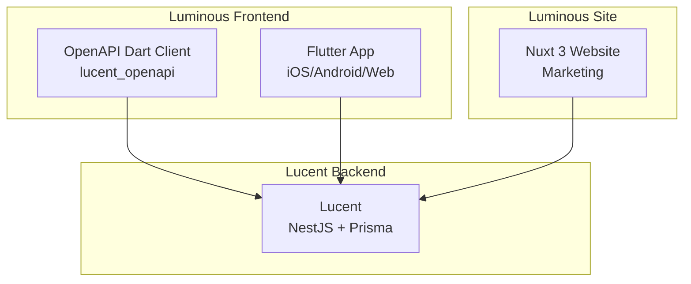
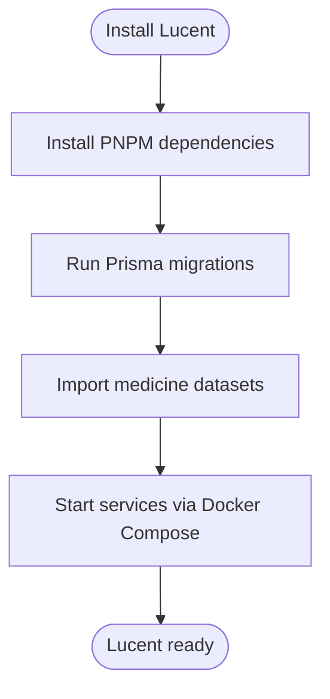
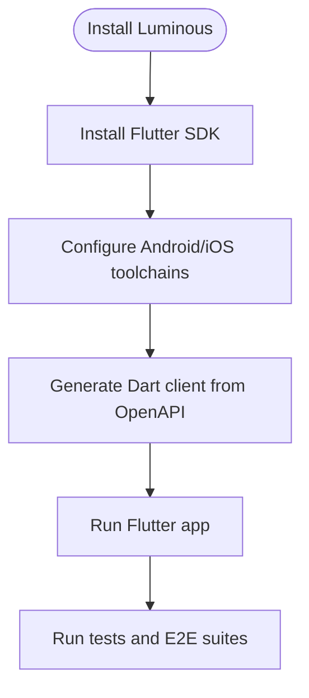
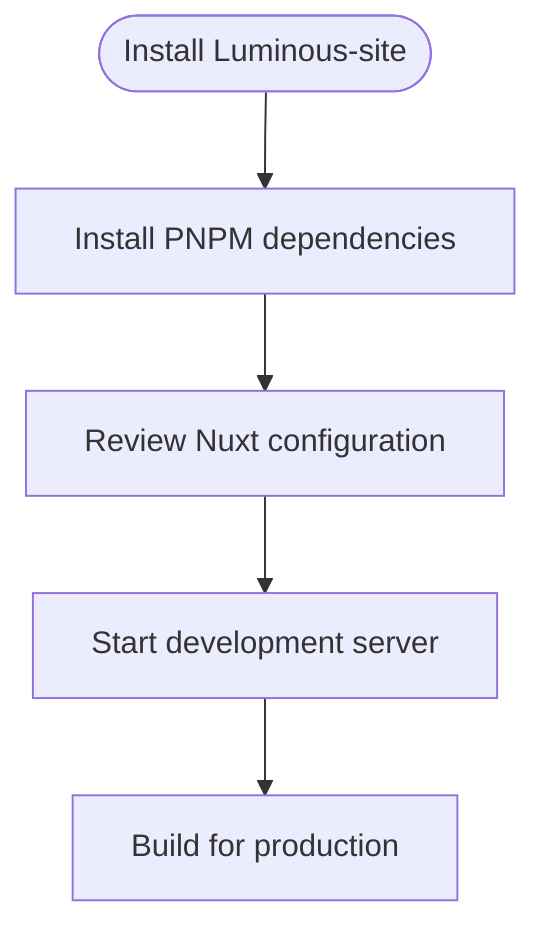
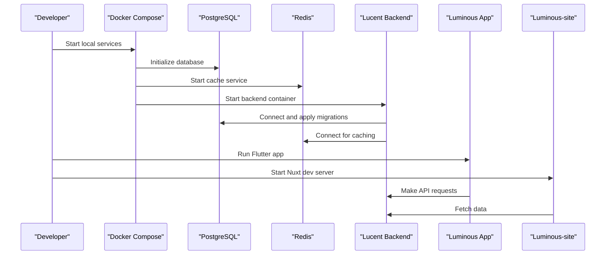

# Getting Started

<cite>
**Referenced Files in This Document**
- [Lucent README.md](file://Lucent/README.md)
- [Lucent docs README.md](file://Lucent/docs/README.md)
- [Lucent package.json](file://Lucent/package.json)
- [Lucent Dockerfile](file://Lucent/Dockerfile)
- [Lucent docker-compose.yml](file://Lucent/docker-compose.yml)
- [Lucent docker-compose.dev.yml](file://Lucent/docker-compose.dev.yml)
- [Lucent scripts/dev/up-local-stack.ps1](file://Lucent/scripts/dev/up-local-stack.ps1)
- [Lucent scripts/dev/down-local-stack.ps1](file://Lucent/scripts/dev/down-local-stack.ps1)
- [Lucent scripts/dev/migrate-local-databases.ps1](file://Lucent/scripts/dev/migrate-local-databases.ps1)
- [Lucent scripts/dev/import-medicine-datasets.ps1](file://Lucent/scripts/dev/import-medicine-datasets.ps1)
- [Lucent prisma/schema.prisma](file://Lucent/prisma/schema.prisma)
- [Lucent prisma/migrations](file://Lucent/prisma/migrations)
- [Lucent src/config/env-keys.enum.ts](file://Lucent/src/config/env-keys.enum.ts)
- [Lucent src/config/environment.validation.ts](file://Lucent/src/config/environment.validation.ts)
- [Lucent src/config/app.config.ts](file://Lucent/src/config/app.config.ts)
- [Lucent src/config/jwt.config.ts](file://Lucent/src/config/jwt.config.ts)
- [Lucent src/config/mail.config.ts](file://Lucent/src/config/mail.config.ts)
- [Lucent src/config/oauth.config.ts](file://Lucent/src/config/oauth.config.ts)
- [Lucent src/config/tencent-cos.config.ts](file://Lucent/src/config/tencent-cos.config.ts)
- [Lucent src/main.ts](file://Lucent/src/main.ts)
- [Luminous README.md](file://Luminous/README.md)
- [Luminous pubspec.yaml](file://Luminous/pubspec.yaml)
- [Luminous ios/Podfile](file://Luminous/ios/Podfile)
- [Luminous android/build.gradle.kts](file://Luminous/android/build.gradle.kts)
- [Luminous android/gradle.properties](file://Luminous/android/gradle.properties)
- [Luminous android/key.properties.example](file://Luminous/android/key.properties.example)
- [Luminous docs README.md](file://Luminous/docs/README.md)
- [Luminous packages/lucent_openapi/pubspec.yaml](file://Luminous/packages/lucent_openapi/pubspec.yaml)
- [Luminous packages/lucent_openapi/lib/lucent_openapi.dart](file://Luminous/packages/lucent_openapi/lib/lucent_openapi.dart)
- [Luminous tool/regenerate_lucent_openapi.dart](file://Luminous/tool/regenerate_lucent_openapi.dart)
- [Luminous-site README.md](file://Luminous-site/README.md)
- [Luminous-site package.json](file://Luminous-site/package.json)
- [Luminous-site nuxt.config.ts](file://Luminous-site/nuxt.config.ts)
- [Luminous-site tsconfig.json](file://Luminous-site/tsconfig.json)
- [.learnings ERRORS.md](file://.learnings/ERRORS.md)
- [DrugDataBase merge_chinese_drug_data.py](file://DrugDataBase/merge_chinese_drug_data.py)
</cite>

## Table of Contents
1. [Introduction](#introduction)
2. [Project Structure](#project-structure)
3. [System Requirements](#system-requirements)
4. [Prerequisites](#prerequisites)
5. [Environment Setup](#environment-setup)
6. [Installation Procedures](#installation-procedures)
7. [Running the Complete Stack Locally](#running-the-complete-stack-locally)
8. [Accessing Components](#accessing-components)
9. [Initial Configuration](#initial-configuration)
10. [Development Workflows](#development-workflows)
11. [Testing Procedures](#testing-procedures)
12. [Troubleshooting Guide](#troubleshooting-guide)
13. [First-Time User Onboarding](#first-time-user-onboarding)
14. [Conclusion](#conclusion)

## Introduction
This guide helps you set up and run the Lumos platform locally, covering all three components: Lucent (backend), Luminous (mobile/web frontend), and Luminous-site (marketing site). It includes system requirements, prerequisites, environment setup, installation steps for development and production, Docker configuration, local database setup, dependency management, and practical workflows for development and testing.

## Project Structure
The Lumos platform consists of three primary parts:
- Lucent: NestJS backend with Prisma ORM, authentication, environment monitoring, medicine records, reminders, and administrative features.
- Luminous: Flutter mobile/web application with localization, OAuth integrations, and OpenAPI client generation.
- Luminous-site: Nuxt 3 marketing website built with TypeScript and PNPM.

**Diagram sources**
- [Lucent src/main.ts](file://Lucent/src/main.ts)
- [Luminous packages/lucent_openapi/lib/lucent_openapi.dart](file://Luminous/packages/lucent_openapi/lib/lucent_openapi.dart)
- [Luminous-site nuxt.config.ts](file://Luminous-site/nuxt.config.ts)

**Section sources**
- [Lucent docs README.md](file://Lucent/docs/README.md)
- [Luminous docs README.md](file://Luminous/docs/README.md)
- [Luminous-site README.md](file://Luminous-site/README.md)

## System Requirements
- Operating Systems:
  - Windows, macOS, or Linux for desktop/mobile development.
- Hardware:
  - Minimum 8 GB RAM recommended for smooth development with Docker and Flutter.
- Software:
  - Git, Node.js LTS, PNPM, Dart SDK, Flutter SDK, Docker Desktop, Android Studio / Xcode (for mobile builds), PostgreSQL client tools.

**Section sources**
- [Lucent README.md](file://Lucent/README.md)
- [Luminous README.md](file://Luminous/README.md)
- [Luminous-site README.md](file://Luminous-site/README.md)

## Prerequisites
- Install and verify:
  - Git
  - Node.js LTS and PNPM
  - Dart SDK and Flutter SDK
  - Docker Desktop
  - Android Studio (with Android SDK and emulator) or Xcode (for iOS)
  - PostgreSQL client tools (psql) for local database operations
- Clone the repository and navigate to the root directory.

**Section sources**
- [Lucent README.md](file://Lucent/README.md)
- [Luminous README.md](file://Luminous/README.md)
- [Luminous-site README.md](file://Luminous-site/README.md)

## Environment Setup
Set up environment variables for each component using the provided configuration files and environment keys.

- Lucent environment keys:
  - Application ports, database URLs, JWT secrets, OAuth providers, mail transport, Tencent COS credentials, and feature flags.
- Validation:
  - Environment variables are validated during startup to prevent misconfiguration.

**Section sources**
- [Lucent src/config/env-keys.enum.ts](file://Lucent/src/config/env-keys.enum.ts)
- [Lucent src/config/environment.validation.ts](file://Lucent/src/config/environment.validation.ts)
- [Lucent src/config/app.config.ts](file://Lucent/src/config/app.config.ts)
- [Lucent src/config/jwt.config.ts](file://Lucent/src/config/jwt.config.ts)
- [Lucent src/config/mail.config.ts](file://Lucent/src/config/mail.config.ts)
- [Lucent src/config/oauth.config.ts](file://Lucent/src/config/oauth.config.ts)
- [Lucent src/config/tencent-cos.config.ts](file://Lucent/src/config/tencent-cos.config.ts)

## Installation Procedures

### Lucent Backend (NestJS + Prisma)
- Dependencies:
  - Install with PNPM.
- Local database:
  - Use Prisma migrations to create/update schema.
  - Seed initial datasets for medicine knowledge.
- Docker:
  - Use Docker Compose for local services (PostgreSQL, Redis, etc.) and containerized backend.

**Diagram sources**
- [Lucent package.json](file://Lucent/package.json)
- [Lucent prisma/schema.prisma](file://Lucent/prisma/schema.prisma)
- [Lucent prisma/migrations](file://Lucent/prisma/migrations)
- [Lucent scripts/dev/migrate-local-databases.ps1](file://Lucent/scripts/dev/migrate-local-databases.ps1)
- [Lucent scripts/dev/import-medicine-datasets.ps1](file://Lucent/scripts/dev/import-medicine-datasets.ps1)
- [Lucent docker-compose.yml](file://Lucent/docker-compose.yml)

Steps:
1. Install dependencies using PNPM.
2. Apply Prisma migrations to initialize the database schema.
3. Import medicine datasets to populate knowledge base.
4. Start local services with Docker Compose or run the backend directly.

**Section sources**
- [Lucent package.json](file://Lucent/package.json)
- [Lucent prisma/schema.prisma](file://Lucent/prisma/schema.prisma)
- [Lucent prisma/migrations](file://Lucent/prisma/migrations)
- [Lucent scripts/dev/migrate-local-databases.ps1](file://Lucent/scripts/dev/migrate-local-databases.ps1)
- [Lucent scripts/dev/import-medicine-datasets.ps1](file://Lucent/scripts/dev/import-medicine-datasets.ps1)
- [Lucent docker-compose.yml](file://Lucent/docker-compose.yml)

### Luminous Frontend (Flutter)
- Dependencies:
  - Install Flutter SDK and configure platform toolchains (Android/iOS).
- OpenAPI client:
  - The lucent_openapi package generates Dart clients from OpenAPI specs.
- Build and run:
  - Use Flutter CLI to run on device/emulator or web.

**Diagram sources**
- [Luminous pubspec.yaml](file://Luminous/pubspec.yaml)
- [Luminous packages/lucent_openapi/pubspec.yaml](file://Luminous/packages/lucent_openapi/pubspec.yaml)
- [Luminous tool/regenerate_lucent_openapi.dart](file://Luminous/tool/regenerate_lucent_openapi.dart)

Steps:
1. Install Flutter SDK and platform toolchains.
2. Generate the OpenAPI Dart client using the provided script.
3. Run the Flutter app on your target platform.

**Section sources**
- [Luminous pubspec.yaml](file://Luminous/pubspec.yaml)
- [Luminous packages/lucent_openapi/pubspec.yaml](file://Luminous/packages/lucent_openapi/pubspec.yaml)
- [Luminous tool/regenerate_lucent_openapi.dart](file://Luminous/tool/regenerate_lucent_openapi.dart)

### Luminous-site (Nuxt 3)
- Dependencies:
  - Install with PNPM.
- Configuration:
  - Nuxt configuration defines build targets and runtime settings.
- Build and run:
  - Start the development server or build for production.

**Diagram sources**
- [Luminous-site package.json](file://Luminous-site/package.json)
- [Luminous-site nuxt.config.ts](file://Luminous-site/nuxt.config.ts)
- [Luminous-site tsconfig.json](file://Luminous-site/tsconfig.json)

Steps:
1. Install dependencies using PNPM.
2. Review and adjust Nuxt configuration as needed.
3. Start the development server or build for production.

**Section sources**
- [Luminous-site package.json](file://Luminous-site/package.json)
- [Luminous-site nuxt.config.ts](file://Luminous-site/nuxt.config.ts)
- [Luminous-site tsconfig.json](file://Luminous-site/tsconfig.json)

## Running the Complete Stack Locally
Follow these steps to run all components together:

**Diagram sources**
- [Lucent docker-compose.yml](file://Lucent/docker-compose.yml)
- [Lucent docker-compose.dev.yml](file://Lucent/docker-compose.dev.yml)
- [Lucent scripts/dev/up-local-stack.ps1](file://Lucent/scripts/dev/up-local-stack.ps1)
- [Lucent scripts/dev/down-local-stack.ps1](file://Lucent/scripts/dev/down-local-stack.ps1)

Steps:
1. Start local services using the provided PowerShell scripts or Docker Compose.
2. Confirm backend migrations and seed jobs have completed.
3. Launch the Flutter app and Nuxt site.
4. Verify connectivity between components.

**Section sources**
- [Lucent scripts/dev/up-local-stack.ps1](file://Lucent/scripts/dev/up-local-stack.ps1)
- [Lucent scripts/dev/down-local-stack.ps1](file://Lucent/scripts/dev/down-local-stack.ps1)
- [Lucent docker-compose.yml](file://Lucent/docker-compose.yml)
- [Lucent docker-compose.dev.yml](file://Lucent/docker-compose.dev.yml)

## Accessing Components
- Lucent Backend:
  - API documentation and endpoints are exposed by the backend service.
  - Use the OpenAPI collection for interactive testing.
- Luminous App:
  - Run the Flutter app on device/emulator or web.
- Luminous-site:
  - Access the marketing site via the configured development server port.

**Section sources**
- [Lucent docs README.md](file://Lucent/docs/README.md)
- [Lucent lucent-bruno/opencollection.yml](file://Lucent/lucent-bruno/opencollection.yml)

## Initial Configuration
- Environment variables:
  - Define required keys for database connections, JWT, OAuth, mail, and cloud storage.
- Prisma schema:
  - Review and evolve the schema as needed; migrations are managed under the migrations directory.
- OpenAPI client:
  - Re-generate the Dart client when backend APIs change.

**Section sources**
- [Lucent src/config/env-keys.enum.ts](file://Lucent/src/config/env-keys.enum.ts)
- [Lucent prisma/schema.prisma](file://Lucent/prisma/schema.prisma)
- [Luminous tool/regenerate_lucent_openapi.dart](file://Luminous/tool/regenerate_lucent_openapi.dart)

## Development Workflows
Common tasks developers perform:

- Start local stack:
  - Use the provided PowerShell scripts to bring up services quickly.
- Apply migrations:
  - Run the migration script to keep the local database schema up to date.
- Seed data:
  - Import medicine datasets to populate the knowledge base.
- Generate OpenAPI client:
  - Re-run the OpenAPI generator to align the Dart client with backend changes.
- Build and test:
  - Use Flutter commands to run unit/integration tests and E2E suites.

**Section sources**
- [Lucent scripts/dev/up-local-stack.ps1](file://Lucent/scripts/dev/up-local-stack.ps1)
- [Lucent scripts/dev/migrate-local-databases.ps1](file://Lucent/scripts/dev/migrate-local-databases.ps1)
- [Lucent scripts/dev/import-medicine-datasets.ps1](file://Lucent/scripts/dev/import-medicine-datasets.ps1)
- [Luminous tool/regenerate_lucent_openapi.dart](file://Luminous/tool/regenerate_lucent_openapi.dart)

## Testing Procedures
- Backend:
  - End-to-end tests are organized per module (authentication, records, medicines, reminders, user health context).
- Flutter:
  - Comprehensive E2E tests cover navigation, forms, and key flows.
- OpenAPI:
  - Validate API changes by regenerating the client and ensuring compatibility.

**Section sources**
- [Lucent test/auth.e2e-spec.ts](file://Lucent/test/auth.e2e-spec.ts)
- [Lucent test/daily-records.e2e-spec.ts](file://Lucent/test/daily-records.e2e-spec.ts)
- [Lucent test/medicines.e2e-spec.ts](file://Lucent/test/medicines.e2e-spec.ts)
- [Lucent test/medicine-reminders.e2e-spec.ts](file://Lucent/test/medicine-reminders.e2e-spec.ts)
- [Lucent test/medicine-dose-logs.e2e-spec.ts](file://Lucent/test/medicine-dose-logs.e2e-spec.ts)
- [Lucent test/user-health-context.e2e-spec.ts](file://Lucent/test/user-health-context.e2e-spec.ts)
- [Luminous integration_test/app_smoke_test.dart](file://Luminous/integration_test/app_smoke_test.dart)
- [Luminous integration_test/auth_entry_e2e_test.dart](file://Luminous/integration_test/auth_entry_e2e_test.dart)
- [Luminous integration_test/record_mutation_e2e_test.dart](file://Luminous/integration_test/record_mutation_e2e_test.dart)

## Troubleshooting Guide
- Common setup issues and resolutions:
  - Port conflicts: Adjust service ports in Docker Compose or environment configuration.
  - Database connection failures: Verify database credentials and network connectivity.
  - Flutter build errors: Ensure platform toolchains are installed and up to date.
  - OpenAPI client mismatches: Re-generate the Dart client after backend changes.
  - Environment validation errors: Confirm all required environment variables are present and correctly formatted.

**Section sources**
- [.learnings ERRORS.md](file://.learnings/ERRORS.md)
- [Lucent src/config/environment.validation.ts](file://Lucent/src/config/environment.validation.ts)

## First-Time User Onboarding
- Set up your environment as described above.
- Start the local stack and confirm all services are healthy.
- Explore the backend API using the OpenAPI collection.
- Register and log in via the Luminous app.
- Navigate through key features: records, medicines, reminders, and health context.
- For contributors, review the project’s documentation and contribution guidelines.

**Section sources**
- [Lucent docs README.md](file://Lucent/docs/README.md)
- [Luminous docs README.md](file://Luminous/docs/README.md)

## Conclusion
You now have the essentials to install, configure, and run the Lumos platform locally. Use the provided scripts and configurations to streamline setup, leverage Docker for consistent environments, and follow the documented workflows for development and testing. Refer to the troubleshooting guide for frequent issues and consult the component-specific documentation for deeper customization.