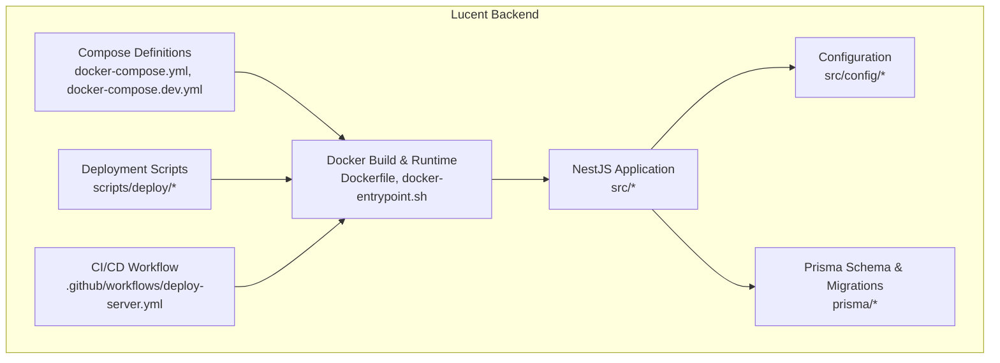
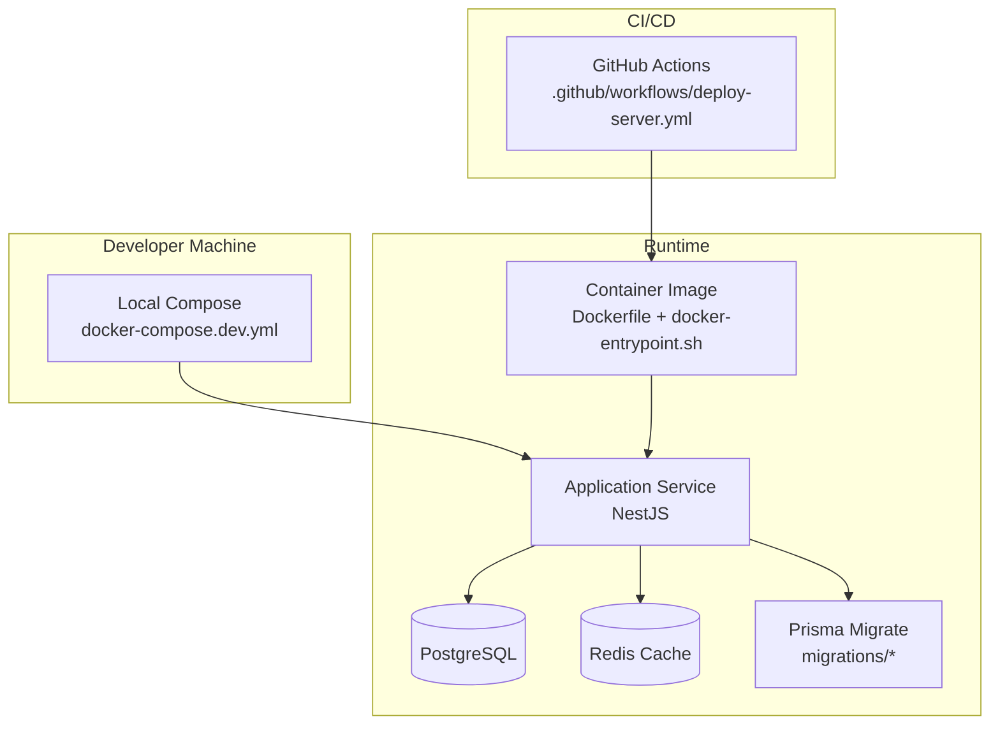
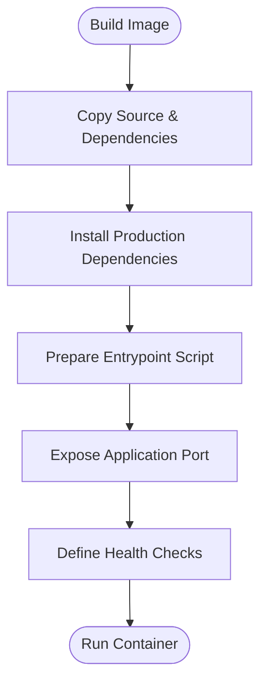
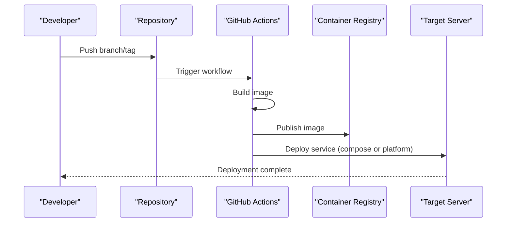
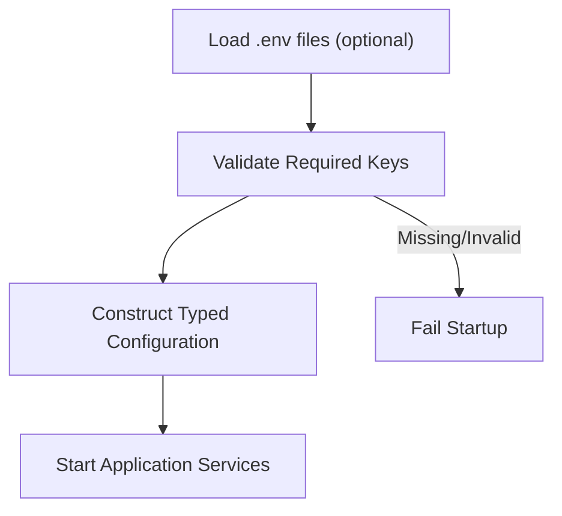
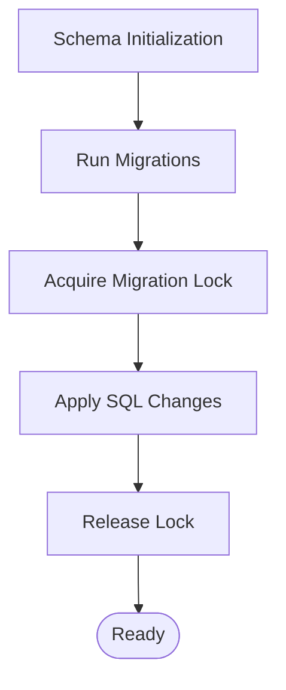
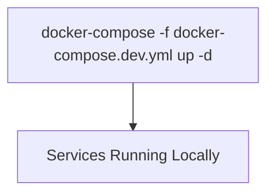
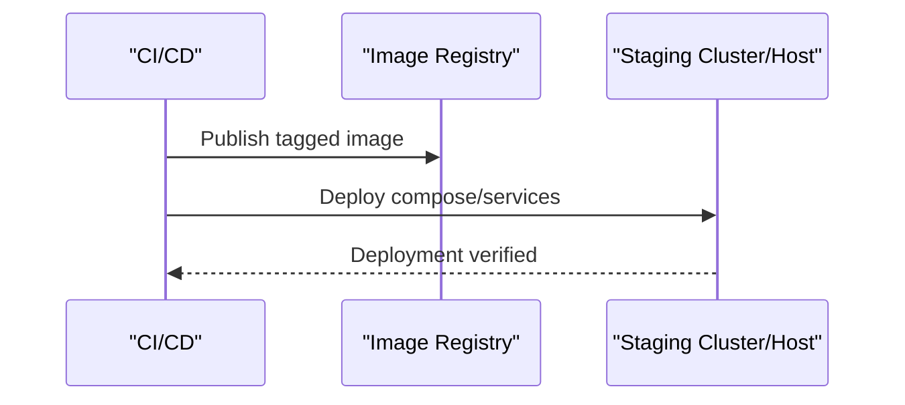
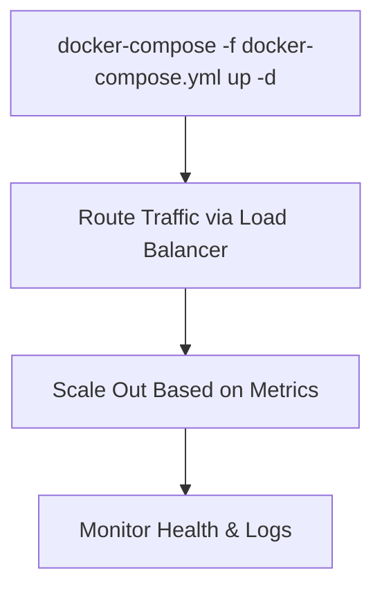
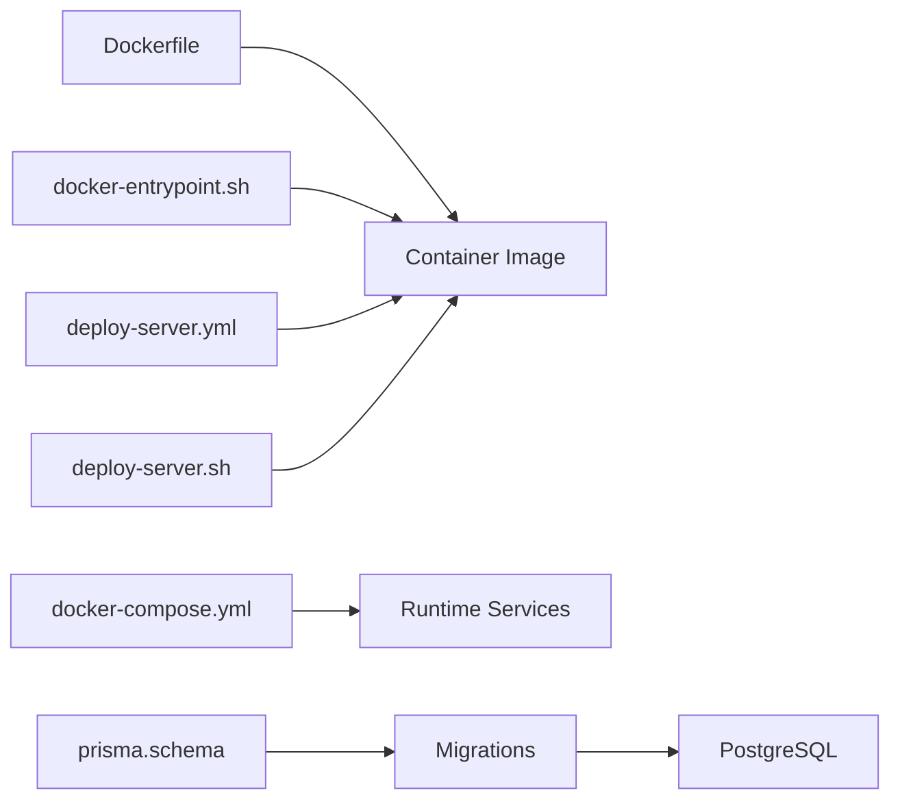

# Deployment Options

<cite>
**Referenced Files in This Document**
- [Dockerfile](file://Lucent/Dockerfile)
- [docker-entrypoint.sh](file://Lucent/docker-entrypoint.sh)
- [docker-compose.yml](file://Lucent/docker-compose.yml)
- [docker-compose.dev.yml](file://Lucent/docker-compose.dev.yml)
- [.dockerignore](file://Lucent/.dockerignore)
- [deploy-server.sh](file://Lucent/scripts/deploy/deploy-server.sh)
- [deploy-server.yml](file://Lucent/.github/workflows/deploy-server.yml)
- [tencent-cloud-cicd.md](file://Lucent/docs/tencent-cloud-cicd.md)
- [app.config.ts](file://Lucent/src/config/app.config.ts)
- [env-keys.enum.ts](file://Lucent/src/config/env-keys.enum.ts)
- [environment.validation.ts](file://Lucent/src/config/environment.validation.ts)
- [env-file-paths.ts](file://Lucent/src/config/env-file-paths.ts)
- [prisma.schema](file://Lucent/prisma/schema.prisma)
- [migration_lock.toml](file://Lucent/prisma/migrations/migration_lock.toml)
- [20260610093000_extend_medicine_reminders/migration.sql](file://Lucent/prisma/migrations/20260610093000_extend_medicine_reminders/migration.sql)
- [package.json](file://Lucent/package.json)
- [README.md](file://Lucent/README.md)
</cite>

## Table of Contents
1. [Introduction](#introduction)
2. [Project Structure](#project-structure)
3. [Core Components](#core-components)
4. [Architecture Overview](#architecture-overview)
5. [Detailed Component Analysis](#detailed-component-analysis)
6. [Dependency Analysis](#dependency-analysis)
7. [Performance Considerations](#performance-considerations)
8. [Troubleshooting Guide](#troubleshooting-guide)
9. [Conclusion](#conclusion)
10. [Appendices](#appendices)

## Introduction
This document describes deployment options for the backend service (Lucent) within the Lumos ecosystem. It covers containerized and cloud-native deployment approaches, infrastructure requirements, scaling considerations, environment-specific deployment steps, configuration management, secrets handling, backup strategies, monitoring, maintenance, and customization for various cloud providers and on-premises environments.

## Project Structure
The backend is a NestJS application packaged with Docker. Compose files define runtime services for development and production-like environments. CI/CD workflows automate server deployments. Prisma manages database migrations and schema.

**Diagram sources**
- [Dockerfile](file://Lucent/Dockerfile)
- [docker-compose.yml](file://Lucent/docker-compose.yml)
- [docker-compose.dev.yml](file://Lucent/docker-compose.dev.yml)
- [deploy-server.sh](file://Lucent/scripts/deploy/deploy-server.sh)
- [deploy-server.yml](file://Lucent/.github/workflows/deploy-server.yml)
- [prisma.schema](file://Lucent/prisma/schema.prisma)

**Section sources**
- [Dockerfile](file://Lucent/Dockerfile)
- [docker-compose.yml](file://Lucent/docker-compose.yml)
- [docker-compose.dev.yml](file://Lucent/docker-compose.dev.yml)
- [deploy-server.sh](file://Lucent/scripts/deploy/deploy-server.sh)
- [deploy-server.yml](file://Lucent/.github/workflows/deploy-server.yml)
- [prisma.schema](file://Lucent/prisma/schema.prisma)

## Core Components
- Container image: Built from the provided Dockerfile and entrypoint script.
- Orchestration: docker-compose defines services for application and supporting infrastructure.
- CI/CD: GitHub Actions workflow automates server deployment.
- Configuration: Strongly-typed environment keys, validation, and optional .env loading paths.
- Database: Prisma schema and migrations manage schema evolution.

Key deployment artifacts:
- [Dockerfile](file://Lucent/Dockerfile)
- [docker-entrypoint.sh](file://Lucent/docker-entrypoint.sh)
- [docker-compose.yml](file://Lucent/docker-compose.yml)
- [docker-compose.dev.yml](file://Lucent/docker-compose.dev.yml)
- [deploy-server.sh](file://Lucent/scripts/deploy/deploy-server.sh)
- [deploy-server.yml](file://Lucent/.github/workflows/deploy-server.yml)
- [app.config.ts](file://Lucent/src/config/app.config.ts)
- [env-keys.enum.ts](file://Lucent/src/config/env-keys.enum.ts)
- [environment.validation.ts](file://Lucent/src/config/environment.validation.ts)
- [env-file-paths.ts](file://Lucent/src/config/env-file-paths.ts)
- [prisma.schema](file://Lucent/prisma/schema.prisma)
- [migration_lock.toml](file://Lucent/prisma/migrations/migration_lock.toml)

**Section sources**
- [Dockerfile](file://Lucent/Dockerfile)
- [docker-entrypoint.sh](file://Lucent/docker-entrypoint.sh)
- [docker-compose.yml](file://Lucent/docker-compose.yml)
- [docker-compose.dev.yml](file://Lucent/docker-compose.dev.yml)
- [deploy-server.sh](file://Lucent/scripts/deploy/deploy-server.sh)
- [deploy-server.yml](file://Lucent/.github/workflows/deploy-server.yml)
- [app.config.ts](file://Lucent/src/config/app.config.ts)
- [env-keys.enum.ts](file://Lucent/src/config/env-keys.enum.ts)
- [environment.validation.ts](file://Lucent/src/config/environment.validation.ts)
- [env-file-paths.ts](file://Lucent/src/config/env-file-paths.ts)
- [prisma.schema](file://Lucent/prisma/schema.prisma)
- [migration_lock.toml](file://Lucent/prisma/migrations/migration_lock.toml)

## Architecture Overview
The deployment architecture supports:
- Containerized builds and runtime via Docker.
- Multi-environment orchestration using docker-compose.
- Automated deployments through GitHub Actions.
- Database lifecycle managed by Prisma migrations.

**Diagram sources**
- [docker-compose.dev.yml](file://Lucent/docker-compose.dev.yml)
- [deploy-server.yml](file://Lucent/.github/workflows/deploy-server.yml)
- [Dockerfile](file://Lucent/Dockerfile)
- [docker-entrypoint.sh](file://Lucent/docker-entrypoint.sh)
- [prisma.schema](file://Lucent/prisma/schema.prisma)

## Detailed Component Analysis

### Docker-Based Deployment
- Build context and base image are defined in the Dockerfile.
- The entrypoint script initializes the container (e.g., running migrations, seeding, or readiness checks).
- A .dockerignore excludes unnecessary files to reduce image size and build time.
- docker-compose.yml defines production-like services (application, database, cache).
- docker-compose.dev.yml defines a developer-friendly stack for local iteration.

**Diagram sources**
- [Dockerfile](file://Lucent/Dockerfile)
- [docker-entrypoint.sh](file://Lucent/docker-entrypoint.sh)
- [.dockerignore](file://Lucent/.dockerignore)

**Section sources**
- [Dockerfile](file://Lucent/Dockerfile)
- [docker-entrypoint.sh](file://Lucent/docker-entrypoint.sh)
- [.dockerignore](file://Lucent/.dockerignore)
- [docker-compose.yml](file://Lucent/docker-compose.yml)
- [docker-compose.dev.yml](file://Lucent/docker-compose.dev.yml)

### CI/CD and Automation
- The GitHub Actions workflow automates server deployment.
- The deployment script orchestrates image building, tagging, and pushing to a registry, followed by service rollout.

**Diagram sources**
- [deploy-server.yml](file://Lucent/.github/workflows/deploy-server.yml)
- [deploy-server.sh](file://Lucent/scripts/deploy/deploy-server.sh)

**Section sources**
- [deploy-server.yml](file://Lucent/.github/workflows/deploy-server.yml)
- [deploy-server.sh](file://Lucent/scripts/deploy/deploy-server.sh)

### Configuration Management and Secrets
- Environment keys are enumerated and validated to ensure required variables are present and correctly typed.
- Optional .env file paths are supported for loading configuration from files.
- The application reads configuration at startup and applies validation rules.

**Diagram sources**
- [env-keys.enum.ts](file://Lucent/src/config/env-keys.enum.ts)
- [environment.validation.ts](file://Lucent/src/config/environment.validation.ts)
- [env-file-paths.ts](file://Lucent/src/config/env-file-paths.ts)
- [app.config.ts](file://Lucent/src/config/app.config.ts)

**Section sources**
- [env-keys.enum.ts](file://Lucent/src/config/env-keys.enum.ts)
- [environment.validation.ts](file://Lucent/src/config/environment.validation.ts)
- [env-file-paths.ts](file://Lucent/src/config/env-file-paths.ts)
- [app.config.ts](file://Lucent/src/config/app.config.ts)

### Database Lifecycle with Prisma
- The Prisma schema defines the data model.
- Migrations evolve the schema over time; a lock file prevents concurrent migrations.
- Example migration demonstrates evolving the reminders domain.

**Diagram sources**
- [prisma.schema](file://Lucent/prisma/schema.prisma)
- [migration_lock.toml](file://Lucent/prisma/migrations/migration_lock.toml)
- [20260610093000_extend_medicine_reminders/migration.sql](file://Lucent/prisma/migrations/20260610093000_extend_medicine_reminders/migration.sql)

**Section sources**
- [prisma.schema](file://Lucent/prisma/schema.prisma)
- [migration_lock.toml](file://Lucent/prisma/migrations/migration_lock.toml)
- [20260610093000_extend_medicine_reminders/migration.sql](file://Lucent/prisma/migrations/20260610093000_extend_medicine_reminders/migration.sql)

### Environment-Specific Deployment Guides

#### Development
- Use the development compose file to run a local stack.
- Steps:
  1. Start services with docker-compose.
  2. Seed or import datasets if needed.
  3. Access the application locally.

**Diagram sources**
- [docker-compose.dev.yml](file://Lucent/docker-compose.dev.yml)

**Section sources**
- [docker-compose.dev.yml](file://Lucent/docker-compose.dev.yml)

#### Staging
- Build and push the image using the deployment script.
- Deploy to a staging environment using the production compose file or a staging override.
- Validate health checks and run smoke tests.

**Diagram sources**
- [deploy-server.sh](file://Lucent/scripts/deploy/deploy-server.sh)
- [deploy-server.yml](file://Lucent/.github/workflows/deploy-server.yml)
- [docker-compose.yml](file://Lucent/docker-compose.yml)

**Section sources**
- [deploy-server.sh](file://Lucent/scripts/deploy/deploy-server.sh)
- [deploy-server.yml](file://Lucent/.github/workflows/deploy-server.yml)
- [docker-compose.yml](file://Lucent/docker-compose.yml)

#### Production
- Use the production compose file to deploy the application with persistent volumes and external networking.
- Ensure secrets are injected via environment variables or secret managers.
- Configure load balancing, SSL termination, and autoscaling policies.

**Diagram sources**
- [docker-compose.yml](file://Lucent/docker-compose.yml)

**Section sources**
- [docker-compose.yml](file://Lucent/docker-compose.yml)

### Scaling Considerations
- Horizontal scaling: Run multiple replicas behind a load balancer.
- Stateless design: Keep application stateless; persist data in PostgreSQL and cache in Redis.
- Resource limits: Set CPU/memory requests/limits in compose or platform scheduler.
- Auto-scaling: Configure platform auto-scalers based on CPU, memory, or custom metrics.

[No sources needed since this section provides general guidance]

### Backup Strategies
- Database backups: Schedule regular logical or physical backups of PostgreSQL.
- Volume snapshots: For local deployments, snapshot persistent volumes regularly.
- Prisma migrations: Treat migrations as auditable schema changes; maintain safe rollback procedures.

[No sources needed since this section provides general guidance]

### Monitoring Setup
- Health checks: Enable and expose health endpoints for load balancers and orchestrators.
- Logging: Stream application logs to centralized logging systems.
- Metrics: Expose application metrics and integrate with monitoring platforms.
- Alerts: Configure alerts for error rates, latency, and resource saturation.

[No sources needed since this section provides general guidance]

### Maintenance Procedures
- Rolling updates: Use zero-downtime deployment strategies.
- Database maintenance: Run periodic VACUUM/ANALYZE and review long-running queries.
- Dependency hygiene: Regularly rebuild images and update base layers.

[No sources needed since this section provides general guidance]

### Customization for Cloud Providers and On-Premises
- Cloud providers:
  - AWS: Use ECS/Fargate or EKS with external secrets manager for credentials.
  - Azure: Use Container Instances/ACI or AKS with Key Vault.
  - GCP: Use Cloud Run or GKE with Secret Manager.
- On-premises:
  - Docker Swarm or Kubernetes clusters.
  - Internal registries and secret management solutions.

[No sources needed since this section provides general guidance]

## Dependency Analysis
The deployment pipeline depends on:
- Docker build artifacts and entrypoint initialization.
- Compose definitions for runtime services.
- CI/CD workflow for automation.
- Prisma migrations for schema evolution.

**Diagram sources**
- [Dockerfile](file://Lucent/Dockerfile)
- [docker-entrypoint.sh](file://Lucent/docker-entrypoint.sh)
- [docker-compose.yml](file://Lucent/docker-compose.yml)
- [deploy-server.yml](file://Lucent/.github/workflows/deploy-server.yml)
- [deploy-server.sh](file://Lucent/scripts/deploy/deploy-server.sh)
- [prisma.schema](file://Lucent/prisma/schema.prisma)

**Section sources**
- [Dockerfile](file://Lucent/Dockerfile)
- [docker-entrypoint.sh](file://Lucent/docker-entrypoint.sh)
- [docker-compose.yml](file://Lucent/docker-compose.yml)
- [deploy-server.yml](file://Lucent/.github/workflows/deploy-server.yml)
- [deploy-server.sh](file://Lucent/scripts/deploy/deploy-server.sh)
- [prisma.schema](file://Lucent/prisma/schema.prisma)

## Performance Considerations
- Optimize container image size and startup time.
- Tune database connection pooling and Redis caching.
- Use horizontal pod autoscaling or equivalent compute autoscaling.
- Monitor and adjust resource requests/limits based on observed usage.

[No sources needed since this section provides general guidance]

## Troubleshooting Guide
- Container fails to start:
  - Review entrypoint script and environment variable validation.
  - Check database connectivity and migration status.
- Health checks failing:
  - Inspect readiness/liveness probes and service logs.
- Database migration errors:
  - Verify migration lock file and run manual migration resolution if needed.

**Section sources**
- [docker-entrypoint.sh](file://Lucent/docker-entrypoint.sh)
- [environment.validation.ts](file://Lucent/src/config/environment.validation.ts)
- [migration_lock.toml](file://Lucent/prisma/migrations/migration_lock.toml)

## Conclusion
The backend supports robust containerized and cloud-native deployment with automated CI/CD, configurable environment management, and a clear database lifecycle. By following the environment-specific guides and applying the scaling, backup, monitoring, and maintenance recommendations, teams can reliably operate the service across development, staging, and production environments.

## Appendices

### Appendix A: Environment Variables Reference
- Enumerated keys and validation rules are defined in configuration modules.
- Optional .env file paths enable flexible configuration loading.

**Section sources**
- [env-keys.enum.ts](file://Lucent/src/config/env-keys.enum.ts)
- [environment.validation.ts](file://Lucent/src/config/environment.validation.ts)
- [env-file-paths.ts](file://Lucent/src/config/env-file-paths.ts)

### Appendix B: CI/CD Notes
- The workflow file and deployment script define the automated deployment process.
- The Tencent Cloud CI/CD guide provides provider-specific guidance.

**Section sources**
- [deploy-server.yml](file://Lucent/.github/workflows/deploy-server.yml)
- [deploy-server.sh](file://Lucent/scripts/deploy/deploy-server.sh)
- [tencent-cloud-cicd.md](file://Lucent/docs/tencent-cloud-cicd.md)