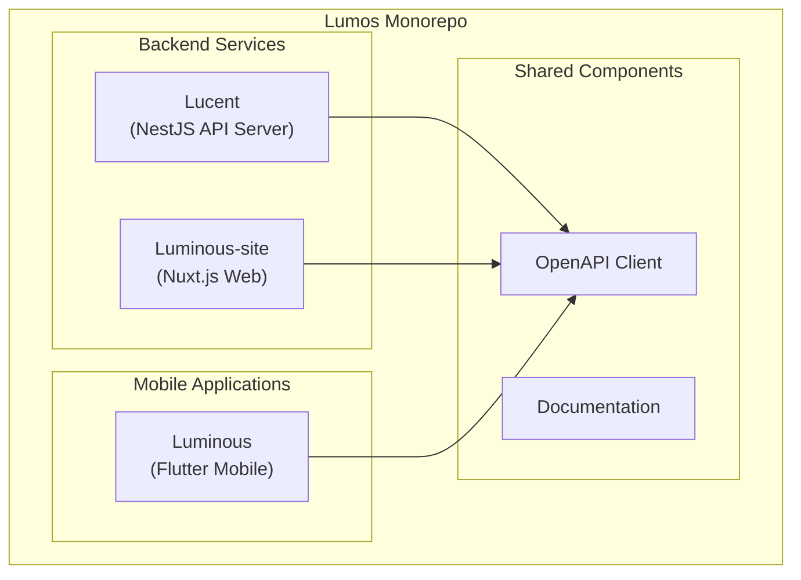
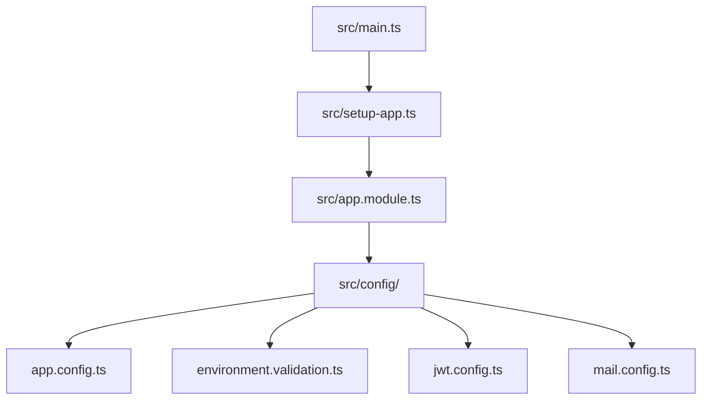
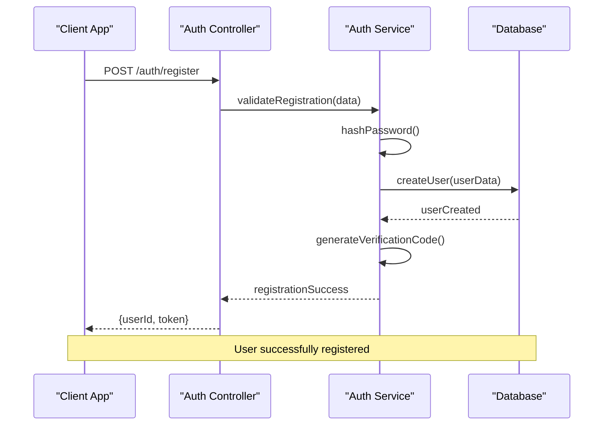
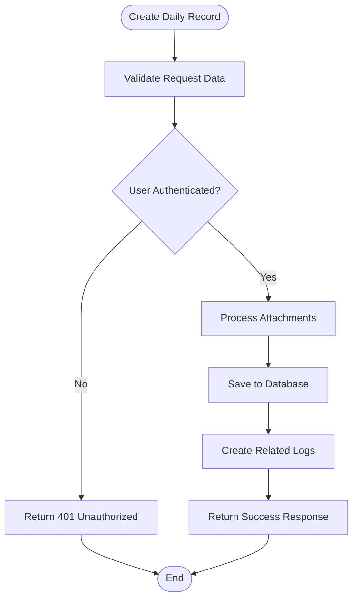
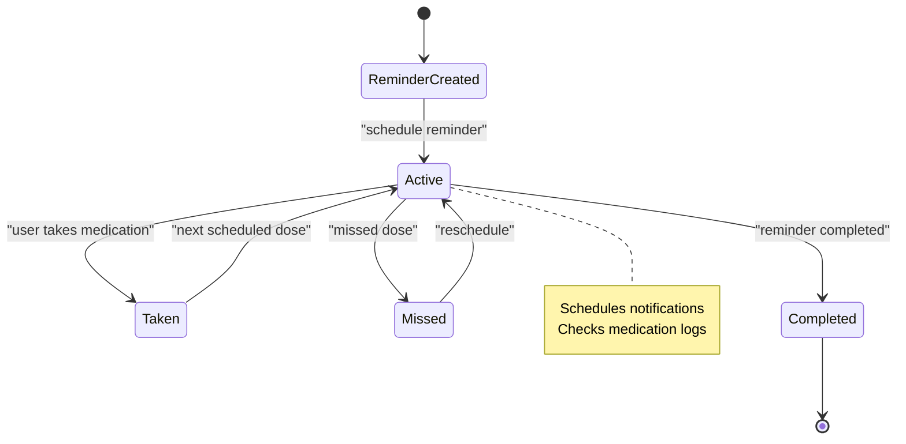

# Getting Started Guide

<cite>
**Referenced Files in This Document**
- [Lucent README.md](file://Lucent/README.md)
- [Lucent package.json](file://Lucent/package.json)
- [Lucent docker-compose.dev.yml](file://Lucent/docker-compose.dev.yml)
- [Lucent docker-compose.yml](file://Lucent/docker-compose.yml)
- [Lucent scripts/dev/up-local-stack.ps1](file://Lucent/scripts/dev/up-local-stack.ps1)
- [Lucent scripts/dev/down-local-stack.ps1](file://Lucent/scripts/dev/down-local-stack.ps1)
- [Lucent scripts/dev/migrate-local-databases.ps1](file://Lucent/scripts/dev/migrate-local-databases.ps1)
- [Lucent scripts/dev/import-medicine-datasets.ps1](file://Lucent/scripts/dev/import-medicine-datasets.ps1)
- [Lucent prisma/schema.prisma](file://Lucent/prisma/schema.prisma)
- [Lucent prisma/migrations](file://Lucent/prisma/migrations)
- [Lucent src/main.ts](file://Lucent/src/main.ts)
- [Lucent src/setup-app.ts](file://Lucent/src/setup-app.ts)
- [Lucent src/app.module.ts](file://Lucent/src/app.module.ts)
- [Lucent src/config/app.config.ts](file://Lucent/src/config/app.config.ts)
- [Lucent src/config/environment.validation.ts](file://Lucent/src/config/environment.validation.ts)
- [Lucent src/modules/auth/auth.controller.ts](file://Lucent/src/modules/auth/auth.controller.ts)
- [Lucent src/modules/daily-records/daily-records.controller.ts](file://Lucent/src/modules/daily-records/daily-records.controller.ts)
- [Lucent src/modules/medicine-reminders/medicine-reminders.controller.ts](file://Lucent/src/modules/medicine-reminders/medicine-reminders.controller.ts)
- [Lucent test/jest-e2e.json](file://Lucent/test/jest-e2e.json)
- [Lucent test/app.e2e-spec.ts](file://Lucent/test/app.e2e-spec.ts)
- [Lucent test/auth.e2e-spec.ts](file://Lucent/test/auth.e2e-spec.ts)
- [Lucent test/daily-records.e2e-spec.ts](file://Lucent/test/daily-records.e2e-spec.ts)
- [Lucent test/medicine-reminders.e2e-spec.ts](file://Lucent/test/medicine-reminders.e2e-spec.ts)
- [Lucent test/medicines.e2e-spec.ts](file://Lucent/test/medicines.e2e-spec.ts)
- [Lucent test/user-health-context.e2e-spec.ts](file://Lucent/test/user-health-context.e2e-spec.ts)
- [Lucent lucent-bruno/opencollection.yml](file://Lucent/lucent-bruno/opencollection.yml)
- [Lucent lucent-bruno/environments/dev.yml](file://Lucent/lucent-bruno/environments/dev.yml)
- [Lucent lucent-bruno/environments/prod.yml](file://Lucent/lucent-bruno/environments/prod.yml)
- [Lucent lucent-bruno/auth/注册.yml](file://Lucent/lucent-bruno/auth/注册.yml)
- [Lucent lucent-bruno/auth/登录.yml](file://Lucent/lucent-bruno/auth/登录.yml)
- [Lucent lucent-bruno/auth/查看当前用户.yml](file://Lucent/lucent-bruno/auth/查看当前用户.yml)
- [Lucent lucent-bruno/common/检查可达性.yml](file://Lucent/lucent-bruno/common/检查可达性.yml)
- [Luminous README.md](file://Luminous/README.md)
- [Luminous pubspec.yaml](file://Luminous/pubspec.yaml)
- [Luminous-site README.md](file://Luminous-site/README.md)
- [.learnings ERRORS.md](file://.learnings/ERRORS.md)
- [AGENTS.md](file://AGENTS.md)
- [PLANS.md](file://PLANS.md)
</cite>

## Table of Contents
1. [Introduction](#introduction)
2. [Project Structure](#project-structure)
3. [System Requirements](#system-requirements)
4. [Installation Steps](#installation-steps)
5. [Local Development Workflow](#local-development-workflow)
6. [Quick Start Examples](#quick-start-examples)
7. [Testing Guide](#testing-guide)
8. [Common Development Tasks](#common-development-tasks)
9. [Troubleshooting Guide](#troubleshooting-guide)
10. [Additional Resources](#additional-resources)
11. [Conclusion](#conclusion)

## Introduction
Welcome to Lumos! Lumos is a comprehensive health and wellness platform consisting of three main components:
- **Lucent**: A NestJS backend service providing APIs for user management, health records, medications, and environmental data
- **Luminous**: A Flutter mobile application for iOS and Android devices
- **Luminous-site**: A Nuxt.js frontend website for web browsers

This getting started guide will walk you through setting up your development environment, configuring dependencies, and running all components locally for development.

## Project Structure
The Lumos project follows a monorepo structure with three main applications:



**Diagram sources**
- [Lucent README.md](file://Lucent/README.md)
- [Luminous README.md](file://Luminous/README.md)
- [Luminous-site README.md](file://Luminous-site/README.md)

**Section sources**
- [Lucent README.md](file://Lucent/README.md)
- [Luminous README.md](file://Luminous/README.md)
- [Luminous-site README.md](file://Luminous-site/README.md)

## System Requirements
Before setting up your Lumos development environment, ensure your system meets these requirements:

### Hardware Requirements
- **Minimum**: 8GB RAM, 50GB available disk space
- **Recommended**: 16GB+ RAM, SSD storage preferred

### Software Requirements
- **Node.js**: Version 18.x or later
- **pnpm**: Latest stable version (recommended over npm)
- **Docker**: Docker Engine 20.10+ with Docker Compose
- **Flutter SDK**: Latest stable channel for mobile development
- **Android Studio**: For Android emulator and development
- **Xcode**: For iOS simulator (macOS only)
- **PostgreSQL**: Local database (or use Docker container)
- **Git**: Version control system

### Development Tools
- **IDE**: VS Code recommended with extensions
- **Browser**: Chrome/Firefox for testing
- **Database GUI**: pgAdmin or similar for PostgreSQL management

**Section sources**
- [Lucent package.json](file://Lucent/package.json)
- [Luminous pubspec.yaml](file://Luminous/pubspec.yaml)

## Installation Steps

### Step 1: Clone the Repository
```bash
git clone https://github.com/your-repository/lumos.git
cd lumos
```

### Step 2: Install Backend Dependencies
Navigate to the Lucent backend directory and install dependencies:

```bash
cd Lucent
pnpm install
```

### Step 3: Set Up Environment Variables
Create a `.env.local` file in the Lucent directory based on the existing `.env.example`:

```bash
cp .env.example .env.local
```

Configure the following key environment variables:
- `DATABASE_URL`: PostgreSQL connection string
- `JWT_SECRET`: Secret key for JWT tokens
- `MAILER_*`: Email service configuration
- `OAUTH_*`: OAuth provider credentials
- `COS_*`: Cloud storage configuration

### Step 4: Database Setup
Initialize the database schema using Prisma migrations:

```bash
pnpm prisma migrate dev
```

### Step 5: Install Mobile Dependencies
Navigate to the Luminous mobile app and install dependencies:

```bash
cd ../Luminous
pnpm install
```

### Step 6: Install Website Dependencies
Install dependencies for the Luminous-site web application:

```bash
cd ../Luminous-site
pnpm install
```

**Section sources**
- [Lucent package.json](file://Lucent/package.json)
- [Lucent prisma/schema.prisma](file://Lucent/prisma/schema.prisma)
- [Lucent prisma/migrations](file://Lucent/prisma/migrations)
- [Luminous pubspec.yaml](file://Luminous/pubspec.yaml)
- [Luminous-site README.md](file://Luminous-site/README.md)

## Local Development Workflow

### Starting All Components Locally

#### Method 1: Using Docker Compose (Recommended)
The project provides Docker Compose configurations for easy local development:

```bash
# Start all services in detached mode
docker-compose -f Lucent/docker-compose.dev.yml up -d

# Stop all services
docker-compose -f Lucent/docker-compose.dev.yml down
```

#### Method 2: Using PowerShell Scripts
The project includes PowerShell scripts for managing the local development stack:

```bash
# Start the local development stack
Lucent/scripts/dev/up-local-stack.ps1

# Stop the local development stack
Lucent/scripts/dev/down-local-stack.ps1

# Run database migrations
Lucent/scripts/dev/migrate-local-databases.ps1

# Import medicine datasets
Lucent/scripts/dev/import-medicine-datasets.ps1
```

#### Method 3: Manual Component Startup
Start each component individually:

**Backend Service (Lucent)**:
```bash
cd Lucent
pnpm run start:dev
```

**Mobile Application (Luminous)**:
```bash
cd Luminous
flutter run
```

**Web Application (Luminous-site)**:
```bash
cd Luminous-site
pnpm run dev
```

### Development Environment Configuration

#### Backend Configuration
The backend uses a modular architecture with the following key configuration files:



**Diagram sources**
- [Lucent src/main.ts](file://Lucent/src/main.ts)
- [Lucent src/setup-app.ts](file://Lucent/src/setup-app.ts)
- [Lucent src/app.module.ts](file://Lucent/src/app.module.ts)
- [Lucent src/config/app.config.ts](file://Lucent/src/config/app.config.ts)
- [Lucent src/config/environment.validation.ts](file://Lucent/src/config/environment.validation.ts)

**Section sources**
- [Lucent docker-compose.dev.yml](file://Lucent/docker-compose.dev.yml)
- [Lucent scripts/dev/up-local-stack.ps1](file://Lucent/scripts/dev/up-local-stack.ps1)
- [Lucent src/main.ts](file://Lucent/src/main.ts)
- [Lucent src/setup-app.ts](file://Lucent/src/setup-app.ts)
- [Lucent src/app.module.ts](file://Lucent/src/app.module.ts)

## Quick Start Examples

### Example 1: User Registration Flow

#### Using Bruno Collection
The project includes a Bruno collection for API testing:



**Diagram sources**
- [Lucent src/modules/auth/auth.controller.ts](file://Lucent/src/modules/auth/auth.controller.ts)
- [Lucent lucent-bruno/auth/注册.yml](file://Lucent/lucent-bruno/auth/注册.yml)

#### Registration Steps:
1. Open `Lucent/lucent-bruno/opencollection.yml`
2. Navigate to `auth/注册.yml`
3. Configure the request with user data
4. Send the request to `/auth/register`

**Section sources**
- [Lucent lucent-bruno/auth/注册.yml](file://Lucent/lucent-bruno/auth/注册.yml)
- [Lucent src/modules/auth/auth.controller.ts](file://Lucent/src/modules/auth/auth.controller.ts)

### Example 2: Creating Health Records

#### Daily Record Creation Flow


**Diagram sources**
- [Lucent src/modules/daily-records/daily-records.controller.ts](file://Lucent/src/modules/daily-records/daily-records.controller.ts)

#### Steps to Create a Health Record:
1. Use `daily-records/创建.yml` from the Bruno collection
2. Prepare record data with attachments
3. Send request to `/daily-records`
4. Verify response contains record ID

**Section sources**
- [Lucent lucent-bruno/daily-records/创建.yml](file://Lucent/lucent-bruno/daily-records/创建.yml)
- [Lucent src/modules/daily-records/daily-records.controller.ts](file://Lucent/src/modules/daily-records/daily-records.controller.ts)

### Example 3: Setting Up Medication Reminders

#### Reminder Configuration Flow


**Diagram sources**
- [Lucent src/modules/medicine-reminders/medicine-reminders.controller.ts](file://Lucent/src/modules/medicine-reminders/medicine-reminders.controller.ts)

#### Steps to Set Up Reminders:
1. Use `medicine-reminders/创建.yml` from Bruno collection
2. Specify medication details and schedule
3. Configure notification preferences
4. Verify reminder status is "Active"

**Section sources**
- [Lucent lucent-bruno/medicine-reminders/创建.yml](file://Lucent/lucent-bruno/medicine-reminders/创建.yml)
- [Lucent src/modules/medicine-reminders/medicine-reminders.controller.ts](file://Lucent/src/modules/medicine-reminders/medicine-reminders.controller.ts)

## Testing Guide

### Running Tests

#### Backend API Tests
The backend uses Jest for testing with comprehensive coverage:

```bash
# Run all tests
cd Lucent
pnpm run test

# Run specific test suite
pnpm run test auth

# Run tests in watch mode
pnpm run test --watch

# Run end-to-end tests
pnpm run test:e2e
```

#### Test Coverage
Available test suites include:
- Authentication tests (`test/auth.e2e-spec.ts`)
- Daily records tests (`test/daily-records.e2e-spec.ts`)
- Medicine reminders tests (`test/medicine-reminders.e2e-spec.ts`)
- Medicines tests (`test/medicines.e2e-spec.ts`)
- User health context tests (`test/user-health-context.e2e-spec.ts`)

#### Mobile App Tests
```bash
cd Luminous
flutter test
```

#### Website Tests
```bash
cd Luminous-site
pnpm run test
```

### Test Configuration
The test configuration includes:
- **Jest E2E Config**: `Lucent/test/jest-e2e.json`
- **Test Environments**: Separate configs for development and production
- **Mock Data**: Comprehensive test fixtures for all modules

**Section sources**
- [Lucent test/jest-e2e.json](file://Lucent/test/jest-e2e.json)
- [Lucent test/app.e2e-spec.ts](file://Lucent/test/app.e2e-spec.ts)
- [Lucent test/auth.e2e-spec.ts](file://Lucent/test/auth.e2e-spec.ts)
- [Lucent test/daily-records.e2e-spec.ts](file://Lucent/test/daily-records.e2e-spec.ts)
- [Lucent test/medicine-reminders.e2e-spec.ts](file://Lucent/test/medicine-reminders.e2e-spec.ts)
- [Lucent test/medicines.e2e-spec.ts](file://Lucent/test/medicines.e2e-spec.ts)
- [Lucent test/user-health-context.e2e-spec.ts](file://Lucent/test/user-health-context.e2e-spec.ts)

## Common Development Tasks

### Database Management
```bash
# View current migration status
pnpm prisma migrate status

# Create a new migration
pnpm prisma migrate dev --name init

# Apply migrations to development database
pnpm prisma migrate dev

# Generate Prisma client
pnpm prisma generate
```

### API Documentation
The project generates OpenAPI documentation automatically:

```bash
# Export OpenAPI specification
cd Lucent
pnpm run export-openapi
```

### Code Generation
```bash
# Generate TypeScript client from OpenAPI spec
cd Luminous/packages/lucent_openapi
pnpm run generate
```

### Environment Management
Switch between development and production environments:

```bash
# Development environment
export NODE_ENV=development

# Production environment  
export NODE_ENV=production

# Test environment
export NODE_ENV=test
```

**Section sources**
- [Lucent prisma/schema.prisma](file://Lucent/prisma/schema.prisma)
- [Lucent scripts/export-openapi.js](file://Lucent/scripts/export-openapi.js)
- [Lucent scripts/dev/migrate-local-databases.ps1](file://Lucent/scripts/dev/migrate-local-databases.ps1)

## Troubleshooting Guide

### Common Setup Issues

#### Database Connection Problems
**Issue**: Cannot connect to PostgreSQL database
**Solution**:
1. Verify Docker is running: `docker ps`
2. Check database container status: `docker-compose ps`
3. Verify connection string in `.env.local`
4. Ensure port 5432 is not blocked

#### Port Conflicts
**Issue**: Ports already in use (3000, 5000, 8080)
**Solution**:
```bash
# Find processes using ports
lsof -i :3000
kill -9 $(lsof -t -i :3000)

# Or change port configuration in environment files
```

#### Dependency Installation Issues
**Issue**: pnpm install fails with peer dependencies
**Solution**:
```bash
# Clear cache and reinstall
pnpm store prune
pnpm install --frozen-lockfile=false

# Or use npm as fallback
npm install
```

#### Flutter Build Issues
**Issue**: Flutter doctor shows missing dependencies
**Solution**:
```bash
# Run Flutter doctor
flutter doctor

# Install missing dependencies based on doctor output
flutter doctor --android-licenses
```

### Development Environment Issues

#### Hot Reload Not Working
**Issue**: Changes not reflecting in running application
**Solution**:
1. Check file permissions
2. Verify IDE auto-save settings
3. Restart development server
4. Clear application cache

#### API Response Issues
**Issue**: Backend returns 500 errors
**Solution**:
1. Check server logs: `pnpm run start:dev`
2. Verify environment variables
3. Check database connectivity
4. Review recent code changes

### Performance Issues

#### Slow Application Startup
**Issue**: Long startup times during development
**Solution**:
1. Disable unnecessary plugins in IDE
2. Close unused applications
3. Increase system RAM if possible
4. Use SSD storage for project files

#### Memory Leaks
**Issue**: Application consumes excessive memory
**Solution**:
1. Monitor memory usage with DevTools
2. Check for unclosed database connections
3. Verify proper cleanup of event listeners
4. Review async operation handling

**Section sources**
- [.learnings ERRORS.md](file://.learnings/ERRORS.md)

## Additional Resources

### Documentation Resources
- **Project Vision**: [Product Vision](file://Luminous/docs/Product_Vision.md)
- **Development Plans**: [Next Plan](file://Luminous/docs/Next_Plan.md)
- **Migration Log**: [Migration Log](file://Luminous/docs/MigrationLog.md)
- **Localization**: [Localization Guide](file://Luminous/docs/Localization.md)

### Contributing Guidelines
- **Contribution Standards**: [CONTRIBUTING.md](file://Luminous/CONTRIBUTING.md)
- **Development Agents**: [AGENTS.md](file://AGENTS.md)
- **Project Plans**: [PLANS.md](file://PLANS.md)

### Learning Materials
- **Project Learnings**: [LEARNINGS.md](file://.learnings/LEARNINGS.md)
- **Feature Requests**: [FEATURE_REQUESTS.md](file://.learnings/FEATURE_REQUESTS.md)

### API Reference
- **OpenAPI Specification**: Available in `Lucent/docs/openapi.json`
- **API Documentation**: Generated automatically during build process
- **Postman Collection**: Available in `Lucent/lucent-bruno/`

### Community Resources
- **Issue Tracking**: GitHub Issues for bug reports and feature requests
- **Discussion Forums**: Community support channels
- **Code Review Guidelines**: Pull request templates and review processes

**Section sources**
- [Luminous docs/Product_Vision.md](file://Luminous/docs/Product_Vision.md)
- [Luminous docs/Next_Plan.md](file://Luminous/docs/Next_Plan.md)
- [Luminous docs/MigrationLog.md](file://Luminous/docs/MigrationLog.md)
- [Luminous docs/Localization.md](file://Luminous/docs/Localization.md)
- [Luminous/CONTRIBUTING.md](file://Luminous/CONTRIBUTING.md)
- [AGENTS.md](file://AGENTS.md)
- [PLANS.md](file://PLANS.md)
- [.learnings LEARNINGS.md](file://.learnings/LEARNINGS.md)
- [.learnings FEATURE_REQUESTS.md](file://.learnings/FEATURE_REQUESTS.md)

## Conclusion

You're now ready to contribute to the Lumos project! Here's what you've accomplished:

✅ **Environment Setup**: Successfully installed all dependencies and configured development environments
✅ **Component Understanding**: Familiarized yourself with the three-component architecture
✅ **Workflow Mastery**: Learned how to start, test, and develop all parts of the application
✅ **Practical Examples**: Completed real-world scenarios for user registration, health records, and medication reminders
✅ **Troubleshooting Skills**: Prepared to handle common development issues

### Next Steps
1. Explore the codebase structure in detail
2. Start with small contributions like documentation improvements
3. Participate in code reviews and discussions
4. Gradually take on more complex features
5. Share your learning experiences with the community

### Need Help?
- Check the troubleshooting section for solutions
- Review the learning materials in the `.learnings` directory
- Engage with the community through the contribution guidelines
- Consult the extensive documentation resources

Happy coding with Lumos!