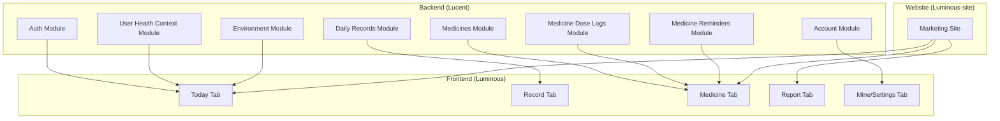
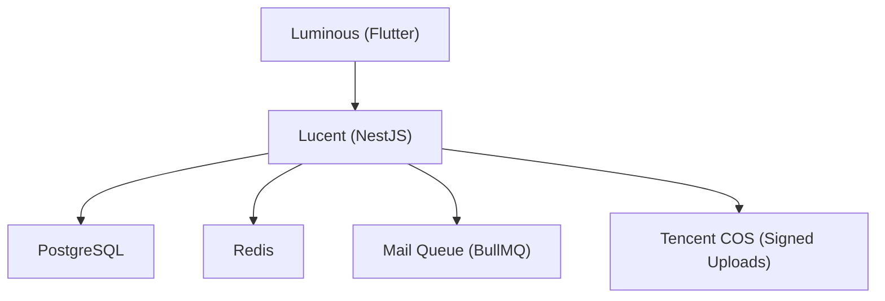
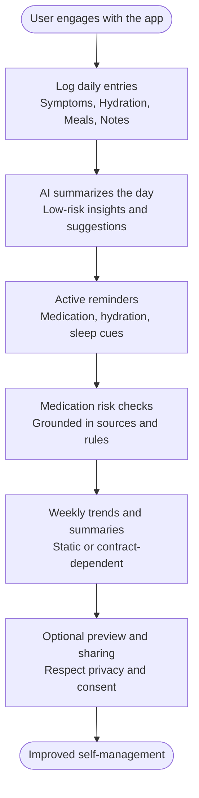
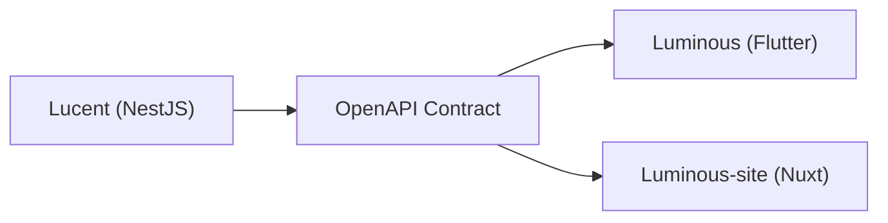

# Introduction and Purpose

<cite>
**Referenced Files in This Document**
- [README.md](file://Lucent/README.md)
- [README.md](file://Luminous/README.md)
- [README.md](file://Luminous-site/README.md)
- [AGENTS.md](file://AGENTS.md)
- [Product_Vision.md](file://Luminous/docs/Product_Vision.md)
- [Current_State.md](file://Luminous/docs/Current_State.md)
- [docs/README.md](file://Lucent/docs/README.md)
- [docs/environment.md](file://Lucent/docs/environment.md)
- [docs/public/data-sources.md](file://Lucent/docs/public/data-sources.md)
- [docs/openapi.json](file://Lucent/docs/openapi.json)
</cite>

## Table of Contents
1. [Introduction](#introduction)
2. [Project Structure](#project-structure)
3. [Core Components](#core-components)
4. [Architecture Overview](#architecture-overview)
5. [Detailed Component Analysis](#detailed-component-analysis)
6. [Dependency Analysis](#dependency-analysis)
7. [Performance Considerations](#performance-considerations)
8. [Troubleshooting Guide](#troubleshooting-guide)
9. [Conclusion](#conclusion)

## Introduction
Lumos is a personalized healthcare management platform designed to help users track daily health metrics, manage medications, and maintain comprehensive health records. At its core, Lumos connects everyday health behaviors—such as symptoms, hydration, diet, sleep, and medication—into a coherent, actionable record. Through structured summarization, contextual reminders, and evidence-grounded risk explanations, Lumos aims to reduce guesswork in self-care, improve medication adherence, and support informed conversations with healthcare providers.

### The Core Problem Lumos Solves
- Medication adherence challenges: Many people miss doses, take medications late, or are unsure about interactions and contraindications. Lumos addresses this by offering scheduled reminders, confirmable dosing logs, and risk checks grounded in trusted sources.
- Fragmented health data: People often keep health information scattered across apps, notes, or memories. Lumos centralizes daily records and ties them together to reveal meaningful patterns and trends.
- Need for integrated health monitoring: Users want a single place to understand their day-to-day health, receive low-risk suggestions, and access curated resources—without crossing clinical boundaries.

### Target Audience
- Patients: Students and young adults who want a reliable, low-friction way to track daily health and manage medications safely.
- Caregivers: Individuals supporting others in managing medications and daily routines.
- Healthcare professionals: While not the primary focus, Lumos can complement care by providing concise, structured summaries of recent patient behaviors and adherence patterns.

### Mission and Value Proposition
Lumos’ mission is to improve health outcomes through better data management and medication compliance. By enabling users to consistently log behaviors, receive timely reminders, and gain understandable insights, Lumos reduces the likelihood of avoidable mistakes and supports proactive self-management.

### Competitive Advantages
- Evidence-grounded safety: Medication risk assessments rely on established sources and rules, not unverified AI predictions.
- Active, not passive: Lumos proactively identifies noteworthy patterns and prompts users with actionable suggestions rather than waiting for searches.
- Clear safety boundaries: Outputs are labeled, explain their sources, and emphasize that they do not replace professional medical advice.
- Integrated record lifecycle: From logging to summarization, reminders, and optional reporting, Lumos maintains a cohesive loop.

## Project Structure
Lumos consists of three primary components:
- Backend (Lucent): A NestJS service providing authentication, user health context, medicine search and detail, daily records, medication reminders, and environment snapshots.
- Mobile Client (Luminous): A Flutter application implementing the five-tab product surface and consuming the backend via a generated OpenAPI client.
- Website (Luminous-site): A marketing site built with Nuxt 4 to showcase the product and its core scenarios.

**Diagram sources**
- [README.md:68-69](file://Lucent/README.md#L68-L69)
- [README.md:9-13](file://Luminous/README.md#L9-L13)
- [README.md:3-7](file://Luminous-site/README.md#L3-L7)

**Section sources**
- [README.md:66-74](file://Lucent/README.md#L66-L74)
- [README.md:1-60](file://Luminous/README.md#L1-L60)
- [README.md:1-82](file://Luminous-site/README.md#L1-L82)

## Core Components
- Authentication and Accounts: Secure sign-up, login, and identity management with OAuth integrations and session controls.
- User Health Context: Captures and manages health-related attributes and preferences that inform reminders and summaries.
- Medicines: Provides search and detail endpoints for medicines from curated sources, with source-specific responses and safety previews.
- Medicine Reminders: Manages scheduled reminders, confirmation flows, and delivery logs.
- Medicine Dose Logs: Tracks taken/skipped doses and logs events for reporting and analysis.
- Daily Records: Enables creation and viewing of daily entries (symptoms, hydration, meals, notes, and placeholders for sleep/medication) with optional image attachments.
- Environment: Supplies contextual environmental data snapshots used for insights and reminders.

**Section sources**
- [docs/README.md:1-36](file://Lucent/docs/README.md#L1-L36)
- [docs/environment.md:1-151](file://Lucent/docs/environment.md#L1-L151)
- [docs/public/data-sources.md:1-334](file://Lucent/docs/public/data-sources.md#L1-L334)
- [docs/openapi.json:1-200](file://Lucent/docs/openapi.json#L1-L200)

## Architecture Overview
Lumos follows a clear separation of concerns:
- Backend (Lucent) exposes a versioned REST API with a standardized response envelope and OpenAPI contract.
- Frontend (Luminous) consumes the API via a generated client and renders a mobile-first interface with five core tabs.
- Website (Luminous-site) presents product positioning and scenarios to stakeholders and early users.

**Diagram sources**
- [docs/environment.md:36-52](file://Lucent/docs/environment.md#L36-L52)
- [docs/environment.md:116-146](file://Lucent/docs/environment.md#L116-L146)

**Section sources**
- [docs/environment.md:1-151](file://Lucent/docs/environment.md#L1-L151)

## Detailed Component Analysis

### Product Vision and Positioning
Lumos positions itself as an “active campus health assistant.” It focuses on connecting daily records with actionable insights and reminders, anchored by medication safety. The platform emphasizes:
- Understanding what happened today through structured summarization.
- Explaining findings in plain language with sources and caveats.
- Delivering timely, low-risk suggestions and reminders.

Target users are university students who frequently encounter common health issues and want practical, safe guidance without replacing professional care.

**Section sources**
- [Product_Vision.md:5-27](file://Luminous/docs/Product_Vision.md#L5-L27)
- [Product_Vision.md:29-38](file://Luminous/docs/Product_Vision.md#L29-L38)

### Current Implementation Surface
The active mobile UI is organized into five tabs:
- Today: Compressed health overview, priority lists, tasks, and immediate suggestions.
- Record: Quick logging of symptoms, hydration, meals, notes, and timeline/detail views.
- Medicine: Personal medicine box, reminders, risk checks, and safety previews.
- Report: Static mock summaries and trend placeholders (subject to contract stability).
- Mine/Settings: Profile, allergies, sharing controls, notifications, and campus resources.

**Section sources**
- [Current_State.md:39-46](file://Luminous/docs/Current_State.md#L39-L46)

### Backend Capabilities and Contracts
- API Contract: The authoritative contract is generated from backend controllers and DTOs and published as OpenAPI.
- Modules: Implemented backend areas used by the client include auth/account, health context, medicine search/detail, current medicines, dose logs, medicine reminders, daily records with single-image attachment metadata, and environment snapshots.
- Environment: Local development stack, database URIs, Redis, CORS, and optional integrations (WeChat OAuth, Tencent COS, mail, AI provider) are documented.

**Section sources**
- [docs/README.md:1-36](file://Lucent/docs/README.md#L1-L36)
- [docs/environment.md:1-151](file://Lucent/docs/environment.md#L1-L151)
- [docs/openapi.json:1-200](file://Lucent/docs/openapi.json#L1-L200)

### Medicine Data Strategy
Lumos integrates medicines from two distinct sources:
- English (DrugBank): Scientific drug entities, identifiers, mechanisms, and interactions.
- Chinese (local product dataset): Market medicines and package insert fields.

The backend queries sources explicitly via a source parameter and returns a common response shape with source-specific detail payloads. This separation ensures fidelity to each dataset’s native fields and licenses.

**Section sources**
- [docs/public/data-sources.md:1-334](file://Lucent/docs/public/data-sources.md#L1-L334)

### Conceptual Overview
The platform’s workflow revolves around a closed loop: record → summarize → remind → report. This loop is designed to be practical, transparent, and bounded by safety.

[No sources needed since this diagram shows conceptual workflow, not actual code structure]

## Dependency Analysis
Lumos relies on a clear set of dependencies:
- Backend runtime: NestJS, Prisma with PostgreSQL, Redis/BullMQ, Passport JWT, WeChat OAuth, OpenAPI-generated client/docs.
- Frontend runtime: Flutter with Riverpod and GoRouter, consuming a generated OpenAPI client.
- Website runtime: Nuxt 4 with Vue 3 and related ecosystem.

Contract integrity is enforced by generating the OpenAPI specification from backend code and regenerating the Flutter client accordingly.

**Diagram sources**
- [AGENTS.md:18-29](file://AGENTS.md#L18-L29)

**Section sources**
- [AGENTS.md:1-72](file://AGENTS.md#L1-L72)

## Performance Considerations
- Caching: Medicine search and detail caches are tuned with TTLs to balance freshness and performance.
- Asynchronous jobs: Mail delivery leverages BullMQ when Redis is available; otherwise, immediate send is used.
- Image uploads: Daily-record images are presigned for direct upload to Tencent COS, reducing backend bandwidth.
- Client-side caching: The frontend may keep small offline snapshots to improve responsiveness.

**Section sources**
- [docs/environment.md:116-146](file://Lucent/docs/environment.md#L116-L146)

## Troubleshooting Guide
- Contract drift: If the backend changes, regenerate the OpenAPI and update the Flutter client to prevent runtime mismatches.
- Environment variables: Ensure required variables are configured for local development and production, especially for OAuth, mail, AI providers, and COS.
- Database and cache: Confirm connectivity to PostgreSQL and Redis; verify migration status and cache store behavior.
- CI/CD boundaries: Follow the documented deployment procedures and environment setup for Tencent Cloud.

**Section sources**
- [docs/README.md:20-36](file://Lucent/docs/README.md#L20-L36)
- [docs/environment.md:73-151](file://Lucent/docs/environment.md#L73-L151)

## Conclusion
Lumos is a focused, safety-bound platform that empowers users to manage daily health behaviors and medications effectively. By anchoring insights in structured records, trusted medicine sources, and active reminders, it supports better outcomes without crossing clinical boundaries. Its modular backend, mobile-first frontend, and clear contract-driven development position Lumos to evolve iteratively while maintaining reliability and user trust.