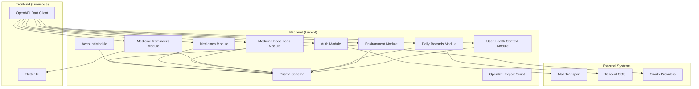
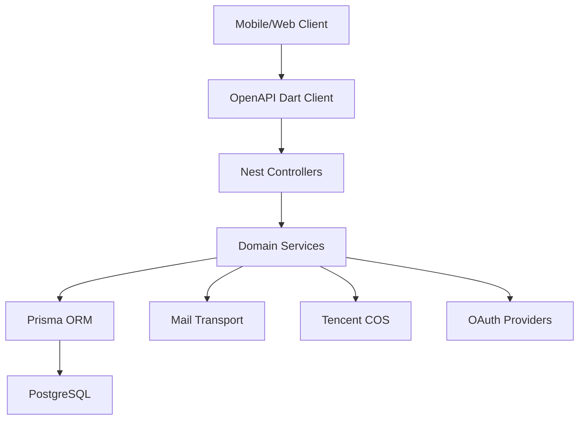
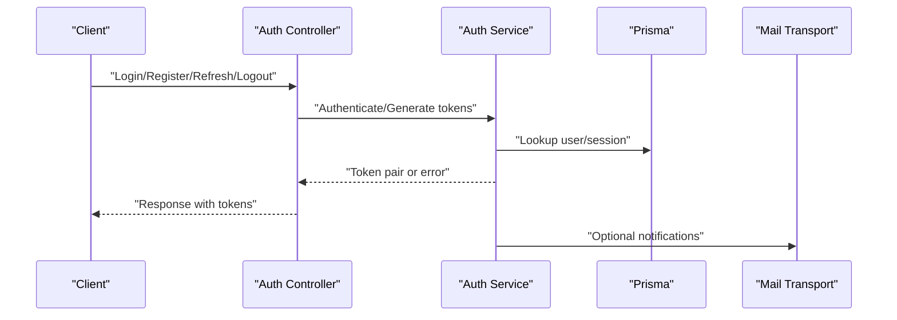
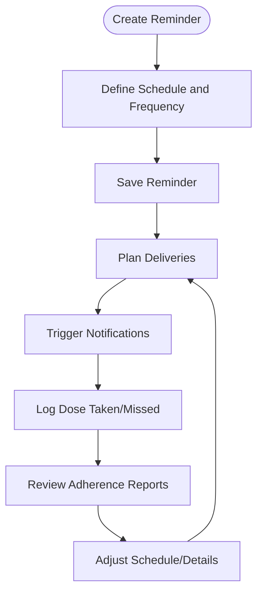
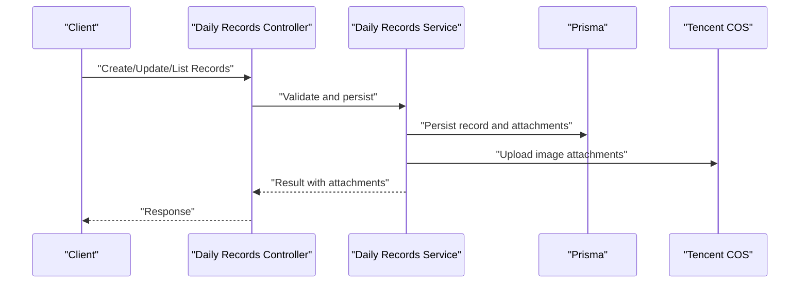
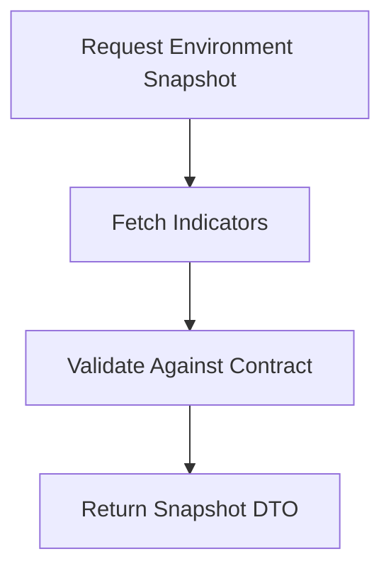
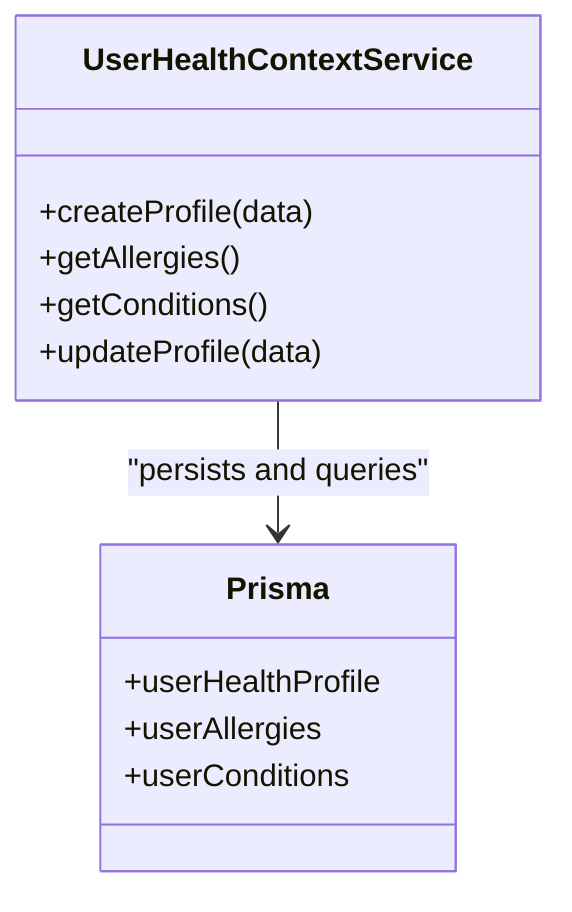
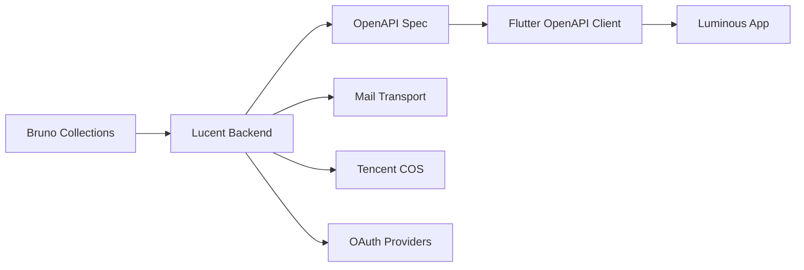

# Key Features and Capabilities

<cite>
**Referenced Files in This Document**
- [Lucent README.md](file://Lucent/README.md)
- [Luminous README.md](file://Luminous/README.md)
- [Lucent docs README.md](file://Lucent/docs/README.md)
- [Lucent docs environment.md](file://Lucent/docs/environment.md)
- [Lucent docs public environment-contract.md](file://Lucent/docs/public/environment-contract.md)
- [Lucent docs public reminder-contract.md](file://Lucent/docs/public/reminder-contract.md)
- [Lucent docs public data-sources.md](file://Lucent/docs/public/data-sources.md)
- [Lucent prisma/schema.prisma](file://Lucent/prisma/schema.prisma)
- [Lucent src/modules/auth/auth.service.ts](file://Lucent/src/modules/auth/auth.service.ts)
- [Lucent src/modules/account/account.service.ts](file://Lucent/src/modules/account/account.service.ts)
- [Lucent src/modules/daily-records/daily-records.service.ts](file://Lucent/src/modules/daily-records/daily-records.service.ts)
- [Lucent src/modules/environment/environment.service.ts](file://Lucent/src/modules/environment/environment.service.ts)
- [Lucent src/modules/medicine-reminders/medicine-reminders.service.ts](file://Lucent/src/modules/medicine-reminders/medicine-reminders.service.ts)
- [Lucent src/modules/medicines/medicines.service.ts](file://Lucent/src/modules/medicines/medicines.service.ts)
- [Lucent src/modules/user-health-context/user-health-context.service.ts](file://Lucent/src/modules/user-health-context/user-health-context.service.ts)
- [Luminous/packages/lucent_openapi/lib/src/api/auth_api.dart](file://Luminous/packages/lucent_openapi/lib/src/api/auth_api.dart)
- [Luminous/packages/lucent_openapi/lib/src/api/daily_records_api.dart](file://Luminous/packages/lucent_openapi/lib/src/api/daily_records_api.dart)
- [Luminous/packages/lucent_openapi/lib/src/api/medicine_dose_logs_api.dart](file://Luminous/packages/lucent_openapi/lib/src/api/medicine_dose_logs_api.dart)
- [Luminous/packages/lucent_openapi/lib/src/api/medicine_reminders_api.dart](file://Luminous/packages/lucent_openapi/lib/src/api/medicine_reminders_api.dart)
- [Luminous/packages/lucent_openapi/lib/src/api/medicines_api.dart](file://Luminous/packages/lucent_openapi/lib/src/api/medicines_api.dart)
- [Luminous/packages/lucent_openapi/lib/src/api/environment_api.dart](file://Luminous/packages/lucent_openapi/lib/src/api/environment_api.dart)
- [Luminous/packages/lucent_openapi/lib/src/api/user_health_context_api.dart](file://Luminous/packages/lucent_openapi/lib/src/api/user_health_context_api.dart)
- [Lucent src/config/jwt.config.ts](file://Lucent/src/config/jwt.config.ts)
- [Lucent src/config/mail.config.ts](file://Lucent/src/config/mail.config.ts)
- [Lucent src/config/oauth.config.ts](file://Lucent/src/config/oauth.config.ts)
- [Lucent src/config/tencent-cos.config.ts](file://Lucent/src/config/tencent-cos.config.ts)
- [Lucent src/i18n/en/auth.json](file://Lucent/src/i18n/en/auth.json)
- [Lucent src/i18n/en/common.json](file://Lucent/src/i18n/en/common.json)
- [Lucent src/i18n/en/medicine.json](file://Lucent/src/i18n/en/medicine.json)
- [Lucent src/i18n/zh-CN/auth.json](file://Lucent/src/i18n/zh-CN/auth.json)
- [Lucent src/i18n/zh-CN/common.json](file://Lucent/src/i18n/zh-CN/common.json)
- [Lucent src/i18n/zh-CN/medicine.json](file://Lucent/src/i18n/zh-CN/medicine.json)
- [Lucent src/common/interceptors/api-envelope.interceptor.ts](file://Lucent/src/common/interceptors/api-envelope.interceptor.ts)
- [Lucent src/common/filters/api-exception.filter.ts](file://Lucent/src/common/filters/api-exception.filter.ts)
- [Lucent src/common/middleware/request-id.middleware.ts](file://Lucent/src/common/middleware/request-id.middleware.ts)
- [Lucent src/admin/adminjs.setup.ts](file://Lucent/src/admin/adminjs.setup.ts)
- [Lucent scripts/export-openapi.js](file://Lucent/scripts/export-openapi.js)
- [Lucent lucent-bruno/opencollection.yml](file://Lucent/lucent-bruno/opencollection.yml)
- [Lucent lucent-bruno/environments/dev.yml](file://Lucent/lucent-bruno/environments/dev.yml)
- [Lucent lucent-bruno/environments/prod.yml](file://Lucent/lucent-bruno/environments/prod.yml)
</cite>

## Table of Contents
1. [Introduction](#introduction)
2. [Project Structure](#project-structure)
3. [Core Components](#core-components)
4. [Architecture Overview](#architecture-overview)
5. [Detailed Component Analysis](#detailed-component-analysis)
6. [Capability Matrices](#capability-matrices)
7. [Integration Capabilities](#integration-capabilities)
8. [Compliance, Security, and Accessibility](#compliance-security-and-accessibility)
9. [Performance Considerations](#performance-considerations)
10. [Troubleshooting Guide](#troubleshooting-guide)
11. [Conclusion](#conclusion)

## Introduction
This document presents the key features and capabilities of the Lumos platform, focusing on user authentication and authorization, medication management with tracking and reminders, health data collection via daily records, environmental monitoring, and health context management. It explains each feature’s purpose, target users, and business impact, and provides capability matrices across user roles. It also documents integration capabilities with external systems, data export/import options, customization possibilities, compliance and security measures, and accessibility considerations.

## Project Structure
The Lumos platform comprises:
- Backend service (Lucent): NestJS-based API server with modular domain features, Prisma ORM, and OpenAPI generation.
- Mobile/Web frontend (Luminous): Flutter application with OpenAPI-generated clients and localization support.
- Documentation and contracts: Public API contracts, environment monitoring specifications, and reminder contracts.
- Dev tooling: Bruno collections for API testing, OpenAPI export scripts, and CI/CD configurations.

**Diagram sources**
- [Lucent prisma/schema.prisma](file://Lucent/prisma/schema.prisma)
- [Lucent scripts/export-openapi.js](file://Lucent/scripts/export-openapi.js)
- [Luminous/packages/lucent_openapi/lib/src/api/auth_api.dart](file://Luminous/packages/lucent_openapi/lib/src/api/auth_api.dart)
- [Luminous/packages/lucent_openapi/lib/src/api/medicines_api.dart](file://Luminous/packages/lucent_openapi/lib/src/api/medicines_api.dart)
- [Luminous/packages/lucent_openapi/lib/src/api/medicine_dose_logs_api.dart](file://Luminous/packages/lucent_openapi/lib/src/api/medicine_dose_logs_api.dart)
- [Luminous/packages/lucent_openapi/lib/src/api/medicine_reminders_api.dart](file://Luminous/packages/lucent_openapi/lib/src/api/medicine_reminders_api.dart)
- [Luminous/packages/lucent_openapi/lib/src/api/daily_records_api.dart](file://Luminous/packages/lucent_openapi/lib/src/api/daily_records_api.dart)
- [Luminous/packages/lucent_openapi/lib/src/api/environment_api.dart](file://Luminous/packages/lucent_openapi/lib/src/api/environment_api.dart)
- [Luminous/packages/lucent_openapi/lib/src/api/user_health_context_api.dart](file://Luminous/packages/lucent_openapi/lib/src/api/user_health_context_api.dart)

**Section sources**
- [Lucent README.md](file://Lucent/README.md)
- [Luminous README.md](file://Luminous/README.md)
- [Lucent docs README.md](file://Lucent/docs/README.md)

## Core Components
- Authentication and Authorization: JWT-based authentication, refresh token rotation, logout, and optional OAuth integrations. Session lifecycle and device/session awareness are supported.
- Account Management: Profile updates, email/username changes, and account deletion workflows.
- Medicines: Search, lookup, and knowledge ingestion from curated datasets.
- Medicine Dose Logs: Track doses taken, missed, and scheduled with status management.
- Medicine Reminders: Create, schedule, and manage reminders with delivery planning and notifications.
- Daily Records: Capture structured health entries with optional attachments and summaries.
- Environment Monitoring: Retrieve environment snapshots and indicators aligned with health impact metrics.
- User Health Context: Manage allergies, conditions, and health profiles linked to records and reminders.
- Internationalization: Multi-language support for auth, common, and medicine-related messages.
- Observability: Request ID middleware, global exception filtering, and API envelope wrapping.

**Section sources**
- [Lucent src/modules/auth/auth.service.ts](file://Lucent/src/modules/auth/auth.service.ts)
- [Lucent src/modules/account/account.service.ts](file://Lucent/src/modules/account/account.service.ts)
- [Lucent src/modules/medicines/medicines.service.ts](file://Lucent/src/modules/medicines/medicines.service.ts)
- [Lucent src/modules/medicine-dose-logs/medicine-dose-logs.service.ts](file://Lucent/src/modules/medicine-dose-logs/medicine-dose-logs.service.ts)
- [Lucent src/modules/medicine-reminders/medicine-reminders.service.ts](file://Lucent/src/modules/medicine-reminders/medicine-reminders.service.ts)
- [Lucent src/modules/daily-records/daily-records.service.ts](file://Lucent/src/modules/daily-records/daily-records.service.ts)
- [Lucent src/modules/environment/environment.service.ts](file://Lucent/src/modules/environment/environment.service.ts)
- [Lucent src/modules/user-health-context/user-health-context.service.ts](file://Lucent/src/modules/user-health-context/user-health-context.service.ts)
- [Lucent src/i18n/en/auth.json](file://Lucent/src/i18n/en/auth.json)
- [Lucent src/i18n/en/common.json](file://Lucent/src/i18n/en/common.json)
- [Lucent src/i18n/en/medicine.json](file://Lucent/src/i18n/en/medicine.json)
- [Lucent src/common/interceptors/api-envelope.interceptor.ts](file://Lucent/src/common/interceptors/api-envelope.interceptor.ts)
- [Lucent src/common/filters/api-exception.filter.ts](file://Lucent/src/common/filters/api-exception.filter.ts)
- [Lucent src/common/middleware/request-id.middleware.ts](file://Lucent/src/common/middleware/request-id.middleware.ts)

## Architecture Overview
The backend follows a modular NestJS architecture with domain-driven separation. Each module encapsulates a bounded context (e.g., auth, medicines, reminders). Data persistence is handled by Prisma with PostgreSQL-compatible migrations. The frontend consumes OpenAPI-generated Dart clients to interact with the backend. External integrations include mail transport, Tencent COS for attachments, and OAuth providers.

**Diagram sources**
- [Lucent prisma/schema.prisma](file://Lucent/prisma/schema.prisma)
- [Luminous/packages/lucent_openapi/lib/src/api/auth_api.dart](file://Luminous/packages/lucent_openapi/lib/src/api/auth_api.dart)
- [Lucent src/config/mail.config.ts](file://Lucent/src/config/mail.config.ts)
- [Lucent src/config/tencent-cos.config.ts](file://Lucent/src/config/tencent-cos.config.ts)
- [Lucent src/config/oauth.config.ts](file://Lucent/src/config/oauth.config.ts)

## Detailed Component Analysis

### Authentication and Authorization
Purpose:
- Secure user onboarding, login, refresh, logout, and profile management.
- Enforce session rotation and optional OAuth-based identity federation.

Target Users:
- End users (patients), administrators (via admin UI), and system integrations.

Business Impact:
- Reduces risk of unauthorized access, supports auditability, and enables scalable identity management.

Key Behaviors:
- JWT token pair generation and refresh token rotation.
- Logout and logout-all mechanisms.
- Optional OAuth provider integrations.
- Internationalized error messages and consistent API envelopes.

**Diagram sources**
- [Lucent src/modules/auth/auth.service.ts](file://Lucent/src/modules/auth/auth.service.ts)
- [Lucent src/config/mail.config.ts](file://Lucent/src/config/mail.config.ts)

**Section sources**
- [Lucent src/modules/auth/auth.service.ts](file://Lucent/src/modules/auth/auth.service.ts)
- [Lucent src/config/jwt.config.ts](file://Lucent/src/config/jwt.config.ts)
- [Lucent src/config/oauth.config.ts](file://Lucent/src/config/oauth.config.ts)
- [Lucent src/i18n/en/auth.json](file://Lucent/src/i18n/en/auth.json)

### Medication Management with Tracking and Reminders
Purpose:
- Enable users to track medications, log doses, and set reminders to improve adherence and outcomes.

Target Users:
- Patients, caregivers, and healthcare teams coordinating care.

Business Impact:
- Improves medication adherence, reduces adverse events, and supports clinical decision-making.

Tracking:
- Dose logs capture timing, status, and notes.
- Medicines module provides search and detail retrieval.

Reminders:
- Reminders define schedules, recurrence, and delivery preferences.
- Delivery planning coordinates with the UI/notification subsystem.

**Diagram sources**
- [Lucent src/modules/medicine-reminders/medicine-reminders.service.ts](file://Lucent/src/modules/medicine-reminders/medicine-reminders.service.ts)
- [Lucent src/modules/medicine-dose-logs/medicine-dose-logs.service.ts](file://Lucent/src/modules/medicine-dose-logs/medicine-dose-logs.service.ts)
- [Lucent src/modules/medicines/medicines.service.ts](file://Lucent/src/modules/medicines/medicines.service.ts)

**Section sources**
- [Lucent src/modules/medicine-reminders/medicine-reminders.service.ts](file://Lucent/src/modules/medicine-reminders/medicine-reminders.service.ts)
- [Lucent src/modules/medicine-dose-logs/medicine-dose-logs.service.ts](file://Lucent/src/modules/medicine-dose-logs/medicine-dose-logs.service.ts)
- [Lucent src/modules/medicines/medicines.service.ts](file://Lucent/src/modules/medicines/medicines.service.ts)

### Health Data Collection Through Daily Records
Purpose:
- Capture structured daily health entries with optional attachments for longitudinal insights.

Target Users:
- Patients recording symptoms, vital signs, and notes; clinicians reviewing summaries.

Business Impact:
- Enables trend analysis, care coordination, and outcome reporting.

Capabilities:
- Create, update, list, and summarize daily records.
- Attach images and manage metadata.
- Generate summaries for quick insights.

**Diagram sources**
- [Lucent src/modules/daily-records/daily-records.service.ts](file://Lucent/src/modules/daily-records/daily-records.service.ts)
- [Lucent src/config/tencent-cos.config.ts](file://Lucent/src/config/tencent-cos.config.ts)

**Section sources**
- [Lucent src/modules/daily-records/daily-records.service.ts](file://Lucent/src/modules/daily-records/daily-records.service.ts)

### Environmental Monitoring
Purpose:
- Provide environment snapshots and indicators relevant to health (e.g., air quality, UV, pollen).

Target Users:
- Patients sensitive to environmental factors; care teams advising activity adjustments.

Business Impact:
- Supports preventive care decisions and personalized activity planning.

Capabilities:
- Fetch environment snapshot DTOs.
- Contract defines data sources and indicator semantics.

**Diagram sources**
- [Lucent src/modules/environment/environment.service.ts](file://Lucent/src/modules/environment/environment.service.ts)
- [Lucent docs public environment-contract.md](file://Lucent/docs/public/environment-contract.md)

**Section sources**
- [Lucent src/modules/environment/environment.service.ts](file://Lucent/src/modules/environment/environment.service.ts)
- [Lucent docs public environment-contract.md](file://Lucent/docs/public/environment-contract.md)
- [Lucent docs environment.md](file://Lucent/docs/environment.md)

### Health Context Management
Purpose:
- Maintain user health profiles, allergies, and conditions to contextualize care.

Target Users:
- Patients managing chronic conditions; providers reviewing health summaries.

Business Impact:
- Improves safety, personalization, and continuity of care.

Capabilities:
- CRUD operations for health context items.
- Integration with daily records and reminders.

**Diagram sources**
- [Lucent src/modules/user-health-context/user-health-context.service.ts](file://Lucent/src/modules/user-health-context/user-health-context.service.ts)
- [Lucent prisma/schema.prisma](file://Lucent/prisma/schema.prisma)

**Section sources**
- [Lucent src/modules/user-health-context/user-health-context.service.ts](file://Lucent/src/modules/user-health-context/user-health-context.service.ts)

## Capability Matrices
The following matrix outlines feature availability across roles. “Y” indicates supported; “N” indicates not applicable or restricted.

- Authentication and Authorization
  - End User: Y (login, refresh, logout, profile)
  - Care Team: Y (subject access per API scopes)
  - Admin: Y (admin UI and session management)
  - System Integrations: Y (OAuth, mail notifications)

- Medication Management
  - End User: Y (track, log, set reminders)
  - Care Team: Y (view, coordinate)
  - Admin: N/A
  - System Integrations: Y (OpenAPI clients)

- Daily Records
  - End User: Y (create, attach, summarize)
  - Care Team: Y (review, aggregate)
  - Admin: N/A
  - System Integrations: Y (OpenAPI clients)

- Environment Monitoring
  - End User: Y (view indicators)
  - Care Team: Y (contextualize care)
  - Admin: N/A
  - System Integrations: Y (OpenAPI clients)

- Health Context
  - End User: Y (manage profile, allergies, conditions)
  - Care Team: Y (review, act on context)
  - Admin: N/A
  - System Integrations: Y (OpenAPI clients)

Notes:
- Access control is enforced by controller-level guards and service-layer validations.
- Admin UI supports operational tasks and oversight.

**Section sources**
- [Lucent src/modules/auth/auth.service.ts](file://Lucent/src/modules/auth/auth.service.ts)
- [Lucent src/modules/daily-records/daily-records.service.ts](file://Lucent/src/modules/daily-records/daily-records.service.ts)
- [Lucent src/modules/medicine-reminders/medicine-reminders.service.ts](file://Lucent/src/modules/medicine-reminders/medicine-reminders.service.ts)
- [Lucent src/modules/environment/environment.service.ts](file://Lucent/src/modules/environment/environment.service.ts)
- [Lucent src/modules/user-health-context/user-health-context.service.ts](file://Lucent/src/modules/user-health-context/user-health-context.service.ts)
- [Lucent src/admin/adminjs.setup.ts](file://Lucent/src/admin/adminjs.setup.ts)

## Integration Capabilities
- OpenAPI Generation and Clients:
  - Backend exports OpenAPI specification; Flutter client is auto-generated and consumed by the frontend.
  - Enables third-party integrations and internal tooling.

- External Systems:
  - Mail transport for notifications and verification.
  - Tencent COS for secure storage of daily record attachments.
  - OAuth providers for federated identity.

- Testing and DevOps:
  - Bruno collections for API testing across dev and prod environments.
  - CI/CD pipeline configured for deployment.

**Diagram sources**
- [Lucent scripts/export-openapi.js](file://Lucent/scripts/export-openapi.js)
- [Luminous/packages/lucent_openapi/lib/src/api/auth_api.dart](file://Luminous/packages/lucent_openapi/lib/src/api/auth_api.dart)
- [Lucent src/config/mail.config.ts](file://Lucent/src/config/mail.config.ts)
- [Lucent src/config/tencent-cos.config.ts](file://Lucent/src/config/tencent-cos.config.ts)
- [Lucent src/config/oauth.config.ts](file://Lucent/src/config/oauth.config.ts)
- [Lucent lucent-bruno/opencollection.yml](file://Lucent/lucent-bruno/opencollection.yml)
- [Lucent lucent-bruno/environments/dev.yml](file://Lucent/lucent-bruno/environments/dev.yml)
- [Lucent lucent-bruno/environments/prod.yml](file://Lucent/lucent-bruno/environments/prod.yml)

**Section sources**
- [Lucent scripts/export-openapi.js](file://Lucent/scripts/export-openapi.js)
- [Luminous/packages/lucent_openapi/lib/src/api/auth_api.dart](file://Luminous/packages/lucent_openapi/lib/src/api/auth_api.dart)
- [Lucent src/config/mail.config.ts](file://Lucent/src/config/mail.config.ts)
- [Lucent src/config/tencent-cos.config.ts](file://Lucent/src/config/tencent-cos.config.ts)
- [Lucent src/config/oauth.config.ts](file://Lucent/src/config/oauth.config.ts)
- [Lucent lucent-bruno/opencollection.yml](file://Lucent/lucent-bruno/opencollection.yml)
- [Lucent lucent-bruno/environments/dev.yml](file://Lucent/lucent-bruno/environments/dev.yml)
- [Lucent lucent-bruno/environments/prod.yml](file://Lucent/lucent-bruno/environments/prod.yml)

## Compliance, Security, and Accessibility
- Security Measures:
  - JWT-based authentication with refresh token rotation.
  - Hashed refresh tokens stored in the database.
  - Optional OAuth integrations for identity federation.
  - Mail transport for secure notifications.
  - Admin UI for operational oversight.

- Compliance Considerations:
  - Data retention and deletion aligned with privacy policies.
  - Audit logs available for governance.
  - Internationalization supports multilingual user experiences.

- Accessibility:
  - Internationalization across English and Chinese locales.
  - Structured API responses aid assistive technologies.

**Section sources**
- [Lucent src/modules/auth/auth.service.ts](file://Lucent/src/modules/auth/auth.service.ts)
- [Lucent src/config/jwt.config.ts](file://Lucent/src/config/jwt.config.ts)
- [Lucent src/config/oauth.config.ts](file://Lucent/src/config/oauth.config.ts)
- [Lucent src/config/mail.config.ts](file://Lucent/src/config/mail.config.ts)
- [Lucent src/i18n/en/auth.json](file://Lucent/src/i18n/en/auth.json)
- [Lucent src/i18n/zh-CN/auth.json](file://Lucent/src/i18n/zh-CN/auth.json)

## Performance Considerations
- API Envelope Interceptor and Exception Filter reduce overhead and standardize responses.
- Request ID middleware aids tracing and performance diagnostics.
- OpenAPI generation ensures efficient client-server contracts.
- Attachment uploads leverage cloud storage to offload server bandwidth.

[No sources needed since this section provides general guidance]

## Troubleshooting Guide
- Authentication Failures:
  - Validate JWT configuration and refresh token rotation logic.
  - Check mail transport settings for verification failures.

- Daily Record Upload Issues:
  - Confirm Tencent COS credentials and bucket permissions.
  - Inspect attachment metadata and size limits.

- Reminder Delivery Problems:
  - Verify reminder scheduling and delivery planning logic.
  - Check notification channel configuration.

- Environment Data Mismatches:
  - Align with environment contract and data source definitions.

- General Diagnostics:
  - Use request IDs to trace requests.
  - Apply global exception filter behavior for consistent error responses.

**Section sources**
- [Lucent src/common/interceptors/api-envelope.interceptor.ts](file://Lucent/src/common/interceptors/api-envelope.interceptor.ts)
- [Lucent src/common/filters/api-exception.filter.ts](file://Lucent/src/common/filters/api-exception.filter.ts)
- [Lucent src/common/middleware/request-id.middleware.ts](file://Lucent/src/common/middleware/request-id.middleware.ts)
- [Lucent src/config/mail.config.ts](file://Lucent/src/config/mail.config.ts)
- [Lucent src/config/tencent-cos.config.ts](file://Lucent/src/config/tencent-cos.config.ts)
- [Lucent docs public environment-contract.md](file://Lucent/docs/public/environment-contract.md)

## Conclusion
Lumos delivers a cohesive health platform with strong authentication, robust medication management, comprehensive daily record capture, environmental insights, and health context maintenance. Its modular backend, OpenAPI-first design, and integration-ready architecture enable scalable deployments, while internationalization and observability features support diverse user needs and operational excellence.