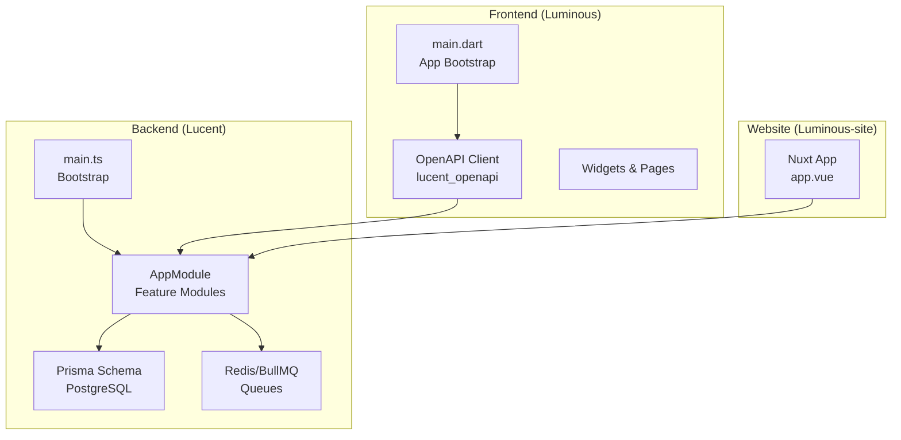
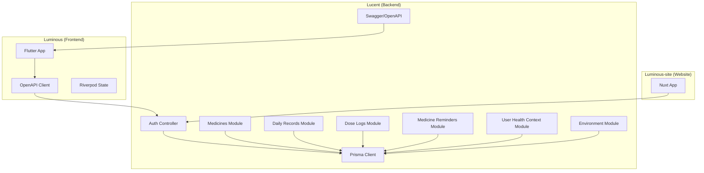
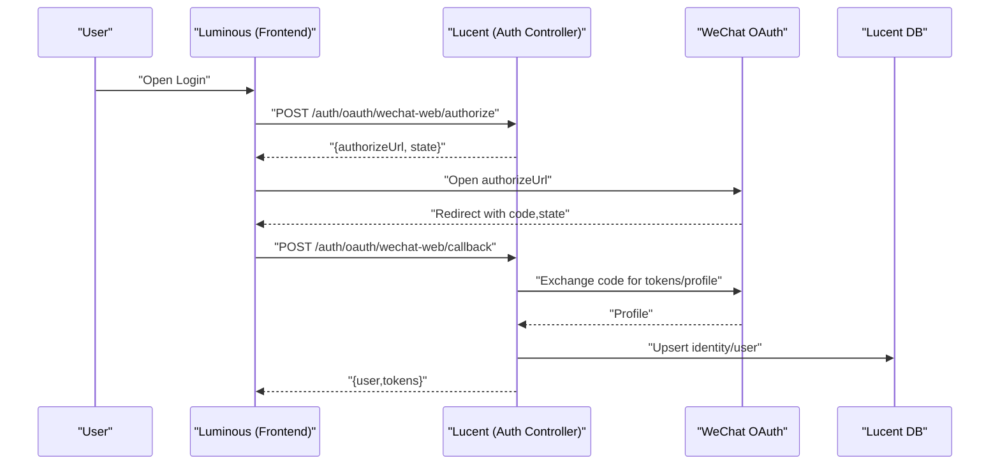
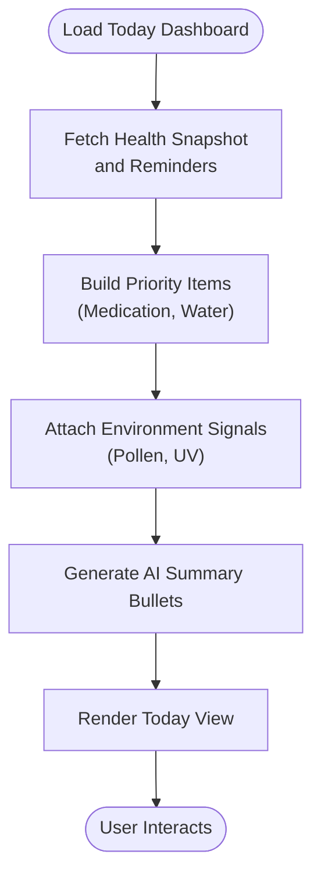
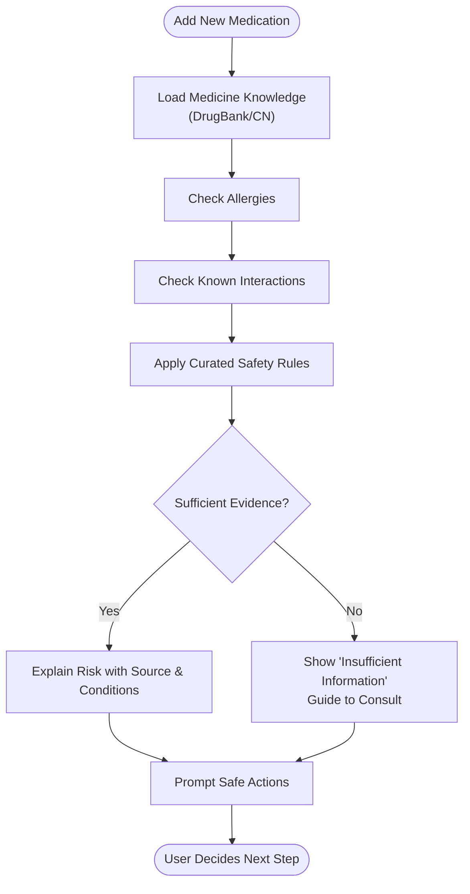
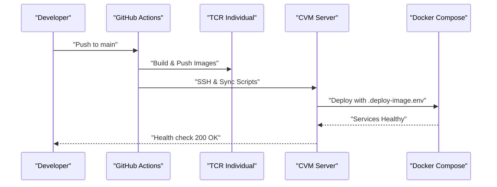
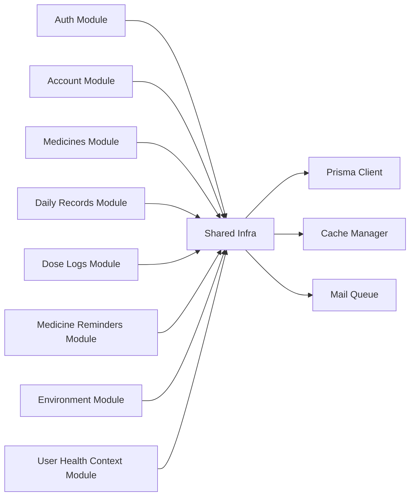

# Project Overview

<cite>
**Referenced Files in This Document**
- [Lucent README](file://Lucent/README.md)
- [Luminous README](file://Luminous/README.md)
- [Luminous-site package.json](file://Luminous-site/package.json)
- [Lucent main.ts](file://Lucent/src/main.ts)
- [Luminous main.dart](file://Luminous/lib/main.dart)
- [Lucent AppModule](file://Lucent/src/app.module.ts)
- [Luminous Product Vision](file://Luminous/docs/Product_Vision.md)
- [Lucent docs README](file://Lucent/docs/README.md)
- [Lucent Prisma schema](file://Lucent/prisma/schema.prisma)
- [Lucent package.json](file://Lucent/package.json)
- [Luminous pubspec.yaml](file://Luminous/pubspec.yaml)
- [Lucent deploy script](file://Lucent/scripts/deploy/deploy-server.sh)
- [Lucent Tencent Cloud CICD](file://Lucent/docs/tencent-cloud-cicd.md)
- [Lucent auth controller](file://Lucent/src/modules/auth/auth.controller.ts)
- [Lucent WeChat web OAuth provider](file://Lucent/src/modules/auth/wechat-web-oauth.provider.ts)
- [Lucent WeChat mobile OAuth provider](file://Lucent/src/modules/auth/wechat-mobile-oauth.provider.ts)
- [Luminous today dashboard](file://Luminous/lib/features/today/domain/entities/today_dashboard.dart)
- [Luminous today repository](file://Luminous/lib/features/today/data/repositories/lucent_today_repository.dart)
- [Luminous today view](file://Luminous/lib/features/today/presentation/widgets/today_dashboard_view.dart)
- [Luminous health context repository](file://Luminous/lib/features/health_context/data/repositories/lucent_health_context_repository.dart)
- [Luminous medicine workspace](file://Luminous/lib/features/medicine/domain/entities/medicine_workspace.dart)
- [Luminous site main](file://Luminous-site/app/app.vue)
</cite>

## Table of Contents
1. [Introduction](#introduction)
2. [Project Structure](#project-structure)
3. [Core Components](#core-components)
4. [Architecture Overview](#architecture-overview)
5. [Detailed Component Analysis](#detailed-component-analysis)
6. [Dependency Analysis](#dependency-analysis)
7. [Performance Considerations](#performance-considerations)
8. [Troubleshooting Guide](#troubleshooting-guide)
9. [Conclusion](#conclusion)

## Introduction
Lumos is a healthcare management platform designed to help university students track daily health behaviors and manage medications safely. Its core value proposition is transforming passive health searches into an active, contextual assistant that connects symptoms, water intake, diet, sleep, and medication records to deliver personalized summaries, timely reminders, and risk-aware suggestions grounded in trusted data sources.

Target users are Chinese university students who frequently self-medicate, have irregular lifestyles, and want reliable, low-risk guidance without visiting care facilities. Lumos focuses on a narrow but high-frequency set of scenarios—daily medication safety, hydration, diet, and sleep—while keeping AI outputs constrained by explicit rules, authorized data, and verifiable sources.

Key outcomes include reduced accidental medication errors, improved adherence, actionable daily insights, and safer transitions to campus medical resources when needed.

## Project Structure
Lumos comprises three primary layers:
- Backend (Lucent): A NestJS application providing secure authentication, user health context, daily records, medication tracking, reminders, environment data, and medicine knowledge.
- Mobile/Web Frontend (Luminous): A Flutter application offering a five-tab shell (Today, Record, Medicine, Report, Mine), WeChat OAuth, local storage, and a generated OpenAPI client.
- Supporting Website (Luminous-site): A Nuxt 4 site for product presentation and light demonstrations.

**Diagram sources**
- [Lucent main.ts:1-23](file://Lucent/src/main.ts#L1-L23)
- [Luminous main.dart:1-11](file://Luminous/lib/main.dart#L1-L11)
- [Lucent AppModule:1-56](file://Lucent/src/app.module.ts#L1-L56)
- [Lucent Prisma schema:1-599](file://Lucent/prisma/schema.prisma#L1-L599)
- [Luminous pubspec.yaml:63-64](file://Luminous/pubspec.yaml#L63-L64)
- [Luminous-site package.json:1-26](file://Luminous-site/package.json#L1-L26)

**Section sources**
- [Lucent README:1-84](file://Lucent/README.md#L1-L84)
- [Luminous README:1-60](file://Luminous/README.md#L1-L60)
- [Lucent docs README:1-36](file://Lucent/docs/README.md#L1-L36)

## Core Components
- Authentication and Identity
  - OAuth via WeChat Web and Mobile with stateful authorization URLs and callback handling.
  - JWT-based access/refresh tokens with secure session management.
- User Health Context
  - Profile, allergies, conditions, and current medications stored with structured enums and JSON payloads.
- Daily Records and Reminders
  - Structured logging of water, meals, vitals, mood, symptoms, activities, and notes with optional image attachments.
  - Medication reminders with scheduling, delivery tracking, and status logs.
- Medicine Knowledge
  - Integrated datasets from DrugBank and CN sources with normalized search text and metadata.
- Environment Signals
  - Optional environmental indicators (pollen, UV) for situational awareness.
- Reporting and Insights
  - Daily summaries and weekly trends (subject to privacy and contract gates).

Common use cases:
- New medication added → Safety check against known interactions/allergies/rules; prompt appears in “Today” and “Medicine.”
- End-of-day → AI generates a concise summary and tomorrow’s low-risk suggestions.
- Weekly → View trends and share anonymized reports with campus resources.

**Section sources**
- [Lucent auth controller:114-184](file://Lucent/src/modules/auth/auth.controller.ts#L114-L184)
- [Lucent WeChat web OAuth provider:1-191](file://Lucent/src/modules/auth/wechat-web-oauth.provider.ts#L1-L191)
- [Lucent WeChat mobile OAuth provider:1-52](file://Lucent/src/modules/auth/wechat-mobile-oauth.provider.ts#L1-L52)
- [Lucent Prisma schema:106-397](file://Lucent/prisma/schema.prisma#L106-L397)
- [Luminous today dashboard:1-153](file://Luminous/lib/features/today/domain/entities/today_dashboard.dart#L1-L153)
- [Luminous today repository:110-156](file://Luminous/lib/features/today/data/repositories/lucent_today_repository.dart#L110-L156)
- [Luminous today view:1115-1201](file://Luminous/lib/features/today/presentation/widgets/today_dashboard_view.dart#L1115-L1201)
- [Luminous health context repository:88-102](file://Luminous/lib/features/health_context/data/repositories/lucent_health_context_repository.dart#L88-L102)
- [Luminous medicine workspace:123-182](file://Luminous/lib/features/medicine/domain/entities/medicine_workspace.dart#L123-L182)

## Architecture Overview
High-level system architecture:
- Backend (Lucent)
  - Bootstrapped by NestFactory, configured via ConfigModule and PrismaModule.
  - Feature modules encapsulate auth, account, medicines, daily records, dose logs, reminders, environment, and user health context.
  - Uses PostgreSQL for persistence, Redis/BullMQ for queues, and AdminJS for admin panel.
- Frontend (Luminous)
  - Flutter app with Riverpod, GoRouter, and a generated OpenAPI client bound to Lucent.
  - Supports WeChat OAuth flows across platforms and desktop loopback callbacks.
- Website (Luminous-site)
  - Nuxt 4 application for marketing and demonstration.

**Diagram sources**
- [Lucent AppModule:1-56](file://Lucent/src/app.module.ts#L1-L56)
- [Lucent main.ts:1-23](file://Lucent/src/main.ts#L1-L23)
- [Luminous pubspec.yaml:63-64](file://Luminous/pubspec.yaml#L63-L64)
- [Luminous-site package.json:1-26](file://Luminous-site/package.json#L1-L26)

**Section sources**
- [Lucent README:21-47](file://Lucent/README.md#L21-L47)
- [Luminous README:8-22](file://Luminous/README.md#L8-L22)

## Detailed Component Analysis

### Authentication and OAuth Flow
Lumos supports WeChat OAuth for both web and mobile, enabling seamless sign-in and identity linking. The backend generates stateful authorization URLs, validates callbacks, and issues JWT tokens. The frontend integrates with platform-specific OAuth flows and handles desktop loopback callbacks.

**Diagram sources**
- [Lucent auth controller:114-184](file://Lucent/src/modules/auth/auth.controller.ts#L114-L184)
- [Lucent WeChat web OAuth provider:1-191](file://Lucent/src/modules/auth/wechat-web-oauth.provider.ts#L1-L191)

**Section sources**
- [Lucent auth controller:114-184](file://Lucent/src/modules/auth/auth.controller.ts#L114-L184)
- [Lucent WeChat web OAuth provider:1-191](file://Lucent/src/modules/auth/wechat-web-oauth.provider.ts#L1-L191)
- [Lucent WeChat mobile OAuth provider:1-52](file://Lucent/src/modules/auth/wechat-mobile-oauth.provider.ts#L1-L52)

### Daily Summary and Active Suggestions
The “Today” dashboard aggregates hydration, medication, environment signals, and optional meal suggestions. It surfaces priority items (e.g., pending medication doses) and concise AI-driven bullet points summarizing the day’s key points.

**Diagram sources**
- [Luminous today dashboard:1-153](file://Luminous/lib/features/today/domain/entities/today_dashboard.dart#L1-L153)
- [Luminous today repository:110-156](file://Luminous/lib/features/today/data/repositories/lucent_today_repository.dart#L110-L156)
- [Luminous today view:1115-1201](file://Luminous/lib/features/today/presentation/widgets/today_dashboard_view.dart#L1115-L1201)

**Section sources**
- [Luminous today dashboard:1-153](file://Luminous/lib/features/today/domain/entities/today_dashboard.dart#L1-L153)
- [Luminous today repository:110-156](file://Luminous/lib/features/today/data/repositories/lucent_today_repository.dart#L110-L156)
- [Luminous today view:1115-1201](file://Luminous/lib/features/today/presentation/widgets/today_dashboard_view.dart#L1115-L1201)

### Medication Safety and Risk Checks
When a user adds a new medication, Lumos performs a safety check against known sources (DrugBank/CN), allergies, current medications, and curated rules. Results are presented with explainable risk statements and safe next steps.

**Diagram sources**
- [Luminous medicine workspace:123-182](file://Luminous/lib/features/medicine/domain/entities/medicine_workspace.dart#L123-L182)
- [Lucent Prisma schema:424-519](file://Lucent/prisma/schema.prisma#L424-L519)

**Section sources**
- [Luminous medicine workspace:123-182](file://Luminous/lib/features/medicine/domain/entities/medicine_workspace.dart#L123-L182)
- [Lucent Prisma schema:424-519](file://Lucent/prisma/schema.prisma#L424-L519)

### Technology Stack Summary
- Backend (Lucent)
  - Framework: NestJS 11
  - Persistence: Prisma 7 + PostgreSQL
  - Messaging: Redis + BullMQ
  - Security: Passport JWT
  - OAuth: WeChat Web/Mobile
  - Docs: OpenAPI-generated client/docs
- Frontend (Luminous)
  - Framework: Flutter
  - Networking: OpenAPI client
  - State: Riverpod
  - OAuth: fluwx + loopback callbacks
- Website (Luminous-site)
  - Framework: Nuxt 4
  - UI: Tailwind + Pinia

**Section sources**
- [Lucent README:21-29](file://Lucent/README.md#L21-L29)
- [Luminous README:8-14](file://Luminous/README.md#L8-L14)
- [Luminous-site package.json:12-24](file://Luminous-site/package.json#L12-L24)

### Deployment Options
- Tencent Cloud CVM + TCR CI/CD
  - GitHub Actions builds and pushes Docker images to TCR Individual.
  - CVM pulls images and runs containers with docker-compose.
  - Deployment script ensures health checks and logs readiness.
- Local Development
  - Docker Compose for local stacks, Prisma migrations, and OpenAPI export.

**Diagram sources**
- [Lucent Tencent Cloud CICD:1-310](file://Lucent/docs/tencent-cloud-cicd.md#L1-L310)
- [Lucent deploy script:1-54](file://Lucent/scripts/deploy/deploy-server.sh#L1-L54)

**Section sources**
- [Lucent Tencent Cloud CICD:1-310](file://Lucent/docs/tencent-cloud-cicd.md#L1-L310)
- [Lucent deploy script:1-54](file://Lucent/scripts/deploy/deploy-server.sh#L1-L54)
- [Lucent README:30-64](file://Lucent/README.md#L30-L64)

## Dependency Analysis
- Backend modules are cohesive around business domains and depend on shared infrastructure (Config, Prisma, Cache, Mail, Logger).
- Frontend depends on a generated OpenAPI client and integrates OAuth providers per platform.
- Website consumes backend APIs for demonstrations and product pages.

**Diagram sources**
- [Lucent AppModule:1-56](file://Lucent/src/app.module.ts#L1-L56)

**Section sources**
- [Lucent AppModule:1-56](file://Lucent/src/app.module.ts#L1-L56)

## Performance Considerations
- Use Redis/BullMQ for asynchronous tasks (e.g., reminder deliveries) to avoid blocking requests.
- Index database queries on frequent filters (e.g., user ID, date ranges) to optimize daily records and reminders.
- Cache frequently accessed configuration and small reference datasets (e.g., environment signals) in Redis.
- Batch image uploads and leverage signed pre-upload URLs for cloud storage to reduce backend bandwidth.

## Troubleshooting Guide
- OAuth Failures
  - Verify WeChat app credentials and callback URIs; ensure stateful authorization URLs are consumed correctly.
  - Check network reachability to WeChat endpoints and error responses.
- Database Connectivity
  - Confirm Prisma migrations applied and connection strings match environment.
- Deployment Issues
  - Review CI/CD logs for Docker build/push failures and server-side health checks.
  - Validate TCR credentials and namespace uniqueness.

**Section sources**
- [Lucent auth controller:114-184](file://Lucent/src/modules/auth/auth.controller.ts#L114-L184)
- [Lucent WeChat web OAuth provider:150-177](file://Lucent/src/modules/auth/wechat-web-oauth.provider.ts#L150-L177)
- [Lucent deploy script:30-54](file://Lucent/scripts/deploy/deploy-server.sh#L30-L54)

## Conclusion
Lumos delivers a focused, high-impact solution for student health by combining medication safety, daily habit tracking, and contextual reminders. Its multi-platform architecture—backend-first with Flutter frontends and a lightweight website—enables rapid iteration and compliance-conscious AI outputs. By anchoring insights in verified data and explicit rules, Lumos reduces risk while building trust through transparency and user control.