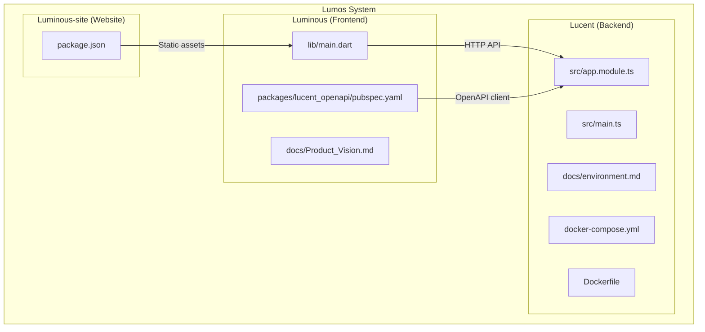
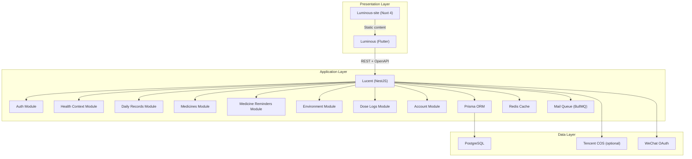
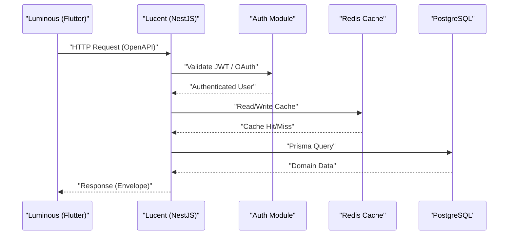
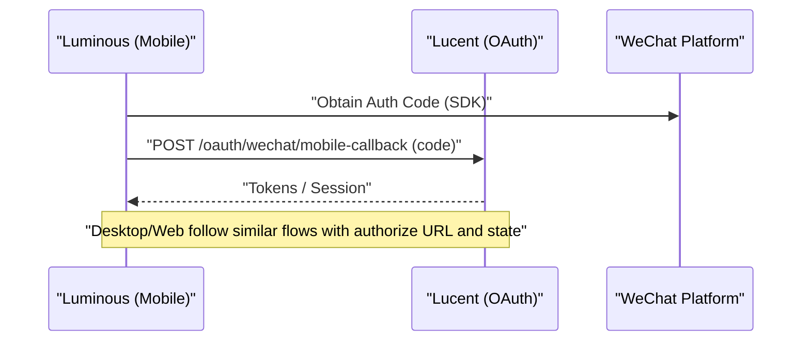
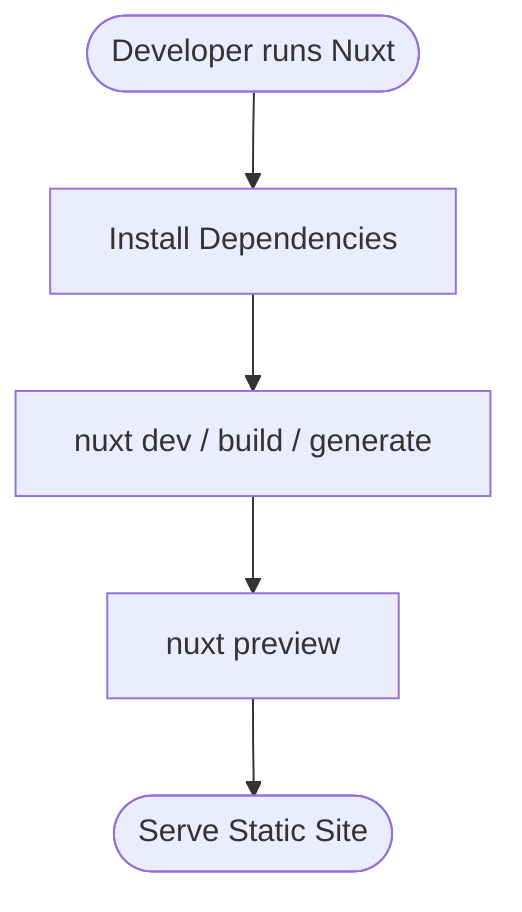
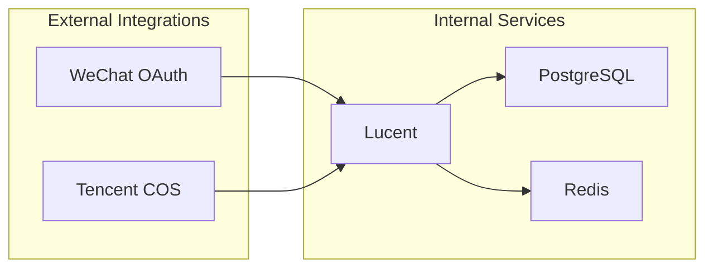
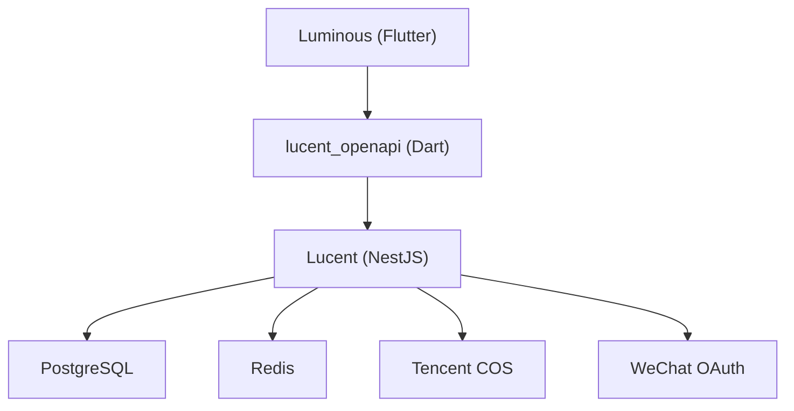
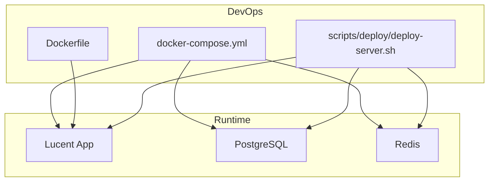

# System Architecture Overview

<cite>
**Referenced Files in This Document**
- [Lucent README.md](file://Lucent/README.md)
- [Luminous README.md](file://Luminous/README.md)
- [Luminous-site package.json](file://Luminous-site/package.json)
- [Lucent main.ts](file://Lucent/src/main.ts)
- [Lucent app.module.ts](file://Lucent/src/app.module.ts)
- [Lucent environment.md](file://Lucent/docs/environment.md)
- [Lucent docker-compose.yml](file://Lucent/docker-compose.yml)
- [Lucent Dockerfile](file://Lucent/Dockerfile)
- [Lucent deploy-server.sh](file://Lucent/scripts/deploy/deploy-server.sh)
- [Luminous main.dart](file://Luminous/lib/main.dart)
- [Luminous Product Vision.md](file://Luminous/docs/Product_Vision.md)
- [Luminous OpenAPI pubspec.yaml](file://Luminous/packages/lucent_openapi/pubspec.yaml)
</cite>

## Table of Contents
1. [Introduction](#introduction)
2. [Project Structure](#project-structure)
3. [Core Components](#core-components)
4. [Architecture Overview](#architecture-overview)
5. [Detailed Component Analysis](#detailed-component-analysis)
6. [Dependency Analysis](#dependency-analysis)
7. [Performance Considerations](#performance-considerations)
8. [Troubleshooting Guide](#troubleshooting-guide)
9. [Conclusion](#conclusion)
10. [Appendices](#appendices)

## Introduction
This document provides a system architecture overview of the Lumos ecosystem, focusing on the high-level multi-tier architecture composed of:
- Backend REST API service (Lucent)
- Cross-platform frontend (Luminous)
- Supporting website (Luminous-site)

It explains technology stack choices, component interactions, data flow patterns, modular design, microservice boundaries, integration patterns, distributed characteristics, real-time capabilities, scalability considerations, and deployment topology.

## Project Structure
The Lumos system is organized into three primary repositories:
- Lucent: NestJS-based backend REST API with modular feature domains, Prisma ORM, Redis/BullMQ, and AdminJS.
- Luminous: Flutter cross-platform application (mobile, desktop, web) consuming the backend via an OpenAPI-generated client.
- Luminous-site: Nuxt 4 static site for marketing/demo content.

**Diagram sources**
- [Lucent main.ts:1-23](file://Lucent/src/main.ts#L1-L23)
- [Lucent app.module.ts:1-56](file://Lucent/src/app.module.ts#L1-L56)
- [Lucent environment.md:1-151](file://Lucent/docs/environment.md#L1-L151)
- [Lucent docker-compose.yml:1-67](file://Lucent/docker-compose.yml#L1-L67)
- [Lucent Dockerfile:1-50](file://Lucent/Dockerfile#L1-L50)
- [Luminous main.dart:1-11](file://Luminous/lib/main.dart#L1-L11)
- [Luminous OpenAPI pubspec.yaml:1-18](file://Luminous/packages/lucent_openapi/pubspec.yaml#L1-L18)
- [Luminous-site package.json:1-26](file://Luminous-site/package.json#L1-L26)

**Section sources**
- [Lucent README.md:1-84](file://Lucent/README.md#L1-L84)
- [Luminous README.md:1-60](file://Luminous/README.md#L1-L60)
- [Luminous-site package.json:1-26](file://Luminous-site/package.json#L1-L26)

## Core Components
- Lucent (NestJS):
  - Modular domain-driven design with feature modules (auth, account, user, health context, daily records, dose logs, medicines, reminders, environment).
  - Infrastructure modules (Prisma, cache, mail, logger, i18n).
  - REST API with OpenAPI contract generation and AdminJS panel.
  - Redis-backed caching and BullMQ for async tasks.
  - OAuth integrations (WeChat Web/Mobile) and optional Tencent COS uploads.
- Luminous (Flutter):
  - Riverpod-based state management, Riverpod-based providers, and a dedicated OpenAPI client package.
  - OAuth flows spanning mobile SDK, desktop loopback, and web redirect.
  - Five-tab shell: Today, Record, Medicine, Report, Mine.
- Luminous-site (Nuxt 4):
  - Marketing/demo/static site built with Nuxt 4, Vue 3, Pinia, TailwindCSS, and internationalization.

**Section sources**
- [Lucent README.md:21-28](file://Lucent/README.md#L21-L28)
- [Lucent app.module.ts:10-24](file://Lucent/src/app.module.ts#L10-L24)
- [Luminous README.md:9-14](file://Luminous/README.md#L9-L14)
- [Luminous OpenAPI pubspec.yaml:1-18](file://Luminous/packages/lucent_openapi/pubspec.yaml#L1-L18)
- [Luminous-site package.json:12-24](file://Luminous-site/package.json#L12-L24)

## Architecture Overview
The Lumos system follows a classic multi-tier architecture:
- Presentation tier: Luminous (Flutter) and Luminous-site (Nuxt).
- Application tier: Lucent (NestJS) exposes REST APIs and orchestrates domain logic.
- Data tier: PostgreSQL via Prisma; Redis for caching and job queues; optional external integrations (WeChat OAuth, Tencent COS).

**Diagram sources**
- [Lucent app.module.ts:10-24](file://Lucent/src/app.module.ts#L10-L24)
- [Lucent environment.md:73-115](file://Lucent/docs/environment.md#L73-L115)
- [Luminous README.md:9-14](file://Luminous/README.md#L9-L14)
- [Luminous-site package.json:12-24](file://Luminous-site/package.json#L12-L24)

## Detailed Component Analysis

### Backend REST API (Lucent)
- Bootstrap and configuration:
  - Bootstrapped via NestFactory with Winston logging and AdminJS registration.
  - Centralized configuration loading and environment validation.
- Modules and boundaries:
  - Auth, Account, User, Health Context, Daily Records, Medicine Dose Logs, Medicines, Medicine Reminders, Environment.
  - Each module encapsulates domain logic, DTOs, controllers, and services.
- Data persistence and caching:
  - Prisma manages schema and queries against PostgreSQL.
  - Redis-backed cache via Nest cache manager; memory fallback when Redis unavailable.
- Async processing:
  - BullMQ queue for mail delivery and future background jobs.
- Security and identity:
  - Passport JWT for sessionless auth.
  - OAuth providers (WeChat Web/Mobile) with state caching and loopback callbacks.
- Uploads:
  - Presigned Tencent COS URLs for direct client-to-COS uploads.
- Observability:
  - Health check endpoint and AdminJS panel.

**Diagram sources**
- [Lucent main.ts:9-20](file://Lucent/src/main.ts#L9-L20)
- [Lucent app.module.ts:26-50](file://Lucent/src/app.module.ts#L26-L50)
- [Lucent environment.md:137-147](file://Lucent/docs/environment.md#L137-L147)

**Section sources**
- [Lucent main.ts:1-23](file://Lucent/src/main.ts#L1-L23)
- [Lucent app.module.ts:1-56](file://Lucent/src/app.module.ts#L1-L56)
- [Lucent environment.md:1-151](file://Lucent/docs/environment.md#L1-L151)

### Cross-Platform Frontend (Luminous)
- Initialization:
  - Flutter app bootstrapped with Riverpod providers and optional .env loading.
- API client:
  - OpenAPI-generated Dart client package consumed by the app.
- OAuth integration:
  - Mobile: WeChat SDK obtains auth code; calls backend mobile OAuth callback.
  - Desktop: Loopback callback listener requests authorize URL from backend, opens browser, validates state, auto-completes login.
  - Web: Uses backend OAuth authorize endpoint with appropriate callback path.
- Feature shell:
  - Five-tab navigation: Today, Record, Medicine, Report, Mine.
- CI and testing:
  - GitHub Actions workflow covering validation and tests; integration tests per module.

**Diagram sources**
- [Luminous README.md:14-21](file://Luminous/README.md#L14-L21)
- [Lucent environment.md:90-115](file://Lucent/docs/environment.md#L90-L115)

**Section sources**
- [Luminous main.dart:1-11](file://Luminous/lib/main.dart#L1-L11)
- [Luminous README.md:1-60](file://Luminous/README.md#L1-L60)
- [Luminous OpenAPI pubspec.yaml:1-18](file://Luminous/packages/lucent_openapi/pubspec.yaml#L1-L18)

### Supporting Website (Luminous-site)
- Technology stack:
  - Nuxt 4, Vue 3, Pinia, TailwindCSS, Nuxt UI, Nuxt Image, Nuxt i18n.
- Purpose:
  - Static marketing/demo pages; integrates with frontend via shared assets and links.

**Diagram sources**
- [Luminous-site package.json:5-11](file://Luminous-site/package.json#L5-L11)

**Section sources**
- [Luminous-site package.json:1-26](file://Luminous-site/package.json#L1-L26)

### System Context and Integration Patterns
- Contract-first API:
  - OpenAPI contract drives both backend controllers and frontend client generation.
- Domain-driven modularity:
  - Feature modules isolate concerns; shared infrastructure modules (cache, mail, logger, i18n) reduce coupling.
- Authentication and identity:
  - JWT for stateless access; OAuth for social sign-in with platform-specific flows.
- Real-time and near-real-time:
  - Active reminders and notifications are scheduled via backend; clients poll or rely on push notifications per platform.
- Data sources:
  - Medicine knowledge imported via scripts; cache tiers applied for search and detail endpoints.

**Diagram sources**
- [Lucent environment.md:90-115](file://Lucent/docs/environment.md#L90-L115)
- [Lucent docker-compose.yml:1-67](file://Lucent/docker-compose.yml#L1-L67)

**Section sources**
- [Lucent environment.md:1-151](file://Lucent/docs/environment.md#L1-L151)

## Dependency Analysis
- Internal dependencies:
  - Luminous depends on the OpenAPI client package for backend contracts.
  - Lucent composes multiple feature modules and infrastructure modules.
- External dependencies:
  - Lucent relies on PostgreSQL, Redis, optional Tencent COS, and WeChat OAuth.
  - Luminous depends on Flutter, Riverpod, and the OpenAPI client.
  - Luminous-site depends on Nuxt 4 ecosystem and UI libraries.

**Diagram sources**
- [Luminous OpenAPI pubspec.yaml:10-12](file://Luminous/packages/lucent_openapi/pubspec.yaml#L10-L12)
- [Lucent app.module.ts:10-24](file://Lucent/src/app.module.ts#L10-L24)
- [Lucent environment.md:90-115](file://Lucent/docs/environment.md#L90-L115)

**Section sources**
- [Luminous OpenAPI pubspec.yaml:1-18](file://Luminous/packages/lucent_openapi/pubspec.yaml#L1-L18)
- [Lucent app.module.ts:1-56](file://Lucent/src/app.module.ts#L1-L56)

## Performance Considerations
- Caching strategy:
  - Redis-backed Nest cache with memory fallback; cache TTLs configured for medicine search/detail.
  - Frontend may bypass cache via request header for specific reads.
- Asynchronous processing:
  - BullMQ queue offloads non-critical tasks (e.g., mail) to improve latency.
- Database scaling:
  - Prisma schema migrations support controlled evolution; consider read replicas and connection pooling for growth.
- CDN and uploads:
  - Direct client-to-COS uploads reduce backend bandwidth; ensure signed URL policies align with security posture.
- Containerization:
  - Multi-stage Docker build reduces production image size; healthchecks and readiness probes ensure resilient deployments.

**Section sources**
- [Lucent environment.md:137-147](file://Lucent/docs/environment.md#L137-L147)
- [Lucent Dockerfile:1-50](file://Lucent/Dockerfile#L1-L50)
- [Lucent docker-compose.yml:53-62](file://Lucent/docker-compose.yml#L53-L62)

## Troubleshooting Guide
- Health checks:
  - Use the documented health endpoint to verify service readiness.
- Local stack:
  - Bring up Postgres and Redis locally; confirm ports and credentials match environment configuration.
- Deployment:
  - Use the deployment script to pull images, start base services, and roll out the app with health checks.
- Environment variables:
  - Ensure required production variables are present; avoid broad CORS origins in production.
- OAuth troubleshooting:
  - Validate WeChat app credentials and redirect URIs; verify state caching and loopback callback handling.

**Section sources**
- [Lucent environment.md:43-88](file://Lucent/docs/environment.md#L43-L88)
- [Lucent docker-compose.yml:34-62](file://Lucent/docker-compose.yml#L34-L62)
- [Lucent deploy-server.sh:1-92](file://Lucent/scripts/deploy/deploy-server.sh#L1-L92)

## Conclusion
The Lumos system employs a clean separation of concerns across three components:
- Lucent delivers a robust, modular REST API with strong observability and extensibility.
- Luminous provides a cohesive, cross-platform user experience with a contract-driven client and flexible OAuth flows.
- Luminous-site offers a lightweight marketing/demo surface aligned with the product vision.

Together, they form a scalable, distributed system capable of evolving with the product’s needs while maintaining clear microservice boundaries and integration patterns.

## Appendices

### Deployment Topology and Infrastructure Requirements
- Containers:
  - Lucent app, PostgreSQL, and Redis orchestrated via docker-compose.
- Images and registry:
  - Deployment script pulls images from a registry and deploys services with health checks.
- Ports and exposure:
  - App listens on port 3000; databases expose standard ports for local development.

**Diagram sources**
- [Lucent docker-compose.yml:1-67](file://Lucent/docker-compose.yml#L1-L67)
- [Lucent Dockerfile:1-50](file://Lucent/Dockerfile#L1-L50)
- [Lucent deploy-server.sh:1-92](file://Lucent/scripts/deploy/deploy-server.sh#L1-L92)

**Section sources**
- [Lucent docker-compose.yml:1-67](file://Lucent/docker-compose.yml#L1-L67)
- [Lucent Dockerfile:1-50](file://Lucent/Dockerfile#L1-L50)
- [Lucent deploy-server.sh:1-92](file://Lucent/scripts/deploy/deploy-server.sh#L1-L92)